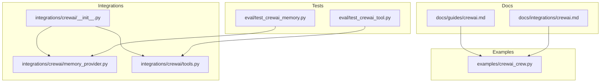
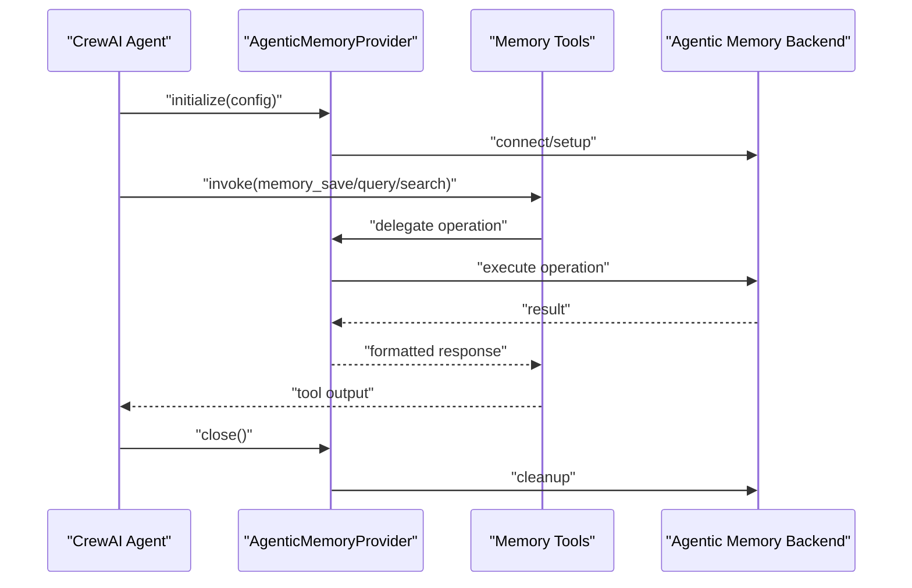
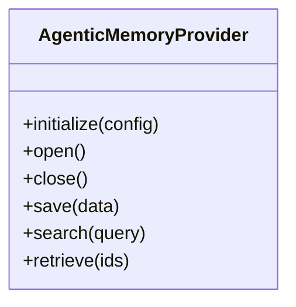
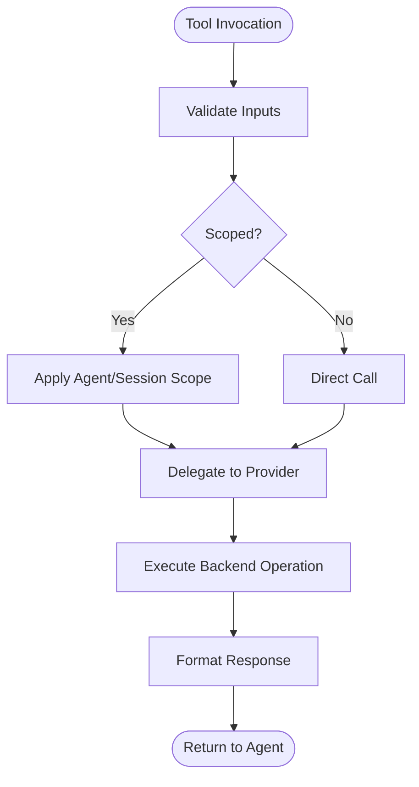
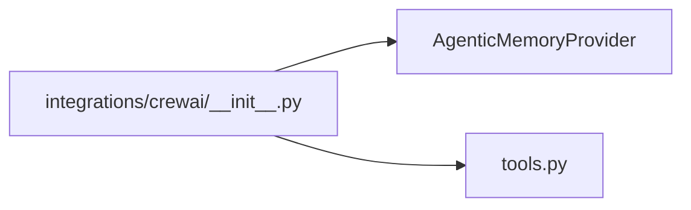
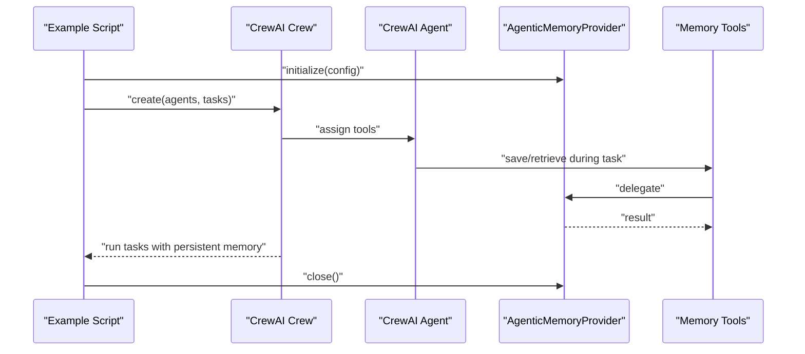
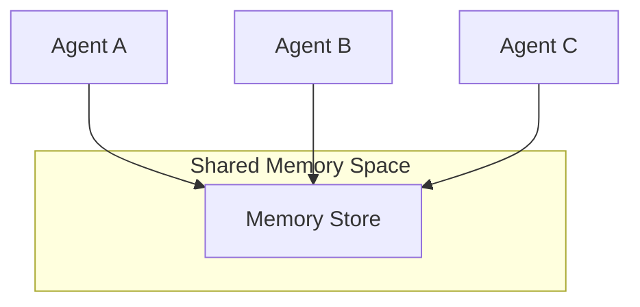
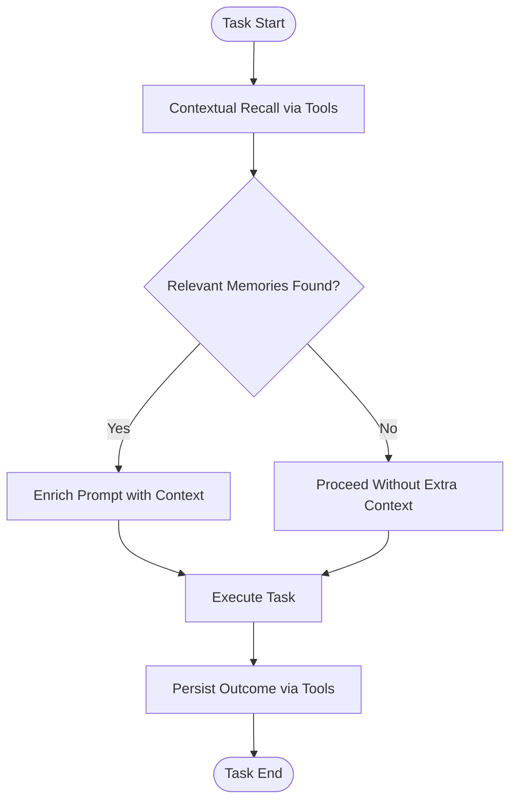
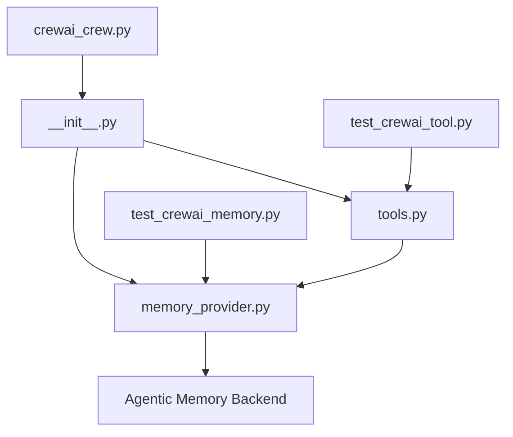

# CrewAI Integration

<cite>
**Referenced Files in This Document**
- [crewai/__init__.py](file://agentic_memory/integrations/crewai/__init__.py)
- [memory_provider.py](file://agentic_memory/integrations/crewai/memory_provider.py)
- [tools.py](file://agentic_memory/integrations/crewai/tools.py)
- [crewai.md](file://docs/guides/crewai.md)
- [crewai.md](file://docs/integrations/crewai.md)
- [crewai_crew.py](file://examples/crewai_crew.py)
- [test_crewai_memory.py](file://eval/test_crewai_memory.py)
- [test_crewai_tool.py](file://eval/test_crewai_tool.py)
</cite>

## Table of Contents
1. [Introduction](#introduction)
2. [Project Structure](#project-structure)
3. [Core Components](#core-components)
4. [Architecture Overview](#architecture-overview)
5. [Detailed Component Analysis](#detailed-component-analysis)
6. [Dependency Analysis](#dependency-analysis)
7. [Performance Considerations](#performance-considerations)
8. [Troubleshooting Guide](#troubleshooting-guide)
9. [Conclusion](#conclusion)
10. [Appendices](#appendices)

## Introduction
This document explains how to integrate Agentic Memory with CrewAI, focusing on the memory provider implementation and tool registration. It covers initialization and configuration of the AgenticMemoryProvider, lifecycle management, using memory tools within Crew workflows, multi-agent scenarios, shared memory spaces, and practical examples for building crews with persistent memory, cross-agent knowledge sharing, and context-aware task execution.

## Project Structure
The CrewAI integration is implemented under the integrations package and includes:
- A memory provider that adapts Agentic Memory to CrewAI’s expected interfaces
- Tool definitions that expose memory operations to agents
- Guides and examples demonstrating end-to-end usage

**Diagram sources**
- [crewai/__init__.py](file://agentic_memory/integrations/crewai/__init__.py)
- [memory_provider.py](file://agentic_memory/integrations/crewai/memory_provider.py)
- [tools.py](file://agentic_memory/integrations/crewai/tools.py)
- [crewai.md](file://docs/guides/crewai.md)
- [crewai.md](file://docs/integrations/crewai.md)
- [crewai_crew.py](file://examples/crewai_crew.py)
- [test_crewai_memory.py](file://eval/test_crewai_memory.py)
- [test_crewai_tool.py](file://eval/test_crewai_tool.py)

**Section sources**
- [crewai/__init__.py](file://agentic_memory/integrations/crewai/__init__.py)
- [memory_provider.py](file://agentic_memory/integrations/crewai/memory_provider.py)
- [tools.py](file://agentic_memory/integrations/crewai/tools.py)
- [crewai.md](file://docs/guides/crewai.md)
- [crewai.md](file://docs/integrations/crewai.md)
- [crewai_crew.py](file://examples/crewai_crew.py)
- [test_crewai_memory.py](file://eval/test_crewai_memory.py)
- [test_crewai_tool.py](file://eval/test_crewai_tool.py)

## Core Components
- AgenticMemoryProvider: Implements a memory interface compatible with CrewAI agents, handling initialization, configuration, and lifecycle (open/close). It exposes methods for saving, retrieving, and searching memories, and integrates with CrewAI’s agent memory contract.
- Memory Tools: A set of tools registered with CrewAI that allow agents to perform memory operations such as saving facts, querying context, and managing sessions. These tools are designed to be invoked by agents during task execution.

Key responsibilities:
- Initialization and configuration: Accepts connection or client parameters and prepares the underlying memory subsystem.
- Lifecycle management: Ensures resources are opened at agent start and closed at agent shutdown.
- Tool registration: Exposes callable functions that CrewAI can bind to agents.

**Section sources**
- [memory_provider.py](file://agentic_memory/integrations/crewai/memory_provider.py)
- [tools.py](file://agentic_memory/integrations/crewai/tools.py)

## Architecture Overview
The integration connects CrewAI agents to Agentic Memory via a provider and tools. Agents call tools to persist and retrieve information; the provider coordinates with the memory backend and enforces scoping and persistence semantics.

**Diagram sources**
- [memory_provider.py](file://agentic_memory/integrations/crewai/memory_provider.py)
- [tools.py](file://agentic_memory/integrations/crewai/tools.py)

## Detailed Component Analysis

### AgenticMemoryProvider
The provider implements the CrewAI-compatible memory interface. It manages:
- Initialization: Accepts configuration such as connection details, session identifiers, and optional scoping parameters.
- Configuration: Resolves defaults, validates inputs, and sets up internal state required for memory operations.
- Lifecycle: Provides open/close semantics to ensure proper resource management across agent runs.
- Operations: Delegates save, search, and retrieval calls to the underlying memory system through consistent APIs.

**Diagram sources**
- [memory_provider.py](file://agentic_memory/integrations/crewai/memory_provider.py)

**Section sources**
- [memory_provider.py](file://agentic_memory/integrations/crewai/memory_provider.py)

### Memory Tools
Tools expose memory capabilities to agents. Typical operations include:
- Saving structured or unstructured content
- Querying relevant context based on natural language prompts
- Managing session-scoped data
- Sharing knowledge across agents when configured

**Diagram sources**
- [tools.py](file://agentic_memory/integrations/crewai/tools.py)
- [memory_provider.py](file://agentic_memory/integrations/crewai/memory_provider.py)

**Section sources**
- [tools.py](file://agentic_memory/integrations/crewai/tools.py)

### Integration Entry Point
The integrations package exposes the provider and tools for import and use in CrewAI projects. It centralizes imports and re-exports key classes and functions.

**Diagram sources**
- [crewai/__init__.py](file://agentic_memory/integrations/crewai/__init__.py)
- [memory_provider.py](file://agentic_memory/integrations/crewai/memory_provider.py)
- [tools.py](file://agentic_memory/integrations/crewai/tools.py)

**Section sources**
- [crewai/__init__.py](file://agentic_memory/integrations/crewai/__init__.py)

### Example Crew with Persistent Memory
The example demonstrates constructing a CrewAI crew that uses the memory provider and tools to maintain persistent context across tasks and agents.

**Diagram sources**
- [crewai_crew.py](file://examples/crewai_crew.py)
- [memory_provider.py](file://agentic_memory/integrations/crewai/memory_provider.py)
- [tools.py](file://agentic_memory/integrations/crewai/tools.py)

**Section sources**
- [crewai_crew.py](file://examples/crewai_crew.py)

### Multi-Agent Scenarios and Shared Memory Spaces
For multi-agent setups, configure agents to share a common memory scope or tenant so they can read and write to the same knowledge base. The provider supports scoping parameters that determine visibility and isolation boundaries.

[No sources needed since this diagram shows conceptual workflow, not actual code structure]

**Section sources**
- [memory_provider.py](file://agentic_memory/integrations/crewai/memory_provider.py)
- [tools.py](file://agentic_memory/integrations/crewai/tools.py)

### Context-Aware Task Execution
Agents can query relevant context before executing tasks. The tools enable semantic search and retrieval, allowing agents to tailor responses based on prior interactions and stored knowledge.

**Diagram sources**
- [tools.py](file://agentic_memory/integrations/crewai/tools.py)
- [memory_provider.py](file://agentic_memory/integrations/crewai/memory_provider.py)

**Section sources**
- [tools.py](file://agentic_memory/integrations/crewai/tools.py)
- [memory_provider.py](file://agentic_memory/integrations/crewai/memory_provider.py)

## Dependency Analysis
The CrewAI integration depends on:
- The provider module for core memory operations and lifecycle
- The tools module for exposing agent-callable functions
- The example script for end-to-end usage patterns
- Tests validating behavior and correctness

**Diagram sources**
- [memory_provider.py](file://agentic_memory/integrations/crewai/memory_provider.py)
- [tools.py](file://agentic_memory/integrations/crewai/tools.py)
- [crewai/__init__.py](file://agentic_memory/integrations/crewai/__init__.py)
- [crewai_crew.py](file://examples/crewai_crew.py)
- [test_crewai_memory.py](file://eval/test_crewai_memory.py)
- [test_crewai_tool.py](file://eval/test_crewai_tool.py)

**Section sources**
- [memory_provider.py](file://agentic_memory/integrations/crewai/memory_provider.py)
- [tools.py](file://agentic_memory/integrations/crewai/tools.py)
- [crewai/__init__.py](file://agentic_memory/integrations/crewai/__init__.py)
- [crewai_crew.py](file://examples/crewai_crew.py)
- [test_crewai_memory.py](file://eval/test_crewai_memory.py)
- [test_crewai_tool.py](file://eval/test_crewai_tool.py)

## Performance Considerations
- Batch operations: Prefer batching saves and queries where possible to reduce overhead.
- Scoping efficiency: Use appropriate scopes to limit search space and improve recall performance.
- Resource lifecycle: Ensure providers are opened once per process and closed cleanly to avoid leaks.
- Tool invocation cost: Cache frequently used results at the application layer if safe and consistent.

[No sources needed since this section provides general guidance]

## Troubleshooting Guide
Common issues and resolutions:
- Initialization failures: Verify configuration parameters and connectivity to the memory backend.
- Missing tools: Confirm that tools are registered with agents and accessible during task execution.
- Persistence not observed: Check that agents invoke save operations and that the provider is properly closed after runs.
- Cross-agent visibility: Ensure shared memory scope or tenant settings are correctly configured.

Validation references:
- Provider behavior tests
- Tool invocation tests

**Section sources**
- [test_crewai_memory.py](file://eval/test_crewai_memory.py)
- [test_crewai_tool.py](file://eval/test_crewai_tool.py)

## Conclusion
The CrewAI integration enables agents to leverage persistent, searchable memory through a well-defined provider and a set of tools. By initializing the provider, registering tools, and configuring shared memory scopes, you can build crews with robust context retention, cross-agent knowledge sharing, and context-aware task execution.

[No sources needed since this section summarizes without analyzing specific files]

## Appendices

### Practical Usage References
- Guides and documentation:
  - [docs/guides/crewai.md](file://docs/guides/crewai.md)
  - [docs/integrations/crewai.md](file://docs/integrations/crewai.md)
- Example crew:
  - [examples/crewai_crew.py](file://examples/crewai_crew.py)

**Section sources**
- [crewai.md](file://docs/guides/crewai.md)
- [crewai.md](file://docs/integrations/crewai.md)
- [crewai_crew.py](file://examples/crewai_crew.py)