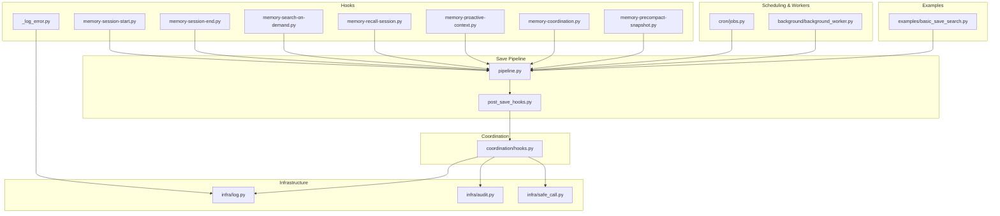
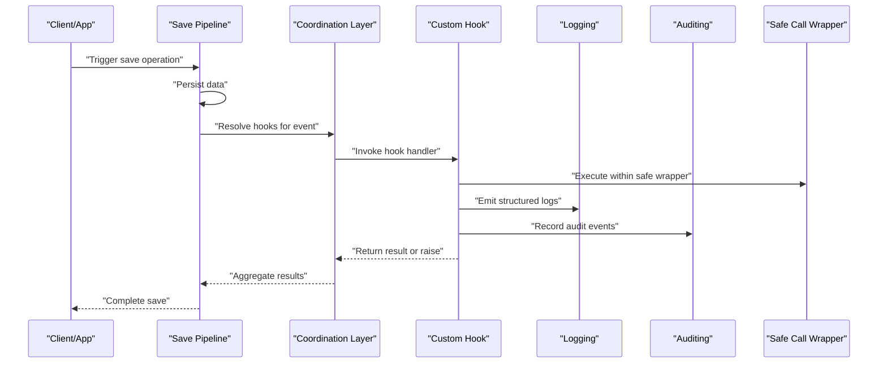
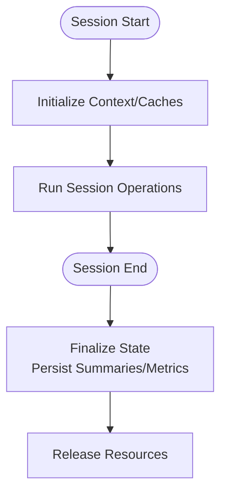
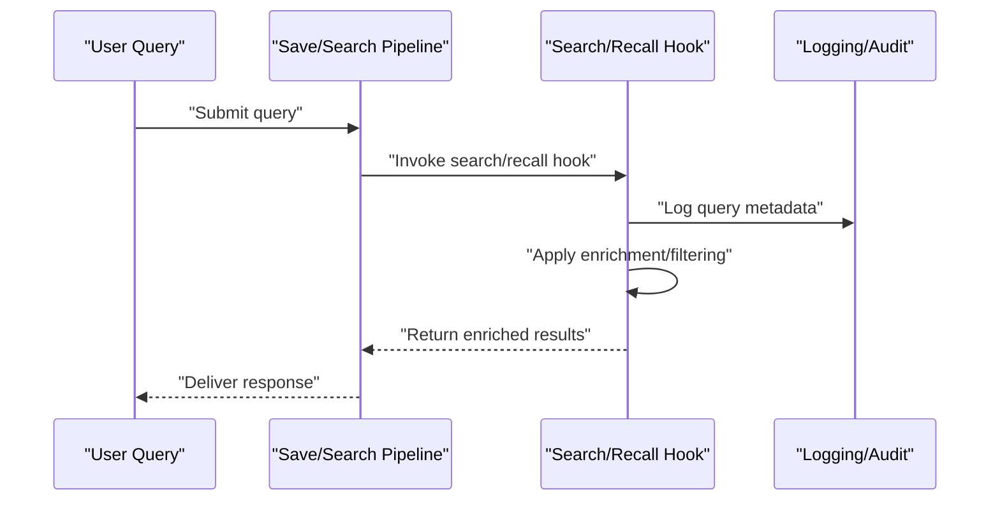
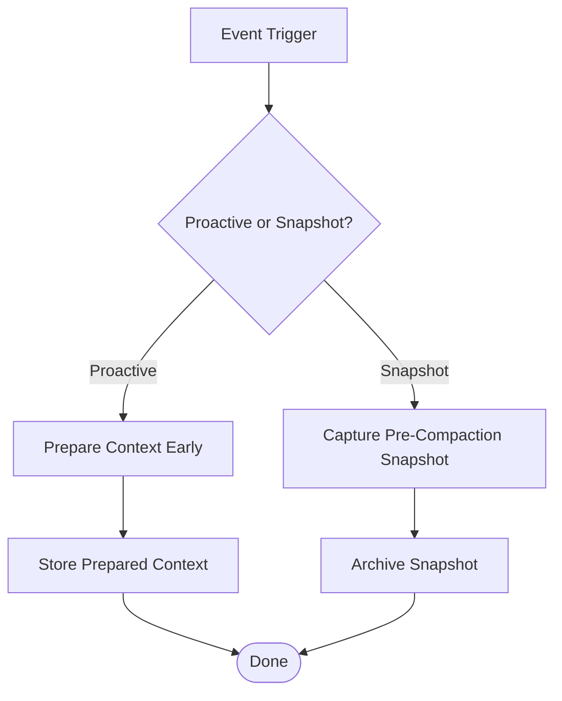
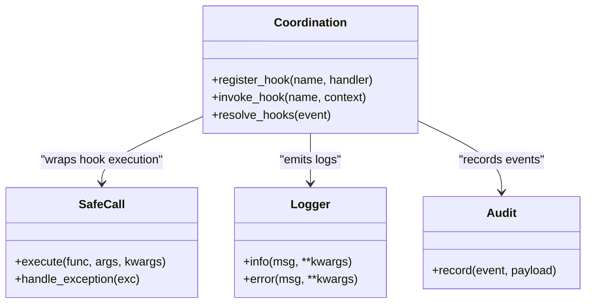
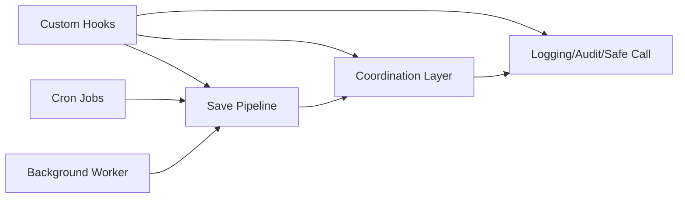

# Custom Hook Development Guide

<cite>
**Referenced Files in This Document**
- [hooks/memory-session-start.py](file://hooks/memory-session-start.py)
- [hooks/memory-session-end.py](file://hooks/memory-session-end.py)
- [hooks/memory-search-on-demand.py](file://hooks/memory-search-on-demand.py)
- [hooks/memory-recall-session.py](file://hooks/memory-recall-session.py)
- [hooks/memory-proactive-context.py](file://hooks/memory-proactive-context.py)
- [hooks/memory-coordination.py](file://hooks/memory-coordination.py)
- [hooks/memory-precompact-snapshot.py](file://hooks/memory-precompact-snapshot.py)
- [hooks/_log_error.py](file://hooks/_log_error.py)
- [save/post_save_hooks.py](file://save/post_save_hooks.py)
- [save/pipeline.py](file://save/pipeline.py)
- [coordination/hooks.py](file://coordination/hooks.py)
- [infra/log.py](file://infra/log.py)
- [infra/audit.py](file://infra/audit.py)
- [infra/safe_call.py](file://infra/safe_call.py)
- [cron/jobs.py](file://cron/jobs.py)
- [background/background_worker.py](file://background/background_worker.py)
- [examples/basic_save_search.py](file://examples/basic_save_search.py)
- [docs/how-to/add-a-claude-code-hook.md](file://docs/how-to/add-a-claude-code-hook.md)
</cite>

## Table of Contents
1. [Introduction](#introduction)
2. [Project Structure](#project-structure)
3. [Core Components](#core-components)
4. [Architecture Overview](#architecture-overview)
5. [Detailed Component Analysis](#detailed-component-analysis)
6. [Dependency Analysis](#dependency-analysis)
7. [Performance Considerations](#performance-considerations)
8. [Troubleshooting Guide](#troubleshooting-guide)
9. [Conclusion](#conclusion)
10. [Appendices](#appendices)

## Introduction
This guide explains how to develop custom hooks from scratch for the system, covering the hook development workflow, testing strategies, deployment patterns, and operational best practices. It includes step-by-step tutorials for common use cases such as compliance enforcement, analytics collection, notification systems, and workflow automation. It also provides guidance on debugging techniques, logging best practices, and performance profiling tailored to custom hooks.

## Project Structure
The repository organizes hook-related code under dedicated directories:
- hooks/: Built-in hook scripts that integrate with memory lifecycle events and search/recall flows
- save/: Save pipeline orchestration and post-save hook execution
- coordination/hooks.py: Coordination utilities for hook wiring and lifecycle management
- infra/: Cross-cutting concerns like logging, auditing, safe execution wrappers
- cron/ and background/: Scheduling and background workers that can trigger or observe hook-driven workflows
- examples/: Minimal runnable examples demonstrating save/search usage patterns
- docs/how-to/: How-to guides including adding a Claude Code hook

**Diagram sources**
- [hooks/memory-session-start.py](file://hooks/memory-session-start.py)
- [hooks/memory-session-end.py](file://hooks/memory-session-end.py)
- [hooks/memory-search-on-demand.py](file://hooks/memory-search-on-demand.py)
- [hooks/memory-recall-session.py](file://hooks/memory-recall-session.py)
- [hooks/memory-proactive-context.py](file://hooks/memory-proactive-context.py)
- [hooks/memory-coordination.py](file://hooks/memory-coordination.py)
- [hooks/memory-precompact-snapshot.py](file://hooks/memory-precompact-snapshot.py)
- [hooks/_log_error.py](file://hooks/_log_error.py)
- [save/pipeline.py](file://save/pipeline.py)
- [save/post_save_hooks.py](file://save/post_save_hooks.py)
- [coordination/hooks.py](file://coordination/hooks.py)
- [infra/log.py](file://infra/log.py)
- [infra/audit.py](file://infra/audit.py)
- [infra/safe_call.py](file://infra/safe_call.py)
- [cron/jobs.py](file://cron/jobs.py)
- [background/background_worker.py](file://background/background_worker.py)
- [examples/basic_save_search.py](file://examples/basic_save_search.py)

**Section sources**
- [save/pipeline.py](file://save/pipeline.py)
- [save/post_save_hooks.py](file://save/post_save_hooks.py)
- [coordination/hooks.py](file://coordination/hooks.py)
- [infra/log.py](file://infra/log.py)
- [infra/audit.py](file://infra/audit.py)
- [infra/safe_call.py](file://infra/safe_call.py)
- [hooks/memory-session-start.py](file://hooks/memory-session-start.py)
- [hooks/memory-session-end.py](file://hooks/memory-session-end.py)
- [hooks/memory-search-on-demand.py](file://hooks/memory-search-on-demand.py)
- [hooks/memory-recall-session.py](file://hooks/memory-recall-session.py)
- [hooks/memory-proactive-context.py](file://hooks/memory-proactive-context.py)
- [hooks/memory-coordination.py](file://hooks/memory-coordination.py)
- [hooks/memory-precompact-snapshot.py](file://hooks/memory-precompact-snapshot.py)
- [hooks/_log_error.py](file://hooks/_log_error.py)
- [cron/jobs.py](file://cron/jobs.py)
- [background/background_worker.py](file://background/background_worker.py)
- [examples/basic_save_search.py](file://examples/basic_save_search.py)

## Core Components
- Hook entry points: The hooks directory contains event-driven scripts that integrate with memory session start/end, search-on-demand, recall, proactive context enrichment, pre-compaction snapshots, and coordination tasks. These are designed to be invoked by the save pipeline and related subsystems.
- Save pipeline integration: The save pipeline orchestrates data mutations and triggers post-save hooks. Post-save hooks provide a stable extension point for side effects such as indexing, notifications, and analytics.
- Coordination layer: A coordination module centralizes hook registration, lifecycle management, and cross-process safety. It integrates with logging, auditing, and safe execution wrappers to ensure robustness.
- Infrastructure utilities: Logging, auditing, and safe call wrappers are used across hooks to standardize observability and resilience.

Key responsibilities:
- Hooks: Implement domain-specific logic triggered by system events (e.g., session start/end, search, recall).
- Save pipeline: Execute hooks deterministically after successful writes.
- Coordination: Manage hook discovery, configuration, and error isolation.
- Infra: Provide consistent logging, audit trails, and fault containment.

**Section sources**
- [save/pipeline.py](file://save/pipeline.py)
- [save/post_save_hooks.py](file://save/post_save_hooks.py)
- [coordination/hooks.py](file://coordination/hooks.py)
- [infra/log.py](file://infra/log.py)
- [infra/audit.py](file://infra/audit.py)
- [infra/safe_call.py](file://infra/safe_call.py)

## Architecture Overview
The hook architecture follows an event-driven model:
- Events originate from core operations (session lifecycle, search/recall, compaction).
- The save pipeline coordinates hook invocation after persistence.
- Coordination ensures hooks are discoverable and safely executed.
- Infrastructure layers provide logging, auditing, and safe execution.

**Diagram sources**
- [save/pipeline.py](file://save/pipeline.py)
- [save/post_save_hooks.py](file://save/post_save_hooks.py)
- [coordination/hooks.py](file://coordination/hooks.py)
- [infra/log.py](file://infra/log.py)
- [infra/audit.py](file://infra/audit.py)
- [infra/safe_call.py](file://infra/safe_call.py)

## Detailed Component Analysis

### Session Lifecycle Hooks
Session start and end hooks allow you to initialize or finalize resources around user sessions. Typical responsibilities include:
- Preparing context or caches at session start
- Persisting summaries or metrics at session end
- Ensuring cleanup and releasing external resources

Implementation pattern:
- Define a hook script in hooks/ with a clear entry function
- Use infrastructure logging and auditing for traceability
- Keep hooks idempotent and resilient to partial failures

**Diagram sources**
- [hooks/memory-session-start.py](file://hooks/memory-session-start.py)
- [hooks/memory-session-end.py](file://hooks/memory-session-end.py)

**Section sources**
- [hooks/memory-session-start.py](file://hooks/memory-session-start.py)
- [hooks/memory-session-end.py](file://hooks/memory-session-end.py)

### Search and Recall Hooks
Search-on-demand and recall hooks extend retrieval behavior:
- Enrich queries with additional context
- Apply filters or reranking policies
- Record analytics about query patterns and outcomes

**Diagram sources**
- [hooks/memory-search-on-demand.py](file://hooks/memory-search-on-demand.py)
- [hooks/memory-recall-session.py](file://hooks/memory-recall-session.py)
- [save/pipeline.py](file://save/pipeline.py)

**Section sources**
- [hooks/memory-search-on-demand.py](file://hooks/memory-search-on-demand.py)
- [hooks/memory-recall-session.py](file://hooks/memory-recall-session.py)
- [save/pipeline.py](file://save/pipeline.py)

### Proactive Context and Pre-Compaction Hooks
Proactive context hooks anticipate future needs by preparing context before it is requested. Pre-compaction snapshot hooks capture state prior to compaction to preserve historical fidelity.

**Diagram sources**
- [hooks/memory-proactive-context.py](file://hooks/memory-proactive-context.py)
- [hooks/memory-precompact-snapshot.py](file://hooks/memory-precompact-snapshot.py)

**Section sources**
- [hooks/memory-proactive-context.py](file://hooks/memory-proactive-context.py)
- [hooks/memory-precompact-snapshot.py](file://hooks/memory-precompact-snapshot.py)

### Coordination and Error Handling
The coordination module centralizes hook management and integrates with safe execution and auditing. The error logging helper provides standardized error reporting.

**Diagram sources**
- [coordination/hooks.py](file://coordination/hooks.py)
- [infra/safe_call.py](file://infra/safe_call.py)
- [infra/log.py](file://infra/log.py)
- [infra/audit.py](file://infra/audit.py)
- [hooks/_log_error.py](file://hooks/_log_error.py)

**Section sources**
- [coordination/hooks.py](file://coordination/hooks.py)
- [infra/safe_call.py](file://infra/safe_call.py)
- [infra/log.py](file://infra/log.py)
- [infra/audit.py](file://infra/audit.py)
- [hooks/_log_error.py](file://hooks/_log_error.py)

### Step-by-Step Tutorials

#### Compliance Enforcement Hook
Goal: Ensure policy checks run after saves and enforce constraints.

Steps:
1. Create a new hook file in hooks/ named according to the event (e.g., memory-compliance-check.py).
2. Implement a handler that reads persisted changes and applies policy rules.
3. Use logging and auditing to record compliance decisions and violations.
4. Integrate via the save pipeline’s post-save hook mechanism.
5. Test with unit tests that simulate policy violations and confirm enforcement.

References:
- [save/post_save_hooks.py](file://save/post_save_hooks.py)
- [infra/audit.py](file://infra/audit.py)
- [infra/log.py](file://infra/log.py)

**Section sources**
- [save/post_save_hooks.py](file://save/post_save_hooks.py)
- [infra/audit.py](file://infra/audit.py)
- [infra/log.py](file://infra/log.py)

#### Analytics Collection Hook
Goal: Collect usage metrics and interaction data without impacting performance.

Steps:
1. Add a hook that listens to relevant events (e.g., search, recall).
2. Emit lightweight, structured logs for metrics aggregation.
3. Optionally record audit events for high-level telemetry.
4. Ensure hooks are non-blocking and tolerant of downstream failures.

References:
- [hooks/memory-search-on-demand.py](file://hooks/memory-search-on-demand.py)
- [hooks/memory-recall-session.py](file://hooks/memory-recall-session.py)
- [infra/log.py](file://infra/log.py)
- [infra/audit.py](file://infra/audit.py)

**Section sources**
- [hooks/memory-search-on-demand.py](file://hooks/memory-search-on-demand.py)
- [hooks/memory-recall-session.py](file://hooks/memory-recall-session.py)
- [infra/log.py](file://infra/log.py)
- [infra/audit.py](file://infra/audit.py)

#### Notification System Hook
Goal: Send notifications when specific conditions are met (e.g., critical updates, policy breaches).

Steps:
1. Implement a hook that evaluates conditions and triggers notifications.
2. Use safe execution to isolate network calls and retries.
3. Log notification attempts and outcomes; audit significant events.
4. Configure rate limiting and backoff if needed.

References:
- [infra/safe_call.py](file://infra/safe_call.py)
- [infra/log.py](file://infra/log.py)
- [infra/audit.py](file://infra/audit.py)

**Section sources**
- [infra/safe_call.py](file://infra/safe_call.py)
- [infra/log.py](file://infra/log.py)
- [infra/audit.py](file://infra/audit.py)

#### Workflow Automation Hook
Goal: Automate multi-step workflows triggered by system events.

Steps:
1. Design a hook that composes multiple steps (e.g., extract, transform, load).
2. Use coordination utilities to manage state and dependencies.
3. Employ background workers or cron jobs for long-running tasks.
4. Monitor progress via logs and audit records.

References:
- [coordination/hooks.py](file://coordination/hooks.py)
- [background/background_worker.py](file://background/background_worker.py)
- [cron/jobs.py](file://cron/jobs.py)
- [infra/log.py](file://infra/log.py)
- [infra/audit.py](file://infra/audit.py)

**Section sources**
- [coordination/hooks.py](file://coordination/hooks.py)
- [background/background_worker.py](file://background/background_worker.py)
- [cron/jobs.py](file://cron/jobs.py)
- [infra/log.py](file://infra/log.py)
- [infra/audit.py](file://infra/audit.py)

### Testing Strategies
- Unit tests: Validate hook logic in isolation using fixtures and mocks.
- Integration tests: Exercise the save pipeline and post-save hooks end-to-end.
- Failure injection: Simulate downstream errors to verify safe execution and fallbacks.
- Performance tests: Measure latency overhead introduced by hooks under load.

Useful references:
- [examples/basic_save_search.py](file://examples/basic_save_search.py)
- [save/pipeline.py](file://save/pipeline.py)
- [save/post_save_hooks.py](file://save/post_save_hooks.py)

**Section sources**
- [examples/basic_save_search.py](file://examples/basic_save_search.py)
- [save/pipeline.py](file://save/pipeline.py)
- [save/post_save_hooks.py](file://save/post_save_hooks.py)

### Deployment Patterns
- Place hook scripts under hooks/ with descriptive names aligned to events.
- Register hooks via the coordination layer so they are discovered automatically.
- Use environment-based configuration to enable/disable hooks per environment.
- Deploy hooks alongside application binaries or as separate modules managed by the same process.

Reference:
- [docs/how-to/add-a-claude-code-hook.md](file://docs/how-to/add-a-claude-code-hook.md)

**Section sources**
- [docs/how-to/add-a-claude-code-hook.md](file://docs/how-to/add-a-claude-code-hook.md)

## Dependency Analysis
Hooks depend on:
- Save pipeline for triggering post-save events
- Coordination layer for hook resolution and lifecycle
- Infrastructure for logging, auditing, and safe execution
- Optional scheduling and background workers for async tasks

**Diagram sources**
- [coordination/hooks.py](file://coordination/hooks.py)
- [save/pipeline.py](file://save/pipeline.py)
- [save/post_save_hooks.py](file://save/post_save_hooks.py)
- [infra/log.py](file://infra/log.py)
- [infra/audit.py](file://infra/audit.py)
- [infra/safe_call.py](file://infra/safe_call.py)
- [cron/jobs.py](file://cron/jobs.py)
- [background/background_worker.py](file://background/background_worker.py)

**Section sources**
- [coordination/hooks.py](file://coordination/hooks.py)
- [save/pipeline.py](file://save/pipeline.py)
- [save/post_save_hooks.py](file://save/post_save_hooks.py)
- [infra/log.py](file://infra/log.py)
- [infra/audit.py](file://infra/audit.py)
- [infra/safe_call.py](file://infra/safe_call.py)
- [cron/jobs.py](file://cron/jobs.py)
- [background/background_worker.py](file://background/background_worker.py)

## Performance Considerations
- Keep hooks lightweight and avoid blocking I/O in hot paths; offload heavy work to background workers.
- Use structured logging to minimize overhead while retaining observability.
- Prefer idempotent operations to reduce reprocessing costs.
- Profile hooks under realistic loads to identify bottlenecks and tune concurrency.

[No sources needed since this section provides general guidance]

## Troubleshooting Guide
Common issues and remedies:
- Hook not firing: Verify registration in the coordination layer and correct event mapping.
- Silent failures: Inspect logs and audit records; ensure safe execution wrappers are capturing exceptions.
- Performance regressions: Check hook latency and resource usage; consider batching or async processing.
- Configuration drift: Confirm environment settings and feature flags controlling hook activation.

Useful references:
- [hooks/_log_error.py](file://hooks/_log_error.py)
- [infra/log.py](file://infra/log.py)
- [infra/audit.py](file://infra/audit.py)
- [infra/safe_call.py](file://infra/safe_call.py)

**Section sources**
- [hooks/_log_error.py](file://hooks/_log_error.py)
- [infra/log.py](file://infra/log.py)
- [infra/audit.py](file://infra/audit.py)
- [infra/safe_call.py](file://infra/safe_call.py)

## Conclusion
Custom hooks provide a powerful extension mechanism for enforcing policies, collecting analytics, sending notifications, and automating workflows. By following the development workflow outlined here—leveraging the save pipeline, coordination layer, and infrastructure utilities—you can build robust, observable, and maintainable hooks. Adopt strong testing, careful deployment, and performance-aware design to ensure reliability in production.

[No sources needed since this section summarizes without analyzing specific files]

## Appendices

### Quick Reference: Hook File Locations
- Session lifecycle: [hooks/memory-session-start.py](file://hooks/memory-session-start.py), [hooks/memory-session-end.py](file://hooks/memory-session-end.py)
- Search/recall: [hooks/memory-search-on-demand.py](file://hooks/memory-search-on-demand.py), [hooks/memory-recall-session.py](file://hooks/memory-recall-session.py)
- Proactive/snapshot: [hooks/memory-proactive-context.py](file://hooks/memory-proactive-context.py), [hooks/memory-precompact-snapshot.py](file://hooks/memory-precompact-snapshot.py)
- Coordination: [coordination/hooks.py](file://coordination/hooks.py)
- Save pipeline: [save/pipeline.py](file://save/pipeline.py), [save/post_save_hooks.py](file://save/post_save_hooks.py)
- Infrastructure: [infra/log.py](file://infra/log.py), [infra/audit.py](file://infra/audit.py), [infra/safe_call.py](file://infra/safe_call.py)
- Scheduling/workers: [cron/jobs.py](file://cron/jobs.py), [background/background_worker.py](file://background/background_worker.py)
- Examples: [examples/basic_save_search.py](file://examples/basic_save_search.py)
- How-to guide: [docs/how-to/add-a-claude-code-hook.md](file://docs/how-to/add-a-claude-code-hook.md)