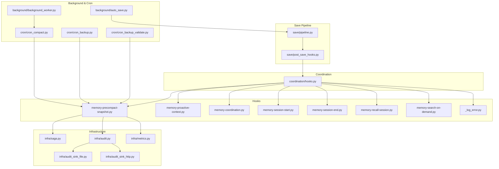
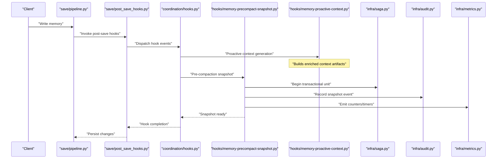
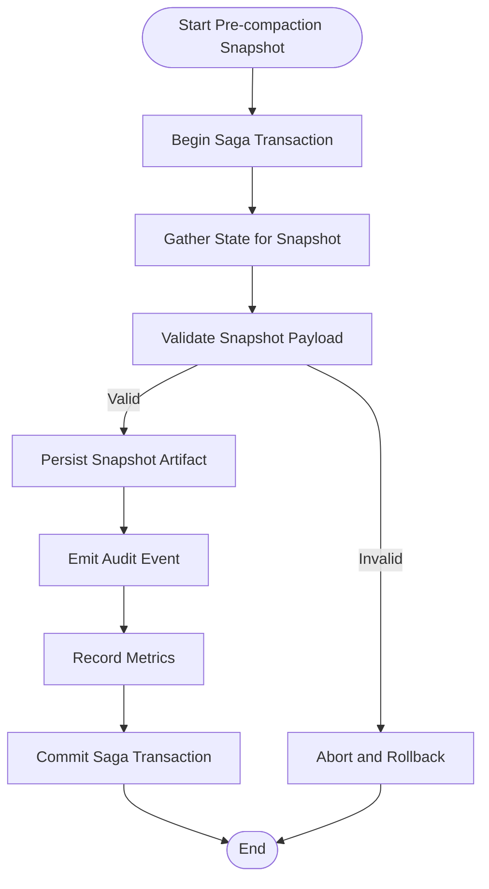
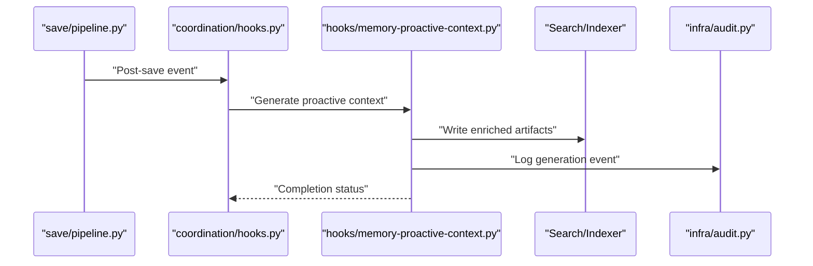
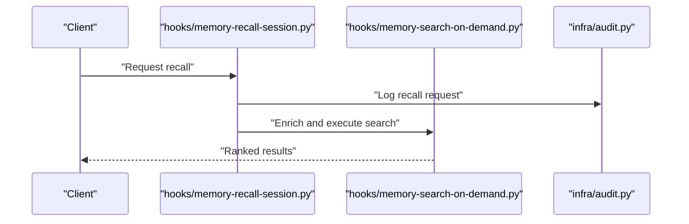
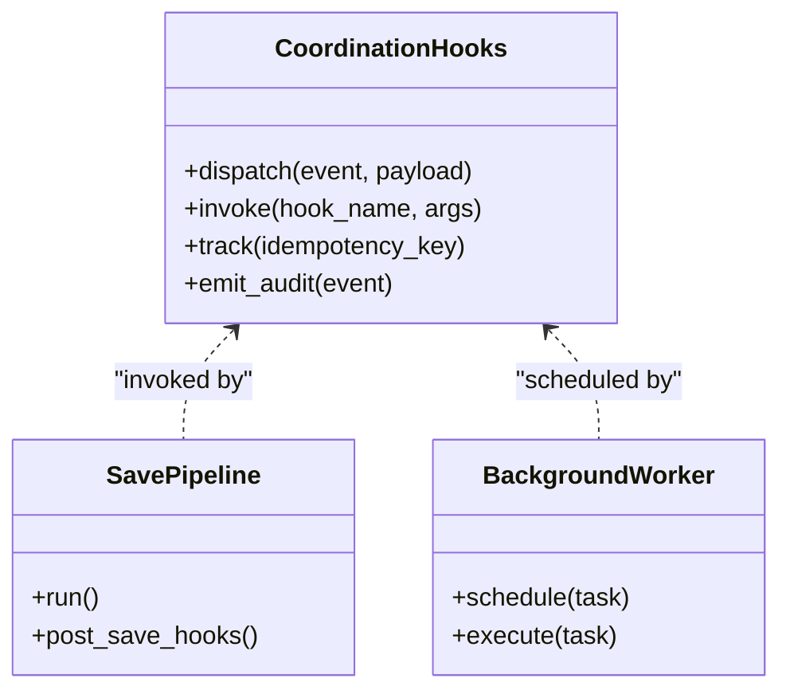
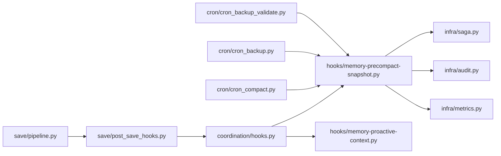

# Data Processing Hooks

<cite>
**Referenced Files in This Document**
- [hooks/memory-precompact-snapshot.py](file://hooks/memory-precompact-snapshot.py)
- [hooks/memory-proactive-context.py](file://hooks/memory-proactive-context.py)
- [hooks/memory-coordination.py](file://hooks/memory-coordination.py)
- [hooks/memory-session-start.py](file://hooks/memory-session-start.py)
- [hooks/memory-session-end.py](file://hooks/memory-session-end.py)
- [hooks/memory-recall-session.py](file://hooks/memory-recall-session.py)
- [hooks/memory-search-on-demand.py](file://hooks/memory-search-on-demand.py)
- [hooks/_log_error.py](file://hooks/_log_error.py)
- [save/pipeline.py](file://save/pipeline.py)
- [save/post_save_hooks.py](file://save/post_save_hooks.py)
- [coordination/hooks.py](file://coordination/hooks.py)
- [cron/cron_compact.py](file://cron/cron_compact.py)
- [cron/cron_backup.py](file://cron/cron_backup.py)
- [cron/cron_backup_validate.py](file://cron/cron_backup_validate.py)
- [infra/saga.py](file://infra/saga.py)
- [infra/audit.py](file://infra/audit.py)
- [infra/audit_sink_file.py](file://infra/audit_sink_file.py)
- [infra/audit_sink_http.py](file://infra/audit_sink_http.py)
- [infra/metrics.py](file://infra/metrics.py)
- [background/background_worker.py](file://background/background_worker.py)
- [background/auto_save.py](file://background/auto_save.py)
</cite>

## Table of Contents
1. [Introduction](#introduction)
2. [Project Structure](#project-structure)
3. [Core Components](#core-components)
4. [Architecture Overview](#architecture-overview)
5. [Detailed Component Analysis](#detailed-component-analysis)
6. [Dependency Analysis](#dependency-analysis)
7. [Performance Considerations](#performance-considerations)
8. [Troubleshooting Guide](#troubleshooting-guide)
9. [Conclusion](#conclusion)
10. [Appendices](#appendices)

## Introduction
This document explains the data processing hooks system with a focus on pre-compaction snapshots and proactive context generation. It covers how to implement validation, transformation, enrichment, and backup operations; how snapshots are created and used for consistency and rollback; and how to ensure integrity, control performance impact, and optimize storage. Practical examples include compliance checks, format conversions, metadata extraction, and automated backups.

## Project Structure
The hooks subsystem is organized around:
- Hook scripts under hooks/ that participate in lifecycle events (session start/end, recall/search, coordination, pre-compaction snapshot, proactive context).
- Save pipeline integration points that invoke post-save hooks.
- Coordination layer that wires hook execution into workflows.
- Background workers and cron jobs that trigger compaction, backups, and validations.
- Infrastructure utilities for auditing, metrics, and saga-based transactional semantics.



**Diagram sources**
- [save/pipeline.py](file://save/pipeline.py)
- [save/post_save_hooks.py](file://save/post_save_hooks.py)
- [coordination/hooks.py](file://coordination/hooks.py)
- [hooks/memory-precompact-snapshot.py](file://hooks/memory-precompact-snapshot.py)
- [hooks/memory-proactive-context.py](file://hooks/memory-proactive-context.py)
- [hooks/memory-coordination.py](file://hooks/memory-coordination.py)
- [hooks/memory-session-start.py](file://hooks/memory-session-start.py)
- [hooks/memory-session-end.py](file://hooks/memory-session-end.py)
- [hooks/memory-recall-session.py](file://hooks/memory-recall-session.py)
- [hooks/memory-search-on-demand.py](file://hooks/memory-search-on-demand.py)
- [hooks/_log_error.py](file://hooks/_log_error.py)
- [cron/cron_compact.py](file://cron/cron_compact.py)
- [cron/cron_backup.py](file://cron/cron_backup.py)
- [cron/cron_backup_validate.py](file://cron/cron_backup_validate.py)
- [background/background_worker.py](file://background/background_worker.py)
- [background/auto_save.py](file://background/auto_save.py)
- [infra/saga.py](file://infra/saga.py)
- [infra/audit.py](file://infra/audit.py)
- [infra/audit_sink_file.py](file://infra/audit_sink_file.py)
- [infra/audit_sink_http.py](file://infra/audit_sink_http.py)
- [infra/metrics.py](file://infra/metrics.py)

**Section sources**
- [save/pipeline.py](file://save/pipeline.py)
- [save/post_save_hooks.py](file://save/post_save_hooks.py)
- [coordination/hooks.py](file://coordination/hooks.py)
- [hooks/memory-precompact-snapshot.py](file://hooks/memory-precompact-snapshot.py)
- [hooks/memory-proactive-context.py](file://hooks/memory-proactive-context.py)
- [hooks/memory-coordination.py](file://hooks/memory-coordination.py)
- [hooks/memory-session-start.py](file://hooks/memory-session-start.py)
- [hooks/memory-session-end.py](file://hooks/memory-session-end.py)
- [hooks/memory-recall-session.py](file://hooks/memory-recall-session.py)
- [hooks/memory-search-on-demand.py](file://hooks/memory-search-on-demand.py)
- [hooks/_log_error.py](file://hooks/_log_error.py)
- [cron/cron_compact.py](file://cron/cron_compact.py)
- [cron/cron_backup.py](file://cron/cron_backup.py)
- [cron/cron_backup_validate.py](file://cron/cron_backup_validate.py)
- [background/background_worker.py](file://background/background_worker.py)
- [background/auto_save.py](file://background/auto_save.py)
- [infra/saga.py](file://infra/saga.py)
- [infra/audit.py](file://infra/audit.py)
- [infra/audit_sink_file.py](file://infra/audit_sink_file.py)
- [infra/audit_sink_http.py](file://infra/audit_sink_http.py)
- [infra/metrics.py](file://infra/metrics.py)

## Core Components
- Pre-compaction snapshot hook: Creates consistent snapshots before compaction to enable rollback and auditability.
- Proactive context generation hook: Builds contextual artifacts ahead of demand to improve retrieval quality and latency.
- Session lifecycle hooks: Start/end hooks initialize and finalize session-scoped state and resources.
- Recall and search hooks: Enhance retrieval by injecting additional context or applying filters at query time.
- Coordination hook: Orchestrates cross-component interactions and ensures ordering and idempotency.
- Error logging helper: Centralized error capture and reporting for hook invocations.

Key responsibilities:
- Validation and transformation of data entering or leaving the system.
- Enrichment via metadata extraction and format conversion.
- Backup creation and verification tied to compaction and save operations.
- Consistency guarantees through snapshots and saga-like transactions.

**Section sources**
- [hooks/memory-precompact-snapshot.py](file://hooks/memory-precompact-snapshot.py)
- [hooks/memory-proactive-context.py](file://hooks/memory-proactive-context.py)
- [hooks/memory-session-start.py](file://hooks/memory-session-start.py)
- [hooks/memory-session-end.py](file://hooks/memory-session-end.py)
- [hooks/memory-recall-session.py](file://hooks/memory-recall-session.py)
- [hooks/memory-search-on-demand.py](file://hooks/memory-search-on-demand.py)
- [hooks/memory-coordination.py](file://hooks/memory-coordination.py)
- [hooks/_log_error.py](file://hooks/_log_error.py)

## Architecture Overview
The hooks integrate into the save pipeline and background/cron workflows. The pre-compaction snapshot hook participates in compaction flows, while proactive context runs as needed to prepare retrieval-ready artifacts.



**Diagram sources**
- [save/pipeline.py](file://save/pipeline.py)
- [save/post_save_hooks.py](file://save/post_save_hooks.py)
- [coordination/hooks.py](file://coordination/hooks.py)
- [hooks/memory-precompact-snapshot.py](file://hooks/memory-precompact-snapshot.py)
- [hooks/memory-proactive-context.py](file://hooks/memory-proactive-context.py)
- [infra/saga.py](file://infra/saga.py)
- [infra/audit.py](file://infra/audit.py)
- [infra/metrics.py](file://infra/metrics.py)

## Detailed Component Analysis

### Pre-compaction Snapshot Hook
Purpose:
- Capture a consistent view of relevant data prior to compaction.
- Provide rollback targets and audit trails.
- Ensure data integrity across compaction boundaries.

Implementation highlights:
- Uses saga semantics to wrap snapshot creation and any dependent updates.
- Emits audit events for each snapshot operation.
- Records metrics for duration and success/failure rates.
- Integrates with cron compaction and backup flows.



**Diagram sources**
- [hooks/memory-precompact-snapshot.py](file://hooks/memory-precompact-snapshot.py)
- [infra/saga.py](file://infra/saga.py)
- [infra/audit.py](file://infra/audit.py)
- [infra/metrics.py](file://infra/metrics.py)

Practical examples:
- Data compliance checks: Validate schema, required fields, and policy constraints before persisting snapshots.
- Format conversions: Normalize content types and encodings into canonical forms for archival.
- Metadata extraction: Derive timestamps, provenance, and version tags from source data.
- Automated backups: Trigger backup jobs after successful snapshot commits.

Rollback mechanism:
- On validation failure or persistence error, the saga aborts and rolls back partial work.
- Audit logs capture the failure reason and state at abort time.

Consistency guarantees:
- Snapshots represent a point-in-time view bounded by the saga transaction.
- Compaction depends on snapshot availability and validity.

**Section sources**
- [hooks/memory-precompact-snapshot.py](file://hooks/memory-precompact-snapshot.py)
- [infra/saga.py](file://infra/saga.py)
- [infra/audit.py](file://infra/audit.py)
- [infra/metrics.py](file://infra/metrics.py)
- [cron/cron_compact.py](file://cron/cron_compact.py)
- [cron/cron_backup.py](file://cron/cron_backup.py)
- [cron/cron_backup_validate.py](file://cron/cron_backup_validate.py)

### Proactive Context Generation Hook
Purpose:
- Generate context artifacts ahead of demand to improve retrieval quality and reduce latency.
- Enrich memories with derived features and summaries.

Implementation highlights:
- Invoked during save pipeline and coordination dispatch.
- Can be scheduled or triggered by background workers.
- Produces indexable artifacts consumed by search/recall paths.



**Diagram sources**
- [save/pipeline.py](file://save/pipeline.py)
- [coordination/hooks.py](file://coordination/hooks.py)
- [hooks/memory-proactive-context.py](file://hooks/memory-proactive-context.py)
- [infra/audit.py](file://infra/audit.py)

Practical examples:
- Compliance checks: Filter out sensitive fields and enforce retention policies during enrichment.
- Format conversions: Convert raw payloads to structured representations suitable for indexing.
- Metadata extraction: Extract entities, topics, and temporal markers for enhanced search.
- Automated backups: Archive generated artifacts alongside original data.

**Section sources**
- [save/pipeline.py](file://save/pipeline.py)
- [coordination/hooks.py](file://coordination/hooks.py)
- [hooks/memory-proactive-context.py](file://hooks/memory-proactive-context.py)
- [infra/audit.py](file://infra/audit.py)

### Session Lifecycle Hooks
Session start:
- Initialize session-scoped caches, locks, and resource pools.
- Record session metadata and baseline metrics.

Session end:
- Flush pending writes, release resources, and emit finalization events.
- Trigger post-session tasks such as compacting small batches.

```mermaid
sequenceDiagram
participant Client as "Client"
participant Start as "hooks/memory-session-start.py"
participant End as "hooks/memory-session-end.py"
participant Audit as "infra/audit.py"
Client->>Start : "Open session"
Start->>Audit : "Log session start"
Client->>End : "Close session"
End->>Audit : "Log session end"
```

**Diagram sources**
- [hooks/memory-session-start.py](file://hooks/memory-session-start.py)
- [hooks/memory-session-end.py](file://hooks/memory-session-end.py)
- [infra/audit.py](file://infra/audit.py)

**Section sources**
- [hooks/memory-session-start.py](file://hooks/memory-session-start.py)
- [hooks/memory-session-end.py](file://hooks/memory-session-end.py)
- [infra/audit.py](file://infra/audit.py)

### Recall and Search Hooks
Recall session hook:
- Augments queries with session-specific context and filters.
- Applies tenant isolation and access controls.

Search on-demand hook:
- Dynamically enriches results with computed features.
- Supports reranking strategies and caching.



**Diagram sources**
- [hooks/memory-recall-session.py](file://hooks/memory-recall-session.py)
- [hooks/memory-search-on-demand.py](file://hooks/memory-search-on-demand.py)
- [infra/audit.py](file://infra/audit.py)

**Section sources**
- [hooks/memory-recall-session.py](file://hooks/memory-recall-session.py)
- [hooks/memory-search-on-demand.py](file://hooks/memory-search-on-demand.py)
- [infra/audit.py](file://infra/audit.py)

### Coordination Hook
Responsibilities:
- Orchestrate hook invocation order and dependencies.
- Ensure idempotency and retry semantics.
- Bridge between save pipeline, background workers, and cron jobs.



**Diagram sources**
- [coordination/hooks.py](file://coordination/hooks.py)
- [save/pipeline.py](file://save/pipeline.py)
- [background/background_worker.py](file://background/background_worker.py)

**Section sources**
- [coordination/hooks.py](file://coordination/hooks.py)
- [save/pipeline.py](file://save/pipeline.py)
- [background/background_worker.py](file://background/background_worker.py)

### Error Logging Helper
Centralizes error capture, formatting, and routing to sinks. Ensures hook failures do not crash the pipeline and provides actionable diagnostics.

**Section sources**
- [hooks/_log_error.py](file://hooks/_log_error.py)

## Dependency Analysis
- Save pipeline depends on post-save hooks and coordination to orchestrate hook execution.
- Pre-compaction snapshot depends on saga for transactional guarantees and audit/metrics for observability.
- Proactive context depends on coordination and may interact with indexing/search components.
- Cron compaction and backup jobs depend on snapshot availability and validation.



**Diagram sources**
- [save/pipeline.py](file://save/pipeline.py)
- [save/post_save_hooks.py](file://save/post_save_hooks.py)
- [coordination/hooks.py](file://coordination/hooks.py)
- [hooks/memory-precompact-snapshot.py](file://hooks/memory-precompact-snapshot.py)
- [hooks/memory-proactive-context.py](file://hooks/memory-proactive-context.py)
- [cron/cron_compact.py](file://cron/cron_compact.py)
- [cron/cron_backup.py](file://cron/cron_backup.py)
- [cron/cron_backup_validate.py](file://cron/cron_backup_validate.py)
- [infra/saga.py](file://infra/saga.py)
- [infra/audit.py](file://infra/audit.py)
- [infra/metrics.py](file://infra/metrics.py)

**Section sources**
- [save/pipeline.py](file://save/pipeline.py)
- [save/post_save_hooks.py](file://save/post_save_hooks.py)
- [coordination/hooks.py](file://coordination/hooks.py)
- [hooks/memory-precompact-snapshot.py](file://hooks/memory-precompact-snapshot.py)
- [hooks/memory-proactive-context.py](file://hooks/memory-proactive-context.py)
- [cron/cron_compact.py](file://cron/cron_compact.py)
- [cron/cron_backup.py](file://cron/cron_backup.py)
- [cron/cron_backup_validate.py](file://cron/cron_backup_validate.py)
- [infra/saga.py](file://infra/saga.py)
- [infra/audit.py](file://infra/audit.py)
- [infra/metrics.py](file://infra/metrics.py)

## Performance Considerations
- Batch and throttle proactive context generation to avoid write amplification.
- Use idempotency keys to prevent duplicate work during retries.
- Cache enriched artifacts and reuse across sessions where safe.
- Monitor metrics and set alerts for slow hooks and high failure rates.
- Prefer incremental updates and selective re-indexing to minimize overhead.
- Offload heavy transformations to background workers when possible.

[No sources needed since this section provides general guidance]

## Troubleshooting Guide
Common issues and resolutions:
- Hook timeouts: Increase worker timeouts or split work into smaller units.
- Validation failures: Inspect audit logs for payload details and adjust schemas.
- Snapshot rollbacks: Verify saga state and restore from last valid snapshot.
- Duplicate executions: Ensure idempotency keys are unique per operation.
- Backpressure: Reduce batch sizes and enable rate limiting in background workers.

Operational checks:
- Review audit sink outputs for errors and warnings.
- Inspect metrics dashboards for hook durations and error counts.
- Validate cron job schedules and lock contention.

**Section sources**
- [hooks/_log_error.py](file://hooks/_log_error.py)
- [infra/audit.py](file://infra/audit.py)
- [infra/audit_sink_file.py](file://infra/audit_sink_file.py)
- [infra/audit_sink_http.py](file://infra/audit_sink_http.py)
- [infra/metrics.py](file://infra/metrics.py)
- [background/background_worker.py](file://background/background_worker.py)
- [background/auto_save.py](file://background/auto_save.py)

## Conclusion
The data processing hooks provide a flexible, observable, and resilient foundation for validation, transformation, enrichment, and backup operations. Pre-compaction snapshots ensure consistency and enable rollback, while proactive context generation improves retrieval performance. By leveraging saga semantics, audit trails, and metrics, teams can maintain data integrity, control performance impact, and optimize storage efficiently.

[No sources needed since this section summarizes without analyzing specific files]

## Appendices

### Implementation Checklist
- Define validation rules and transformation pipelines for incoming/outgoing data.
- Implement metadata extraction and format normalization.
- Create snapshot artifacts with clear versioning and provenance.
- Integrate audit logging and metrics emission into all hooks.
- Configure cron jobs for compaction, backup, and validation.
- Set up background workers for long-running enrichment tasks.
- Establish rollback procedures using saga state and snapshot archives.

[No sources needed since this section provides general guidance]