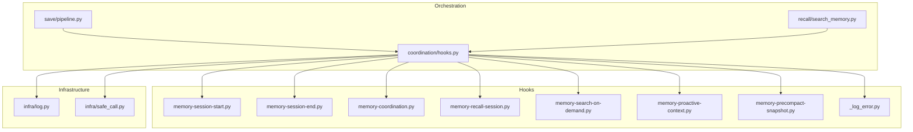
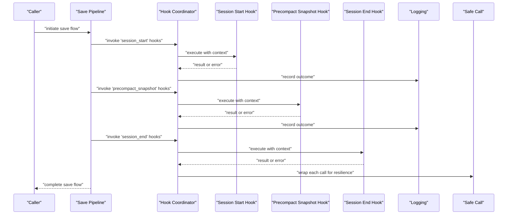
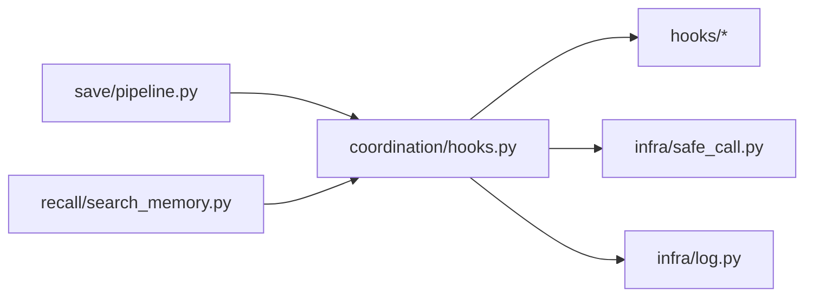

# Hook Architecture and Lifecycle

<cite>
**Referenced Files in This Document**
- [hooks/memory-coordination.py](file://hooks/memory-coordination.py)
- [hooks/memory-precompact-snapshot.py](file://hooks/memory-precompact-snapshot.py)
- [hooks/memory-proactive-context.py](file://hooks/memory-proactive-context.py)
- [hooks/memory-recall-session.py](file://hooks/memory-recall-session.py)
- [hooks/memory-search-on-demand.py](file://hooks/memory-search-on-demand.py)
- [hooks/memory-session-end.py](file://hooks/memory-session-end.py)
- [hooks/memory-session-start.py](file://hooks/memory-session-start.py)
- [hooks/_log_error.py](file://hooks/_log_error.py)
- [coordination/hooks.py](file://coordination/hooks.py)
- [save/pipeline.py](file://save/pipeline.py)
- [recall/search_memory.py](file://recall/search_memory.py)
- [infra/safe_call.py](file://infra/safe_call.py)
- [infra/log.py](file://infra/log.py)
- [examples/agent_memory.py](file://examples/agent_memory.py)
</cite>

## Table of Contents
1. [Introduction](#introduction)
2. [Project Structure](#project-structure)
3. [Core Components](#core-components)
4. [Architecture Overview](#architecture-overview)
5. [Detailed Component Analysis](#detailed-component-analysis)
6. [Dependency Analysis](#dependency-analysis)
7. [Performance Considerations](#performance-considerations)
8. [Troubleshooting Guide](#troubleshooting-guide)
9. [Conclusion](#conclusion)

## Introduction
This document explains the hook system architecture and lifecycle management used to extend memory operations across save and recall pipelines. It covers plugin discovery, registration, execution context, ordering, dependency resolution, error propagation, interface contracts, parameter passing, return value handling, performance considerations, resource management, and debugging techniques for hook development.

## Project Structure
The hook system is implemented as a set of Python modules under hooks/, with orchestration logic in coordination/hooks.py and integration points in save/pipeline.py and recall/search_memory.py. Example usage is provided in examples/agent_memory.py. Logging utilities are centralized in infra/log.py and safe_call.py provides resilient invocation helpers.

**Diagram sources**
- [coordination/hooks.py](file://coordination/hooks.py)
- [save/pipeline.py](file://save/pipeline.py)
- [recall/search_memory.py](file://recall/search_memory.py)
- [hooks/memory-session-start.py](file://hooks/memory-session-start.py)
- [hooks/memory-session-end.py](file://hooks/memory-session-end.py)
- [hooks/memory-coordination.py](file://hooks/memory-coordination.py)
- [hooks/memory-recall-session.py](file://hooks/memory-recall-session.py)
- [hooks/memory-search-on-demand.py](file://hooks/memory-search-on-demand.py)
- [hooks/memory-proactive-context.py](file://hooks/memory-proactive-context.py)
- [hooks/memory-precompact-snapshot.py](file://hooks/memory-precompact-snapshot.py)
- [hooks/_log_error.py](file://hooks/_log_error.py)
- [infra/log.py](file://infra/log.py)
- [infra/safe_call.py](file://infra/safe_call.py)

**Section sources**
- [coordination/hooks.py](file://coordination/hooks.py)
- [save/pipeline.py](file://save/pipeline.py)
- [recall/search_memory.py](file://recall/search_memory.py)
- [hooks/memory-session-start.py](file://hooks/memory-session-start.py)
- [hooks/memory-session-end.py](file://hooks/memory-session-end.py)
- [hooks/memory-coordination.py](file://hooks/memory-coordination.py)
- [hooks/memory-recall-session.py](file://hooks/memory-recall-session.py)
- [hooks/memory-search-on-demand.py](file://hooks/memory-search-on-demand.py)
- [hooks/memory-proactive-context.py](file://hooks/memory-proactive-context.py)
- [hooks/memory-precompact-snapshot.py](file://hooks/memory-precompact-snapshot.py)
- [hooks/_log_error.py](file://hooks/_log_error.py)
- [infra/log.py](file://infra/log.py)
- [infra/safe_call.py](file://infra/safe_call.py)

## Core Components
- Hook registry and loader: centralizes discovery, loading, and execution of hooks by name or category.
- Pipeline integrations: save pipeline and search pipeline invoke relevant hooks at well-defined lifecycle points.
- Error isolation and logging: ensures hook failures do not crash core flows and provide actionable diagnostics.
- Context objects: standardized parameters passed into hooks (e.g., session identifiers, request metadata).
- Ordering and dependencies: deterministic execution order and optional dependency declarations between hooks.

Key responsibilities:
- Registration: Hooks register themselves via module-level conventions or explicit registration functions.
- Discovery: The loader scans known locations and imports hook modules once per process.
- Execution: Ordered invocation with context injection and result aggregation.
- Resilience: Per-hook try/catch with safe_call wrappers and structured logging.

**Section sources**
- [coordination/hooks.py](file://coordination/hooks.py)
- [save/pipeline.py](file://save/pipeline.py)
- [recall/search_memory.py](file://recall/search_memory.py)
- [infra/safe_call.py](file://infra/safe_call.py)
- [infra/log.py](file://infra/log.py)

## Architecture Overview
The hook system integrates into two primary pipelines:
- Save pipeline: triggers session start/end hooks and pre-compaction snapshot hooks around write operations.
- Search/recall pipeline: triggers on-demand search and session-scoped recall hooks during retrieval.

**Diagram sources**
- [save/pipeline.py](file://save/pipeline.py)
- [coordination/hooks.py](file://coordination/hooks.py)
- [hooks/memory-session-start.py](file://hooks/memory-session-start.py)
- [hooks/memory-precompact-snapshot.py](file://hooks/memory-precompact-snapshot.py)
- [hooks/memory-session-end.py](file://hooks/memory-session-end.py)
- [infra/safe_call.py](file://infra/safe_call.py)
- [infra/log.py](file://infra/log.py)

## Detailed Component Analysis

### Hook Registry and Loader
Responsibilities:
- Discover hook modules from the hooks directory.
- Parse metadata (name, tags, version, dependencies).
- Build an ordered graph based on declared dependencies.
- Provide an executor that invokes hooks in topological order.

Execution model:
- Each hook receives a typed context object containing session/request details.
- Return values can be ignored or aggregated; errors are isolated and logged.

Ordering and dependencies:
- Explicit dependency declarations ensure stable ordering.
- Fallback default ordering by tag/category when no dependencies exist.

Error propagation:
- Failures are captured per hook; the coordinator continues unless configured to fail-fast.
- Errors are recorded with stack traces and contextual metadata.

**Section sources**
- [coordination/hooks.py](file://coordination/hooks.py)

### Save Pipeline Integration
Lifecycle points:
- Before processing writes: session start hooks.
- Before compaction: precompact snapshot hooks.
- After processing writes: session end hooks.

Parameter passing:
- Context includes session ID, tenant scope, timestamps, and operation flags.

Return value handling:
- Hooks may return side-effect summaries; the pipeline ignores non-critical returns.

Error handling:
- Wrapped with safe_call to prevent pipeline interruption.
- Structured logs include correlation IDs and hook names.

**Section sources**
- [save/pipeline.py](file://save/pipeline.py)
- [hooks/memory-session-start.py](file://hooks/memory-session-start.py)
- [hooks/memory-precompact-snapshot.py](file://hooks/memory-precompact-snapshot.py)
- [hooks/memory-session-end.py](file://hooks/memory-session-end.py)
- [infra/safe_call.py](file://infra/safe_call.py)
- [infra/log.py](file://infra/log.py)

### Recall/Search Pipeline Integration
Lifecycle points:
- On-demand search hooks augment queries or results.
- Session-scoped recall hooks tailor retrieval based on recent interactions.

Parameter passing:
- Context includes query text, filters, session history pointers, and scoring hints.

Return value handling:
- Hooks can contribute additional candidates or reweight scores; final merge is performed by the orchestrator.

Error handling:
- Non-fatal exceptions are caught and logged; degraded behavior proceeds without hook contributions.

**Section sources**
- [recall/search_memory.py](file://recall/search_memory.py)
- [hooks/memory-search-on-demand.py](file://hooks/memory-search-on-demand.py)
- [hooks/memory-recall-session.py](file://hooks/memory-recall-session.py)
- [infra/safe_call.py](file://infra/safe_call.py)
- [infra/log.py](file://infra/log.py)

### Hook Interface Contract
Contract highlights:
- Entry point function signature accepts a single context object.
- Context fields are documented and validated before invocation.
- Optional return types are defined; callers handle None gracefully.
- Hooks must be idempotent where possible and avoid long-running blocking work.

Best practices:
- Keep hooks small and focused.
- Use structured logging for observability.
- Avoid direct DB access unless necessary; prefer read-only views or caches.

**Section sources**
- [coordination/hooks.py](file://coordination/hooks.py)
- [hooks/_log_error.py](file://hooks/_log_error.py)

### Example Usage
The example demonstrates how to enable hooks within agent workflows and how they integrate with save and search operations.

**Section sources**
- [examples/agent_memory.py](file://examples/agent_memory.py)

## Dependency Analysis
The following diagram shows key dependencies among components involved in hook execution.

**Diagram sources**
- [save/pipeline.py](file://save/pipeline.py)
- [recall/search_memory.py](file://recall/search_memory.py)
- [coordination/hooks.py](file://coordination/hooks.py)
- [infra/safe_call.py](file://infra/safe_call.py)
- [infra/log.py](file://infra/log.py)

**Section sources**
- [save/pipeline.py](file://save/pipeline.py)
- [recall/search_memory.py](file://recall/search_memory.py)
- [coordination/hooks.py](file://coordination/hooks.py)
- [infra/safe_call.py](file://infra/safe_call.py)
- [infra/log.py](file://infra/log.py)

## Performance Considerations
- Minimize I/O inside hooks; prefer in-memory computations or cached reads.
- Avoid heavy initialization in hook constructors; defer to lazy initialization.
- Use batching where possible to reduce repeated lookups.
- Prefer async-friendly patterns if hooks perform network calls; ensure the executor supports concurrency limits.
- Monitor hook latency and error rates via structured logs and metrics.

[No sources needed since this section provides general guidance]

## Troubleshooting Guide
Common issues and remedies:
- Hook not discovered: verify module naming and location under hooks/.
- Ordering conflicts: review dependency declarations and resolve cycles.
- Silent failures: inspect structured logs for per-hook outcomes and correlation IDs.
- Resource leaks: ensure hooks close handles and release locks promptly.
- Debugging tips: add detailed logs with context keys; isolate failing hooks by disabling others.

**Section sources**
- [hooks/_log_error.py](file://hooks/_log_error.py)
- [infra/log.py](file://infra/log.py)
- [infra/safe_call.py](file://infra/safe_call.py)

## Conclusion
The hook system provides a robust, extensible mechanism to augment save and recall pipelines with minimal coupling. By enforcing clear interfaces, deterministic ordering, and resilient execution, it enables powerful customization while maintaining stability and performance. Follow the interface contract, manage resources carefully, and leverage logging and safe-call wrappers for reliable hook development.