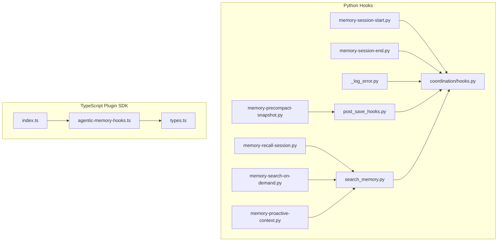
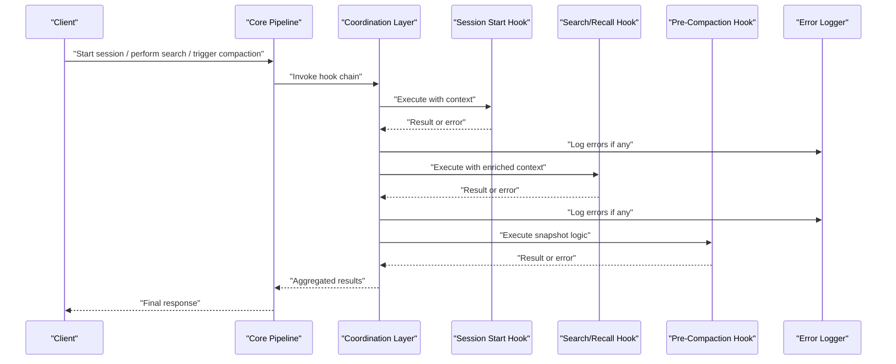
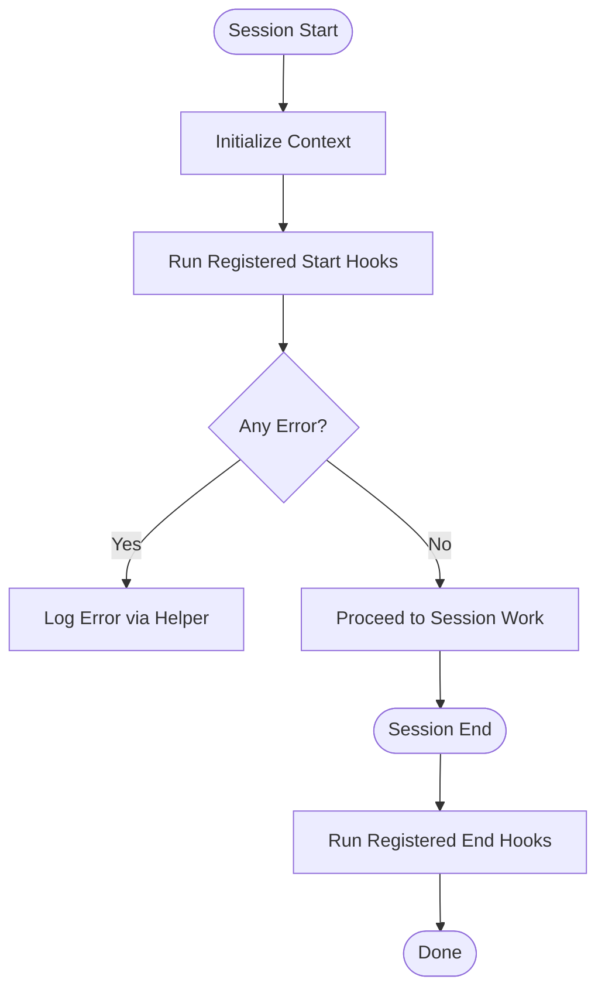
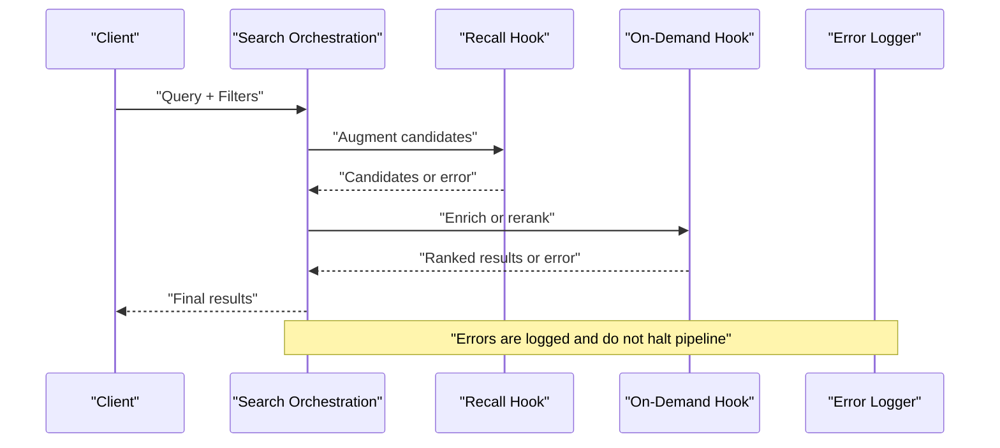
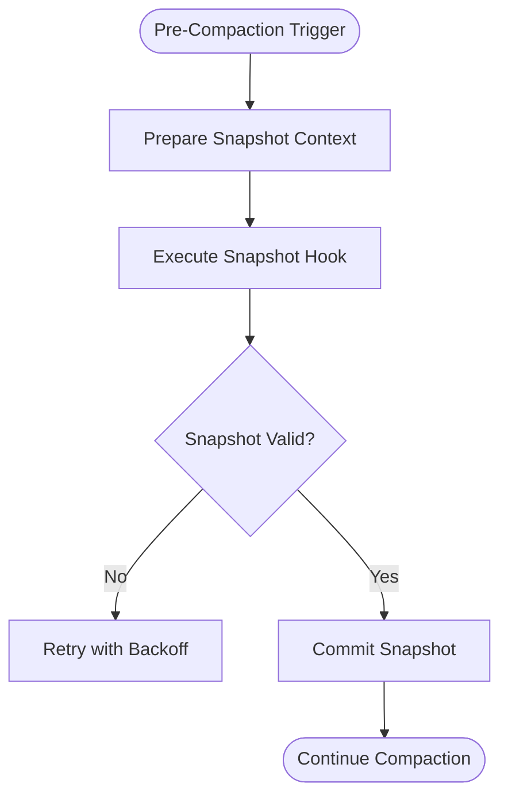
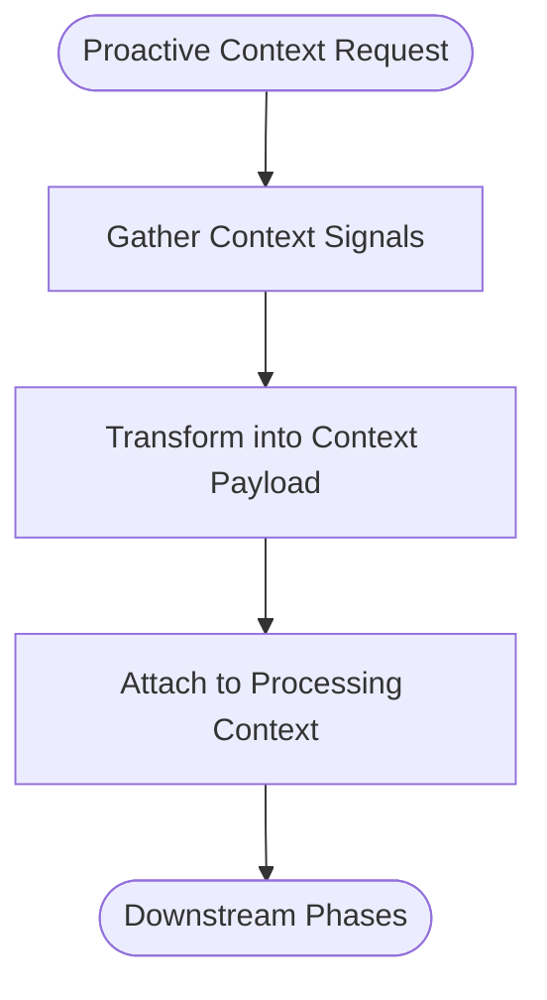
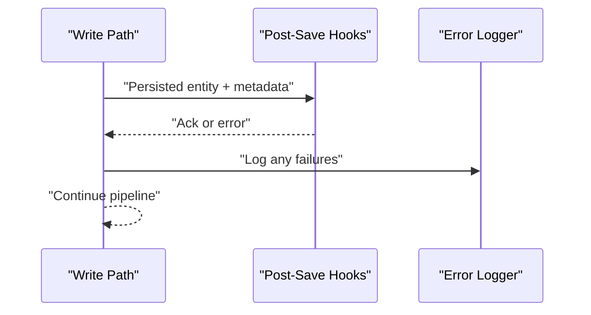
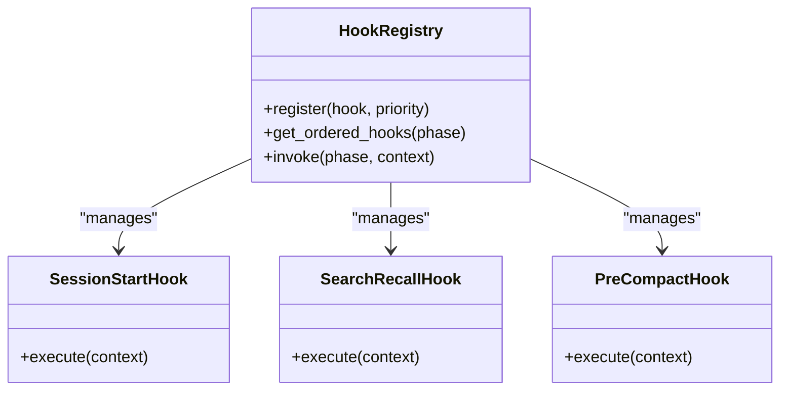
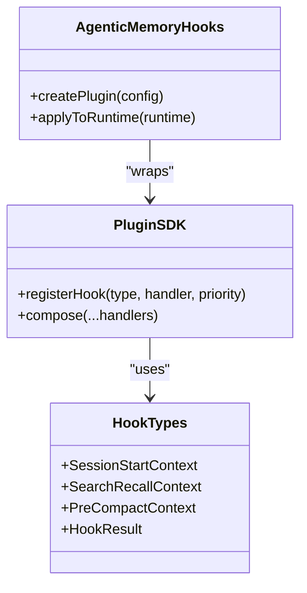
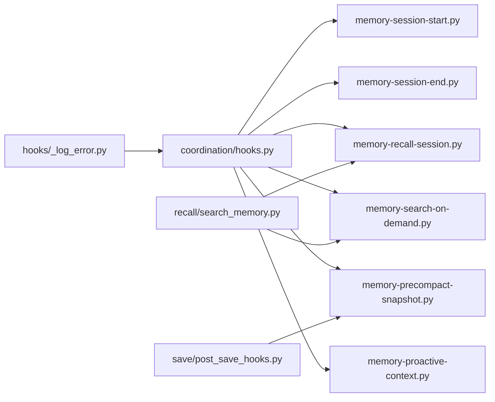

# Hook System and Plugins

<cite>
**Referenced Files in This Document**
- [hooks/memory-session-start.py](file://hooks/memory-session-start.py)
- [hooks/memory-session-end.py](file://hooks/memory-session-end.py)
- [hooks/memory-recall-session.py](file://hooks/memory-recall-session.py)
- [hooks/memory-search-on-demand.py](file://hooks/memory-search-on-demand.py)
- [hooks/memory-precompact-snapshot.py](file://hooks/memory-precompact-snapshot.py)
- [hooks/memory-proactive-context.py](file://hooks/memory-proactive-context.py)
- [hooks/_log_error.py](file://hooks/_log_error.py)
- [save/post_save_hooks.py](file://save/post_save_hooks.py)
- [recall/search_memory.py](file://recall/search_memory.py)
- [coordination/hooks.py](file://coordination/hooks.py)
- [plugin/index.ts](file://plugin/index.ts)
- [plugin/types.ts](file://plugin/types.ts)
- [plugin/agentic-memory-hooks.ts](file://plugin/agentic-memory-hooks.ts)
</cite>

## Table of Contents
1. [Introduction](#introduction)
2. [Project Structure](#project-structure)
3. [Core Components](#core-components)
4. [Architecture Overview](#architecture-overview)
5. [Detailed Component Analysis](#detailed-component-analysis)
6. [Dependency Analysis](#dependency-analysis)
7. [Performance Considerations](#performance-considerations)
8. [Troubleshooting Guide](#troubleshooting-guide)
9. [Conclusion](#conclusion)
10. [Appendices](#appendices)

## Introduction
This document explains the hook system and plugin architecture for extending core behaviors such as session lifecycle, search/recall, and pre-compaction. It covers available hook points, registration patterns, execution context, ordering, error handling, and performance considerations. Practical examples illustrate how to implement custom hooks for data validation, transformation, notifications, audit logging, compliance, analytics, and workflow automation.

## Project Structure
The hook system is implemented across Python modules that define hook entry points and orchestration, and TypeScript files that expose a plugin interface for external integrations.

**Diagram sources**
- [hooks/memory-session-start.py:1-200](file://hooks/memory-session-start.py#L1-L200)
- [hooks/memory-session-end.py:1-200](file://hooks/memory-session-end.py#L1-L200)
- [hooks/memory-recall-session.py:1-200](file://hooks/memory-recall-session.py#L1-L200)
- [hooks/memory-search-on-demand.py:1-200](file://hooks/memory-search-on-demand.py#L1-L200)
- [hooks/memory-precompact-snapshot.py:1-200](file://hooks/memory-precompact-snapshot.py#L1-L200)
- [hooks/memory-proactive-context.py:1-200](file://hooks/memory-proactive-context.py#L1-L200)
- [hooks/_log_error.py:1-200](file://hooks/_log_error.py#L1-L200)
- [save/post_save_hooks.py:1-200](file://save/post_save_hooks.py#L1-L200)
- [recall/search_memory.py:1-200](file://recall/search_memory.py#L1-L200)
- [coordination/hooks.py:1-200](file://coordination/hooks.py#L1-L200)
- [plugin/index.ts:1-200](file://plugin/index.ts#L1-L200)
- [plugin/types.ts:1-200](file://plugin/types.ts#L1-L200)
- [plugin/agentic-memory-hooks.ts:1-200](file://plugin/agentic-memory-hooks.ts#L1-L200)

**Section sources**
- [hooks/memory-session-start.py:1-200](file://hooks/memory-session-start.py#L1-L200)
- [hooks/memory-session-end.py:1-200](file://hooks/memory-session-end.py#L1-L200)
- [hooks/memory-recall-session.py:1-200](file://hooks/memory-recall-session.py#L1-L200)
- [hooks/memory-search-on-demand.py:1-200](file://hooks/memory-search-on-demand.py#L1-L200)
- [hooks/memory-precompact-snapshot.py:1-200](file://hooks/memory-precompact-snapshot.py#L1-L200)
- [hooks/memory-proactive-context.py:1-200](file://hooks/memory-proactive-context.py#L1-L200)
- [hooks/_log_error.py:1-200](file://hooks/_log_error.py#L1-L200)
- [save/post_save_hooks.py:1-200](file://save/post_save_hooks.py#L1-L200)
- [recall/search_memory.py:1-200](file://recall/search_memory.py#L1-L200)
- [coordination/hooks.py:1-200](file://coordination/hooks.py#L1-L200)
- [plugin/index.ts:1-200](file://plugin/index.ts#L1-L200)
- [plugin/types.ts:1-200](file://plugin/types.ts#L1-L200)
- [plugin/agentic-memory-hooks.ts:1-200](file://plugin/agentic-memory-hooks.ts#L1-L200)

## Core Components
- Hook entry points (Python):
  - Session start/end hooks for initialization and cleanup tasks.
  - Recall and search hooks to augment retrieval and ranking.
  - Pre-compaction snapshot hook to capture state before compaction.
  - Proactive context hook to enrich context prior to processing.
- Error logging helper:
  - Centralized error logging utility used by hooks.
- Post-save hooks:
  - Integration point for actions after memory writes.
- Search integration:
  - Orchestrates recall and search phases where hooks can be invoked.
- Coordination layer:
  - Provides shared utilities and lifecycle management for hooks.
- TypeScript plugin SDK:
  - Exposes types and helpers for building plugins that integrate with the hook system.

Key responsibilities:
- Define clear hook signatures and contexts.
- Provide safe invocation with error isolation and logging.
- Allow deterministic ordering and optional short-circuiting.
- Support both synchronous and asynchronous execution paths.

**Section sources**
- [hooks/memory-session-start.py:1-200](file://hooks/memory-session-start.py#L1-L200)
- [hooks/memory-session-end.py:1-200](file://hooks/memory-session-end.py#L1-L200)
- [hooks/memory-recall-session.py:1-200](file://hooks/memory-recall-session.py#L1-L200)
- [hooks/memory-search-on-demand.py:1-200](file://hooks/memory-search-on-demand.py#L1-L200)
- [hooks/memory-precompact-snapshot.py:1-200](file://hooks/memory-precompact-snapshot.py#L1-L200)
- [hooks/memory-proactive-context.py:1-200](file://hooks/memory-proactive-context.py#L1-L200)
- [hooks/_log_error.py:1-200](file://hooks/_log_error.py#L1-L200)
- [save/post_save_hooks.py:1-200](file://save/post_save_hooks.py#L1-L200)
- [recall/search_memory.py:1-200](file://recall/search_memory.py#L1-L200)
- [coordination/hooks.py:1-200](file://coordination/hooks.py#L1-L200)
- [plugin/index.ts:1-200](file://plugin/index.ts#L1-L200)
- [plugin/types.ts:1-200](file://plugin/types.ts#L1-L200)
- [plugin/agentic-memory-hooks.ts:1-200](file://plugin/agentic-memory-hooks.ts#L1-L200)

## Architecture Overview
The hook system follows a modular design:
- Entry points declare hooks at specific lifecycle stages.
- The coordination layer manages discovery, ordering, and execution.
- Error handling ensures one failing hook does not crash the pipeline.
- The TypeScript SDK provides a consistent API for plugin authors.

**Diagram sources**
- [coordination/hooks.py:1-200](file://coordination/hooks.py#L1-L200)
- [hooks/memory-session-start.py:1-200](file://hooks/memory-session-start.py#L1-L200)
- [hooks/memory-recall-session.py:1-200](file://hooks/memory-recall-session.py#L1-L200)
- [hooks/memory-precompact-snapshot.py:1-200](file://hooks/memory-precompact-snapshot.py#L1-L200)
- [hooks/_log_error.py:1-200](file://hooks/_log_error.py#L1-L200)

## Detailed Component Analysis

### Session Lifecycle Hooks
- Purpose:
  - Initialize resources and metadata when a session begins.
  - Perform cleanup and finalization when a session ends.
- Execution context:
  - Includes session identifiers, tenant scope, and configuration flags.
- Ordering:
  - Deterministic order based on registration priority; lower numbers execute first.
- Error handling:
  - Errors are isolated per hook and logged centrally without aborting the entire lifecycle.

**Diagram sources**
- [hooks/memory-session-start.py:1-200](file://hooks/memory-session-start.py#L1-L200)
- [hooks/memory-session-end.py:1-200](file://hooks/memory-session-end.py#L1-L200)
- [hooks/_log_error.py:1-200](file://hooks/_log_error.py#L1-L200)

**Section sources**
- [hooks/memory-session-start.py:1-200](file://hooks/memory-session-start.py#L1-L200)
- [hooks/memory-session-end.py:1-200](file://hooks/memory-session-end.py#L1-L200)
- [hooks/_log_error.py:1-200](file://hooks/_log_error.py#L1-L200)

### Search and Recall Hooks
- Purpose:
  - Augment query parsing, candidate generation, reranking, and result enrichment.
- Execution context:
  - Query text, filters, scoring parameters, and previous phase outputs.
- Short-circuit behavior:
  - A hook may return early to bypass subsequent phases under certain conditions.
- Performance:
  - Prefer lightweight transformations; defer heavy computations to background tasks.

**Diagram sources**
- [recall/search_memory.py:1-200](file://recall/search_memory.py#L1-L200)
- [hooks/memory-recall-session.py:1-200](file://hooks/memory-recall-session.py#L1-L200)
- [hooks/memory-search-on-demand.py:1-200](file://hooks/memory-search-on-demand.py#L1-L200)
- [hooks/_log_error.py:1-200](file://hooks/_log_error.py#L1-L200)

**Section sources**
- [recall/search_memory.py:1-200](file://recall/search_memory.py#L1-L200)
- [hooks/memory-recall-session.py:1-200](file://hooks/memory-recall-session.py#L1-L200)
- [hooks/memory-search-on-demand.py:1-200](file://hooks/memory-search-on-demand.py#L1-L200)
- [hooks/_log_error.py:1-200](file://hooks/_log_error.py#L1-L200)

### Pre-Compaction Snapshot Hook
- Purpose:
  - Capture a consistent snapshot of memory state before compaction.
- Execution context:
  - Compaction parameters, target segments, and retention policies.
- Guarantees:
  - Idempotent operations; safe to retry without side effects.

**Diagram sources**
- [hooks/memory-precompact-snapshot.py:1-200](file://hooks/memory-precompact-snapshot.py#L1-L200)
- [save/post_save_hooks.py:1-200](file://save/post_save_hooks.py#L1-L200)

**Section sources**
- [hooks/memory-precompact-snapshot.py:1-200](file://hooks/memory-precompact-snapshot.py#L1-L200)
- [save/post_save_hooks.py:1-200](file://save/post_save_hooks.py#L1-L200)

### Proactive Context Hook
- Purpose:
  - Enrich context proactively before downstream processing.
- Execution context:
  - Current session state, recent interactions, and user preferences.
- Use cases:
  - Inject domain-specific hints, compliance constraints, or analytics tags.

**Diagram sources**
- [hooks/memory-proactive-context.py:1-200](file://hooks/memory-proactive-context.py#L1-L200)

**Section sources**
- [hooks/memory-proactive-context.py:1-200](file://hooks/memory-proactive-context.py#L1-L200)

### Post-Save Hooks
- Purpose:
  - React to successful memory writes for auditing, notifications, and index updates.
- Execution context:
  - Saved entities, change summaries, and operation metadata.
- Ordering:
  - Deterministic order; ensure idempotency to handle retries.

**Diagram sources**
- [save/post_save_hooks.py:1-200](file://save/post_save_hooks.py#L1-L200)
- [hooks/_log_error.py:1-200](file://hooks/_log_error.py#L1-L200)

**Section sources**
- [save/post_save_hooks.py:1-200](file://save/post_save_hooks.py#L1-L200)
- [hooks/_log_error.py:1-200](file://hooks/_log_error.py#L1-L200)

### Hook Registration Patterns
- Registration methods:
  - Declarative decorators or explicit registry calls.
  - Priority-based ordering for deterministic execution.
- Configuration:
  - Enable/disable hooks per environment or tenant.
  - Parameterize hook behavior via configuration objects.

**Diagram sources**
- [coordination/hooks.py:1-200](file://coordination/hooks.py#L1-L200)
- [hooks/memory-session-start.py:1-200](file://hooks/memory-session-start.py#L1-L200)
- [hooks/memory-recall-session.py:1-200](file://hooks/memory-recall-session.py#L1-L200)
- [hooks/memory-precompact-snapshot.py:1-200](file://hooks/memory-precompact-snapshot.py#L1-L200)

**Section sources**
- [coordination/hooks.py:1-200](file://coordination/hooks.py#L1-L200)

### TypeScript Plugin Interface
- Types:
  - Define hook signatures, context shapes, and result contracts.
- Helpers:
  - Utilities for registering hooks and composing behaviors.
- Integration:
  - Bridge between TS plugins and Python hook runtime.

**Diagram sources**
- [plugin/types.ts:1-200](file://plugin/types.ts#L1-L200)
- [plugin/index.ts:1-200](file://plugin/index.ts#L1-L200)
- [plugin/agentic-memory-hooks.ts:1-200](file://plugin/agentic-memory-hooks.ts#L1-L200)

**Section sources**
- [plugin/types.ts:1-200](file://plugin/types.ts#L1-L200)
- [plugin/index.ts:1-200](file://plugin/index.ts#L1-L200)
- [plugin/agentic-memory-hooks.ts:1-200](file://plugin/agentic-memory-hooks.ts#L1-L200)

## Dependency Analysis
- Internal dependencies:
  - Hooks depend on coordination utilities for discovery and execution.
  - Search/recall hooks depend on the search orchestration module.
  - Post-save hooks depend on write path acknowledgments.
- External dependencies:
  - Logging and metrics subsystems for observability.
  - Optional third-party services for notifications and analytics.

**Diagram sources**
- [coordination/hooks.py:1-200](file://coordination/hooks.py#L1-L200)
- [hooks/memory-session-start.py:1-200](file://hooks/memory-session-start.py#L1-L200)
- [hooks/memory-session-end.py:1-200](file://hooks/memory-session-end.py#L1-L200)
- [hooks/memory-recall-session.py:1-200](file://hooks/memory-recall-session.py#L1-L200)
- [hooks/memory-search-on-demand.py:1-200](file://hooks/memory-search-on-demand.py#L1-L200)
- [hooks/memory-precompact-snapshot.py:1-200](file://hooks/memory-precompact-snapshot.py#L1-L200)
- [hooks/memory-proactive-context.py:1-200](file://hooks/memory-proactive-context.py#L1-L200)
- [recall/search_memory.py:1-200](file://recall/search_memory.py#L1-L200)
- [save/post_save_hooks.py:1-200](file://save/post_save_hooks.py#L1-L200)
- [hooks/_log_error.py:1-200](file://hooks/_log_error.py#L1-L200)

**Section sources**
- [coordination/hooks.py:1-200](file://coordination/hooks.py#L1-L200)
- [recall/search_memory.py:1-200](file://recall/search_memory.py#L1-L200)
- [save/post_save_hooks.py:1-200](file://save/post_save_hooks.py#L1-L200)
- [hooks/_log_error.py:1-200](file://hooks/_log_error.py#L1-L200)

## Performance Considerations
- Keep hooks fast and idempotent:
  - Avoid blocking I/O in hot paths; offload to background workers when possible.
- Limit payload sizes:
  - Pass only necessary context to reduce serialization overhead.
- Batch operations:
  - Aggregate multiple events to minimize network calls.
- Circuit breakers:
  - Fail fast on downstream service errors to protect core latency.
- Observability:
  - Emit metrics and traces around hook execution for profiling.

[No sources needed since this section provides general guidance]

## Troubleshooting Guide
Common issues and resolutions:
- Hook failures:
  - Check centralized logs for hook-specific errors and stack traces.
  - Verify hook configuration and priority settings.
- Ordering problems:
  - Ensure deterministic registration order; adjust priorities if needed.
- Timeouts:
  - Increase timeouts for long-running hooks or move work to background jobs.
- Data consistency:
  - Make hooks idempotent; use deduplication keys for external calls.

**Section sources**
- [hooks/_log_error.py:1-200](file://hooks/_log_error.py#L1-L200)
- [coordination/hooks.py:1-200](file://coordination/hooks.py#L1-L200)

## Conclusion
The hook system provides a robust, extensible mechanism for injecting custom behavior across session lifecycle, search/recall, and compaction phases. By following the registration patterns, respecting execution context, and adhering to performance and error-handling best practices, you can build reliable plugins for compliance, analytics, and workflow automation.

[No sources needed since this section summarizes without analyzing specific files]

## Appendices

### Practical Examples

- Compliance enforcement:
  - Implement a session start hook to validate tenant permissions and policy flags.
  - Add a post-save hook to record audit entries for sensitive writes.
- Analytics tracking:
  - Use search/recall hooks to emit metrics on query patterns and result quality.
  - Record proactive context usage to understand feature adoption.
- Workflow automation:
  - Create a pre-compaction hook to notify downstream systems about impending changes.
  - Build a session end hook to trigger archival or export workflows.

[No sources needed since this section provides conceptual guidance]