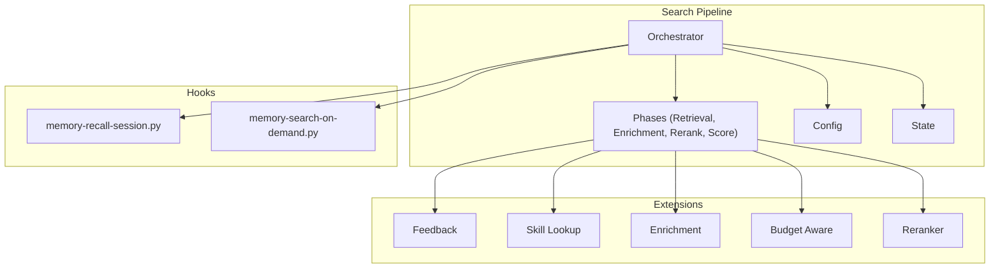
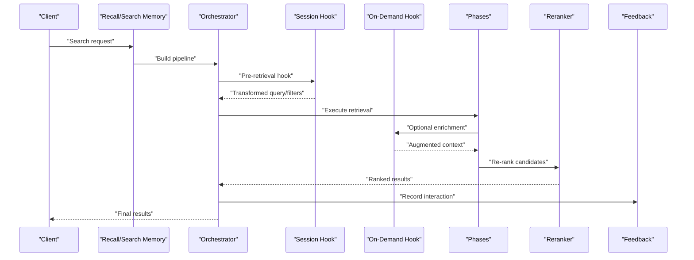
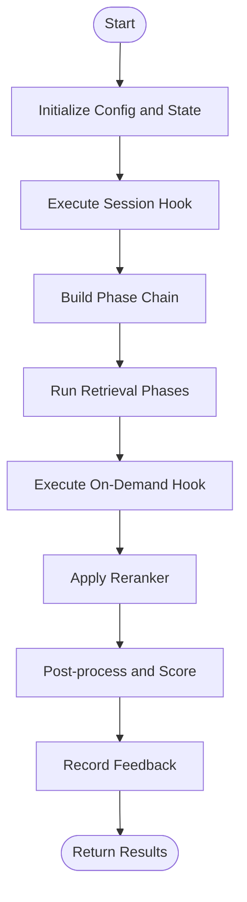
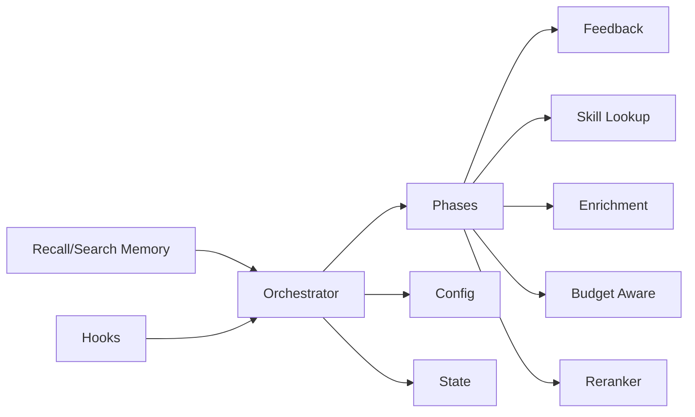

# Search and Recall Hooks

<cite>
**Referenced Files in This Document**
- [search/orchestrator.py](file://search/orchestrator.py)
- [search/phases/__init__.py](file://search/phases/__init__.py)
- [recall/search_memory.py](file://recall/search_memory.py)
- [recall/recall.py](file://recall/recall.py)
- [hooks/memory-recall-session.py](file://hooks/memory-recall-session.py)
- [hooks/memory-search-on-demand.py](file://hooks/memory-search-on-demand.py)
- [infra/reranker.py](file://infra/reranker.py)
- [search/config.py](file://search/config.py)
- [search/feedback.py](file://search/feedback.py)
- [search/skill_lookup.py](file://search/skill_lookup.py)
- [search/enrichment.py](file://search/enrichment.py)
- [search/budget_aware.py](file://search/budget_aware.py)
- [search/state.py](file://search/state.py)
- [eval/test_search_pipeline_unit.py](file://eval/test_search_pipeline_unit.py)
- [eval/test_search_integration.py](file://eval/test_search_integration.py)
</cite>

## Table of Contents
1. [Introduction](#introduction)
2. [Project Structure](#project-structure)
3. [Core Components](#core-components)
4. [Architecture Overview](#architecture-overview)
5. [Detailed Component Analysis](#detailed-component-analysis)
6. [Dependency Analysis](#dependency-analysis)
7. [Performance Considerations](#performance-considerations)
8. [Troubleshooting Guide](#troubleshooting-guide)
9. [Conclusion](#conclusion)
10. [Appendices](#appendices)

## Introduction
This document explains how to intercept, transform, and enhance search queries and results using the system’s hooks and recall pipeline. It covers:
- Query interception and transformation
- Result filtering and ranking modification
- Custom retrieval logic via hooks
- Semantic search enhancements
- Result caching strategies
- Personalization and relevance feedback systems
- Performance optimization, query validation, and result quality assessment patterns

The goal is to provide a practical guide for extending search behavior while maintaining reliability and performance.

## Project Structure
Search and recall are implemented as a modular pipeline with clear extension points:
- Orchestrator coordinates phases and hook execution
- Phases encapsulate retrieval, enrichment, reranking, and scoring
- Hooks allow session-scoped and on-demand customization
- Configuration and state objects define strategy and runtime context
- Feedback and skill lookup integrate personalization and domain knowledge

**Diagram sources**
- [search/orchestrator.py](file://search/orchestrator.py)
- [search/phases/__init__.py](file://search/phases/__init__.py)
- [hooks/memory-recall-session.py](file://hooks/memory-recall-session.py)
- [hooks/memory-search-on-demand.py](file://hooks/memory-search-on-demand.py)
- [search/config.py](file://search/config.py)
- [search/state.py](file://search/state.py)
- [search/feedback.py](file://search/feedback.py)
- [search/skill_lookup.py](file://search/skill_lookup.py)
- [search/enrichment.py](file://search/enrichment.py)
- [search/budget_aware.py](file://search/budget_aware.py)
- [infra/reranker.py](file://infra/reranker.py)

**Section sources**
- [search/orchestrator.py](file://search/orchestrator.py)
- [search/phases/__init__.py](file://search/phases/__init__.py)
- [recall/search_memory.py](file://recall/search_memory.py)
- [recall/recall.py](file://recall/recall.py)

## Core Components
- Orchestrator: Initializes configuration, builds phase chain, executes hooks, and returns final ranked results.
- Phases: Encapsulate discrete steps such as retrieval, enrichment, reranking, and scoring. Each phase can be extended or replaced.
- Hooks: Session-scoped and on-demand hooks that allow customizing query expansion, filters, and post-processing.
- Config: Strategy selection, thresholds, and feature toggles for search behavior.
- State: Runtime context including user/session identity, budget constraints, and intermediate results.
- Feedback: Captures interactions to improve ranking over time.
- Skill Lookup: Injects domain-specific boosting or filters based on skills/context.
- Enrichment: Augments documents with additional metadata or embeddings.
- Budget Aware: Limits cost and latency by pruning or short-circuiting expensive operations.
- Reranker: Applies cross-encoder or model-based re-ranking to refine order.

Key responsibilities:
- Intercept and validate queries before retrieval
- Transform queries (expansion, synonyms, semantic augmentation)
- Filter and boost results based on context and policy
- Apply reranking and scoring strategies
- Persist feedback for continuous improvement

**Section sources**
- [search/orchestrator.py](file://search/orchestrator.py)
- [search/phases/__init__.py](file://search/phases/__init__.py)
- [search/config.py](file://search/config.py)
- [search/state.py](file://search/state.py)
- [search/feedback.py](file://search/feedback.py)
- [search/skill_lookup.py](file://search/skill_lookup.py)
- [search/enrichment.py](file://search/enrichment.py)
- [search/budget_aware.py](file://search/budget_aware.py)
- [infra/reranker.py](file://infra/reranker.py)

## Architecture Overview
The search pipeline is orchestrated around a sequence of phases with optional hooks at key boundaries. The following diagram maps the primary flow from request to final results.

**Diagram sources**
- [recall/search_memory.py](file://recall/search_memory.py)
- [search/orchestrator.py](file://search/orchestrator.py)
- [hooks/memory-recall-session.py](file://hooks/memory-recall-session.py)
- [hooks/memory-search-on-demand.py](file://hooks/memory-search-on-demand.py)
- [infra/reranker.py](file://infra/reranker.py)
- [search/feedback.py](file://search/feedback.py)

## Detailed Component Analysis

### Orchestration and Phase Execution
- Responsibilities:
  - Initialize config and state
  - Compose phase chain
  - Execute pre/post hooks
  - Manage budgets and timeouts
  - Aggregate and return final results
- Extension points:
  - Add new phases between retrieval and reranking
  - Replace reranker implementation
  - Insert custom enrichment steps

**Diagram sources**
- [search/orchestrator.py](file://search/orchestrator.py)
- [search/phases/__init__.py](file://search/phases/__init__.py)
- [hooks/memory-recall-session.py](file://hooks/memory-recall-session.py)
- [hooks/memory-search-on-demand.py](file://hooks/memory-search-on-demand.py)
- [infra/reranker.py](file://infra/reranker.py)
- [search/feedback.py](file://search/feedback.py)

**Section sources**
- [search/orchestrator.py](file://search/orchestrator.py)
- [search/phases/__init__.py](file://search/phases/__init__.py)

### Hooks: Interception and Modification
- Session-scoped hook:
  - Runs before retrieval to transform queries, inject filters, or set context
  - Useful for personalization, tenant scoping, and policy enforcement
- On-demand hook:
  - Executes during pipeline to augment context or apply dynamic rules
  - Suitable for real-time enrichment and conditional boosts

Implementation guidance:
- Validate inputs and guard against malformed queries
- Keep transformations idempotent and deterministic where possible
- Respect budget constraints and avoid heavy computations in hot paths
- Return structured modifications (e.g., expanded terms, filters, boosts)

**Section sources**
- [hooks/memory-recall-session.py](file://hooks/memory-recall-session.py)
- [hooks/memory-search-on-demand.py](file://hooks/memory-search-on-demand.py)

### Query Transformation and Validation
- Transformation capabilities:
  - Synonym expansion, query rewriting, and semantic augmentation
  - Temporal and scope filters (tenant, session, tags)
  - Skill-aware boosting and domain-specific expansions
- Validation patterns:
  - Reject empty or overly broad queries
  - Normalize text and enforce length limits
  - Ensure required fields exist (e.g., tenant, user_id)

Recommended approach:
- Centralize transformation logic in dedicated functions
- Use configuration flags to enable/disable features per environment
- Log transformation decisions for observability

**Section sources**
- [search/query_parser.py](file://search/query_parser.py)
- [search/skill_lookup.py](file://search/skill_lookup.py)
- [search/enrichment.py](file://search/enrichment.py)
- [search/config.py](file://search/config.py)

### Result Filtering and Ranking Modification
- Filtering:
  - Hard filters (tenant, access control, recency)
  - Soft filters (quality gates, deduplication)
- Ranking:
  - Hybrid scoring combining BM25, vector similarity, and learned features
  - Cross-encoder reranking for top-k refinement
  - Personalization weights derived from feedback and user profile

Patterns:
- Apply hard filters early to reduce candidate set
- Use soft filters and boosts mid-pipeline
- Reserve reranking for final ordering

**Section sources**
- [infra/reranker.py](file://infra/reranker.py)
- [search/scoring.py](file://search/scoring.py)
- [search/feedback.py](file://search/feedback.py)

### Custom Retrieval Logic
- Implement custom retrievers as phases:
  - Define input/output contracts compatible with orchestrator
  - Integrate external indexes or specialized stores
  - Provide fallbacks when external services are unavailable
- Integration points:
  - Register retriever in phase chain
  - Configure budget and timeout policies
  - Instrument metrics and errors

**Section sources**
- [search/phases/__init__.py](file://search/phases/__init__.py)
- [search/budget_aware.py](file://search/budget_aware.py)

### Semantic Search Enhancements
- Strategies:
  - Embedding-based retrieval with hybrid fusion
  - ColBERT/SPLADE indexing for dense-sparse combination
  - Contextual augmentation via LLM-generated expansions
- Best practices:
  - Cache embeddings for stable content
  - Periodically recompute embeddings for drift
  - Monitor embedding model versioning and compatibility

**Section sources**
- [search/colbert_index.py](file://search/colbert_index.py)
- [search/splade_index.py](file://search/splade_index.py)
- [search/enrichment.py](file://search/enrichment.py)

### Result Caching
- Levels:
  - Query-level cache keyed by normalized query and filters
  - Candidate cache for expensive retrievals
  - Reranker cache for stable top-k sets
- Policies:
  - TTL-based invalidation
  - Content fingerprinting for cache keys
  - Fallback to uncached path on miss

**Section sources**
- [infra/cache.py](file://infra/cache.py)
- [search/state.py](file://search/state.py)

### Personalization and Relevance Feedback
- Feedback capture:
  - Click-through, dwell time, explicit ratings
  - Negative signals (skip, bounce)
- Learning loop:
  - Update personalization weights
  - Train lightweight models periodically
  - A/B test ranking changes

**Section sources**
- [search/feedback.py](file://search/feedback.py)
- [search/ltr](file://search/ltr)

## Dependency Analysis
The following diagram shows core dependencies among components involved in search and recall.

**Diagram sources**
- [search/orchestrator.py](file://search/orchestrator.py)
- [search/phases/__init__.py](file://search/phases/__init__.py)
- [recall/search_memory.py](file://recall/search_memory.py)
- [hooks/memory-recall-session.py](file://hooks/memory-recall-session.py)
- [hooks/memory-search-on-demand.py](file://hooks/memory-search-on-demand.py)
- [search/config.py](file://search/config.py)
- [search/state.py](file://search/state.py)
- [search/feedback.py](file://search/feedback.py)
- [search/skill_lookup.py](file://search/skill_lookup.py)
- [search/enrichment.py](file://search/enrichment.py)
- [search/budget_aware.py](file://search/budget_aware.py)
- [infra/reranker.py](file://infra/reranker.py)

**Section sources**
- [search/orchestrator.py](file://search/orchestrator.py)
- [search/phases/__init__.py](file://search/phases/__init__.py)
- [recall/search_memory.py](file://recall/search_memory.py)

## Performance Considerations
- Early filtering:
  - Apply hard filters before expensive operations
  - Limit candidate set size for reranking
- Caching:
  - Cache normalized queries and frequent retrievals
  - Use content fingerprints to invalidate stale entries
- Budget awareness:
  - Short-circuit when budgets exceeded
  - Prefer fast heuristics over heavy models when necessary
- Parallelism:
  - Run independent retrievers concurrently
  - Batch embeddings and enrichments
- Observability:
  - Track latency, error rates, and hit ratios
  - Profile hotspots in reranking and enrichment

[No sources needed since this section provides general guidance]

## Troubleshooting Guide
Common issues and resolutions:
- Empty results:
  - Verify query normalization and filters
  - Check index health and recent writes
- High latency:
  - Inspect reranker and enrichment costs
  - Enable budget-aware pruning
- Inconsistent rankings:
  - Ensure deterministic tie-breaking
  - Validate feedback updates and personalization weights
- Hook failures:
  - Wrap hooks in safe calls with fallbacks
  - Log exceptions and continue pipeline gracefully

Validation and testing:
- Unit tests for individual phases and hooks
- Integration tests for full pipeline flows
- Regression tests for ranking stability

**Section sources**
- [eval/test_search_pipeline_unit.py](file://eval/test_search_pipeline_unit.py)
- [eval/test_search_integration.py](file://eval/test_search_integration.py)

## Conclusion
By leveraging hooks, phases, and configurable strategies, you can build robust, extensible search and recall pipelines. Focus on query validation, efficient filtering, and controlled reranking. Use feedback and personalization to continuously improve relevance, and adopt caching and budget-aware techniques to maintain performance.

[No sources needed since this section summarizes without analyzing specific files]

## Appendices

### Example Patterns and Recipes
- Semantic search enhancement:
  - Expand queries with embeddings and fuse with sparse scores
  - Use ColBERT/SPLADE for improved recall
- Result caching:
  - Key by normalized query + filters + version
  - Invalidate on content changes
- Personalization:
  - Capture click-through and dwell time
  - Update weights incrementally and evaluate offline
- Relevance feedback:
  - Collect positive/negative signals
  - Retrain lightweight models periodically
- Query validation:
  - Enforce minimum length and required fields
  - Normalize text and remove noise

[No sources needed since this section provides general guidance]