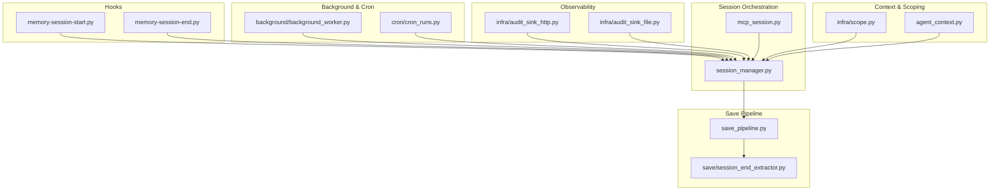
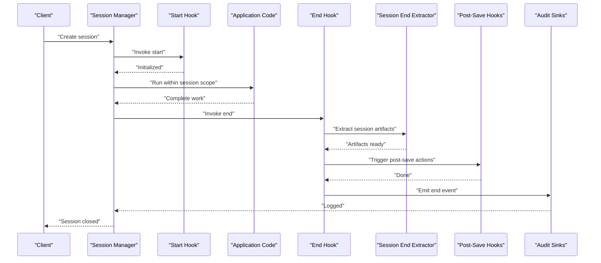
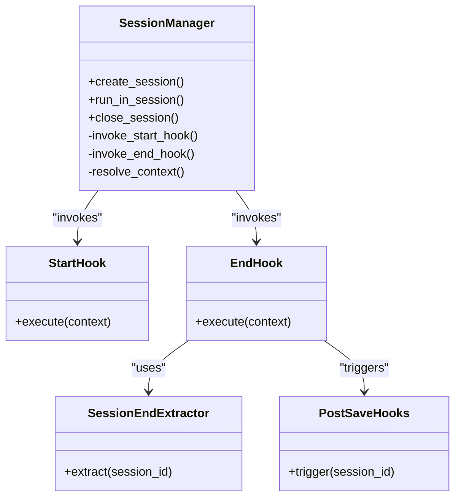
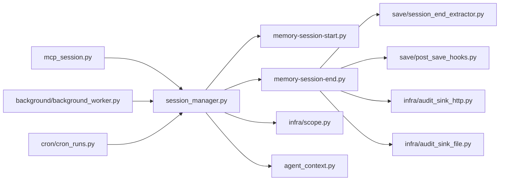

# Session Management Hooks

<cite>
**Referenced Files in This Document**
- [memory-session-start.py](file://hooks/memory-session-start.py)
- [memory-session-end.py](file://hooks/memory-session-end.py)
- [session_manager.py](file://session_manager.py)
- [mcp_session.py](file://mcp_session.py)
- [test_session_manager.py](file://tests/test_session_manager.py)
- [test_session_admin.py](file://tests/test_session_admin.py)
- [test_session_search.py](file://tests/test_session_search.py)
- [test_session_clustering_enhancement.py](file://tests/test_session_clustering_enhancement.py)
- [test_session_migration.py](file://tests/test_session_migration.py)
- [save_pipeline.py](file://save_pipeline.py)
- [save/session_end_extractor.py](file://save/session_end_extractor.py)
- [save/post_save_hooks.py](file://save/post_save_hooks.py)
- [background/background_worker.py](file://background/background_worker.py)
- [cron/cron_runs.py](file://cron/cron_runs.py)
- [infra/audit_sink_http.py](file://infra/audit_sink_http.py)
- [infra/audit_sink_file.py](file://infra/audit_sink_file.py)
- [infra/scope.py](file://infra/scope.py)
- [agent_context.py](file://agent_context.py)
</cite>

## Table of Contents
1. [Introduction](#introduction)
2. [Project Structure](#project-structure)
3. [Core Components](#core-components)
4. [Architecture Overview](#architecture-overview)
5. [Detailed Component Analysis](#detailed-component-analysis)
6. [Dependency Analysis](#dependency-analysis)
7. [Performance Considerations](#performance-considerations)
8. [Troubleshooting Guide](#troubleshooting-guide)
9. [Conclusion](#conclusion)
10. [Appendices](#appendices)

## Introduction
This document explains the session lifecycle hooks for session start and end events, how to implement custom logic for initialization, cleanup, and state management, and what context data is available during hook execution. It also provides practical examples for session-based analytics, audit logging, resource allocation, and cleanup procedures, along with guidance on isolation, concurrency, and error recovery.

## Project Structure
The session lifecycle hooks are implemented as executable scripts under the hooks directory and are invoked by the session manager and related components. The key files include:
- Start hook: memory-session-start.py
- End hook: memory-session-end.py
- Session orchestration: session_manager.py
- MCP session integration: mcp_session.py
- Save pipeline integration: save_pipeline.py and save/session_end_extractor.py
- Background worker and cron runners that may trigger sessions or interact with them
- Audit sinks used for logging and telemetry
- Scope and agent context utilities for tenant and user scoping

**Diagram sources**
- [memory-session-start.py](file://hooks/memory-session-start.py)
- [memory-session-end.py](file://hooks/memory-session-end.py)
- [session_manager.py](file://session_manager.py)
- [mcp_session.py](file://mcp_session.py)
- [save_pipeline.py](file://save_pipeline.py)
- [save/session_end_extractor.py](file://save/session_end_extractor.py)
- [background/background_worker.py](file://background/background_worker.py)
- [cron/cron_runs.py](file://cron/cron_runs.py)
- [infra/audit_sink_http.py](file://infra/audit_sink_http.py)
- [infra/audit_sink_file.py](file://infra/audit_sink_file.py)
- [infra/scope.py](file://infra/scope.py)
- [agent_context.py](file://agent_context.py)

**Section sources**
- [memory-session-start.py](file://hooks/memory-session-start.py)
- [memory-session-end.py](file://hooks/memory-session-end.py)
- [session_manager.py](file://session_manager.py)
- [mcp_session.py](file://mcp_session.py)
- [save_pipeline.py](file://save_pipeline.py)
- [save/session_end_extractor.py](file://save/session_end_extractor.py)
- [background/background_worker.py](file://background/background_worker.py)
- [cron/cron_runs.py](file://cron/cron_runs.py)
- [infra/audit_sink_http.py](file://infra/audit_sink_http.py)
- [infra/audit_sink_file.py](file://infra/audit_sink_file.py)
- [infra/scope.py](file://infra/scope.py)
- [agent_context.py](file://agent_context.py)

## Core Components
- Session start hook (memory-session-start.py): Invoked when a new session begins. Use it to initialize per-session resources, set up metrics counters, open connections, and record an audit event.
- Session end hook (memory-session-end.py): Invoked when a session concludes. Use it to flush buffers, release resources, finalize metrics, and record completion or failure details.
- Session manager (session_manager.py): Orchestrates lifecycle transitions, resolves configuration, and wires hooks into the runtime.
- MCP session integration (mcp_session.py): Bridges MCP operations with session lifecycle, ensuring consistent context propagation.
- Save pipeline integration (save_pipeline.py, save/session_end_extractor.py): Triggers end-of-session extraction and post-save processing; can be used to enrich end-hook behavior.
- Background worker and cron runners: May initiate sessions or coordinate long-running work that depends on session boundaries.
- Audit sinks (infra/audit_sink_http.py, infra/audit_sink_file.py): Provide pluggable destinations for audit logs emitted by hooks.
- Scope and agent context (infra/scope.py, agent_context.py): Supply tenant, user, and environment context accessible during hook execution.

**Section sources**
- [memory-session-start.py](file://hooks/memory-session-start.py)
- [memory-session-end.py](file://hooks/memory-session-end.py)
- [session_manager.py](file://session_manager.py)
- [mcp_session.py](file://mcp_session.py)
- [save_pipeline.py](file://save_pipeline.py)
- [save/session_end_extractor.py](file://save/session_end_extractor.py)
- [background/background_worker.py](file://background/background_worker.py)
- [cron/cron_runs.py](file://cron/cron_runs.py)
- [infra/audit_sink_http.py](file://infra/audit_sink_http.py)
- [infra/audit_sink_file.py](file://infra/audit_sink_file.py)
- [infra/scope.py](file://infra/scope.py)
- [agent_context.py](file://agent_context.py)

## Architecture Overview
The session lifecycle follows a clear sequence:
- Start: The session manager initializes a session and invokes the start hook.
- Work: Application code performs operations within the session scope.
- End: On completion or termination, the session manager invokes the end hook, which may call extractors and post-save hooks.

**Diagram sources**
- [session_manager.py](file://session_manager.py)
- [memory-session-start.py](file://hooks/memory-session-start.py)
- [memory-session-end.py](file://hooks/memory-session-end.py)
- [save/session_end_extractor.py](file://save/session_end_extractor.py)
- [save/post_save_hooks.py](file://save/post_save_hooks.py)
- [infra/audit_sink_http.py](file://infra/audit_sink_http.py)
- [infra/audit_sink_file.py](file://infra/audit_sink_file.py)

## Detailed Component Analysis

### Session Start Hook
Purpose:
- Initialize per-session state and resources.
- Record a start event for analytics and audit.
- Prepare any caches or connections scoped to the session.

Implementation patterns:
- Read session metadata from the provided context.
- Emit a structured start event to audit sinks.
- Store lightweight, thread-safe state if needed.

Available context:
- Session identifiers and timestamps.
- Tenant and user identity via scoping utilities.
- Environment variables relevant to the runtime.

Concurrency and isolation:
- Ensure all mutable state is isolated per session.
- Avoid sharing global mutable objects across sessions.

Error handling:
- Fail fast on critical initialization errors.
- Log detailed diagnostics to audit sinks.

Practical example ideas:
- Open a database connection pool scoped to the session.
- Initialize metrics counters for request counts and latency.
- Write an audit log entry with principal and tenant info.

**Section sources**
- [memory-session-start.py](file://hooks/memory-session-start.py)
- [infra/scope.py](file://infra/scope.py)
- [agent_context.py](file://agent_context.py)
- [infra/audit_sink_http.py](file://infra/audit_sink_http.py)
- [infra/audit_sink_file.py](file://infra/audit_sink_file.py)

### Session End Hook
Purpose:
- Perform cleanup and finalization.
- Extract session artifacts and persist them.
- Emit end events for analytics and audit.

Implementation patterns:
- Flush buffers and close resources.
- Call the session end extractor to prepare artifacts.
- Trigger post-save hooks to update indexes or summaries.
- Emit a structured end event including success/failure status.

Available context:
- Session identifiers and duration.
- Outcome flags and error information if applicable.
- Tenant and user identity via scoping utilities.

Concurrency and isolation:
- Ensure cleanup is idempotent and safe under concurrent invocations.
- Guard against double-cleanup using locks or flags.

Error handling:
- Capture and report errors without masking earlier failures.
- Use circuit breakers or retries where appropriate for external calls.

Practical example ideas:
- Persist extracted facts or summaries.
- Update search indexes or knowledge graph projections.
- Send a final analytics event with total operations and latency.

**Section sources**
- [memory-session-end.py](file://hooks/memory-session-end.py)
- [save/session_end_extractor.py](file://save/session_end_extractor.py)
- [save/post_save_hooks.py](file://save/post_save_hooks.py)
- [infra/audit_sink_http.py](file://infra/audit_sink_http.py)
- [infra/audit_sink_file.py](file://infra/audit_sink_file.py)

### Session Manager Integration
Responsibilities:
- Create and manage session lifecycles.
- Resolve configuration and context before invoking hooks.
- Coordinate with save pipeline and background workers.

Integration points:
- Invokes start hook upon session creation.
- Invokes end hook upon session completion or cancellation.
- Wires extractor and post-save hooks during end flow.

**Diagram sources**
- [session_manager.py](file://session_manager.py)
- [memory-session-start.py](file://hooks/memory-session-start.py)
- [memory-session-end.py](file://hooks/memory-session-end.py)
- [save/session_end_extractor.py](file://save/session_end_extractor.py)
- [save/post_save_hooks.py](file://save/post_save_hooks.py)

**Section sources**
- [session_manager.py](file://session_manager.py)
- [save_pipeline.py](file://save_pipeline.py)
- [save/session_end_extractor.py](file://save/session_end_extractor.py)
- [save/post_save_hooks.py](file://save/post_save_hooks.py)

### MCP Session Integration
Responsibilities:
- Bridge MCP operations with session lifecycle.
- Propagate context (tenant, user, environment) consistently.
- Ensure MCP requests run within proper session scopes.

Key behaviors:
- Wrap MCP handlers with session-aware middleware.
- Emit audit events for MCP interactions.
- Handle errors and timeouts gracefully.

**Section sources**
- [mcp_session.py](file://mcp_session.py)
- [infra/scope.py](file://infra/scope.py)
- [agent_context.py](file://agent_context.py)

### Background Worker and Cron Integration
Responsibilities:
- Initiate sessions for batch jobs or scheduled tasks.
- Respect session boundaries for resource accounting and audit.
- Integrate with session manager to ensure consistent lifecycle.

Key behaviors:
- Create short-lived sessions for discrete tasks.
- Record start/end events for each task session.
- Use isolation to prevent cross-task interference.

**Section sources**
- [background/background_worker.py](file://background/background_worker.py)
- [cron/cron_runs.py](file://cron/cron_runs.py)
- [session_manager.py](file://session_manager.py)

## Dependency Analysis
The following diagram shows how core components depend on each other during session lifecycle:

**Diagram sources**
- [session_manager.py](file://session_manager.py)
- [memory-session-start.py](file://hooks/memory-session-start.py)
- [memory-session-end.py](file://hooks/memory-session-end.py)
- [save/session_end_extractor.py](file://save/session_end_extractor.py)
- [save/post_save_hooks.py](file://save/post_save_hooks.py)
- [infra/scope.py](file://infra/scope.py)
- [agent_context.py](file://agent_context.py)
- [infra/audit_sink_http.py](file://infra/audit_sink_http.py)
- [infra/audit_sink_file.py](file://infra/audit_sink_file.py)
- [mcp_session.py](file://mcp_session.py)
- [background/background_worker.py](file://background/background_worker.py)
- [cron/cron_runs.py](file://cron/cron_runs.py)

**Section sources**
- [session_manager.py](file://session_manager.py)
- [memory-session-start.py](file://hooks/memory-session-start.py)
- [memory-session-end.py](file://hooks/memory-session-end.py)
- [save/session_end_extractor.py](file://save/session_end_extractor.py)
- [save/post_save_hooks.py](file://save/post_save_hooks.py)
- [infra/scope.py](file://infra/scope.py)
- [agent_context.py](file://agent_context.py)
- [infra/audit_sink_http.py](file://infra/audit_sink_http.py)
- [infra/audit_sink_file.py](file://infra/audit_sink_file.py)
- [mcp_session.py](file://mcp_session.py)
- [background/background_worker.py](file://background/background_worker.py)
- [cron/cron_runs.py](file://cron/cron_runs.py)

## Performance Considerations
- Keep hooks lightweight and asynchronous where possible to avoid blocking the main session flow.
- Batch writes to audit sinks and use backpressure mechanisms to prevent overload.
- Reuse connections and caches within a session but ensure they are closed at end.
- Avoid heavy computation in hooks; delegate to background workers if necessary.
- Monitor hook latency and error rates; instrument with metrics and alerts.

[No sources needed since this section provides general guidance]

## Troubleshooting Guide
Common issues and strategies:
- Missing context: Verify tenant and user scoping is resolved before invoking hooks.
- Resource leaks: Ensure all opened resources are closed in the end hook, even on errors.
- Duplicate cleanup: Implement idempotency guards to prevent double-cleanup.
- Audit gaps: Confirm both start and end events are emitted and persisted.
- Concurrency conflicts: Use per-session locks or queues to serialize shared resource access.

Diagnostic steps:
- Inspect audit sink outputs for anomalies.
- Check session manager logs for hook invocation traces.
- Validate extractor outputs and post-save hook results.

**Section sources**
- [infra/audit_sink_http.py](file://infra/audit_sink_http.py)
- [infra/audit_sink_file.py](file://infra/audit_sink_file.py)
- [session_manager.py](file://session_manager.py)
- [save/session_end_extractor.py](file://save/session_end_extractor.py)
- [save/post_save_hooks.py](file://save/post_save_hooks.py)

## Conclusion
Session lifecycle hooks provide a robust mechanism for initializing and finalizing per-session work. By leveraging the start and end hooks, you can implement analytics, audit logging, resource allocation, and cleanup procedures while maintaining isolation and concurrency safety. Proper integration with the session manager, extractor, and post-save hooks ensures consistency and observability across the system.

[No sources needed since this section summarizes without analyzing specific files]

## Appendices

### Practical Examples

- Session-based analytics
  - Emit start and end events with session identifiers, duration, and operation counts.
  - Aggregate metrics in a time series store and expose dashboards.

- Audit logging
  - Record principal, tenant, and action details in structured format.
  - Route logs to HTTP and file sinks for redundancy.

- Resource allocation and cleanup
  - Allocate DB connections, caches, or model instances in the start hook.
  - Release and reset resources in the end hook; handle partial failures gracefully.

- State management
  - Maintain per-session state in thread-local storage or explicit context objects.
  - Serialize access to shared resources using locks or queues.

- Error recovery strategies
  - Retry transient failures with exponential backoff.
  - Fallback to local buffering and later replay when sinks are unavailable.
  - Mark sessions as failed and notify operators via alerts.

[No sources needed since this section provides general guidance]

### Testing and Validation
Use existing tests to validate behavior and edge cases:
- Session manager behavior and lifecycle transitions.
- Admin operations and search flows within sessions.
- Clustering enhancements and migration scenarios.

**Section sources**
- [test_session_manager.py](file://tests/test_session_manager.py)
- [test_session_admin.py](file://tests/test_session_admin.py)
- [test_session_search.py](file://tests/test_session_search.py)
- [test_session_clustering_enhancement.py](file://tests/test_session_clustering_enhancement.py)
- [test_session_migration.py](file://tests/test_session_migration.py)