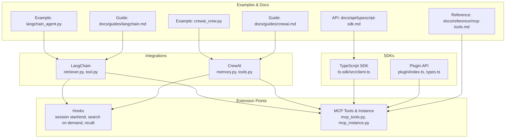
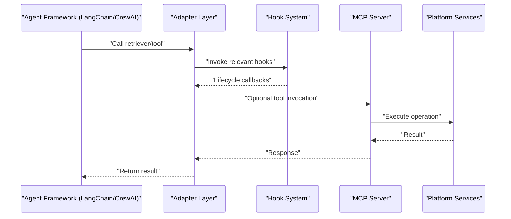
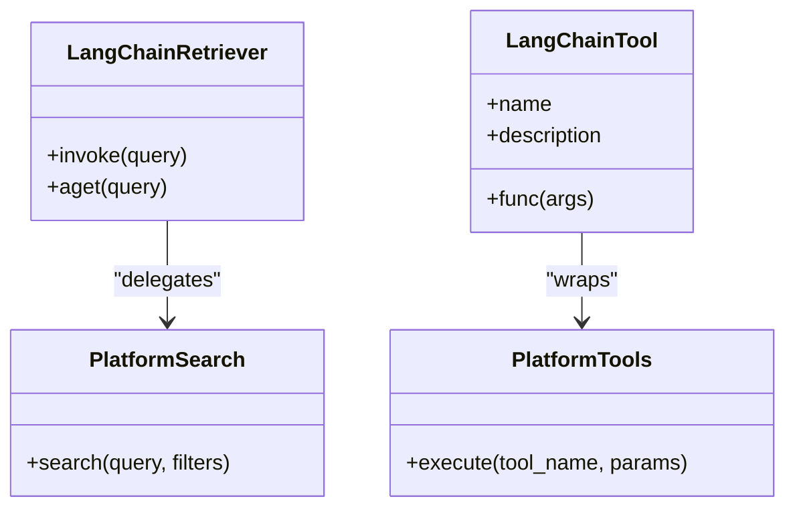
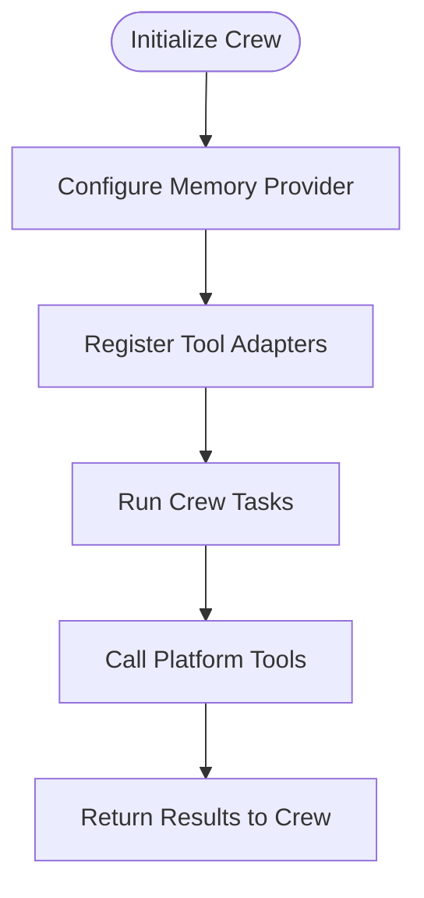
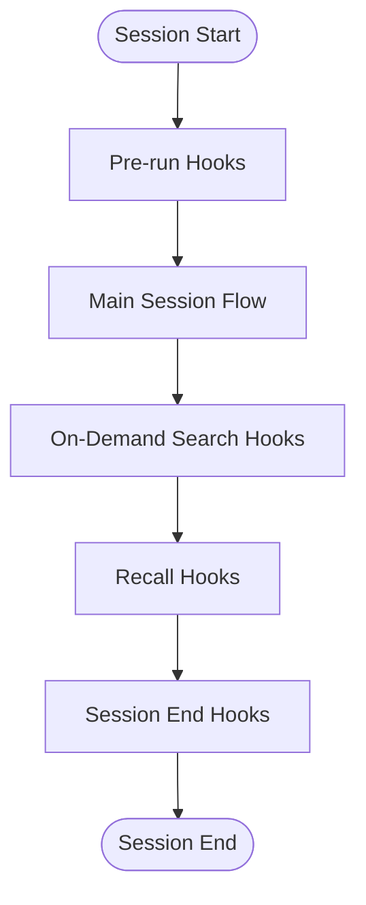
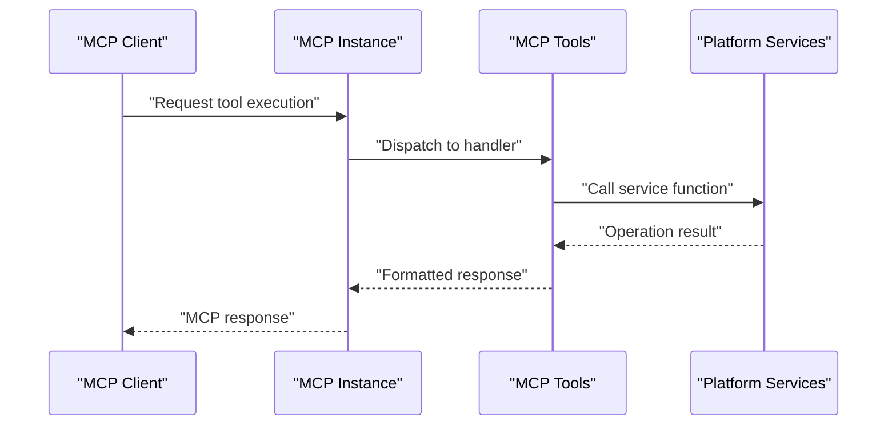
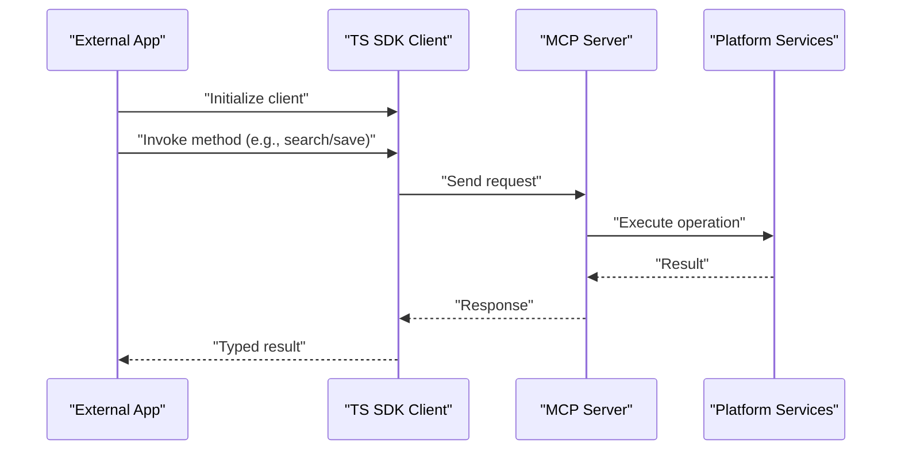
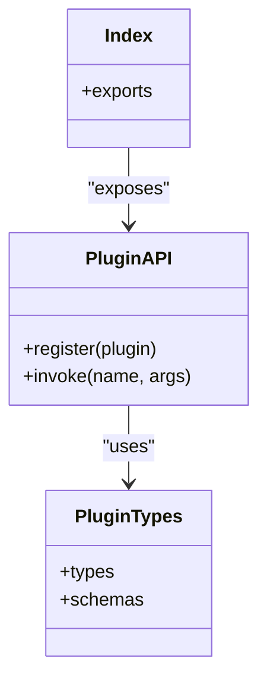
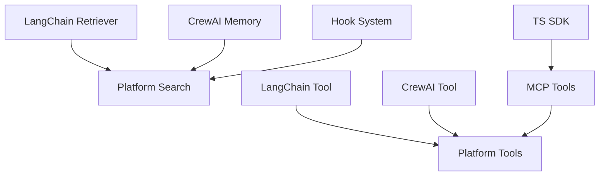

# Integrations

<cite>
**Referenced Files in This Document**
- [agentic_memory/integrations/langchain/__init__.py](file://agentic_memory/integrations/langchain/__init__.py)
- [agentic_memory/integrations/langchain/retriever.py](file://agentic_memory/integrations/langchain/retriever.py)
- [agentic_memory/integrations/langchain/tool.py](file://agentic_memory/integrations/langchain/tool.py)
- [agentic_memory/integrations/crewai/__init__.py](file://agentic_memory/integrations/crewai/__init__.py)
- [agentic_memory/integrations/crewai/memory.py](file://agentic_memory/integrations/crewai/memory.py)
- [agentic_memory/integrations/crewai/tools.py](file://agentic_memory/integrations/crewai/tools.py)
- [coordination/hooks.py](file://coordination/hooks.py)
- [hooks/memory-session-start.py](file://hooks/memory-session-start.py)
- [hooks/memory-session-end.py](file://hooks/memory-session-end.py)
- [hooks/memory-search-on-demand.py](file://hooks/memory-search-on-demand.py)
- [hooks/memory-recall-session.py](file://hooks/memory-recall-session.py)
- [mcp_tools.py](file://mcp_tools.py)
- [mcp_instance.py](file://mcp_instance.py)
- [plugin/index.ts](file://plugin/index.ts)
- [plugin/types.ts](file://plugin/types.ts)
- [ts-sdk/src/client.ts](file://ts-sdk/src/client.ts)
- [examples/langchain_agent.py](file://examples/langchain_agent.py)
- [examples/crewai_crew.py](file://examples/crewai_crew.py)
- [docs/guides/langchain.md](file://docs/guides/langchain.md)
- [docs/guides/crewai.md](file://docs/guides/crewai.md)
- [docs/reference/mcp-tools.md](file://docs/reference/mcp-tools.md)
- [docs/api/typescript-sdk.md](file://docs/api/typescript-sdk.md)
</cite>

## Table of Contents
1. [Introduction](#introduction)
2. [Project Structure](#project-structure)
3. [Core Components](#core-components)
4. [Architecture Overview](#architecture-overview)
5. [Detailed Component Analysis](#detailed-component-analysis)
6. [Dependency Analysis](#dependency-analysis)
7. [Performance Considerations](#performance-considerations)
8. [Troubleshooting Guide](#troubleshooting-guide)
9. [Conclusion](#conclusion)
10. [Appendices](#appendices)

## Introduction
This document explains how to integrate external frameworks and systems with the platform’s memory and tooling surface. It covers:
- LangChain integration via retrievers and tool adapters
- CrewAI integration patterns, including memory provider setup
- The hook system for injecting custom behavior at key lifecycle points
- MCP tool development and usage
- TypeScript SDK usage for external integrations
- Practical examples for building custom integrations, extending connectors, and composing plugin architectures
- Cross-cutting concerns: authentication, configuration management, and error handling

## Project Structure
The repository organizes integrations under a dedicated package and provides example scripts and documentation guides. Key areas include:
- Python integrations for LangChain and CrewAI
- Hook-based extension points for session and search lifecycle events
- MCP server tools and instance wiring
- TypeScript plugin and SDK for external systems

**Diagram sources**
- [agentic_memory/integrations/langchain/retriever.py](file://agentic_memory/integrations/langchain/retriever.py)
- [agentic_memory/integrations/langchain/tool.py](file://agentic_memory/integrations/langchain/tool.py)
- [agentic_memory/integrations/crewai/memory.py](file://agentic_memory/integrations/crewai/memory.py)
- [agentic_memory/integrations/crewai/tools.py](file://agentic_memory/integrations/crewai/tools.py)
- [coordination/hooks.py](file://coordination/hooks.py)
- [hooks/memory-session-start.py](file://hooks/memory-session-start.py)
- [hooks/memory-session-end.py](file://hooks/memory-session-end.py)
- [hooks/memory-search-on-demand.py](file://hooks/memory-search-on-demand.py)
- [hooks/memory-recall-session.py](file://hooks/memory-recall-session.py)
- [mcp_tools.py](file://mcp_tools.py)
- [mcp_instance.py](file://mcp_instance.py)
- [ts-sdk/src/client.ts](file://ts-sdk/src/client.ts)
- [plugin/index.ts](file://plugin/index.ts)
- [plugin/types.ts](file://plugin/types.ts)
- [examples/langchain_agent.py](file://examples/langchain_agent.py)
- [examples/crewai_crew.py](file://examples/crewai_crew.py)
- [docs/guides/langchain.md](file://docs/guides/langchain.md)
- [docs/guides/crewai.md](file://docs/guides/crewai.md)
- [docs/reference/mcp-tools.md](file://docs/reference/mcp-tools.md)
- [docs/api/typescript-sdk.md](file://docs/api/typescript-sdk.md)

**Section sources**
- [agentic_memory/integrations/langchain/__init__.py](file://agentic_memory/integrations/langchain/__init__.py)
- [agentic_memory/integrations/crewai/__init__.py](file://agentic_memory/integrations/crewai/__init__.py)

## Core Components
- LangChain Retriever Adapter: Bridges the platform’s retrieval pipeline to LangChain-compatible interfaces.
- LangChain Tool Adapter: Exposes platform capabilities as LangChain tools.
- CrewAI Memory Provider: Supplies context-aware memory to CrewAI agents.
- CrewAI Tool Adapters: Provides CrewAI-compatible tools backed by platform services.
- Hooks System: Lifecycle hooks for session start/end, on-demand search, and recall.
- MCP Tools and Server: A set of tools and an instance that expose platform operations over MCP.
- TypeScript SDK and Plugin API: Client libraries for external systems to interact with the platform.

**Section sources**
- [agentic_memory/integrations/langchain/retriever.py](file://agentic_memory/integrations/langchain/retriever.py)
- [agentic_memory/integrations/langchain/tool.py](file://agentic_memory/integrations/langchain/tool.py)
- [agentic_memory/integrations/crewai/memory.py](file://agentic_memory/integrations/crewai/memory.py)
- [agentic_memory/integrations/crewai/tools.py](file://agentic_memory/integrations/crewai/tools.py)
- [coordination/hooks.py](file://coordination/hooks.py)
- [hooks/memory-session-start.py](file://hooks/memory-session-start.py)
- [hooks/memory-session-end.py](file://hooks/memory-session-end.py)
- [hooks/memory-search-on-demand.py](file://hooks/memory-search-on-demand.py)
- [hooks/memory-recall-session.py](file://hooks/memory-recall-session.py)
- [mcp_tools.py](file://mcp_tools.py)
- [mcp_instance.py](file://mcp_instance.py)
- [ts-sdk/src/client.ts](file://ts-sdk/src/client.ts)
- [plugin/index.ts](file://plugin/index.ts)
- [plugin/types.ts](file://plugin/types.ts)

## Architecture Overview
The integration layer exposes multiple entry points:
- LangChain and CrewAI adapters connect agent frameworks to the platform’s memory and tools.
- Hooks allow custom logic to run during session and search lifecycles.
- MCP tools provide a protocol-based interface for external clients.
- TypeScript SDK and Plugin API enable programmatic access from JavaScript/TypeScript environments.

**Diagram sources**
- [agentic_memory/integrations/langchain/retriever.py](file://agentic_memory/integrations/langchain/retriever.py)
- [agentic_memory/integrations/langchain/tool.py](file://agentic_memory/integrations/langchain/tool.py)
- [agentic_memory/integrations/crewai/memory.py](file://agentic_memory/integrations/crewai/memory.py)
- [agentic_memory/integrations/crewai/tools.py](file://agentic_memory/integrations/crewai/tools.py)
- [coordination/hooks.py](file://coordination/hooks.py)
- [hooks/memory-session-start.py](file://hooks/memory-session-start.py)
- [hooks/memory-session-end.py](file://hooks/memory-session-end.py)
- [hooks/memory-search-on-demand.py](file://hooks/memory-search-on-demand.py)
- [hooks/memory-recall-session.py](file://hooks/memory-recall-session.py)
- [mcp_tools.py](file://mcp_tools.py)
- [mcp_instance.py](file://mcp_instance.py)

## Detailed Component Analysis

### LangChain Integration
- Retriever implementation: Wraps platform retrieval into a LangChain-compatible retriever interface.
- Tool adapter: Exposes platform functions as LangChain tools with consistent signatures and error semantics.
- Example usage: Demonstrates wiring a LangChain agent with the platform’s retriever and tools.

**Diagram sources**
- [agentic_memory/integrations/langchain/retriever.py](file://agentic_memory/integrations/langchain/retriever.py)
- [agentic_memory/integrations/langchain/tool.py](file://agentic_memory/integrations/langchain/tool.py)

**Section sources**
- [agentic_memory/integrations/langchain/retriever.py](file://agentic_memory/integrations/langchain/retriever.py)
- [agentic_memory/integrations/langchain/tool.py](file://agentic_memory/integrations/langchain/tool.py)
- [examples/langchain_agent.py](file://examples/langchain_agent.py)
- [docs/guides/langchain.md](file://docs/guides/langchain.md)

### CrewAI Integration
- Memory provider: Supplies contextual memories to CrewAI agents through a provider interface.
- Tool adapters: Provide CrewAI-compatible tools backed by platform services.
- Example usage: Shows creating a Crew with memory and tools integrated.

**Diagram sources**
- [agentic_memory/integrations/crewai/memory.py](file://agentic_memory/integrations/crewai/memory.py)
- [agentic_memory/integrations/crewai/tools.py](file://agentic_memory/integrations/crewai/tools.py)

**Section sources**
- [agentic_memory/integrations/crewai/memory.py](file://agentic_memory/integrations/crewai/memory.py)
- [agentic_memory/integrations/crewai/tools.py](file://agentic_memory/integrations/crewai/tools.py)
- [examples/crewai_crew.py](file://examples/crewai_crew.py)
- [docs/guides/crewai.md](file://docs/guides/crewai.md)

### Hook System for Custom Behavior Injection
The hook system allows you to inject custom logic at key lifecycle points:
- Session start: Initialize context or precompute hints.
- Session end: Finalize state, persist summaries, or trigger downstream actions.
- Search on demand: Augment queries, apply filters, or enrich results.
- Recall session: Prepare or adjust recalled content before delivery.

**Diagram sources**
- [coordination/hooks.py](file://coordination/hooks.py)
- [hooks/memory-session-start.py](file://hooks/memory-session-start.py)
- [hooks/memory-session-end.py](file://hooks/memory-session-end.py)
- [hooks/memory-search-on-demand.py](file://hooks/memory-search-on-demand.py)
- [hooks/memory-recall-session.py](file://hooks/memory-recall-session.py)

**Section sources**
- [coordination/hooks.py](file://coordination/hooks.py)
- [hooks/memory-session-start.py](file://hooks/memory-session-start.py)
- [hooks/memory-session-end.py](file://hooks/memory-session-end.py)
- [hooks/memory-search-on-demand.py](file://hooks/memory-search-on-demand.py)
- [hooks/memory-recall-session.py](file://hooks/memory-recall-session.py)

### MCP Tool Development
MCP tools expose platform capabilities over the Model Context Protocol. You can:
- Register new tools in the MCP server instance.
- Implement handlers that call platform services.
- Use the reference documentation to understand available verbs and maintenance operations.

**Diagram sources**
- [mcp_tools.py](file://mcp_tools.py)
- [mcp_instance.py](file://mcp_instance.py)

**Section sources**
- [mcp_tools.py](file://mcp_tools.py)
- [mcp_instance.py](file://mcp_instance.py)
- [docs/reference/mcp-tools.md](file://docs/reference/mcp-tools.md)

### TypeScript SDK Usage
The TypeScript SDK enables external systems to interact with the platform programmatically. Typical usage includes:
- Initializing the client with credentials and base URL.
- Calling methods for search, save, and tool invocations.
- Handling errors and retries according to SDK conventions.

**Diagram sources**
- [ts-sdk/src/client.ts](file://ts-sdk/src/client.ts)

**Section sources**
- [ts-sdk/src/client.ts](file://ts-sdk/src/client.ts)
- [docs/api/typescript-sdk.md](file://docs/api/typescript-sdk.md)

### Plugin Architecture
The plugin API provides a structured way to extend behavior using TypeScript:
- Define plugin types and behaviors.
- Register plugins with the runtime.
- Compose multiple plugins to build complex integrations.

**Diagram sources**
- [plugin/index.ts](file://plugin/index.ts)
- [plugin/types.ts](file://plugin/types.ts)

**Section sources**
- [plugin/index.ts](file://plugin/index.ts)
- [plugin/types.ts](file://plugin/types.ts)

## Dependency Analysis
Integration components depend on core platform services and each other through well-defined adapters and hooks. The following diagram shows high-level dependencies among integration modules.

**Diagram sources**
- [agentic_memory/integrations/langchain/retriever.py](file://agentic_memory/integrations/langchain/retriever.py)
- [agentic_memory/integrations/langchain/tool.py](file://agentic_memory/integrations/langchain/tool.py)
- [agentic_memory/integrations/crewai/memory.py](file://agentic_memory/integrations/crewai/memory.py)
- [agentic_memory/integrations/crewai/tools.py](file://agentic_memory/integrations/crewai/tools.py)
- [coordination/hooks.py](file://coordination/hooks.py)
- [mcp_tools.py](file://mcp_tools.py)
- [ts-sdk/src/client.ts](file://ts-sdk/src/client.ts)

**Section sources**
- [agentic_memory/integrations/langchain/retriever.py](file://agentic_memory/integrations/langchain/retriever.py)
- [agentic_memory/integrations/langchain/tool.py](file://agentic_memory/integrations/langchain/tool.py)
- [agentic_memory/integrations/crewai/memory.py](file://agentic_memory/integrations/crewai/memory.py)
- [agentic_memory/integrations/crewai/tools.py](file://agentic_memory/integrations/crewai/tools.py)
- [coordination/hooks.py](file://coordination/hooks.py)
- [mcp_tools.py](file://mcp_tools.py)
- [ts-sdk/src/client.ts](file://ts-sdk/src/client.ts)

## Performance Considerations
- Prefer batched retrievals and tool calls where possible to reduce overhead.
- Leverage caching layers exposed by platform services when available.
- Tune hook execution to avoid blocking critical paths; offload heavy work to background tasks.
- Monitor latency and throughput via MCP metrics endpoints if enabled.

[No sources needed since this section provides general guidance]

## Troubleshooting Guide
Common issues and resolutions:
- Authentication failures: Ensure credentials are correctly configured for MCP and SDK clients.
- Configuration drift: Validate environment variables and config files against expected schemas.
- Error propagation: Inspect adapter and hook error handling to ensure meaningful messages and retries.
- Hook side effects: Verify hooks do not introduce deadlocks or excessive I/O.

**Section sources**
- [mcp_auth.py](file://mcp_auth.py)
- [infra/config.py](file://infra/config.py)
- [coordination/hooks.py](file://coordination/hooks.py)

## Conclusion
The integration layer provides robust pathways to connect LangChain, CrewAI, MCP clients, and TypeScript applications to the platform’s memory and tooling. By leveraging adapters, hooks, and SDKs, you can implement secure, configurable, and extensible integrations while maintaining clear error handling and performance characteristics.

[No sources needed since this section summarizes without analyzing specific files]

## Appendices
- Example scripts:
  - LangChain agent example: [examples/langchain_agent.py](file://examples/langchain_agent.py)
  - CrewAI crew example: [examples/crewai_crew.py](file://examples/crewai_crew.py)
- Guides and references:
  - LangChain guide: [docs/guides/langchain.md](file://docs/guides/langchain.md)
  - CrewAI guide: [docs/guides/crewai.md](file://docs/guides/crewai.md)
  - MCP tools reference: [docs/reference/mcp-tools.md](file://docs/reference/mcp-tools.md)
  - TypeScript SDK API: [docs/api/typescript-sdk.md](file://docs/api/typescript-sdk.md)

**Section sources**
- [examples/langchain_agent.py](file://examples/langchain_agent.py)
- [examples/crewai_crew.py](file://examples/crewai_crew.py)
- [docs/guides/langchain.md](file://docs/guides/langchain.md)
- [docs/guides/crewai.md](file://docs/guides/crewai.md)
- [docs/reference/mcp-tools.md](file://docs/reference/mcp-tools.md)
- [docs/api/typescript-sdk.md](file://docs/api/typescript-sdk.md)