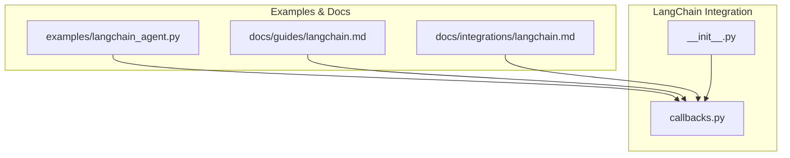
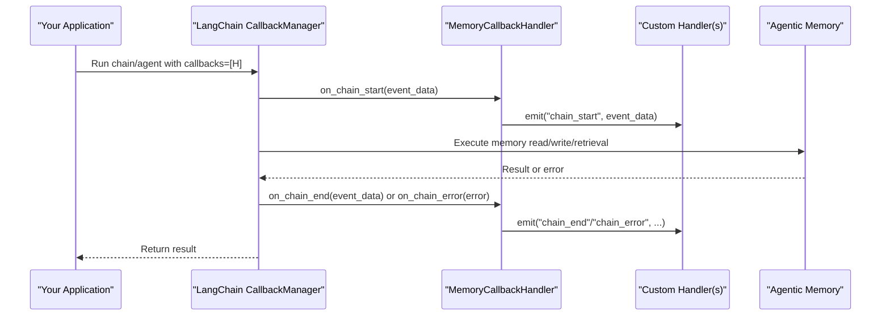
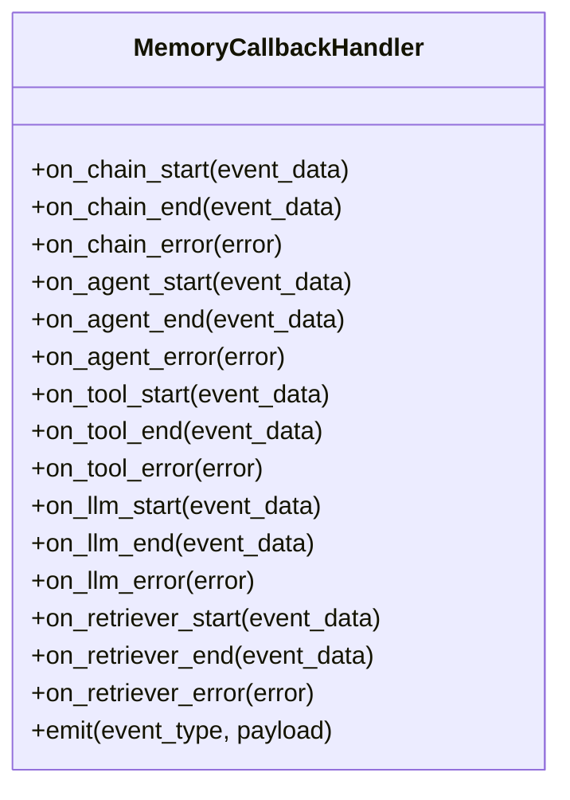
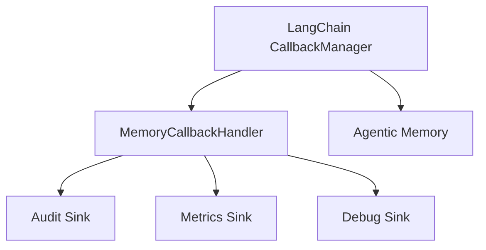

# Callback Handler

<cite>
**Referenced Files in This Document**
- [agentic_memory/integrations/langchain/callbacks.py](file://agentic_memory/integrations/langchain/callbacks.py)
- [agentic_memory/integrations/langchain/__init__.py](file://agentic_memory/integrations/langchain/__init__.py)
- [examples/langchain_agent.py](file://examples/langchain_agent.py)
- [docs/guides/langchain.md](file://docs/guides/langchain.md)
- [docs/integrations/langchain.md](file://docs/integrations/langchain.md)
</cite>

## Table of Contents
1. [Introduction](#introduction)
2. [Project Structure](#project-structure)
3. [Core Components](#core-components)
4. [Architecture Overview](#architecture-overview)
5. [Detailed Component Analysis](#detailed-component-analysis)
6. [Dependency Analysis](#dependency-analysis)
7. [Performance Considerations](#performance-considerations)
8. [Troubleshooting Guide](#troubleshooting-guide)
9. [Conclusion](#conclusion)
10. [Appendices](#appendices)

## Introduction
This document explains the LangChain callback handler that enables monitoring and logging of memory operations within the Agentic Memory system. It covers:
- The callback event types surfaced by the handler
- Data structures passed to callbacks
- Implementation patterns for custom handlers (audit logging, metrics collection, debugging)
- Integration with LangChain’s callback system
- Async support and error propagation behavior
- Performance implications and best practices for production deployments

The goal is to help you instrument memory operations end-to-end while keeping latency and overhead minimal in production environments.

## Project Structure
The LangChain integration lives under the integrations package and exposes a ready-to-use callback handler. Example usage and documentation are provided in examples and docs.

**Diagram sources**
- [agentic_memory/integrations/langchain/callbacks.py](file://agentic_memory/integrations/langchain/callbacks.py)
- [agentic_memory/integrations/langchain/__init__.py](file://agentic_memory/integrations/langchain/__init__.py)
- [examples/langchain_agent.py](file://examples/langchain_agent.py)
- [docs/guides/langchain.md](file://docs/guides/langchain.md)
- [docs/integrations/langchain.md](file://docs/integrations/langchain.md)

**Section sources**
- [agentic_memory/integrations/langchain/callbacks.py](file://agentic_memory/integrations/langchain/callbacks.py)
- [agentic_memory/integrations/langchain/__init__.py](file://agentic_memory/integrations/langchain/__init__.py)
- [examples/langchain_agent.py](file://examples/langchain_agent.py)
- [docs/guides/langchain.md](file://docs/guides/langchain.md)
- [docs/integrations/langchain.md](file://docs/integrations/langchain.md)

## Core Components
- Callback handler class implementing LangChain’s callback interface for memory operations.
- Event emission points around memory reads/writes, retrieval, and persistence.
- Optional async-aware methods to support asynchronous chains and agents.
- Error propagation hooks to capture failures without breaking application flows.

Key responsibilities:
- Emit structured events for each memory operation lifecycle stage
- Provide consistent metadata (tenant, session, agent, operation type)
- Allow pluggable sinks (logs, metrics, audit trails) via custom handlers

**Section sources**
- [agentic_memory/integrations/langchain/callbacks.py](file://agentic_memory/integrations/langchain/callbacks.py)
- [agentic_memory/integrations/langchain/__init__.py](file://agentic_memory/integrations/langchain/__init__.py)

## Architecture Overview
The handler integrates into LangChain’s callback manager and intercepts memory-related steps. Custom handlers can be composed to implement auditing, metrics, and debugging.

**Diagram sources**
- [agentic_memory/integrations/langchain/callbacks.py](file://agentic_memory/integrations/langchain/callbacks.py)
- [examples/langchain_agent.py](file://examples/langchain_agent.py)

## Detailed Component Analysis

### MemoryCallbackHandler
The core handler implements LangChain’s callback protocol to observe memory operations. It emits typed events with standardized payloads and supports both sync and async execution paths.

- Event types typically include:
  - Chain start/end/error
  - Agent start/end/error
  - Tool start/end/error (when tools interact with memory)
  - LLM start/end/error (for prompts/responses related to memory)
  - Retriever start/end/error (for search/retrieval steps)
  - Custom memory-specific events (e.g., save, load, delete, query)

- Payload structure includes:
  - Operation identifiers (run_id, parent_run_id)
  - Timestamps and durations
  - Contextual metadata (tenant_id, session_id, agent_id, user_id)
  - Input/output summaries (sanitized)
  - Status and error details when applicable

- Async support:
  - Implements async variants where available to avoid blocking in async contexts
  - Ensures proper context propagation across async boundaries

- Error propagation:
  - Errors are captured and forwarded to sinks without raising unless explicitly configured
  - Allows downstream components to continue even if logging fails

**Diagram sources**
- [agentic_memory/integrations/langchain/callbacks.py](file://agentic_memory/integrations/langchain/callbacks.py)

**Section sources**
- [agentic_memory/integrations/langchain/callbacks.py](file://agentic_memory/integrations/langchain/callbacks.py)

### Integration Patterns

#### Registering the Handler
- Add the handler to LangChain’s CallbackManager when constructing chains or agents.
- Use the public API exposed by the integration module to instantiate and configure the handler.

Example references:
- [examples/langchain_agent.py](file://examples/langchain_agent.py)
- [docs/guides/langchain.md](file://docs/guides/langchain.md)
- [docs/integrations/langchain.md](file://docs/integrations/langchain.md)

**Section sources**
- [examples/langchain_agent.py](file://examples/langchain_agent.py)
- [docs/guides/langchain.md](file://docs/guides/langchain.md)
- [docs/integrations/langchain.md](file://docs/integrations/langchain.md)

### Custom Handler Implementations

#### Audit Logging Handler
Purpose: Record immutable audit trails for all memory operations.

Implementation pattern:
- Subscribe to relevant events (save, load, delete, query)
- Enforce PII redaction and tenant scoping
- Write to an append-only sink (e.g., file, HTTP endpoint, message queue)
- Include correlation IDs and timestamps for traceability

Best practices:
- Batch writes to reduce I/O overhead
- Separate slow sinks from hot paths using queues
- Ensure idempotency and deduplication at the sink layer

#### Metrics Collection Handler
Purpose: Capture performance and operational metrics for dashboards and alerts.

Implementation pattern:
- Track latencies per operation type
- Count successes/failures and categorize errors
- Emit counters, histograms, and gauges to your metrics backend
- Tag metrics with tenant/session/operation dimensions

Best practices:
- Avoid synchronous network calls in hot paths; use async or background workers
- Apply sampling for high-volume events
- Normalize metric names and tags consistently

#### Debugging Handler
Purpose: Provide detailed logs for local development and troubleshooting.

Implementation pattern:
- Log full inputs/outputs (with sensitive data masked)
- Include stack traces on errors
- Support log levels and selective verbosity
- Correlate logs via run IDs and spans

Best practices:
- Disable verbose logging in production
- Use structured logging formats compatible with log aggregators
- Keep debug handlers lightweight

**Section sources**
- [agentic_memory/integrations/langchain/callbacks.py](file://agentic_memory/integrations/langchain/callbacks.py)

## Dependency Analysis
The callback handler depends on LangChain’s callback interfaces and may integrate with internal telemetry or storage backends through pluggable sinks.

**Diagram sources**
- [agentic_memory/integrations/langchain/callbacks.py](file://agentic_memory/integrations/langchain/callbacks.py)
- [examples/langchain_agent.py](file://examples/langchain_agent.py)

**Section sources**
- [agentic_memory/integrations/langchain/callbacks.py](file://agentic_memory/integrations/langchain/callbacks.py)
- [examples/langchain_agent.py](file://examples/langchain_agent.py)

## Performance Considerations
- Prefer async handlers to avoid blocking request threads.
- Use batching and backpressure for external sinks (HTTP, queues).
- Sample high-frequency events (debug logs, fine-grained metrics).
- Redact large payloads early to minimize serialization costs.
- Keep handler logic simple; offload heavy processing to background workers.
- Monitor tail latencies and error rates for callback sinks.

[No sources needed since this section provides general guidance]

## Troubleshooting Guide
Common issues and resolutions:
- Missing events: Verify the handler is registered with the correct CallbackManager instance.
- High latency: Check sink throughput and consider batching or async I/O.
- Dropped events: Ensure sinks handle retries and backpressure gracefully.
- PII leaks: Confirm redaction rules are applied before emitting events.
- Async deadlocks: Avoid synchronous I/O inside async callbacks.

Operational checks:
- Inspect error propagation paths in the handler.
- Validate correlation IDs propagate across nested runs.
- Review sink health endpoints and alerting.

**Section sources**
- [agentic_memory/integrations/langchain/callbacks.py](file://agentic_memory/integrations/langchain/callbacks.py)

## Conclusion
The LangChain callback handler provides a robust foundation for monitoring and logging memory operations. By composing custom handlers for audit, metrics, and debugging, you can achieve comprehensive observability while maintaining low overhead. Follow the best practices for async support, error handling, and performance to ensure reliable production deployments.

[No sources needed since this section summarizes without analyzing specific files]

## Appendices

### Quick Start Checklist
- Instantiate the memory callback handler
- Register it with LangChain’s CallbackManager
- Compose additional sinks (audit, metrics, debug)
- Test sync and async flows
- Enable sampling and redaction in production

**Section sources**
- [examples/langchain_agent.py](file://examples/langchain_agent.py)
- [docs/guides/langchain.md](file://docs/guides/langchain.md)
- [docs/integrations/langchain.md](file://docs/integrations/langchain.md)