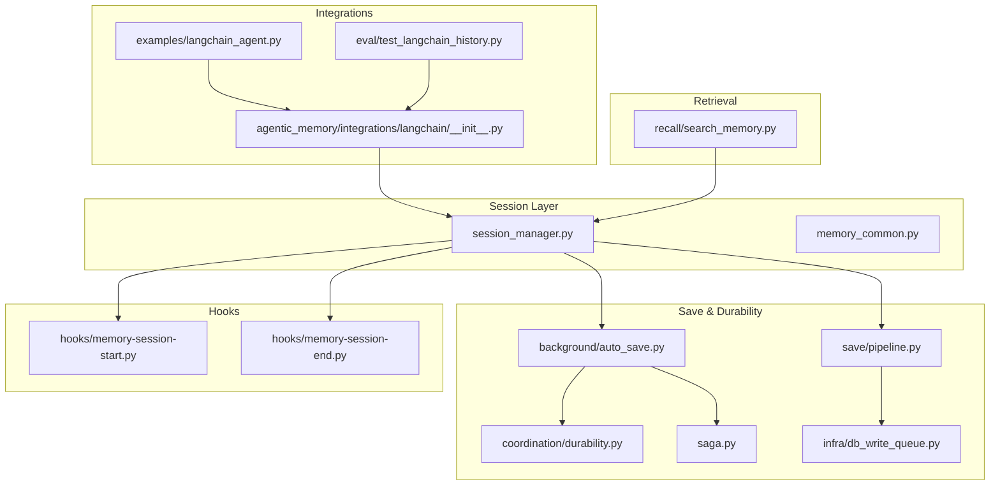
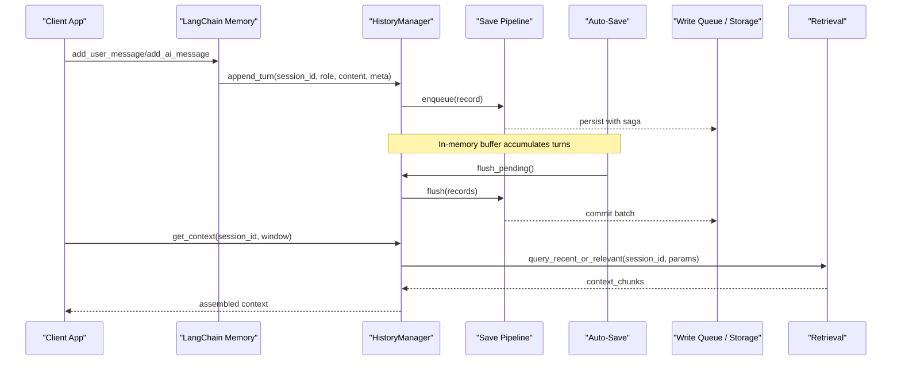
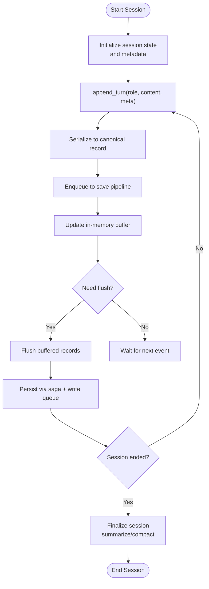
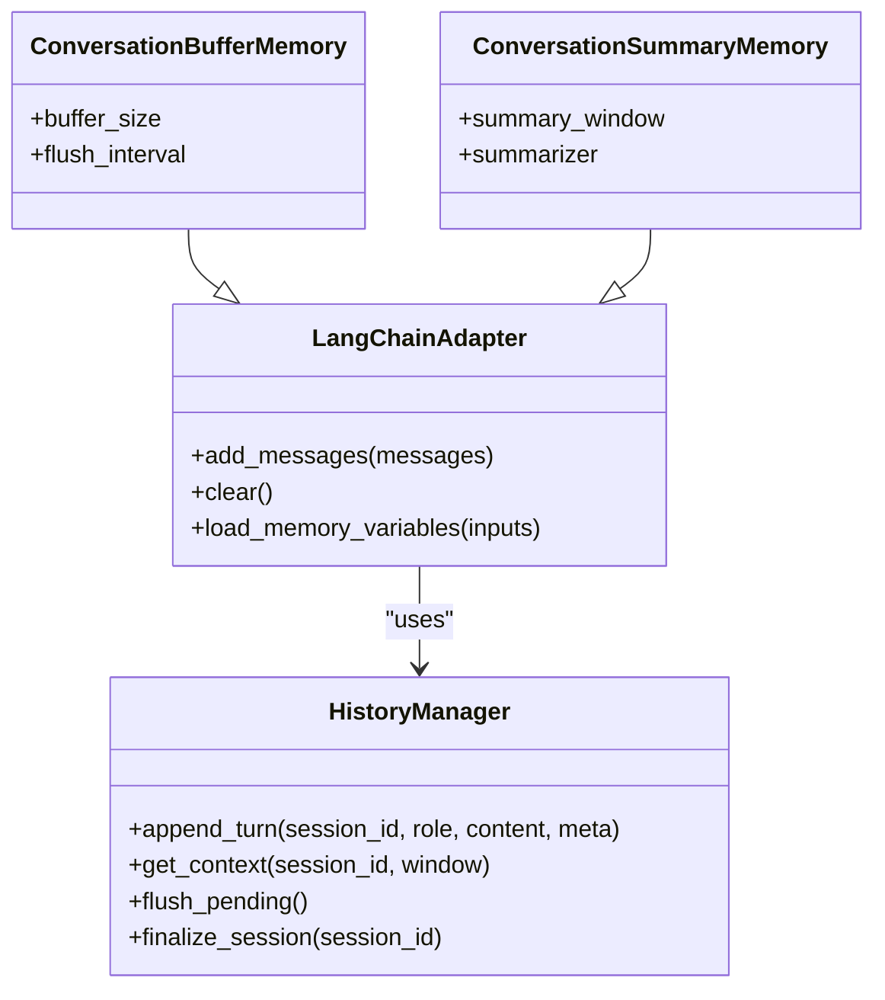
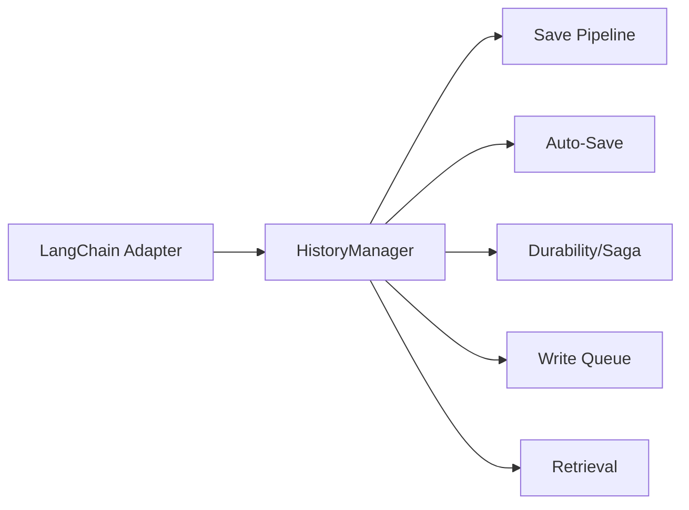

# History Manager

<cite>
**Referenced Files in This Document**
- [session_manager.py](file://session_manager.py)
- [memory_common.py](file://memory_common.py)
- [save/pipeline.py](file://save/pipeline.py)
- [background/auto_save.py](file://background/auto_save.py)
- [hooks/memory-session-start.py](file://hooks/memory-session-start.py)
- [hooks/memory-session-end.py](file://hooks/memory-session-end.py)
- [integrations/langchain/__init__.py](file://agentic_memory/integrations/langchain/__init__.py)
- [examples/langchain_agent.py](file://examples/langchain_agent.py)
- [test_langchain_history.py](file://eval/test_langchain_history.py)
- [infra/db_write_queue.py](file://infra/db_write_queue.py)
- [coordination/durability.py](file://coordination/durability.py)
- [saga.py](file://saga.py)
- [recall/search_memory.py](file://recall/search_memory.py)
</cite>

## Table of Contents
1. [Introduction](#introduction)
2. [Project Structure](#project-structure)
3. [Core Components](#core-components)
4. [Architecture Overview](#architecture-overview)
5. [Detailed Component Analysis](#detailed-component-analysis)
6. [Dependency Analysis](#dependency-analysis)
7. [Performance Considerations](#performance-considerations)
8. [Troubleshooting Guide](#troubleshooting-guide)
9. [Conclusion](#conclusion)
10. [Appendices](#appendices)

## Introduction
This document explains the HistoryManager component that persists conversation history to Agentic Memory. It covers the full conversation lifecycle, message serialization and retrieval patterns, session management, context window handling, and memory optimization strategies. It also addresses thread safety, persistence guarantees, and recovery mechanisms, with concrete integration examples for LangChain’s ConversationBufferMemory, ConversationSummaryMemory, and custom memory classes.

## Project Structure
The HistoryManager is implemented as part of the session management layer and integrates with the save pipeline, background auto-save, hooks, and LangChain integrations. The key files involved are:
- Session lifecycle and state: session_manager.py
- Shared memory utilities and models: memory_common.py
- Save pipeline and post-save processing: save/pipeline.py
- Background auto-save and durability: background/auto_save.py, coordination/durability.py, saga.py
- Hooks for session start/end: hooks/memory-session-start.py, hooks/memory-session-end.py
- LangChain integration and examples: agentic_memory/integrations/langchain/__init__.py, examples/langchain_agent.py, eval/test_langchain_history.py
- Persistence and write queue: infra/db_write_queue.py
- Retrieval and search: recall/search_memory.py

**Diagram sources**
- [session_manager.py](file://session_manager.py)
- [memory_common.py](file://memory_common.py)
- [save/pipeline.py](file://save/pipeline.py)
- [background/auto_save.py](file://background/auto_save.py)
- [coordination/durability.py](file://coordination/durability.py)
- [saga.py](file://saga.py)
- [infra/db_write_queue.py](file://infra/db_write_queue.py)
- [hooks/memory-session-start.py](file://hooks/memory-session-start.py)
- [hooks/memory-session-end.py](file://hooks/memory-session-end.py)
- [agentic_memory/integrations/langchain/__init__.py](file://agentic_memory/integrations/langchain/__init__.py)
- [examples/langchain_agent.py](file://examples/langchain_agent.py)
- [eval/test_langchain_history.py](file://eval/test_langchain_history.py)
- [recall/search_memory.py](file://recall/search_memory.py)

**Section sources**
- [session_manager.py](file://session_manager.py)
- [memory_common.py](file://memory_common.py)
- [save/pipeline.py](file://save/pipeline.py)
- [background/auto_save.py](file://background/auto_save.py)
- [coordination/durability.py](file://coordination/durability.py)
- [saga.py](file://saga.py)
- [infra/db_write_queue.py](file://infra/db_write_queue.py)
- [hooks/memory-session-start.py](file://hooks/memory-session-start.py)
- [hooks/memory-session-end.py](file://hooks/memory-session-end.py)
- [agentic_memory/integrations/langchain/__init__.py](file://agentic_memory/integrations/langchain/__init__.py)
- [examples/langchain_agent.py](file://examples/langchain_agent.py)
- [eval/test_langchain_history.py](file://eval/test_langchain_history.py)
- [recall/search_memory.py](file://recall/search_memory.py)

## Core Components
- HistoryManager (session-centric): Manages per-session conversation state, serializes messages into Agentic Memory records, and coordinates persistence via the save pipeline and background auto-save.
- Save Pipeline: Applies indexing, enrichment, and durable writes; orchestrates post-save hooks and compaction.
- Auto-Save and Durability: Periodically flushes in-memory buffers to disk using a write queue and saga-based durability semantics.
- Hooks: Session start/end hooks initialize and finalize contexts, ensuring consistent lifecycle boundaries.
- LangChain Integration: Bridges LangChain memory abstractions to Agentic Memory, enabling ConversationBufferMemory, ConversationSummaryMemory, and custom memories.
- Retrieval: Provides efficient retrieval of historical context for prompt assembly and summarization.

Key responsibilities:
- Lifecycle: Start/End sessions, track active turns, and persist incremental updates.
- Serialization: Convert chat messages to canonical memory records with metadata (timestamps, roles, IDs).
- Retrieval: Load recent or relevant history respecting context windows and retention policies.
- Optimization: Summarize older turns, chunk large messages, and apply retention/compaction.
- Safety: Ensure thread-safe operations, idempotent saves, and crash recovery.

**Section sources**
- [session_manager.py](file://session_manager.py)
- [memory_common.py](file://memory_common.py)
- [save/pipeline.py](file://save/pipeline.py)
- [background/auto_save.py](file://background/auto_save.py)
- [coordination/durability.py](file://coordination/durability.py)
- [saga.py](file://saga.py)
- [hooks/memory-session-start.py](file://hooks/memory-session-start.py)
- [hooks/memory-session-end.py](file://hooks/memory-session-end.py)
- [agentic_memory/integrations/langchain/__init__.py](file://agentic_memory/integrations/langchain/__init__.py)
- [examples/langchain_agent.py](file://examples/langchain_agent.py)
- [eval/test_langchain_history.py](file://eval/test_langchain_history.py)
- [recall/search_memory.py](file://recall/search_memory.py)

## Architecture Overview
The HistoryManager sits at the intersection of session orchestration, persistence, and retrieval. It uses the save pipeline for durable writes and leverages background auto-save to ensure progress even under failures. LangChain integrations adapt external memory interfaces to Agentic Memory’s record model.

**Diagram sources**
- [session_manager.py](file://session_manager.py)
- [save/pipeline.py](file://save/pipeline.py)
- [background/auto_save.py](file://background/auto_save.py)
- [infra/db_write_queue.py](file://infra/db_write_queue.py)
- [recall/search_memory.py](file://recall/search_memory.py)

## Detailed Component Analysis

### HistoryManager: Session Lifecycle and Persistence
Responsibilities:
- Maintain per-session turn buffers and metadata.
- Serialize messages to canonical records and enqueue them for persistence.
- Provide retrieval APIs for context windows and summaries.
- Coordinate with hooks and background tasks for durability.

Lifecycle flow:
- Session start: Initialize session state, load prior context if needed, and register hooks.
- Turn append: Buffer new messages, serialize to records, and enqueue to save pipeline.
- Flush and auto-save: Periodically flush buffered records to storage.
- Session end: Finalize context, trigger summarization/compaction, and release resources.

**Diagram sources**
- [session_manager.py](file://session_manager.py)
- [save/pipeline.py](file://save/pipeline.py)
- [background/auto_save.py](file://background/auto_save.py)
- [coordination/durability.py](file://coordination/durability.py)
- [saga.py](file://saga.py)

**Section sources**
- [session_manager.py](file://session_manager.py)
- [save/pipeline.py](file://save/pipeline.py)
- [background/auto_save.py](file://background/auto_save.py)
- [coordination/durability.py](file://coordination/durability.py)
- [saga.py](file://saga.py)

### Message Serialization and Models
Serialization converts chat messages into Agentic Memory records with fields such as role, content, timestamps, and identifiers. The shared memory models define the canonical schema used across save, retrieval, and hooks.

Key aspects:
- Canonical record structure ensures consistency across components.
- Metadata includes session identifiers, turn indices, and provenance.
- Validation and normalization occur before enqueuing to the save pipeline.

**Section sources**
- [memory_common.py](file://memory_common.py)
- [save/pipeline.py](file://save/pipeline.py)

### Retrieval Patterns and Context Windows
Retrieval supports:
- Recent-turn loading based on time or count.
- Semantic relevance queries for long sessions.
- Context window assembly respecting token limits and summarization thresholds.

Patterns:
- Windowed retrieval: fetch last N turns or within a time range.
- Hybrid retrieval: combine keyword and vector search for relevance.
- Summarized context: include precomputed summaries when available.

**Section sources**
- [recall/search_memory.py](file://recall/search_memory.py)
- [session_manager.py](file://session_manager.py)

### Thread Safety and Concurrency
- In-memory buffers are protected by locks to prevent concurrent corruption.
- Write operations are serialized through the save pipeline and background worker.
- Idempotent keys and saga semantics avoid duplicate persistence.

**Section sources**
- [background/auto_save.py](file://background/auto_save.py)
- [coordination/durability.py](file://coordination/durability.py)
- [saga.py](file://saga.py)
- [infra/db_write_queue.py](file://infra/db_write_queue.py)

### Persistence Guarantees and Recovery
- Saga-based transactions coordinate multi-step writes and compensating actions.
- Write queue batches and retries failed writes with backoff.
- Auto-save periodically flushes pending changes to minimize data loss.
- On restart, HistoryManager reconstructs state from persisted records and resumes safely.

**Section sources**
- [saga.py](file://saga.py)
- [infra/db_write_queue.py](file://infra/db_write_queue.py)
- [background/auto_save.py](file://background/auto_save.py)
- [coordination/durability.py](file://coordination/durability.py)

### Hooks: Session Start and End
- Session start hook initializes context, loads prior summaries, and prepares retrieval caches.
- Session end hook finalizes context, triggers compaction, and releases resources.

**Section sources**
- [hooks/memory-session-start.py](file://hooks/memory-session-start.py)
- [hooks/memory-session-end.py](file://hooks/memory-session-end.py)

### LangChain Integration Examples
Integration points:
- Custom LangChain memory adapters wrap HistoryManager to implement add_messages, clear, and load_memory_variables.
- ConversationBufferMemory example shows direct buffering with periodic flush to Agentic Memory.
- ConversationSummaryMemory example demonstrates summarizing older turns and storing summaries alongside raw messages.
- Custom memory class example illustrates extending base adapters for specialized behavior.

**Diagram sources**
- [agentic_memory/integrations/langchain/__init__.py](file://agentic_memory/integrations/langchain/__init__.py)
- [examples/langchain_agent.py](file://examples/langchain_agent.py)
- [eval/test_langchain_history.py](file://eval/test_langchain_history.py)
- [session_manager.py](file://session_manager.py)

**Section sources**
- [agentic_memory/integrations/langchain/__init__.py](file://agentic_memory/integrations/langchain/__init__.py)
- [examples/langchain_agent.py](file://examples/langchain_agent.py)
- [eval/test_langchain_history.py](file://eval/test_langchain_history.py)

## Dependency Analysis
HistoryManager depends on:
- Save pipeline for durable writes and indexing.
- Background auto-save for periodic flushing and resilience.
- Coordination and saga modules for transactional semantics.
- Write queue for batching and retrying writes.
- Retrieval module for context assembly.
- LangChain integration for external memory compatibility.

**Diagram sources**
- [session_manager.py](file://session_manager.py)
- [save/pipeline.py](file://save/pipeline.py)
- [background/auto_save.py](file://background/auto_save.py)
- [coordination/durability.py](file://coordination/durability.py)
- [saga.py](file://saga.py)
- [infra/db_write_queue.py](file://infra/db_write_queue.py)
- [recall/search_memory.py](file://recall/search_memory.py)
- [agentic_memory/integrations/langchain/__init__.py](file://agentic_memory/integrations/langchain/__init__.py)

**Section sources**
- [session_manager.py](file://session_manager.py)
- [save/pipeline.py](file://save/pipeline.py)
- [background/auto_save.py](file://background/auto_save.py)
- [coordination/durability.py](file://coordination/durability.py)
- [saga.py](file://saga.py)
- [infra/db_write_queue.py](file://infra/db_write_queue.py)
- [recall/search_memory.py](file://recall/search_memory.py)
- [agentic_memory/integrations/langchain/__init__.py](file://agentic_memory/integrations/langchain/__init__.py)

## Performance Considerations
- Batched writes: Group multiple turns into single save pipeline calls to reduce overhead.
- Summarization: Compress older turns into summaries to fit context windows.
- Chunking: Split large messages into chunks for efficient retrieval and indexing.
- Retention policies: Apply tiered retention to keep only necessary history.
- Caching: Cache recent context and summaries to avoid repeated retrieval.
- Backpressure: Use write queues to throttle ingestion during high load.

[No sources needed since this section provides general guidance]

## Troubleshooting Guide
Common issues and resolutions:
- Missing context after restart: Verify auto-save intervals and saga completion logs; ensure write queue is healthy.
- Duplicate messages: Confirm idempotency keys and saga deduplication; check for double appends.
- Slow retrieval: Inspect indexes and summarize older turns; adjust window size and hybrid search parameters.
- Thread contention: Reduce concurrent appends or increase lock granularity; monitor queue depth.
- Hook failures: Validate session start/end hooks; inspect error logs and rollback behavior.

**Section sources**
- [background/auto_save.py](file://background/auto_save.py)
- [coordination/durability.py](file://coordination/durability.py)
- [saga.py](file://saga.py)
- [infra/db_write_queue.py](file://infra/db_write_queue.py)
- [hooks/memory-session-start.py](file://hooks/memory-session-start.py)
- [hooks/memory-session-end.py](file://hooks/memory-session-end.py)

## Conclusion
HistoryManager provides robust session-centric conversation persistence to Agentic Memory. It combines safe serialization, durable writes, efficient retrieval, and flexible LangChain integrations. With careful configuration of context windows, summarization, and retention, it scales to long conversations while maintaining performance and reliability.

[No sources needed since this section summarizes without analyzing specific files]

## Appendices

### Integration Recipes
- ConversationBufferMemory:
  - Configure buffer size and flush interval.
  - Use adapter to append user/AI messages and retrieve recent context.
- ConversationSummaryMemory:
  - Enable summarizer to compress older turns.
  - Store summaries alongside raw messages for fast context assembly.
- Custom Memory Class:
  - Extend LangChain adapter to implement domain-specific logic.
  - Integrate with HistoryManager for persistence and retrieval.

**Section sources**
- [agentic_memory/integrations/langchain/__init__.py](file://agentic_memory/integrations/langchain/__init__.py)
- [examples/langchain_agent.py](file://examples/langchain_agent.py)
- [eval/test_langchain_history.py](file://eval/test_langchain_history.py)