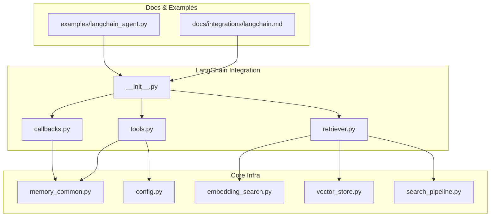
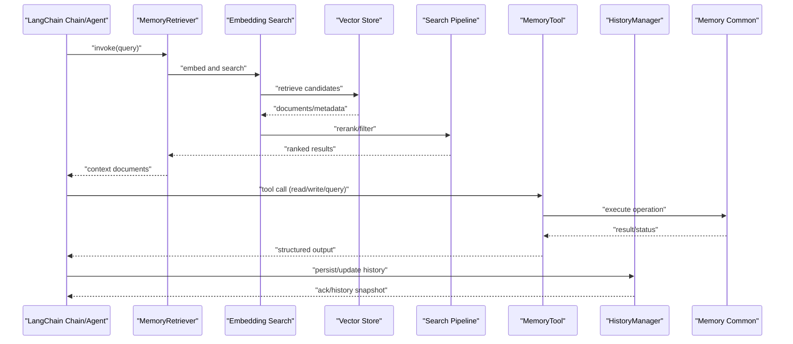
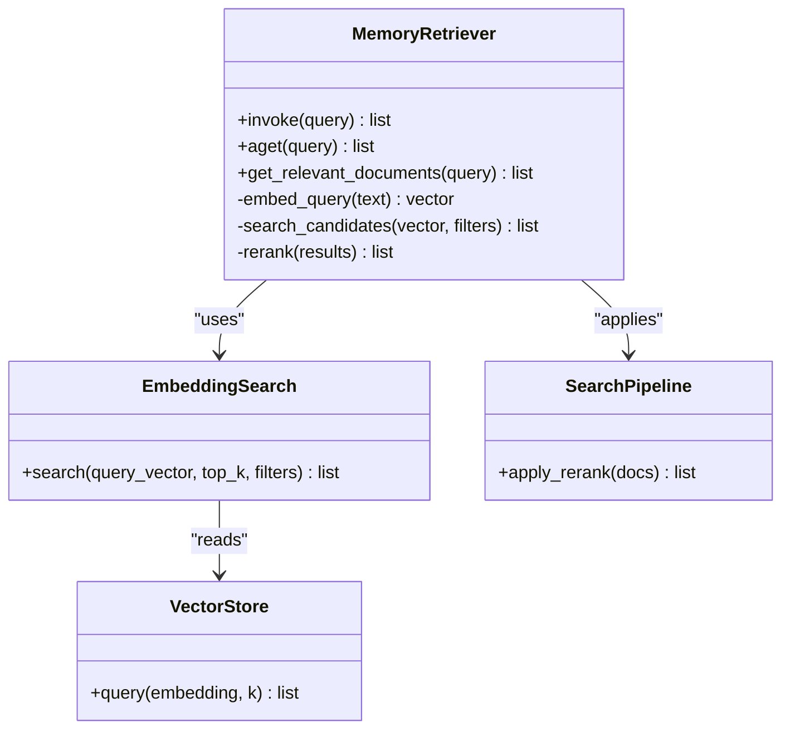
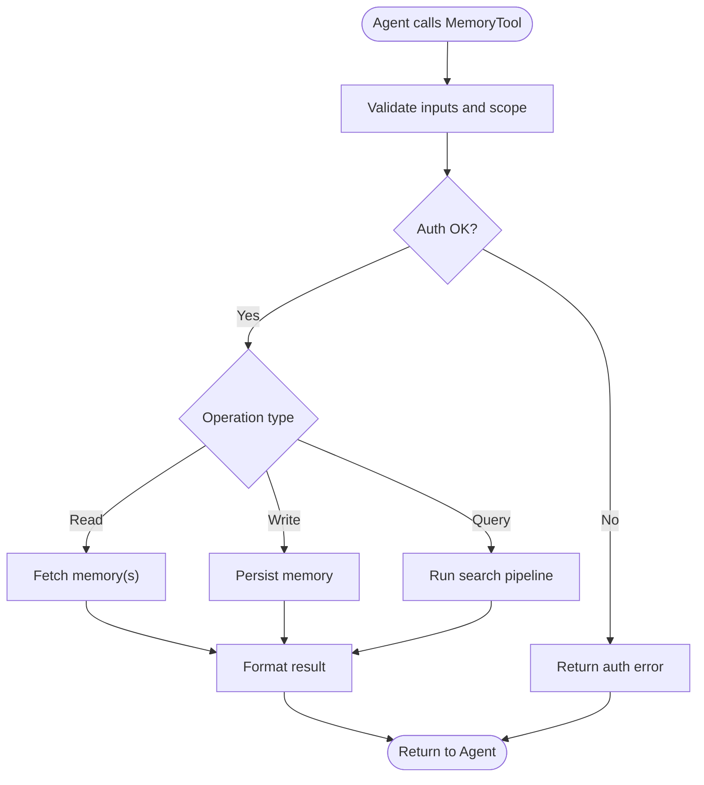
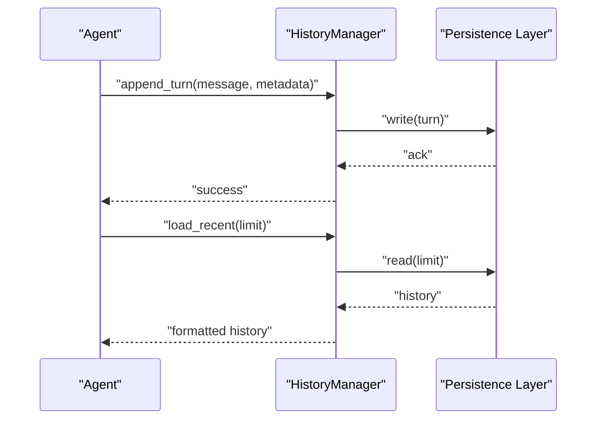
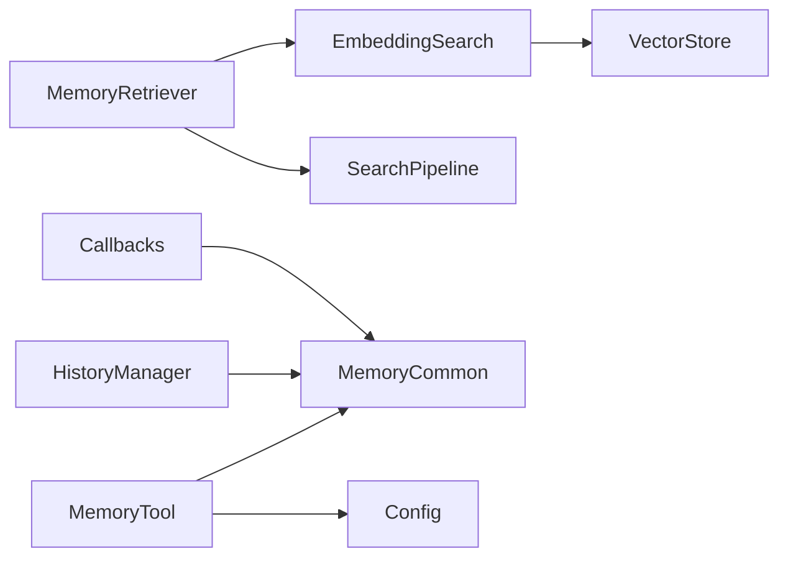

# LangChain Integration

<cite>
**Referenced Files in This Document**
- [langchain.md](file://docs/integrations/langchain.md)
- [langchain.py](file://agentic_memory/integrations/langchain/__init__.py)
- [retriever.py](file://agentic_memory/integrations/langchain/retriever.py)
- [tools.py](file://agentic_memory/integrations/langchain/tools.py)
- [callbacks.py](file://agentic_memory/integrations/langchain/callbacks.py)
- [memory_common.py](file://infra/memory_common.py)
- [config.py](file://infra/config.py)
- [embedding_search.py](file://infra/embedding_search.py)
- [vector_store.py](file://infra/vector_store.py)
- [search_pipeline.py](file://search_pipeline.py)
- [test_langchain_retriever.py](file://eval/test_langchain_retriever.py)
- [test_langchain_tool.py](file://eval/test_langchain_tool.py)
- [test_langchain_history.py](file://eval/test_langchain_history.py)
- [langchain_agent.py](file://examples/langchain_agent.py)
</cite>

## Table of Contents
1. [Introduction](#introduction)
2. [Project Structure](#project-structure)
3. [Core Components](#core-components)
4. [Architecture Overview](#architecture-overview)
5. [Detailed Component Analysis](#detailed-component-analysis)
6. [Dependency Analysis](#dependency-analysis)
7. [Performance Considerations](#performance-considerations)
8. [Troubleshooting Guide](#troubleshooting-guide)
9. [Conclusion](#conclusion)
10. [Appendices](#appendices)

## Introduction
This document explains how to integrate the memory system with LangChain, focusing on:
- MemoryRetriever for semantic search within LangChain chains and LCEL pipelines
- MemoryTool for agent memory operations (read/write/query)
- HistoryManager for conversation persistence across sessions
It also covers setup, configuration, authentication patterns, error handling, and performance optimization tips for production deployments.

## Project Structure
The LangChain integration is implemented under agentic_memory/integrations/langchain and complemented by documentation and examples:
- Documentation: docs/integrations/langchain.md
- Implementation:
  - agentic_memory/integrations/langchain/__init__.py
  - agentic_memory/integrations/langchain/retriever.py
  - agentic_memory/integrations/langchain/tools.py
  - agentic_memory/integrations/langchain/callbacks.py
- Examples: examples/langchain_agent.py
- Tests: eval/test_langchain_*.py

**Diagram sources**
- [langchain.py](file://agentic_memory/integrations/langchain/__init__.py)
- [retriever.py](file://agentic_memory/integrations/langchain/retriever.py)
- [tools.py](file://agentic_memory/integrations/langchain/tools.py)
- [callbacks.py](file://agentic_memory/integrations/langchain/callbacks.py)
- [memory_common.py](file://infra/memory_common.py)
- [config.py](file://infra/config.py)
- [embedding_search.py](file://infra/embedding_search.py)
- [vector_store.py](file://infra/vector_store.py)
- [search_pipeline.py](file://search_pipeline.py)
- [langchain.md](file://docs/integrations/langchain.md)
- [langchain_agent.py](file://examples/langchain_agent.py)

**Section sources**
- [langchain.md](file://docs/integrations/langchain.md)
- [langchain.py](file://agentic_memory/integrations/langchain/__init__.py)
- [retriever.py](file://agentic_memory/integrations/langchain/retriever.py)
- [tools.py](file://agentic_memory/integrations/langchain/tools.py)
- [callbacks.py](file://agentic_memory/integrations/langchain/callbacks.py)
- [memory_common.py](file://infra/memory_common.py)
- [config.py](file://infra/config.py)
- [embedding_search.py](file://infra/embedding_search.py)
- [vector_store.py](file://infra/vector_store.py)
- [search_pipeline.py](file://search_pipeline.py)
- [langchain_agent.py](file://examples/langchain_agent.py)

## Core Components
- MemoryRetriever: Implements a LangChain-compatible retriever that performs semantic search over memories using embedding-based retrieval and optional reranking. It integrates with the search pipeline and vector store to return relevant context for prompts or agents.
- MemoryTool: Provides LangChain tool functions for reading, writing, and querying memories from agents. It exposes structured inputs/outputs suitable for function-calling agents.
- HistoryManager: Manages conversation history persistence and retrieval, enabling long-term memory continuity across agent runs and sessions.
- Callbacks: Optional callback handlers to instrument retrievals, tool calls, and history operations for observability and debugging.

Key responsibilities:
- Provide consistent interfaces for LangChain Chains, Agents, and LCEL pipelines
- Enforce tenant scoping and authentication when accessing memory
- Surface errors and metrics for robust production usage

**Section sources**
- [retriever.py](file://agentic_memory/integrations/langchain/retriever.py)
- [tools.py](file://agentic_memory/integrations/langchain/tools.py)
- [callbacks.py](file://agentic_memory/integrations/langchain/callbacks.py)
- [memory_common.py](file://infra/memory_common.py)

## Architecture Overview
The integration sits between LangChain runtime components and the memory backend:
- Retrieval path: LangChain chain/agent -> MemoryRetriever -> embedding search + vector store -> results
- Tool path: Agent -> MemoryTool -> memory common APIs -> storage/indexing
- History path: Agent -> HistoryManager -> persistence layer
- Observability: Callbacks emit events for tracing and metrics

**Diagram sources**
- [retriever.py](file://agentic_memory/integrations/langchain/retriever.py)
- [embedding_search.py](file://infra/embedding_search.py)
- [vector_store.py](file://infra/vector_store.py)
- [search_pipeline.py](file://search_pipeline.py)
- [tools.py](file://agentic_memory/integrations/langchain/tools.py)
- [callbacks.py](file://agentic_memory/integrations/langchain/callbacks.py)
- [memory_common.py](file://infra/memory_common.py)

## Detailed Component Analysis

### MemoryRetriever
Purpose:
- Exposes a LangChain Retriever interface for semantic search over stored memories
- Integrates with embedding search and reranking to return high-quality context

Key behaviors:
- Accepts query text and optional filters (e.g., time window, tags)
- Embeds query, retrieves candidate memories, applies reranking/scoring
- Returns structured results compatible with LangChain prompt templates or LCEL nodes

Configuration options:
- Model selection for embeddings
- Top-k results and score thresholds
- Reranker strategy and parameters
- Tenant and session scoping

Integration points:
- Uses embedding search and vector store for retrieval
- Leverages search pipeline for advanced ranking and filtering

**Diagram sources**
- [retriever.py](file://agentic_memory/integrations/langchain/retriever.py)
- [embedding_search.py](file://infra/embedding_search.py)
- [vector_store.py](file://infra/vector_store.py)
- [search_pipeline.py](file://search_pipeline.py)

Practical usage:
- Use in LangChain chains to inject retrieved context into prompts
- Use in LCEL pipelines as a node returning documents for downstream processing

**Section sources**
- [retriever.py](file://agentic_memory/integrations/langchain/retriever.py)
- [embedding_search.py](file://infra/embedding_search.py)
- [vector_store.py](file://infra/vector_store.py)
- [search_pipeline.py](file://search_pipeline.py)
- [test_langchain_retriever.py](file://eval/test_langchain_retriever.py)

### MemoryTool
Purpose:
- Provides LangChain tools for agents to read, write, and query memories
- Ensures proper scoping and authentication when performing memory operations

Key capabilities:
- Read: Retrieve specific memories or summaries
- Write: Append new memories with metadata and temporal attributes
- Query: Perform natural language queries with filters

Authentication and scoping:
- Resolves tenant and user identity via shared memory utilities
- Enforces access control based on configured policies

Error handling:
- Validates inputs and returns structured error responses
- Surfaces upstream failures with actionable messages

**Diagram sources**
- [tools.py](file://agentic_memory/integrations/langchain/tools.py)
- [memory_common.py](file://infra/memory_common.py)
- [config.py](file://infra/config.py)

**Section sources**
- [tools.py](file://agentic_memory/integrations/langchain/tools.py)
- [memory_common.py](file://infra/memory_common.py)
- [config.py](file://infra/config.py)
- [test_langchain_tool.py](file://eval/test_langchain_tool.py)

### HistoryManager
Purpose:
- Persists and retrieves conversation history for continuity across agent invocations
- Supports session-scoped storage and optional cross-session recall hints

Key features:
- Append new turns and snapshots
- Load recent history for context injection
- Integrate with callbacks for observability

Operational notes:
- Ensure idempotent writes to avoid duplication
- Respect retention policies and budget constraints

**Diagram sources**
- [callbacks.py](file://agentic_memory/integrations/langchain/callbacks.py)
- [memory_common.py](file://infra/memory_common.py)
- [test_langchain_history.py](file://eval/test_langchain_history.py)

**Section sources**
- [callbacks.py](file://agentic_memory/integrations/langchain/callbacks.py)
- [memory_common.py](file://infra/memory_common.py)
- [test_langchain_history.py](file://eval/test_langchain_history.py)

### Callback Handlers
Purpose:
- Emit lifecycle events for retrievals, tool calls, and history operations
- Enable tracing, logging, and metrics collection

Typical events:
- Retrieval start/end with query and result counts
- Tool invocation with input/output and latency
- History persistence events

Usage:
- Register callbacks with LangChain runtime to capture telemetry
- Integrate with external monitoring systems

**Section sources**
- [callbacks.py](file://agentic_memory/integrations/langchain/callbacks.py)

## Dependency Analysis
High-level dependencies:
- MemoryRetriever depends on embedding search, vector store, and search pipeline
- MemoryTool depends on memory common utilities and configuration
- HistoryManager depends on persistence and optional callbacks

**Diagram sources**
- [retriever.py](file://agentic_memory/integrations/langchain/retriever.py)
- [embedding_search.py](file://infra/embedding_search.py)
- [vector_store.py](file://infra/vector_store.py)
- [search_pipeline.py](file://search_pipeline.py)
- [tools.py](file://agentic_memory/integrations/langchain/tools.py)
- [memory_common.py](file://infra/memory_common.py)
- [config.py](file://infra/config.py)
- [callbacks.py](file://agentic_memory/integrations/langchain/callbacks.py)

**Section sources**
- [retriever.py](file://agentic_memory/integrations/langchain/retriever.py)
- [tools.py](file://agentic_memory/integrations/langchain/tools.py)
- [callbacks.py](file://agentic_memory/integrations/langchain/callbacks.py)
- [memory_common.py](file://infra/memory_common.py)
- [config.py](file://infra/config.py)
- [embedding_search.py](file://infra/embedding_search.py)
- [vector_store.py](file://infra/vector_store.py)
- [search_pipeline.py](file://search_pipeline.py)

## Performance Considerations
- Embedding model selection: Choose models balancing accuracy and latency; consider caching embeddings where appropriate
- Top-k tuning: Adjust top-k to balance relevance and cost; apply score thresholds to filter low-quality results
- Reranking strategy: Enable reranking only when necessary due to additional compute; configure batch sizes
- Scoping and filters: Narrow searches by tenant/session/tags to reduce candidate set size
- Caching: Cache frequent queries and embeddings to reduce repeated work
- Concurrency: Limit concurrent retrievals and tool calls to prevent overload; use backpressure if needed
- Monitoring: Track latency, throughput, and error rates via callbacks and metrics

[No sources needed since this section provides general guidance]

## Troubleshooting Guide
Common issues and resolutions:
- Authentication failures: Verify tenant and user identity resolution; ensure credentials are correctly passed through LangChain runtime
- Empty retrieval results: Check filters and query phrasing; adjust top-k and thresholds; confirm indexing status
- High latency: Profile embedding and reranking steps; reduce top-k; enable caching; review concurrency limits
- Tool errors: Inspect input validation and structured outputs; check upstream service health and rate limits
- History inconsistencies: Ensure idempotent writes; verify persistence acknowledgments; review retention policies

Diagnostic aids:
- Use callbacks to log detailed traces for retrievals and tool calls
- Review test suites for expected behaviors and edge cases

**Section sources**
- [callbacks.py](file://agentic_memory/integrations/langchain/callbacks.py)
- [test_langchain_retriever.py](file://eval/test_langchain_retriever.py)
- [test_langchain_tool.py](file://eval/test_langchain_tool.py)
- [test_langchain_history.py](file://eval/test_langchain_history.py)

## Conclusion
The LangChain integration provides robust primitives for semantic retrieval, agent memory operations, and conversation persistence. By leveraging MemoryRetriever, MemoryTool, and HistoryManager—along with configurable callbacks—you can build powerful, production-ready LangChain applications with reliable memory capabilities. Follow the configuration and performance recommendations to optimize for your deployment needs.

[No sources needed since this section summarizes without analyzing specific files]

## Appendices

### Setup Instructions
- Install dependencies and initialize the memory system according to project guidelines
- Configure embedding models, vector store, and search pipeline settings
- Set up authentication and tenant scoping for secure access

**Section sources**
- [langchain.md](file://docs/integrations/langchain.md)
- [config.py](file://infra/config.py)

### Configuration Options
- Embedding model parameters and provider selection
- Retrieval top-k, score thresholds, and reranker settings
- Session and tenant scoping flags
- Callbacks and observability toggles

**Section sources**
- [config.py](file://infra/config.py)
- [embedding_search.py](file://infra/embedding_search.py)
- [vector_store.py](file://infra/vector_store.py)

### Practical Examples
- Example agent integrating MemoryTool and MemoryRetriever
- LCEL pipeline incorporating retrieval and history management

**Section sources**
- [langchain_agent.py](file://examples/langchain_agent.py)
- [langchain.md](file://docs/integrations/langchain.md)