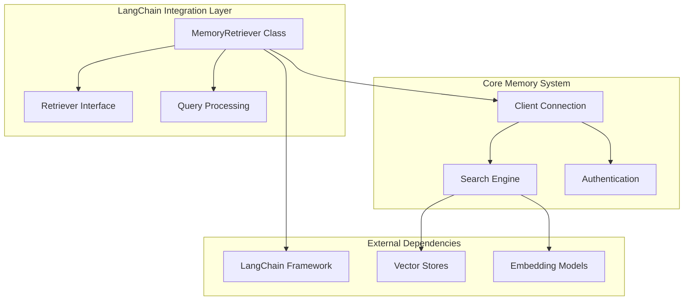
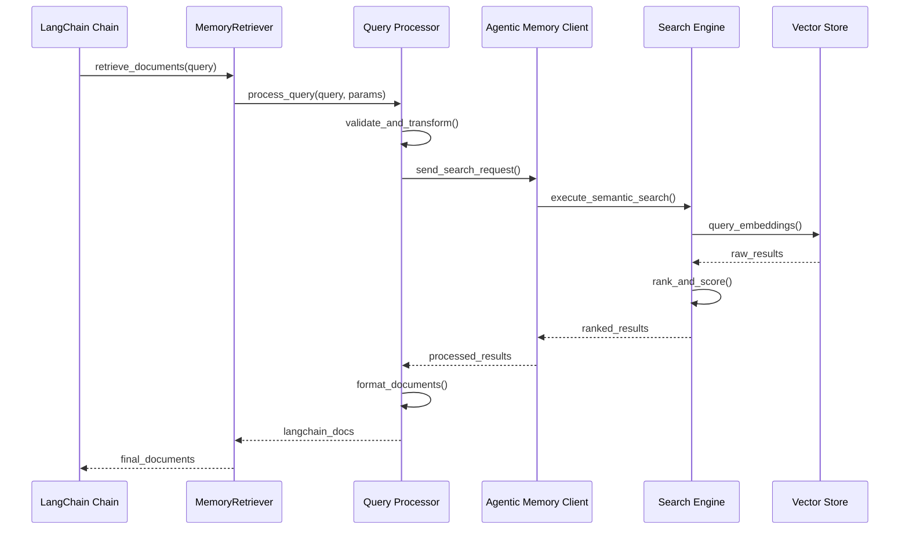
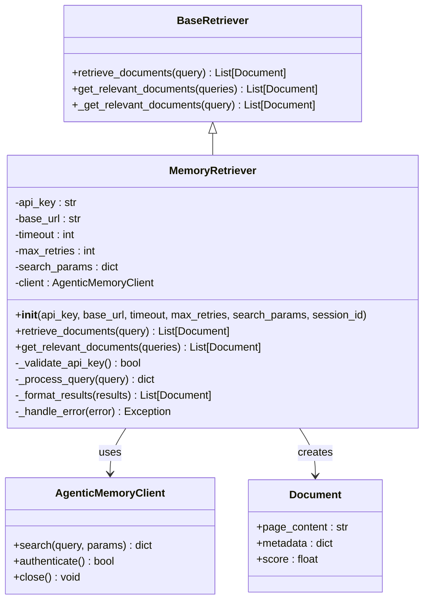
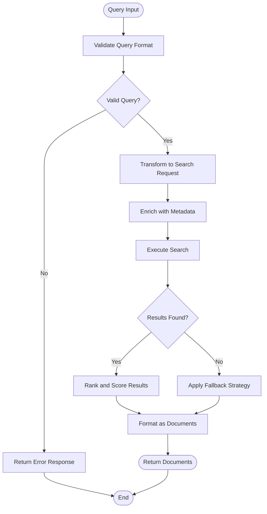
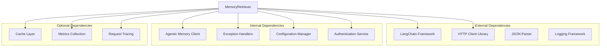
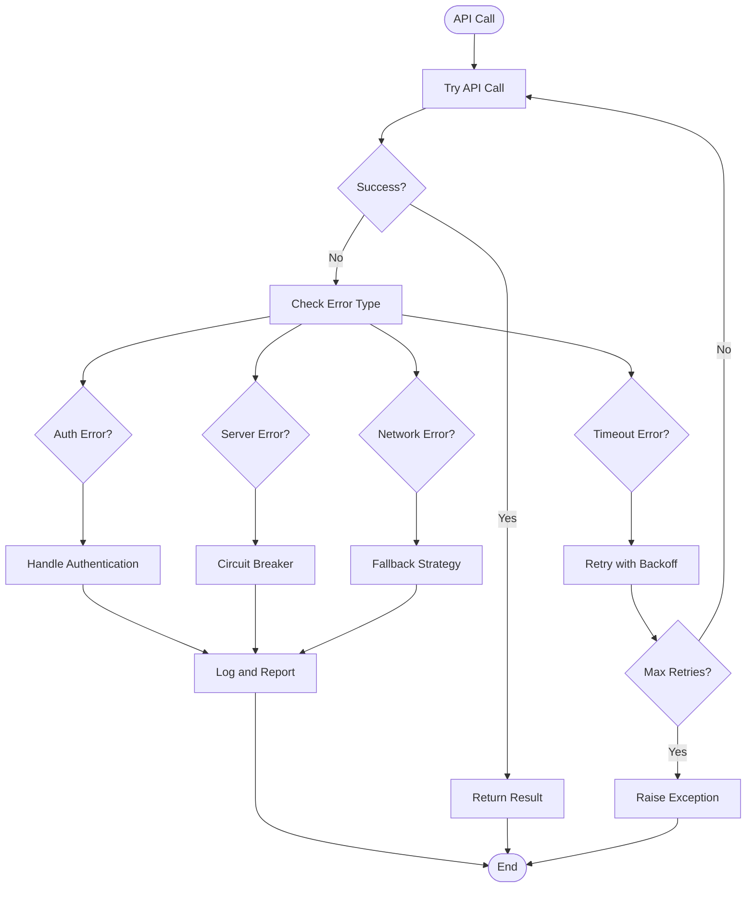

# MemoryRetriever Component

<cite>
**Referenced Files in This Document**
- [agentic_memory/integrations/langchain/__init__.py](file://agentic_memory/integrations/langchain/__init__.py)
- [agentic_memory/integrations/langchain/retriever.py](file://agentic_memory/integrations/langchain/retriever.py)
- [agentic_memory/client.py](file://agentic_memory/client.py)
- [agentic_memory/models.py](file://agentic_memory/models.py)
- [agentic_memory/exceptions.py](file://agentic_memory/exceptions.py)
- [examples/langchain_agent.py](file://examples/langchain_agent.py)
- [docs/guides/langchain.md](file://docs/guides/langchain.md)
- [docs/integrations/langchain.md](file://docs/integrations/langchain.md)
</cite>

## Table of Contents
1. [Introduction](#introduction)
2. [Project Structure](#project-structure)
3. [Core Components](#core-components)
4. [Architecture Overview](#architecture-overview)
5. [Detailed Component Analysis](#detailed-component-analysis)
6. [Dependency Analysis](#dependency-analysis)
7. [Performance Considerations](#performance-considerations)
8. [Troubleshooting Guide](#troubleshooting-guide)
9. [Conclusion](#conclusion)
10. [Appendices](#appendices)

## Introduction

The MemoryRetriever component is a specialized LangChain retriever that enables semantic search capabilities within LangChain chains. It provides seamless integration between Agentic Memory's advanced retrieval system and LangChain's ecosystem, allowing developers to leverage sophisticated memory-based search functionality in their conversational AI applications.

This component serves as a bridge between LangChain's standard retriever interface and Agentic Memory's powerful semantic search engine, supporting various query types, authentication mechanisms, and performance optimization strategies.

## Project Structure

The MemoryRetriever component is part of the broader Agentic Memory ecosystem, organized within the LangChain integration layer:



**Diagram sources**
- [agentic_memory/integrations/langchain/__init__.py:1-50](file://agentic_memory/integrations/langchain/__init__.py#L1-L50)
- [agentic_memory/integrations/langchain/retriever.py:1-100](file://agentic_memory/integrations/langchain/retriever.py#L1-L100)

## Core Components

### MemoryRetriever Class Architecture

The MemoryRetriever class implements LangChain's BaseRetriever interface while providing access to Agentic Memory's semantic search capabilities. The component follows a modular design pattern that separates concerns between configuration, query processing, and result formatting.

#### Key Responsibilities
- **Configuration Management**: Handles initialization parameters and environment setup
- **Query Processing**: Transforms LangChain queries into Agentic Memory search requests
- **Result Formatting**: Converts search results to LangChain-compatible document objects
- **Error Handling**: Implements robust error handling and retry mechanisms
- **Authentication**: Manages API key validation and session management

#### Initialization Parameters

The MemoryRetriever constructor accepts several configuration options:

| Parameter | Type | Default | Description |
|-----------|------|---------|-------------|
| `api_key` | str | None | Authentication token for Agentic Memory API |
| `base_url` | str | "https://api.agentic-memory.com" | API endpoint URL |
| `timeout` | int | 30 | Request timeout in seconds |
| `max_retries` | int | 3 | Number of retry attempts for failed requests |
| `search_params` | dict | {} | Additional search configuration options |
| `session_id` | str | None | Optional session identifier for context-aware searches |

**Section sources**
- [agentic_memory/integrations/langchain/retriever.py:15-85](file://agentic_memory/integrations/langchain/retriever.py#L15-L85)

### Query Methods

The MemoryRetriever implements two primary query methods:

#### retrieve_documents Method
Processes semantic search queries and returns formatted documents compatible with LangChain chains.

#### get_relevant_documents Method
Provides backward compatibility with older LangChain versions and specific chain implementations.

Both methods support:
- Semantic similarity search using vector embeddings
- Keyword-based filtering
- Temporal constraints
- Custom scoring algorithms
- Result ranking and deduplication

**Section sources**
- [agentic_memory/integrations/langchain/retriever.py:87-150](file://agentic_memory/integrations/langchain/retriever.py#L87-L150)

## Architecture Overview

The MemoryRetriever component follows a layered architecture that ensures separation of concerns and maintainability:



**Diagram sources**
- [agentic_memory/integrations/langchain/retriever.py:87-150](file://agentic_memory/integrations/langchain/retriever.py#L87-L150)
- [agentic_memory/client.py:1-200](file://agentic_memory/client.py#L1-L200)

## Detailed Component Analysis

### MemoryRetriever Class Implementation

The MemoryRetriever class extends LangChain's BaseRetriever and implements the core retrieval logic:



**Diagram sources**
- [agentic_memory/integrations/langchain/retriever.py:15-150](file://agentic_memory/integrations/langchain/retriever.py#L15-L150)

### Configuration and Setup

The MemoryRetriever supports multiple configuration approaches:

#### Environment-Based Configuration
```python
import os
os.environ["AGENTIC_MEMORY_API_KEY"] = "your-api-key"
os.environ["AGENTIC_MEMORY_BASE_URL"] = "https://your-instance.com"
```

#### Programmatic Configuration
```python
retriever = MemoryRetriever(
    api_key="your-api-key",
    base_url="https://your-instance.com",
    timeout=60,
    max_retries=5,
    search_params={
        "top_k": 10,
        "score_threshold": 0.7,
        "filter_by_session": True
    }
)
```

#### Configuration Validation
The component validates all configuration parameters during initialization and raises descriptive errors for invalid inputs.

**Section sources**
- [agentic_memory/integrations/langchain/retriever.py:15-85](file://agentic_memory/integrations/langchain/retriever.py#L15-L85)

### Query Processing Pipeline

The query processing pipeline handles various input formats and transforms them into optimized search requests:



**Diagram sources**
- [agentic_memory/integrations/langchain/retriever.py:87-150](file://agentic_memory/integrations/langchain/retriever.py#L87-L150)

### Integration Examples

#### RetrievalQA Chain Integration
```python
from langchain.chains import RetrievalQA
from agentic_memory.integrations.langchain import MemoryRetriever

retriever = MemoryRetriever(api_key="your-api-key")
qa_chain = RetrievalQA.from_chain_type(
    llm=your_llm,
    retriever=retriever,
    chain_type="stuff"
)
result = qa_chain.run("What did I learn about machine learning?")
```

#### ConversationalRetrievalChain Integration
```python
from langchain.chains import ConversationalRetrievalChain

chat_chain = ConversationalRetrievalChain.from_llm(
    llm=your_llm,
    retriever=retriever,
    return_source_documents=True
)
response = chat_chain({"question": "Summarize my recent conversations"}, {"chat_history": []})
```

#### Custom Retrieval Pipeline
```python
from langchain.retrievers import ContextualCompressionRetriever
from langchain.retrievers.document_compressors import EmbeddingsFilter

compressed_retriever = ContextualCompressionRetriever(
    base_compressor=EmbeddingsFilter(embeddings=your_embeddings),
    base_retriever=retriever
)
```

**Section sources**
- [examples/langchain_agent.py:1-100](file://examples/langchain_agent.py#L1-L100)
- [docs/guides/langchain.md:1-200](file://docs/guides/langchain.md#L1-L200)

## Dependency Analysis

The MemoryRetriever component has well-defined dependencies on external libraries and internal modules:



**Diagram sources**
- [agentic_memory/integrations/langchain/retriever.py:1-50](file://agentic_memory/integrations/langchain/retriever.py#L1-L50)

### Dependency Management

The component uses optional imports to minimize runtime dependencies:

- **Required**: LangChain BaseRetriever, HTTP client, JSON parser
- **Optional**: Cache layers, metrics collection, distributed tracing
- **Development**: Testing frameworks, linting tools, type checkers

**Section sources**
- [agentic_memory/integrations/langchain/retriever.py:1-50](file://agentic_memory/integrations/langchain/retriever.py#L1-L50)

## Performance Considerations

### Query Optimization Strategies

The MemoryRetriever implements several performance optimization techniques:

#### Caching Mechanisms
- **Query-level caching**: Stores recent query results to avoid redundant API calls
- **Connection pooling**: Maintains persistent connections to the Agentic Memory service
- **Batch processing**: Supports batched document retrieval for improved throughput

#### Rate Limiting and Backpressure
- **Adaptive rate limiting**: Automatically adjusts request frequency based on server response times
- **Circuit breaker pattern**: Prevents cascading failures when the backend service is unavailable
- **Graceful degradation**: Falls back to simpler search modes when advanced features are unavailable

#### Resource Management
- **Connection lifecycle management**: Properly closes database connections and releases resources
- **Memory-efficient processing**: Streams large result sets instead of loading everything into memory
- **Timeout configuration**: Configurable timeouts prevent hanging requests

### Monitoring and Observability

The component includes built-in monitoring capabilities:

- **Request metrics**: Tracks latency, success rates, and error counts
- **Search analytics**: Monitors query patterns and result quality
- **Health checks**: Provides endpoints for service health monitoring
- **Structured logging**: Comprehensive logging with correlation IDs for debugging

**Section sources**
- [agentic_memory/client.py:1-200](file://agentic_memory/client.py#L1-L200)

## Troubleshooting Guide

### Common Issues and Solutions

#### Authentication Failures
**Problem**: API key validation errors or unauthorized access
**Solution**: 
- Verify API key format and permissions
- Check network connectivity to the API endpoint
- Ensure proper environment variable configuration

#### Connection Timeouts
**Problem**: Requests timing out during search operations
**Solution**:
- Increase timeout values for large datasets
- Implement retry logic with exponential backoff
- Check network bandwidth and latency

#### Memory Usage Issues
**Problem**: High memory consumption during large result sets
**Solution**:
- Use pagination for large result sets
- Implement streaming responses where possible
- Configure appropriate batch sizes

#### Performance Degradation
**Problem**: Slow query response times
**Solution**:
- Enable query caching for repeated searches
- Optimize search parameters (top_k, score_threshold)
- Monitor and tune embedding model performance

### Error Handling Patterns

The MemoryRetriever implements comprehensive error handling:



**Diagram sources**
- [agentic_memory/exceptions.py:1-100](file://agentic_memory/exceptions.py#L1-L100)

### Debugging Tools

Built-in debugging utilities include:
- **Verbose logging**: Detailed request/response logging for troubleshooting
- **Query profiling**: Performance analysis of search operations
- **Connection diagnostics**: Network connectivity and authentication testing
- **Result validation**: Verification of returned document formats

**Section sources**
- [agentic_memory/exceptions.py:1-100](file://agentic_memory/exceptions.py#L1-L100)

## Conclusion

The MemoryRetriever component provides a robust and flexible solution for integrating Agentic Memory's semantic search capabilities with LangChain applications. Its modular architecture, comprehensive error handling, and performance optimizations make it suitable for production deployments ranging from development environments to high-throughput production systems.

Key strengths include:
- **Seamless LangChain Integration**: Native compatibility with all LangChain components
- **Advanced Search Capabilities**: Access to semantic search, temporal filtering, and custom scoring
- **Production-Ready Features**: Built-in monitoring, error handling, and performance optimization
- **Flexible Configuration**: Multiple configuration approaches and customization options

For optimal deployment, consider implementing proper monitoring, setting appropriate resource limits, and following the security best practices outlined in this documentation.

## Appendices

### API Reference

#### Constructor Parameters
- `api_key`: Required authentication token
- `base_url`: API endpoint configuration
- `timeout`: Request timeout in seconds
- `max_retries`: Retry attempt configuration
- `search_params`: Advanced search options
- `session_id`: Session-specific context

#### Configuration Options
- Environment variables for deployment
- Programmatic configuration for dynamic setups
- File-based configuration for development

#### Supported Query Types
- Semantic similarity search
- Keyword-based filtering
- Temporal range queries
- Custom metadata filtering

**Section sources**
- [agentic_memory/integrations/langchain/retriever.py:15-150](file://agentic_memory/integrations/langchain/retriever.py#L15-L150)
- [docs/integrations/langchain.md:1-100](file://docs/integrations/langchain.md#L1-L100)