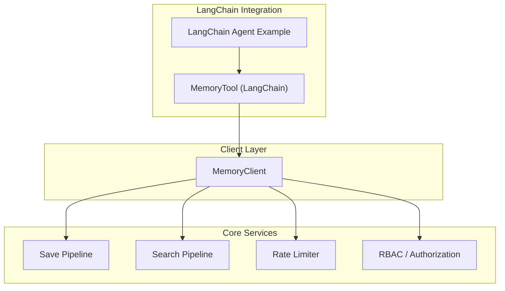
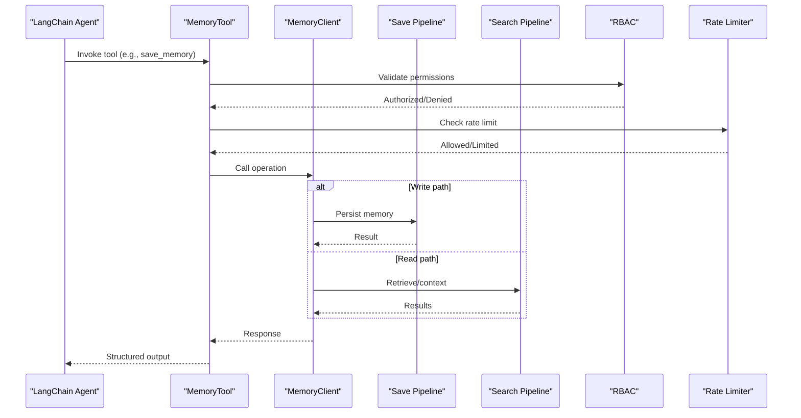
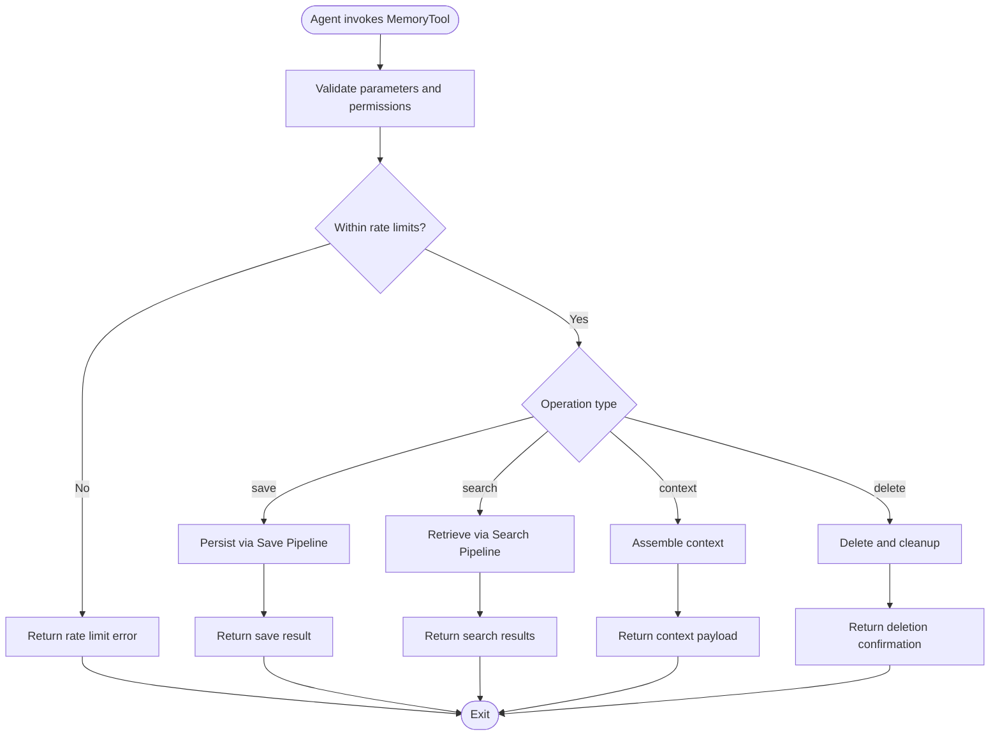
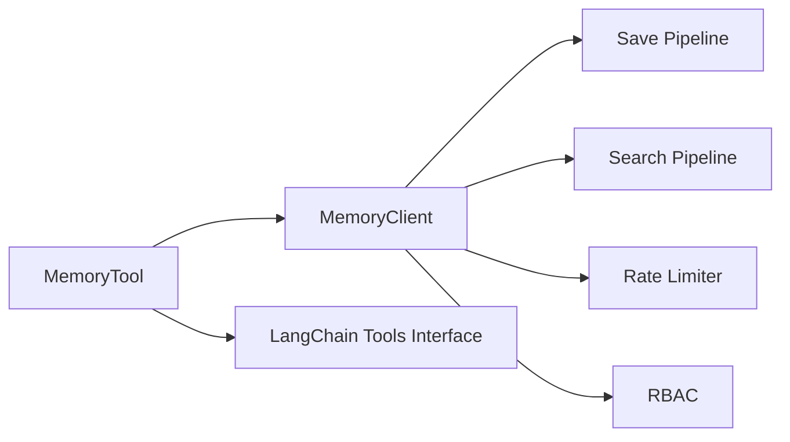

# MemoryTool Component

<cite>
**Referenced Files in This Document**
- [langchain_tool.py](file://agentic_memory/integrations/langchain/langchain_tool.py)
- [memory_client.py](file://agentic_memory/client.py)
- [search_memory.py](file://recall/search_memory.py)
- [save_pipeline.py](file://save/pipeline.py)
- [rate_limiter.py](file://infra/rate_limiter.py)
- [rbac.py](file://infra/rbac.py)
- [test_langchain_tool.py](file://eval/test_langchain_tool.py)
- [langchain_agent.py](file://examples/langchain_agent.py)
</cite>

## Table of Contents
1. [Introduction](#introduction)
2. [Project Structure](#project-structure)
3. [Core Components](#core-components)
4. [Architecture Overview](#architecture-overview)
5. [Detailed Component Analysis](#detailed-component-analysis)
6. [Dependency Analysis](#dependency-analysis)
7. [Performance Considerations](#performance-considerations)
8. [Security Considerations](#security-considerations)
9. [Troubleshooting Guide](#troubleshooting-guide)
10. [Conclusion](#conclusion)

## Introduction
This document provides comprehensive documentation for the MemoryTool component that exposes memory operations as LangChain tools. It covers all available tool functions, including save_memory, search_memories, get_context, and delete_memory. For each tool, we specify parameters, return value formats, error handling behavior, and integration patterns with LangChain agents, ReAct workflows, and custom tool chains. We also address security considerations, rate limiting, and performance optimization strategies to help you deploy MemoryTool safely and efficiently.

## Project Structure
The MemoryTool is implemented within the LangChain integration layer and interacts with core memory services for persistence, retrieval, and context assembly. The key files involved are:
- LangChain tool definitions and wrappers
- Client abstractions for memory operations
- Search pipeline and save pipeline implementations
- Rate limiting and access control utilities
- Tests and examples demonstrating usage

**Diagram sources**
- [langchain_tool.py](file://agentic_memory/integrations/langchain/langchain_tool.py)
- [memory_client.py](file://agentic_memory/client.py)
- [save_pipeline.py](file://save/pipeline.py)
- [search_memory.py](file://recall/search_memory.py)
- [rate_limiter.py](file://infra/rate_limiter.py)
- [rbac.py](file://infra/rbac.py)
- [langchain_agent.py](file://examples/langchain_agent.py)

**Section sources**
- [langchain_tool.py](file://agentic_memory/integrations/langchain/langchain_tool.py)
- [memory_client.py](file://agentic_memory/client.py)
- [search_memory.py](file://recall/search_memory.py)
- [save_pipeline.py](file://save/pipeline.py)
- [rate_limiter.py](file://infra/rate_limiter.py)
- [rbac.py](file://infra/rbac.py)
- [langchain_agent.py](file://examples/langchain_agent.py)

## Core Components
- MemoryTool (LangChain): Provides a set of LangChain-compatible tools that wrap memory operations. Tools include:
  - save_memory: Persist new or updated memories with metadata and optional chunking/indexing.
  - search_memories: Retrieve relevant memories using hybrid search (keyword + vector), with filters and ranking options.
  - get_context: Assemble contextual information for an agent prompt by combining recent memories, skills, and knowledge graph facts.
  - delete_memory: Remove specific memories by ID with audit logging and cascade cleanup.
- MemoryClient: A client abstraction used by MemoryTool to call into core services (save pipeline, search pipeline, rate limiter, authorization).
- Save Pipeline: Orchestrates ingestion, validation, indexing, embedding computation, and persistence.
- Search Pipeline: Executes multi-phase retrieval including query parsing, candidate generation, reranking, and synthesis.
- Rate Limiter: Enforces per-tenant/per-principal request quotas to protect system stability.
- RBAC: Validates permissions for read/write/delete operations based on roles and scopes.

Key responsibilities:
- Parameter validation and normalization
- Error translation to user-friendly messages
- Audit logging for mutations
- Context window management for get_context
- Idempotency and deduplication where applicable

**Section sources**
- [langchain_tool.py](file://agentic_memory/integrations/langchain/langchain_tool.py)
- [memory_client.py](file://agentic_memory/client.py)
- [save_pipeline.py](file://save/pipeline.py)
- [search_memory.py](file://recall/search_memory.py)
- [rate_limiter.py](file://infra/rate_limiter.py)
- [rbac.py](file://infra/rbac.py)

## Architecture Overview
The MemoryTool integrates with LangChain by exposing standard tool interfaces. When invoked by an agent, it delegates to MemoryClient, which coordinates with internal pipelines and enforcement layers.

**Diagram sources**
- [langchain_tool.py](file://agentic_memory/integrations/langchain/langchain_tool.py)
- [memory_client.py](file://agentic_memory/client.py)
- [save_pipeline.py](file://save/pipeline.py)
- [search_memory.py](file://recall/search_memory.py)
- [rbac.py](file://infra/rbac.py)
- [rate_limiter.py](file://infra/rate_limiter.py)

## Detailed Component Analysis

### save_memory
Purpose:
- Persist new or updated memories with content, metadata, and optional chunking. Supports idempotent writes via identifiers when provided.

Parameters:
- content: string; required; the primary text to persist.
- metadata: object; optional; structured tags, categories, timestamps, and provenance fields.
- session_id: string; optional; associates the memory with a session for scoping.
- tenant_id: string; optional; multi-tenant isolation scope.
- principal_id: string; optional; author identity for audit and RBAC.
- chunk_size: integer; optional; target chunk size for large inputs.
- chunk_overlap: integer; optional; overlap between chunks.
- index: boolean; optional; enable full-text and vector indexing.
- deduplicate: boolean; optional; attempt to merge with existing similar entries.

Return value format:
- success: boolean
- memory_id: string; unique identifier of persisted entry
- chunks_created: integer; number of chunks generated (if chunking enabled)
- indexed: boolean; whether indexing was performed
- warnings: array; non-fatal issues (e.g., skipped fields)

Error handling:
- Validation errors: returns structured error with field-level details.
- Rate limit exceeded: returns retry-after hint and status code.
- Permission denied: returns authorization failure with role mismatch info.
- Persistence failures: returns transient error with suggestion to retry.

Usage example paths:
- [langchain_agent.py](file://examples/langchain_agent.py)
- [test_langchain_tool.py](file://eval/test_langchain_tool.py)

**Section sources**
- [langchain_tool.py](file://agentic_memory/integrations/langchain/langchain_tool.py)
- [memory_client.py](file://agentic_memory/client.py)
- [save_pipeline.py](file://save/pipeline.py)
- [test_langchain_tool.py](file://eval/test_langchain_tool.py)

### search_memories
Purpose:
- Retrieve relevant memories using hybrid search (BM25 + vector), with filters, ranking, and synthesis options.

Parameters:
- query: string; required; natural language or keyword query.
- top_k: integer; optional; number of results to return.
- filters: object; optional; constraints such as session_id, tags, time range.
- mode: enum; optional; "hybrid", "vector", "keyword".
- rerank: boolean; optional; apply cross-encoder reranking if available.
- summarize: boolean; optional; produce concise summaries for long results.
- tenant_id: string; optional; scope results to a tenant.
- principal_id: string; optional; enforce principal-scoped visibility.

Return value format:
- results: array of objects with fields like id, score, snippet, metadata
- total_count: integer; total matches before pagination
- next_cursor: string; optional; cursor for pagination
- query_info: object; includes parsed query components and applied filters

Error handling:
- Invalid query or filter schema: returns validation error.
- Empty result set: returns empty array with zero counts.
- Index unavailable: returns degraded fallback mode message.
- Rate limit exceeded: returns retry-after hint.

Usage example paths:
- [langchain_agent.py](file://examples/langchain_agent.py)
- [test_langchain_tool.py](file://eval/test_langchain_tool.py)

**Section sources**
- [langchain_tool.py](file://agentic_memory/integrations/langchain/langchain_tool.py)
- [memory_client.py](file://agentic_memory/client.py)
- [search_memory.py](file://recall/search_memory.py)
- [test_langchain_tool.py](file://eval/test_langchain_tool.py)

### get_context
Purpose:
- Assemble contextual information for agent prompts by combining recent memories, skills, and knowledge graph facts tailored to the current task.

Parameters:
- topic: string; optional; focus area for context selection.
- max_tokens: integer; optional; upper bound for assembled context length.
- include_skills: boolean; optional; include skill lookups.
- include_kg_facts: boolean; optional; include knowledge graph facts.
- session_id: string; optional; scope to session-specific memories.
- tenant_id: string; optional; multi-tenant isolation.
- principal_id: string; optional; principal-scoped visibility.

Return value format:
- context_text: string; assembled prompt-ready context
- sources: array; references to source memories/facts with ids and scores
- token_usage: object; estimated tokens consumed
- warnings: array; notes about truncation or missing data

Error handling:
- Excessive input size: returns truncated context with warning.
- Missing dependencies (skills/kg): returns partial context with notices.
- Rate limit exceeded: returns retry-after hint.

Usage example paths:
- [langchain_agent.py](file://examples/langchain_agent.py)
- [test_langchain_tool.py](file://eval/test_langchain_tool.py)

**Section sources**
- [langchain_tool.py](file://agentic_memory/integrations/langchain/langchain_tool.py)
- [memory_client.py](file://agentic_memory/client.py)
- [search_memory.py](file://recall/search_memory.py)
- [test_langchain_tool.py](file://eval/test_langchain_tool.py)

### delete_memory
Purpose:
- Remove specific memories by ID, performing audit logging and cascading cleanup of related indexes and links.

Parameters:
- memory_id: string; required; unique identifier of the memory to delete.
- tenant_id: string; optional; ensure tenant scoping.
- principal_id: string; optional; authorize deletion under principal scope.

Return value format:
- success: boolean
- deleted_id: string; the ID that was deleted
- cascaded: boolean; whether related artifacts were cleaned up
- audit_ref: string; reference to audit log entry

Error handling:
- Not found: returns not_found error with suggested alternatives.
- Permission denied: returns authorization failure.
- Deletion conflicts: returns conflict error with resolution hints.
- Rate limit exceeded: returns retry-after hint.

Usage example paths:
- [langchain_agent.py](file://examples/langchain_agent.py)
- [test_langchain_tool.py](file://eval/test_langchain_tool.py)

**Section sources**
- [langchain_tool.py](file://agentic_memory/integrations/langchain/langchain_tool.py)
- [memory_client.py](file://agentic_memory/client.py)
- [test_langchain_tool.py](file://eval/test_langchain_tool.py)

### Conceptual Overview
The following conceptual flow illustrates how MemoryTool integrates with LangChain agents and orchestrates calls across internal services.

[No sources needed since this diagram shows conceptual workflow, not actual code structure]

## Dependency Analysis
MemoryTool depends on several core subsystems to provide robust, secure, and performant memory operations.

**Diagram sources**
- [langchain_tool.py](file://agentic_memory/integrations/langchain/langchain_tool.py)
- [memory_client.py](file://agentic_memory/client.py)
- [save_pipeline.py](file://save/pipeline.py)
- [search_memory.py](file://recall/search_memory.py)
- [rate_limiter.py](file://infra/rate_limiter.py)
- [rbac.py](file://infra/rbac.py)

**Section sources**
- [langchain_tool.py](file://agentic_memory/integrations/langchain/langchain_tool.py)
- [memory_client.py](file://agentic_memory/client.py)
- [save_pipeline.py](file://save/pipeline.py)
- [search_memory.py](file://recall/search_memory.py)
- [rate_limiter.py](file://infra/rate_limiter.py)
- [rbac.py](file://infra/rbac.py)

## Performance Considerations
- Batch operations: Prefer batching saves to reduce overhead and improve throughput.
- Chunk sizing: Tune chunk_size and chunk_overlap to balance retrieval accuracy and storage efficiency.
- Indexing strategy: Enable index only for frequently queried content; disable for ephemeral logs.
- Reranking cost: Use rerank selectively due to higher latency; consider caching frequent queries.
- Context window management: Set max_tokens appropriately to avoid excessive token usage and truncation.
- Pagination: Use cursors for large result sets to minimize payload sizes.
- Caching: Leverage query caches where available to reduce repeated work.
- Concurrency: Respect rate limits and backoff policies to prevent throttling.

[No sources needed since this section provides general guidance]

## Security Considerations
- Authentication and authorization: All operations are gated by RBAC; ensure principals have appropriate roles and scopes.
- Tenant isolation: Always pass tenant_id to enforce multi-tenant boundaries.
- Input validation: Reject malformed or overly large inputs to prevent abuse.
- Audit logging: Mutations are logged with principal and tenant context for traceability.
- Data minimization: Avoid storing sensitive data unless necessary; redact PII at ingestion.
- Secure defaults: Deny-by-default policy; explicit allowlists for privileged actions.

**Section sources**
- [rbac.py](file://infra/rbac.py)
- [langchain_tool.py](file://agentic_memory/integrations/langchain/langchain_tool.py)
- [memory_client.py](file://agentic_memory/client.py)

## Troubleshooting Guide
Common issues and resolutions:
- Rate limit errors: Implement exponential backoff and respect retry-after headers.
- Permission denied: Verify principal roles and tenant scoping; consult RBAC configuration.
- Empty search results: Adjust query phrasing, broaden filters, or switch search modes.
- Large context truncation: Reduce max_tokens or refine topic focus; use targeted filters.
- Save failures: Check content size limits, metadata schema compliance, and downstream indexing health.

Diagnostic tips:
- Inspect audit logs for mutation traces.
- Review rate limiter metrics to identify throttling hotspots.
- Validate parameter schemas against tool specifications.
- Use test suites to reproduce and isolate issues.

**Section sources**
- [test_langchain_tool.py](file://eval/test_langchain_tool.py)
- [rate_limiter.py](file://infra/rate_limiter.py)
- [langchain_tool.py](file://agentic_memory/integrations/langchain/langchain_tool.py)

## Conclusion
MemoryTool offers a robust, secure, and high-performance interface for memory operations within LangChain-based agents. By leveraging standardized tool contracts, enforcing RBAC and rate limits, and integrating with advanced search and save pipelines, it enables reliable context-aware interactions. Follow the parameter specifications, error handling guidelines, and performance recommendations to build resilient agent workflows.