# Custom Tool Development

<cite>
**Referenced Files in This Document**
- [mcp_tools.py](file://mcp_tools.py)
- [tool_registry.py](file://tool_registry.py)
- [mcp_common.py](file://mcp_common.py)
- [mcp_instance.py](file://mcp_instance.py)
- [mcp_memory.py](file://mcp_memory.py)
- [mcp_search.py](file://mcp_search.py)
- [mcp_kg.py](file://mcp_kg.py)
- [mcp_kg_traversal.py](file://mcp_kg_traversal.py)
- [mcp_maintenance.py](file://mcp_maintenance.py)
- [mcp_safety.py](file://mcp_safety.py)
- [mcp_auth.py](file://mcp_auth.py)
- [mcp_audit.py](file://mcp_audit.py)
- [mcp_coordination.py](file://mcp_coordination.py)
- [mcp_crdt.py](file://mcp_crdt.py)
- [mcp_ctr_drift.py](file://mcp_ctr_drift.py)
- [mcp_dashboard.py](file://mcp_dashboard.py)
- [mcp_health.py](file://mcp_health.py)
- [mcp_metrics.py](file://mcp_metrics.py)
- [mcp_multi_modal.py](file://mcp_multi_modal.py)
- [mcp_okf.py](file://mcp_okf.py)
- [mcp_profile.py](file://mcp_profile.py)
- [mcp_quality.py](file://mcp_quality.py)
- [mcp_rebuild.py](file://mcp_rebuild.py)
- [mcp_retention.py](file://mcp_retention.py)
- [mcp_sdk.py](file://mcp_sdk.py)
- [mcp_session.py](file://mcp_session.py)
- [mcp_sharing.py](file://mcp_sharing.py)
- [mcp_summarization.py](file://mcp_summarization.py)
- [mcp_verbs.py](file://mcp_verbs.py)
- [memory_config.py](file://memory_config.py)
- [infra/config.py](file://infra/config.py)
- [infra/audit.py](file://infra/audit.py)
- [infra/scope.py](file://infra/scope.py)
- [infra/rbac.py](file://infra/rbac.py)
- [recall/search_memory.py](file://recall/search_memory.py)
- [knowledge_graph/kg_search.py](file://knowledge_graph/kg_search.py)
- [kg/kg_traversal.py](file://kg/kg_traversal.py)
- [save/pipeline.py](file://save/pipeline.py)
- [background/background_worker.py](file://background/background_worker.py)
- [background/tool_complete.py](file://background/tool_complete.py)
- [test_tool_registry.py](file://test_tool_registry.py)
- [test_mcp_wrappers.py](file://test_mcp_wrappers.py)
- [test_mcp_verbs.py](file://test_mcp_verbs.py)
- [test_mcp_skill_ops.py](file://test_mcp_skill_ops.py)
- [test_rate_limit_mcp.py](file://test_rate_limit_mcp.py)
</cite>

## Table of Contents
1. [Introduction](#introduction)
2. [Project Structure](#project-structure)
3. [Core Components](#core-components)
4. [Architecture Overview](#architecture-overview)
5. [Detailed Component Analysis](#detailed-component-analysis)
6. [Dependency Analysis](#dependency-analysis)
7. [Performance Considerations](#performance-considerations)
8. [Troubleshooting Guide](#troubleshooting-guide)
9. [Conclusion](#conclusion)
10. [Appendices](#appendices)

## Introduction
This document explains how to build custom MCP tools for the system, focusing on tool registration, parameter validation, response formatting, lifecycle management, error handling, and logging. It provides step-by-step guides for creating tools that interact with memory operations, search functionality, and knowledge graph queries. It also covers testing strategies, security best practices, performance optimization techniques, and examples of complex tools including multiple parameters, streaming responses, and async operations.

## Project Structure
The MCP tooling surface is implemented across a set of modules:
- Registration and wiring: central registry and instance wiring
- Common utilities: shared helpers, schemas, and wrappers
- Domain-specific tools: memory, search, knowledge graph, maintenance, safety, etc.
- Cross-cutting concerns: auth, audit, coordination, CRDT, metrics, health, dashboard, etc.
- Tests: unit and integration tests validating behavior and contracts

```mermaid
graph TB
subgraph "MCP Surface"
REG["tool_registry.py"]
INST["mcp_instance.py"]
COMMON["mcp_common.py"]
end
subgraph "Domain Tools"
MEM["mcp_memory.py"]
SRCH["mcp_search.py"]
KG["mcp_kg.py"]
KGT["mcp_kg_traversal.py"]
MAINT["mcp_maintenance.py"]
SAFETY["mcp_safety.py"]
end
subgraph "Cross-Cutting"
AUTH["mcp_auth.py"]
AUDIT["mcp_audit.py"]
COORD["mcp_coordination.py"]
CRDT["mcp_crdt.py"]
METRICS["mcp_metrics.py"]
HEALTH["mcp_health.py"]
DASH["mcp_dashboard.py"]
OKF["mcp_okf.py"]
PROFILE["mcp_profile.py"]
QUALITY["mcp_quality.py"]
REBUILD["mcp_rebuild.py"]
RETENTION["mcp_retention.py"]
SDK["mcp_sdk.py"]
SESSION["mcp_session.py"]
SHARING["mcp_sharing.py"]
SUMM["mcp_summarization.py"]
VERBS["mcp_verbs.py"]
end
REG --> INST
INST --> COMMON
INST --> MEM
INST --> SRCH
INST --> KG
INST --> KGT
INST --> MAINT
INST --> SAFETY
INST --> AUTH
INST --> AUDIT
INST --> COORD
INST --> CRDT
INST --> METRICS
INST --> HEALTH
INST --> DASH
INST --> OKF
INST --> PROFILE
INST --> QUALITY
INST --> REBUILD
INST --> RETENTION
INST --> SDK
INST --> SESSION
INST --> SHARING
INST --> SUMM
INST --> VERBS
```

**Diagram sources**
- [mcp_tools.py:1-200](file://mcp_tools.py#L1-L200)
- [tool_registry.py:1-200](file://tool_registry.py#L1-L200)
- [mcp_instance.py:1-200](file://mcp_instance.py#L1-L200)
- [mcp_common.py:1-200](file://mcp_common.py#L1-L200)
- [mcp_memory.py:1-200](file://mcp_memory.py#L1-L200)
- [mcp_search.py:1-200](file://mcp_search.py#L1-L200)
- [mcp_kg.py:1-200](file://mcp_kg.py#L1-L200)
- [mcp_kg_traversal.py:1-200](file://mcp_kg_traversal.py#L1-L200)
- [mcp_maintenance.py:1-200](file://mcp_maintenance.py#L1-L200)
- [mcp_safety.py:1-200](file://mcp_safety.py#L1-L200)
- [mcp_auth.py:1-200](file://mcp_auth.py#L1-L200)
- [mcp_audit.py:1-200](file://mcp_audit.py#L1-L200)
- [mcp_coordination.py:1-200](file://mcp_coordination.py#L1-L200)
- [mcp_crdt.py:1-200](file://mcp_crdt.py#L1-L200)
- [mcp_metrics.py:1-200](file://mcp_metrics.py#L1-L200)
- [mcp_health.py:1-200](file://mcp_health.py#L1-L200)
- [mcp_dashboard.py:1-200](file://mcp_dashboard.py#L1-L200)
- [mcp_okf.py:1-200](file://mcp_okf.py#L1-L200)
- [mcp_profile.py:1-200](file://mcp_profile.py#L1-L200)
- [mcp_quality.py:1-200](file://mcp_quality.py#L1-L200)
- [mcp_rebuild.py:1-200](file://mcp_rebuild.py#L1-L200)
- [mcp_retention.py:1-200](file://mcp_retention.py#L1-L200)
- [mcp_sdk.py:1-200](file://mcp_sdk.py#L1-L200)
- [mcp_session.py:1-200](file://mcp_session.py#L1-L200)
- [mcp_sharing.py:1-200](file://mcp_sharing.py#L1-L200)
- [mcp_summarization.py:1-200](file://mcp_summarization.py#L1-L200)
- [mcp_verbs.py:1-200](file://mcp_verbs.py#L1-L200)

**Section sources**
- [mcp_tools.py:1-200](file://mcp_tools.py#L1-L200)
- [tool_registry.py:1-200](file://tool_registry.py#L1-L200)
- [mcp_instance.py:1-200](file://mcp_instance.py#L1-L200)
- [mcp_common.py:1-200](file://mcp_common.py#L1-L200)

## Core Components
- Tool Registry: Centralized mapping from tool names to handlers, with metadata (description, parameters, streaming flags).
- Instance Wiring: Binds the registry to an MCP server instance, applies middleware (auth, audit, rate limiting), and exposes endpoints.
- Common Utilities: Shared schemas, validation helpers, result formatters, and wrapper decorators used by all tools.
- Domain Modules: Implement concrete tools for memory, search, knowledge graph, maintenance, safety, and more.

Key responsibilities:
- Registration: Declarative or programmatic addition of tools with typed parameters and descriptions.
- Validation: Enforce required fields, types, and constraints before invoking business logic.
- Response Formatting: Normalize outputs into consistent structures suitable for MCP clients.
- Lifecycle: Pre/post hooks for auditing, metrics, and background completion notifications.

**Section sources**
- [tool_registry.py:1-200](file://tool_registry.py#L1-L200)
- [mcp_instance.py:1-200](file://mcp_instance.py#L1-L200)
- [mcp_common.py:1-200](file://mcp_common.py#L1-L200)

## Architecture Overview
The MCP tool surface follows a layered architecture:
- Transport Layer: MCP server instance wires routes to handlers.
- Middleware Layer: Auth, audit, rate limiting, and coordination intercept calls.
- Handler Layer: Domain-specific tool implementations.
- Service Layer: Underlying services for memory, search, knowledge graph, and background tasks.

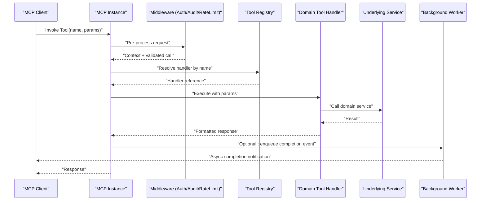

**Diagram sources**
- [mcp_instance.py:1-200](file://mcp_instance.py#L1-L200)
- [tool_registry.py:1-200](file://tool_registry.py#L1-L200)
- [mcp_common.py:1-200](file://mcp_common.py#L1-L200)
- [background/background_worker.py:1-200](file://background/background_worker.py#L1-L200)
- [background/tool_complete.py:1-200](file://background/tool_complete.py#L1-L200)

## Detailed Component Analysis

### Tool Registration System
- Registration API: Tools are registered with a unique name, description, parameter schema, and handler function. Optional flags include streaming support and async execution.
- Metadata: Each tool includes human-readable descriptions and structured parameter definitions to guide clients and validators.
- Resolution: The registry maps tool names to handlers and validates presence at runtime.

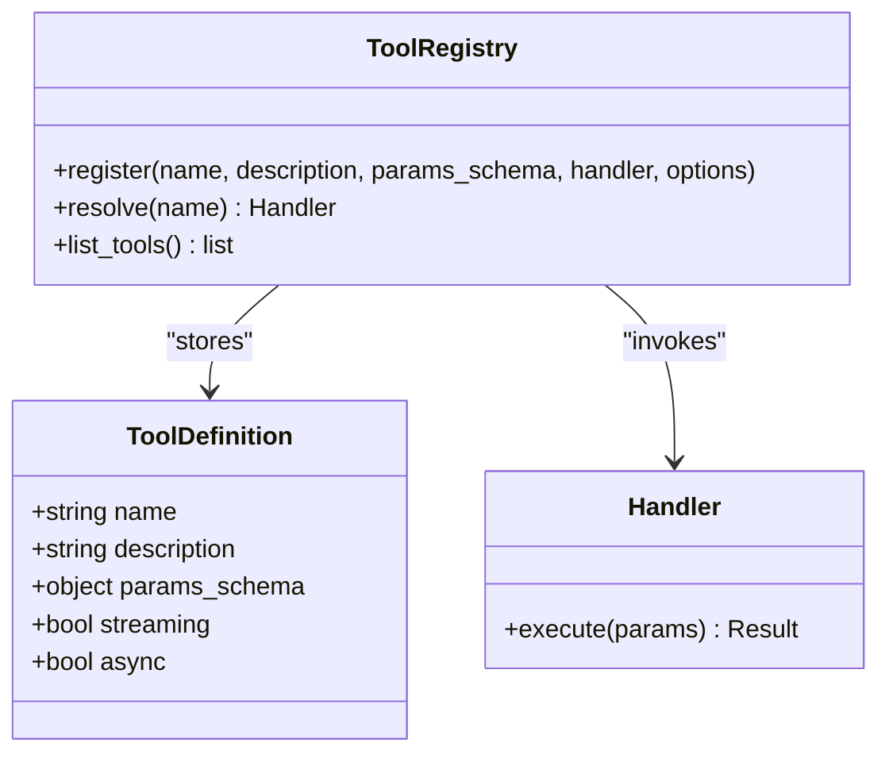

**Diagram sources**
- [tool_registry.py:1-200](file://tool_registry.py#L1-L200)
- [mcp_tools.py:1-200](file://mcp_tools.py#L1-L200)

**Section sources**
- [tool_registry.py:1-200](file://tool_registry.py#L1-L200)
- [mcp_tools.py:1-200](file://mcp_tools.py#L1-L200)

### Parameter Validation
- Schema-driven validation: Parameters are validated against declared schemas, enforcing required fields, types, and constraints.
- Error reporting: Validation failures return structured errors with field-level details.
- Defaults and coercion: Optional fields may have defaults; type coercion is applied where safe.

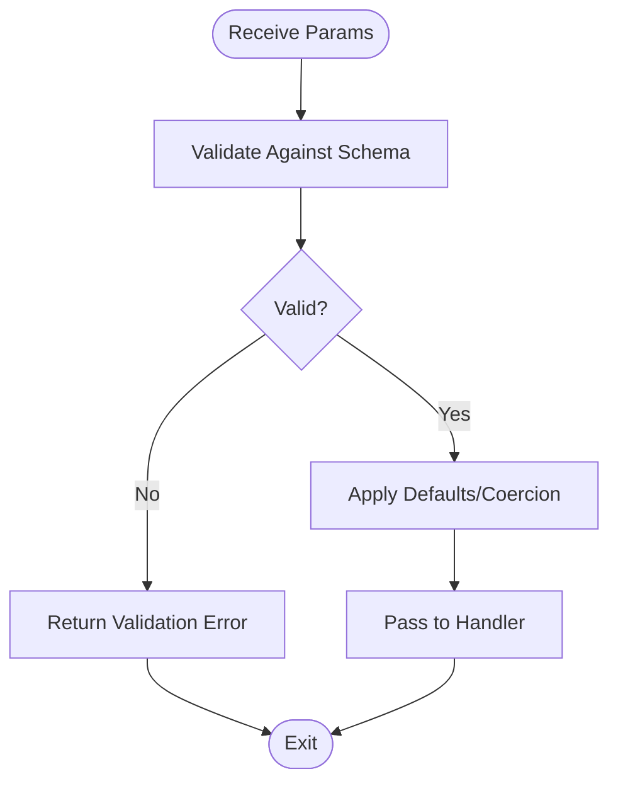

**Diagram sources**
- [mcp_common.py:1-200](file://mcp_common.py#L1-L200)
- [mcp_tools.py:1-200](file://mcp_tools.py#L1-L200)

**Section sources**
- [mcp_common.py:1-200](file://mcp_common.py#L1-L200)
- [mcp_tools.py:1-200](file://mcp_tools.py#L1-L200)

### Response Formatting
- Standardized output: Handlers return normalized results with status, data, and optional metadata.
- Streaming responses: For long-running operations, handlers can emit partial results via streams.
- Async completions: Background tasks can push completion events to clients.

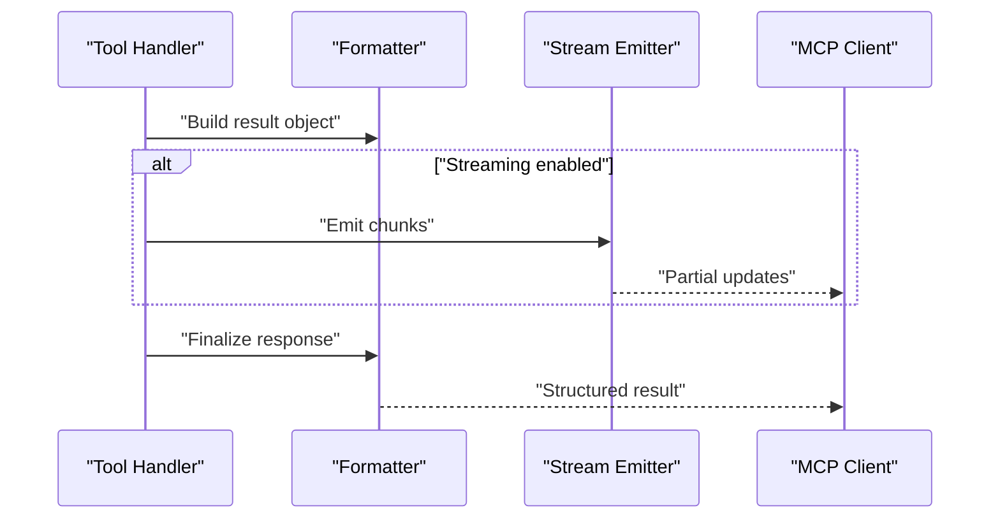

**Diagram sources**
- [mcp_common.py:1-200](file://mcp_common.py#L1-L200)
- [mcp_tools.py:1-200](file://mcp_tools.py#L1-L200)

**Section sources**
- [mcp_common.py:1-200](file://mcp_common.py#L1-L200)
- [mcp_tools.py:1-200](file://mcp_tools.py#L1-L200)

### Tool Lifecycle and Hooks
- Pre-processing: Authentication, authorization, rate limiting, and context injection occur before handler execution.
- Execution: Handler runs with validated parameters and access to scoped resources.
- Post-processing: Auditing, metrics collection, and background task dispatch occur after execution.

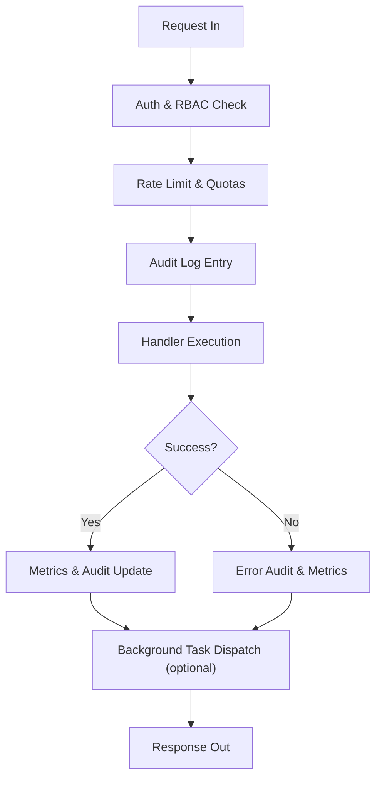

**Diagram sources**
- [mcp_instance.py:1-200](file://mcp_instance.py#L1-L200)
- [mcp_auth.py:1-200](file://mcp_auth.py#L1-L200)
- [mcp_audit.py:1-200](file://mcp_audit.py#L1-L200)
- [mcp_metrics.py:1-200](file://mcp_metrics.py#L1-L200)
- [background/background_worker.py:1-200](file://background/background_worker.py#L1-L200)

**Section sources**
- [mcp_instance.py:1-200](file://mcp_instance.py#L1-L200)
- [mcp_auth.py:1-200](file://mcp_auth.py#L1-L200)
- [mcp_audit.py:1-200](file://mcp_audit.py#L1-L200)
- [mcp_metrics.py:1-200](file://mcp_metrics.py#L1-L200)
- [background/background_worker.py:1-200](file://background/background_worker.py#L1-L200)

### Error Handling Patterns
- Validation Errors: Structured field-level messages returned immediately.
- Business Errors: Domain exceptions mapped to user-friendly responses with codes.
- System Errors: Unexpected failures captured with audit logs and metrics.

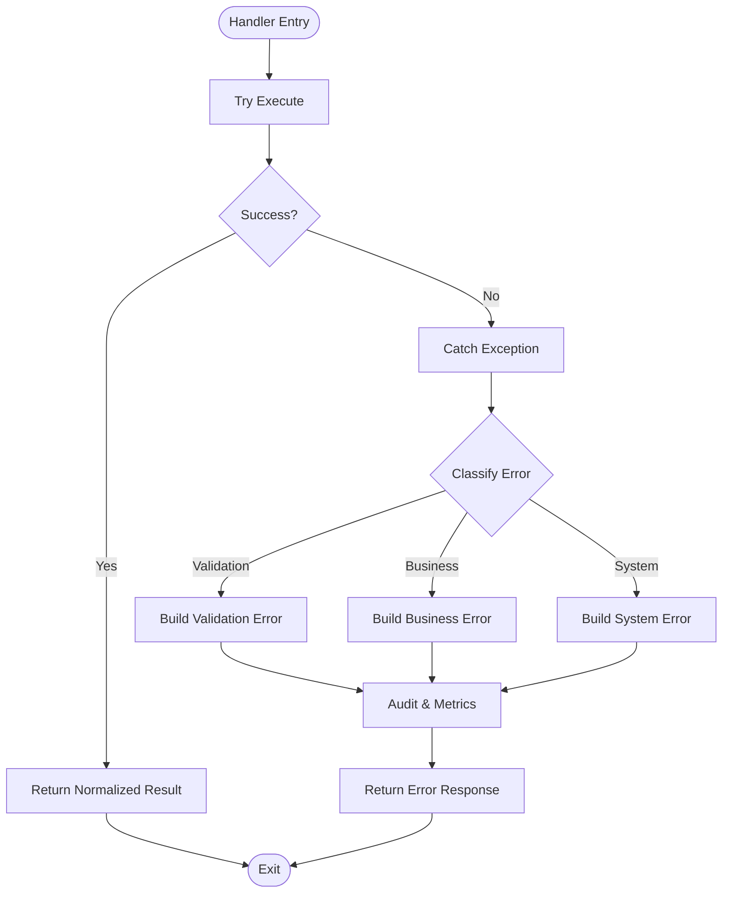

**Diagram sources**
- [mcp_common.py:1-200](file://mcp_common.py#L1-L200)
- [mcp_tools.py:1-200](file://mcp_tools.py#L1-L200)

**Section sources**
- [mcp_common.py:1-200](file://mcp_common.py#L1-L200)
- [mcp_tools.py:1-200](file://mcp_tools.py#L1-L200)

### Logging Requirements
- Audit Logs: Every tool invocation is logged with principal, action, inputs (sanitized), and outcome.
- Metrics: Latency, success/failure counts, and resource usage are recorded.
- Context Propagation: Correlation IDs flow through middleware and handlers for traceability.

**Section sources**
- [mcp_audit.py:1-200](file://mcp_audit.py#L1-L200)
- [mcp_metrics.py:1-200](file://mcp_metrics.py#L1-L200)
- [infra/audit.py:1-200](file://infra/audit.py#L1-L200)

### Step-by-Step Guides

#### Creating a Memory Operation Tool
- Define tool metadata: name, description, parameter schema.
- Implement handler: validate inputs, call memory service, format result.
- Register tool: add to registry with streaming/async flags if needed.
- Test: verify validation, success path, and error paths.

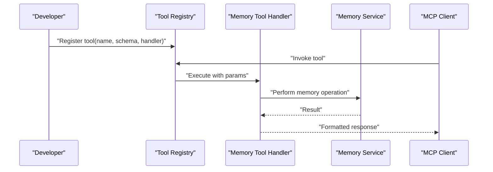

**Diagram sources**
- [mcp_memory.py:1-200](file://mcp_memory.py#L1-L200)
- [tool_registry.py:1-200](file://tool_registry.py#L1-L200)
- [recall/search_memory.py:1-200](file://recall/search_memory.py#L1-L200)

**Section sources**
- [mcp_memory.py:1-200](file://mcp_memory.py#L1-L200)
- [recall/search_memory.py:1-200](file://recall/search_memory.py#L1-L200)

#### Creating a Search Functionality Tool
- Define query parameters: text, filters, pagination, ranking options.
- Implement handler: parse query, invoke search orchestrator, apply reranking.
- Format results: include snippets, scores, and metadata.
- Optional streaming: stream intermediate hits for large result sets.

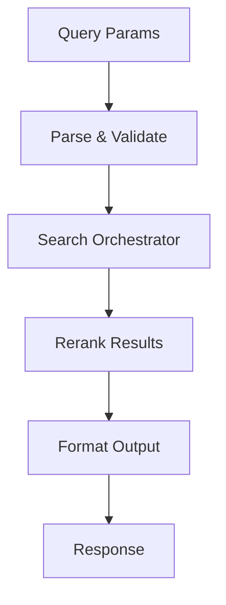

**Diagram sources**
- [mcp_search.py:1-200](file://mcp_search.py#L1-L200)
- [recall/search_memory.py:1-200](file://recall/search_memory.py#L1-L200)

**Section sources**
- [mcp_search.py:1-200](file://mcp_search.py#L1-L200)
- [recall/search_memory.py:1-200](file://recall/search_memory.py#L1-L200)

#### Creating a Knowledge Graph Query Tool
- Define traversal parameters: entity identifiers, relationship types, depth limits.
- Implement handler: resolve entities, traverse graph, aggregate facts.
- Format results: include nodes, edges, and temporal annotations.
- Safety checks: enforce tenant scoping and RBAC.

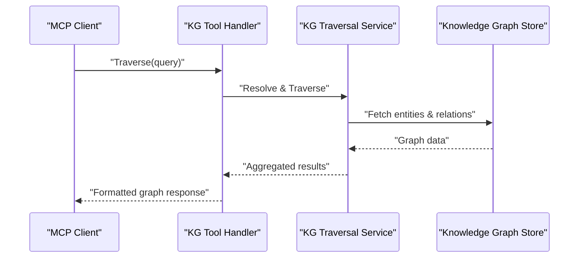

**Diagram sources**
- [mcp_kg.py:1-200](file://mcp_kg.py#L1-L200)
- [mcp_kg_traversal.py:1-200](file://mcp_kg_traversal.py#L1-L200)
- [kg/kg_traversal.py:1-200](file://kg/kg_traversal.py#L1-L200)
- [knowledge_graph/kg_search.py:1-200](file://knowledge_graph/kg_search.py#L1-L200)

**Section sources**
- [mcp_kg.py:1-200](file://mcp_kg.py#L1-L200)
- [mcp_kg_traversal.py:1-200](file://mcp_kg_traversal.py#L1-L200)
- [kg/kg_traversal.py:1-200](file://kg/kg_traversal.py#L1-L200)
- [knowledge_graph/kg_search.py:1-200](file://knowledge_graph/kg_search.py#L1-L200)

### Complex Tool Examples

#### Multiple Parameters Tool
- Use rich parameter schemas with nested objects, enums, and arrays.
- Apply cross-field validation rules.
- Provide clear error messages for invalid combinations.

**Section sources**
- [mcp_common.py:1-200](file://mcp_common.py#L1-L200)
- [mcp_tools.py:1-200](file://mcp_tools.py#L1-L200)

#### Streaming Responses Tool
- Emit partial results incrementally.
- Maintain ordering and deduplication semantics.
- Close streams cleanly on client disconnect.

**Section sources**
- [mcp_common.py:1-200](file://mcp_common.py#L1-L200)
- [mcp_tools.py:1-200](file://mcp_tools.py#L1-L200)

#### Async Operations Tool
- Offload heavy work to background workers.
- Return immediate acknowledgment with job ID.
- Push completion events when jobs finish.

**Section sources**
- [background/background_worker.py:1-200](file://background/background_worker.py#L1-L200)
- [background/tool_complete.py:1-200](file://background/tool_complete.py#L1-L200)

## Dependency Analysis
Tools depend on core infrastructure for configuration, scope, RBAC, and persistence.

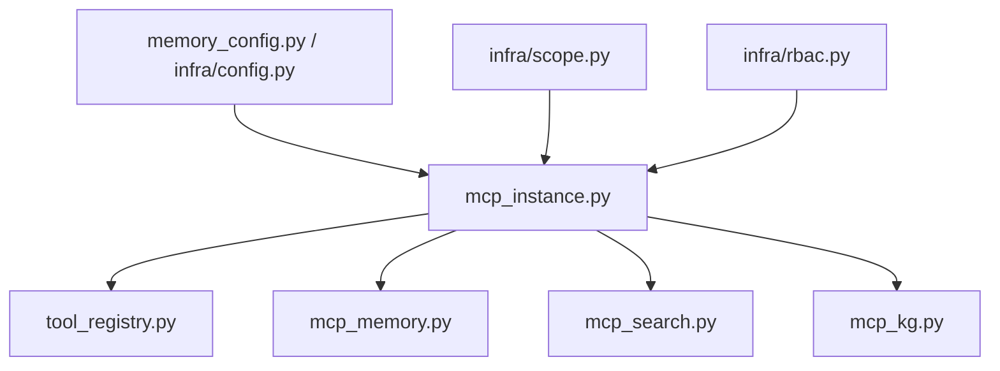

**Diagram sources**
- [memory_config.py:1-200](file://memory_config.py#L1-L200)
- [infra/config.py:1-200](file://infra/config.py#L1-L200)
- [infra/scope.py:1-200](file://infra/scope.py#L1-L200)
- [infra/rbac.py:1-200](file://infra/rbac.py#L1-L200)
- [mcp_instance.py:1-200](file://mcp_instance.py#L1-L200)
- [tool_registry.py:1-200](file://tool_registry.py#L1-L200)
- [mcp_memory.py:1-200](file://mcp_memory.py#L1-L200)
- [mcp_search.py:1-200](file://mcp_search.py#L1-L200)
- [mcp_kg.py:1-200](file://mcp_kg.py#L1-L200)

**Section sources**
- [memory_config.py:1-200](file://memory_config.py#L1-L200)
- [infra/config.py:1-200](file://infra/config.py#L1-L200)
- [infra/scope.py:1-200](file://infra/scope.py#L1-L200)
- [infra/rbac.py:1-200](file://infra/rbac.py#L1-L200)
- [mcp_instance.py:1-200](file://mcp_instance.py#L1-L200)
- [tool_registry.py:1-200](file://tool_registry.py#L1-L200)

## Performance Considerations
- Caching: Leverage caches for frequent reads and expensive computations.
- Pagination: Always paginate large result sets to reduce payload sizes.
- Streaming: Use streaming for long-running queries to improve perceived latency.
- Async: Offload heavy writes and transformations to background workers.
- Indexing: Ensure search and KG queries use appropriate indexes and facets.
- Rate Limiting: Protect services from overload using per-principal quotas.

[No sources needed since this section provides general guidance]

## Troubleshooting Guide
Common issues and resolutions:
- Validation Failures: Inspect parameter schemas and ensure required fields are present.
- Authorization Errors: Verify RBAC roles and tenant scoping.
- Timeouts: Increase timeouts for heavy operations or switch to async patterns.
- Missing Audit Entries: Confirm audit middleware is active and configured.
- Metrics Gaps: Check metrics pipeline and ensure correlation IDs propagate.

**Section sources**
- [mcp_common.py:1-200](file://mcp_common.py#L1-L200)
- [mcp_auth.py:1-200](file://mcp_auth.py#L1-L200)
- [mcp_audit.py:1-200](file://mcp_audit.py#L1-L200)
- [mcp_metrics.py:1-200](file://mcp_metrics.py#L1-L200)

## Conclusion
Building custom MCP tools involves registering handlers with well-defined schemas, applying robust validation and formatting, and integrating with cross-cutting concerns like auth, audit, and metrics. By following the provided patterns and leveraging existing domain modules, developers can create reliable, secure, and performant tools for memory, search, and knowledge graph interactions.

[No sources needed since this section summarizes without analyzing specific files]

## Appendices

### Testing Strategies
- Unit Tests: Validate parameter parsing, handler logic, and error paths.
- Integration Tests: Exercise full request/response flows with mocked services.
- Contract Tests: Ensure tool schemas remain stable and compatible.
- Security Tests: Verify RBAC enforcement and tenant isolation.
- Performance Tests: Measure latency and throughput under load.

**Section sources**
- [test_tool_registry.py:1-200](file://test_tool_registry.py#L1-L200)
- [test_mcp_wrappers.py:1-200](file://test_mcp_wrappers.py#L1-L200)
- [test_mcp_verbs.py:1-200](file://test_mcp_verbs.py#L1-L200)
- [test_mcp_skill_ops.py:1-200](file://test_mcp_skill_ops.py#L1-L200)
- [test_rate_limit_mcp.py:1-200](file://test_rate_limit_mcp.py#L1-L200)

### Security Best Practices
- Principle of Least Privilege: Grant minimal RBAC roles required.
- Input Sanitization: Validate and sanitize all inputs rigorously.
- Tenant Isolation: Enforce scoping at every layer.
- Audit Trails: Record all actions with sanitized payloads.
- Rate Limits: Prevent abuse with per-principal quotas.

**Section sources**
- [mcp_auth.py:1-200](file://mcp_auth.py#L1-L200)
- [infra/rbac.py:1-200](file://infra/rbac.py#L1-L200)
- [infra/scope.py:1-200](file://infra/scope.py#L1-L200)
- [mcp_audit.py:1-200](file://mcp_audit.py#L1-L200)

### Example References
- Memory Tool: See implementation and tests for save/search operations.
- Search Tool: Review orchestrator integration and reranking steps.
- Knowledge Graph Tool: Examine traversal and fact aggregation patterns.
- Maintenance Tool: Observe admin-only operations and safety checks.

**Section sources**
- [mcp_memory.py:1-200](file://mcp_memory.py#L1-L200)
- [mcp_search.py:1-200](file://mcp_search.py#L1-L200)
- [mcp_kg.py:1-200](file://mcp_kg.py#L1-L200)
- [mcp_maintenance.py:1-200](file://mcp_maintenance.py#L1-L200)