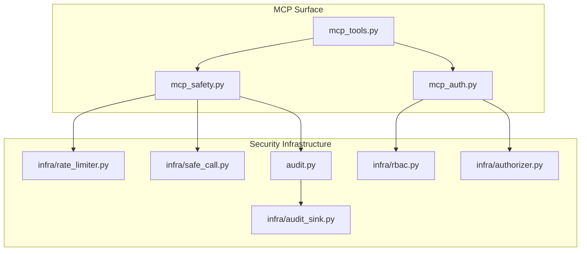
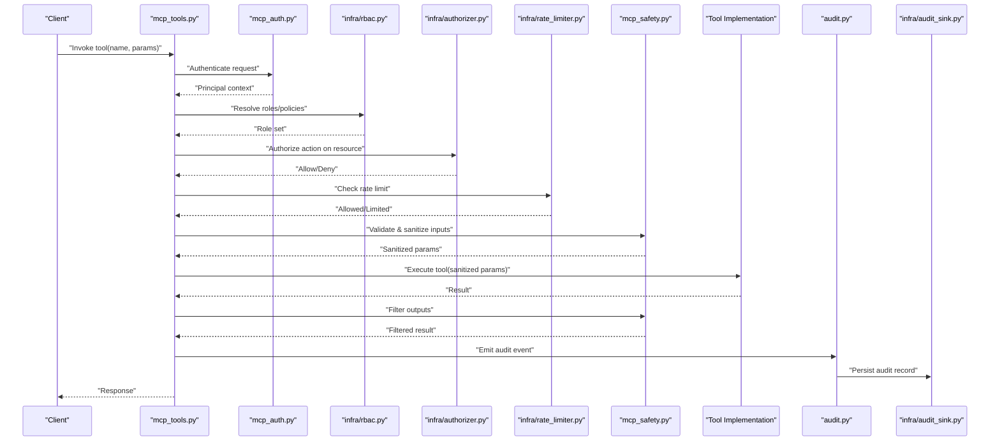
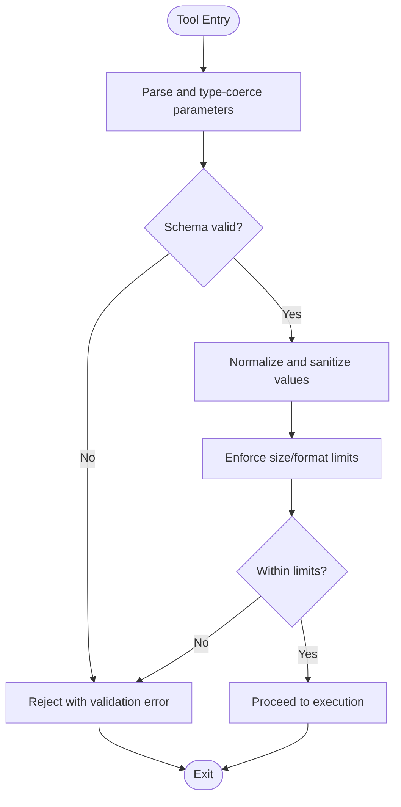
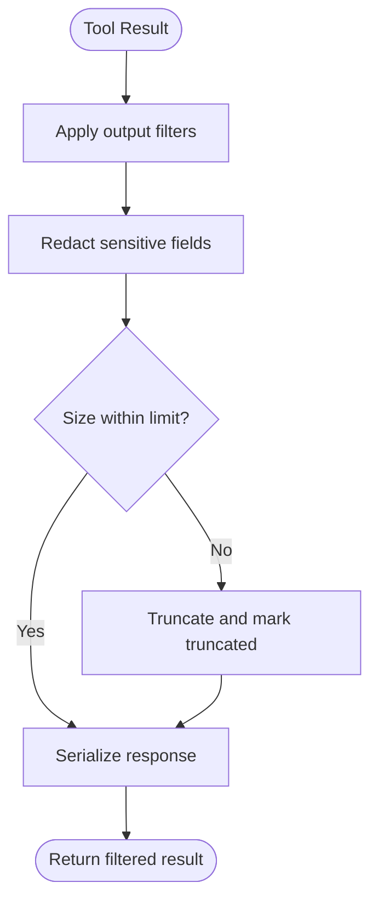
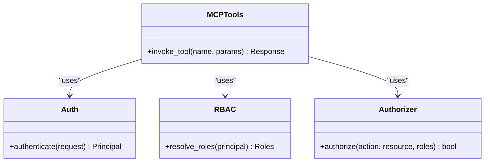
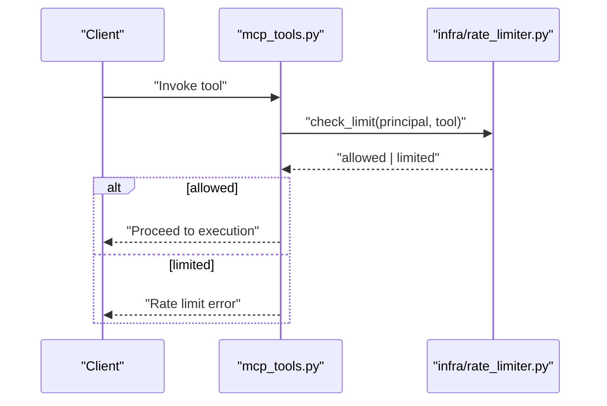
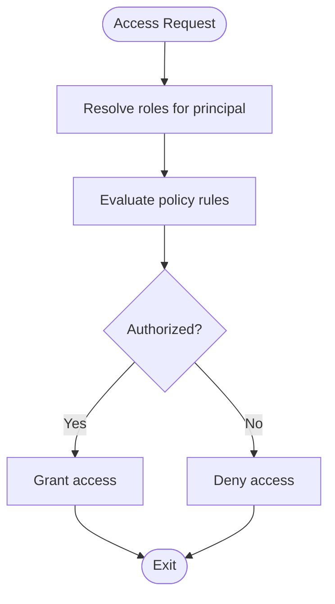
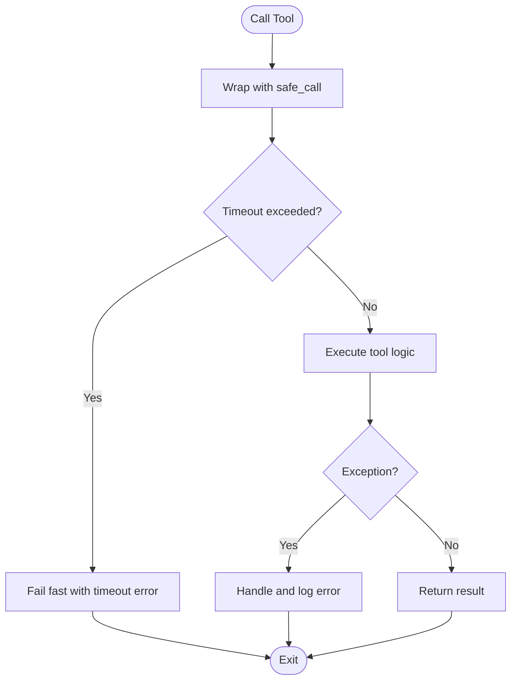
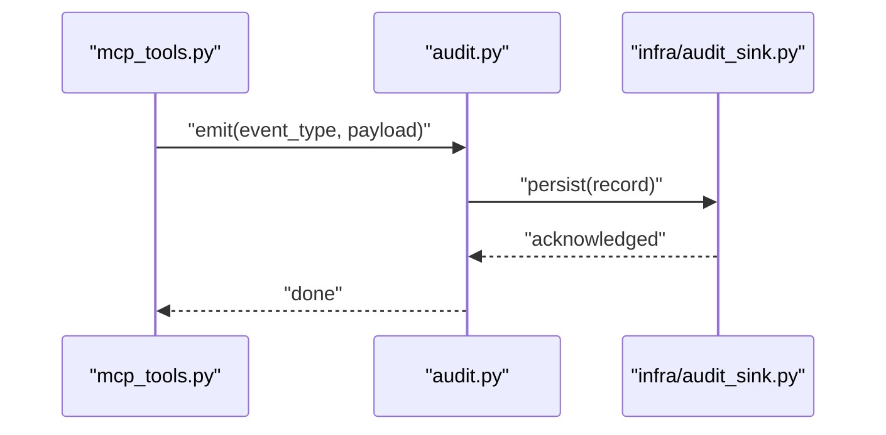
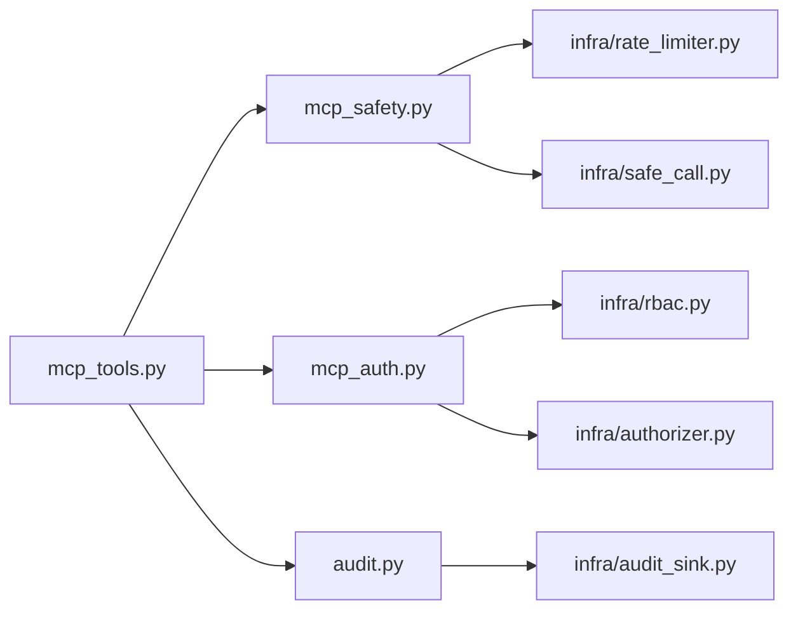

# Safety and Security Patterns

<cite>
**Referenced Files in This Document**
- [mcp_tools.py](file://mcp_tools.py)
- [mcp_safety.py](file://mcp_safety.py)
- [mcp_auth.py](file://mcp_auth.py)
- [rate_limiter.py](file://infra/rate_limiter.py)
- [audit.py](file://audit.py)
- [audit_sink.py](file://infra/audit_sink.py)
- [rbac.py](file://infra/rbac.py)
- [authorizer.py](file://infra/authorizer.py)
- [safe_call.py](file://infra/safe_call.py)
- [test_rate_limit_mcp.py](file://tests/test_rate_limit_mcp.py)
- [test_rbac_allows_with_role.py](file://tests/test_rbac_allows_with_role.py)
- [test_rbac_denies_without_role.py](file://tests/test_rbac_denies_without_role.py)
- [test_audit_logging.py](file://tests/test_audit_logging.py)
- [test_safe_call.py](file://tests/test_safe_call.py)
</cite>

## Table of Contents
1. [Introduction](#introduction)
2. [Project Structure](#project-structure)
3. [Core Components](#core-components)
4. [Architecture Overview](#architecture-overview)
5. [Detailed Component Analysis](#detailed-component-analysis)
6. [Dependency Analysis](#dependency-analysis)
7. [Performance Considerations](#performance-considerations)
8. [Troubleshooting Guide](#troubleshooting-guide)
9. [Conclusion](#conclusion)

## Introduction
This document provides comprehensive guidance for implementing safety and security measures in custom MCP tools. It covers input validation, parameter sanitization, output filtering, authentication and authorization checks, rate limiting, resource access controls, audit logging, and compliance considerations. The content is grounded in the repository’s MCP tooling and infrastructure modules to ensure practical applicability.

## Project Structure
The MCP surface exposes tools that can be invoked by agents or clients. Security and safety are enforced through dedicated layers:
- Tool registration and execution wrappers
- Authentication and authorization middleware
- Rate limiting and safe execution guards
- Audit logging and sinks
- RBAC policy enforcement

**Diagram sources**
- [mcp_tools.py](file://mcp_tools.py)
- [mcp_safety.py](file://mcp_safety.py)
- [mcp_auth.py](file://mcp_auth.py)
- [infra/rate_limiter.py](file://infra/rate_limiter.py)
- [infra/rbac.py](file://infra/rbac.py)
- [infra/authorizer.py](file://infra/authorizer.py)
- [infra/safe_call.py](file://infra/safe_call.py)
- [audit.py](file://audit.py)
- [infra/audit_sink.py](file://infra/audit_sink.py)

**Section sources**
- [mcp_tools.py](file://mcp_tools.py)
- [mcp_safety.py](file://mcp_safety.py)
- [mcp_auth.py](file://mcp_auth.py)
- [infra/rate_limiter.py](file://infra/rate_limiter.py)
- [infra/rbac.py](file://infra/rbac.py)
- [infra/authorizer.py](file://infra/authorizer.py)
- [infra/safe_call.py](file://infra/safe_call.py)
- [audit.py](file://audit.py)
- [infra/audit_sink.py](file://infra/audit_sink.py)

## Core Components
- Input validation and sanitization: Enforce strict schemas for tool parameters and sanitize inputs before use.
- Output filtering: Redact sensitive fields and enforce size limits on responses.
- Authentication and authorization: Validate caller identity and enforce role-based access control (RBAC).
- Rate limiting: Protect tools from abuse with per-principal throttling.
- Safe execution: Wrap tool calls with timeouts, retries, and error containment.
- Audit logging: Record security-relevant events and persist them via sinks.

**Section sources**
- [mcp_tools.py](file://mcp_tools.py)
- [mcp_safety.py](file://mcp_safety.py)
- [mcp_auth.py](file://mcp_auth.py)
- [infra/rate_limiter.py](file://infra/rate_limiter.py)
- [infra/rbac.py](file://infra/rbac.py)
- [infra/authorizer.py](file://infra/authorizer.py)
- [infra/safe_call.py](file://infra/safe_call.py)
- [audit.py](file://audit.py)
- [infra/audit_sink.py](file://infra/audit_sink.py)

## Architecture Overview
The MCP tool invocation pipeline applies multiple security layers around each tool call:

**Diagram sources**
- [mcp_tools.py](file://mcp_tools.py)
- [mcp_auth.py](file://mcp_auth.py)
- [infra/rbac.py](file://infra/rbac.py)
- [infra/authorizer.py](file://infra/authorizer.py)
- [infra/rate_limiter.py](file://infra/rate_limiter.py)
- [mcp_safety.py](file://mcp_safety.py)
- [audit.py](file://audit.py)
- [infra/audit_sink.py](file://infra/audit_sink.py)

## Detailed Component Analysis

### Input Validation and Parameter Sanitization
- Define strict schemas for all tool parameters using typed models and validators.
- Normalize and sanitize strings (trim, normalize whitespace, reject dangerous characters).
- Enforce length and format constraints; coerce types safely.
- Reject unknown keys to prevent injection via extra fields.

**Diagram sources**
- [mcp_safety.py](file://mcp_safety.py)
- [mcp_tools.py](file://mcp_tools.py)

**Section sources**
- [mcp_safety.py](file://mcp_safety.py)
- [mcp_tools.py](file://mcp_tools.py)

### Output Filtering and Redaction
- Apply a filter pass to remove or redact sensitive fields (e.g., tokens, secrets, PII).
- Enforce maximum response sizes to avoid memory pressure.
- Ensure consistent serialization formats to prevent information leakage.

**Diagram sources**
- [mcp_safety.py](file://mcp_safety.py)

**Section sources**
- [mcp_safety.py](file://mcp_safety.py)

### Authentication and Authorization Checks
- Authenticate requests to establish a principal identity.
- Resolve roles and policies for the principal.
- Authorize specific actions against resources using an authorizer.

**Diagram sources**
- [mcp_auth.py](file://mcp_auth.py)
- [infra/rbac.py](file://infra/rbac.py)
- [infra/authorizer.py](file://infra/authorizer.py)
- [mcp_tools.py](file://mcp_tools.py)

**Section sources**
- [mcp_auth.py](file://mcp_auth.py)
- [infra/rbac.py](file://infra/rbac.py)
- [infra/authorizer.py](file://infra/authorizer.py)
- [mcp_tools.py](file://mcp_tools.py)

### Rate Limiting Implementation
- Apply per-principal or per-tool rate limits to mitigate abuse.
- Return appropriate errors when limits are exceeded.
- Integrate into the MCP invocation pipeline before execution.

**Diagram sources**
- [mcp_tools.py](file://mcp_tools.py)
- [infra/rate_limiter.py](file://infra/rate_limiter.py)

**Section sources**
- [infra/rate_limiter.py](file://infra/rate_limiter.py)
- [tests/test_rate_limit_mcp.py](file://tests/test_rate_limit_mcp.py)

### Resource Access Controls
- Use RBAC to define roles and permissions.
- Leverage the authorizer to enforce fine-grained access decisions.
- Combine with tenant scoping where applicable to isolate data.

**Diagram sources**
- [infra/rbac.py](file://infra/rbac.py)
- [infra/authorizer.py](file://infra/authorizer.py)

**Section sources**
- [infra/rbac.py](file://infra/rbac.py)
- [infra/authorizer.py](file://infra/authorizer.py)
- [tests/test_rbac_allows_with_role.py](file://tests/test_rbac_allows_with_role.py)
- [tests/test_rbac_denies_without_role.py](file://tests/test_rbac_denies_without_role.py)

### Secure Tool Execution with Safe Call Wrappers
- Wrap tool invocations with safe execution guards: timeouts, retries, and exception containment.
- Prevent unbounded resource consumption and cascading failures.

**Diagram sources**
- [infra/safe_call.py](file://infra/safe_call.py)
- [mcp_tools.py](file://mcp_tools.py)

**Section sources**
- [infra/safe_call.py](file://infra/safe_call.py)
- [tests/test_safe_call.py](file://tests/test_safe_call.py)

### Audit Logging and Compliance
- Emit structured audit events for security-relevant operations (authz decisions, rate limit hits, tool invocations).
- Persist logs via sinks for long-term retention and analysis.
- Align with compliance requirements such as GDPR erasure workflows and evidence collection.

**Diagram sources**
- [audit.py](file://audit.py)
- [infra/audit_sink.py](file://infra/audit_sink.py)
- [mcp_tools.py](file://mcp_tools.py)

**Section sources**
- [audit.py](file://audit.py)
- [infra/audit_sink.py](file://infra/audit_sink.py)
- [tests/test_audit_logging.py](file://tests/test_audit_logging.py)

## Dependency Analysis
The following diagram shows key dependencies among MCP security components:

**Diagram sources**
- [mcp_tools.py](file://mcp_tools.py)
- [mcp_safety.py](file://mcp_safety.py)
- [mcp_auth.py](file://mcp_auth.py)
- [infra/rate_limiter.py](file://infra/rate_limiter.py)
- [infra/rbac.py](file://infra/rbac.py)
- [infra/authorizer.py](file://infra/authorizer.py)
- [infra/safe_call.py](file://infra/safe_call.py)
- [audit.py](file://audit.py)
- [infra/audit_sink.py](file://infra/audit_sink.py)

**Section sources**
- [mcp_tools.py](file://mcp_tools.py)
- [mcp_safety.py](file://mcp_safety.py)
- [mcp_auth.py](file://mcp_auth.py)
- [infra/rate_limiter.py](file://infra/rate_limiter.py)
- [infra/rbac.py](file://infra/rbac.py)
- [infra/authorizer.py](file://infra/authorizer.py)
- [infra/safe_call.py](file://infra/safe_call.py)
- [audit.py](file://audit.py)
- [infra/audit_sink.py](file://infra/audit_sink.py)

## Performance Considerations
- Keep validation and sanitization lightweight; prefer schema-driven coercion over ad-hoc parsing.
- Use bounded buffers and size limits for I/O to prevent memory spikes.
- Apply rate limits at the edge to reduce load on downstream services.
- Prefer fail-fast patterns with safe_call wrappers to contain expensive failures.
- Batch audit emissions where possible without compromising traceability.

[No sources needed since this section provides general guidance]

## Troubleshooting Guide
- Authentication failures: Verify principal resolution and token handling paths.
- Authorization denials: Inspect RBAC policies and authorizer rules for the requested action/resource.
- Rate limit errors: Confirm per-principal counters and thresholds; adjust limits if necessary.
- Validation errors: Review parameter schemas and sanitizer rules; ensure unknown keys are rejected.
- Audit gaps: Check sink configuration and persistence acknowledgments; verify event emission points.

**Section sources**
- [mcp_auth.py](file://mcp_auth.py)
- [infra/rbac.py](file://infra/rbac.py)
- [infra/authorizer.py](file://infra/authorizer.py)
- [infra/rate_limiter.py](file://infra/rate_limiter.py)
- [mcp_safety.py](file://mcp_safety.py)
- [audit.py](file://audit.py)
- [infra/audit_sink.py](file://infra/audit_sink.py)

## Conclusion
By integrating strict input validation, robust output filtering, strong authentication and authorization, rate limiting, safe execution wrappers, and comprehensive audit logging, custom MCP tools can achieve high assurance against common vulnerabilities while maintaining operational reliability and compliance.

[No sources needed since this section summarizes without analyzing specific files]