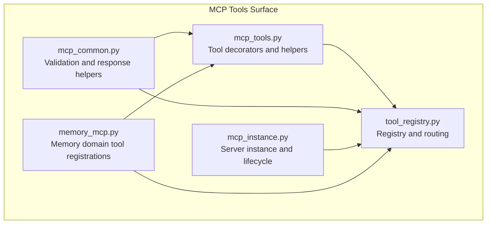
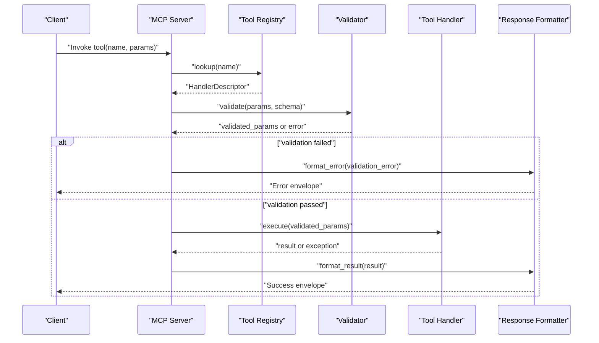
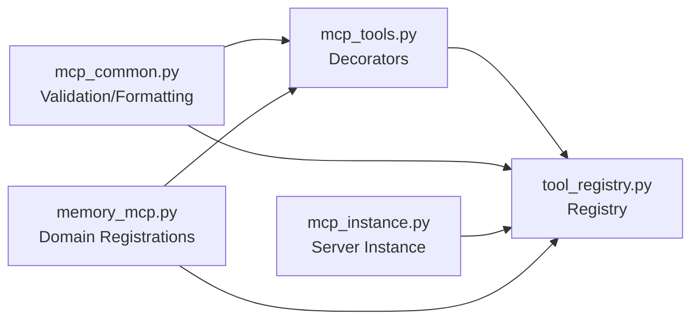
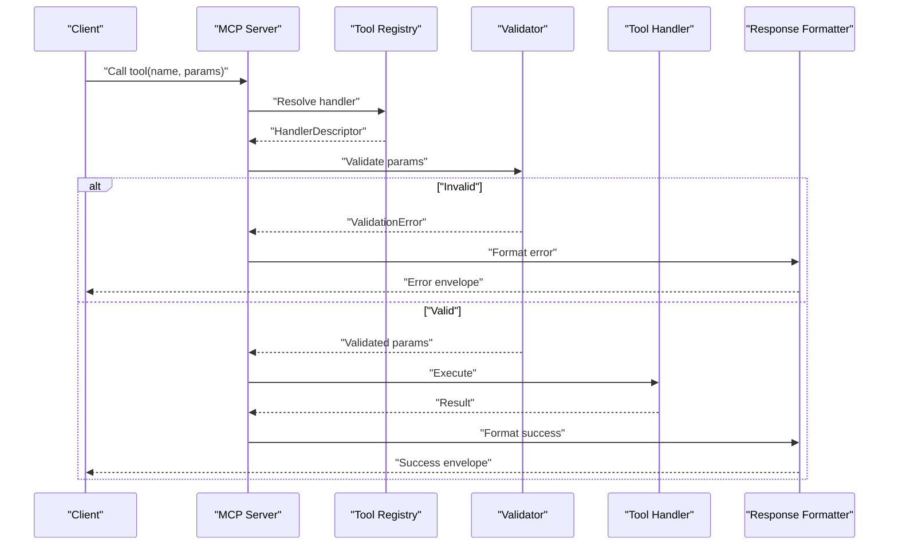

# Tool Registration and Lifecycle

<cite>
**Referenced Files in This Document**
- [mcp_tools.py](file://mcp_tools.py)
- [tool_registry.py](file://tool_registry.py)
- [memory_mcp.py](file://memory_mcp.py)
- [mcp_common.py](file://mcp_common.py)
- [mcp_instance.py](file://mcp_instance.py)
- [test_tool_registry.py](file://test/test_tool_registry.py)
- [test_tool_routing.py](file://test/test_tool_routing.py)
- [how-to/add-an-mcp-tool.md](file://docs/how-to/add-an-mcp-tool.md)
- [reference/mcp-tools.md](file://docs/reference/mcp-tools.md)
</cite>

## Table of Contents
1. [Introduction](#introduction)
2. [Project Structure](#project-structure)
3. [Core Components](#core-components)
4. [Architecture Overview](#architecture-overview)
5. [Detailed Component Analysis](#detailed-component-analysis)
6. [Dependency Analysis](#dependency-analysis)
7. [Performance Considerations](#performance-considerations)
8. [Troubleshooting Guide](#troubleshooting-guide)
9. [Conclusion](#conclusion)
10. [Appendices](#appendices)

## Introduction
This document explains how tools are registered, discovered, validated, and executed within the MCP server context. It focuses on:
- The tool decorator system for declaring tools declaratively
- Parameter validation mechanisms and response formatting patterns
- Discovery and registration flows during server startup
- Execution lifecycle, including error handling and observability
- Versioning and deprecation strategies
- Dynamic tool loading capabilities

The goal is to help developers author robust tools that integrate cleanly with the MCP server and its runtime.

## Project Structure
The MCP tooling surface spans a few core modules:
- Declarative tool definitions and decorators
- Central registry for discovery and routing
- Server wiring and instance management
- Shared utilities for validation and response formatting
- Tests and documentation for usage patterns

**Diagram sources**
- [mcp_tools.py](file://mcp_tools.py)
- [tool_registry.py](file://tool_registry.py)
- [mcp_common.py](file://mcp_common.py)
- [mcp_instance.py](file://mcp_instance.py)
- [memory_mcp.py](file://memory_mcp.py)

**Section sources**
- [mcp_tools.py](file://mcp_tools.py)
- [tool_registry.py](file://tool_registry.py)
- [mcp_common.py](file://mcp_common.py)
- [mcp_instance.py](file://mcp_instance.py)
- [memory_mcp.py](file://memory_mcp.py)

## Core Components
- Tool decorator system: Declares function signatures, parameter schemas, descriptions, versioning, and deprecation metadata. Decorators register handlers into a central registry.
- Registry: Maintains a map from tool names to handler descriptors, supports discovery, listing, and dispatch.
- Validation layer: Enforces input types, required fields, constraints, and normalizes payloads before invoking handlers.
- Response formatter: Standardizes outputs (success envelopes, errors, pagination, streaming markers).
- Server integration: Wires the registry into the MCP server instance, exposes endpoints, and manages lifecycle events.

Key responsibilities:
- Declarative tool definition via decorators
- Automatic schema generation and validation
- Centralized routing and execution
- Consistent error and result envelopes
- Versioned and deprecated tool support
- Optional dynamic loading at runtime

**Section sources**
- [mcp_tools.py](file://mcp_tools.py)
- [tool_registry.py](file://tool_registry.py)
- [mcp_common.py](file://mcp_common.py)
- [mcp_instance.py](file://mcp_instance.py)

## Architecture Overview
At startup, the server imports modules that declare tools. Each decorator registers a handler descriptor in the registry. The registry exposes APIs to list available tools and route calls to the correct handler. When a client invokes a tool, the server validates inputs, executes the handler, formats the response, and returns it through the MCP transport.

**Diagram sources**
- [mcp_instance.py](file://mcp_instance.py)
- [tool_registry.py](file://tool_registry.py)
- [mcp_common.py](file://mcp_common.py)
- [mcp_tools.py](file://mcp_tools.py)

## Detailed Component Analysis

### Tool Decorator System
The decorator system provides a declarative way to define tools:
- Function signature inspection generates parameter schemas
- Metadata such as description, version, and deprecation flags are attached
- Handlers are automatically registered into the central registry
- Optional pre/post hooks can be applied for logging, metrics, or auditing

Typical usage patterns include:
- Simple tools with primitive parameters and scalar return values
- Complex tools with nested objects, arrays, enums, and optional fields
- Error handling by raising typed exceptions that the framework converts to standardized error envelopes

Best practices:
- Keep parameter schemas minimal and explicit
- Use descriptive names and summaries
- Mark deprecated tools early and provide migration guidance
- Avoid side effects outside the handler; rely on the framework for retries and timeouts where applicable

**Section sources**
- [mcp_tools.py](file://mcp_tools.py)
- [how-to/add-an-mcp-tool.md](file://docs/how-to/add-an-mcp-tool.md)

### Parameter Validation Mechanisms
Validation occurs before handler execution:
- Schema-driven checks for required fields, types, ranges, and formats
- Normalization of inputs (e.g., coercion, defaults)
- Early failure with structured error responses when invalid
- Support for conditional constraints and cross-field validation

Integration points:
- Validators consume schemas generated from decorator metadata
- Errors are formatted consistently using shared formatters
- Custom validators can be composed for complex business rules

**Section sources**
- [mcp_common.py](file://mcp_common.py)
- [mcp_tools.py](file://mcp_tools.py)

### Response Formatting Patterns
All tool responses follow consistent envelopes:
- Success envelope includes data payload and optional metadata
- Error envelope includes code, message, and contextual details
- Pagination and streaming markers are supported where applicable
- Observability fields (trace IDs, timestamps) may be injected

Benefits:
- Predictable client behavior across all tools
- Simplified error handling on clients
- Easier instrumentation and debugging

**Section sources**
- [mcp_common.py](file://mcp_common.py)

### Registry and Routing
The registry maintains:
- A mapping from tool names to handler descriptors
- Tool metadata (version, deprecation status, docs)
- Discovery APIs for listing and introspection
- Dispatch logic that routes calls to the appropriate handler

Lifecycle:
- On import, decorators register handlers
- Server initialization finalizes the registry and exposes endpoints
- Runtime updates can add/remove tools dynamically if supported

**Section sources**
- [tool_registry.py](file://tool_registry.py)

### Server Integration and Lifecycle
The MCP server integrates with the registry:
- Imports tool modules to trigger registration
- Exposes tool invocation endpoints
- Manages concurrency, timeouts, and resource cleanup
- Provides health and introspection endpoints

Dynamic loading:
- Some servers support hot-loading new tool modules without restart
- Dynamic loaders scan configured paths and register discovered tools
- Unloading or replacing tools requires careful state management

**Section sources**
- [mcp_instance.py](file://mcp_instance.py)
- [memory_mcp.py](file://memory_mcp.py)

### Examples and Usage Patterns
- Simple tool registration: Define a function with typed parameters and a clear description; the decorator handles schema generation and registration.
- Complex tool registration: Use nested structures, enums, and optional fields; leverage validation helpers for custom constraints.
- Error handling strategies: Raise domain-specific exceptions; the framework maps them to standardized error envelopes.
- Versioning and deprecation: Attach version and deprecation metadata to guide clients toward newer implementations.
- Dynamic loading: Place tool modules in discoverable locations; ensure they import and register themselves.

For concrete examples and step-by-step instructions, see the how-to guide and reference pages.

**Section sources**
- [how-to/add-an-mcp-tool.md](file://docs/how-to/add-an-mcp-tool.md)
- [reference/mcp-tools.md](file://docs/reference/mcp-tools.md)

## Dependency Analysis
The following diagram shows key dependencies between components involved in tool registration and execution.

**Diagram sources**
- [mcp_tools.py](file://mcp_tools.py)
- [tool_registry.py](file://tool_registry.py)
- [mcp_common.py](file://mcp_common.py)
- [mcp_instance.py](file://mcp_instance.py)
- [memory_mcp.py](file://memory_mcp.py)

**Section sources**
- [mcp_tools.py](file://mcp_tools.py)
- [tool_registry.py](file://tool_registry.py)
- [mcp_common.py](file://mcp_common.py)
- [mcp_instance.py](file://mcp_instance.py)
- [memory_mcp.py](file://memory_mcp.py)

## Performance Considerations
- Prefer lightweight parameter validation; defer heavy computations to the handler body.
- Cache static schema metadata where possible to avoid repeated introspection.
- Use streaming responses for large payloads to reduce memory pressure.
- Instrument tool invocations with latency and error counters for observability.
- Be mindful of concurrency limits and backpressure when registering high-throughput tools.

[No sources needed since this section provides general guidance]

## Troubleshooting Guide
Common issues and resolutions:
- Tool not found: Ensure the module importing the tool is loaded during server startup or is dynamically discoverable.
- Validation failures: Check parameter schemas and required fields; inspect error envelopes for details.
- Inconsistent responses: Verify that handlers return data compatible with the expected envelope format.
- Deprecation warnings: Update clients to use non-deprecated versions; plan migration timelines.
- Dynamic loading problems: Confirm discovery paths and module import order; verify that registration occurs on import.

Useful references:
- How-to guide for adding an MCP tool
- Reference page describing available tools and behaviors
- Unit tests covering registry operations and routing scenarios

**Section sources**
- [how-to/add-an-mcp-tool.md](file://docs/how-to/add-an-mcp-tool.md)
- [reference/mcp-tools.md](file://docs/reference/mcp-tools.md)
- [test_tool_registry.py](file://test/test_tool_registry.py)
- [test_tool_routing.py](file://test/test_tool_routing.py)

## Conclusion
The MCP tooling surface provides a robust, declarative approach to defining, validating, and executing tools. By leveraging decorators, centralized registries, and consistent validation and formatting layers, teams can build reliable, versioned, and maintainable tool ecosystems. Adopting best practices around schema design, error handling, and observability ensures smooth operation and easy evolution over time.

[No sources needed since this section summarizes without analyzing specific files]

## Appendices

### Appendix A: Sequence of a Typical Tool Invocation

**Diagram sources**
- [mcp_instance.py](file://mcp_instance.py)
- [tool_registry.py](file://tool_registry.py)
- [mcp_common.py](file://mcp_common.py)
- [mcp_tools.py](file://mcp_tools.py)