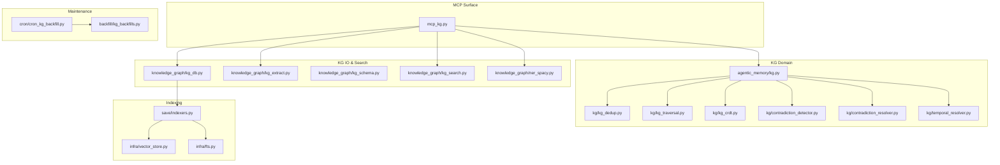
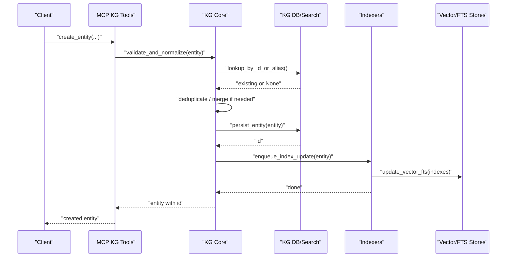
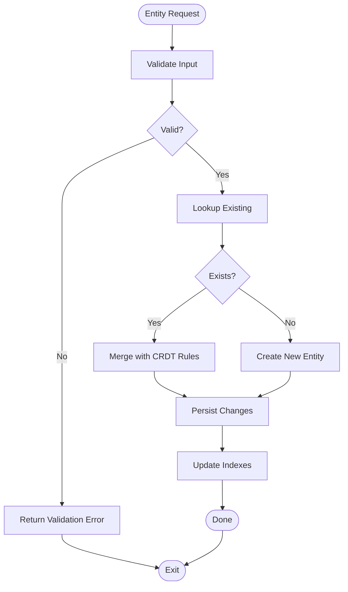
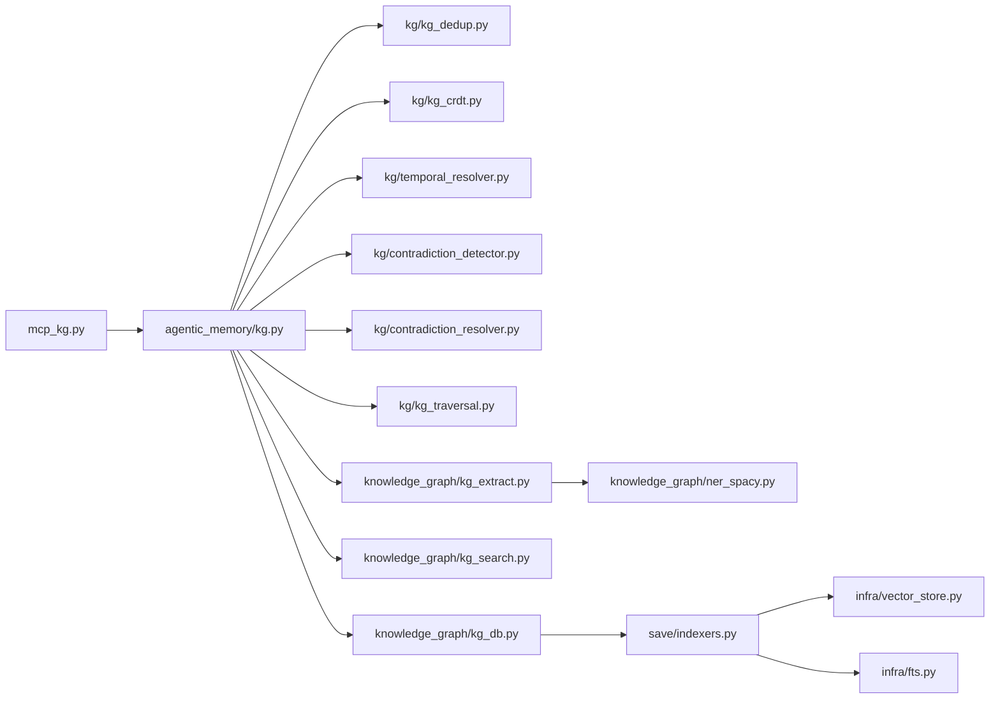

# Entity Operations

<cite>
**Referenced Files in This Document**
- [mcp_kg.py](file://mcp_kg.py)
- [kg.py](file://agentic_memory/kg.py)
- [knowledge_graph/kg_db.py](file://knowledge_graph/kg_db.py)
- [knowledge_graph/kg_extract.py](file://knowledge_graph/kg_extract.py)
- [knowledge_graph/kg_schema.py](file://knowledge_graph/kg_schema.py)
- [knowledge_graph/kg_search.py](file://knowledge_graph/kg_search.py)
- [knowledge_graph/ner_spacy.py](file://knowledge_graph/ner_spacy.py)
- [kg/kg_dedup.py](file://kg/kg_dedup.py)
- [kg/kg_traversal.py](file://kg/kg_traversal.py)
- [kg/kg_crdt.py](file://kg/kg_crdt.py)
- [kg/contradiction_detector.py](file://kg/contradiction_detector.py)
- [kg/contradiction_resolver.py](file://kg/contradiction_resolver.py)
- [kg/temporal_resolver.py](file://kg/temporal_resolver.py)
- [save/indexers.py](file://save/indexers.py)
- [infra/vector_store.py](file://infra/vector_store.py)
- [infra/fts.py](file://infra/fts.py)
- [cron/cron_kg_backfill.py](file://cron/cron_kg_backfill.py)
- [backfill/kg_backfills.py](file://backfill/kg_backfills.py)
- [scripts/gen_mcp_tools_doc.py](file://scripts/gen_mcp_tools_doc.py)
</cite>

## Table of Contents
1. [Introduction](#introduction)
2. [Project Structure](#project-structure)
3. [Core Components](#core-components)
4. [Architecture Overview](#architecture-overview)
5. [Detailed Component Analysis](#detailed-component-analysis)
6. [Dependency Analysis](#dependency-analysis)
7. [Performance Considerations](#performance-considerations)
8. [Troubleshooting Guide](#troubleshooting-guide)
9. [Conclusion](#conclusion)
10. [Appendices](#appendices)

## Introduction
This document provides comprehensive documentation for MCP tools that handle knowledge graph entity operations. It explains how entities are created, retrieved, updated, and deleted; how properties and metadata are managed; and how relationships are linked. It also covers extracting entities from text, managing entity lifecycles, handling conflicts, validation rules, indexing strategies, and performance optimization for large-scale operations.

## Project Structure
The knowledge graph (KG) subsystem is implemented across several modules:
- MCP tool surface exposing KG operations to clients
- Core KG domain logic for entities, relations, and temporal aspects
- Extraction and NER utilities
- Storage and indexing backends
- Deduplication, traversal, and contradiction resolution
- Background jobs and backfills for maintenance and consistency

**Diagram sources**
- [mcp_kg.py](file://mcp_kg.py)
- [agentic_memory/kg.py](file://agentic_memory/kg.py)
- [knowledge_graph/kg_db.py](file://knowledge_graph/kg_db.py)
- [knowledge_graph/kg_extract.py](file://knowledge_graph/kg_extract.py)
- [knowledge_graph/kg_schema.py](file://knowledge_graph/kg_schema.py)
- [knowledge_graph/kg_search.py](file://knowledge_graph/kg_search.py)
- [knowledge_graph/ner_spacy.py](file://knowledge_graph/ner_spacy.py)
- [kg/kg_dedup.py](file://kg/kg_dedup.py)
- [kg/kg_traversal.py](file://kg/kg_traversal.py)
- [kg/kg_crdt.py](file://kg/kg_crdt.py)
- [kg/contradiction_detector.py](file://kg/contradiction_detector.py)
- [kg/contradiction_resolver.py](file://kg/contradiction_resolver.py)
- [kg/temporal_resolver.py](file://kg/temporal_resolver.py)
- [save/indexers.py](file://save/indexers.py)
- [infra/vector_store.py](file://infra/vector_store.py)
- [infra/fts.py](file://infra/fts.py)
- [cron/cron_kg_backfill.py](file://cron/cron_kg_backfill.py)
- [backfill/kg_backfills.py](file://backfill/kg_backfills.py)

**Section sources**
- [mcp_kg.py](file://mcp_kg.py)
- [agentic_memory/kg.py](file://agentic_memory/kg.py)
- [knowledge_graph/kg_db.py](file://knowledge_graph/kg_db.py)
- [knowledge_graph/kg_extract.py](file://knowledge_graph/kg_extract.py)
- [knowledge_graph/kg_schema.py](file://knowledge_graph/kg_schema.py)
- [knowledge_graph/kg_search.py](file://knowledge_graph/kg_search.py)
- [knowledge_graph/ner_spacy.py](file://knowledge_graph/ner_spacy.py)
- [kg/kg_dedup.py](file://kg/kg_dedup.py)
- [kg/kg_traversal.py](file://kg/kg_traversal.py)
- [kg/kg_crdt.py](file://kg/kg_crdt.py)
- [kg/contradiction_detector.py](file://kg/contradiction_detector.py)
- [kg/contradiction_resolver.py](file://kg/contradiction_resolver.py)
- [kg/temporal_resolver.py](file://kg/temporal_resolver.py)
- [save/indexers.py](file://save/indexers.py)
- [infra/vector_store.py](file://infra/vector_store.py)
- [infra/fts.py](file://infra/fts.py)
- [cron/cron_kg_backfill.py](file://cron/cron_kg_backfill.py)
- [backfill/kg_backfills.py](file://backfill/kg_backfills.py)

## Core Components
- MCP KG Tools: Expose CRUD-like operations for entities and relationships, extraction from text, search, and lifecycle management.
- KG Core: Encapsulates entity models, relationship linking, deduplication, CRDT-based conflict-free updates, and temporal reasoning.
- KG IO/Search: Database access, schema definitions, full-text search, vector search, and NER-based extraction.
- Indexing: Vector and full-text indexers used by the KG layer to support fast retrieval.
- Maintenance: Backfill and cron jobs to rebuild indexes, reconcile entities, and ensure consistency.

Key responsibilities:
- Create/Read/Update/Delete entities and relationships
- Validate inputs and enforce schema constraints
- Manage metadata and provenance
- Resolve conflicts via CRDTs and contradiction detection
- Maintain indexes for efficient search

**Section sources**
- [mcp_kg.py](file://mcp_kg.py)
- [agentic_memory/kg.py](file://agentic_memory/kg.py)
- [knowledge_graph/kg_schema.py](file://knowledge_graph/kg_schema.py)
- [knowledge_graph/kg_db.py](file://knowledge_graph/kg_db.py)
- [knowledge_graph/kg_search.py](file://knowledge_graph/kg_search.py)
- [kg/kg_dedup.py](file://kg/kg_dedup.py)
- [kg/kg_crdt.py](file://kg/kg_crdt.py)
- [kg/contradiction_detector.py](file://kg/contradiction_detector.py)
- [kg/temporal_resolver.py](file://kg/temporal_resolver.py)
- [save/indexers.py](file://save/indexers.py)
- [infra/vector_store.py](file://infra/vector_store.py)
- [infra/fts.py](file://infra/fts.py)

## Architecture Overview
The MCP KG layer exposes a stable API surface over a robust KG backend. Clients call MCP tools to create or update entities, link relationships, extract entities from text, and query/search. The backend performs validation, deduplication, conflict resolution, persistence, and indexing.

**Diagram sources**
- [mcp_kg.py](file://mcp_kg.py)
- [agentic_memory/kg.py](file://agentic_memory/kg.py)
- [knowledge_graph/kg_db.py](file://knowledge_graph/kg_db.py)
- [knowledge_graph/kg_search.py](file://knowledge_graph/kg_search.py)
- [save/indexers.py](file://save/indexers.py)
- [infra/vector_store.py](file://infra/vector_store.py)
- [infra/fts.py](file://infra/fts.py)

## Detailed Component Analysis

### MCP KG Tools
Responsibilities:
- Provide methods for creating, retrieving, updating, and deleting entities
- Link and unlink relationships between entities
- Extract entities from free-form text using NER and extraction pipelines
- Query and search entities with filters and facets
- Manage entity lifecycle states and metadata

Typical operations:
- create_entity: validate input, normalize fields, deduplicate, persist, and index
- get_entity: fetch by id or alias with optional projection
- update_entity: apply partial updates with conflict resolution
- delete_entity: soft-delete or cascade depending on policy
- link_relationship: add directed edges with type and attributes
- unlink_relationship: remove edges safely
- extract_entities_from_text: run NER/extraction and return candidate entities
- search_entities: hybrid search combining keyword, semantic, and graph signals

Error handling:
- Validation errors for missing required fields or invalid types
- Conflict errors when concurrent updates occur (resolved via CRDTs)
- Integrity errors for broken references or duplicate keys

**Section sources**
- [mcp_kg.py](file://mcp_kg.py)

### KG Core (Entities, Relationships, Metadata)
Responsibilities:
- Define entity and relationship schemas and constraints
- Normalize and validate inputs
- Manage metadata such as provenance, timestamps, and versioning
- Coordinate deduplication and merging
- Apply CRDT semantics for conflict-free concurrent updates
- Temporal reasoning for time-bounded facts

Key concepts:
- Entities have stable ids, aliases, and typed properties
- Relationships are typed, directional, and may carry attributes
- Metadata includes creation/update times, authorship, and source references
- CRDT fields enable last-writer-wins or structured merges without locks
- Temporal resolvers manage validity windows and revision history

**Section sources**
- [agentic_memory/kg.py](file://agentic_memory/kg.py)
- [knowledge_graph/kg_schema.py](file://knowledge_graph/kg_schema.py)
- [kg/kg_dedup.py](file://kg/kg_dedup.py)
- [kg/kg_crdt.py](file://kg/kg_crdt.py)
- [kg/temporal_resolver.py](file://kg/temporal_resolver.py)

### KG IO and Search
Responsibilities:
- Persist entities and relationships to storage
- Provide read paths for exact lookup and filtered queries
- Support full-text and vector search
- Integrate NER and extraction utilities

Components:
- Database access layer for entities, relations, and metadata
- Schema enforcement and migration compatibility
- Search pipeline combining BM25/FTS and embeddings
- NER module for initial entity candidates from text

**Section sources**
- [knowledge_graph/kg_db.py](file://knowledge_graph/kg_db.py)
- [knowledge_graph/kg_search.py](file://knowledge_graph/kg_search.py)
- [knowledge_graph/ner_spacy.py](file://knowledge_graph/ner_spacy.py)

### Indexing Strategy
Responsibilities:
- Maintain vector embeddings for semantic similarity
- Maintain full-text indices for keyword matching
- Rebuild and backfill indexes after schema changes or data corrections

Strategies:
- Batched writes to vector store and FTS engine
- Incremental updates triggered by entity mutations
- Scheduled backfills for consistency and drift correction

**Section sources**
- [save/indexers.py](file://save/indexers.py)
- [infra/vector_store.py](file://infra/vector_store.py)
- [infra/fts.py](file://infra/fts.py)
- [cron/cron_kg_backfill.py](file://cron/cron_kg_backfill.py)
- [backfill/kg_backfills.py](file://backfill/kg_backfills.py)

### Deduplication and Merging
Responsibilities:
- Detect near-duplicate entities based on identity heuristics
- Merge conflicting properties while preserving provenance
- Redirect old ids to canonical ids

Approach:
- Canonicalization of names and aliases
- Semantic similarity checks for ambiguous cases
- Deterministic tie-breaking and auditability

**Section sources**
- [kg/kg_dedup.py](file://kg/kg_dedup.py)

### Traversal and Graph Analytics
Responsibilities:
- Traverse relationships efficiently
- Compute connectivity metrics and communities
- Support multi-hop queries for complex lookups

**Section sources**
- [kg/kg_traversal.py](file://kg/kg_traversal.py)

### Contradiction Detection and Resolution
Responsibilities:
- Identify contradictory statements about the same entity or relation
- Propose resolutions based on recency, confidence, and provenance
- Record decisions for auditability

**Section sources**
- [kg/contradiction_detector.py](file://kg/contradiction_detector.py)
- [kg/contradiction_resolver.py](file://kg/contradiction_resolver.py)

### Conceptual Overview
Conceptual flow for entity lifecycle:
- Creation: validate, normalize, deduplicate, persist, index
- Update: partial merge with CRDT semantics, re-index
- Deletion: soft-delete with cascading policies
- Lifecycle transitions: draft -> active -> archived -> deleted

[No sources needed since this diagram shows conceptual workflow, not actual code structure]

## Dependency Analysis
High-level dependencies among KG components:

**Diagram sources**
- [mcp_kg.py](file://mcp_kg.py)
- [agentic_memory/kg.py](file://agentic_memory/kg.py)
- [kg/kg_dedup.py](file://kg/kg_dedup.py)
- [kg/kg_crdt.py](file://kg/kg_crdt.py)
- [kg/temporal_resolver.py](file://kg/temporal_resolver.py)
- [kg/contradiction_detector.py](file://kg/contradiction_detector.py)
- [kg/contradiction_resolver.py](file://kg/contradiction_resolver.py)
- [kg/kg_traversal.py](file://kg/kg_traversal.py)
- [knowledge_graph/kg_db.py](file://knowledge_graph/kg_db.py)
- [knowledge_graph/kg_search.py](file://knowledge_graph/kg_search.py)
- [knowledge_graph/kg_extract.py](file://knowledge_graph/kg_extract.py)
- [knowledge_graph/ner_spacy.py](file://knowledge_graph/ner_spacy.py)
- [save/indexers.py](file://save/indexers.py)
- [infra/vector_store.py](file://infra/vector_store.py)
- [infra/fts.py](file://infra/fts.py)

**Section sources**
- [mcp_kg.py](file://mcp_kg.py)
- [agentic_memory/kg.py](file://agentic_memory/kg.py)
- [knowledge_graph/kg_db.py](file://knowledge_graph/kg_db.py)
- [knowledge_graph/kg_search.py](file://knowledge_graph/kg_search.py)
- [knowledge_graph/kg_extract.py](file://knowledge_graph/kg_extract.py)
- [knowledge_graph/ner_spacy.py](file://knowledge_graph/ner_spacy.py)
- [kg/kg_dedup.py](file://kg/kg_dedup.py)
- [kg/kg_crdt.py](file://kg/kg_crdt.py)
- [kg/temporal_resolver.py](file://kg/temporal_resolver.py)
- [kg/contradiction_detector.py](file://kg/contradiction_detector.py)
- [kg/contradiction_resolver.py](file://kg/contradiction_resolver.py)
- [kg/kg_traversal.py](file://kg/kg_traversal.py)
- [save/indexers.py](file://save/indexers.py)
- [infra/vector_store.py](file://infra/vector_store.py)
- [infra/fts.py](file://infra/fts.py)

## Performance Considerations
- Batch operations: group multiple entity updates to reduce round-trips and lock contention
- Indexing throughput: use batched writes to vector and FTS stores; prefer incremental updates
- Search efficiency: combine keyword and semantic search; leverage precomputed features and caches where available
- Deduplication cost: limit expensive similarity checks to candidate sets; cache fingerprints
- Concurrency: rely on CRDTs to avoid hot-path locking; serialize heavy merges off the critical path
- Backfills: schedule index rebuilds during low-traffic windows; monitor progress and resume safely

[No sources needed since this section provides general guidance]

## Troubleshooting Guide
Common issues and diagnostics:
- Validation failures: check required fields, types, and constraints; review error messages returned by MCP tools
- Duplicate entities: inspect deduplication logs and merge decisions; verify canonicalization rules
- Stale indexes: trigger targeted rebuilds or run backfill jobs; confirm indexer health
- Contradictions: review detected contradictions and proposed resolutions; audit decision records
- Temporal inconsistencies: verify validity windows and revision ordering; ensure temporal resolver is applied

Operational tips:
- Use search and traversal utilities to locate affected entities before bulk updates
- Monitor backfill and cron job statuses; retry failed tasks
- Keep schema versions aligned with migrations to avoid IO errors

**Section sources**
- [mcp_kg.py](file://mcp_kg.py)
- [kg/kg_dedup.py](file://kg/kg_dedup.py)
- [kg/contradiction_detector.py](file://kg/contradiction_detector.py)
- [kg/contradiction_resolver.py](file://kg/contradiction_resolver.py)
- [kg/temporal_resolver.py](file://kg/temporal_resolver.py)
- [cron/cron_kg_backfill.py](file://cron/cron_kg_backfill.py)
- [backfill/kg_backfills.py](file://backfill/kg_backfills.py)

## Conclusion
The MCP KG tools provide a robust interface for managing knowledge graph entities and relationships. They integrate validation, deduplication, CRDT-based conflict resolution, temporal reasoning, and efficient indexing to support large-scale operations. By following the recommended patterns for extraction, lifecycle management, and maintenance, teams can maintain high-quality, consistent knowledge graphs at scale.

[No sources needed since this section summarizes without analyzing specific files]

## Appendices

### MCP Tool Reference Summary
- create_entity: validates, normalizes, deduplicates, persists, and indexes an entity
- get_entity: retrieves an entity by id or alias with optional projections
- update_entity: applies partial updates with CRDT merge semantics
- delete_entity: removes or archives an entity according to policy
- link_relationship: adds a typed, directed edge with optional attributes
- unlink_relationship: removes a relationship safely
- extract_entities_from_text: runs NER/extraction to produce candidate entities
- search_entities: hybrid search across keywords, semantics, and graph context

For detailed signatures and examples, see the generated MCP tools documentation.

**Section sources**
- [mcp_kg.py](file://mcp_kg.py)
- [scripts/gen_mcp_tools_doc.py](file://scripts/gen_mcp_tools_doc.py)