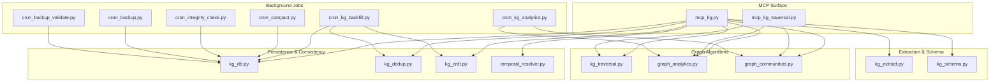
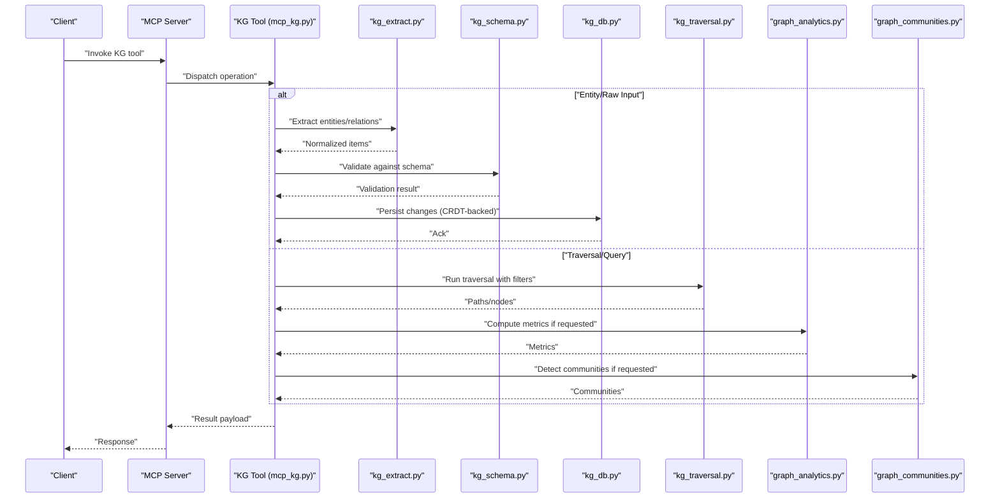
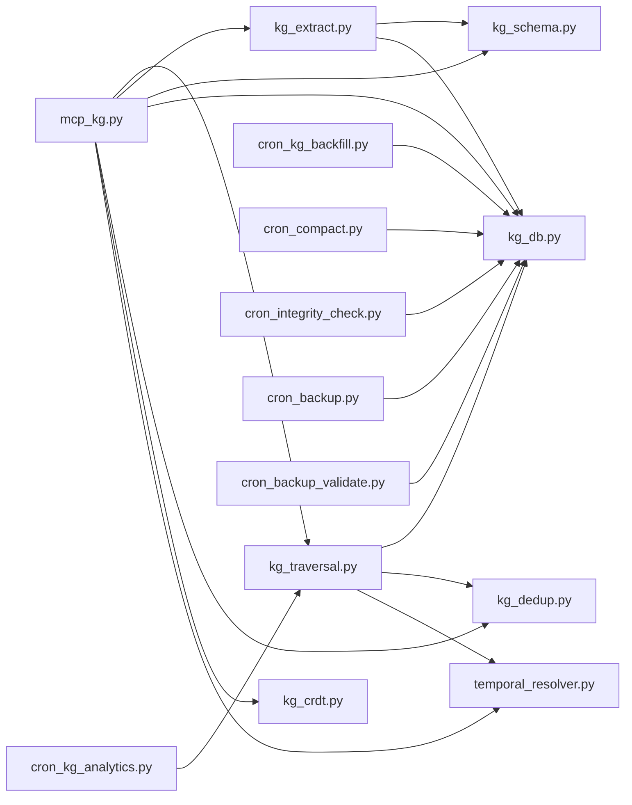
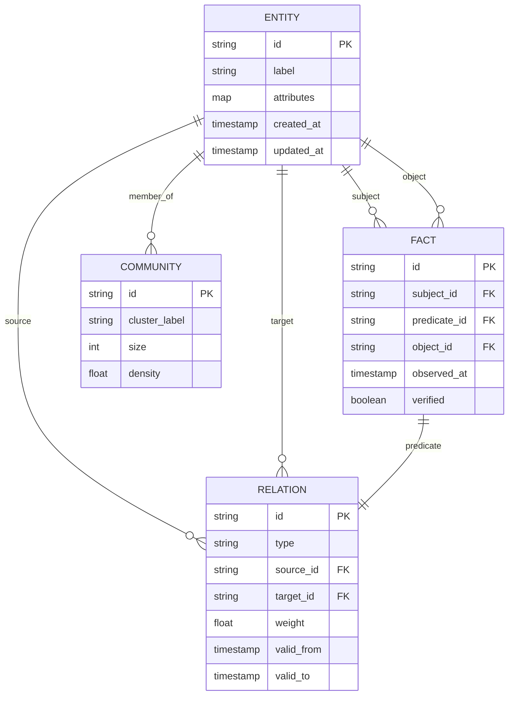

# Knowledge Graph Tools

<cite>
**Referenced Files in This Document**
- [mcp_kg.py](file://mcp_kg.py)
- [mcp_kg_traversal.py](file://mcp_kg_traversal.py)
- [kg_traversal.py](file://kg/kg_traversal.py)
- [graph_analytics.py](file://kg/graph_analytics.py)
- [graph_communities.py](file://kg/graph_communities.py)
- [kg_extract.py](file://knowledge_graph/kg_extract.py)
- [kg_schema.py](file://knowledge_graph/kg_schema.py)
- [kg_db.py](file://knowledge_graph/kg_db.py)
- [kg_dedup.py](file://kg/kg_dedup.py)
- [kg_crdt.py](file://kg/kg_crdt.py)
- [temporal_resolver.py](file://kg/temporal_resolver.py)
- [cron_kg_backfill.py](file://cron/cron_kg_backfill.py)
- [cron_kg_analytics.py](file://cron/cron_kg_analytics.py)
- [cron_compact.py](file://cron/cron_compact.py)
- [cron_integrity_check.py](file://cron/cron_integrity_check.py)
- [cron_backup.py](file://cron/cron_backup.py)
- [cron_backup_validate.py](file://cron/cron_backup_validate.py)
- [kg_backfills.py](file://backfill/kg_backfills.py)
- [orchestrator.py](file://backfill/orchestrator.py)
- [maintenance.py](file://agentic_memory/maintenance.py)
- [mcp_maintenance.py](file://mcp_maintenance.py)
- [mcp_maintenance_ops.py](file://mcp_maintenance_ops.py)
- [kg_search.py](file://knowledge_graph/kg_search.py)
- [kg_facts_fts.py](file://knowledge_graph/kg_facts_fts.py)
- [test_kg_traversal.py](file://tests/test_kg_traversal.py)
- [test_multi_hop_traversal.py](file://tests/test_multi_hop_traversal.py)
- [test_kg_validation.py](file://tests/test_kg_validation.py)
- [test_kg_orphan_recovery.py](file://tests/test_kg_orphan_recovery.py)
- [test_kg_dedup.py](file://tests/test_kg_dedup.py)
- [test_kg_dedup_semantic.py](file://tests/test_kg_dedup_semantic.py)
- [test_kg_entity_filter.py](file://tests/test_kg_entity_filter.py)
- [test_kg_self_editing_e2e.py](file://tests/test_kg_self_editing_e2e.py)
- [test_kg_analytics_off_save_path.py](file://tests/test_kg_analytics_off_save_path.py)
- [test_kg_crdt.py](file://tests/test_kg_crdt.py)
- [test_knowledge_graph.py](file://tests/test_knowledge_graph.py)
</cite>

## Table of Contents
1. [Introduction](#introduction)
2. [Project Structure](#project-structure)
3. [Core Components](#core-components)
4. [Architecture Overview](#architecture-overview)
5. [Detailed Component Analysis](#detailed-component-analysis)
6. [Dependency Analysis](#dependency-analysis)
7. [Performance Considerations](#performance-considerations)
8. [Troubleshooting Guide](#troubleshooting-guide)
9. [Conclusion](#conclusion)
10. [Appendices](#appendices)

## Introduction
This document provides comprehensive documentation for MCP tools that expose knowledge graph operations. It covers entity extraction, relationship management, and graph traversal capabilities. It also explains how to perform complex graph queries, analyze community structures, manage graph consistency, and maintain the graph at scale. Practical examples illustrate building graph-based applications, implementing recommendation systems, and performing knowledge discovery tasks. Finally, it addresses maintenance operations, backup/restore procedures, and performance optimization strategies for large graphs.

## Project Structure
The knowledge graph functionality is implemented across several modules:
- MCP tool surface exposing graph operations over the Model Context Protocol
- Core graph algorithms (traversal, analytics, communities)
- Extraction and schema utilities
- Persistence and CRDT-backed consistency
- Background jobs for backfill, analytics, compaction, integrity checks, and backups
- Tests validating behavior and edge cases

**Diagram sources**
- [mcp_kg.py](file://mcp_kg.py)
- [mcp_kg_traversal.py](file://mcp_kg_traversal.py)
- [kg_traversal.py](file://kg/kg_traversal.py)
- [graph_analytics.py](file://kg/graph_analytics.py)
- [graph_communities.py](file://kg/graph_communities.py)
- [kg_extract.py](file://knowledge_graph/kg_extract.py)
- [kg_schema.py](file://knowledge_graph/kg_schema.py)
- [kg_db.py](file://knowledge_graph/kg_db.py)
- [kg_dedup.py](file://kg/kg_dedup.py)
- [kg_crdt.py](file://kg/kg_crdt.py)
- [temporal_resolver.py](file://kg/temporal_resolver.py)
- [cron_kg_backfill.py](file://cron/cron_kg_backfill.py)
- [cron_kg_analytics.py](file://cron/cron_kg_analytics.py)
- [cron_compact.py](file://cron/cron_compact.py)
- [cron_integrity_check.py](file://cron/cron_integrity_check.py)
- [cron_backup.py](file://cron/cron_backup.py)
- [cron_backup_validate.py](file://cron/cron_backup_validate.py)

**Section sources**
- [mcp_kg.py](file://mcp_kg.py)
- [mcp_kg_traversal.py](file://mcp_kg_traversal.py)
- [kg_traversal.py](file://kg/kg_traversal.py)
- [graph_analytics.py](file://kg/graph_analytics.py)
- [graph_communities.py](file://kg/graph_communities.py)
- [kg_extract.py](file://knowledge_graph/kg_extract.py)
- [kg_schema.py](file://knowledge_graph/kg_schema.py)
- [kg_db.py](file://knowledge_graph/kg_db.py)
- [kg_dedup.py](file://kg/kg_dedup.py)
- [kg_crdt.py](file://kg/kg_crdt.py)
- [temporal_resolver.py](file://kg/temporal_resolver.py)
- [cron_kg_backfill.py](file://cron/cron_kg_backfill.py)
- [cron_kg_analytics.py](file://cron/cron_kg_analytics.py)
- [cron_compact.py](file://cron/cron_compact.py)
- [cron_integrity_check.py](file://cron/cron_integrity_check.py)
- [cron_backup.py](file://cron/cron_backup.py)
- [cron_backup_validate.py](file://cron/cron_backup_validate.py)

## Core Components
- MCP KG Tools: Expose high-level operations for entities, relationships, and queries via MCP. These tools orchestrate extraction, validation, persistence, and traversal.
- Traversal Engine: Provides breadth-first and depth-first traversals with filters, limits, and temporal constraints.
- Analytics and Communities: Computes centrality metrics, path statistics, and detects communities using clustering techniques.
- Extraction and Schema: Normalizes entities and relations, enforces schemas, and supports semantic deduplication.
- Persistence and Consistency: Uses a relational store with append-only CRDT semantics, deduplication, and temporal resolution to ensure strong consistency and conflict-free merges.
- Background Operations: Backfills indices, runs analytics, compacts data, validates integrity, and performs backups/validations.

Key responsibilities:
- Entity extraction from text or structured inputs
- Relationship creation, update, and deletion with idempotency
- Multi-hop traversal with filters and ranking
- Community detection and graph analytics
- Deduplication and canonicalization
- Temporal-aware queries and projections
- Maintenance and operational safety

**Section sources**
- [mcp_kg.py](file://mcp_kg.py)
- [mcp_kg_traversal.py](file://mcp_kg_traversal.py)
- [kg_traversal.py](file://kg/kg_traversal.py)
- [graph_analytics.py](file://kg/graph_analytics.py)
- [graph_communities.py](file://kg/graph_communities.py)
- [kg_extract.py](file://knowledge_graph/kg_extract.py)
- [kg_schema.py](file://knowledge_graph/kg_schema.py)
- [kg_db.py](file://knowledge_graph/kg_db.py)
- [kg_dedup.py](file://kg/kg_dedup.py)
- [kg_crdt.py](file://kg/kg_crdt.py)
- [temporal_resolver.py](file://kg/temporal_resolver.py)

## Architecture Overview
The MCP layer exposes tools that call into core graph services. The services coordinate extraction, validation, persistence, and traversal. Background jobs periodically maintain indexes, run analytics, and ensure integrity.

**Diagram sources**
- [mcp_kg.py](file://mcp_kg.py)
- [kg_extract.py](file://knowledge_graph/kg_extract.py)
- [kg_schema.py](file://knowledge_graph/kg_schema.py)
- [kg_db.py](file://knowledge_graph/kg_db.py)
- [kg_traversal.py](file://kg/kg_traversal.py)
- [graph_analytics.py](file://kg/graph_analytics.py)
- [graph_communities.py](file://kg/graph_communities.py)

## Detailed Component Analysis

### MCP KG Tools
Responsibilities:
- Provide MCP endpoints for creating/updating/deleting entities and relationships
- Support query primitives: find neighbors, multi-hop paths, filtered searches
- Integrate extraction and schema validation before writes
- Orchestrate analytics and community detection on demand

Operational characteristics:
- Idempotent mutations where applicable
- Temporal awareness for reads and projections
- Rate limiting and safety guards integrated at the MCP layer

**Section sources**
- [mcp_kg.py](file://mcp_kg.py)

### MCP KG Traversal Tools
Responsibilities:
- Expose traversal operations with configurable depth, direction, and filters
- Return ranked results based on relevance or recency
- Combine traversal with analytics outputs for richer insights

Usage patterns:
- Explore neighborhood around an entity
- Discover multi-hop connections between topics
- Filter by time windows or relation types

**Section sources**
- [mcp_kg_traversal.py](file://mcp_kg_traversal.py)
- [kg_traversal.py](file://kg/kg_traversal.py)

### Traversal Engine
Capabilities:
- Breadth-first and depth-first search
- Edge filtering by type, weight, and temporal validity
- Path scoring and pruning strategies
- Safe limits to prevent runaway traversals

Complexity considerations:
- BFS typically O(V + E) per traversal; apply filters early to reduce work
- Depth-limited traversal bounds memory usage

**Section sources**
- [kg_traversal.py](file://kg/kg_traversal.py)

### Analytics and Community Detection
Capabilities:
- Centrality measures (degree, betweenness, closeness)
- Path statistics and connectivity analysis
- Community detection via clustering heuristics
- Optional integration with full-text search for hybrid queries

Use cases:
- Identify influential nodes
- Detect clusters of related concepts
- Generate recommendations based on community membership

**Section sources**
- [graph_analytics.py](file://kg/graph_analytics.py)
- [graph_communities.py](file://kg/graph_communities.py)

### Extraction and Schema
Capabilities:
- Normalize entities and relations from raw input
- Enforce schema constraints and types
- Support custom entity types and relation labels
- Prepare data for deduplication and persistence

Best practices:
- Use canonical forms for entity names
- Validate relation triples before insertion
- Leverage schema hints to improve extraction quality

**Section sources**
- [kg_extract.py](file://knowledge_graph/kg_extract.py)
- [kg_schema.py](file://knowledge_graph/kg_schema.py)

### Persistence and Consistency
Capabilities:
- Relational storage with append-only CRDT semantics
- Deduplication and canonicalization
- Temporal resolution for facts and events
- Redirects and soft deletes for safe evolution

Consistency guarantees:
- Conflict-free merges across writers
- Append-only logs for auditability
- Transactional boundaries for batch operations

**Section sources**
- [kg_db.py](file://knowledge_graph/kg_db.py)
- [kg_dedup.py](file://kg/kg_dedup.py)
- [kg_crdt.py](file://kg/kg_crdt.py)
- [temporal_resolver.py](file://kg/temporal_resolver.py)

### Background Jobs
- Backfill: Rebuild indexes and compute derived structures
- Analytics: Periodically compute metrics and community assignments
- Compaction: Compact append-only logs and prune stale entries
- Integrity Checks: Validate referential integrity and schema compliance
- Backup/Restore: Snapshot and validate graph state

Operational notes:
- Run during low-traffic windows
- Monitor progress and failures
- Ensure idempotency for retries

**Section sources**
- [cron_kg_backfill.py](file://cron/cron_kg_backfill.py)
- [cron_kg_analytics.py](file://cron/cron_kg_analytics.py)
- [cron_compact.py](file://cron/cron_compact.py)
- [cron_integrity_check.py](file://cron/cron_integrity_check.py)
- [cron_backup.py](file://cron/cron_backup.py)
- [cron_backup_validate.py](file://cron/cron_backup_validate.py)
- [kg_backfills.py](file://backfill/kg_backfills.py)
- [orchestrator.py](file://backfill/orchestrator.py)

## Dependency Analysis
The MCP tools depend on core graph services, which in turn rely on persistence and consistency layers. Background jobs operate independently but read/write the same stores.

**Diagram sources**
- [mcp_kg.py](file://mcp_kg.py)
- [kg_traversal.py](file://kg/kg_traversal.py)
- [kg_extract.py](file://knowledge_graph/kg_extract.py)
- [kg_schema.py](file://knowledge_graph/kg_schema.py)
- [kg_db.py](file://knowledge_graph/kg_db.py)
- [kg_dedup.py](file://kg/kg_dedup.py)
- [kg_crdt.py](file://kg/kg_crdt.py)
- [temporal_resolver.py](file://kg/temporal_resolver.py)
- [cron_kg_backfill.py](file://cron/cron_kg_backfill.py)
- [cron_kg_analytics.py](file://cron/cron_kg_analytics.py)
- [cron_compact.py](file://cron/cron_compact.py)
- [cron_integrity_check.py](file://cron/cron_integrity_check.py)
- [cron_backup.py](file://cron/cron_backup.py)
- [cron_backup_validate.py](file://cron/cron_backup_validate.py)

**Section sources**
- [mcp_kg.py](file://mcp_kg.py)
- [kg_traversal.py](file://kg/kg_traversal.py)
- [kg_extract.py](file://knowledge_graph/kg_extract.py)
- [kg_schema.py](file://knowledge_graph/kg_schema.py)
- [kg_db.py](file://knowledge_graph/kg_db.py)
- [kg_dedup.py](file://kg/kg_dedup.py)
- [kg_crdt.py](file://kg/kg_crdt.py)
- [temporal_resolver.py](file://kg/temporal_resolver.py)
- [cron_kg_backfill.py](file://cron/cron_kg_backfill.py)
- [cron_kg_analytics.py](file://cron/cron_kg_analytics.py)
- [cron_compact.py](file://cron/cron_compact.py)
- [cron_integrity_check.py](file://cron/cron_integrity_check.py)
- [cron_backup.py](file://cron/cron_backup.py)
- [cron_backup_validate.py](file://cron/cron_backup_validate.py)

## Performance Considerations
- Indexing and Full-Text Search:
  - Maintain indexes for entities and relations to accelerate lookups
  - Use full-text search to complement graph queries for hybrid retrieval
- Query Optimization:
  - Apply filters early in traversal to reduce candidate sets
  - Limit depth and fan-out; use pagination for large neighborhoods
- Batch Operations:
  - Group writes to minimize transaction overhead
  - Prefer append-only updates backed by CRDTs for concurrency
- Analytics Scheduling:
  - Run heavy computations off-peak
  - Cache intermediate results and invalidate selectively
- Storage Hygiene:
  - Compact append-only logs regularly
  - Prune stale entries and redirects
- Monitoring:
  - Track latency percentiles and error rates
  - Alert on slow queries and failed background jobs

[No sources needed since this section provides general guidance]

## Troubleshooting Guide
Common issues and resolutions:
- Inconsistent references:
  - Run integrity checks to detect dangling edges
  - Repair orphaned nodes by linking to canonical entities
- Deduplication conflicts:
  - Review canonicalization rules and merge policies
  - Re-run deduplication backfills after schema changes
- Slow queries:
  - Inspect traversal filters and add targeted indexes
  - Reduce fan-out and depth; consider precomputing popular neighborhoods
- Backup/restore failures:
  - Validate snapshots before applying restores
  - Ensure consistent timestamps and tenant scoping

Operational utilities:
- Maintenance helpers for common graph repairs
- MCP wrappers for maintenance operations

**Section sources**
- [cron_integrity_check.py](file://cron/cron_integrity_check.py)
- [kg_backfills.py](file://backfill/kg_backfills.py)
- [orchestrator.py](file://backfill/orchestrator.py)
- [maintenance.py](file://agentic_memory/maintenance.py)
- [mcp_maintenance.py](file://mcp_maintenance.py)
- [mcp_maintenance_ops.py](file://mcp_maintenance_ops.py)

## Conclusion
The MCP knowledge graph tools provide a robust foundation for building intelligent applications. They combine reliable extraction, strong consistency, efficient traversal, and rich analytics. With scheduled maintenance and careful query design, they scale to large graphs while remaining accessible through simple MCP interfaces.

[No sources needed since this section summarizes without analyzing specific files]

## Appendices

### Examples and Use Cases
- Building graph-based applications:
  - Use MCP KG tools to create entities and relationships from user inputs
  - Traverse to assemble contextual summaries for agents
- Recommendation systems:
  - Compute community memberships and recommend related items within clusters
  - Rank candidates by centrality and proximity to user interests
- Knowledge discovery:
  - Perform multi-hop queries to uncover latent connections
  - Analyze community structure to identify emerging topics

[No sources needed since this section provides conceptual guidance]

### API Reference Highlights
- Entity and relationship CRUD via MCP tools
- Traversal endpoints with filters, limits, and temporal windows
- Analytics endpoints for centrality and community detection
- Maintenance endpoints for integrity checks, compaction, and backups

For detailed parameter definitions and response formats, consult the MCP tool implementations and tests.

**Section sources**
- [mcp_kg.py](file://mcp_kg.py)
- [mcp_kg_traversal.py](file://mcp_kg_traversal.py)
- [test_kg_traversal.py](file://tests/test_kg_traversal.py)
- [test_multi_hop_traversal.py](file://tests/test_multi_hop_traversal.py)
- [test_kg_validation.py](file://tests/test_kg_validation.py)
- [test_kg_orphan_recovery.py](file://tests/test_kg_orphan_recovery.py)
- [test_kg_dedup.py](file://tests/test_kg_dedup.py)
- [test_kg_dedup_semantic.py](file://tests/test_kg_dedup_semantic.py)
- [test_kg_entity_filter.py](file://tests/test_kg_entity_filter.py)
- [test_kg_self_editing_e2e.py](file://tests/test_kg_self_editing_e2e.py)
- [test_kg_analytics_off_save_path.py](file://tests/test_kg_analytics_off_save_path.py)
- [test_kg_crdt.py](file://tests/test_kg_crdt.py)
- [test_knowledge_graph.py](file://tests/test_knowledge_graph.py)

### Data Models and Relationships
Conceptual model overview:
- Entities: Canonicalized nodes with attributes and metadata
- Relations: Directed edges with types, weights, and temporal validity
- Facts: Time-stamped assertions linked to entities and relations
- Communities: Cluster assignments computed by analytics

[No sources needed since this diagram shows conceptual model, not actual code structure]

### Operational Procedures
- Backup:
  - Schedule periodic snapshots
  - Validate checksums and schema versions
- Restore:
  - Verify snapshot integrity
  - Apply restore in maintenance mode
  - Rebuild indexes post-restore
- Compaction:
  - Compact append-only logs
  - Purge expired entries
- Integrity:
  - Run reference checks
  - Fix orphans and duplicates

**Section sources**
- [cron_backup.py](file://cron/cron_backup.py)
- [cron_backup_validate.py](file://cron/cron_backup_validate.py)
- [cron_compact.py](file://cron/cron_compact.py)
- [cron_integrity_check.py](file://cron/cron_integrity_check.py)