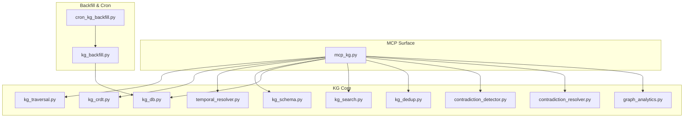
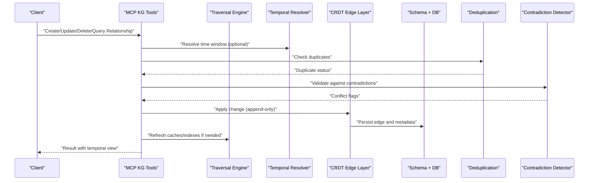
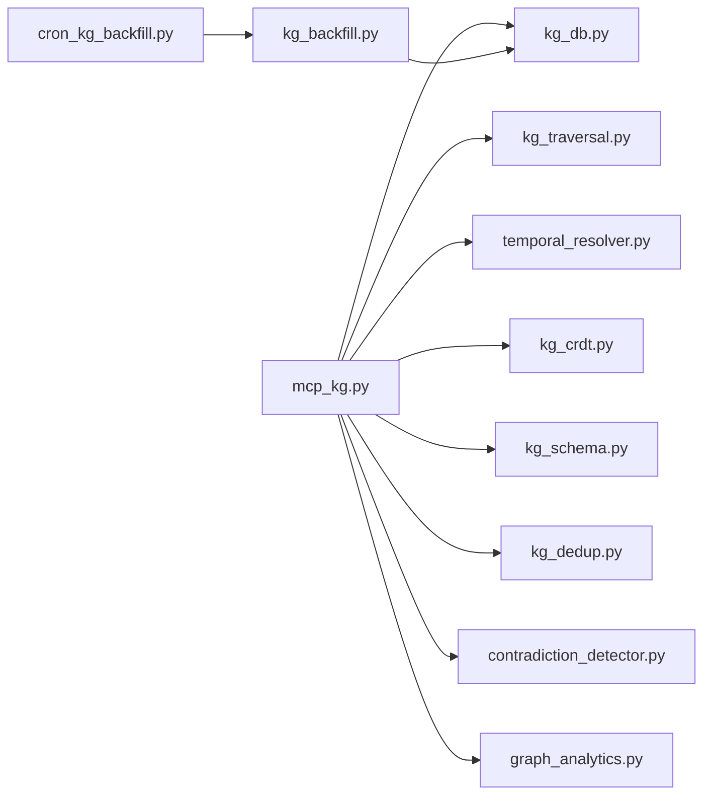

# Relationship Management

<cite>
**Referenced Files in This Document**
- [mcp_kg.py](file://mcp_kg.py)
- [kg_traversal.py](file://kg/kg_traversal.py)
- [kg_crdt.py](file://kg/kg_crdt.py)
- [temporal_resolver.py](file://temporal_resolver.py)
- [kg_schema.py](file://knowledge_graph/kg_schema.py)
- [kg_db.py](file://knowledge_graph/kg_db.py)
- [kg_search.py](file://knowledge_graph/kg_search.py)
- [kg_dedup.py](file://kg/kg_dedup.py)
- [contradiction_detector.py](file://kg/contradiction_detector.py)
- [contradiction_resolver.py](file://kg/contradiction_resolver.py)
- [graph_analytics.py](file://kg/graph_analytics.py)
- [kg_backfill.py](file://backfill/kg_backfills.py)
- [cron_kg_backfill.py](file://cron/cron_kg_backfill.py)
- [test_kg_validation.py](file://test/test_kg_validation.py)
- [test_kg_traversal.py](file://test/test_kg_traversal.py)
- [test_knowledge_graph.py](file://test/test_knowledge_graph.py)
</cite>

## Table of Contents
1. [Introduction](#introduction)
2. [Project Structure](#project-structure)
3. [Core Components](#core-components)
4. [Architecture Overview](#architecture-overview)
5. [Detailed Component Analysis](#detailed-component-analysis)
6. [Dependency Analysis](#dependency-analysis)
7. [Performance Considerations](#performance-considerations)
8. [Troubleshooting Guide](#troubleshooting-guide)
9. [Conclusion](#conclusion)
10. [Appendices](#appendices)

## Introduction
This document explains how MCP tools manage relationships between entities in the knowledge graph. It covers relationship creation, querying, and modification; relationship types and bidirectional semantics; temporal validity; validation and conflict resolution; and optimization techniques for relationship-heavy graphs. The goal is to help users build complex relationship networks, perform analysis, and maintain consistency at scale.

## Project Structure
The relationship management surface is exposed via MCP tools that wrap core KG services. The primary entry points are:
- MCP tool definitions for KG operations
- KG traversal utilities for pathfinding and neighborhood queries
- Temporal resolution for time-bounded relationship views
- Schema and persistence layers for storage and indexing
- Deduplication, contradiction detection, and analytics for maintenance and optimization

**Diagram sources**
- [mcp_kg.py](file://mcp_kg.py)
- [kg_traversal.py](file://kg/kg_traversal.py)
- [kg_crdt.py](file://kg/kg_crdt.py)
- [temporal_resolver.py](file://temporal_resolver.py)
- [kg_schema.py](file://knowledge_graph/kg_schema.py)
- [kg_db.py](file://knowledge_graph/kg_db.py)
- [kg_search.py](file://knowledge_graph/kg_search.py)
- [kg_dedup.py](file://kg/kg_dedup.py)
- [contradiction_detector.py](file://kg/contradiction_detector.py)
- [contradiction_resolver.py](file://kg/contradiction_resolver.py)
- [graph_analytics.py](file://kg/graph_analytics.py)
- [kg_backfill.py](file://backfill/kg_backfills.py)
- [cron_kg_backfill.py](file://cron/cron_kg_backfill.py)

**Section sources**
- [mcp_kg.py](file://mcp_kg.py)
- [kg_traversal.py](file://kg/kg_traversal.py)
- [kg_crdt.py](file://kg/kg_crdt.py)
- [temporal_resolver.py](file://temporal_resolver.py)
- [kg_schema.py](file://knowledge_graph/kg_schema.py)
- [kg_db.py](file://knowledge_graph/kg_db.py)
- [kg_search.py](file://knowledge_graph/kg_search.py)
- [kg_dedup.py](file://kg/kg_dedup.py)
- [contradiction_detector.py](file://kg/contradiction_detector.py)
- [contradiction_resolver.py](file://kg/contradiction_resolver.py)
- [graph_analytics.py](file://kg/graph_analytics.py)
- [kg_backfill.py](file://backfill/kg_backfills.py)
- [cron_kg_backfill.py](file://cron/cron_kg_backfill.py)

## Core Components
- MCP KG Tools: Provide APIs for creating, updating, deleting, and querying relationships; expose parameters for directionality, type, and temporal windows.
- Traversal Engine: Implements breadth-first and depth-limited traversals, neighbor discovery, and multi-hop path enumeration with filters by relation type and time.
- Temporal Resolver: Applies as-of-time semantics to relationship edges, enabling time-bounded queries and historical snapshots.
- CRDT-backed Edges: Ensures concurrent writes to relationships are conflict-free and convergent across processes.
- Schema and Storage: Defines edge schemas, indexes, and constraints; persists edges and metadata efficiently.
- Deduplication and Contradictions: Detects duplicate or conflicting relationships and supports resolution workflows.
- Analytics: Computes centrality, community structure, and other metrics to guide optimization and understanding.

**Section sources**
- [mcp_kg.py](file://mcp_kg.py)
- [kg_traversal.py](file://kg/kg_traversal.py)
- [temporal_resolver.py](file://temporal_resolver.py)
- [kg_crdt.py](file://kg/kg_crdt.py)
- [kg_schema.py](file://knowledge_graph/kg_schema.py)
- [kg_db.py](file://knowledge_graph/kg_db.py)
- [kg_dedup.py](file://kg/kg_dedup.py)
- [contradiction_detector.py](file://kg/contradiction_detector.py)
- [contradiction_resolver.py](file://kg/contradiction_resolver.py)
- [graph_analytics.py](file://kg/graph_analytics.py)

## Architecture Overview
The MCP layer exposes high-level operations that delegate to specialized subsystems. Writes flow through CRDT-aware paths to ensure convergence; reads can be filtered by time and type. Backfill jobs rebuild indices and repair inconsistencies.

**Diagram sources**
- [mcp_kg.py](file://mcp_kg.py)
- [kg_traversal.py](file://kg/kg_traversal.py)
- [temporal_resolver.py](file://temporal_resolver.py)
- [kg_crdt.py](file://kg/kg_crdt.py)
- [kg_schema.py](file://knowledge_graph/kg_schema.py)
- [kg_db.py](file://knowledge_graph/kg_db.py)
- [kg_dedup.py](file://kg/kg_dedup.py)
- [contradiction_detector.py](file://kg/contradiction_detector.py)

## Detailed Component Analysis

### MCP KG Tools
Responsibilities:
- Expose endpoints for relationship CRUD and query operations
- Accept parameters for source/target entity IDs, relation type, directionality, and temporal windows
- Orchestrate validation, deduplication, contradiction checks, and persistence
- Return results consistent with temporal semantics and schema constraints

Key behaviors:
- Directional vs bidirectional semantics: Some relations are inherently directional; others may be mirrored automatically based on schema rules
- Temporal validity: Edges can be valid within a time interval; queries default to current time unless an as-of timestamp is provided
- Idempotency: Create/update operations are designed to be idempotent where possible

Operational patterns:
- Create: Validate inputs, check duplicates, detect contradictions, append CRDT change, persist
- Update: Compute delta, apply CRDT merge, persist, update indexes
- Delete: Mark as expired or remove with CRDT tombstone semantics
- Query: Resolve temporal window, traverse edges, filter by type/direction, return structured results

**Section sources**
- [mcp_kg.py](file://mcp_kg.py)

### Traversal Engine
Capabilities:
- Breadth-first search up to configurable depth
- Multi-hop path enumeration with filters by relation type and time
- Neighbor discovery for both outgoing and incoming edges
- Path scoring and ranking options

Complexity considerations:
- Depth-limited BFS is O(V+E) per query with pruning
- Multi-hop enumeration can grow combinatorially; use limits and filters

Optimizations:
- Precomputed adjacency lists for hot nodes
- Indexing by relation type and temporal ranges
- Cached neighborhoods for frequently accessed entities

**Section sources**
- [kg_traversal.py](file://kg/kg_traversal.py)

### Temporal Resolver
Purpose:
- Apply as-of-time semantics to edges and nodes
- Support time-bounded queries and historical snapshots
- Manage validity intervals and expiration

Behavior:
- Edges carry start/end timestamps; queries filter by effective time
- Backfill and cron jobs can recompute temporal priors and snapshots

**Section sources**
- [temporal_resolver.py](file://temporal_resolver.py)

### CRDT-backed Edges
Design:
- Append-only changes with content-keyed identifiers
- Conflict-free merges across concurrent writers
- Tombstones for deletions/expirations

Benefits:
- Strong convergence guarantees under concurrent updates
- Simplified replication and distributed writes

**Section sources**
- [kg_crdt.py](file://kg/kg_crdt.py)

### Schema and Storage
Elements:
- Edge schema with fields for type, direction, temporal bounds, and metadata
- Indexes for fast lookups by source, target, type, and time range
- Constraints to enforce referential integrity and uniqueness where appropriate

Storage interactions:
- Efficient bulk inserts for backfill
- Transactional updates for critical mutations
- Read-optimized projections for traversal

**Section sources**
- [kg_schema.py](file://knowledge_graph/kg_schema.py)
- [kg_db.py](file://knowledge_graph/kg_db.py)

### Deduplication and Contradictions
Deduplication:
- Detects near-duplicate edges based on type, endpoints, and semantic similarity
- Supports merging or suppression policies

Contradiction Detection:
- Identifies mutually exclusive relationships or inconsistent assertions
- Provides signals for resolution workflows

Resolution:
- Manual review queues
- Automated policies for precedence and confidence-based selection

**Section sources**
- [kg_dedup.py](file://kg/kg_dedup.py)
- [contradiction_detector.py](file://kg/contradiction_detector.py)
- [contradiction_resolver.py](file://kg/contradiction_resolver.py)

### Graph Analytics
Metrics:
- Degree distribution, centrality measures, clustering coefficients
- Community detection and bridge edges
- Temporal activity trends

Use cases:
- Identify hub entities and fragile connections
- Guide pruning and retention strategies
- Inform caching and indexing priorities

**Section sources**
- [graph_analytics.py](file://kg/graph_analytics.py)

### Backfill and Maintenance
Functions:
- Rebuild indexes and adjacency structures
- Repair orphaned edges and missing references
- Recompute temporal priors and snapshots

Scheduling:
- Cron-driven jobs for periodic maintenance
- Monitoring and alerting for long-running tasks

**Section sources**
- [kg_backfill.py](file://backfill/kg_backfills.py)
- [cron_kg_backfill.py](file://cron/cron_kg_backfill.py)

## Dependency Analysis
Relationship management depends on multiple subsystems. The following diagram shows key dependencies among modules involved in relationship operations.

**Diagram sources**
- [mcp_kg.py](file://mcp_kg.py)
- [kg_traversal.py](file://kg/kg_traversal.py)
- [temporal_resolver.py](file://temporal_resolver.py)
- [kg_crdt.py](file://kg/kg_crdt.py)
- [kg_schema.py](file://knowledge_graph/kg_schema.py)
- [kg_db.py](file://knowledge_graph/kg_db.py)
- [kg_dedup.py](file://kg/kg_dedup.py)
- [contradiction_detector.py](file://kg/contradiction_detector.py)
- [graph_analytics.py](file://kg/graph_analytics.py)
- [kg_backfill.py](file://backfill/kg_backfills.py)
- [cron_kg_backfill.py](file://cron/cron_kg_backfill.py)

**Section sources**
- [mcp_kg.py](file://mcp_kg.py)
- [kg_traversal.py](file://kg/kg_traversal.py)
- [temporal_resolver.py](file://temporal_resolver.py)
- [kg_crdt.py](file://kg/kg_crdt.py)
- [kg_schema.py](file://knowledge_graph/kg_schema.py)
- [kg_db.py](file://knowledge_graph/kg_db.py)
- [kg_dedup.py](file://kg/kg_dedup.py)
- [contradiction_detector.py](file://kg/contradiction_detector.py)
- [graph_analytics.py](file://kg/graph_analytics.py)
- [kg_backfill.py](file://backfill/kg_backfills.py)
- [cron_kg_backfill.py](file://cron/cron_kg_backfill.py)

## Performance Considerations
- Use depth limits and type filters in traversal queries to avoid exponential blow-up
- Prefer indexed lookups by source/target/type/time ranges for frequent queries
- Cache hot neighborhoods and frequently accessed paths
- Batch write operations and leverage CRDT append semantics to reduce contention
- Schedule backfill and index rebuilds during low-traffic periods
- Monitor degree distributions and prune stale edges using analytics

[No sources needed since this section provides general guidance]

## Troubleshooting Guide
Common issues and resolutions:
- Duplicate relationships: Enable deduplication checks and merge or suppress according to policy
- Contradictory edges: Review contradiction detector outputs and apply resolver policies
- Temporal inconsistencies: Recompute temporal priors and validate validity intervals
- Slow queries: Add indexes for common filters, limit traversal depth, and cache results
- Stale data: Run backfill jobs to rebuild indexes and repair references

Validation and tests:
- Relationship validation tests cover schema constraints and temporal boundaries
- Traversal tests verify path correctness and performance characteristics
- End-to-end KG tests exercise create/query/update/delete flows

**Section sources**
- [test_kg_validation.py](file://test/test_kg_validation.py)
- [test_kg_traversal.py](file://test/test_kg_traversal.py)
- [test_knowledge_graph.py](file://test/test_knowledge_graph.py)

## Conclusion
MCP tools provide a robust interface for managing relationships in the knowledge graph. By combining CRDT-backed persistence, temporal resolution, deduplication, contradiction handling, and analytics, the system supports complex network construction, analysis, and maintenance. Following the recommended practices ensures scalability, consistency, and reliability even in relationship-heavy environments.

[No sources needed since this section summarizes without analyzing specific files]

## Appendices

### Example Workflows

#### Building Complex Relationship Networks
- Start with seed entities and define canonical relation types
- Create edges incrementally, leveraging deduplication and contradiction checks
- Use traversal to discover neighbors and expand the network iteratively
- Periodically run analytics to identify hubs and weak links

#### Performing Relationship Analysis
- Compute centrality and community structure to understand topology
- Filter by temporal windows to analyze evolution over time
- Use backlinks and reverse edges to trace influence and dependency chains

#### Maintaining Graph Consistency
- Regularly run backfill to rebuild indexes and repair orphans
- Monitor contradiction reports and resolve conflicts
- Prune expired edges and consolidate redundant relations

[No sources needed since this section provides conceptual guidance]