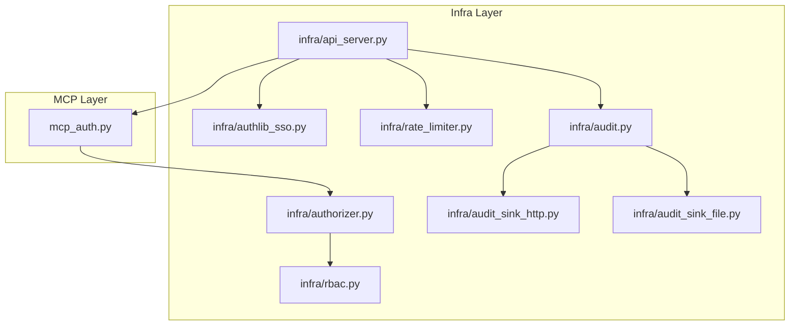
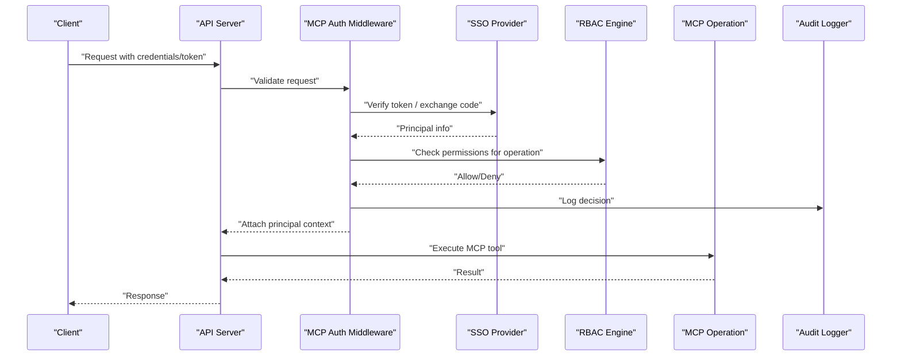
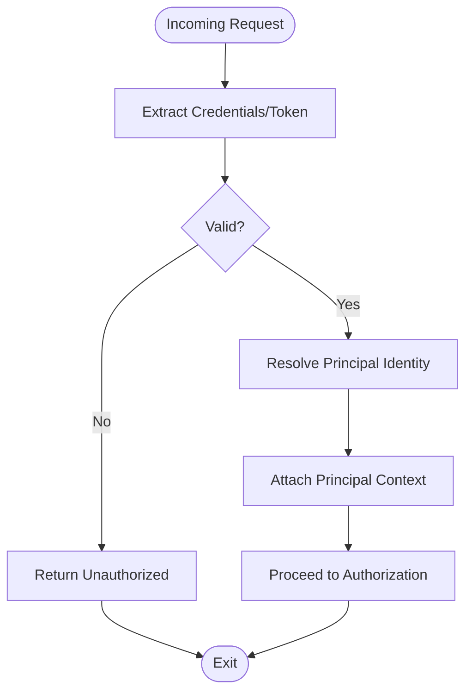
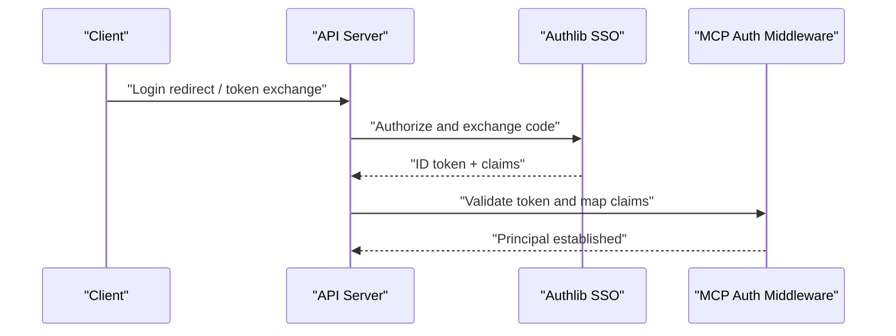
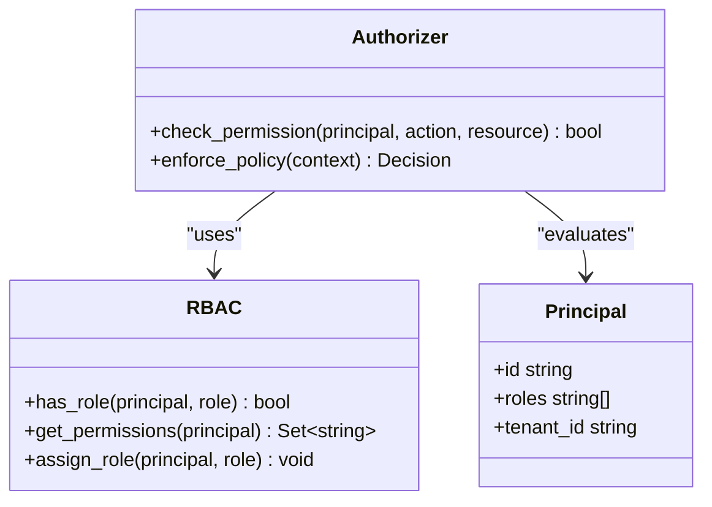
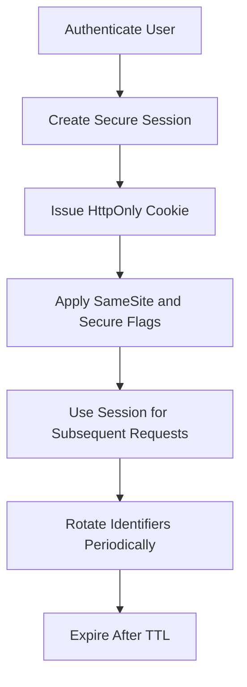
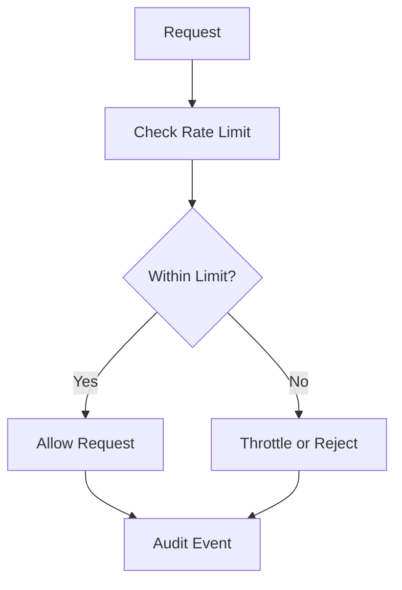
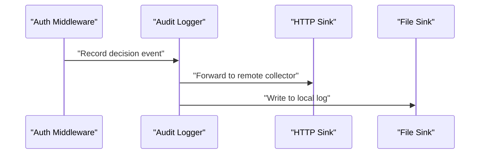
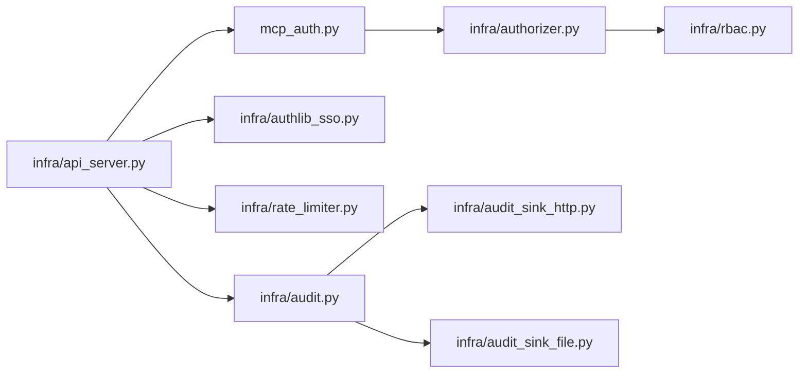

# Authentication and Authorization

<cite>
**Referenced Files in This Document**
- [mcp_auth.py](file://mcp_auth.py)
- [authorizer.py](file://infra/authorizer.py)
- [rbac.py](file://infra/rbac.py)
- [authlib_sso.py](file://infra/authlib_sso.py)
- [api_server.py](file://infra/api_server.py)
- [rate_limiter.py](file://infra/rate_limiter.py)
- [audit.py](file://infra/audit.py)
- [audit_sink_http.py](file://infra/audit_sink_http.py)
- [audit_sink_file.py](file://infra/audit_sink_file.py)
- [test_api_auth_cookie.py](file://tests/test_api_auth_cookie.py)
- [test_rbac_allows_with_role.py](file://tests/test_rbac_allows_with_role.py)
- [test_rbac_denies_without_role.py](file://tests/test_rbac_denies_without_role.py)
- [test_rbac_admin_authz.py](file://tests/test_rbac_admin_authz.py)
- [test_rate_limit_mcp.py](file://tests/test_rate_limit_mcp.py)
- [test_audit_logging.py](file://tests/test_audit_logging.py)
- [test_closed_auth_client.py](file://tests/test_closed_auth_client.py)
- [test_security_sync_auth.py](file://tests/test_security_sync_auth.py)
- [env_vars.md](file://docs/env_vars.md)
- [security_model.md](file://docs/concepts/security-model.md)
</cite>

## Table of Contents
1. [Introduction](#introduction)
2. [Project Structure](#project-structure)
3. [Core Components](#core-components)
4. [Architecture Overview](#architecture-overview)
5. [Detailed Component Analysis](#detailed-component-analysis)
6. [Dependency Analysis](#dependency-analysis)
7. [Performance Considerations](#performance-considerations)
8. [Troubleshooting Guide](#troubleshooting-guide)
9. [Conclusion](#conclusion)
10. [Appendices](#appendices)

## Introduction
This document explains the authentication and authorization mechanisms for MCP operations, including:
- Authentication flow and token validation
- Session security and principal identity propagation
- Role-based access control (RBAC), permission checks, and policy enforcement
- Configuring authentication providers and custom auth handlers
- Managing user sessions and principals
- Security best practices: input validation, rate limiting, and audit logging

The goal is to help operators and developers understand how MCP enforces secure access and how to extend or customize it safely.

## Project Structure
Authentication and authorization are implemented across a small set of focused modules:
- MCP-level authentication entrypoint and middleware
- Centralized authorization and RBAC engine
- SSO integration via Authlib
- API server wiring for HTTP auth and session handling
- Rate limiting and audit logging subsystems
- Tests validating behavior and edge cases

**Diagram sources**
- [mcp_auth.py](file://mcp_auth.py)
- [authorizer.py](file://infra/authorizer.py)
- [rbac.py](file://infra/rbac.py)
- [api_server.py](file://infra/api_server.py)
- [authlib_sso.py](file://infra/authlib_sso.py)
- [rate_limiter.py](file://infra/rate_limiter.py)
- [audit.py](file://infra/audit.py)
- [audit_sink_http.py](file://infra/audit_sink_http.py)
- [audit_sink_file.py](file://infra/audit_sink_file.py)

**Section sources**
- [mcp_auth.py](file://mcp_auth.py)
- [authorizer.py](file://infra/authorizer.py)
- [rbac.py](file://infra/rbac.py)
- [api_server.py](file://infra/api_server.py)
- [authlib_sso.py](file://infra/authlib_sso.py)
- [rate_limiter.py](file://infra/rate_limiter.py)
- [audit.py](file://infra/audit.py)
- [audit_sink_http.py](file://infra/audit_sink_http.py)
- [audit_sink_file.py](file://infra/audit_sink_file.py)

## Core Components
- MCP Authentication Middleware: Validates incoming requests, extracts identities, and attaches them to the request context for downstream tools.
- Authorization Engine: Centralized policy evaluation that uses RBAC to decide allow/deny based on roles, permissions, and resource scope.
- RBAC Module: Defines roles, permissions, and assignment rules; provides helpers to check if a principal has required permissions.
- SSO Integration: Authlib-based provider configuration and token exchange/validation for external identity providers.
- API Server Wiring: Binds HTTP endpoints to auth flows, manages cookies/sessions, and integrates rate limiting and audit logging.
- Rate Limiter: Enforces per-client or per-principal limits to mitigate abuse.
- Audit Logging: Records authenticated actions with principal, tenant, and operation details to sinks such as HTTP or file.

**Section sources**
- [mcp_auth.py](file://mcp_auth.py)
- [authorizer.py](file://infra/authorizer.py)
- [rbac.py](file://infra/rbac.py)
- [authlib_sso.py](file://infra/authlib_sso.py)
- [api_server.py](file://infra/api_server.py)
- [rate_limiter.py](file://infra/rate_limiter.py)
- [audit.py](file://infra/audit.py)
- [audit_sink_http.py](file://infra/audit_sink_http.py)
- [audit_sink_file.py](file://infra/audit_sink_file.py)

## Architecture Overview
The MCP authentication and authorization architecture follows a layered approach:
- HTTP/API layer handles transport, TLS, and session cookies.
- MCP auth middleware validates tokens and establishes a principal context.
- Authorization evaluates RBAC policies before executing MCP operations.
- Rate limiting protects endpoints from abuse.
- Audit logs capture decisions and outcomes for compliance and forensics.

**Diagram sources**
- [api_server.py](file://infra/api_server.py)
- [mcp_auth.py](file://mcp_auth.py)
- [authlib_sso.py](file://infra/authlib_sso.py)
- [rbac.py](file://infra/rbac.py)
- [audit.py](file://infra/audit.py)

## Detailed Component Analysis

### MCP Authentication Flow
- Request reception: The API server receives an HTTP request carrying credentials or tokens.
- Token validation: The MCP auth middleware validates tokens (e.g., JWT or opaque tokens) and resolves a principal identity.
- Principal context: The resolved principal (including tenant and roles) is attached to the request context for downstream use.
- Session handling: For cookie-based flows, the server maintains secure sessions and rotates identifiers where applicable.

**Diagram sources**
- [mcp_auth.py](file://mcp_auth.py)
- [api_server.py](file://infra/api_server.py)

**Section sources**
- [mcp_auth.py](file://mcp_auth.py)
- [api_server.py](file://infra/api_server.py)

### Token Validation and SSO Integration
- External identity providers: SSO integration supports standard flows (e.g., authorization code) using Authlib.
- Token verification: Tokens are validated against provider metadata and signatures.
- Principal mapping: Claims are mapped to internal principal attributes (e.g., id, email, roles).
- Error handling: Invalid or expired tokens result in immediate denial and audit logging.

**Diagram sources**
- [authlib_sso.py](file://infra/authlib_sso.py)
- [mcp_auth.py](file://mcp_auth.py)
- [api_server.py](file://infra/api_server.py)

**Section sources**
- [authlib_sso.py](file://infra/authlib_sso.py)
- [mcp_auth.py](file://mcp_auth.py)
- [api_server.py](file://infra/api_server.py)

### Authorization and RBAC
- Policy evaluation: The authorization engine consults RBAC to determine whether a principal can perform an operation on a resource.
- Roles and permissions: Roles encapsulate sets of permissions; assignments link principals to roles within tenants.
- Scope enforcement: Tenant scoping ensures cross-tenant isolation during authorization checks.
- Fail-closed defaults: If policy cannot be evaluated, the system denies by default.

**Diagram sources**
- [authorizer.py](file://infra/authorizer.py)
- [rbac.py](file://infra/rbac.py)

**Section sources**
- [authorizer.py](file://infra/authorizer.py)
- [rbac.py](file://infra/rbac.py)

### Session Security
- Secure cookies: Sessions are managed via secure, http-only cookies with appropriate flags.
- Rotation and expiry: Tokens and session identifiers rotate and expire to limit exposure.
- Cross-site protections: CSRF mitigations and strict SameSite settings are applied at the API server layer.
- Isolation: Tenants are isolated throughout the session lifecycle.

**Diagram sources**
- [api_server.py](file://infra/api_server.py)
- [mcp_auth.py](file://mcp_auth.py)

**Section sources**
- [api_server.py](file://infra/api_server.py)
- [mcp_auth.py](file://mcp_auth.py)

### Configuring Authentication Providers
- SSO configuration: Define provider metadata, client IDs, and secrets through environment variables or config files.
- Token validation settings: Configure algorithms, issuers, and audience expectations.
- Fallback modes: Support multiple providers and graceful degradation when upstream services are unavailable.

For concrete variable names and examples, refer to the environment documentation.

**Section sources**
- [env_vars.md](file://docs/env_vars.md)
- [authlib_sso.py](file://infra/authlib_sso.py)

### Implementing Custom Auth Handlers
- Hook points: Extend MCP auth middleware to add custom token introspection or claim enrichment.
- Principal enrichment: Inject additional attributes into the principal context for fine-grained policy decisions.
- Testing: Validate custom handlers with targeted tests to ensure fail-closed behavior and proper audit trails.

**Section sources**
- [mcp_auth.py](file://mcp_auth.py)
- [test_closed_auth_client.py](file://tests/test_closed_auth_client.py)

### Managing User Sessions
- Lifecycle: Creation upon successful authentication, renewal on activity, and termination on logout or timeout.
- Visibility: Session state is not exposed to clients beyond secure cookies; server-side storage tracks active sessions.
- Multi-tenant: Sessions include tenant context to enforce data isolation.

**Section sources**
- [api_server.py](file://infra/api_server.py)
- [mcp_auth.py](file://mcp_auth.py)

### Input Validation and Sanitization
- Request validation: Inputs are validated early in the pipeline to prevent malformed or malicious payloads.
- Type and schema checks: Strict schemas reduce injection risks and improve error clarity.
- Safe defaults: When validation fails, operations are denied and logged.

**Section sources**
- [api_server.py](file://infra/api_server.py)
- [mcp_auth.py](file://mcp_auth.py)

### Rate Limiting
- Strategy: Per-client or per-principal limits protect endpoints from abuse and DoS.
- Enforcement: Requests exceeding thresholds receive throttled responses.
- Observability: Rate limit events are audited for detection and alerting.

**Diagram sources**
- [rate_limiter.py](file://infra/rate_limiter.py)
- [audit.py](file://infra/audit.py)

**Section sources**
- [rate_limiter.py](file://infra/rate_limiter.py)
- [test_rate_limit_mcp.py](file://tests/test_rate_limit_mcp.py)

### Audit Logging
- Events: Authentication decisions, authorization results, and sensitive operations are recorded.
- Redaction: Sensitive fields (e.g., tokens) are redacted before persistence.
- Backends: Multiple sinks support file and HTTP delivery for centralized collection.

**Diagram sources**
- [audit.py](file://infra/audit.py)
- [audit_sink_http.py](file://infra/audit_sink_http.py)
- [audit_sink_file.py](file://infra/audit_sink_file.py)

**Section sources**
- [audit.py](file://infra/audit.py)
- [audit_sink_http.py](file://infra/audit_sink_http.py)
- [audit_sink_file.py](file://infra/audit_sink_file.py)
- [test_audit_logging.py](file://tests/test_audit_logging.py)

## Dependency Analysis
The following diagram shows key dependencies among authentication and authorization components:

**Diagram sources**
- [api_server.py](file://infra/api_server.py)
- [mcp_auth.py](file://mcp_auth.py)
- [authorizer.py](file://infra/authorizer.py)
- [rbac.py](file://infra/rbac.py)
- [authlib_sso.py](file://infra/authlib_sso.py)
- [rate_limiter.py](file://infra/rate_limiter.py)
- [audit.py](file://infra/audit.py)
- [audit_sink_http.py](file://infra/audit_sink_http.py)
- [audit_sink_file.py](file://infra/audit_sink_file.py)

**Section sources**
- [api_server.py](file://infra/api_server.py)
- [mcp_auth.py](file://mcp_auth.py)
- [authorizer.py](file://infra/authorizer.py)
- [rbac.py](file://infra/rbac.py)
- [authlib_sso.py](file://infra/authlib_sso.py)
- [rate_limiter.py](file://infra/rate_limiter.py)
- [audit.py](file://infra/audit.py)
- [audit_sink_http.py](file://infra/audit_sink_http.py)
- [audit_sink_file.py](file://infra/audit_sink_file.py)

## Performance Considerations
- Minimize token validation overhead by caching provider metadata and verifying only necessary claims.
- Keep RBAC lookups efficient with indexed role assignments and cached permission sets where safe.
- Apply rate limiting close to the request boundary to reject abusive traffic early.
- Stream audit events asynchronously to avoid blocking critical paths.

[No sources needed since this section provides general guidance]

## Troubleshooting Guide
Common issues and diagnostics:
- Authentication failures: Verify token format, issuer, and signature; check SSO configuration and network connectivity.
- Authorization denials: Inspect RBAC assignments and tenant scoping; confirm role-permission mappings.
- Rate limiting errors: Review thresholds and client identification strategies; adjust limits if legitimate traffic is impacted.
- Audit gaps: Ensure sinks are reachable and configured; verify redaction policies do not remove essential context.

Relevant test suites provide behavioral coverage and examples:
- Cookie-based auth behavior
- RBAC allow/deny scenarios and admin authorizations
- Rate limiting for MCP endpoints
- Audit logging correctness and sink behavior
- Closed-auth client behavior under misconfiguration
- Sync security and auth integration

**Section sources**
- [test_api_auth_cookie.py](file://tests/test_api_auth_cookie.py)
- [test_rbac_allows_with_role.py](file://tests/test_rbac_allows_with_role.py)
- [test_rbac_denies_without_role.py](file://tests/test_rbac_denies_without_role.py)
- [test_rbac_admin_authz.py](file://tests/test_rbac_admin_authz.py)
- [test_rate_limit_mcp.py](file://tests/test_rate_limit_mcp.py)
- [test_audit_logging.py](file://tests/test_audit_logging.py)
- [test_closed_auth_client.py](file://tests/test_closed_auth_client.py)
- [test_security_sync_auth.py](file://tests/test_security_sync_auth.py)

## Conclusion
MCP’s authentication and authorization stack combines robust token validation, secure session management, and strict RBAC enforcement. With configurable SSO providers, extensible auth middleware, and comprehensive audit logging, the system supports secure multi-tenant operations while remaining adaptable to organizational policies. Operators should configure providers carefully, validate inputs, apply rate limits, and monitor audit logs to maintain a strong security posture.

[No sources needed since this section summarizes without analyzing specific files]

## Appendices

### Security Model Reference
For conceptual background and design principles, see the security model documentation.

**Section sources**
- [security_model.md](file://docs/concepts/security-model.md)