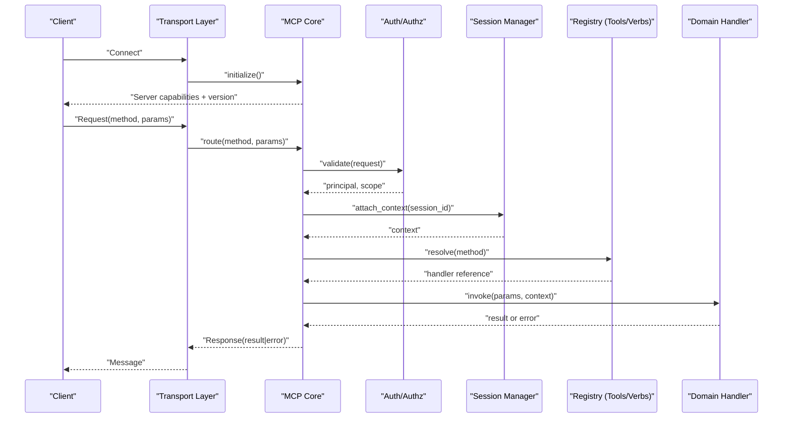
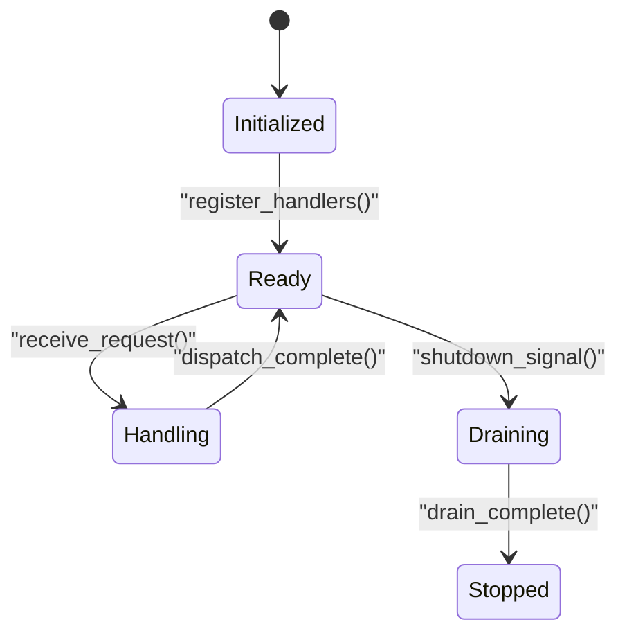
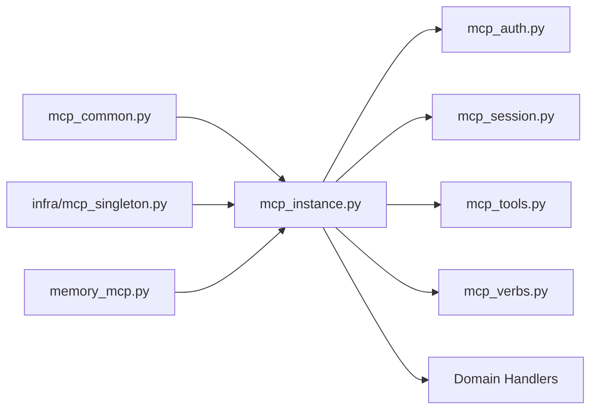

# Core Protocol Mechanics

<cite>
**Referenced Files in This Document**
- [mcp_common.py](file://mcp_common.py)
- [mcp_instance.py](file://mcp_instance.py)
- [mcp_auth.py](file://mcp_auth.py)
- [mcp_session.py](file://mcp_session.py)
- [mcp_tools.py](file://mcp_tools.py)
- [mcp_memory.py](file://mcp_memory.py)
- [mcp_kg.py](file://mcp_kg.py)
- [mcp_search.py](file://mcp_search.py)
- [mcp_maintenance.py](file://mcp_maintenance.py)
- [mcp_health.py](file://mcp_health.py)
- [mcp_audit.py](file://mcp_audit.py)
- [mcp_metrics.py](file://mcp_metrics.py)
- [mcp_crdt.py](file://mcp_crdt.py)
- [mcp_multi_modal.py](file://mcp_multi_modal.py)
- [mcp_okf.py](file://mcp_okf.py)
- [mcp_profile.py](file://mcp_profile.py)
- [mcp_quality.py](file://mcp_quality.py)
- [mcp_rebuild.py](file://mcp_rebuild.py)
- [mcp_retention.py](file://mcp_retention.py)
- [mcp_safety.py](file://mcp_safety.py)
- [mcp_sdk.py](file://mcp_sdk.py)
- [mcp_sharing.py](file://mcp_sharing.py)
- [mcp_summarization.py](file://mcp_summarization.py)
- [mcp_verbs.py](file://mcp_verbs.py)
- [mcp_coordination.py](file://mcp_coordination.py)
- [mcp_ctr_drift.py](file://mcp_ctr_drift.py)
- [mcp_dashboard.py](file://mcp_dashboard.py)
- [mcp_singleton.py](file://infra/mcp_singleton.py)
- [memory_mcp.py](file://memory_mcp.py)
- [run-mcp-server.sh](file://run-mcp-server.sh)
- [test_mcp_instance.py](file://test/test_mcp_instance.py)
- [test_mcp_live.py](file://test/test_mcp_live.py)
- [test_mcp_wrappers.py](file://test/test_mcp_wrappers.py)
- [test_mcp_verbs.py](file://test/test_mcp_verbs.py)
- [test_rate_limit_mcp.py](file://test/test_rate_limit_mcp.py)
</cite>

## Table of Contents
1. [Introduction](#introduction)
2. [Project Structure](#project-structure)
3. [Core Components](#core-components)
4. [Architecture Overview](#architecture-overview)
5. [Detailed Component Analysis](#detailed-component-analysis)
6. [Dependency Analysis](#dependency-analysis)
7. [Performance Considerations](#performance-considerations)
8. [Troubleshooting Guide](#troubleshooting-guide)
9. [Conclusion](#conclusion)
10. [Appendices](#appendices)

## Introduction
This document explains the core MCP protocol mechanics implemented in this repository. It focuses on message format specifications, connection lifecycle management, and protocol state transitions. It also documents server initialization, client registration patterns, session handling mechanisms, custom handler implementation, error handling strategies, message routing, versioning and compatibility considerations, and debugging techniques for MCP connections.

The MCP surface is exposed through a set of modules that implement transport-agnostic protocol semantics, authentication, session scoping, tool/verb registration, and domain handlers (memory, knowledge graph, search, maintenance, etc.). The runtime entrypoint wires these components into a process that can be started via a shell script.

## Project Structure
At a high level:
- Protocol core and instance management live in mcp_common.py and mcp_instance.py.
- Authentication and authorization are handled by mcp_auth.py.
- Session lifecycle and per-session context are managed by mcp_session.py.
- Tool and verb registries and dispatch are implemented in mcp_tools.py and mcp_verbs.py.
- Domain-specific handlers include memory, KG, search, maintenance, health, audit, metrics, CRDT, multi-modal, OKF export/import, profile, quality, rebuild, retention, safety, SDK helpers, sharing, summarization, coordination, CTR drift, and dashboard.
- A singleton wrapper exists under infra/mcp_singleton.py to provide global access to the running server instance.
- The top-level memory_mcp.py wires the server and exposes it to the application.
- The run-mcp-server.sh script starts the MCP server process.
- Tests cover instance behavior, live flows, wrappers, verbs, and rate limiting.

```mermaid
graph TB
subgraph "MCP Core"
Common["mcp_common.py"]
Instance["mcp_instance.py"]
Singleton["infra/mcp_singleton.py"]
end
subgraph "Auth & Sessions"
Auth["mcp_auth.py"]
Session["mcp_session.py"]
end
subgraph "Dispatch"
Tools["mcp_tools.py"]
Verbs["mcp_verbs.py"]
end
subgraph "Domain Handlers"
Memory["mcp_memory.py"]
KG["mcp_kg.py"]
Search["mcp_search.py"]
Maintenance["mcp_maintenance.py"]
Health["mcp_health.py"]
Audit["mcp_audit.py"]
Metrics["mcp_metrics.py"]
CRDT["mcp_crdt.py"]
MultiModal["mcp_multi_modal.py"]
OKF["mcp_okf.py"]
Profile["mcp_profile.py"]
Quality["mcp_quality.py"]
Rebuild["mcp_rebuild.py"]
Retention["mcp_retention.py"]
Safety["mcp_safety.py"]
Sharing["mcp_sharing.py"]
Summarization["mcp_summarization.py"]
Coordination["mcp_coordination.py"]
CTRDrift["mcp_ctr_drift.py"]
Dashboard["mcp_dashboard.py"]
end
subgraph "Runtime"
MemoryMCP["memory_mcp.py"]
Runner["run-mcp-server.sh"]
end
Common --> Instance
Instance --> Auth
Instance --> Session
Instance --> Tools
Instance --> Verbs
Instance --> Memory
Instance --> KG
Instance --> Search
Instance --> Maintenance
Instance --> Health
Instance --> Audit
Instance --> Metrics
Instance --> CRDT
Instance --> MultiModal
Instance --> OKF
Instance --> Profile
Instance --> Quality
Instance --> Rebuild
Instance --> Retention
Instance --> Safety
Instance --> Sharing
Instance --> Summarization
Instance --> Coordination
Instance --> CTRDrift
Instance --> Dashboard
Singleton --> Instance
MemoryMCP --> Instance
Runner --> MemoryMCP
```

**Diagram sources**
- [mcp_common.py](file://mcp_common.py)
- [mcp_instance.py](file://mcp_instance.py)
- [mcp_auth.py](file://mcp_auth.py)
- [mcp_session.py](file://mcp_session.py)
- [mcp_tools.py](file://mcp_tools.py)
- [mcp_verbs.py](file://mcp_verbs.py)
- [mcp_memory.py](file://mcp_memory.py)
- [mcp_kg.py](file://mcp_kg.py)
- [mcp_search.py](file://mcp_search.py)
- [mcp_maintenance.py](file://mcp_maintenance.py)
- [mcp_health.py](file://mcp_health.py)
- [mcp_audit.py](file://mcp_audit.py)
- [mcp_metrics.py](file://mcp_metrics.py)
- [mcp_crdt.py](file://mcp_crdt.py)
- [mcp_multi_modal.py](file://mcp_multi_modal.py)
- [mcp_okf.py](file://mcp_okf.py)
- [mcp_profile.py](file://mcp_profile.py)
- [mcp_quality.py](file://mcp_quality.py)
- [mcp_rebuild.py](file://mcp_rebuild.py)
- [mcp_retention.py](file://mcp_retention.py)
- [mcp_safety.py](file://mcp_safety.py)
- [mcp_sharing.py](file://mcp_sharing.py)
- [mcp_summarization.py](file://mcp_summarization.py)
- [mcp_coordination.py](file://mcp_coordination.py)
- [mcp_ctr_drift.py](file://mcp_ctr_drift.py)
- [mcp_dashboard.py](file://mcp_dashboard.py)
- [infra/mcp_singleton.py](file://infra/mcp_singleton.py)
- [memory_mcp.py](file://memory_mcp.py)
- [run-mcp-server.sh](file://run-mcp-server.sh)

**Section sources**
- [mcp_common.py](file://mcp_common.py)
- [mcp_instance.py](file://mcp_instance.py)
- [mcp_auth.py](file://mcp_auth.py)
- [mcp_session.py](file://mcp_session.py)
- [mcp_tools.py](file://mcp_tools.py)
- [mcp_verbs.py](file://mcp_verbs.py)
- [memory_mcp.py](file://memory_mcp.py)
- [run-mcp-server.sh](file://run-mcp-server.sh)

## Core Components
- Protocol core and instance:
  - Centralizes message framing, request/response correlation, and lifecycle hooks.
  - Provides registration APIs for tools and verbs and manages their dispatch tables.
- Authentication and authorization:
  - Validates incoming requests, attaches principal identity, and enforces permissions before dispatch.
- Session management:
  - Tracks per-connection state, scopes resources, and handles teardown.
- Dispatch and routing:
  - Resolves method names to handlers, supports both tool-style and verb-style endpoints.
- Domain handlers:
  - Implement business logic for memory operations, knowledge graph queries, search, maintenance tasks, health checks, auditing, metrics, CRDT operations, multi-modal content, OKF import/export, user profiles, quality gates, index rebuilds, retention policies, safety checks, SDK helpers, sharing, summarization, coordination primitives, CTR drift detection, and dashboard utilities.

Key responsibilities and interactions:
- Server initialization wires auth, sessions, and registries, then exposes methods.
- Client registration patterns involve registering tools/verbs with metadata (names, schemas, descriptions).
- Message routing uses a central dispatcher that consults registries and applies auth/session middleware.
- Error handling is centralized around validation failures, permission errors, and domain exceptions, normalized into consistent responses.

**Section sources**
- [mcp_common.py](file://mcp_common.py)
- [mcp_instance.py](file://mcp_instance.py)
- [mcp_auth.py](file://mcp_auth.py)
- [mcp_session.py](file://mcp_session.py)
- [mcp_tools.py](file://mcp_tools.py)
- [mcp_verbs.py](file://mcp_verbs.py)

## Architecture Overview
The MCP server follows a layered architecture:
- Transport layer: external to this codebase; invokes the MCP instance with framed messages.
- Core layer: parses frames, correlates requests/responses, and manages lifecycle.
- Middleware layer: authentication, authorization, session scoping, rate limiting, and auditing.
- Registry layer: tool and verb registries mapping method names to implementations.
- Handler layer: domain-specific logic modules.

**Diagram sources**
- [mcp_common.py](file://mcp_common.py)
- [mcp_instance.py](file://mcp_instance.py)
- [mcp_auth.py](file://mcp_auth.py)
- [mcp_session.py](file://mcp_session.py)
- [mcp_tools.py](file://mcp_tools.py)
- [mcp_verbs.py](file://mcp_verbs.py)

## Detailed Component Analysis

### Protocol Core and Instance Lifecycle
Responsibilities:
- Initialize server capabilities and version negotiation.
- Maintain registries for tools and verbs.
- Provide lifecycle hooks for start, shutdown, and graceful drain.
- Enforce request/response framing and correlation IDs.

State transitions:
- Initialized -> Ready -> Handling -> Draining -> Stopped

**Diagram sources**
- [mcp_instance.py](file://mcp_instance.py)
- [mcp_common.py](file://mcp_common.py)

**Section sources**
- [mcp_instance.py](file://mcp_instance.py)
- [mcp_common.py](file://mcp_common.py)

### Authentication and Authorization
Responsibilities:
- Validate credentials or tokens attached to requests.
- Attach principal identity and roles to the request context.
- Enforce resource-level permissions based on session scope.

Integration points:
- Called during request routing before handler invocation.
- Errors result in standardized auth failure responses.

**Section sources**
- [mcp_auth.py](file://mcp_auth.py)

### Session Management
Responsibilities:
- Create and track per-connection sessions.
- Scope resources and tenant isolation.
- Manage cleanup on disconnect or timeout.

Lifecycle:
- Create on first authenticated request.
- Extend activity on subsequent requests.
- Destroy on disconnect or idle timeout.

**Section sources**
- [mcp_session.py](file://mcp_session.py)

### Tool and Verb Registries and Dispatch
Responsibilities:
- Register tools and verbs with metadata (name, schema, description).
- Resolve method names to handler functions.
- Apply middleware (auth, session, rate limit) around invocations.

Routing flow:
- Method name lookup -> middleware chain -> handler execution -> response normalization.

**Section sources**
- [mcp_tools.py](file://mcp_tools.py)
- [mcp_verbs.py](file://mcp_verbs.py)

### Domain Handlers
- Memory: save, update, delete, query memories; manage sessions and tags.
- Knowledge Graph: entity/fact CRUD, traversal, deduplication, temporal resolution.
- Search: indexing, retrieval, reranking, feedback loops.
- Maintenance: backfills, compaction, integrity checks, policy enforcement.
- Health: readiness/liveness probes and diagnostics.
- Audit: immutable logging of actions and data mutations.
- Metrics: counters, histograms, and gauges for observability.
- CRDT: conflict-free merges and projections.
- Multi-modal: embeddings and media handling.
- OKF: import/export conformant with Open Knowledge Framework.
- Profile: user and agent profiles.
- Quality: scoring and evaluation pipelines.
- Rebuild: index rebuilding and migration helpers.
- Retention: lifecycle policies and purging.
- Safety: guardrails and policy checks.
- SDK: helper endpoints for language SDKs.
- Sharing: cross-agent collaboration and synchronization.
- Summarization: text summarization services.
- Coordination: distributed locks and primitives.
- CTR Drift: click-through-rate drift detection.
- Dashboard: operational views and utilities.

Each handler module implements specific methods registered with the registry and operates within the authenticated and scoped session context.

**Section sources**
- [mcp_memory.py](file://mcp_memory.py)
- [mcp_kg.py](file://mcp_kg.py)
- [mcp_search.py](file://mcp_search.py)
- [mcp_maintenance.py](file://mcp_maintenance.py)
- [mcp_health.py](file://mcp_health.py)
- [mcp_audit.py](file://mcp_audit.py)
- [mcp_metrics.py](file://mcp_metrics.py)
- [mcp_crdt.py](file://mcp_crdt.py)
- [mcp_multi_modal.py](file://mcp_multi_modal.py)
- [mcp_okf.py](file://mcp_okf.py)
- [mcp_profile.py](file://mcp_profile.py)
- [mcp_quality.py](file://mcp_quality.py)
- [mcp_rebuild.py](file://mcp_rebuild.py)
- [mcp_retention.py](file://mcp_retention.py)
- [mcp_safety.py](file://mcp_safety.py)
- [mcp_sdk.py](file://mcp_sdk.py)
- [mcp_sharing.py](file://mcp_sharing.py)
- [mcp_summarization.py](file://mcp_summarization.py)
- [mcp_coordination.py](file://mcp_coordination.py)
- [mcp_ctr_drift.py](file://mcp_ctr_drift.py)
- [mcp_dashboard.py](file://mcp_dashboard.py)

### Runtime Wiring and Entry Point
- memory_mcp.py wires the server instance, registers all handlers, and exposes the MCP surface.
- run-mcp-server.sh starts the server process, sets environment variables, and ensures graceful shutdown.

**Section sources**
- [memory_mcp.py](file://memory_mcp.py)
- [run-mcp-server.sh](file://run-mcp-server.sh)

### Singleton Accessor
- infra/mcp_singleton.py provides a global accessor to the running MCP instance for internal subsystems.

**Section sources**
- [infra/mcp_singleton.py](file://infra/mcp_singleton.py)

## Dependency Analysis
High-level dependencies:
- mcp_instance.py depends on mcp_common.py for core abstractions.
- mcp_auth.py and mcp_session.py are invoked by the core during routing.
- mcp_tools.py and mcp_verbs.py maintain registries used by the core dispatcher.
- Domain handlers depend on underlying storage/search/KG services (outside the scope of this document).
- infra/mcp_singleton.py depends on mcp_instance.py to expose the active server.

**Diagram sources**
- [mcp_common.py](file://mcp_common.py)
- [mcp_instance.py](file://mcp_instance.py)
- [mcp_auth.py](file://mcp_auth.py)
- [mcp_session.py](file://mcp_session.py)
- [mcp_tools.py](file://mcp_tools.py)
- [mcp_verbs.py](file://mcp_verbs.py)
- [infra/mcp_singleton.py](file://infra/mcp_singleton.py)
- [memory_mcp.py](file://memory_mcp.py)

**Section sources**
- [mcp_instance.py](file://mcp_instance.py)
- [mcp_common.py](file://mcp_common.py)
- [infra/mcp_singleton.py](file://infra/mcp_singleton.py)
- [memory_mcp.py](file://memory_mcp.py)

## Performance Considerations
- Prefer batched operations where available to reduce round-trips.
- Use pagination and filtering parameters to limit payload sizes.
- Leverage caching layers in search and embedding modules when applicable.
- Monitor metrics endpoints to identify hotspots and tune timeouts.
- Avoid long-running synchronous work in handlers; offload to background jobs when possible.

[No sources needed since this section provides general guidance]

## Troubleshooting Guide
Common issues and remedies:
- Authentication failures: verify token validity, principal identity, and role assignments.
- Session timeouts: ensure keep-alive or periodic pings; check idle timeout configuration.
- Rate limiting: inspect rate limiter metrics and adjust quotas if necessary.
- Routing errors: confirm method names and parameter schemas match registered handlers.
- Domain errors: review audit logs and handler-specific error codes.

Debugging techniques:
- Enable verbose logging at the core and handler levels.
- Inspect metrics for latency and error rates.
- Use health endpoints to validate server readiness.
- Replay failed requests using captured payloads and correlation IDs.

**Section sources**
- [mcp_health.py](file://mcp_health.py)
- [mcp_audit.py](file://mcp_audit.py)
- [mcp_metrics.py](file://mcp_metrics.py)
- [test_rate_limit_mcp.py](file://test/test_rate_limit_mcp.py)

## Conclusion
The MCP protocol implementation centers on a robust core instance that coordinates authentication, session scoping, and dispatch across a rich set of domain handlers. Clear separation of concerns between core, middleware, registries, and handlers enables extensibility and maintainability. Versioning and capability negotiation support compatibility across clients, while comprehensive testing and observability aid reliability in production.

[No sources needed since this section summarizes without analyzing specific files]

## Appendices

### Message Format Specifications
- Requests include a method identifier, parameters object, and optional correlation ID.
- Responses include either a result object or an error structure with code and message.
- Capability negotiation returns supported methods and version constraints.

[No sources needed since this section describes conceptual format without quoting specific files]

### Connection Lifecycle Management
- Connect -> Authenticate -> Create/Attach Session -> Route Requests -> Drain -> Disconnect.
- Graceful shutdown drains in-flight requests and closes sessions cleanly.

**Section sources**
- [mcp_instance.py](file://mcp_instance.py)
- [mcp_session.py](file://mcp_session.py)

### Protocol State Transitions
- Initialized -> Ready -> Handling -> Draining -> Stopped.
- Transitions are triggered by lifecycle events and request processing outcomes.

**Diagram sources**
- [mcp_instance.py](file://mcp_instance.py)

### Server Initialization Process
- Load configuration and initialize core.
- Register tools and verbs.
- Start health and metrics endpoints.
- Accept connections and begin routing.

**Section sources**
- [memory_mcp.py](file://memory_mcp.py)
- [run-mcp-server.sh](file://run-mcp-server.sh)

### Client Registration Patterns
- Clients register tools/verbs by invoking registration endpoints with name, schema, and description.
- Handlers must be idempotent and return structured results or errors.

**Section sources**
- [mcp_tools.py](file://mcp_tools.py)
- [mcp_verbs.py](file://mcp_verbs.py)

### Session Handling Mechanisms
- Per-connection sessions carry principal identity and tenant scope.
- Sessions expire after idle timeout and are cleaned up on disconnect.

**Section sources**
- [mcp_session.py](file://mcp_session.py)

### Custom Protocol Handlers
- Implement a function that accepts parameters and returns a result or raises a structured error.
- Register the function with the appropriate registry (tools or verbs) including metadata.
- Ensure thread-safety and avoid blocking I/O in handlers.

**Section sources**
- [mcp_tools.py](file://mcp_tools.py)
- [mcp_verbs.py](file://mcp_verbs.py)

### Error Handling Strategies
- Normalize validation, authorization, and domain errors into consistent response structures.
- Include actionable error codes and messages for clients.
- Log detailed context for diagnostics without exposing sensitive data.

**Section sources**
- [mcp_auth.py](file://mcp_auth.py)
- [mcp_audit.py](file://mcp_audit.py)

### Message Routing
- Central dispatcher resolves method names to handlers and applies middleware.
- Supports both tool-style and verb-style endpoints.

**Section sources**
- [mcp_tools.py](file://mcp_tools.py)
- [mcp_verbs.py](file://mcp_verbs.py)

### Protocol Versioning and Compatibility
- Server advertises capabilities and version constraints during initialization.
- Clients should negotiate compatible versions and fallback gracefully.

**Section sources**
- [mcp_instance.py](file://mcp_instance.py)
- [mcp_common.py](file://mcp_common.py)

### Debugging Techniques for MCP Connections
- Use health endpoints to verify readiness.
- Inspect audit logs for request traces.
- Monitor metrics for anomalies.
- Reproduce issues with recorded payloads and correlation IDs.

**Section sources**
- [mcp_health.py](file://mcp_health.py)
- [mcp_audit.py](file://mcp_audit.py)
- [mcp_metrics.py](file://mcp_metrics.py)

### Example Test Scenarios
- Instance behavior and wiring: [test_mcp_instance.py](file://test/test_mcp_instance.py)
- Live connection flows: [test_mcp_live.py](file://test/test_mcp_live.py)
- Wrapper behaviors: [test_mcp_wrappers.py](file://test/test_mcp_wrappers.py)
- Verb dispatch: [test_mcp_verbs.py](file://test/test_mcp_verbs.py)
- Rate limiting: [test_rate_limit_mcp.py](file://test/test_rate_limit_mcp.py)

**Section sources**
- [test_mcp_instance.py](file://test/test_mcp_instance.py)
- [test_mcp_live.py](file://test/test_mcp_live.py)
- [test_mcp_wrappers.py](file://test/test_mcp_wrappers.py)
- [test_mcp_verbs.py](file://test/test_mcp_verbs.py)
- [test_rate_limit_mcp.py](file://test/test_rate_limit_mcp.py)