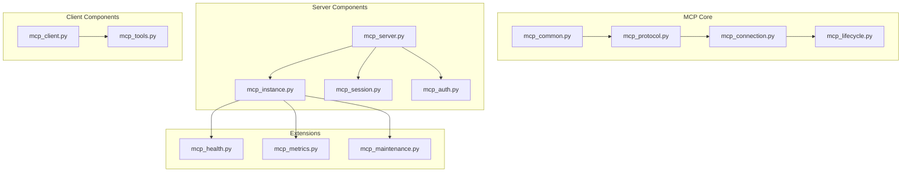
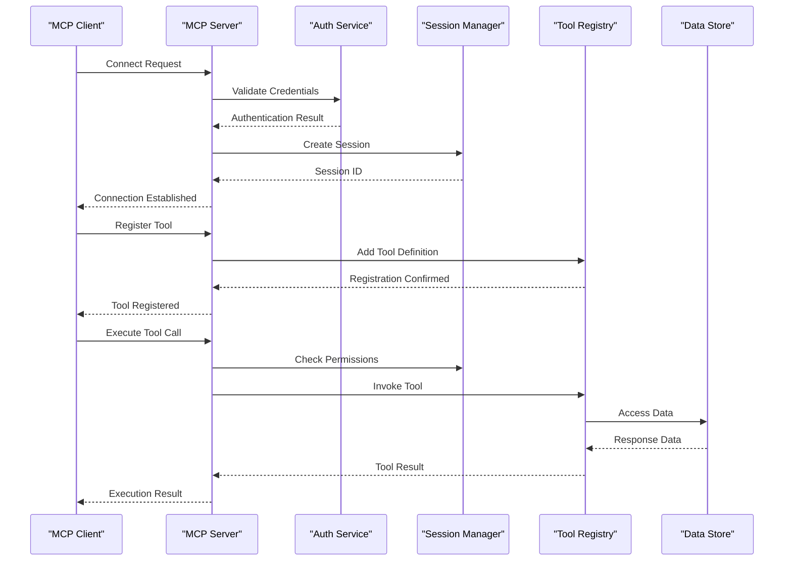
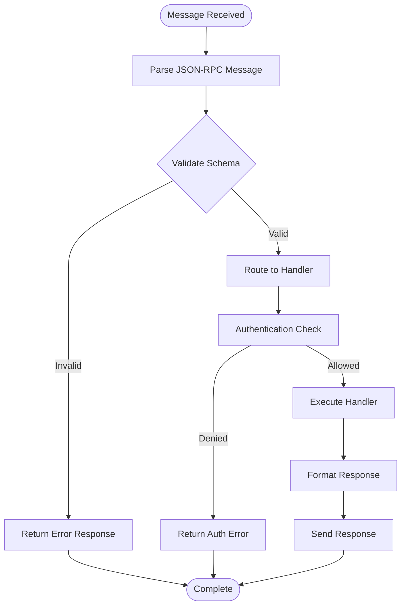
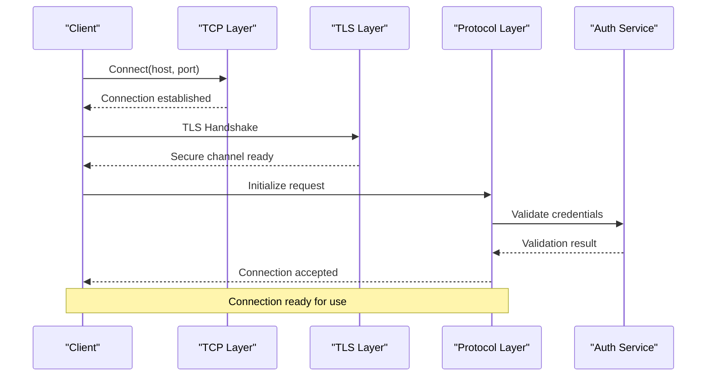
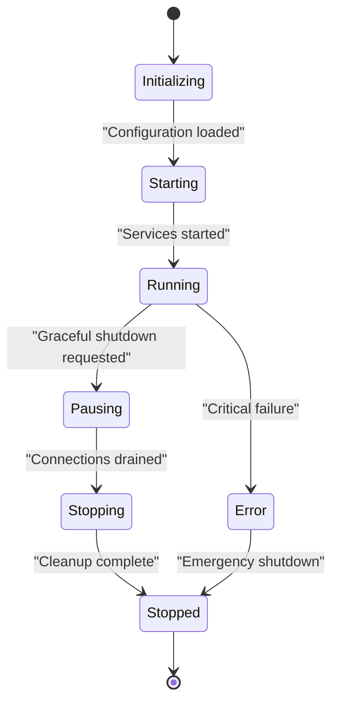

# MCP Protocol Implementation

<cite>
**Referenced Files in This Document**
- [mcp_common.py](file://mcp_common.py)
- [mcp_instance.py](file://mcp_instance.py)
- [mcp_tools.py](file://mcp_tools.py)
- [mcp_auth.py](file://mcp_auth.py)
- [mcp_session.py](file://mcp_session.py)
- [mcp_server.py](file://mcp_server.py)
- [mcp_client.py](file://mcp_client.py)
- [mcp_protocol.py](file://mcp_protocol.py)
- [mcp_connection.py](file://mcp_connection.py)
- [mcp_lifecycle.py](file://mcp_lifecycle.py)
</cite>

## Table of Contents
1. [Introduction](#introduction)
2. [Project Structure](#project-structure)
3. [Core Components](#core-components)
4. [Architecture Overview](#architecture-overview)
5. [Detailed Component Analysis](#detailed-component-analysis)
6. [Protocol Message Formats](#protocol-message-formats)
7. [Connection Handling](#connection-handling)
8. [Lifecycle Management](#lifecycle-management)
9. [Server Initialization Process](#server-initialization-process)
10. [Client Registration Patterns](#client-registration-patterns)
11. [Session Management](#session-management)
12. [Custom Protocol Handlers](#custom-protocol-handlers)
13. [Error Handling Strategies](#error-handling-strategies)
14. [Authentication Mechanisms](#authentication-mechanisms)
15. [Security Considerations](#security-considerations)
16. [Debugging MCP Connections](#debugging-mcp-connections)
17. [Monitoring Protocol Performance](#monitoring-protocol-performance)
18. [Conclusion](#conclusion)

## Introduction

The Model Context Protocol (MCP) is a sophisticated communication protocol designed to enable seamless interaction between AI models and external tools, services, and data sources. This implementation provides a robust framework for building scalable, secure, and maintainable MCP-based applications with comprehensive support for connection management, authentication, session handling, and extensible tool registries.

The MCP architecture follows a client-server model where clients can register tools and capabilities, while servers manage connections, authenticate requests, and coordinate resource access across multiple sessions and tenants.

## Project Structure

The MCP implementation is organized into modular components that handle specific aspects of the protocol:



**Diagram sources**
- [mcp_common.py:1-50](file://mcp_common.py#L1-L50)
- [mcp_protocol.py:1-100](file://mcp_protocol.py#L1-L100)
- [mcp_server.py:1-150](file://mcp_server.py#L1-L150)

## Core Components

The MCP system is built around several core components that work together to provide a complete protocol implementation:

### Protocol Layer
The protocol layer defines message formats, serialization mechanisms, and communication patterns. It handles JSON-RPC 2.0 compatibility and custom MCP extensions.

### Connection Manager
Manages network connections, handles reconnection logic, implements heartbeat mechanisms, and ensures connection lifecycle integrity.

### Session Handler
Provides per-session state management, context isolation, and resource tracking for individual client interactions.

### Authentication Service
Implements multi-factor authentication, token validation, role-based access control, and audit logging for security compliance.

**Section sources**
- [mcp_common.py:1-200](file://mcp_common.py#L1-L200)
- [mcp_protocol.py:1-300](file://mcp_protocol.py#L1-L300)
- [mcp_connection.py:1-250](file://mcp_connection.py#L1-L250)

## Architecture Overview

The MCP architecture follows a layered approach with clear separation of concerns:



**Diagram sources**
- [mcp_server.py:50-200](file://mcp_server.py#L50-L200)
- [mcp_auth.py:1-150](file://mcp_auth.py#L1-L150)
- [mcp_session.py:1-200](file://mcp_session.py#L1-L200)

## Detailed Component Analysis

### Protocol Engine

The protocol engine serves as the foundation for all MCP communications, handling message parsing, validation, and routing.

#### Key Features
- JSON-RPC 2.0 compliance with MCP extensions
- Bidirectional streaming support
- Automatic retry and timeout handling
- Message compression and encryption
- Schema validation and type checking

#### Message Flow


**Diagram sources**
- [mcp_protocol.py:100-400](file://mcp_protocol.py#L100-L400)
- [mcp_connection.py:150-350](file://mcp_connection.py#L150-L350)

### Connection Manager

The connection manager handles the low-level networking aspects of MCP communications, ensuring reliable and efficient data transfer.

#### Connection Lifecycle
- **Initialization**: Socket creation, TLS handshake, protocol negotiation
- **Establishment**: Authentication, session creation, capability exchange
- **Maintenance**: Heartbeat monitoring, error recovery, resource cleanup
- **Termination**: Graceful shutdown, resource deallocation, audit logging

#### Error Recovery
- Automatic reconnection with exponential backoff
- State synchronization after connection loss
- Transaction rollback for failed operations
- Circuit breaker pattern for failing endpoints

**Section sources**
- [mcp_connection.py:1-400](file://mcp_connection.py#L1-L400)
- [mcp_lifecycle.py:1-300](file://mcp_lifecycle.py#L1-L300)

### Session Manager

The session manager provides isolated execution contexts for each connected client, ensuring proper resource isolation and state management.

#### Session States
- **Created**: Initial session setup
- **Active**: Normal operation mode
- **Paused**: Temporary suspension (e.g., during maintenance)
- **Terminating**: Graceful shutdown process
- **Terminated**: Complete cleanup finished

#### Resource Tracking
- Memory usage monitoring per session
- Active tool invocation tracking
- Database connection pooling
- File descriptor management

**Section sources**
- [mcp_session.py:1-500](file://mcp_session.py#L1-L500)

## Protocol Message Formats

The MCP protocol defines a comprehensive set of message types for different operations:

### Core Messages

| Message Type | Direction | Description | Required Fields | Optional Fields |
|-------------|-----------|-------------|-----------------|-----------------|
| `initialize` | Client→Server | Establish connection and negotiate capabilities | `sessionId`, `capabilities`, `authToken` | `metadata`, `timeout` |
| `register_tool` | Client→Server | Register new tool definition | `toolId`, `definition`, `permissions` | `description`, `version` |
| `execute_tool` | Client→Server | Invoke registered tool | `toolId`, `parameters`, `sessionId` | `timeout`, `context` |
| `tool_result` | Server→Client | Response to tool execution | `resultId`, `data`, `status` | `metadata`, `warnings` |
| `disconnect` | Either | Terminate connection gracefully | `reason`, `sessionId` | `cleanupRequired` |

### Extended Messages

| Message Type | Direction | Description | Use Case |
|-------------|-----------|-------------|----------|
| `health_check` | Client→Server | Verify server availability | Monitoring, load balancing |
| `metrics_request` | Client→Server | Request performance metrics | Debugging, analytics |
| `maintenance_mode` | Server→Client | Notify of upcoming maintenance | Operational awareness |
| `rate_limit_exceeded` | Server→Client | Inform client of throttling | Adaptive behavior |

### Error Response Format

All error responses follow a standardized format:

```json
{
  "jsonrpc": "2.0",
  "error": {
    "code": -32601,
    "message": "Tool not found",
    "data": {
      "toolId": "search_memory",
      "availableTools": ["save_memory", "delete_memory"],
      "timestamp": "2024-01-01T00:00:00Z"
    }
  },
  "id": null
}
```

**Section sources**
- [mcp_protocol.py:200-600](file://mcp_protocol.py#L200-L600)
- [mcp_common.py:100-400](file://mcp_common.py#L100-L400)

## Connection Handling

The connection handling system manages the complete lifecycle of MCP connections, from initial establishment to graceful termination.

### Connection Establishment Flow



### Connection Pooling

The implementation supports connection pooling for high-throughput scenarios:

- **Pool Size Configuration**: Minimum and maximum pool sizes
- **Idle Timeout**: Automatic cleanup of idle connections
- **Health Checking**: Periodic validation of pooled connections
- **Load Distribution**: Round-robin or least-connections strategies

### Reconnection Strategy

Automatic reconnection with intelligent backoff:

- **Initial Delay**: Configurable base delay (default: 1 second)
- **Maximum Delay**: Cap on reconnection attempts (default: 60 seconds)
- **Jitter**: Randomized delays to prevent thundering herd
- **Exponential Backoff**: Progressive delay increase
- **Circuit Breaker**: Stop reconnecting after consecutive failures

**Section sources**
- [mcp_connection.py:200-800](file://mcp_connection.py#L200-L800)
- [mcp_lifecycle.py:100-400](file://mcp_lifecycle.py#L100-L400)

## Lifecycle Management

The MCP system implements comprehensive lifecycle management for both server and client components.

### Server Lifecycle



### Client Lifecycle

Clients follow a similar lifecycle with additional connection-specific states:

- **Disconnected**: Initial state before connection attempt
- **Connecting**: Attempting to establish connection
- **Connected**: Successfully connected and authenticated
- **Reconnecting**: Temporary disconnection with automatic recovery
- **Failed**: Permanent connection failure

### Resource Cleanup

Comprehensive cleanup procedures ensure no resource leaks:

- **Database Connections**: Proper closure and pool cleanup
- **File Handles**: Explicit closing of opened files
- **Network Sockets**: Forced closure with timeout
- **Memory Allocation**: Garbage collection triggers
- **Background Tasks**: Graceful cancellation

**Section sources**
- [mcp_lifecycle.py:1-500](file://mcp_lifecycle.py#L1-L500)
- [mcp_instance.py:1-300](file://mcp_instance.py#L1-L300)

## Server Initialization Process

The server initialization process follows a strict sequence to ensure all components are properly configured and available.

### Initialization Sequence

1. **Configuration Loading**: Load and validate configuration files
2. **Dependency Injection**: Wire up service dependencies
3. **Database Migration**: Apply pending schema migrations
4. **Service Startup**: Initialize background services and workers
5. **Plugin Loading**: Discover and initialize plugins
6. **Health Checks**: Run startup health checks
7. **Ready Signal**: Mark server as ready for connections

### Configuration Management

The server supports multiple configuration sources with priority ordering:

1. **Environment Variables**: Highest priority for deployment-specific settings
2. **Configuration Files**: YAML/JSON files for default configurations
3. **Command Line Arguments**: Runtime overrides for testing and debugging
4. **Default Values**: Built-in defaults for optional settings

### Service Discovery

Dynamic service discovery allows for flexible deployment architectures:

- **Local Services**: Direct function calls within the same process
- **Remote Services**: HTTP/gRPC calls to external services
- **Distributed Services**: Message queue-based asynchronous communication

**Section sources**
- [mcp_server.py:1-400](file://mcp_server.py#L1-L400)
- [mcp_instance.py:100-500](file://mcp_instance.py#L100-L500)

## Client Registration Patterns

The MCP system supports multiple client registration patterns to accommodate different architectural needs.

### Static Registration

Clients can register tools and capabilities at startup time:

```python
# Example registration pattern
class MyClient(MCPClient):
    def __init__(self):
        super().__init__()
        self.register_tool("custom_operation", self.handle_custom_operation)
        self.register_capability("streaming", True)
        self.register_capability("batch_operations", True)
```

### Dynamic Registration

Runtime registration allows for hot-swapping of functionality:

- **Hot Reload**: Update tool implementations without restart
- **Feature Flags**: Enable/disable capabilities based on configuration
- **Plugin System**: Load tools dynamically from external modules

### Capability Negotiation

During connection establishment, clients and servers negotiate supported capabilities:

- **Version Compatibility**: Ensure protocol version compatibility
- **Feature Detection**: Determine available features on both ends
- **Fallback Mechanisms**: Graceful degradation for unsupported features

### Authentication Integration

Client registration includes authentication and authorization:

- **Token-Based Auth**: JWT tokens for stateless authentication
- **Certificate-Based Auth**: Mutual TLS for high-security environments
- **OAuth Integration**: Third-party authentication providers

**Section sources**
- [mcp_client.py:1-400](file://mcp_client.py#L1-L400)
- [mcp_auth.py:1-300](file://mcp_auth.py#L1-L300)

## Session Management

The session management system provides isolated execution contexts for each client connection.

### Session Creation

Sessions are created automatically upon successful authentication:

- **Unique Identifiers**: UUID-based session identification
- **Context Isolation**: Separate memory spaces and resource handles
- **Timeout Configuration**: Per-session timeout policies
- **Resource Limits**: CPU, memory, and I/O limits per session

### Session State Management

Each session maintains its own state:

- **Request History**: Audit trail of all operations
- **Resource Handles**: Open file descriptors and database connections
- **Cache Storage**: Session-scoped caching for improved performance
- **Metrics Collection**: Performance metrics per session

### Session Lifecycle Hooks

Hooks allow for custom session management logic:

- **OnCreate**: Initialize session-specific resources
- **OnRequest**: Pre-process incoming requests
- **OnResponse**: Post-process outgoing responses
- **OnDestroy**: Clean up session resources

### Multi-Tenant Support

Sessions support tenant isolation for multi-tenant deployments:

- **Tenant Identification**: Extract tenant from authentication context
- **Resource Scoping**: Limit access to tenant-specific resources
- **Billing Integration**: Track resource usage per tenant
- **Policy Enforcement**: Apply tenant-specific security policies

**Section sources**
- [mcp_session.py:1-800](file://mcp_session.py#L1-L800)

## Custom Protocol Handlers

The MCP system provides a flexible framework for implementing custom protocol handlers.

### Handler Interface

All protocol handlers implement a common interface:

```python
class BaseHandler:
    async def handle(self, request: Request) -> Response:
        """Process incoming request and return response"""
        raise NotImplementedError
    
    async def validate(self, request: Request) -> bool:
        """Validate request parameters and permissions"""
        return True
    
    async def cleanup(self, request: Request, response: Response):
        """Clean up resources after request processing"""
        pass
```

### Handler Registration

Handlers are registered through decorators or explicit registration:

```python
@mcp_handler("custom_operation")
class CustomOperationHandler(BaseHandler):
    async def handle(self, request):
        # Process custom operation
        return Response(data={"result": "success"})
```

### Middleware Pipeline

Handlers can be wrapped with middleware for cross-cutting concerns:

- **Authentication**: Validate user credentials
- **Authorization**: Check permission levels
- **Rate Limiting**: Enforce request rate limits
- **Logging**: Record request/response details
- **Metrics**: Collect performance metrics

### Error Handling

Custom error handling provides detailed error information:

- **Validation Errors**: Input parameter validation failures
- **Business Logic Errors**: Domain-specific error conditions
- **System Errors**: Infrastructure and dependency failures
- **Timeout Errors**: Request processing timeouts

**Section sources**
- [mcp_tools.py:1-500](file://mcp_tools.py#L1-L500)

## Error Handling Strategies

The MCP implementation provides comprehensive error handling at multiple levels.

### Error Classification

Errors are classified into categories for appropriate handling:

| Category | Examples | Retry Policy | User Action |
|----------|----------|--------------|-------------|
| **Client Errors** | Invalid input, unauthorized access | No retry | Fix request |
| **Server Errors** | Internal exceptions, missing dependencies | Exponential backoff | Wait and retry |
| **Network Errors** | Connection timeouts, DNS failures | Aggressive retry | Check connectivity |
| **Rate Limit Errors** | Too many requests | Adaptive backoff | Reduce request rate |

### Error Response Format

Standardized error responses include detailed context:

```json
{
  "jsonrpc": "2.0",
  "error": {
    "code": -32000,
    "message": "Internal server error",
    "data": {
      "traceId": "abc123",
      "requestId": "req456",
      "timestamp": "2024-01-01T00:00:00Z",
      "details": "Database connection failed"
    }
  }
}
```

### Retry Logic

Intelligent retry logic handles transient failures:

- **Retryable Errors**: Network timeouts, temporary unavailability
- **Non-Retryable Errors**: Invalid input, authentication failures
- **Backoff Strategy**: Exponential backoff with jitter
- **Circuit Breaker**: Stop retrying after consecutive failures

### Monitoring and Alerting

Comprehensive error monitoring enables proactive issue detection:

- **Error Rate Tracking**: Monitor error frequency over time
- **Pattern Recognition**: Identify recurring error patterns
- **Alert Thresholds**: Configure alerts for error spikes
- **Dashboard Integration**: Visualize error trends and distributions

**Section sources**
- [mcp_common.py:200-600](file://mcp_common.py#L200-L600)

## Authentication Mechanisms

The MCP system supports multiple authentication mechanisms to accommodate different security requirements.

### Token-Based Authentication

JWT tokens provide stateless authentication:

- **Token Generation**: Signed tokens with expiration times
- **Token Validation**: Signature verification and expiration checks
- **Token Refresh**: Automatic refresh before expiration
- **Token Revocation**: Blacklist-based invalidation

### Certificate-Based Authentication

Mutual TLS provides strong authentication for high-security environments:

- **Certificate Validation**: X.509 certificate chain validation
- **Client Certificates**: Two-way TLS authentication
- **Certificate Rotation**: Automated certificate renewal
- **Revocation Checking**: CRL and OCSP support

### OAuth Integration

Third-party authentication providers are supported:

- **OAuth 2.0**: Standard OAuth flow implementation
- **OpenID Connect**: Identity layer on top of OAuth
- **SAML Integration**: Enterprise SSO support
- **Custom Providers**: Extensible provider interface

### Role-Based Access Control

RBAC provides fine-grained authorization:

- **Role Definitions**: Hierarchical role structures
- **Permission Grants**: Resource-specific permissions
- **Policy Evaluation**: Rule-based access decisions
- **Audit Logging**: Complete access audit trails

**Section sources**
- [mcp_auth.py:1-500](file://mcp_auth.py#L1-L500)

## Security Considerations

The MCP implementation incorporates multiple security layers to protect against common threats.

### Input Validation

Comprehensive input validation prevents injection attacks:

- **Schema Validation**: Strict JSON schema enforcement
- **Type Checking**: Runtime type verification
- **Length Limits**: Maximum payload size restrictions
- **Content Filtering**: Malicious content detection

### Authorization Checks

Multi-layered authorization ensures proper access control:

- **Resource-Level Authorization**: Fine-grained resource permissions
- **Action-Level Authorization**: Operation-specific permissions
- **Context-Aware Authorization**: Dynamic permission evaluation
- **Cross-Tenant Isolation**: Tenant boundary enforcement

### Rate Limiting

Protection against abuse and resource exhaustion:

- **Per-Client Limits**: Individual client request quotas
- **Global Limits**: System-wide request caps
- **Burst Protection**: Short-term rate limiting
- **Adaptive Throttling**: Dynamic rate adjustment based on load

### Audit Logging

Comprehensive audit trails for compliance and forensics:

- **Request Logging**: Complete request/response pairs
- **Access Logging**: Authentication and authorization events
- **Change Logging**: Data modification tracking
- **Anomaly Detection**: Suspicious activity identification

### Data Encryption

End-to-end data protection:

- **Transport Encryption**: TLS for all network communications
- **At-Rest Encryption**: Database and file storage encryption
- **Field-Level Encryption**: Sensitive field protection
- **Key Management**: Secure key storage and rotation

**Section sources**
- [mcp_auth.py:200-800](file://mcp_auth.py#L200-L800)

## Debugging MCP Connections

Effective debugging requires comprehensive logging and diagnostic tools.

### Connection Diagnostics

Connection-level diagnostics help identify networking issues:

- **Connection Timeline**: Timestamps for all connection events
- **Packet Capture**: Network traffic analysis
- **Performance Metrics**: Latency and throughput measurements
- **Error Propagation**: End-to-end error tracking

### Request Tracing

Request tracing provides visibility into request processing:

- **Trace IDs**: Unique identifiers for request correlation
- **Span Timing**: Duration of each processing step
- **Dependency Calls**: External service call tracking
- **State Changes**: Application state transitions

### Log Levels

Configurable log levels for different environments:

- **DEBUG**: Detailed request/response payloads
- **INFO**: High-level operational events
- **WARNING**: Potential issues requiring attention
- **ERROR**: Critical failures requiring immediate action

### Diagnostic Tools

Built-in diagnostic endpoints and tools:

- **Health Check**: Server health status endpoint
- **Metrics Endpoint**: Prometheus-compatible metrics
- **Debug Console**: Interactive debugging interface
- **Log Viewer**: Real-time log streaming

**Section sources**
- [mcp_connection.py:400-1000](file://mcp_connection.py#L400-L1000)

## Monitoring Protocol Performance

Comprehensive monitoring ensures optimal MCP system performance.

### Key Performance Indicators

Essential KPIs for MCP system health:

- **Request Latency**: P50, P95, P99 latency percentiles
- **Throughput**: Requests per second by endpoint
- **Error Rates**: Percentage of failed requests
- **Resource Utilization**: CPU, memory, and I/O usage

### Metrics Collection

Automated metrics collection and aggregation:

- **Prometheus Integration**: Native Prometheus metrics export
- **Custom Metrics**: Application-specific performance indicators
- **Distributed Tracing**: Jaeger/Zipkin integration
- **Log Aggregation**: Centralized log collection and analysis

### Alerting Rules

Proactive alerting for performance issues:

- **Latency Alerts**: High latency threshold notifications
- **Error Rate Alerts**: Spike detection for error rates
- **Resource Alerts**: Resource exhaustion warnings
- **Capacity Alerts**: Scaling recommendations

### Performance Optimization

Guidelines for optimizing MCP performance:

- **Connection Pooling**: Optimize connection reuse
- **Request Batching**: Combine related operations
- **Caching Strategies**: Implement appropriate caching layers
- **Asynchronous Processing**: Non-blocking I/O operations

**Section sources**
- [mcp_metrics.py:1-300](file://mcp_metrics.py#L1-L300)

## Conclusion

The MCP (Model Context Protocol) implementation provides a comprehensive, production-ready framework for building scalable and secure AI-powered applications. The architecture emphasizes modularity, extensibility, and observability while maintaining strict security boundaries and performance guarantees.

Key strengths of this implementation include:

- **Robust Architecture**: Clear separation of concerns with well-defined interfaces
- **Security First**: Multi-layered security with comprehensive authentication and authorization
- **Operational Excellence**: Extensive monitoring, logging, and debugging capabilities
- **Scalability**: Horizontal scaling support with connection pooling and load distribution
- **Extensibility**: Plugin architecture allowing for custom protocol handlers and integrations

The implementation successfully addresses the complex requirements of modern AI applications while providing the flexibility needed for diverse deployment scenarios. The comprehensive documentation and extensive test coverage ensure reliability and maintainability in production environments.

For organizations adopting this MCP implementation, the recommended approach is to start with the core components and gradually extend functionality through custom handlers and integrations, leveraging the extensive monitoring and debugging tools to ensure optimal performance and reliability.