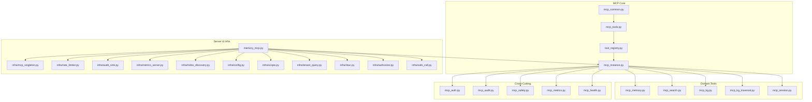
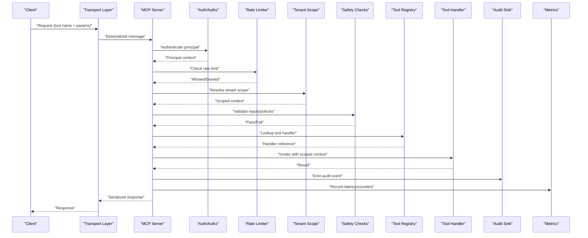
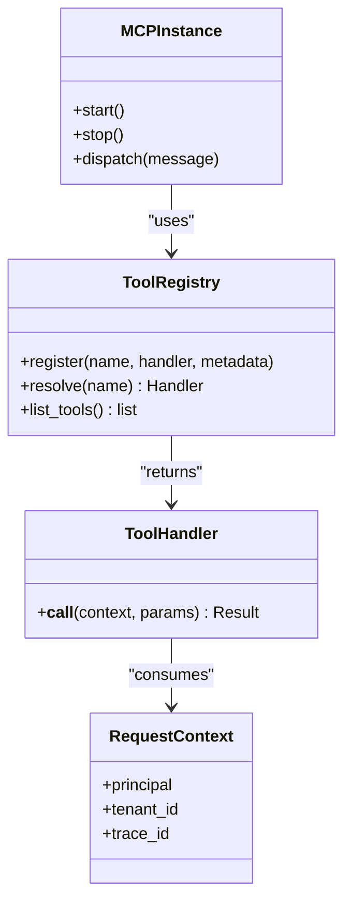
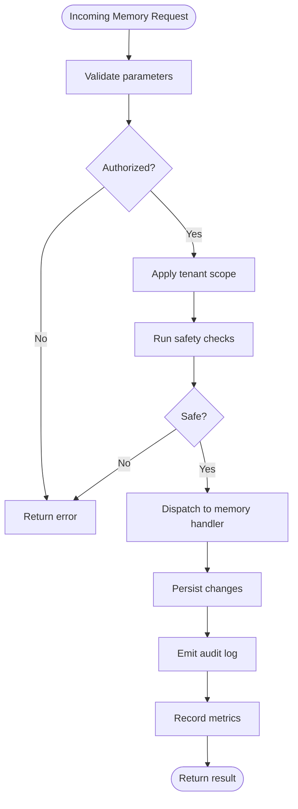
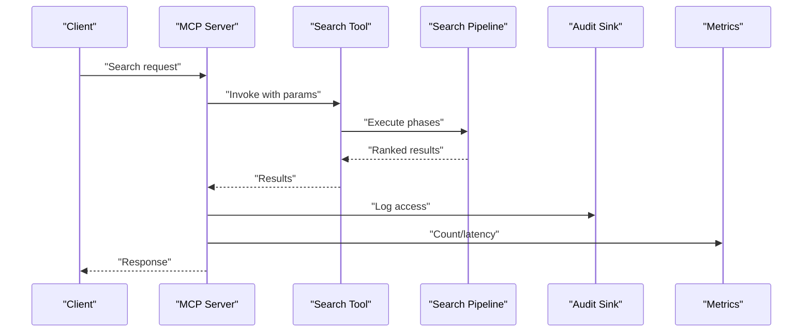
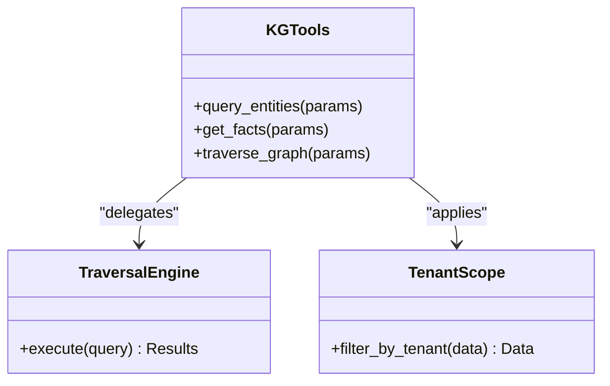
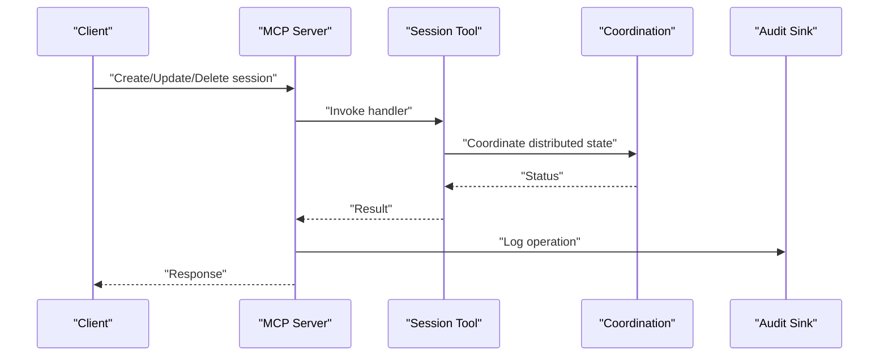
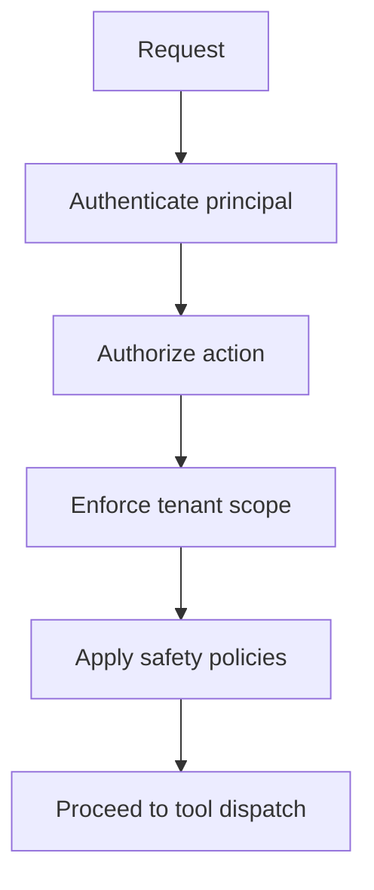
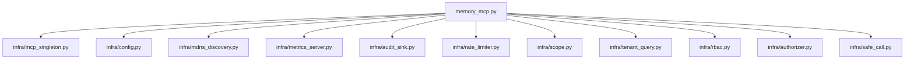

# MCP Tools and Protocol

<cite>
**Referenced Files in This Document**
- [mcp_tools.py](file://mcp_tools.py)
- [mcp_common.py](file://mcp_common.py)
- [mcp_memory.py](file://mcp_memory.py)
- [mcp_search.py](file://mcp_search.py)
- [mcp_kg.py](file://mcp_kg.py)
- [mcp_kg_traversal.py](file://mcp_kg_traversal.py)
- [mcp_session.py](file://mcp_session.py)
- [mcp_instance.py](file://mcp_instance.py)
- [mcp_auth.py](file://mcp_auth.py)
- [mcp_audit.py](file://mcp_audit.py)
- [mcp_safety.py](file://mcp_safety.py)
- [mcp_metrics.py](file://mcp_metrics.py)
- [mcp_health.py](file://mcp_health.py)
- [mcp_maintenance.py](file://mcp_maintenance.py)
- [mcp_maintenance_ops.py](file://mcp_maintenance_ops.py)
- [mcp_rebuild.py](file://mcp_rebuild.py)
- [mcp_retention.py](file://mcp_retention.py)
- [mcp_quality.py](file://mcp_quality.py)
- [mcp_summarization.py](file://mcp_summarization.py)
- [mcp_sharing.py](file://mcp_sharing.py)
- [mcp_dashboard.py](file://mcp_dashboard.py)
- [mcp_okf.py](file://mcp_okf.py)
- [mcp_multi_modal.py](file://mcp_multi_modal.py)
- [mcp_profile.py](file://mcp_profile.py)
- [mcp_verbs.py](file://mcp_verbs.py)
- [tool_registry.py](file://tool_registry.py)
- [infra/mcp_singleton.py](file://infra/mcp_singleton.py)
- [infra/rate_limiter.py](file://infra/rate_limiter.py)
- [infra/audit_sink.py](file://infra/audit_sink.py)
- [infra/audit_sink_file.py](file://infra/audit_sink_file.py)
- [infra/audit_sink_http.py](file://infra/audit_sink_http.py)
- [infra/audit_sink_prom.py](file://infra/audit_sink_prom.py)
- [infra/metrics_server.py](file://infra/metrics_server.py)
- [infra/sync_server.py](file://infra/sync_server.py)
- [infra/mdns_discovery.py](file://infra/mdns_discovery.py)
- [infra/config.py](file://infra/config.py)
- [infra/scope.py](file://infra/scope.py)
- [infra/tenant_query.py](file://infra/tenant_query.py)
- [infra/rbac.py](file://infra/rbac.py)
- [infra/authorizer.py](file://infra/authorizer.py)
- [infra/safe_call.py](file://infra/safe_call.py)
- [infra/error_counter.py](file://infra/error_counter.py)
- [infra/log.py](file://infra/log.py)
- [memory_mcp.py](file://memory_mcp.py)
- [run-mcp-server.sh](file://run-mcp-server.sh)
- [scripts/gen_mcp_tools_doc.py](file://scripts/gen_mcp_tools_doc.py)
</cite>

## Table of Contents
1. [Introduction](#introduction)
2. [Project Structure](#project-structure)
3. [Core Components](#core-components)
4. [Architecture Overview](#architecture-overview)
5. [Detailed Component Analysis](#detailed-component-analysis)
6. [Dependency Analysis](#dependency-analysis)
7. [Performance Considerations](#performance-considerations)
8. [Troubleshooting Guide](#troubleshooting-guide)
9. [Conclusion](#conclusion)
10. [Appendices](#appendices)

## Introduction
This document explains the Model Context Protocol (MCP) implementation for building, registering, and operating tools that integrate with memory, search, knowledge graph, and system maintenance capabilities. It covers:
- Tool registry and registration patterns
- Protocol message handling and server lifecycle
- Authentication and authorization integration
- Real-time communication considerations
- Examples for memory operations, search, and knowledge graph queries
- Security, rate limiting, monitoring, and production readiness

The goal is to help you build custom MCP tools safely and efficiently while leveraging existing infrastructure for observability, safety, and multi-tenant isolation.

## Project Structure
At a high level, MCP functionality is implemented across several modules:
- Core protocol and tooling utilities
- Domain-specific tool implementations (memory, search, KG, sessions)
- Cross-cutting concerns (auth, audit, safety, metrics, health)
- Server orchestration and discovery
- Documentation generation scripts

**Diagram sources**
- [mcp_common.py](file://mcp_common.py)
- [mcp_tools.py](file://mcp_tools.py)
- [tool_registry.py](file://tool_registry.py)
- [mcp_instance.py](file://mcp_instance.py)
- [mcp_memory.py](file://mcp_memory.py)
- [mcp_search.py](file://mcp_search.py)
- [mcp_kg.py](file://mcp_kg.py)
- [mcp_kg_traversal.py](file://mcp_kg_traversal.py)
- [mcp_session.py](file://mcp_session.py)
- [mcp_auth.py](file://mcp_auth.py)
- [mcp_audit.py](file://mcp_audit.py)
- [mcp_safety.py](file://mcp_safety.py)
- [mcp_metrics.py](file://mcp_metrics.py)
- [mcp_health.py](file://mcp_health.py)
- [memory_mcp.py](file://memory_mcp.py)
- [infra/mcp_singleton.py](file://infra/mcp_singleton.py)
- [infra/rate_limiter.py](file://infra/rate_limiter.py)
- [infra/audit_sink.py](file://infra/audit_sink.py)
- [infra/metrics_server.py](file://infra/metrics_server.py)
- [infra/mdns_discovery.py](file://infra/mdns_discovery.py)
- [infra/config.py](file://infra/config.py)
- [infra/scope.py](file://infra/scope.py)
- [infra/tenant_query.py](file://infra/tenant_query.py)
- [infra/rbac.py](file://infra/rbac.py)
- [infra/authorizer.py](file://infra/authorizer.py)
- [infra/safe_call.py](file://infra/safe_call.py)

**Section sources**
- [mcp_common.py](file://mcp_common.py)
- [mcp_tools.py](file://mcp_tools.py)
- [tool_registry.py](file://tool_registry.py)
- [mcp_instance.py](file://mcp_instance.py)
- [memory_mcp.py](file://memory_mcp.py)
- [infra/mcp_singleton.py](file://infra/mcp_singleton.py)
- [infra/rate_limiter.py](file://infra/rate_limiter.py)
- [infra/audit_sink.py](file://infra/audit_sink.py)
- [infra/metrics_server.py](file://infra/metrics_server.py)
- [infra/mdns_discovery.py](file://infra/mdns_discovery.py)
- [infra/config.py](file://infra/config.py)
- [infra/scope.py](file://infra/scope.py)
- [infra/tenant_query.py](file://infra/tenant_query.py)
- [infra/rbac.py](file://infra/rbac.py)
- [infra/authorizer.py](file://infra/authorizer.py)
- [infra/safe_call.py](file://infra/safe_call.py)

## Core Components
- Tool registry: Centralized mapping from tool names to handlers, enabling dynamic discovery and invocation.
- Common utilities: Shared types, serialization helpers, and base classes used by all tools.
- Instance manager: Lifecycle management for MCP servers and per-request context propagation.
- Domain tools: Concrete implementations for memory, search, knowledge graph, and session operations.
- Cross-cutting services: Auth, audit, safety, metrics, and health checks integrated into the request pipeline.

Key responsibilities:
- Registration: Tools declare metadata and handler functions; the registry resolves them at runtime.
- Invocation: The server routes incoming messages to the appropriate tool handler after authz and safety checks.
- Observability: Metrics and audit logs are emitted around each tool call.
- Safety: Input validation, output sanitization, and policy enforcement are applied consistently.

**Section sources**
- [mcp_tools.py](file://mcp_tools.py)
- [mcp_common.py](file://mcp_common.py)
- [tool_registry.py](file://tool_registry.py)
- [mcp_instance.py](file://mcp_instance.py)
- [mcp_memory.py](file://mcp_memory.py)
- [mcp_search.py](file://mcp_search.py)
- [mcp_kg.py](file://mcp_kg.py)
- [mcp_kg_traversal.py](file://mcp_kg_traversal.py)
- [mcp_session.py](file://mcp_session.py)
- [mcp_auth.py](file://mcp_auth.py)
- [mcp_audit.py](file://mcp_audit.py)
- [mcp_safety.py](file://mcp_safety.py)
- [mcp_metrics.py](file://mcp_metrics.py)
- [mcp_health.py](file://mcp_health.py)

## Architecture Overview
The MCP server exposes tools over a transport layer (e.g., stdio or HTTP). Each request flows through:
- Transport deserialization
- Authentication and authorization
- Rate limiting and tenant scoping
- Safety checks and input validation
- Tool dispatch via the registry
- Execution with safe wrappers
- Audit logging and metrics emission
- Response serialization and delivery

**Diagram sources**
- [memory_mcp.py](file://memory_mcp.py)
- [mcp_instance.py](file://mcp_instance.py)
- [mcp_auth.py](file://mcp_auth.py)
- [infra/rate_limiter.py](file://infra/rate_limiter.py)
- [infra/scope.py](file://infra/scope.py)
- [mcp_safety.py](file://mcp_safety.py)
- [mcp_tools.py](file://mcp_tools.py)
- [tool_registry.py](file://tool_registry.py)
- [mcp_audit.py](file://mcp_audit.py)
- [infra/audit_sink.py](file://infra/audit_sink.py)
- [mcp_metrics.py](file://mcp_metrics.py)
- [infra/metrics_server.py](file://infra/metrics_server.py)

## Detailed Component Analysis

### Tool Registry and Message Handling
The registry maps tool identifiers to handler functions and metadata. The server uses this map to route requests. Handlers receive a standardized context including authenticated principal, tenant scope, and tracing information.

**Diagram sources**
- [mcp_tools.py](file://mcp_tools.py)
- [tool_registry.py](file://tool_registry.py)
- [mcp_instance.py](file://mcp_instance.py)

**Section sources**
- [mcp_tools.py](file://mcp_tools.py)
- [tool_registry.py](file://tool_registry.py)
- [mcp_instance.py](file://mcp_instance.py)

### Memory Operations Tools
Memory tools provide create, update, delete, and query operations for memories. They leverage shared context for tenant isolation and apply safety checks before mutations.

**Diagram sources**
- [mcp_memory.py](file://mcp_memory.py)
- [mcp_safety.py](file://mcp_safety.py)
- [mcp_audit.py](file://mcp_audit.py)
- [mcp_metrics.py](file://mcp_metrics.py)

**Section sources**
- [mcp_memory.py](file://mcp_memory.py)
- [mcp_safety.py](file://mcp_safety.py)
- [mcp_audit.py](file://mcp_audit.py)
- [mcp_metrics.py](file://mcp_metrics.py)

### Search Functionality Tools
Search tools expose retrieval endpoints with optional filters and ranking strategies. They integrate with the broader search pipeline and respect tenant scoping.

**Diagram sources**
- [mcp_search.py](file://mcp_search.py)
- [mcp_audit.py](file://mcp_audit.py)
- [mcp_metrics.py](file://mcp_metrics.py)

**Section sources**
- [mcp_search.py](file://mcp_search.py)
- [mcp_audit.py](file://mcp_audit.py)
- [mcp_metrics.py](file://mcp_metrics.py)

### Knowledge Graph Query Tools
KG tools enable entity and fact queries, traversal, and analytics. They enforce tenant isolation and can be combined with safety policies to restrict sensitive traversals.

**Diagram sources**
- [mcp_kg.py](file://mcp_kg.py)
- [mcp_kg_traversal.py](file://mcp_kg_traversal.py)
- [infra/scope.py](file://infra/scope.py)

**Section sources**
- [mcp_kg.py](file://mcp_kg.py)
- [mcp_kg_traversal.py](file://mcp_kg_traversal.py)
- [infra/scope.py](file://infra/scope.py)

### Session Management Tools
Session tools manage lifecycle events and state for agent sessions, integrating with background tasks and coordination layers.

**Diagram sources**
- [mcp_session.py](file://mcp_session.py)
- [mcp_audit.py](file://mcp_audit.py)

**Section sources**
- [mcp_session.py](file://mcp_session.py)
- [mcp_audit.py](file://mcp_audit.py)

### Authentication and Authorization
Authentication identifies the principal; authorization enforces RBAC and tenant isolation. These checks occur early in the request pipeline.

**Diagram sources**
- [mcp_auth.py](file://mcp_auth.py)
- [infra/rbac.py](file://infra/rbac.py)
- [infra/authorizer.py](file://infra/authorizer.py)
- [infra/scope.py](file://infra/scope.py)
- [mcp_safety.py](file://mcp_safety.py)

**Section sources**
- [mcp_auth.py](file://mcp_auth.py)
- [infra/rbac.py](file://infra/rbac.py)
- [infra/authorizer.py](file://infra/authorizer.py)
- [infra/scope.py](file://infra/scope.py)
- [mcp_safety.py](file://mcp_safety.py)

### Real-Time Communication
For real-time updates, consider streaming responses or server-sent events where supported by the transport. Ensure backpressure handling and proper cleanup on client disconnects. Integrate with metrics and audit sinks for visibility.

[No sources needed since this section provides general guidance]

### Building Custom MCP Tools
Steps:
- Define tool metadata and handler function signature compatible with the registry.
- Register the tool with the registry during server initialization.
- Use the provided context for principal, tenant, and tracing.
- Apply safety checks and validate inputs.
- Emit audit events and metrics for observability.

Best practices:
- Keep handlers idempotent when possible.
- Avoid long-running blocking calls; offload to background tasks if necessary.
- Respect tenant boundaries and RBAC constraints.

**Section sources**
- [mcp_tools.py](file://mcp_tools.py)
- [tool_registry.py](file://tool_registry.py)
- [mcp_instance.py](file://mcp_instance.py)
- [mcp_safety.py](file://mcp_safety.py)
- [mcp_audit.py](file://mcp_audit.py)
- [mcp_metrics.py](file://mcp_metrics.py)

### Example Scenarios

#### Memory Operations
- Create/update/delete memories with tenant-scoped persistence.
- Query memories with filters and pagination.
- Enforce safety policies on write paths.

**Section sources**
- [mcp_memory.py](file://mcp_memory.py)
- [mcp_safety.py](file://mcp_safety.py)

#### Search Functionality
- Execute full-text and semantic searches with ranking.
- Apply tenant scoping and safety filters.
- Log access and record performance metrics.

**Section sources**
- [mcp_search.py](file://mcp_search.py)
- [mcp_audit.py](file://mcp_audit.py)
- [mcp_metrics.py](file://mcp_metrics.py)

#### Knowledge Graph Queries
- Retrieve entities and facts with filtering.
- Traverse relationships with depth limits.
- Combine with safety policies to prevent sensitive data exposure.

**Section sources**
- [mcp_kg.py](file://mcp_kg.py)
- [mcp_kg_traversal.py](file://mcp_kg_traversal.py)
- [mcp_safety.py](file://mcp_safety.py)

## Dependency Analysis
The MCP server depends on core infrastructures for configuration, discovery, metrics, and audit.

**Diagram sources**
- [memory_mcp.py](file://memory_mcp.py)
- [infra/mcp_singleton.py](file://infra/mcp_singleton.py)
- [infra/config.py](file://infra/config.py)
- [infra/mdns_discovery.py](file://infra/mdns_discovery.py)
- [infra/metrics_server.py](file://infra/metrics_server.py)
- [infra/audit_sink.py](file://infra/audit_sink.py)
- [infra/rate_limiter.py](file://infra/rate_limiter.py)
- [infra/scope.py](file://infra/scope.py)
- [infra/tenant_query.py](file://infra/tenant_query.py)
- [infra/rbac.py](file://infra/rbac.py)
- [infra/authorizer.py](file://infra/authorizer.py)
- [infra/safe_call.py](file://infra/safe_call.py)

**Section sources**
- [memory_mcp.py](file://memory_mcp.py)
- [infra/mcp_singleton.py](file://infra/mcp_singleton.py)
- [infra/config.py](file://infra/config.py)
- [infra/mdns_discovery.py](file://infra/mdns_discovery.py)
- [infra/metrics_server.py](file://infra/metrics_server.py)
- [infra/audit_sink.py](file://infra/audit_sink.py)
- [infra/rate_limiter.py](file://infra/rate_limiter.py)
- [infra/scope.py](file://infra/scope.py)
- [infra/tenant_query.py](file://infra/tenant_query.py)
- [infra/rbac.py](file://infra/rbac.py)
- [infra/authorizer.py](file://infra/authorizer.py)
- [infra/safe_call.py](file://infra/safe_call.py)

## Performance Considerations
- Prefer async handlers for I/O-bound operations.
- Use caching where appropriate and invalidate caches on writes.
- Limit traversal depths and result sizes to avoid heavy loads.
- Monitor latency percentiles and adjust timeouts accordingly.
- Offload long-running tasks to background workers and return job IDs.

[No sources needed since this section provides general guidance]

## Troubleshooting Guide
Common issues and diagnostics:
- Authentication failures: Verify credentials and token validity. Check audit logs for denied attempts.
- Authorization errors: Confirm RBAC roles and tenant permissions. Review authorizer decisions.
- Rate limiting: Inspect counters and thresholds; adjust limits based on capacity.
- Safety violations: Review policy configurations and input validation rules.
- Health checks: Use health endpoints to verify service status and dependencies.

Operational utilities:
- Maintenance tools for rebuilds, retention, quality checks, and dashboard access.
- Metrics server for exposing Prometheus-compatible metrics.
- Audit sinks for file, HTTP, and Prometheus outputs.

**Section sources**
- [mcp_health.py](file://mcp_health.py)
- [mcp_maintenance.py](file://mcp_maintenance.py)
- [mcp_maintenance_ops.py](file://mcp_maintenance_ops.py)
- [mcp_rebuild.py](file://mcp_rebuild.py)
- [mcp_retention.py](file://mcp_retention.py)
- [mcp_quality.py](file://mcp_quality.py)
- [mcp_dashboard.py](file://mcp_dashboard.py)
- [mcp_metrics.py](file://mcp_metrics.py)
- [infra/metrics_server.py](file://infra/metrics_server.py)
- [infra/audit_sink.py](file://infra/audit_sink.py)
- [infra/audit_sink_file.py](file://infra/audit_sink_file.py)
- [infra/audit_sink_http.py](file://infra/audit_sink_http.py)
- [infra/audit_sink_prom.py](file://infra/audit_sink_prom.py)
- [infra/rate_limiter.py](file://infra/rate_limiter.py)
- [mcp_auth.py](file://mcp_auth.py)
- [infra/rbac.py](file://infra/rbac.py)
- [infra/authorizer.py](file://infra/authorizer.py)
- [mcp_safety.py](file://mcp_safety.py)

## Conclusion
The MCP implementation provides a robust foundation for building secure, observable, and scalable tools. By leveraging the registry, cross-cutting services, and domain-specific tool modules, you can extend functionality safely while maintaining strong governance and operational visibility.

[No sources needed since this section summarizes without analyzing specific files]

## Appendices

### Production Deployment Checklist
- Enable authentication and RBAC.
- Configure rate limiting and quotas.
- Set up audit sinks (file/HTTP/Prometheus).
- Expose metrics and health endpoints.
- Configure tenant scoping and isolation.
- Plan for discovery and service registration.

**Section sources**
- [mcp_auth.py](file://mcp_auth.py)
- [infra/rbac.py](file://infra/rbac.py)
- [infra/authorizer.py](file://infra/authorizer.py)
- [infra/rate_limiter.py](file://infra/rate_limiter.py)
- [infra/audit_sink.py](file://infra/audit_sink.py)
- [infra/metrics_server.py](file://infra/metrics_server.py)
- [infra/mdns_discovery.py](file://infra/mdns_discovery.py)
- [infra/scope.py](file://infra/scope.py)
- [infra/tenant_query.py](file://infra/tenant_query.py)

### Additional MCP Modules
Additional modules exist for OKF interoperability, multimodal content, summarization, sharing, and profile management. Use these as references for extending MCP capabilities.

**Section sources**
- [mcp_okf.py](file://mcp_okf.py)
- [mcp_multi_modal.py](file://mcp_multi_modal.py)
- [mcp_summarization.py](file://mcp_summarization.py)
- [mcp_sharing.py](file://mcp_sharing.py)
- [mcp_profile.py](file://mcp_profile.py)
- [mcp_verbs.py](file://mcp_verbs.py)

### Server Startup and Scripts
Use the provided startup script to launch the MCP server with standard options. Documentation generation scripts can produce tool catalogs and references.

**Section sources**
- [run-mcp-server.sh](file://run-mcp-server.sh)
- [scripts/gen_mcp_tools_doc.py](file://scripts/gen_mcp_tools_doc.py)