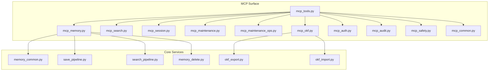
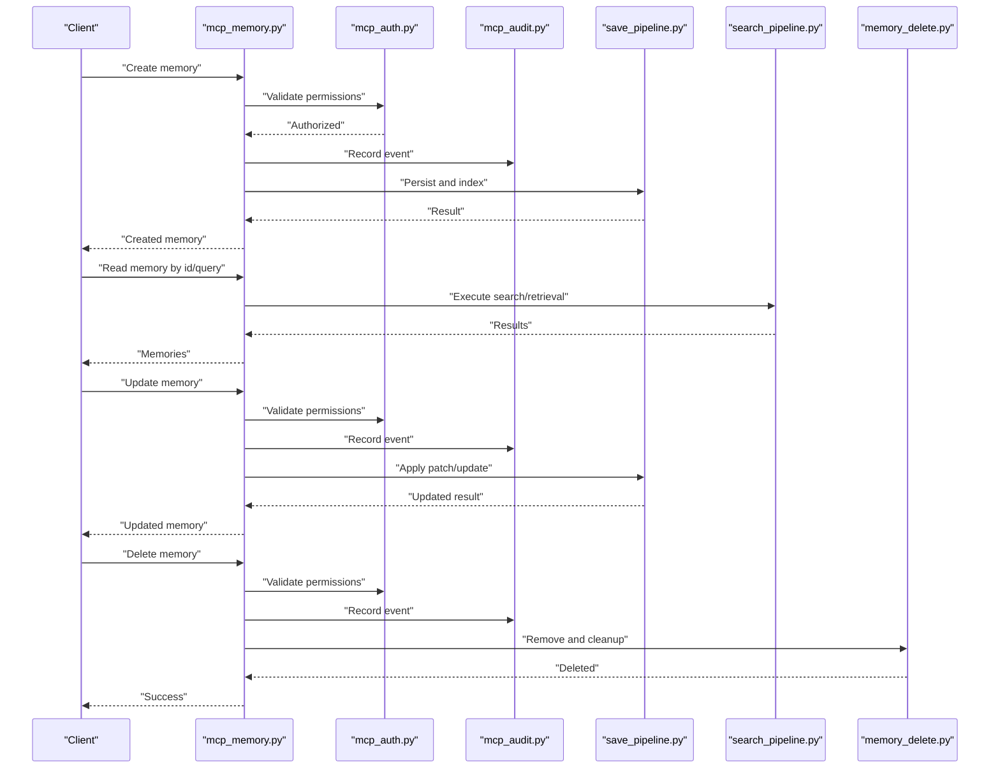
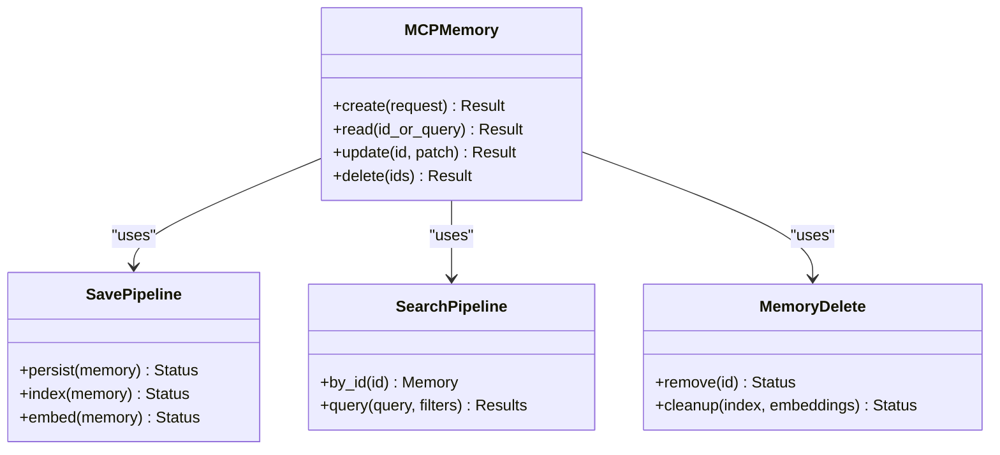
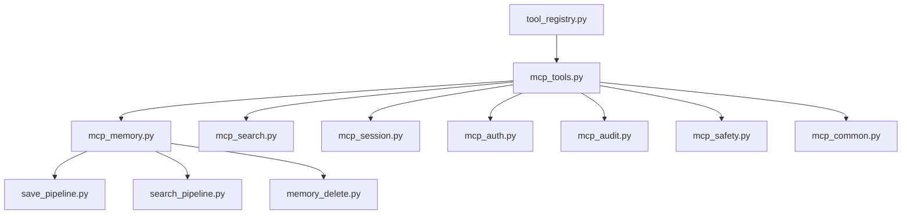
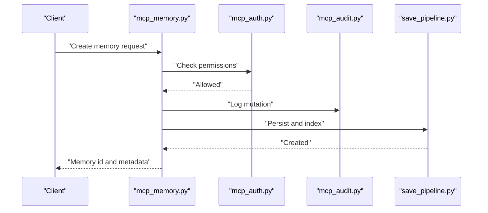
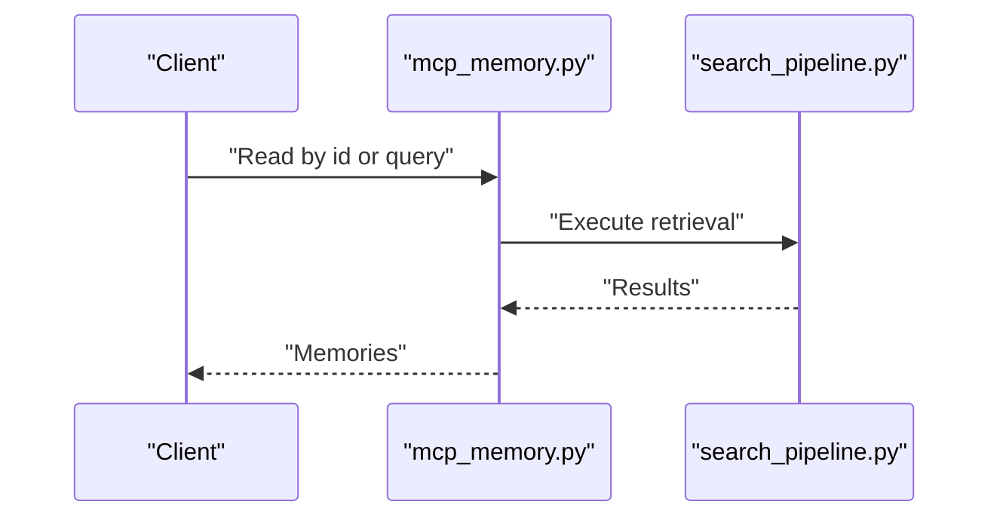
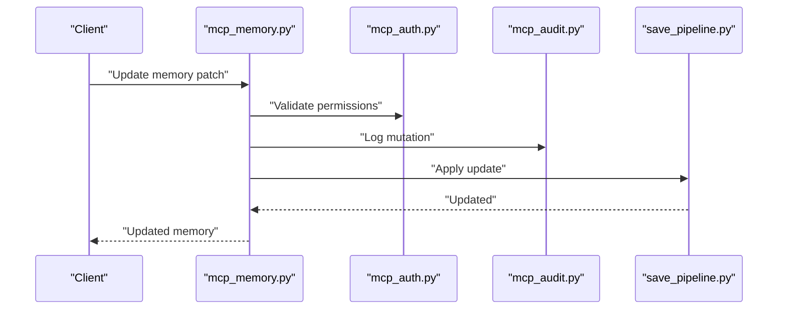
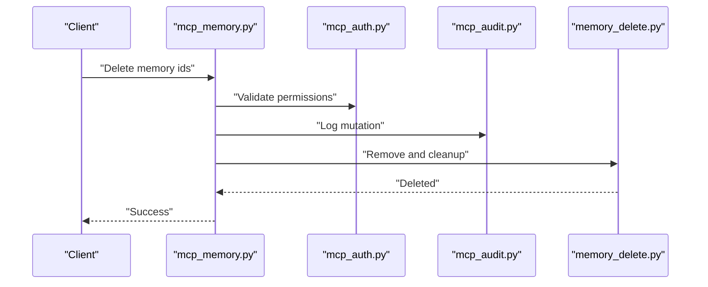
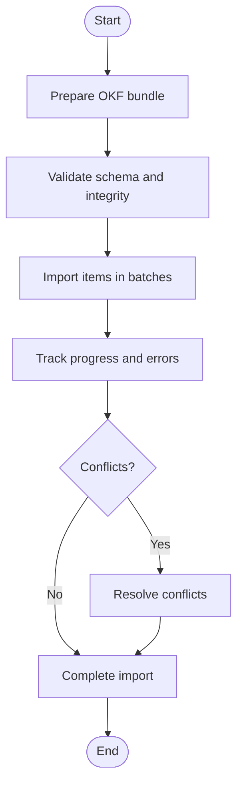

# Memory CRUD Operations

<cite>
**Referenced Files in This Document**
- [mcp_memory.py](file://mcp_memory.py)
- [mcp_tools.py](file://mcp_tools.py)
- [memory_common.py](file://memory_common.py)
- [save_pipeline.py](file://save_pipeline.py)
- [search_pipeline.py](file://search_pipeline.py)
- [memory_delete.py](file://memory_delete.py)
- [mcp_okf.py](file://mcp_okf.py)
- [okf_export.py](file://okf_export.py)
- [okf_import.py](file://okf_import.py)
- [mcp_maintenance.py](file://mcp_maintenance.py)
- [mcp_maintenance_ops.py](file://mcp_maintenance_ops.py)
- [mcp_search.py](file://mcp_search.py)
- [mcp_session.py](file://mcp_session.py)
- [mcp_kg.py](file://mcp_kg.py)
- [mcp_crdt.py](file://mcp_crdt.py)
- [mcp_auth.py](file://mcp_auth.py)
- [mcp_audit.py](file://mcp_audit.py)
- [mcp_instance.py](file://mcp_instance.py)
- [tool_registry.py](file://tool_registry.py)
- [mcp_common.py](file://mcp_common.py)
- [mcp_verbs.py](file://mcp_verbs.py)
- [mcp_sdk.py](file://mcp_sdk.py)
- [mcp_dashboard.py](file://mcp_dashboard.py)
- [mcp_health.py](file://mcp_health.py)
- [mcp_metrics.py](file://mcp_metrics.py)
- [mcp_profile.py](file://mcp_profile.py)
- [mcp_quality.py](file://mcp_quality.py)
- [mcp_rebuild.py](file://mcp_rebuild.py)
- [mcp_retention.py](file://mcp_retention.py)
- [mcp_safety.py](file://mcp_safety.py)
- [mcp_sharing.py](file://mcp_sharing.py)
- [mcp_summarization.py](file://mcp_summarization.py)
- [mcp_multi_modal.py](file://mcp_multi_modal.py)
- [mcp_ctr_drift.py](file://mcp_ctr_drift.py)
</cite>

## Table of Contents
1. [Introduction](#introduction)
2. [Project Structure](#project-structure)
3. [Core Components](#core-components)
4. [Architecture Overview](#architecture-overview)
5. [Detailed Component Analysis](#detailed-component-analysis)
6. [Dependency Analysis](#dependency-analysis)
7. [Performance Considerations](#performance-considerations)
8. [Troubleshooting Guide](#troubleshooting-guide)
9. [Conclusion](#conclusion)
10. [Appendices](#appendices)

## Introduction
This document describes the MCP tools that provide memory CRUD operations, including how to create, read, update, and delete memories via the MCP interface. It covers tool parameters, request/response schemas, validation rules, error codes, practical examples, batch operations, bulk imports/exports, performance considerations for large datasets, metadata handling, tagging systems, and lifecycle management.

## Project Structure
The MCP surface exposes a set of tools for memory operations. The primary entry points are:
- Tool registration and routing
- Memory-specific tools (create, read, update, delete)
- Search and retrieval tools
- Maintenance and operational tools
- Authentication, auditing, and safety wrappers

**Diagram sources**
- [mcp_tools.py](file://mcp_tools.py)
- [mcp_memory.py](file://mcp_memory.py)
- [mcp_search.py](file://mcp_search.py)
- [mcp_session.py](file://mcp_session.py)
- [mcp_maintenance.py](file://mcp_maintenance.py)
- [mcp_maintenance_ops.py](file://mcp_maintenance_ops.py)
- [mcp_okf.py](file://mcp_okf.py)
- [mcp_auth.py](file://mcp_auth.py)
- [mcp_audit.py](file://mcp_audit.py)
- [mcp_safety.py](file://mcp_safety.py)
- [mcp_common.py](file://mcp_common.py)
- [memory_common.py](file://memory_common.py)
- [save_pipeline.py](file://save_pipeline.py)
- [search_pipeline.py](file://search_pipeline.py)
- [memory_delete.py](file://memory_delete.py)
- [okf_export.py](file://okf_export.py)
- [okf_import.py](file://okf_import.py)

**Section sources**
- [mcp_tools.py](file://mcp_tools.py)
- [mcp_memory.py](file://mcp_memory.py)
- [mcp_search.py](file://mcp_search.py)
- [mcp_session.py](file://mcp_session.py)
- [mcp_maintenance.py](file://mcp_maintenance.py)
- [mcp_maintenance_ops.py](file://mcp_maintenance_ops.py)
- [mcp_okf.py](file://mcp_okf.py)
- [mcp_auth.py](file://mcp_auth.py)
- [mcp_audit.py](file://mcp_audit.py)
- [mcp_safety.py](file://mcp_safety.py)
- [mcp_common.py](file://mcp_common.py)
- [memory_common.py](file://memory_common.py)
- [save_pipeline.py](file://save_pipeline.py)
- [search_pipeline.py](file://search_pipeline.py)
- [memory_delete.py](file://memory_delete.py)
- [okf_export.py](file://okf_export.py)
- [okf_import.py](file://okf_import.py)

## Core Components
- Tool registry and routing: centralizes tool definitions and dispatches calls to handlers.
- Memory CRUD tools: expose methods to create, read, update, and delete memories.
- Search and retrieval tools: support querying by ID or free-text queries.
- Maintenance and operational tools: handle indexing, compaction, retention, and other background tasks.
- Import/export tools: enable bulk import/export using Open Knowledge Format (OKF).
- Safety, auth, audit, and common utilities: enforce access control, record audit events, and provide shared helpers.

Key responsibilities:
- Validate inputs and normalize payloads before persistence.
- Enforce tenant isolation and RBAC where applicable.
- Coordinate with save pipeline for indexing, embedding, and knowledge graph updates.
- Provide consistent error responses and status codes.

**Section sources**
- [mcp_tools.py](file://mcp_tools.py)
- [mcp_memory.py](file://mcp_memory.py)
- [mcp_search.py](file://mcp_search.py)
- [mcp_session.py](file://mcp_session.py)
- [mcp_maintenance.py](file://mcp_maintenance.py)
- [mcp_maintenance_ops.py](file://mcp_maintenance_ops.py)
- [mcp_okf.py](file://mcp_okf.py)
- [mcp_auth.py](file://mcp_auth.py)
- [mcp_audit.py](file://mcp_audit.py)
- [mcp_safety.py](file://mcp_safety.py)
- [mcp_common.py](file://mcp_common.py)
- [memory_common.py](file://memory_common.py)
- [save_pipeline.py](file://save_pipeline.py)
- [search_pipeline.py](file://search_pipeline.py)
- [memory_delete.py](file://memory_delete.py)
- [okf_export.py](file://okf_export.py)
- [okf_import.py](file://okf_import.py)

## Architecture Overview
The MCP layer wraps core services and enforces cross-cutting concerns (auth, audit, safety). Memory CRUD flows through the save pipeline for persistence and indexing.

**Diagram sources**
- [mcp_memory.py](file://mcp_memory.py)
- [mcp_auth.py](file://mcp_auth.py)
- [mcp_audit.py](file://mcp_audit.py)
- [save_pipeline.py](file://save_pipeline.py)
- [search_pipeline.py](file://search_pipeline.py)
- [memory_delete.py](file://memory_delete.py)

## Detailed Component Analysis

### Memory CRUD Tools
The memory tools implement the following operations:
- Create: Persist new memories with content, metadata, tags, and optional session context.
- Read: Retrieve by ID or query with filters, pagination, and sorting.
- Update: Patch existing memories; supports partial updates and versioning.
- Delete: Remove memories and associated indexes/embeddings.

Request/Response Schemas (high-level):
- Create request fields: content, title, tags, metadata, observed_at, session_id, source, priority, tier hints.
- Read request fields: id, query, filters (tags, date ranges), limit, offset, sort_by.
- Update request fields: id, patches (content/title/tags/metadata), reason, version.
- Delete request fields: id(s), cascade flags.
- Response fields: memory ids, status, errors, counts, links to related resources.

Validation Rules:
- Non-empty content for creation unless explicitly allowed.
- Tag normalization and length limits.
- Metadata schema enforcement and type checks.
- Tenant scoping enforced at the service boundary.
- Idempotency tokens supported for create/update where applicable.

Error Codes:
- Validation errors for malformed requests.
- Authorization failures when missing roles/permissions.
- Not found for invalid IDs.
- Conflict on concurrent updates without proper versioning.
- Rate limiting or throttling responses.

Practical Examples:
- Saving a new memory: send a create request with content and tags; receive created memory id and metadata.
- Retrieving by ID: pass the memory id; receive the full memory object.
- Query-based retrieval: provide a text query and filters; receive ranked results.
- Updating content: submit an update with id and patch; receive updated memory.
- Removing a memory: delete by id; receive confirmation.

Batch Operations:
- Bulk create: accept arrays of memory objects; returns per-item statuses and aggregated results.
- Bulk update: apply patches to multiple ids; returns success/failure per item.
- Bulk delete: remove multiple ids; returns counts and any failed deletions.

Lifecycle Management:
- Draft vs published states controlled by update actions.
- Soft delete flagging before hard removal.
- Retention policies applied via maintenance tools.

**Section sources**
- [mcp_memory.py](file://mcp_memory.py)
- [memory_common.py](file://memory_common.py)
- [save_pipeline.py](file://save_pipeline.py)
- [search_pipeline.py](file://search_pipeline.py)
- [memory_delete.py](file://memory_delete.py)

#### Class Diagram: Memory Service Interactions

**Diagram sources**
- [mcp_memory.py](file://mcp_memory.py)
- [save_pipeline.py](file://save_pipeline.py)
- [search_pipeline.py](file://search_pipeline.py)
- [memory_delete.py](file://memory_delete.py)

### Search and Retrieval Tools
- Supports full-text search, vector similarity, and hybrid strategies.
- Filters include tags, date ranges, session scope, and custom metadata keys.
- Pagination and sorting options available.
- Optional reranking and answer synthesis.

Request/Response Schemas:
- Query fields: text, filters, limit, offset, sort, mode (text/vector/hybrid).
- Response fields: list of memories with scores, highlights, and metadata.

**Section sources**
- [mcp_search.py](file://mcp_search.py)
- [search_pipeline.py](file://search_pipeline.py)

### Session-Aware Memory Operations
- Associate memories with sessions for scoped reads/writes.
- Auto-save hooks can persist session-related memories automatically.
- Session boundaries influence visibility and retention.

**Section sources**
- [mcp_session.py](file://mcp_session.py)
- [mcp_memory.py](file://mcp_memory.py)

### Maintenance and Operational Tools
- Index rebuilds, vector index recomputation, compaction, and health checks.
- Retention coordination and purge operations.
- Policy hash status and drift monitoring.

**Section sources**
- [mcp_maintenance.py](file://mcp_maintenance.py)
- [mcp_maintenance_ops.py](file://mcp_maintenance_ops.py)

### Bulk Import/Export (OKF)
- Export memories to OKF format for backup or migration.
- Import OKF bundles with conflict resolution and validation.
- Batch progress tracking and resumable operations.

**Section sources**
- [mcp_okf.py](file://mcp_okf.py)
- [okf_export.py](file://okf_export.py)
- [okf_import.py](file://okf_import.py)

### Safety, Auth, and Audit Wrappers
- Authentication enforces role-based access and tenant isolation.
- Audit logs capture all mutations with timestamps and principals.
- Safety checks prevent unsafe operations and enforce policy constraints.

**Section sources**
- [mcp_auth.py](file://mcp_auth.py)
- [mcp_audit.py](file://mcp_audit.py)
- [mcp_safety.py](file://mcp_safety.py)

### Common Utilities and SDK Integration
- Shared helpers for validation, serialization, and error formatting.
- SDK bindings for programmatic access to MCP tools.

**Section sources**
- [mcp_common.py](file://mcp_common.py)
- [mcp_sdk.py](file://mcp_sdk.py)

## Dependency Analysis
The MCP tools depend on core services for persistence, search, and maintenance. Cross-cutting concerns are layered around these services.

**Diagram sources**
- [tool_registry.py](file://tool_registry.py)
- [mcp_tools.py](file://mcp_tools.py)
- [mcp_memory.py](file://mcp_memory.py)
- [mcp_search.py](file://mcp_search.py)
- [mcp_session.py](file://mcp_session.py)
- [mcp_auth.py](file://mcp_auth.py)
- [mcp_audit.py](file://mcp_audit.py)
- [mcp_safety.py](file://mcp_safety.py)
- [mcp_common.py](file://mcp_common.py)
- [save_pipeline.py](file://save_pipeline.py)
- [search_pipeline.py](file://search_pipeline.py)
- [memory_delete.py](file://memory_delete.py)

**Section sources**
- [tool_registry.py](file://tool_registry.py)
- [mcp_tools.py](file://mcp_tools.py)
- [mcp_memory.py](file://mcp_memory.py)
- [mcp_search.py](file://mcp_search.py)
- [mcp_session.py](file://mcp_session.py)
- [mcp_auth.py](file://mcp_auth.py)
- [mcp_audit.py](file://mcp_audit.py)
- [mcp_safety.py](file://mcp_safety.py)
- [mcp_common.py](file://mcp_common.py)
- [save_pipeline.py](file://save_pipeline.py)
- [search_pipeline.py](file://search_pipeline.py)
- [memory_delete.py](file://memory_delete.py)

## Performance Considerations
- Use batch endpoints for bulk operations to reduce round-trips and overhead.
- Prefer targeted queries with filters to minimize result sets.
- Leverage pagination and cursor-based navigation for large result sets.
- Avoid excessive re-indexing; schedule heavy maintenance during off-peak hours.
- Monitor rate limits and backoff strategies for high-throughput scenarios.
- Utilize caching layers where appropriate for repeated reads.

[No sources needed since this section provides general guidance]

## Troubleshooting Guide
Common issues and resolutions:
- Validation errors: check required fields, tag formats, and metadata schema.
- Authorization failures: verify roles and tenant scoping.
- Not found: confirm memory ids exist and are within the current tenant/session scope.
- Concurrent updates: use versioned updates or idempotency tokens.
- Index inconsistencies: run maintenance tools to rebuild or compact indices.
- Audit discrepancies: review audit logs for mutation history and principal details.

**Section sources**
- [mcp_auth.py](file://mcp_auth.py)
- [mcp_audit.py](file://mcp_audit.py)
- [mcp_safety.py](file://mcp_safety.py)
- [mcp_maintenance.py](file://mcp_maintenance.py)
- [mcp_maintenance_ops.py](file://mcp_maintenance_ops.py)

## Conclusion
The MCP tools provide a comprehensive interface for memory CRUD operations, integrating authentication, auditing, safety, and maintenance capabilities. By leveraging batch operations, robust validation, and performance-oriented design patterns, users can efficiently manage large-scale memory datasets while maintaining consistency and security.

[No sources needed since this section summarizes without analyzing specific files]

## Appendices

### Practical Example Flows

#### Creating a New Memory

**Diagram sources**
- [mcp_memory.py](file://mcp_memory.py)
- [mcp_auth.py](file://mcp_auth.py)
- [mcp_audit.py](file://mcp_audit.py)
- [save_pipeline.py](file://save_pipeline.py)

#### Retrieving by ID or Query

**Diagram sources**
- [mcp_memory.py](file://mcp_memory.py)
- [mcp_search.py](file://mcp_search.py)
- [search_pipeline.py](file://search_pipeline.py)

#### Updating Memory Content

**Diagram sources**
- [mcp_memory.py](file://mcp_memory.py)
- [mcp_auth.py](file://mcp_auth.py)
- [mcp_audit.py](file://mcp_audit.py)
- [save_pipeline.py](file://save_pipeline.py)

#### Deleting Memories

**Diagram sources**
- [mcp_memory.py](file://mcp_memory.py)
- [mcp_auth.py](file://mcp_auth.py)
- [mcp_audit.py](file://mcp_audit.py)
- [memory_delete.py](file://memory_delete.py)

### Metadata and Tagging Systems
- Metadata: structured key-value pairs with type enforcement and schema validation.
- Tags: normalized strings used for filtering and grouping; may have hierarchy or categories.
- Lifecycle: metadata and tags evolve with updates; soft deletes preserve historical records.

**Section sources**
- [memory_common.py](file://memory_common.py)
- [mcp_memory.py](file://mcp_memory.py)

### Bulk Import/Export Workflows

**Diagram sources**
- [mcp_okf.py](file://mcp_okf.py)
- [okf_import.py](file://okf_import.py)
- [okf_export.py](file://okf_export.py)