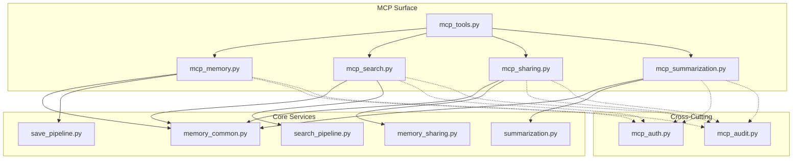
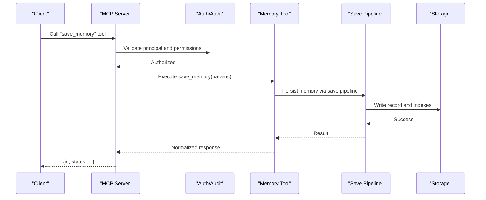
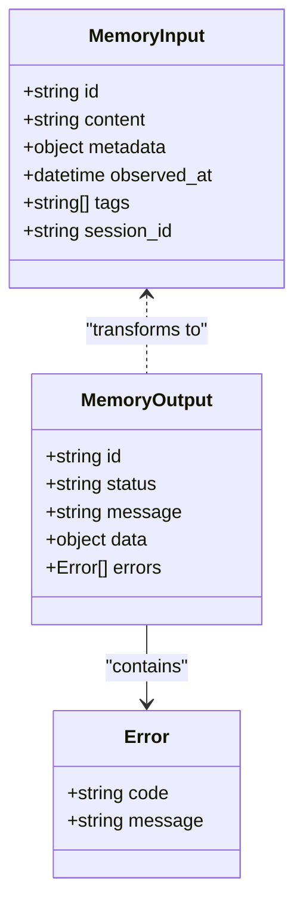
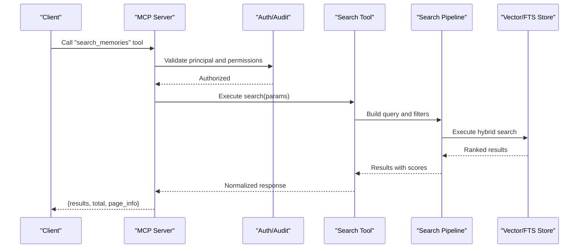
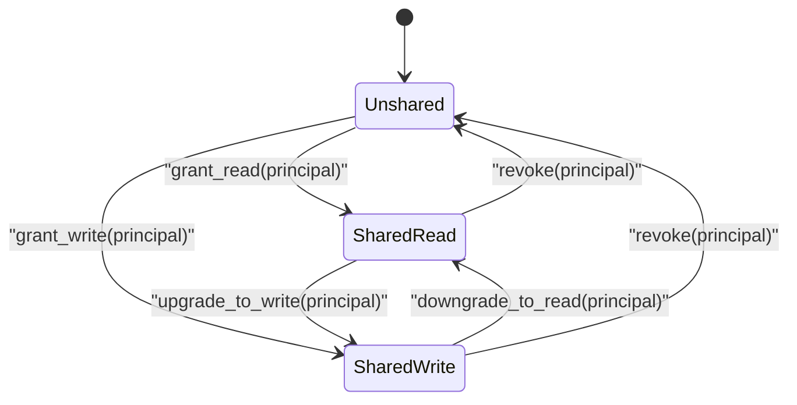
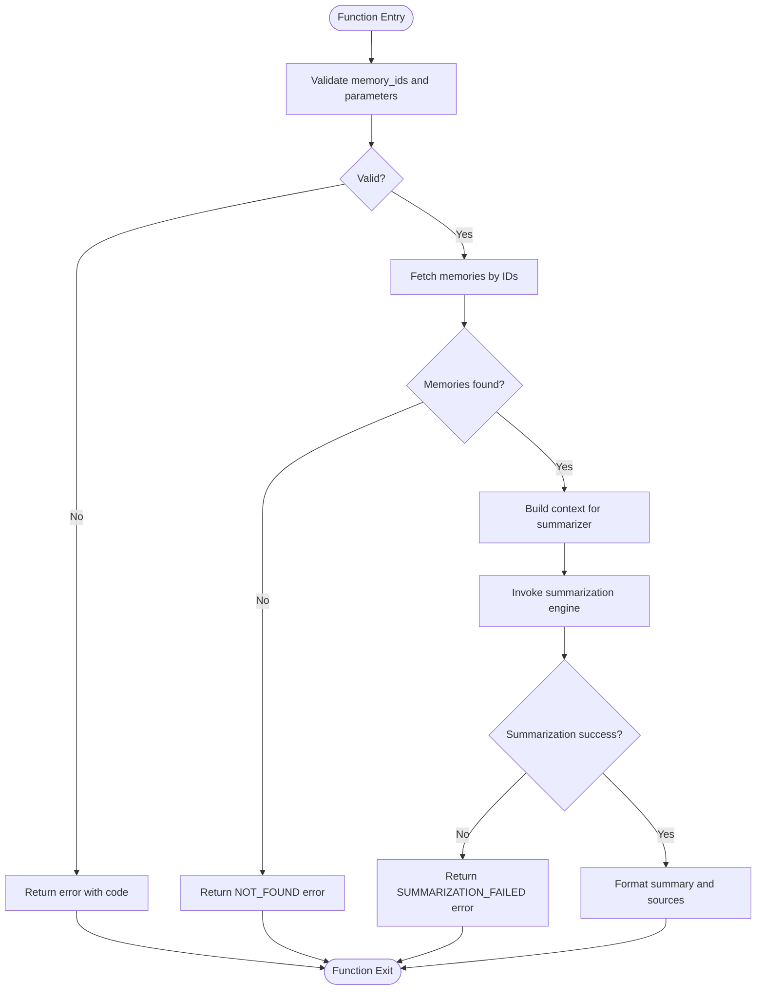
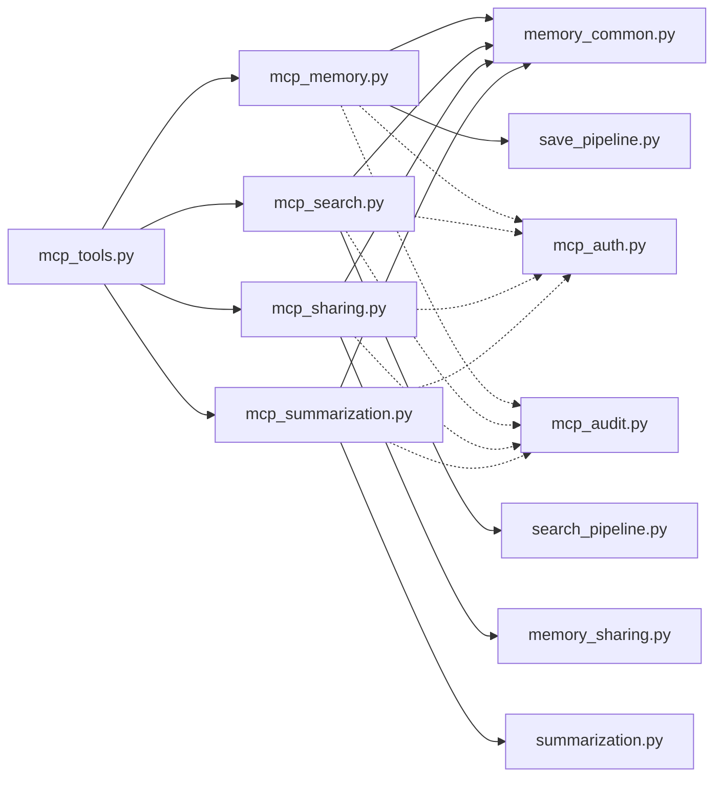

# Memory Operations Tools

<cite>
**Referenced Files in This Document**
- [mcp_memory.py](file://mcp_memory.py)
- [mcp_search.py](file://mcp_search.py)
- [mcp_sharing.py](file://mcp_sharing.py)
- [mcp_summarization.py](file://mcp_summarization.py)
- [mcp_tools.py](file://mcp_tools.py)
- [memory_common.py](file://memory_common.py)
- [search_pipeline.py](file://search_pipeline.py)
- [memory_sharing.py](file://memory_sharing.py)
- [summarization.py](file://summarization.py)
- [save_pipeline.py](file://save_pipeline.py)
- [mcp_auth.py](file://mcp_auth.py)
- [mcp_audit.py](file://mcp_audit.py)
</cite>

## Table of Contents
1. [Introduction](#introduction)
2. [Project Structure](#project-structure)
3. [Core Components](#core-components)
4. [Architecture Overview](#architecture-overview)
5. [Detailed Component Analysis](#detailed-component-analysis)
6. [Dependency Analysis](#dependency-analysis)
7. [Performance Considerations](#performance-considerations)
8. [Troubleshooting Guide](#troubleshooting-guide)
9. [Conclusion](#conclusion)

## Introduction
This document describes the MCP tools that expose memory operations, including CRUD for memories, semantic search, sharing features, and summarization. It explains tool parameters, request/response schemas, error codes, and provides practical examples covering saving memories, performing semantic searches, managing shared memory spaces, and generating summaries. It also covers batch operations, pagination, filtering options, and performance considerations for large datasets.

## Project Structure
The MCP surface for memory operations is implemented across several modules:
- Tool definitions and registration for memory CRUD, search, sharing, and summarization
- Shared models and validation used by multiple tools
- Integration with search pipeline, sharing subsystem, and summarization engine
- Security and audit wiring for MCP calls

**Diagram sources**
- [mcp_memory.py](file://mcp_memory.py)
- [mcp_search.py](file://mcp_search.py)
- [mcp_sharing.py](file://mcp_sharing.py)
- [mcp_summarization.py](file://mcp_summarization.py)
- [mcp_tools.py](file://mcp_tools.py)
- [memory_common.py](file://memory_common.py)
- [search_pipeline.py](file://search_pipeline.py)
- [memory_sharing.py](file://memory_sharing.py)
- [summarization.py](file://summarization.py)
- [save_pipeline.py](file://save_pipeline.py)
- [mcp_auth.py](file://mcp_auth.py)
- [mcp_audit.py](file://mcp_audit.py)

**Section sources**
- [mcp_memory.py](file://mcp_memory.py)
- [mcp_search.py](file://mcp_search.py)
- [mcp_sharing.py](file://mcp_sharing.py)
- [mcp_summarization.py](file://mcp_summarization.py)
- [mcp_tools.py](file://mcp_tools.py)
- [memory_common.py](file://memory_common.py)
- [search_pipeline.py](file://search_pipeline.py)
- [memory_sharing.py](file://memory_sharing.py)
- [summarization.py](file://summarization.py)
- [save_pipeline.py](file://save_pipeline.py)
- [mcp_auth.py](file://mcp_auth.py)
- [mcp_audit.py](file://mcp_audit.py)

## Core Components
- Memory CRUD tools: create, read, update, delete, list, and batch operations for memories
- Search tools: full-text, vector, hybrid, and filtered queries with pagination and scoring
- Sharing tools: manage shared memory spaces, permissions, and access control
- Summarization tools: generate concise summaries from selected memories or query results

These components share common data models and validation logic defined in the core modules.

**Section sources**
- [mcp_memory.py](file://mcp_memory.py)
- [mcp_search.py](file://mcp_search.py)
- [mcp_sharing.py](file://mcp_sharing.py)
- [mcp_summarization.py](file://mcp_summarization.py)
- [memory_common.py](file://memory_common.py)

## Architecture Overview
The MCP layer exposes typed tools to clients. Each tool validates inputs, enforces authz/audit, and delegates to service modules (save pipeline, search pipeline, sharing, summarization). Responses are normalized and returned as MCP tool outputs.

**Diagram sources**
- [mcp_memory.py](file://mcp_memory.py)
- [save_pipeline.py](file://save_pipeline.py)
- [mcp_auth.py](file://mcp_auth.py)
- [mcp_audit.py](file://mcp_audit.py)

## Detailed Component Analysis

### Memory CRUD Tools
Available operations:
- Create a memory
- Read a memory by ID
- Update a memory by ID
- Delete a memory by ID
- List/searchable listing with filters and pagination
- Batch create/update/delete

Key parameters:
- id: string identifier for targeted operations
- content: text or structured payload for create/update
- metadata: key-value pairs for tagging and filtering
- observed_at: timestamp for temporal relevance
- tags: array of strings for categorization
- session_id: optional scoping to a session context
- limit, offset: pagination controls for list operations
- filter fields: e.g., tags, session_id, date ranges

Response schema highlights:
- id: unique memory identifier
- status: success/failure indicator
- message: human-readable result summary
- data: payload containing created/updated/deleted entity details
- errors: array of error objects when applicable

Error codes:
- INVALID_INPUT: malformed or missing required fields
- NOT_FOUND: resource does not exist
- CONFLICT: concurrent modification detected
- PERMISSION_DENIED: insufficient privileges
- RATE_LIMITED: throttled due to rate limits
- INTERNAL_ERROR: unexpected server-side failure

Practical examples:
- Saving a new memory with tags and metadata
- Updating an existing memory’s content and metadata
- Deleting a memory by ID
- Listing memories with tag filters and pagination
- Batch creating multiple memories in one call

**Section sources**
- [mcp_memory.py](file://mcp_memory.py)
- [memory_common.py](file://memory_common.py)
- [save_pipeline.py](file://save_pipeline.py)

#### Class Diagram: Memory Tool Model

**Diagram sources**
- [mcp_memory.py](file://mcp_memory.py)
- [memory_common.py](file://memory_common.py)

### Search Tools
Capabilities:
- Full-text search
- Vector similarity search
- Hybrid search combining both
- Advanced filtering by tags, sessions, time windows
- Pagination and sorting by relevance or recency
- Optional reranking and snippet highlighting

Key parameters:
- query: search string or embedding vector
- mode: fulltext, vector, hybrid
- filters: object specifying tag/session/time constraints
- limit, offset: pagination
- sort_by: relevance or observed_at
- include_snippets: boolean to include matched excerpts
- rerank: boolean to enable reranking phase

Response schema highlights:
- results: array of matched memories with scores
- total: total count matching filters
- page_info: current page, limit, offset
- facets: optional breakdowns by tags or sessions
- errors: array of error objects

Error codes:
- INVALID_QUERY: malformed query or unsupported mode
- FILTER_INVALID: invalid filter specification
- PAGINATION_OUT_OF_RANGE: offset beyond available results
- SEARCH_SERVICE_UNAVAILABLE: downstream search failure
- RATE_LIMITED: throttled due to rate limits
- INTERNAL_ERROR: unexpected server-side failure

Practical examples:
- Semantic search using natural language query
- Filtering by tags and time window
- Paginating through large result sets
- Enabling reranking for higher precision

**Section sources**
- [mcp_search.py](file://mcp_search.py)
- [memory_common.py](file://memory_common.py)
- [search_pipeline.py](file://search_pipeline.py)

#### Sequence Diagram: Search Flow

**Diagram sources**
- [mcp_search.py](file://mcp_search.py)
- [search_pipeline.py](file://search_pipeline.py)
- [mcp_auth.py](file://mcp_auth.py)
- [mcp_audit.py](file://mcp_audit.py)

### Sharing Tools
Capabilities:
- Create and manage shared memory spaces
- Grant and revoke access to agents or principals
- List shared resources and effective permissions
- Query shared memories visible to the caller

Key parameters:
- space_id: identifier for the shared space
- target_principal: agent or user identifier
- permission: read/write/admin levels
- filters: scope by space, principal, or visibility
- limit, offset: pagination

Response schema highlights:
- space: shared space details
- permissions: mapping of principal to permission level
- visible_memories: subset of memories accessible to caller
- errors: array of error objects

Error codes:
- INVALID_SPACE: non-existent or malformed space
- PERMISSION_DENIED: insufficient privileges to modify or view
- DUPLICATE_GRANT: redundant permission assignment
- RATE_LIMITED: throttled due to rate limits
- INTERNAL_ERROR: unexpected server-side failure

Practical examples:
- Creating a shared space and granting write access
- Revoking read access for a specific agent
- Listing all shared spaces visible to the caller
- Fetching shared memories within a space with filters

**Section sources**
- [mcp_sharing.py](file://mcp_sharing.py)
- [memory_sharing.py](file://memory_sharing.py)
- [memory_common.py](file://memory_common.py)

#### State Diagram: Sharing Permissions

**Diagram sources**
- [mcp_sharing.py](file://mcp_sharing.py)
- [memory_sharing.py](file://memory_sharing.py)

### Summarization Tools
Capabilities:
- Generate concise summaries from a set of memories
- Summarize query results or filtered subsets
- Control length and focus via parameters

Key parameters:
- memory_ids: list of identifiers to summarize
- query: optional query to guide focus
- max_length: desired summary length
- style: concise, detailed, bullet points
- include_sources: boolean to attach source references

Response schema highlights:
- summary: generated text
- sources: referenced memory IDs or snippets
- errors: array of error objects

Error codes:
- NO_MEMORY_IDS: empty input set
- SUMMARIZATION_FAILED: model or processing error
- RATE_LIMITED: throttled due to rate limits
- INTERNAL_ERROR: unexpected server-side failure

Practical examples:
- Summarizing recent memories tagged with a topic
- Generating a focused summary based on a query
- Producing a short executive summary with source links

**Section sources**
- [mcp_summarization.py](file://mcp_summarization.py)
- [summarization.py](file://summarization.py)
- [memory_common.py](file://memory_common.py)

#### Flowchart: Summarization Process

**Diagram sources**
- [mcp_summarization.py](file://mcp_summarization.py)
- [summarization.py](file://summarization.py)

## Dependency Analysis
The MCP tools depend on core services and cross-cutting concerns:
- Validation and shared models from memory_common
- Persistence via save_pipeline
- Retrieval via search_pipeline
- Sharing via memory_sharing
- Summarization via summarization
- Authorization and auditing via mcp_auth and mcp_audit

**Diagram sources**
- [mcp_memory.py](file://mcp_memory.py)
- [mcp_search.py](file://mcp_search.py)
- [mcp_sharing.py](file://mcp_sharing.py)
- [mcp_summarization.py](file://mcp_summarization.py)
- [mcp_tools.py](file://mcp_tools.py)
- [memory_common.py](file://memory_common.py)
- [save_pipeline.py](file://save_pipeline.py)
- [search_pipeline.py](file://search_pipeline.py)
- [memory_sharing.py](file://memory_sharing.py)
- [summarization.py](file://summarization.py)
- [mcp_auth.py](file://mcp_auth.py)
- [mcp_audit.py](file://mcp_audit.py)

**Section sources**
- [mcp_tools.py](file://mcp_tools.py)
- [mcp_memory.py](file://mcp_memory.py)
- [mcp_search.py](file://mcp_search.py)
- [mcp_sharing.py](file://mcp_sharing.py)
- [mcp_summarization.py](file://mcp_summarization.py)
- [memory_common.py](file://memory_common.py)
- [save_pipeline.py](file://save_pipeline.py)
- [search_pipeline.py](file://search_pipeline.py)
- [memory_sharing.py](file://memory_sharing.py)
- [summarization.py](file://summarization.py)
- [mcp_auth.py](file://mcp_auth.py)
- [mcp_audit.py](file://mcp_audit.py)

## Performance Considerations
- Use pagination (limit, offset) for large lists and search results to avoid heavy payloads
- Prefer targeted filters (tags, session_id, time windows) to reduce search scope
- Enable reranking only when necessary; it adds latency but improves precision
- For batch operations, group related writes to minimize round trips while respecting rate limits
- Cache frequent queries at the client side when appropriate
- Monitor rate limiting and backoff strategies to handle throttling gracefully
- For very large corpora, consider incremental updates and periodic index maintenance

[No sources needed since this section provides general guidance]

## Troubleshooting Guide
Common issues and resolutions:
- INVALID_INPUT: verify required fields and types; ensure timestamps and IDs conform to expected formats
- NOT_FOUND: confirm resource existence and correct scoping (tenant, session)
- CONFLICT: implement retry with idempotency tokens for concurrent updates
- PERMISSION_DENIED: check principal roles and shared space grants
- RATE_LIMITED: implement exponential backoff and reduce request frequency
- INTERNAL_ERROR: review audit logs and metrics; escalate if persistent

Operational checks:
- Ensure authentication headers and scopes are valid
- Confirm audit logging is enabled for traceability
- Validate configuration drift and policy enforcement settings

**Section sources**
- [mcp_auth.py](file://mcp_auth.py)
- [mcp_audit.py](file://mcp_audit.py)

## Conclusion
The MCP tools provide a comprehensive interface for memory operations, including CRUD, semantic search, sharing, and summarization. By leveraging shared models, robust pipelines, and strong security/audit controls, these tools support scalable and reliable memory workflows. Follow the parameter guidelines, handle errors consistently, and apply performance best practices to optimize usage at scale.