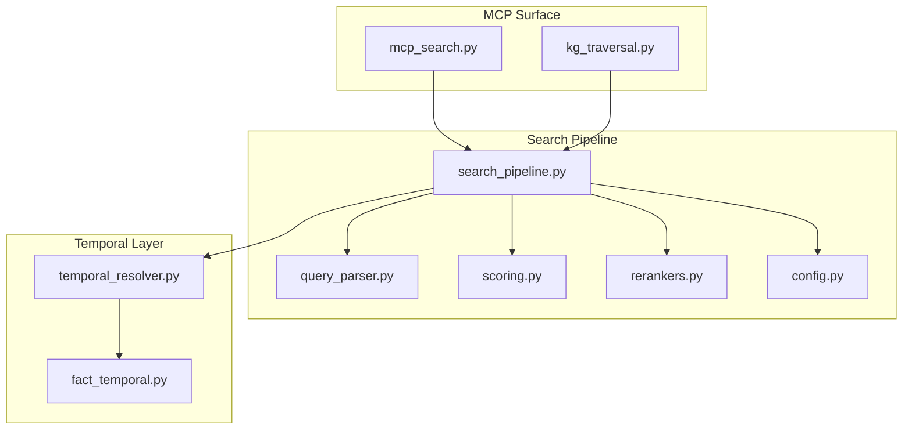
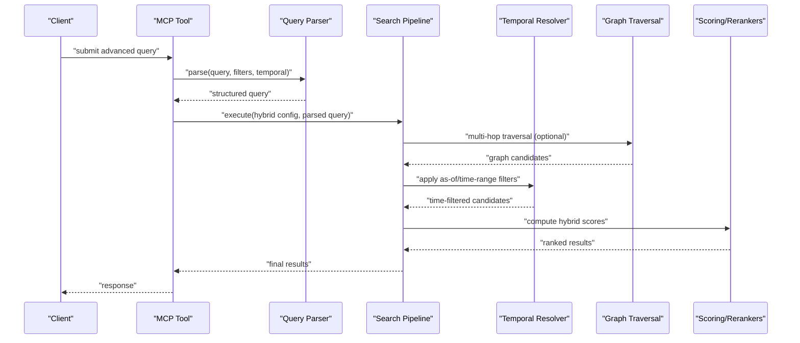
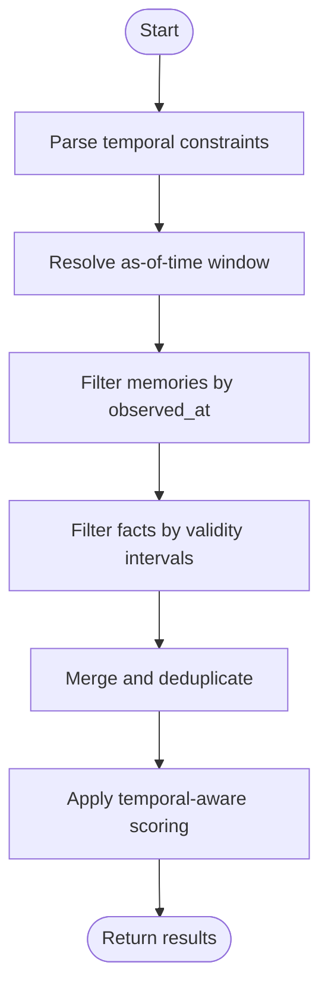
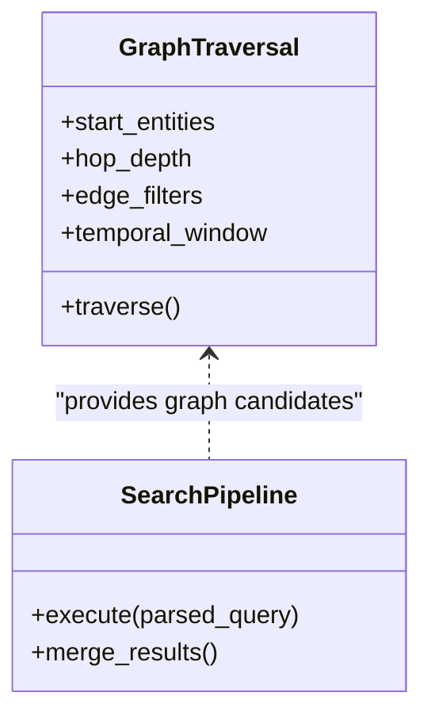
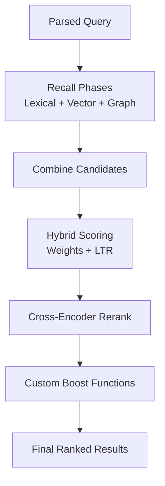
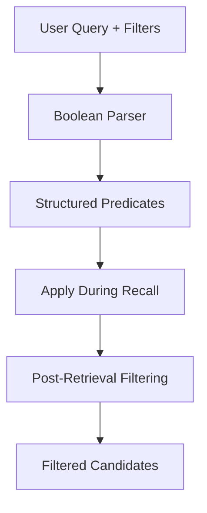
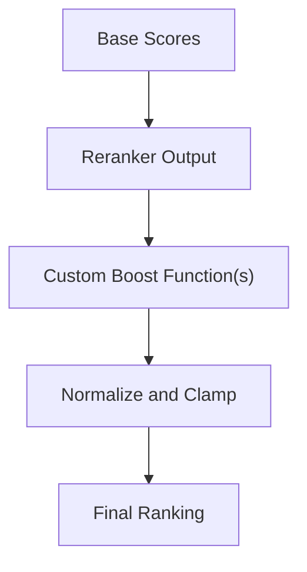
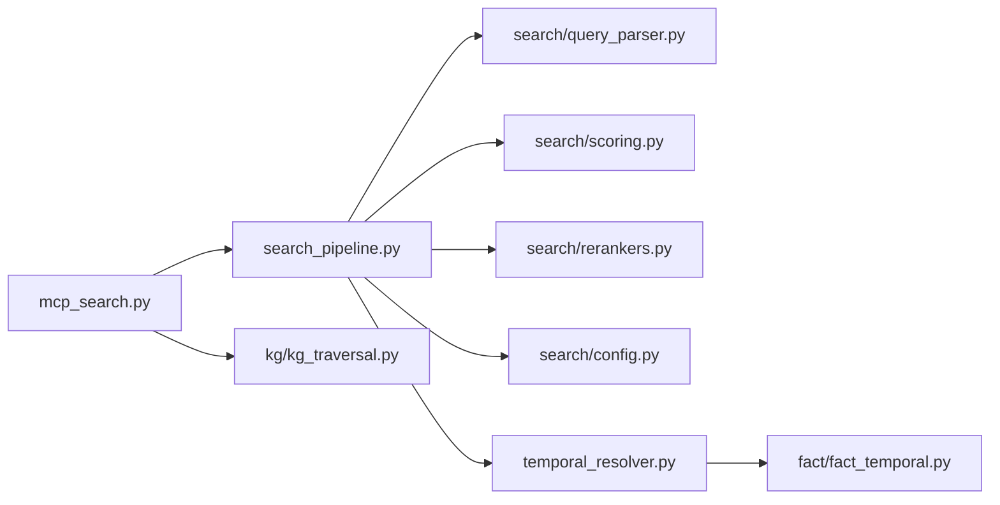

# Advanced Query Features

<cite>
**Referenced Files in This Document**
- [mcp_search.py](file://mcp_search.py)
- [kg_traversal.py](file://kg/ kg_traversal.py)
- [kg_traversal.py](file://kg/kg_traversal.py)
- [search_pipeline.py](file://search_pipeline.py)
- [query_parser.py](file://search/query_parser.py)
- [scoring.py](file://search/scoring.py)
- [rerankers.py](file://search/rerankers.py)
- [config.py](file://search/config.py)
- [temporal_resolver.py](file://temporal_resolver.py)
- [fact_temporal.py](file://fact/fact_temporal.py)
- [test_multi_hop_traversal.py](file://eval/test_multi_hop_traversal.py)
- [test_search_temporal_as_of.py](file://eval/test_search_temporal_as_of.py)
- [test_hybrid_strategy.py](file://eval/test_hybrid_strategy.py)
- [test_advanced_features.py](file://eval/test_advanced_features.py)
</cite>

## Table of Contents
1. [Introduction](#introduction)
2. [Project Structure](#project-structure)
3. [Core Components](#core-components)
4. [Architecture Overview](#architecture-overview)
5. [Detailed Component Analysis](#detailed-component-analysis)
6. [Dependency Analysis](#dependency-analysis)
7. [Performance Considerations](#performance-considerations)
8. [Troubleshooting Guide](#troubleshooting-guide)
9. [Conclusion](#conclusion)
10. [Appendices](#appendices)

## Introduction
This document explains advanced querying capabilities exposed through MCP tools, focusing on:
- Temporal queries with time-based filtering and as-of semantics
- Multi-hop graph traversal for complex relationship queries
- Hybrid search configuration combining multiple ranking strategies
- Advanced filtering options, boolean logic, and custom scoring functions
- Examples that combine knowledge graph traversal, semantic search, temporal constraints, and result boosting based on relevance signals

The goal is to help you build sophisticated queries that leverage the full power of the memory system’s retrieval pipeline.

## Project Structure
Advanced query features are implemented across several modules:
- MCP tool surface for search and graph traversal
- Search pipeline orchestration and phases
- Query parsing and scoring/reranking
- Temporal resolution and fact-level temporal support
- Tests demonstrating multi-hop traversal, hybrid strategies, and temporal queries

**Diagram sources**
- [mcp_search.py](file://mcp_search.py)
- [kg_traversal.py](file://kg/kg_traversal.py)
- [search_pipeline.py](file://search_pipeline.py)
- [query_parser.py](file://search/query_parser.py)
- [scoring.py](file://search/scoring.py)
- [rerankers.py](file://search/rerankers.py)
- [config.py](file://search/config.py)
- [temporal_resolver.py](file://temporal_resolver.py)
- [fact_temporal.py](file://fact/fact_temporal.py)

**Section sources**
- [mcp_search.py](file://mcp_search.py)
- [kg_traversal.py](file://kg/kg_traversal.py)
- [search_pipeline.py](file://search_pipeline.py)
- [query_parser.py](file://search/query_parser.py)
- [scoring.py](file://search/scoring.py)
- [rerankers.py](file://search/rerankers.py)
- [config.py](file://search/config.py)
- [temporal_resolver.py](file://temporal_resolver.py)
- [fact_temporal.py](file://fact/fact_temporal.py)

## Core Components
- MCP search tool: Accepts structured query parameters including filters, temporal constraints, and hybrid strategy configuration; orchestrates retrieval and returns ranked results.
- Graph traversal tool: Executes multi-hop traversals over entities and relationships, optionally constrained by temporal windows and filters.
- Search pipeline: Parses queries, executes recall phases (semantic, lexical, graph), applies scoring and reranking, and merges results.
- Temporal resolver: Applies as-of-time semantics and temporal filters to both memories and facts.
- Scoring and reranking: Combines BM25-like scores, vector similarity, learned-to-rank features, and cross-encoders; supports custom boost functions.

Key responsibilities:
- Parse and validate advanced query syntax (boolean operators, field filters, temporal ranges).
- Compose hybrid strategies with configurable weights and fallbacks.
- Integrate graph traversal results into unified ranking.
- Apply temporal constraints consistently across all recall sources.

**Section sources**
- [mcp_search.py](file://mcp_search.py)
- [kg_traversal.py](file://kg/kg_traversal.py)
- [search_pipeline.py](file://search_pipeline.py)
- [query_parser.py](file://search/query_parser.py)
- [scoring.py](file://search/scoring.py)
- [rerankers.py](file://search/rerankers.py)
- [config.py](file://search/config.py)
- [temporal_resolver.py](file://temporal_resolver.py)
- [fact_temporal.py](file://fact/fact_temporal.py)

## Architecture Overview
The following sequence shows how an advanced query flows through the system when invoked via MCP tools.

**Diagram sources**
- [mcp_search.py](file://mcp_search.py)
- [kg_traversal.py](file://kg/kg_traversal.py)
- [search_pipeline.py](file://search_pipeline.py)
- [query_parser.py](file://search/query_parser.py)
- [scoring.py](file://search/scoring.py)
- [rerankers.py](file://search/rerankers.py)
- [temporal_resolver.py](file://temporal_resolver.py)

## Detailed Component Analysis

### Temporal Queries and As-of-Time Filtering
- Time-based filtering supports:
  - Absolute timestamps and relative windows
  - As-of-time semantics to view state at a specific point in time
  - Fact-level temporal constraints for precise historical accuracy
- Integration points:
  - Temporal resolver enforces constraints during candidate generation and final ranking
  - Facts layer provides granular temporal validity for knowledge graph assertions

**Diagram sources**
- [temporal_resolver.py](file://temporal_resolver.py)
- [fact_temporal.py](file://fact/fact_temporal.py)

**Section sources**
- [test_search_temporal_as_of.py](file://eval/test_search_temporal_as_of.py)
- [temporal_resolver.py](file://temporal_resolver.py)
- [fact_temporal.py](file://fact/fact_temporal.py)

### Multi-Hop Graph Traversal
- Supports traversing entity relationships beyond immediate neighbors:
  - Configurable hop depth and path constraints
  - Optional temporal scoping per hop
  - Result merging with semantic search candidates
- Use cases:
  - Find documents related to entities connected to a seed concept
  - Discover indirect associations for richer context

**Diagram sources**
- [kg_traversal.py](file://kg/kg_traversal.py)
- [search_pipeline.py](file://search_pipeline.py)

**Section sources**
- [test_multi_hop_traversal.py](file://eval/test_multi_hop_traversal.py)
- [kg_traversal.py](file://kg/kg_traversal.py)
- [search_pipeline.py](file://search_pipeline.py)

### Hybrid Search Configuration and Ranking Strategies
- Hybrid strategies combine:
  - Lexical matching (BM25-like)
  - Vector similarity
  - Learned-to-rank features
  - Cross-encoder reranking
- Configuration includes:
  - Weights per strategy
  - Fallback behavior when one source yields no results
  - Custom boost functions applied post-ranking

**Diagram sources**
- [scoring.py](file://search/scoring.py)
- [rerankers.py](file://search/rerankers.py)
- [config.py](file://search/config.py)
- [search_pipeline.py](file://search_pipeline.py)

**Section sources**
- [test_hybrid_strategy.py](file://eval/test_hybrid_strategy.py)
- [scoring.py](file://search/scoring.py)
- [rerankers.py](file://search/rerankers.py)
- [config.py](file://search/config.py)
- [search_pipeline.py](file://search_pipeline.py)

### Advanced Filtering and Boolean Logic
- Field-level filters:
  - Entity types, tags, provenance, session scope
  - Negation and inclusion lists
- Boolean composition:
  - AND/OR/NOT across fields and clauses
  - Nested expressions for complex conditions
- Integration:
  - Parsed into structured predicates applied during recall and post-filtering

**Diagram sources**
- [query_parser.py](file://search/query_parser.py)
- [search_pipeline.py](file://search_pipeline.py)

**Section sources**
- [query_parser.py](file://search/query_parser.py)
- [search_pipeline.py](file://search_pipeline.py)

### Custom Scoring Functions and Relevance Boosting
- Custom boosts can be defined to elevate results based on:
  - Recency or freshness signals
  - Provenance trustworthiness
  - User interaction feedback (CTR)
  - Domain-specific heuristics
- Execution model:
  - Applied after initial hybrid scoring and optional reranking
  - Configurable per query to adapt to context

**Diagram sources**
- [scoring.py](file://search/scoring.py)
- [rerankers.py](file://search/rerankers.py)

**Section sources**
- [scoring.py](file://search/scoring.py)
- [rerankers.py](file://search/rerankers.py)

### Building Sophisticated Queries: Examples
- Combine knowledge graph traversal with semantic search:
  - Seed entities -> multi-hop traversal -> merge with vector recall -> apply hybrid scoring
- Add temporal constraints:
  - As-of-time filter to restrict to historical state
  - Fact-level validity to ensure accurate assertions
- Apply result boosting:
  - Boost by recency for recent decisions
  - Boost by provenance trust for authoritative sources
- Compose boolean filters:
  - Include specific entity types and exclude low-confidence sources
  - Use nested clauses to refine scope

These patterns are validated by tests covering multi-hop traversal, hybrid strategies, and temporal queries.

**Section sources**
- [test_multi_hop_traversal.py](file://eval/test_multi_hop_traversal.py)
- [test_hybrid_strategy.py](file://eval/test_hybrid_strategy.py)
- [test_search_temporal_as_of.py](file://eval/test_search_temporal_as_of.py)
- [test_advanced_features.py](file://eval/test_advanced_features.py)

## Dependency Analysis
The advanced query feature set depends on tight integration between MCP tools, the search pipeline, and supporting layers.

**Diagram sources**
- [mcp_search.py](file://mcp_search.py)
- [kg_traversal.py](file://kg/kg_traversal.py)
- [search_pipeline.py](file://search_pipeline.py)
- [query_parser.py](file://search/query_parser.py)
- [scoring.py](file://search/scoring.py)
- [rerankers.py](file://search/rerankers.py)
- [config.py](file://search/config.py)
- [temporal_resolver.py](file://temporal_resolver.py)
- [fact_temporal.py](file://fact/fact_temporal.py)

**Section sources**
- [mcp_search.py](file://mcp_search.py)
- [kg_traversal.py](file://kg/kg_traversal.py)
- [search_pipeline.py](file://search_pipeline.py)
- [query_parser.py](file://search/query_parser.py)
- [scoring.py](file://search/scoring.py)
- [rerankers.py](file://search/rerankers.py)
- [config.py](file://search/config.py)
- [temporal_resolver.py](file://temporal_resolver.py)
- [fact_temporal.py](file://fact/fact_temporal.py)

## Performance Considerations
- Limit hop depth and edge filters in graph traversal to avoid combinatorial explosion.
- Prefer targeted temporal windows to reduce candidate sets early.
- Tune hybrid weights to balance recall breadth vs. precision.
- Use rerankers judiciously; they add latency but improve ranking quality.
- Cache frequent query patterns and reuse parsed predicates where possible.

[No sources needed since this section provides general guidance]

## Troubleshooting Guide
Common issues and diagnostics:
- Empty results due to overly restrictive filters:
  - Relax boolean clauses and broaden temporal windows
- Slow queries from deep graph hops:
  - Reduce hop depth, constrain edges, and pre-filter seeds
- Inconsistent temporal results:
  - Verify as-of-time inputs and fact validity intervals
- Poor ranking quality:
  - Adjust hybrid weights and enable reranking for top-k only

Validation references:
- Multi-hop traversal correctness and performance
- Hybrid strategy behavior under different configurations
- Temporal as-of semantics consistency

**Section sources**
- [test_multi_hop_traversal.py](file://eval/test_multi_hop_traversal.py)
- [test_hybrid_strategy.py](file://eval/test_hybrid_strategy.py)
- [test_search_temporal_as_of.py](file://eval/test_search_temporal_as_of.py)
- [test_advanced_features.py](file://eval/test_advanced_features.py)

## Conclusion
Advanced querying through MCP tools enables powerful combinations of semantic search, knowledge graph traversal, temporal constraints, and flexible ranking. By composing boolean filters, hybrid strategies, and custom boosts, you can tailor retrieval to complex use cases while maintaining performance and accuracy.

[No sources needed since this section summarizes without analyzing specific files]

## Appendices
- For API usage examples and parameter schemas, refer to MCP tool documentation and test suites referenced above.
- For implementation details of each phase, consult the corresponding module sources listed in this document.

[No sources needed since this section provides general guidance]