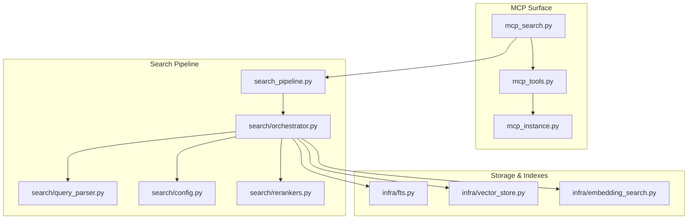
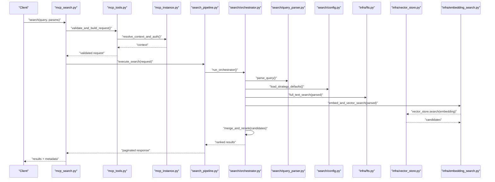
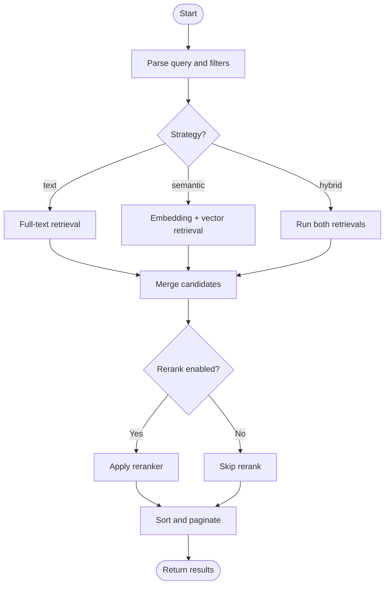
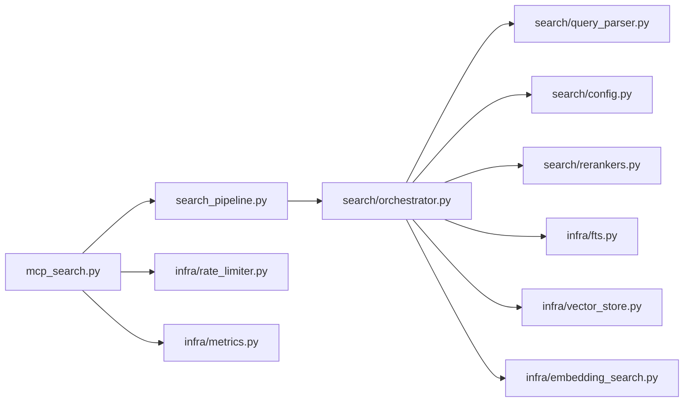

# Basic Search Operations

<cite>
**Referenced Files in This Document**
- [mcp_search.py](file://mcp_search.py)
- [search_pipeline.py](file://search_pipeline.py)
- [orchestrator.py](file://search/orchestrator.py)
- [query_parser.py](file://search/query_parser.py)
- [config.py](file://search/config.py)
- [rerankers.py](file://search/rerankers.py)
- [embedding_search.py](file://infra/embedding_search.py)
- [fts.py](file://infra/fts.py)
- [vector_store.py](file://infra/vector_store.py)
- [mcp_tools.py](file://mcp_tools.py)
- [mcp_instance.py](file://mcp_instance.py)
- [memory_config.py](file://memory_config.py)
- [rate_limiter.py](file://infra/rate_limiter.py)
- [metrics.py](file://infra/metrics.py)
</cite>

## Table of Contents
1. [Introduction](#introduction)
2. [Project Structure](#project-structure)
3. [Core Components](#core-components)
4. [Architecture Overview](#architecture-overview)
5. [Detailed Component Analysis](#detailed-component-analysis)
6. [Dependency Analysis](#dependency-analysis)
7. [Performance Considerations](#performance-considerations)
8. [Troubleshooting Guide](#troubleshooting-guide)
9. [Conclusion](#conclusion)
10. [Appendices](#appendices)

## Introduction
This document explains basic search operations exposed via MCP tools, focusing on:
- Text-based queries (keyword/full-text search)
- Semantic search using embeddings
- Hybrid search combining text and semantic signals
It covers query parameters, filtering, pagination, sorting, common patterns (keyword matching, fuzzy search, limiting results), error handling, response formats, and performance considerations.

## Project Structure
The MCP surface exposes search capabilities through a dedicated tool module that delegates to the internal search pipeline. The pipeline orchestrates multiple phases including query parsing, retrieval from full-text and vector stores, reranking, and result assembly.

**Diagram sources**
- [mcp_search.py](file://mcp_search.py)
- [mcp_tools.py](file://mcp_tools.py)
- [mcp_instance.py](file://mcp_instance.py)
- [search_pipeline.py](file://search_pipeline.py)
- [orchestrator.py](file://search/orchestrator.py)
- [query_parser.py](file://search/query_parser.py)
- [config.py](file://search/config.py)
- [rerankers.py](file://search/rerankers.py)
- [fts.py](file://infra/fts.py)
- [vector_store.py](file://infra/vector_store.py)
- [embedding_search.py](file://infra/embedding_search.py)

**Section sources**
- [mcp_search.py](file://mcp_search.py)
- [mcp_tools.py](file://mcp_tools.py)
- [mcp_instance.py](file://mcp_instance.py)
- [search_pipeline.py](file://search_pipeline.py)
- [orchestrator.py](file://search/orchestrator.py)
- [query_parser.py](file://search/query_parser.py)
- [config.py](file://search/config.py)
- [rerankers.py](file://search/rerankers.py)
- [fts.py](file://infra/fts.py)
- [vector_store.py](file://infra/vector_store.py)
- [embedding_search.py](file://infra/embedding_search.py)

## Core Components
- MCP search tool entrypoint: Exposes search endpoints to clients via MCP protocol. It validates inputs, constructs requests for the search pipeline, and returns standardized responses.
- Search pipeline: Orchestrates query parsing, retrieval strategies (text, semantic, hybrid), reranking, and final result formatting.
- Query parser: Normalizes user input into structured query objects with filters, boosts, and options.
- Config: Provides defaults and runtime overrides for search behavior (e.g., strategy selection, limits).
- Rerankers: Optional cross-encoder or model-based re-scoring applied after initial retrieval.
- Storage backends: Full-text search index, vector store, and embedding utilities used by the pipeline.

Key responsibilities:
- Input validation and normalization
- Strategy selection (text-only, semantic-only, hybrid)
- Retrieval from appropriate indexes
- Reranking and scoring
- Pagination and sorting
- Error handling and metrics

**Section sources**
- [mcp_search.py](file://mcp_search.py)
- [search_pipeline.py](file://search_pipeline.py)
- [orchestrator.py](file://search/orchestrator.py)
- [query_parser.py](file://search/query_parser.py)
- [config.py](file://search/config.py)
- [rerankers.py](file://search/rerankers.py)
- [fts.py](file://infra/fts.py)
- [vector_store.py](file://infra/vector_store.py)
- [embedding_search.py](file://infra/embedding_search.py)

## Architecture Overview
The MCP search flow is layered:
- Client calls MCP search tool
- Tool validates request and forwards to search pipeline
- Pipeline parses query, selects strategy, retrieves candidates, reranks, and assembles results
- Results are paginated and returned to client

**Diagram sources**
- [mcp_search.py](file://mcp_search.py)
- [mcp_tools.py](file://mcp_tools.py)
- [mcp_instance.py](file://mcp_instance.py)
- [search_pipeline.py](file://search_pipeline.py)
- [orchestrator.py](file://search/orchestrator.py)
- [query_parser.py](file://search/query_parser.py)
- [config.py](file://search/config.py)
- [fts.py](file://infra/fts.py)
- [vector_store.py](file://infra/vector_store.py)
- [embedding_search.py](file://infra/embedding_search.py)

## Detailed Component Analysis

### MCP Search Tool Interface
Responsibilities:
- Accepts user-facing parameters such as query text, strategy, filters, page size, sort, and offset
- Validates inputs and maps them to internal request structures
- Delegates execution to the search pipeline
- Returns standardized JSON-like responses with results and metadata

Common parameters:
- query: string
- strategy: one of "text", "semantic", "hybrid"
- filters: object with keys like source_type, tags, date range, etc.
- limit: integer (page size)
- offset: integer (pagination cursor)
- sort: field and direction
- include_scores: boolean
- rerank: boolean

Response shape:
- results: array of items with id, score, snippet, metadata
- pagination: { total, page_size, offset }
- meta: { strategy_used, timing, warnings }

Error handling:
- Invalid parameters return structured errors with messages and codes
- Rate limiting returns retry-after hints when applicable
- Backend failures propagate with actionable diagnostics

**Section sources**
- [mcp_search.py](file://mcp_search.py)
- [mcp_tools.py](file://mcp_tools.py)
- [mcp_instance.py](file://mcp_instance.py)

### Search Pipeline and Orchestrator
Responsibilities:
- Parse and normalize query into a structured representation
- Select retrieval strategy based on config and request
- Execute parallel retrievals from full-text and vector backends
- Merge candidate sets, apply reranking if enabled
- Apply filters, sorting, and pagination
- Return final ranked results

Key modules:
- query_parser: tokenization, query expansion, filter extraction
- orchestrator: coordination of retrieval and reranking
- config: default strategies, weights, and limits
- rerankers: optional cross-encoder or learned-to-rank models

**Diagram sources**
- [search_pipeline.py](file://search_pipeline.py)
- [orchestrator.py](file://search/orchestrator.py)
- [query_parser.py](file://search/query_parser.py)
- [config.py](file://search/config.py)
- [rerankers.py](file://search/rerankers.py)
- [fts.py](file://infra/fts.py)
- [vector_store.py](file://infra/vector_store.py)
- [embedding_search.py](file://infra/embedding_search.py)

**Section sources**
- [search_pipeline.py](file://search_pipeline.py)
- [orchestrator.py](file://search/orchestrator.py)
- [query_parser.py](file://search/query_parser.py)
- [config.py](file://search/config.py)
- [rerankers.py](file://search/rerankers.py)

### Full-Text Search (Text-Based Queries)
Capabilities:
- Keyword matching across indexed fields
- Phrase and proximity searches
- Boolean operators and field scoping
- Fuzzy matching via edit distance or wildcard expansion

Parameters:
- query: plain text or structured query language
- fields: subset of indexed fields to search
- fuzziness: threshold or auto
- boost: per-term or per-field weighting

Behavior:
- Uses full-text index backend
- Fast, precise for exact terms
- May miss semantic intent

**Section sources**
- [fts.py](file://infra/fts.py)
- [query_parser.py](file://search/query_parser.py)

### Semantic Search (Embeddings)
Capabilities:
- Vector similarity search over dense embeddings
- Captures meaning beyond literal keywords
- Works well for paraphrases and conceptual matches

Parameters:
- query: natural language text
- top_k: number of nearest neighbors
- metric: cosine or dot product
- filters: pre-filtering before vector search

Behavior:
- Converts query to embedding
- Queries vector store for similar vectors
- Returns candidates with similarity scores

**Section sources**
- [embedding_search.py](file://infra/embedding_search.py)
- [vector_store.py](file://infra/vector_store.py)

### Hybrid Search (Combined Approach)
Capabilities:
- Combines full-text and semantic retrieval
- Merges candidate lists and applies reranking
- Balances precision and recall

Parameters:
- strategy: "hybrid"
- text_weight, semantic_weight: relative importance
- rerank: enable cross-encoder or learned reranker

Behavior:
- Runs both retrievers in parallel
- Deduplicates and merges candidates
- Applies reranking and final scoring

**Section sources**
- [orchestrator.py](file://search/orchestrator.py)
- [rerankers.py](file://search/rerankers.py)
- [config.py](file://search/config.py)

### Filtering, Sorting, and Pagination
Filtering:
- By source type, tags, author, date ranges, custom attributes
- Applied at retrieval stage where possible for efficiency

Sorting:
- By relevance score, recency, or custom fields
- Direction: ascending/descending

Pagination:
- limit: page size
- offset: starting position
- total: total count when available

Best practices:
- Use filters early to reduce candidate set
- Keep limit reasonable to control latency
- Prefer offset-based pagination for simple cases; consider keyset pagination for large datasets

**Section sources**
- [query_parser.py](file://search/query_parser.py)
- [orchestrator.py](file://search/orchestrator.py)
- [config.py](file://search/config.py)

### Common Search Patterns
- Keyword matching: use strategy "text" with explicit terms and field scoping
- Fuzzy search: enable fuzziness or wildcards in text mode
- Result limiting: set small limit for quick previews; increase for comprehensive lists
- Semantic discovery: use strategy "semantic" for conceptual queries
- Hybrid balance: tune text_weight and semantic_weight for your corpus
- Time-bound retrieval: add date range filters for recent content

[No sources needed since this section provides general guidance]

## Dependency Analysis
High-level dependencies among components:

**Diagram sources**
- [mcp_search.py](file://mcp_search.py)
- [search_pipeline.py](file://search_pipeline.py)
- [orchestrator.py](file://search/orchestrator.py)
- [query_parser.py](file://search/query_parser.py)
- [config.py](file://search/config.py)
- [rerankers.py](file://search/rerankers.py)
- [fts.py](file://infra/fts.py)
- [vector_store.py](file://infra/vector_store.py)
- [embedding_search.py](file://infra/embedding_search.py)
- [rate_limiter.py](file://infra/rate_limiter.py)
- [metrics.py](file://infra/metrics.py)

**Section sources**
- [mcp_search.py](file://mcp_search.py)
- [search_pipeline.py](file://search_pipeline.py)
- [orchestrator.py](file://search/orchestrator.py)
- [query_parser.py](file://search/query_parser.py)
- [config.py](file://search/config.py)
- [rerankers.py](file://search/rerankers.py)
- [fts.py](file://infra/fts.py)
- [vector_store.py](file://infra/vector_store.py)
- [embedding_search.py](file://infra/embedding_search.py)
- [rate_limiter.py](file://infra/rate_limiter.py)
- [metrics.py](file://infra/metrics.py)

## Performance Considerations
- Choose strategy wisely:
  - "text" for fast, precise keyword queries
  - "semantic" for conceptual queries but higher latency
  - "hybrid" for best recall/precision trade-off
- Use filters early to reduce candidate sets
- Limit page sizes; avoid very large offsets
- Enable reranking only when necessary due to additional compute cost
- Monitor rate limits and back off on throttling
- Cache frequent queries when appropriate at the application layer

[No sources needed since this section provides general guidance]

## Troubleshooting Guide
Common issues and resolutions:
- Empty results:
  - Verify query terms exist in index
  - Try broader terms or switch to semantic/hybrid
  - Check filters for overly restrictive constraints
- Slow queries:
  - Reduce limit and offset
  - Add filters to narrow scope
  - Disable reranking temporarily
- Rate-limited responses:
  - Implement exponential backoff
  - Batch requests or cache results
- Inconsistent rankings:
  - Ensure deterministic sort keys when tie-breaking
  - Confirm reranker configuration stability

Operational checks:
- Inspect metrics for latency and error rates
- Validate configuration defaults and overrides
- Review logs for upstream storage errors

**Section sources**
- [rate_limiter.py](file://infra/rate_limiter.py)
- [metrics.py](file://infra/metrics.py)

## Conclusion
Basic search operations via MCP provide flexible access to text, semantic, and hybrid retrieval. By tuning strategy, filters, pagination, and reranking, you can achieve responsive and accurate results tailored to your use case. Follow the recommended patterns and performance tips to maintain reliability and scalability.

[No sources needed since this section summarizes without analyzing specific files]

## Appendices

### API Reference Summary
- Endpoints:
  - search(query, strategy, filters, limit, offset, sort, include_scores, rerank)
- Strategies:
  - text: full-text search
  - semantic: embedding-based search
  - hybrid: combined retrieval with reranking
- Filters:
  - source_type, tags, author, date_range, custom fields
- Sorting:
  - score desc (default), recency asc/desc, custom fields
- Pagination:
  - limit (page size), offset (start index)
- Response:
  - results[], pagination{total, page_size, offset}, meta{strategy_used, timing, warnings}

[No sources needed since this section provides general guidance]