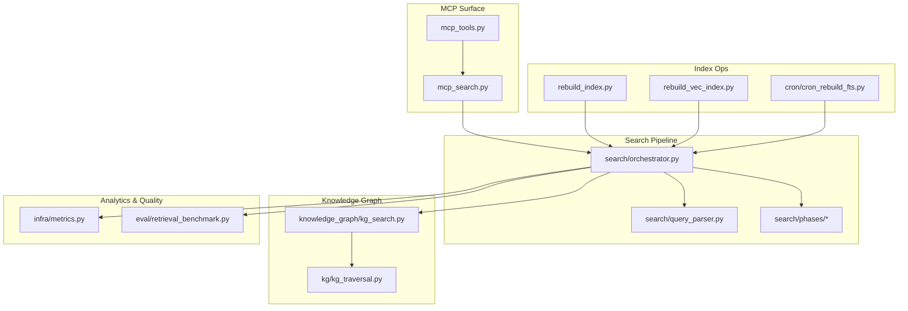
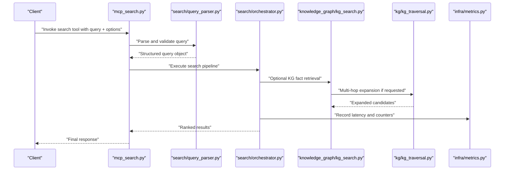
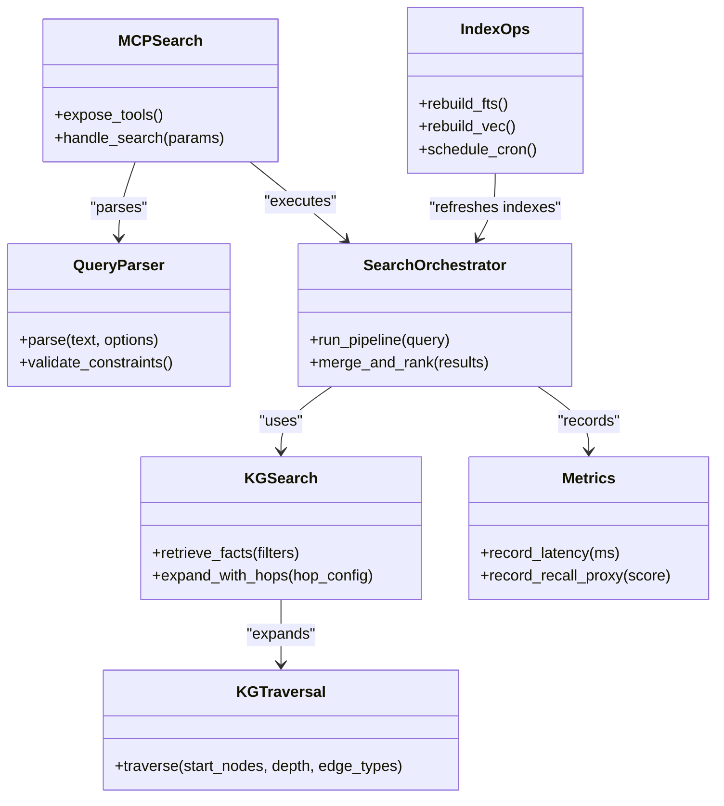
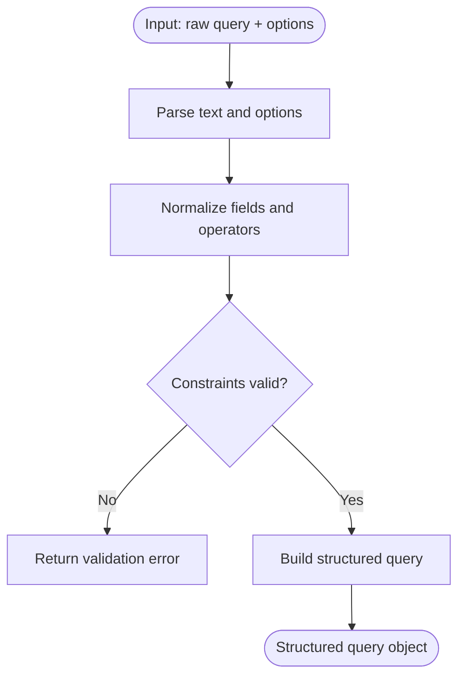
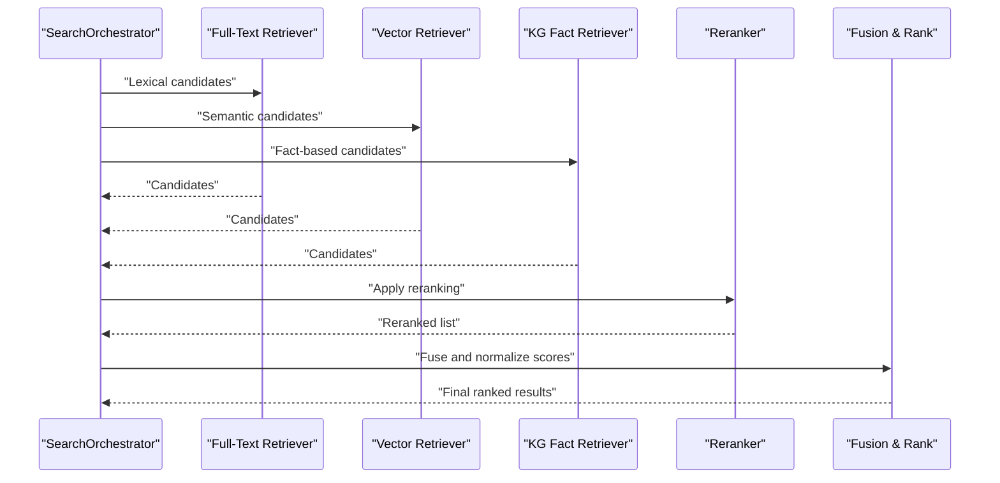
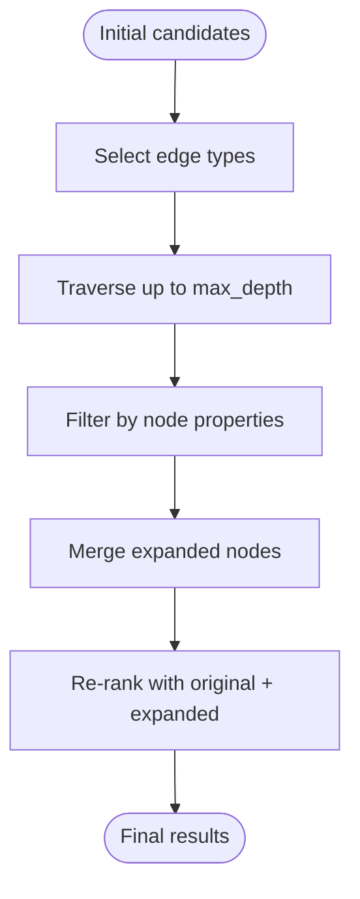
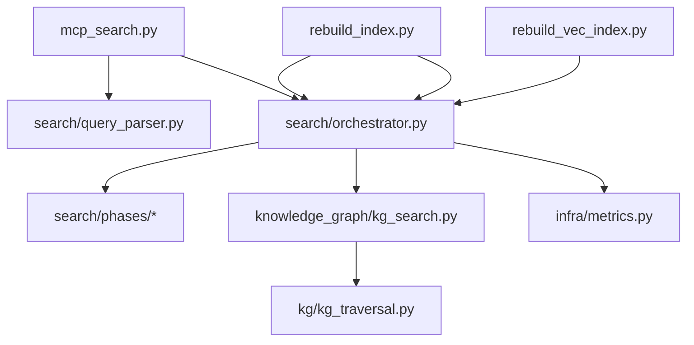

# Search and Retrieval Tools

<cite>
**Referenced Files in This Document**
- [mcp_search.py](file://mcp_search.py)
- [mcp_tools.py](file://mcp_tools.py)
- [search/orchestrator.py](file://search/orchestrator.py)
- [search/query_parser.py](file://search/query_parser.py)
- [search/phases/](file://search/phases/)
- [kg/kg_traversal.py](file://kg/kg_traversal.py)
- [knowledge_graph/kg_search.py](file://knowledge_graph/kg_search.py)
- [cron/cron_rebuild_fts.py](file://cron/cron_rebuild_fts.py)
- [rebuild_index.py](file://rebuild_index.py)
- [rebuild_vec_index.py](file://rebuild_vec_index.py)
- [infra/metrics.py](file://infra/metrics.py)
- [eval/retrieval_benchmark.py](file://eval/retrieval_benchmark.py)
- [docs/reference/mcp-tools.md](file://docs/reference/mcp-tools.md)
</cite>

## Table of Contents
1. [Introduction](#introduction)
2. [Project Structure](#project-structure)
3. [Core Components](#core-components)
4. [Architecture Overview](#architecture-overview)
5. [Detailed Component Analysis](#detailed-component-analysis)
6. [Dependency Analysis](#dependency-analysis)
7. [Performance Considerations](#performance-considerations)
8. [Troubleshooting Guide](#troubleshooting-guide)
9. [Conclusion](#conclusion)
10. [Appendices](#appendices)

## Introduction
This document explains the MCP tools for search and retrieval operations, focusing on query construction, result filtering, ranking customization, advanced features (temporal queries, multi-hop traversal, hybrid search), performance tuning, analytics, quality metrics, and index rebuilding. It is intended for both technical and non-technical users who need to build complex search workflows via the MCP interface.

## Project Structure
The search and retrieval surface exposed through MCP is implemented across several modules:
- MCP tool definitions and routing for search
- Query parsing and orchestration
- Phased search pipeline with reranking and enrichment
- Knowledge graph traversal and search integration
- Index maintenance and rebuild utilities
- Metrics and evaluation hooks for analytics and quality

**Diagram sources**
- [mcp_search.py](file://mcp_search.py)
- [mcp_tools.py](file://mcp_tools.py)
- [search/orchestrator.py](file://search/orchestrator.py)
- [search/query_parser.py](file://search/query_parser.py)
- [knowledge_graph/kg_search.py](file://knowledge_graph/kg_search.py)
- [kg/kg_traversal.py](file://kg/kg_traversal.py)
- [rebuild_index.py](file://rebuild_index.py)
- [rebuild_vec_index.py](file://rebuild_vec_index.py)
- [cron/cron_rebuild_fts.py](file://cron/cron_rebuild_fts.py)
- [infra/metrics.py](file://infra/metrics.py)
- [eval/retrieval_benchmark.py](file://eval/retrieval_benchmark.py)

**Section sources**
- [mcp_search.py](file://mcp_search.py)
- [mcp_tools.py](file://mcp_tools.py)
- [search/orchestrator.py](file://search/orchestrator.py)
- [search/query_parser.py](file://search/query_parser.py)
- [knowledge_graph/kg_search.py](file://knowledge_graph/kg_search.py)
- [kg/kg_traversal.py](file://kg/kg_traversal.py)
- [rebuild_index.py](file://rebuild_index.py)
- [rebuild_vec_index.py](file://rebuild_vec_index.py)
- [cron/cron_rebuild_fts.py](file://cron/cron_rebuild_fts.py)
- [infra/metrics.py](file://infra/metrics.py)
- [eval/retrieval_benchmark.py](file://eval/retrieval_benchmark.py)

## Core Components
- MCP search entrypoints: Define and expose search-related tools over MCP, including parameters for query text, filters, ranking options, temporal constraints, and hybrid mode toggles.
- Query parser: Normalizes user input into structured query objects, supports boolean operators, field scoping, date ranges, entity filters, and hybrid strategy selection.
- Orchestrator: Coordinates phases such as candidate generation (BM25/FTS, vector similarity, KG facts), reranking, enrichment, and final aggregation.
- KG search and traversal: Enables fact-based retrieval and multi-hop traversal to expand or refine results using graph relationships.
- Index operations: Rebuild full-text, vector, and SPLADE indices; schedule periodic rebuilds via cron.
- Analytics and quality: Expose metrics for latency, recall proxies, and relevance signals; provide benchmarking utilities.

Key responsibilities and interactions are visualized below.

**Diagram sources**
- [mcp_search.py](file://mcp_search.py)
- [search/query_parser.py](file://search/query_parser.py)
- [search/orchestrator.py](file://search/orchestrator.py)
- [knowledge_graph/kg_search.py](file://knowledge_graph/kg_search.py)
- [kg/kg_traversal.py](file://kg/kg_traversal.py)
- [infra/metrics.py](file://infra/metrics.py)

**Section sources**
- [mcp_search.py](file://mcp_search.py)
- [search/query_parser.py](file://search/query_parser.py)
- [search/orchestrator.py](file://search/orchestrator.py)
- [knowledge_graph/kg_search.py](file://knowledge_graph/kg_search.py)
- [kg/kg_traversal.py](file://kg/kg_traversal.py)
- [infra/metrics.py](file://infra/metrics.py)

## Architecture Overview
The MCP search architecture follows a layered design:
- Tool layer: MCP endpoints accept high-level parameters and delegate to the orchestrator.
- Parsing layer: Converts natural language and structured hints into a canonical query representation.
- Orchestration layer: Runs candidate retrieval from multiple backends (text, vector, KG), applies rerankers, and merges scores.
- Graph layer: Provides fact retrieval and multi-hop traversal to enrich context and improve recall.
- Operations layer: Index rebuilds and maintenance tasks ensure freshness and performance.
- Observability layer: Metrics and benchmarks capture performance and quality.

**Diagram sources**
- [mcp_search.py](file://mcp_search.py)
- [search/query_parser.py](file://search/query_parser.py)
- [search/orchestrator.py](file://search/orchestrator.py)
- [knowledge_graph/kg_search.py](file://knowledge_graph/kg_search.py)
- [kg/kg_traversal.py](file://kg/kg_traversal.py)
- [rebuild_index.py](file://rebuild_index.py)
- [rebuild_vec_index.py](file://rebuild_vec_index.py)
- [cron/cron_rebuild_fts.py](file://cron/cron_rebuild_fts.py)
- [infra/metrics.py](file://infra/metrics.py)

## Detailed Component Analysis

### MCP Search Tools
- Purpose: Provide a stable MCP interface for search, including parameters for query text, filters (entity, session, tags), ranking strategies, temporal windows, and hybrid mode configuration.
- Key behaviors:
  - Validate inputs and normalize options.
  - Delegate to the orchestrator with a structured query.
  - Return ranked results with metadata (scores, provenance).
- Best practices:
  - Use explicit filters to reduce noise.
  - Prefer hybrid mode when combining semantic and lexical matches.
  - Set reasonable top_k to balance latency and recall.

**Section sources**
- [mcp_search.py](file://mcp_search.py)
- [mcp_tools.py](file://mcp_tools.py)
- [docs/reference/mcp-tools.md](file://docs/reference/mcp-tools.md)

### Query Construction and Parsing
- Supported constructs:
  - Text query with optional boolean operators and phrase matching.
  - Field scoping (e.g., title, body, tags).
  - Temporal constraints (as-of timestamps, relative ranges).
  - Entity and relationship filters.
  - Hybrid strategy flags (vector vs. BM25 weighting).
- Output:
  - Canonical query object consumed by the orchestrator.
- Tips:
  - Combine precise filters with broad text to improve precision.
  - Use temporal constraints to limit scope and speed up retrieval.

**Diagram sources**
- [search/query_parser.py](file://search/query_parser.py)

**Section sources**
- [search/query_parser.py](file://search/query_parser.py)

### Orchestration and Ranking Customization
- Pipeline stages:
  - Candidate generation from multiple backends (full-text, vector, KG facts).
  - Reranking with configurable strategies (cross-encoder, learning-to-rank, heuristics).
  - Fusion and score normalization.
  - Enrichment (contextual snippets, provenance).
- Customization points:
  - Weights for hybrid scoring.
  - Reranker selection and thresholds.
  - Boosting rules for entities, recency, or skill relevance.
- Performance knobs:
  - Limit candidate set size per backend.
  - Enable caching where appropriate.
  - Adjust parallelism for retrievers.

**Diagram sources**
- [search/orchestrator.py](file://search/orchestrator.py)
- [search/phases/](file://search/phases/)

**Section sources**
- [search/orchestrator.py](file://search/orchestrator.py)
- [search/phases/](file://search/phases/)

### Advanced Features

#### Temporal Queries
- Capabilities:
  - As-of-time retrieval to snapshot knowledge at a specific time.
  - Relative time windows (last N hours/days).
  - Temporal priors and decay applied during ranking.
- Usage tips:
  - Narrow time windows to improve latency and relevance.
  - Combine with entity filters for precise historical lookups.

**Section sources**
- [search/query_parser.py](file://search/query_parser.py)
- [search/orchestrator.py](file://search/orchestrator.py)

#### Multi-Hop Traversal
- Capabilities:
  - Expand initial candidates by traversing KG edges up to a configured depth.
  - Filter by edge types and node properties.
  - Integrate expanded nodes into reranking.
- Usage tips:
  - Limit hop depth to control cost.
  - Use targeted edge types to avoid explosion.

**Diagram sources**
- [knowledge_graph/kg_search.py](file://knowledge_graph/kg_search.py)
- [kg/kg_traversal.py](file://kg/kg_traversal.py)

**Section sources**
- [knowledge_graph/kg_search.py](file://knowledge_graph/kg_search.py)
- [kg/kg_traversal.py](file://kg/kg_traversal.py)

#### Hybrid Search Configuration
- Capabilities:
  - Combine BM25/FTS and vector similarity scores.
  - Tune weights per query or globally.
  - Apply fusion strategies (RRF, weighted sum).
- Usage tips:
  - Increase vector weight for semantic queries.
  - Increase lexical weight for exact terms and identifiers.

**Section sources**
- [search/orchestrator.py](file://search/orchestrator.py)
- [search/phases/](file://search/phases/)

### Building Complex Search Queries
- Patterns:
  - Combine text with entity filters and temporal windows.
  - Use hybrid mode with tuned weights.
  - Trigger multi-hop expansion selectively for ambiguous queries.
- Example workflow:
  - Start with a concise query plus entity filter.
  - Add a narrow time window.
  - Enable hybrid mode with moderate vector weight.
  - If recall is low, enable limited multi-hop expansion.

[No sources needed since this section provides general guidance]

### Optimizing Result Relevance
- Strategies:
  - Refine query phrasing and add precise filters.
  - Adjust hybrid weights based on query type.
  - Use rerankers suited to domain content.
  - Incorporate feedback loops (click-through, corrections) to tune models.

[No sources needed since this section provides general guidance]

### Handling Search Performance Tuning
- Recommendations:
  - Reduce top_k and candidate sizes for faster responses.
  - Cache frequent queries and hot entities.
  - Schedule index rebuilds during off-peak hours.
  - Monitor latency and adjust parallelism.

**Section sources**
- [infra/metrics.py](file://infra/metrics.py)

### Search Analytics and Quality Metrics
- Metrics available:
  - Latency histograms and percentiles.
  - Recall proxies and hit rates.
  - Reranker effectiveness comparisons.
- Evaluation:
  - Use benchmarking utilities to compare strategies.
  - Track drift and regressions over time.

**Section sources**
- [infra/metrics.py](file://infra/metrics.py)
- [eval/retrieval_benchmark.py](file://eval/retrieval_benchmark.py)

### Index Rebuilding Operations
- Operations:
  - Rebuild full-text index.
  - Rebuild vector index.
  - Schedule periodic FTS rebuild via cron.
- Guidance:
  - Run rebuilds after large data changes.
  - Monitor progress and rollback if necessary.

**Section sources**
- [rebuild_index.py](file://rebuild_index.py)
- [rebuild_vec_index.py](file://rebuild_vec_index.py)
- [cron/cron_rebuild_fts.py](file://cron/cron_rebuild_fts.py)

## Dependency Analysis
The MCP search surface depends on parsing, orchestration, KG retrieval, and index operations. The diagram highlights direct dependencies and key interactions.

**Diagram sources**
- [mcp_search.py](file://mcp_search.py)
- [search/query_parser.py](file://search/query_parser.py)
- [search/orchestrator.py](file://search/orchestrator.py)
- [knowledge_graph/kg_search.py](file://knowledge_graph/kg_search.py)
- [kg/kg_traversal.py](file://kg/kg_traversal.py)
- [infra/metrics.py](file://infra/metrics.py)
- [cron/cron_rebuild_fts.py](file://cron/cron_rebuild_fts.py)
- [rebuild_vec_index.py](file://rebuild_vec_index.py)
- [rebuild_index.py](file://rebuild_index.py)

**Section sources**
- [mcp_search.py](file://mcp_search.py)
- [search/query_parser.py](file://search/query_parser.py)
- [search/orchestrator.py](file://search/orchestrator.py)
- [knowledge_graph/kg_search.py](file://knowledge_graph/kg_search.py)
- [kg/kg_traversal.py](file://kg/kg_traversal.py)
- [infra/metrics.py](file://infra/metrics.py)
- [cron/cron_rebuild_fts.py](file://cron/cron_rebuild_fts.py)
- [rebuild_vec_index.py](file://rebuild_vec_index.py)
- [rebuild_index.py](file://rebuild_index.py)

## Performance Considerations
- Candidate limits: Keep per-backend candidate counts modest to reduce reranking cost.
- Hybrid weights: Calibrate based on workload; prefer lexical for exact matches, vector for semantics.
- Temporal scoping: Narrow time windows to shrink search space.
- Multi-hop depth: Restrict hops to prevent combinatorial growth.
- Caching: Leverage caches for repeated queries and hot entities.
- Scheduling: Perform heavy index rebuilds off-peak.

[No sources needed since this section provides general guidance]

## Troubleshooting Guide
- Symptom: Low recall
  - Check if temporal filters are too restrictive.
  - Increase vector weight or enable multi-hop expansion cautiously.
  - Verify index freshness; consider rebuilding relevant indexes.
- Symptom: High latency
  - Reduce top_k and candidate sizes.
  - Disable expensive rerankers temporarily.
  - Inspect metrics for bottlenecks.
- Symptom: Irrelevant results
  - Refine query phrasing and add precise filters.
  - Adjust hybrid weights and reranker thresholds.
  - Review KG filters and edge types used in expansion.

**Section sources**
- [infra/metrics.py](file://infra/metrics.py)
- [eval/retrieval_benchmark.py](file://eval/retrieval_benchmark.py)

## Conclusion
The MCP search and retrieval tools provide a flexible, powerful interface for constructing queries, applying filters, customizing ranking, and leveraging advanced features like temporal queries, multi-hop traversal, and hybrid search. By tuning parameters, monitoring metrics, and maintaining indexes, you can achieve high relevance and strong performance.

[No sources needed since this section summarizes without analyzing specific files]

## Appendices

### Quick Reference: Common MCP Search Options
- Query text and operators
- Filters: entity, session, tags
- Temporal constraints: as-of time, relative windows
- Hybrid mode: weights and fusion strategy
- Reranker selection and thresholds
- Multi-hop expansion: depth and edge types
- Top-k and candidate limits

[No sources needed since this section provides general guidance]