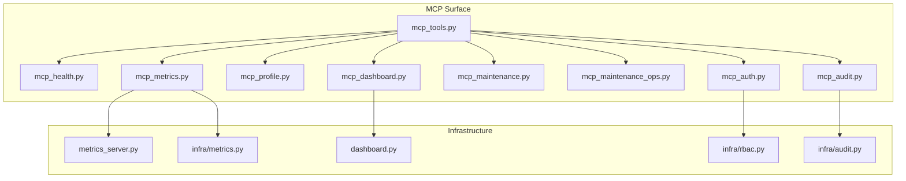
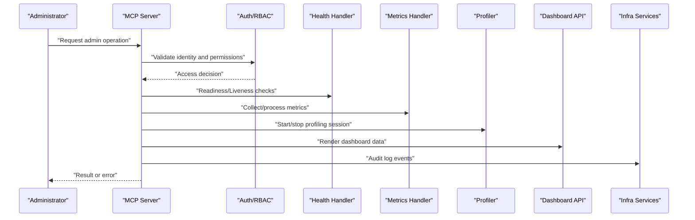
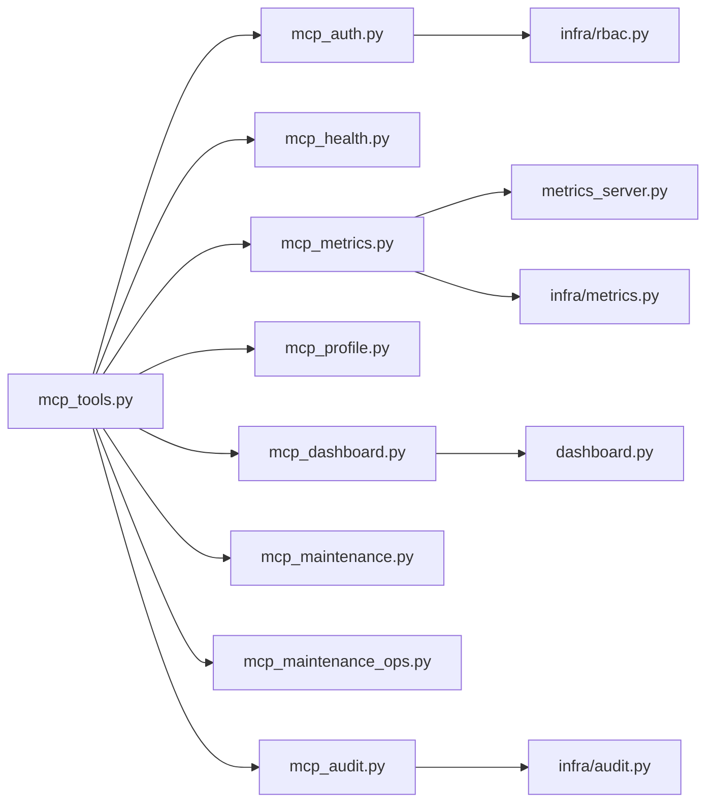

# System and Administration Tools

<cite>
**Referenced Files in This Document**
- [mcp_tools.py](file://mcp_tools.py)
- [mcp_health.py](file://mcp_health.py)
- [mcp_metrics.py](file://mcp_metrics.py)
- [mcp_profile.py](file://mcp_profile.py)
- [mcp_dashboard.py](file://mcp_dashboard.py)
- [mcp_maintenance.py](file://mcp_maintenance.py)
- [mcp_maintenance_ops.py](file://mcp_maintenance_ops.py)
- [mcp_auth.py](file://mcp_auth.py)
- [mcp_audit.py](file://mcp_audit.py)
- [metrics_server.py](file://metrics_server.py)
- [dashboard.py](file://dashboard.py)
- [infra/metrics.py](file://infra/metrics.py)
- [infra/audit.py](file://infra/audit.py)
- [infra/rbac.py](file://infra/rbac.py)
</cite>

## Table of Contents
1. [Introduction](#introduction)
2. [Project Structure](#project-structure)
3. [Core Components](#core-components)
4. [Architecture Overview](#architecture-overview)
5. [Detailed Component Analysis](#detailed-component-analysis)
6. [Dependency Analysis](#dependency-analysis)
7. [Performance Considerations](#performance-considerations)
8. [Security Considerations](#security-considerations)
9. [Troubleshooting Guide](#troubleshooting-guide)
10. [Conclusion](#conclusion)

## Introduction

This document explains the Model Context Protocol (MCP) tools for system administration and monitoring, focusing on health check endpoints, metrics collection, profiling capabilities, dashboard integration, system status monitoring, and performance analysis. It also covers security considerations, access control patterns, and audit logging requirements for administrative interfaces.

## Project Structure

The repository organizes MCP-related functionality across multiple modules:
- Health checks and diagnostics under mcp_health.py
- Metrics exposure and scraping under mcp_metrics.py
- Profiling utilities under mcp_profile.py
- Dashboard data and operations under mcp_dashboard.py
- Maintenance operations under mcp_maintenance.py and mcp_maintenance_ops.py
- Authentication and authorization under mcp_auth.py
- Audit logging under mcp_audit.py
- Central metrics server under metrics_server.py
- Web dashboard entry point under dashboard.py
- Infrastructure components for metrics, audit, and RBAC under infra/

**Diagram sources**
- [mcp_tools.py](file://mcp_tools.py)
- [mcp_health.py](file://mcp_health.py)
- [mcp_metrics.py](file://mcp_metrics.py)
- [mcp_profile.py](file://mcp_profile.py)
- [mcp_dashboard.py](file://mcp_dashboard.py)
- [mcp_maintenance.py](file://mcp_maintenance.py)
- [mcp_maintenance_ops.py](file://mcp_maintenance_ops.py)
- [mcp_auth.py](file://mcp_auth.py)
- [mcp_audit.py](file://mcp_audit.py)
- [metrics_server.py](file://metrics_server.py)
- [dashboard.py](file://dashboard.py)
- [infra/metrics.py](file://infra/metrics.py)
- [infra/audit.py](file://infra/audit.py)
- [infra/rbac.py](file://infra/rbac.py)

**Section sources**
- [mcp_tools.py](file://mcp_tools.py)
- [mcp_health.py](file://mcp_health.py)
- [mcp_metrics.py](file://mcp_metrics.py)
- [mcp_profile.py](file://mcp_profile.py)
- [mcp_dashboard.py](file://mcp_dashboard.py)
- [mcp_maintenance.py](file://mcp_maintenance.py)
- [mcp_maintenance_ops.py](file://mcp_maintenance_ops.py)
- [mcp_auth.py](file://mcp_auth.py)
- [mcp_audit.py](file://mcp_audit.py)
- [metrics_server.py](file://metrics_server.py)
- [dashboard.py](file://dashboard.py)
- [infra/metrics.py](file://infra/metrics.py)
- [infra/audit.py](file://infra/audit.py)
- [infra/rbac.py](file://infra/rbac.py)

## Core Components

- Health Check Endpoints: Provide liveness/readiness and component-level health signals for orchestrators and operators.
- Metrics Collection: Expose process, application, and business metrics suitable for scraping by Prometheus or similar systems.
- Profiling Capabilities: Offer sampling and snapshot-based profiling hooks to analyze CPU/memory hotspots during incidents.
- Dashboard Integration: Serve aggregated operational views and drill-downs for administrators via a web interface.
- System Status Monitoring: Aggregate subsystem health, background job status, and dependency states into a unified view.
- Performance Analysis Tools: Provide query latency distributions, throughput counters, and resource utilization indicators.

**Section sources**
- [mcp_health.py](file://mcp_health.py)
- [mcp_metrics.py](file://mcp_metrics.py)
- [mcp_profile.py](file://mcp_profile.py)
- [mcp_dashboard.py](file://mcp_dashboard.py)
- [metrics_server.py](file://metrics_server.py)
- [dashboard.py](file://dashboard.py)

## Architecture Overview

The MCP surface exposes admin-oriented tools that integrate with internal infrastructure services. The architecture emphasizes separation of concerns:
- MCP tools orchestrate calls to domain-specific handlers (health, metrics, maintenance).
- Metrics are collected at the application layer and exposed via a dedicated server.
- Dashboards consume APIs and metrics to present actionable insights.
- Security is enforced through authentication and role-based access control, with comprehensive audit logging.

**Diagram sources**
- [mcp_tools.py](file://mcp_tools.py)
- [mcp_health.py](file://mcp_health.py)
- [mcp_metrics.py](file://mcp_metrics.py)
- [mcp_profile.py](file://mcp_profile.py)
- [mcp_dashboard.py](file://mcp_dashboard.py)
- [mcp_auth.py](file://mcp_auth.py)
- [mcp_audit.py](file://mcp_audit.py)
- [infra/rbac.py](file://infra/rbac.py)

## Detailed Component Analysis

### Health Check Endpoints

Purpose:
- Provide liveness probes for container orchestration.
- Provide readiness probes indicating when the service is able to handle requests.
- Expose component-level health for dependencies such as databases, caches, and external services.

Key behaviors:
- Aggregates multiple subsystem checks into a composite status.
- Returns structured responses including timestamps and diagnostic details.
- Supports granular checks for targeted troubleshooting.

Operational guidance:
- Use liveness to trigger restarts on unrecoverable states.
- Use readiness to remove instances from load balancers while they initialize or recover.
- Monitor degradation trends using historical health snapshots.

**Section sources**
- [mcp_health.py](file://mcp_health.py)

### Metrics Collection

Purpose:
- Collect process-level and application-level metrics.
- Expose metrics in a standard format for scraping.
- Support custom business metrics for operational visibility.

Key behaviors:
- Provides counters, gauges, histograms, and summaries where appropriate.
- Integrates with an internal metrics server for efficient exposition.
- Allows selective enablement of expensive metrics behind feature flags.

Operational guidance:
- Configure scrape intervals aligned with alerting thresholds.
- Avoid high-cardinality labels to prevent cardinality explosion.
- Retain only necessary time windows to manage storage costs.

**Section sources**
- [mcp_metrics.py](file://mcp_metrics.py)
- [metrics_server.py](file://metrics_server.py)
- [infra/metrics.py](file://infra/metrics.py)

### Profiling Capabilities

Purpose:
- Enable CPU and memory profiling sessions for performance investigations.
- Capture snapshots without impacting production traffic significantly.
- Integrate with existing observability pipelines for postmortem analysis.

Key behaviors:
- Start/stop profiling sessions with controlled duration and scope.
- Export profiles in standard formats compatible with common profilers.
- Enforce strict access controls due to sensitivity of profiling data.

Operational guidance:
- Limit profiling window length and frequency.
- Store profiles securely and rotate them according to retention policies.
- Correlate profile snapshots with incident timelines and metric spikes.

**Section sources**
- [mcp_profile.py](file://mcp_profile.py)

### Dashboard Integration

Purpose:
- Present consolidated operational views for administrators.
- Provide drill-down capabilities for specific subsystems and tenants.
- Surface alerts, anomalies, and recommended actions.

Key behaviors:
- Aggregates health, metrics, and maintenance status into dashboards.
- Offers role-scoped views to enforce least privilege.
- Integrates with audit logs for compliance and forensics.

Operational guidance:
- Cache frequently accessed aggregates to reduce backend load.
- Implement pagination and filtering for large datasets.
- Ensure dashboard endpoints are protected and audited.

**Section sources**
- [mcp_dashboard.py](file://mcp_dashboard.py)
- [dashboard.py](file://dashboard.py)

### Maintenance Operations

Purpose:
- Provide safe, auditable operations for routine maintenance tasks.
- Support backfills, compactions, index rebuilds, and cleanup jobs.
- Allow scheduling and monitoring of long-running operations.

Key behaviors:
- Enforce preconditions and dry-run modes before executing mutations.
- Emit progress updates and completion notifications.
- Record detailed audit trails for all maintenance actions.

Operational guidance:
- Run maintenance during low-traffic windows.
- Validate outcomes with integrity checks after completion.
- Roll back or remediate failed operations promptly.

**Section sources**
- [mcp_maintenance.py](file://mcp_maintenance.py)
- [mcp_maintenance_ops.py](file://mcp_maintenance_ops.py)

### Authentication and Authorization

Purpose:
- Authenticate administrators and enforce fine-grained permissions.
- Apply role-based access control to MCP tools and dashboard endpoints.
- Prevent unauthorized access to sensitive operations and data.

Key behaviors:
- Validates tokens or credentials and resolves principal identities.
- Checks roles and scopes against requested operations.
- Denies by default and supports explicit allowlists for exceptional cases.

Operational guidance:
- Rotate credentials regularly and restrict token lifetimes.
- Assign minimal roles required for each operator.
- Review access decisions periodically and adjust policies.

**Section sources**
- [mcp_auth.py](file://mcp_auth.py)
- [infra/rbac.py](file://infra/rbac.py)

### Audit Logging

Purpose:
- Record administrative actions for compliance and forensics.
- Capture who did what, when, and why, including request context.
- Support secure transport and tamper-evident storage.

Key behaviors:
- Emits structured audit events with principal, action, resource, and outcome.
- Redacts sensitive fields automatically.
- Routes events to sinks such as files, HTTP endpoints, or metrics backends.

Operational guidance:
- Protect audit logs with strong access controls and encryption at rest.
- Monitor audit sink health and configure retries/backoff.
- Retain logs per policy and ensure deletion workflows are audited.

**Section sources**
- [mcp_audit.py](file://mcp_audit.py)
- [infra/audit.py](file://infra/audit.py)

## Dependency Analysis

The MCP surface depends on infrastructure services for metrics, audit, and RBAC. The following diagram shows key relationships:

**Diagram sources**
- [mcp_tools.py](file://mcp_tools.py)
- [mcp_health.py](file://mcp_health.py)
- [mcp_metrics.py](file://mcp_metrics.py)
- [mcp_profile.py](file://mcp_profile.py)
- [mcp_dashboard.py](file://mcp_dashboard.py)
- [mcp_maintenance.py](file://mcp_maintenance.py)
- [mcp_maintenance_ops.py](file://mcp_maintenance_ops.py)
- [mcp_auth.py](file://mcp_auth.py)
- [mcp_audit.py](file://mcp_audit.py)
- [metrics_server.py](file://metrics_server.py)
- [dashboard.py](file://dashboard.py)
- [infra/metrics.py](file://infra/metrics.py)
- [infra/audit.py](file://infra/audit.py)
- [infra/rbac.py](file://infra/rbac.py)

**Section sources**
- [mcp_tools.py](file://mcp_tools.py)
- [mcp_metrics.py](file://mcp_metrics.py)
- [mcp_dashboard.py](file://mcp_dashboard.py)
- [mcp_auth.py](file://mcp_auth.py)
- [mcp_audit.py](file://mcp_audit.py)
- [metrics_server.py](file://metrics_server.py)
- [dashboard.py](file://dashboard.py)
- [infra/metrics.py](file://infra/metrics.py)
- [infra/audit.py](file://infra/audit.py)
- [infra/rbac.py](file://infra/rbac.py)

## Performance Considerations

- Prefer streaming responses for large datasets in dashboard endpoints.
- Use pagination and filters to limit payload sizes.
- Cache read-heavy aggregates with short TTLs and invalidation strategies.
- Avoid synchronous heavy computations in request paths; offload to background workers.
- Tune metrics scrapes to balance freshness and overhead.
- Profile selectively and keep sessions short to minimize impact.

[No sources needed since this section provides general guidance]

## Security Considerations

- Enforce authentication for all MCP tools and dashboard endpoints.
- Apply RBAC to restrict administrative actions to authorized principals.
- Redact sensitive data in audit logs and responses.
- Securely store and transmit credentials and tokens.
- Rate-limit administrative endpoints to mitigate abuse.
- Maintain separate environments for development and production with distinct access policies.

**Section sources**
- [mcp_auth.py](file://mcp_auth.py)
- [infra/rbac.py](file://infra/rbac.py)
- [mcp_audit.py](file://mcp_audit.py)
- [infra/audit.py](file://infra/audit.py)

## Troubleshooting Guide

Common issues and resolutions:
- Health checks failing: Inspect component-level diagnostics and dependency statuses. Verify network connectivity and credential validity.
- Missing metrics: Confirm metrics server is running and scrape targets are reachable. Check feature flags controlling metric emission.
- Profiling not starting: Validate permissions and current workload state. Ensure profiling resources are available and limits are respected.
- Dashboard errors: Review cached data staleness and backend availability. Check pagination parameters and filter constraints.
- Maintenance job stalls: Inspect job queues, locks, and database connections. Review audit logs for preceding errors and retry policies.

**Section sources**
- [mcp_health.py](file://mcp_health.py)
- [mcp_metrics.py](file://mcp_metrics.py)
- [mcp_profile.py](file://mcp_profile.py)
- [mcp_dashboard.py](file://mcp_dashboard.py)
- [mcp_maintenance.py](file://mcp_maintenance.py)
- [mcp_maintenance_ops.py](file://mcp_maintenance_ops.py)

## Conclusion

The MCP tools provide a robust foundation for system administration and monitoring. By combining health checks, metrics, profiling, and dashboard integrations with strong security and audit controls, operators can maintain reliable, observable, and compliant systems. Follow the operational guidance and security recommendations to maximize safety and effectiveness.

[No sources needed since this section summarizes without analyzing specific files]