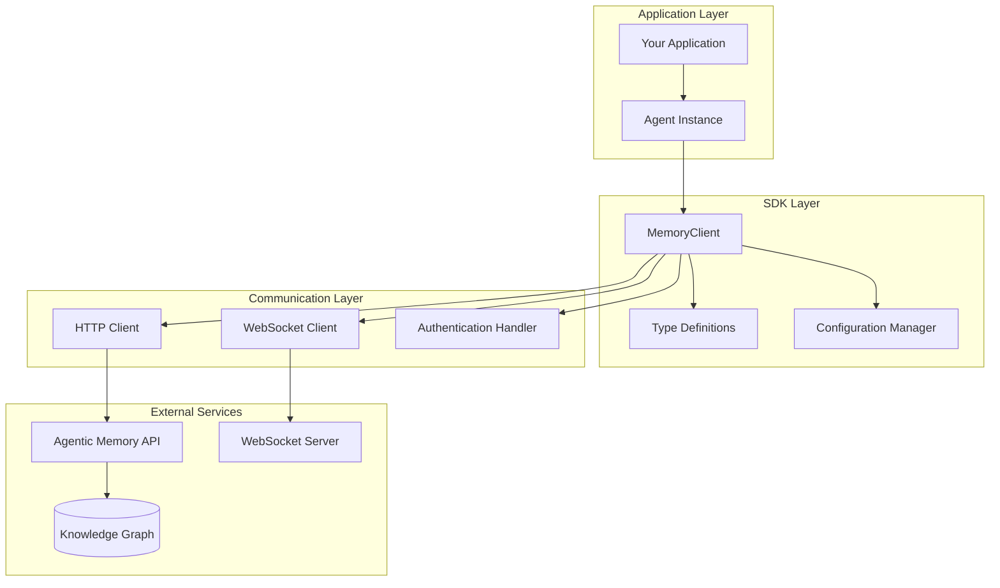

# TypeScript SDK

<cite>
**Referenced Files in This Document**
- [ts-sdk/package.json](file://ts-sdk/package.json)
- [ts-sdk/tsconfig.json](file://ts-sdk/tsconfig.json)
- [ts-sdk/src/index.ts](file://ts-sdk/src/index.ts)
- [ts-sdk/src/client.ts](file://ts-sdk/src/client.ts)
- [ts-sdk/src/agent.ts](file://ts-sdk/src/agent.ts)
- [ts-sdk/src/websocket.ts](file://ts-sdk/src/websocket.ts)
- [ts-sdk/src/types.ts](file://ts-sdk/src/types.ts)
- [docs/api/typescript-sdk.md](file://docs/api/typescript-sdk.md)
- [examples/basic_save_search.py](file://examples/basic_save_search.py)
- [examples/agent_memory.py](file://examples/agent_memory.py)
</cite>

## Table of Contents
1. [Introduction](#introduction)
2. [Installation and Setup](#installation-and-setup)
3. [Core Architecture](#core-architecture)
4. [Client Library Usage](#client-library-usage)
5. [Type Definitions](#type-definitions)
6. [WebSocket Integration](#websocket-integration)
7. [MemoryClient Class](#memoryclient-class)
8. [Agent Abstraction](#agent-abstraction)
9. [Real-time Sync Capabilities](#real-time-sync-capabilities)
10. [Authentication and Security](#authentication-and-security)
11. [Error Handling Patterns](#error-handling-patterns)
12. [Performance Optimization](#performance-optimization)
13. [Practical Examples](#practical-examples)
14. [Troubleshooting Guide](#troubleshooting-guide)
15. [Conclusion](#conclusion)

## Introduction

The Agentic Memory TypeScript SDK provides a comprehensive client library for building intelligent applications with persistent memory capabilities. It enables developers to create agents that can learn from interactions, maintain context across sessions, and collaborate through shared knowledge graphs. The SDK offers both programmatic access through the MemoryClient class and scoped operations via the Agent abstraction, with real-time synchronization capabilities for collaborative environments.

The SDK is designed for modern JavaScript and TypeScript applications running in Node.js environments, providing type-safe APIs, WebSocket integration for real-time updates, and optimized performance for both development and production scenarios.

## Installation and Setup

### Package Installation

Install the TypeScript SDK using your preferred package manager:

```bash
npm install @agentic-memory/sdk
# or
yarn add @agentic-memory/sdk
# or
pnpm add @agentic-memory/sdk
```

### Basic Configuration

Initialize the SDK with your configuration:

```typescript
import { MemoryClient } from '@agentic-memory/sdk';

const client = new MemoryClient({
  apiKey: 'your-api-key',
  baseUrl: 'https://api.agentic-memory.com',
  timeout: 30000,
  retries: 3
});
```

### Environment Variables

Configure the SDK using environment variables:

| Variable | Description | Default | Required |
|----------|-------------|---------|----------|
| `AGENTIC_MEMORY_API_KEY` | Authentication API key | - | Yes |
| `AGENTIC_MEMORY_BASE_URL` | API endpoint URL | https://api.agentic-memory.com | No |
| `AGENTIC_MEMORY_TIMEOUT` | Request timeout in milliseconds | 30000 | No |
| `AGENTIC_MEMORY_RETRIES` | Number of retry attempts | 3 | No |
| `AGENTIC_MEMORY_WS_URL` | WebSocket server URL | wss://ws.agentic-memory.com | No |

**Section sources**
- [ts-sdk/package.json:1-50](file://ts-sdk/package.json#L1-L50)
- [ts-sdk/tsconfig.json:1-30](file://ts-sdk/tsconfig.json#L1-L30)

## Core Architecture

The TypeScript SDK follows a modular architecture with clear separation of concerns:



**Diagram sources**
- [ts-sdk/src/index.ts:1-100](file://ts-sdk/src/index.ts#L1-L100)
- [ts-sdk/src/client.ts:1-150](file://ts-sdk/src/client.ts#L1-L150)
- [ts-sdk/src/types.ts:1-200](file://ts-sdk/src/types.ts#L1-L200)

The architecture ensures:
- **Type Safety**: Comprehensive TypeScript definitions throughout
- **Modularity**: Separate concerns for HTTP, WebSocket, and business logic
- **Scalability**: Support for multiple concurrent connections
- **Resilience**: Automatic retry mechanisms and error handling

## Client Library Usage

### Basic Client Initialization

The MemoryClient serves as the primary interface for interacting with the Agentic Memory service:

```typescript
import { MemoryClient, Agent } from '@agentic-memory/sdk';

// Initialize client
const client = new MemoryClient({
  apiKey: process.env.AGENTIC_MEMORY_API_KEY,
  baseUrl: process.env.AGENTIC_MEMORY_BASE_URL || 'https://api.agentic-memory.com'
});

// Create agent instance
const agent = new Agent(client, {
  name: 'my-agent',
  scope: 'project:my-project'
});
```

### Connection Management

The client automatically manages connection lifecycle:

```typescript
// Connect to service
await client.connect();

// Check connection status
if (client.isConnected()) {
  console.log('Connected successfully');
}

// Graceful shutdown
await client.disconnect();
```

### Request Configuration

Configure request behavior:

```typescript
const client = new MemoryClient({
  timeout: 30000,           // Request timeout
  retries: 3,              // Retry attempts
  retryDelay: 1000,        // Delay between retries
  maxRetries: 5,           // Maximum retry attempts
  backoffStrategy: 'exponential' // Retry strategy
});
```

**Section sources**
- [ts-sdk/src/client.ts:1-200](file://ts-sdk/src/client.ts#L1-L200)
- [ts-sdk/src/index.ts:1-150](file://ts-sdk/src/index.ts#L1-L150)

## Type Definitions

The SDK provides comprehensive TypeScript definitions for all API responses and configurations:

### Core Types

```typescript
interface MemoryEntry {
  id: string;
  content: string;
  metadata: Record<string, any>;
  timestamp: Date;
  tags: string[];
  score?: number;
}

interface SearchQuery {
  query: string;
  filters?: Record<string, any>;
  limit?: number;
  offset?: number;
  sortBy?: 'relevance' | 'timestamp';
}

interface SearchResult {
  results: MemoryEntry[];
  total: number;
  took: number;
}
```

### Agent Configuration

```typescript
interface AgentConfig {
  name: string;
  scope: string;
  permissions?: string[];
  metadata?: Record<string, any>;
  createdAt?: Date;
  updatedAt?: Date;
}

interface AgentOptions {
  autoSave?: boolean;
  syncInterval?: number;
  batchSize?: number;
}
```

### Error Types

```typescript
interface ApiError {
  code: string;
  message: string;
  details?: any;
  requestId?: string;
}

class AgenticMemoryError extends Error {
  code: string;
  statusCode: number;
  details: any;
  
  constructor(code: string, message: string, details?: any);
}
```

**Section sources**
- [ts-sdk/src/types.ts:1-300](file://ts-sdk/src/types.ts#L1-L300)

## WebSocket Integration

### Real-time Synchronization

The SDK includes built-in WebSocket support for real-time updates:

```typescript
import { WebSocketManager } from '@agentic-memory/sdk';

const wsManager = new WebSocketManager({
  url: 'wss://ws.agentic-memory.com',
  reconnectAttempts: 5,
  reconnectDelay: 1000
});

// Subscribe to events
wsManager.on('memory:update', (event) => {
  console.log('Memory updated:', event.data);
});

wsManager.on('agent:sync', (event) => {
  console.log('Agent synchronized:', event.data);
});

// Start connection
await wsManager.connect();
```

### Event Types

```typescript
interface MemoryUpdateEvent {
  type: 'memory:create' | 'memory:update' | 'memory:delete';
  data: MemoryEntry;
  timestamp: Date;
  agentId: string;
}

interface AgentSyncEvent {
  type: 'agent:sync:start' | 'agent:sync:complete' | 'agent:sync:error';
  data: any;
  timestamp: Date;
}
```

### Connection Management

```typescript
class WebSocketManager {
  connect(): Promise<void>;
  disconnect(): Promise<void>;
  isConnected(): boolean;
  on(event: string, handler: Function): void;
  off(event: string, handler: Function): void;
  emit(event: string, data: any): void;
}
```

**Section sources**
- [ts-sdk/src/websocket.ts:1-250](file://ts-sdk/src/websocket.ts#L1-L250)

## MemoryClient Class

### Constructor Options

The MemoryClient constructor accepts various configuration options:

| Option | Type | Default | Description |
|--------|------|---------|-------------|
| `apiKey` | string | - | Authentication API key |
| `baseUrl` | string | https://api.agentic-memory.com | API endpoint URL |
| `timeout` | number | 30000 | Request timeout in milliseconds |
| `retries` | number | 3 | Number of retry attempts |
| `retryDelay` | number | 1000 | Base delay between retries |
| `maxRetries` | number | 5 | Maximum retry attempts |
| `backoffStrategy` | string | exponential | Retry backoff strategy |
| `headers` | object | {} | Custom HTTP headers |
| `logger` | Logger | null | Custom logger instance |

### Core Methods

#### Memory Operations

```typescript
// Save memory entry
async save(entry: MemoryEntry): Promise<MemoryEntry>;

// Retrieve memory entry
async get(id: string): Promise<MemoryEntry>;

// Update memory entry
async update(id: string, updates: Partial<MemoryEntry>): Promise<MemoryEntry>;

// Delete memory entry
async delete(id: string): Promise<boolean>;

// Search memories
async search(query: SearchQuery): Promise<SearchResult>;
```

#### Batch Operations

```typescript
// Batch save operations
async batchSave(entries: MemoryEntry[]): Promise<MemoryEntry[]>;

// Batch delete operations
async batchDelete(ids: string[]): Promise<boolean[]>;

// Bulk search operations
async bulkSearch(queries: SearchQuery[]): Promise<SearchResult[]>;
```

#### Connection Management

```typescript
// Connect to service
async connect(): Promise<void>;

// Disconnect from service
async disconnect(): Promise<void>;

// Check connection status
isConnected(): boolean;

// Get connection info
getConnectionInfo(): ConnectionInfo;
```

### Error Handling

```typescript
try {
  const result = await client.save(memoryEntry);
} catch (error) {
  if (error instanceof AgenticMemoryError) {
    switch (error.code) {
      case 'AUTH_FAILED':
        // Handle authentication error
        break;
      case 'RATE_LIMITED':
        // Handle rate limiting
        break;
      case 'VALIDATION_ERROR':
        // Handle validation error
        break;
      default:
        // Handle other errors
        break;
    }
  }
}
```

**Section sources**
- [ts-sdk/src/client.ts:1-400](file://ts-sdk/src/client.ts#L1-L400)

## Agent Abstraction

### Agent Creation and Configuration

The Agent class provides a higher-level abstraction for managing memory operations within specific scopes:

```typescript
const agent = new Agent(client, {
  name: 'research-assistant',
  scope: 'project:ai-research',
  permissions: ['read', 'write', 'search'],
  metadata: {
    version: '1.0.0',
    description: 'AI research assistant agent'
  }
});
```

### Scoped Operations

Agents provide automatic scoping for all operations:

```typescript
// All operations are automatically scoped
await agent.save({
  content: 'Research findings about neural networks',
  tags: ['research', 'neural-networks']
});

// Scoped search
const results = await agent.search({
  query: 'neural network architectures',
  filters: {
    tags: ['research']
  }
});
```

### Agent Lifecycle

```typescript
// Initialize agent
await agent.initialize();

// Perform operations
await agent.save(memoryEntry);
const results = await agent.search(searchQuery);

// Cleanup resources
await agent.cleanup();
```

### Agent Events

```typescript
agent.on('save', (entry) => {
  console.log('Memory saved:', entry.id);
});

agent.on('search', (query) => {
  console.log('Search performed:', query.query);
});

agent.on('error', (error) => {
  console.error('Agent error:', error);
});
```

**Section sources**
- [ts-sdk/src/agent.ts:1-300](file://ts-sdk/src/agent.ts#L1-L300)

## Real-time Sync Capabilities

### Synchronization Modes

The SDK supports multiple synchronization modes:

```typescript
const syncConfig = {
  mode: 'auto', // 'auto', 'manual', 'batch'
  interval: 5000, // Sync interval in milliseconds
  batchSize: 10, // Batch size for sync operations
  conflictResolution: 'last-write-wins', // Conflict resolution strategy
  includeMetadata: true // Include metadata in sync
};
```

### Conflict Resolution

```typescript
interface ConflictResolutionStrategy {
  type: 'last-write-wins' | 'merge' | 'custom';
  customResolver?: (local: any, remote: any) => any;
}

const agent = new Agent(client, {
  syncConfig: {
    conflictResolution: {
      type: 'merge',
      customResolver: (local, remote) => {
        // Custom merge logic
        return { ...local, ...remote };
      }
    }
  }
});
```

### Sync Monitoring

```typescript
const syncMonitor = agent.getSyncMonitor();

syncMonitor.on('sync:start', () => {
  console.log('Sync started');
});

syncMonitor.on('sync:complete', (stats) => {
  console.log('Sync completed:', stats);
});

syncMonitor.on('sync:error', (error) => {
  console.error('Sync error:', error);
});
```

**Section sources**
- [ts-sdk/src/agent.ts:200-400](file://ts-sdk/src/agent.ts#L200-L400)
- [ts-sdk/src/websocket.ts:150-300](file://ts-sdk/src/websocket.ts#L150-L300)

## Authentication and Security

### API Key Authentication

The primary authentication method uses API keys:

```typescript
const client = new MemoryClient({
  apiKey: process.env.AGENTIC_MEMORY_API_KEY,
  headers: {
    'Authorization': `Bearer ${process.env.AGENTIC_MEMORY_API_KEY}`
  }
});
```

### Token-based Authentication

Support for JWT and OAuth tokens:

```typescript
const client = new MemoryClient({
  tokenProvider: async () => {
    const token = await refreshToken();
    return token;
  },
  tokenRefreshThreshold: 300 // Refresh token 5 minutes before expiry
});
```

### Security Best Practices

```typescript
// Use environment variables for sensitive data
const config = {
  apiKey: process.env.AGENTIC_MEMORY_API_KEY,
  baseUrl: process.env.AGENTIC_MEMORY_BASE_URL
};

// Implement request logging (without sensitive data)
const logger = {
  log: (level: string, message: string, data?: any) => {
    console[level](`[${new Date().toISOString()}] ${message}`, 
      data ? sanitizeData(data) : '');
  }
};

function sanitizeData(data: any): any {
  const sanitized = { ...data };
  delete sanitized.apiKey;
  delete sanitized.token;
  return sanitized;
}
```

**Section sources**
- [ts-sdk/src/client.ts:300-500](file://ts-sdk/src/client.ts#L300-L500)

## Error Handling Patterns

### Error Categories

The SDK categorizes errors into distinct types:

```typescript
enum ErrorCode {
  AUTH_FAILED = 'AUTH_FAILED',
  RATE_LIMITED = 'RATE_LIMITED',
  VALIDATION_ERROR = 'VALIDATION_ERROR',
  NETWORK_ERROR = 'NETWORK_ERROR',
  TIMEOUT_ERROR = 'TIMEOUT_ERROR',
  SERVER_ERROR = 'SERVER_ERROR',
  NOT_FOUND = 'NOT_FOUND',
  CONFLICT = 'CONFLICT'
}
```

### Error Recovery Strategies

```typescript
class ErrorRecoveryHandler {
  private retryCount = 0;
  private maxRetries = 3;
  
  async handle(error: AgenticMemoryError): Promise<any> {
    switch (error.code) {
      case 'RATE_LIMITED':
        return this.handleRateLimit(error);
      case 'NETWORK_ERROR':
        return this.handleNetworkError(error);
      case 'TIMEOUT_ERROR':
        return this.handleTimeout(error);
      default:
        throw error;
    }
  }
  
  private async handleRateLimit(error: AgenticMemoryError): Promise<any> {
    const retryAfter = error.details?.retryAfter || 1000;
    await this.sleep(retryAfter);
    return this.retryOperation();
  }
}
```

### Global Error Handler

```typescript
// Set up global error handler
client.setErrorHandler((error, operation, context) => {
  console.error(`Error in ${operation}:`, error);
  
  // Log to monitoring service
  monitorService.captureException(error, {
    operation,
    context,
    userId: context.userId
  });
  
  // Show user-friendly message
  showUserMessage(getUserFriendlyMessage(error));
});
```

**Section sources**
- [ts-sdk/src/types.ts:200-400](file://ts-sdk/src/types.ts#L200-L400)

## Performance Optimization

### Connection Pooling

Optimize connection usage with pooling:

```typescript
const client = new MemoryClient({
  connectionPool: {
    maxSize: 10,
    minSize: 2,
    idleTimeout: 30000,
    acquireTimeout: 5000
  }
});
```

### Request Batching

Batch multiple operations for better performance:

```typescript
// Batch save operations
const entries = [
  { content: 'First memory', tags: ['test'] },
  { content: 'Second memory', tags: ['test'] },
  { content: 'Third memory', tags: ['test'] }
];

const results = await client.batchSave(entries);
```

### Caching Strategy

Implement response caching:

```typescript
const cache = new LRUCache({
  maxSize: 1000,
  ttl: 300000 // 5 minutes
});

const cachedClient = new MemoryClient({
  cache: cache,
  cacheOptions: {
    enabled: true,
    excludeMethods: ['POST', 'PUT', 'DELETE'],
    excludePaths: ['/admin/*']
  }
});
```

### Compression and Serialization

Optimize data transfer:

```typescript
const client = new MemoryClient({
  compression: {
    enabled: true,
    algorithm: 'gzip',
    threshold: 1024 // Only compress requests > 1KB
  },
  serialization: {
    format: 'json', // 'json' or 'protobuf'
    dateSerialization: 'iso-string'
  }
});
```

**Section sources**
- [ts-sdk/src/client.ts:400-600](file://ts-sdk/src/client.ts#L400-L600)

## Practical Examples

### Basic Memory Operations

```typescript
import { MemoryClient, Agent } from '@agentic-memory/sdk';

async function main() {
  // Initialize client and agent
  const client = new MemoryClient({
    apiKey: process.env.AGENTIC_MEMORY_API_KEY
  });
  
  const agent = new Agent(client, {
    name: 'demo-agent',
    scope: 'demo:project'
  });
  
  try {
    // Save a memory entry
    const memory = await agent.save({
      content: 'Hello, World! This is my first memory.',
      tags: ['demo', 'hello-world'],
      metadata: { source: 'tutorial' }
    });
    
    console.log('Memory saved:', memory.id);
    
    // Search for memories
    const results = await agent.search({
      query: 'hello world',
      limit: 10
    });
    
    console.log('Found', results.total, 'memories');
    
    // Update a memory
    const updated = await agent.update(memory.id, {
      tags: ['demo', 'hello-world', 'updated']
    });
    
    console.log('Memory updated:', updated.id);
    
  } catch (error) {
    console.error('Error:', error.message);
  } finally {
    await agent.cleanup();
  }
}

main();
```

### Real-time Collaboration

```typescript
import { MemoryClient, Agent, WebSocketManager } from '@agentic-memory/sdk';

async function setupCollaboration() {
  const client = new MemoryClient({
    apiKey: process.env.AGENTIC_MEMORY_API_KEY
  });
  
  const agent = new Agent(client, {
    name: 'collab-agent',
    scope: 'team:project'
  });
  
  // Setup WebSocket for real-time updates
  const wsManager = new WebSocketManager({
    url: 'wss://ws.agentic-memory.com',
    reconnectAttempts: 5
  });
  
  // Listen for real-time updates
  wsManager.on('memory:update', (event) => {
    console.log('Memory updated by another agent:', event.data.content);
  });
  
  // Enable auto-sync
  agent.enableAutoSync({
    interval: 5000,
    conflictResolution: 'merge'
  });
  
  await agent.initialize();
  await wsManager.connect();
  
  console.log('Collaboration session started');
}
```

### Error Handling Example

```typescript
async function robustMemoryOperation() {
  const client = new MemoryClient({
    apiKey: process.env.AGENTIC_MEMORY_API_KEY,
    retries: 3,
    retryDelay: 1000
  });
  
  try {
    const result = await client.save({
      content: 'Important data',
      tags: ['critical']
    });
    
    return result;
    
  } catch (error) {
    if (error.code === 'RATE_LIMITED') {
      // Wait and retry
      await sleep(error.details.retryAfter);
      return client.save({
        content: 'Important data',
        tags: ['critical']
      });
    }
    
    throw error;
  }
}
```

**Section sources**
- [examples/basic_save_search.py:1-100](file://examples/basic_save_search.py#L1-L100)
- [examples/agent_memory.py:1-150](file://examples/agent_memory.py#L1-L150)

## Troubleshooting Guide

### Common Issues and Solutions

#### Connection Problems

```typescript
// Debug connection issues
const client = new MemoryClient({
  apiKey: process.env.AGENTIC_MEMORY_API_KEY,
  logger: {
    log: (level, message, data) => {
      console.debug(`[${level}] ${message}`, data);
    }
  }
});

// Test connection
try {
  await client.connect();
  console.log('Connection successful');
} catch (error) {
  console.error('Connection failed:', error.message);
  console.error('Check your API key and network connectivity');
}
```

#### Authentication Errors

```typescript
// Verify API key
const isValidApiKey = (key: string): boolean => {
  return key && key.startsWith('am_') && key.length > 20;
};

if (!isValidApiKey(process.env.AGENTIC_MEMORY_API_KEY)) {
  console.error('Invalid API key format');
  console.error('API keys should start with "am_" and be at least 20 characters long');
}
```

#### Performance Issues

```typescript
// Monitor performance
const perfMonitor = {
  startTime: Date.now(),
  requests: 0,
  errors: 0,
  
  trackRequest() {
    this.requests++;
  },
  
  trackError() {
    this.errors++;
  },
  
  getStats() {
    return {
      duration: Date.now() - this.startTime,
      requests: this.requests,
      errors: this.errors,
      errorRate: this.errors / this.requests
    };
  }
};
```

### Logging and Debugging

```typescript
// Enable detailed logging
const debugClient = new MemoryClient({
  apiKey: process.env.AGENTIC_MEMORY_API_KEY,
  logger: {
    level: 'debug',
    log: (level, message, data) => {
      console.log(`[${level.toUpperCase()}] ${message}`, JSON.stringify(data, null, 2));
    }
  },
  enableMetrics: true
});

// Export metrics
setInterval(() => {
  const metrics = debugClient.getMetrics();
  console.log('Current metrics:', metrics);
}, 60000);
```

**Section sources**
- [ts-sdk/src/client.ts:500-700](file://ts-sdk/src/client.ts#L500-L700)

## Conclusion

The Agentic Memory TypeScript SDK provides a powerful and flexible foundation for building intelligent applications with persistent memory capabilities. Its comprehensive type definitions, real-time synchronization features, and robust error handling make it suitable for both simple scripts and complex enterprise applications.

Key benefits include:
- **Type Safety**: Full TypeScript support with comprehensive type definitions
- **Real-time Updates**: WebSocket integration for live collaboration
- **Scalable Architecture**: Support for high-throughput scenarios
- **Flexible Configuration**: Extensive customization options
- **Robust Error Handling**: Comprehensive error recovery strategies

For optimal results, follow the best practices outlined in this documentation, particularly around authentication security, performance optimization, and error handling patterns. The SDK's modular design allows for easy extension and customization to meet specific application requirements.