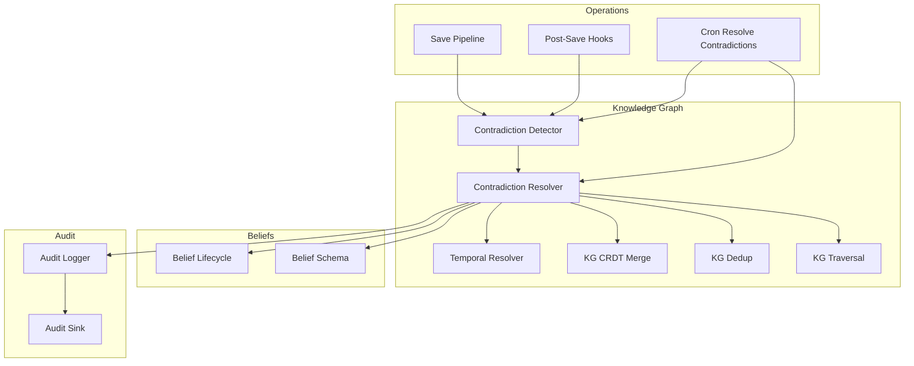
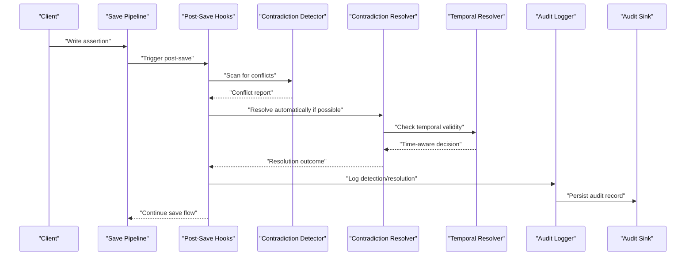
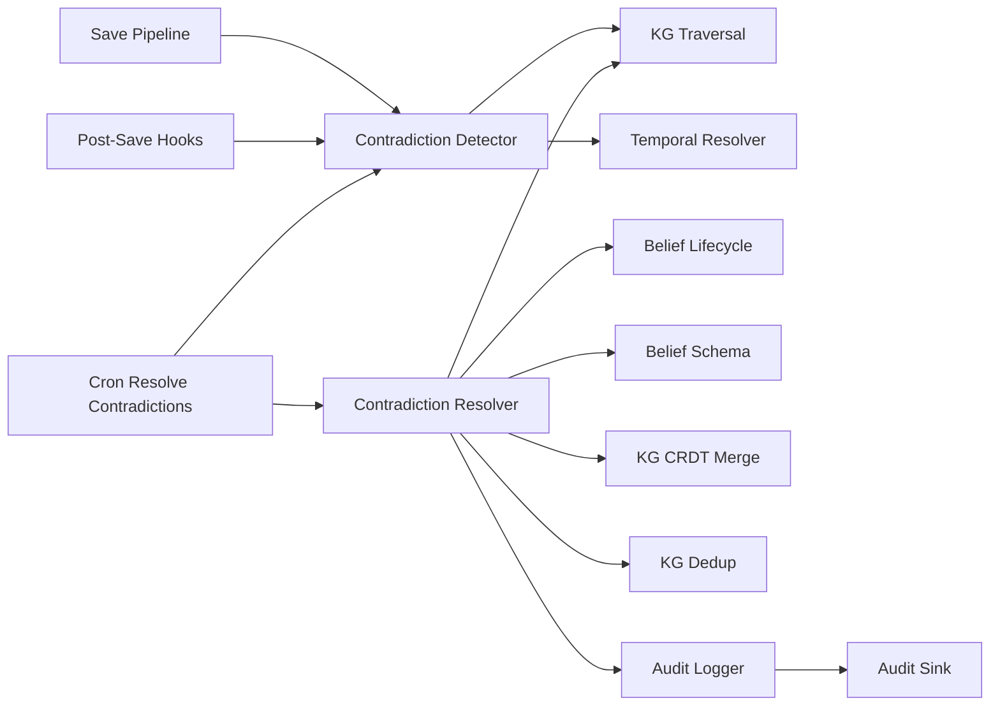
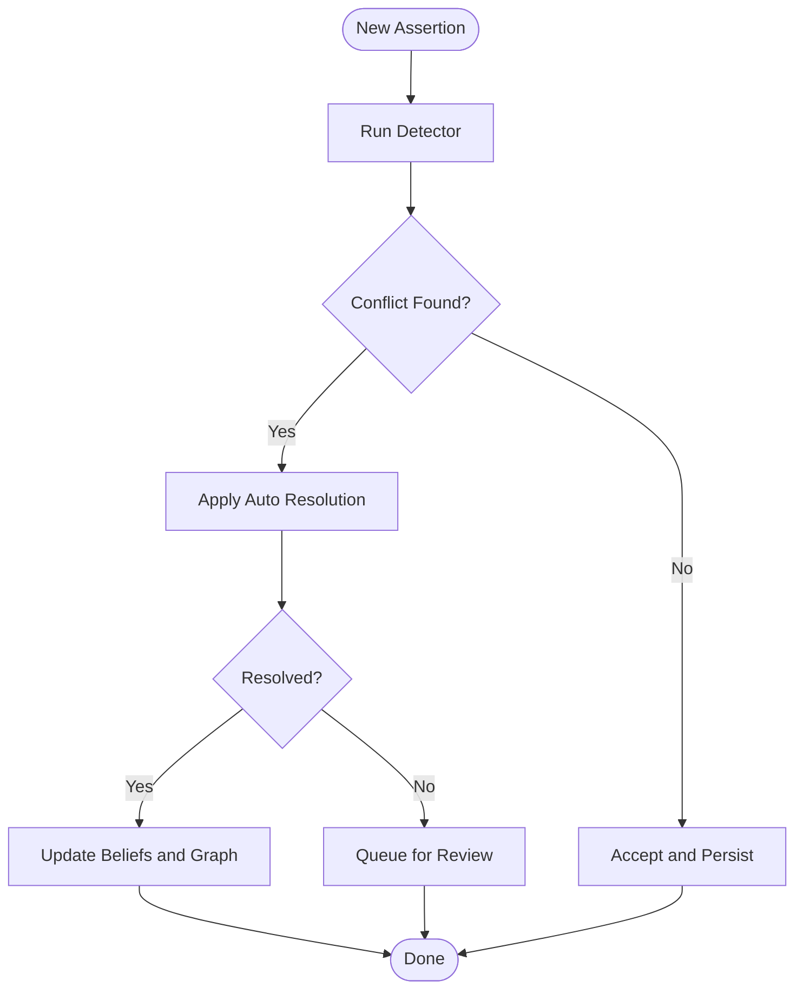
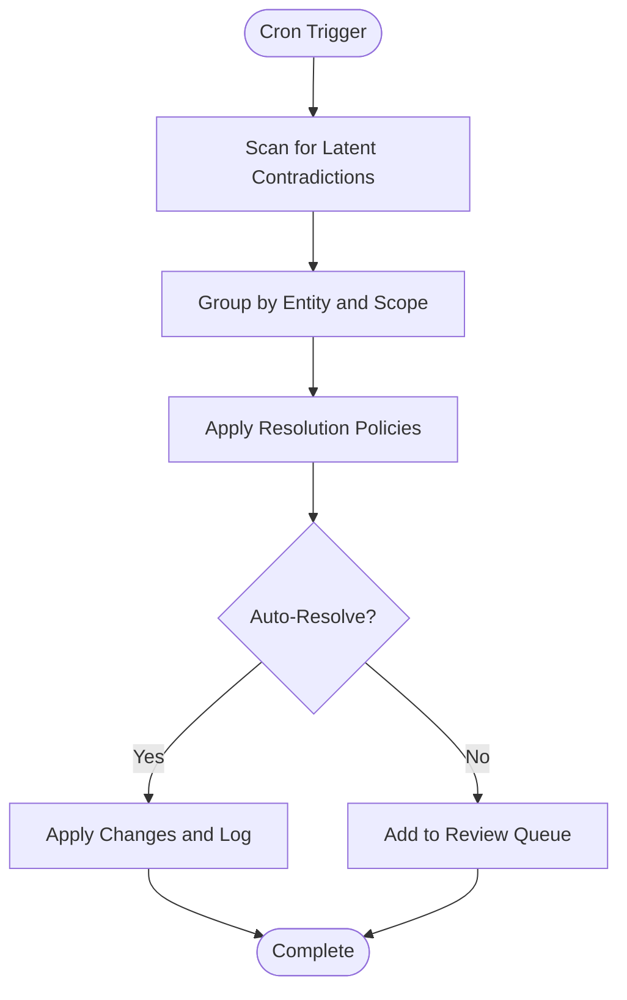

# Contradiction Detection and Resolution

<cite>
**Referenced Files in This Document**
- [kg/contradiction_detector.py](file://kg/contradiction_detector.py)
- [kg/contradiction_resolver.py](file://kg/contradiction_resolver.py)
- [belief/belief_lifecycle.py](file://belief/belief_lifecycle.py)
- [belief/belief_schema.py](file://belief/belief_schema.py)
- [cron/cron_resolve_contradictions.py](file://cron/cron_resolve_contradictions.py)
- [kg/temporal_resolver.py](file://kg/temporal_resolver.py)
- [kg/kg_crdt.py](file://kg/kg_crdt.py)
- [kg/kg_dedup.py](file://kg/kg_dedup.py)
- [kg/kg_traversal.py](file://kg/kg_traversal.py)
- [save/pipeline.py](file://save/pipeline.py)
- [save/post_save_hooks.py](file://save/post_save_hooks.py)
- [audit.py](file://audit.py)
- [infra/audit_sink.py](file://infra/audit_sink.py)
- [test_contradiction_engine.py](file://test_contradiction_engine.py)
- [test_contradiction_merge.py](file://test_contradiction_merge.py)
- [test_contradiction_save.py](file://test_contradiction_save.py)
- [test_contradiction_tenant_scope.py](file://test_contradiction_tenant_scope.py)
</cite>

## Table of Contents
1. [Introduction](#introduction)
2. [Project Structure](#project-structure)
3. [Core Components](#core-components)
4. [Architecture Overview](#architecture-overview)
5. [Detailed Component Analysis](#detailed-component-analysis)
6. [Dependency Analysis](#dependency-analysis)
7. [Performance Considerations](#performance-considerations)
8. [Troubleshooting Guide](#troubleshooting-guide)
9. [Conclusion](#conclusion)
10. [Appendices](#appendices)

## Introduction
This document explains how the system detects and resolves contradictions across facts, beliefs, and relationships in the knowledge graph. It covers:
- How conflicting statements are identified (semantic, structural, temporal, and contextual)
- The belief lifecycle and confidence scoring
- Automatic resolution strategies and manual review workflows
- Override mechanisms and audit trails for resolved contradictions
- Handling of temporal contradictions, context-dependent conflicts, and multi-source agreement protocols

The goal is to provide both a high-level understanding and actionable details for operators and developers.

## Project Structure
Contradiction detection and resolution span several modules:
- Detection engine and resolver in the knowledge graph layer
- Belief modeling and lifecycle management
- Cron-driven scheduling for periodic resolution
- Temporal reasoning for time-bound facts
- Save pipeline integration for real-time detection
- Audit logging for transparency and compliance

**Diagram sources**
- [kg/contradiction_detector.py](file://kg/contradiction_detector.py)
- [kg/contradiction_resolver.py](file://kg/contradiction_resolver.py)
- [kg/temporal_resolver.py](file://kg/temporal_resolver.py)
- [kg/kg_crdt.py](file://kg/kg_crdt.py)
- [kg/kg_dedup.py](file://kg/kg_dedup.py)
- [kg/kg_traversal.py](file://kg/kg_traversal.py)
- [belief/belief_lifecycle.py](file://belief/belief_lifecycle.py)
- [belief/belief_schema.py](file://belief/belief_schema.py)
- [save/pipeline.py](file://save/pipeline.py)
- [save/post_save_hooks.py](file://save/post_save_hooks.py)
- [cron/cron_resolve_contradictions.py](file://cron/cron_resolve_contradictions.py)
- [audit.py](file://audit.py)
- [infra/audit_sink.py](file://infra/audit_sink.py)

**Section sources**
- [kg/contradiction_detector.py](file://kg/contradiction_detector.py)
- [kg/contradiction_resolver.py](file://kg/contradiction_resolver.py)
- [belief/belief_lifecycle.py](file://belief/belief_lifecycle.py)
- [belief/belief_schema.py](file://belief/belief_schema.py)
- [cron/cron_resolve_contradictions.py](file://cron/cron_resolve_contradictions.py)
- [kg/temporal_resolver.py](file://kg/temporal_resolver.py)
- [kg/kg_crdt.py](file://kg/kg_crdt.py)
- [kg/kg_dedup.py](file://kg/kg_dedup.py)
- [kg/kg_traversal.py](file://kg/kg_traversal.py)
- [save/pipeline.py](file://save/pipeline.py)
- [save/post_save_hooks.py](file://save/post_save_hooks.py)
- [audit.py](file://audit.py)
- [infra/audit_sink.py](file://infra/audit_sink.py)

## Core Components
- Contradiction Detector: Scans new or updated assertions against existing knowledge to identify conflicts using semantic similarity, structural checks, and temporal constraints.
- Contradiction Resolver: Applies automatic resolution policies, escalates to review when needed, and records outcomes with provenance.
- Belief Lifecycle and Schema: Defines states, confidence scores, and metadata for beliefs; integrates with resolution outcomes.
- Temporal Resolver: Resolves time-bound contradictions by evaluating validity windows and precedence rules.
- Save Pipeline Integration: Invokes detection on write paths to catch contradictions early.
- Cron Scheduler: Periodically scans for latent contradictions and applies batch resolutions.
- Audit Trail: Logs all detection and resolution events with immutable records.

**Section sources**
- [kg/contradiction_detector.py](file://kg/contradiction_detector.py)
- [kg/contradiction_resolver.py](file://kg/contradiction_resolver.py)
- [belief/belief_lifecycle.py](file://belief/belief_lifecycle.py)
- [belief/belief_schema.py](file://belief/belief_schema.py)
- [kg/temporal_resolver.py](file://kg/temporal_resolver.py)
- [save/pipeline.py](file://save/pipeline.py)
- [save/post_save_hooks.py](file://save/post_save_hooks.py)
- [cron/cron_resolve_contradictions.py](file://cron/cron_resolve_contradictions.py)
- [audit.py](file://audit.py)
- [infra/audit_sink.py](file://infra/audit_sink.py)

## Architecture Overview
The contradiction subsystem integrates into both real-time writes and scheduled maintenance. New assertions trigger detection; if conflicts are found, the resolver attempts automatic resolution based on policy and evidence strength. When unresolved, items are queued for manual review. All actions are audited.

**Diagram sources**
- [save/pipeline.py](file://save/pipeline.py)
- [save/post_save_hooks.py](file://save/post_save_hooks.py)
- [kg/contradiction_detector.py](file://kg/contradiction_detector.py)
- [kg/contradiction_resolver.py](file://kg/contradiction_resolver.py)
- [kg/temporal_resolver.py](file://kg/temporal_resolver.py)
- [audit.py](file://audit.py)
- [infra/audit_sink.py](file://infra/audit_sink.py)

## Detailed Component Analysis

### Contradiction Detector
Responsibilities:
- Identify conflicting facts, beliefs, and relationships by comparing new inputs with existing graph state.
- Use semantic similarity and structural checks to detect contradictions.
- Incorporate temporal constraints to avoid false positives across valid time windows.
- Return structured conflict reports including candidate pairs, reasons, and confidence deltas.

Key behaviors:
- Semantic comparison: measures closeness between statements to flag potential contradictions.
- Structural checks: validates relationship consistency (e.g., entity type mismatches).
- Temporal filtering: excludes conflicts that are valid at different times.
- Context scoping: respects tenant and session boundaries.

Operational notes:
- Designed to be invoked from save hooks and cron jobs.
- Produces deterministic outputs suitable for auditing and downstream processing.

**Section sources**
- [kg/contradiction_detector.py](file://kg/contradiction_detector.py)
- [kg/kg_traversal.py](file://kg/kg_traversal.py)
- [kg/temporal_resolver.py](file://kg/temporal_resolver.py)

### Contradiction Resolver
Responsibilities:
- Apply automatic resolution strategies based on evidence strength, source reliability, and policy.
- Escalate ambiguous cases to manual review queues.
- Record resolution decisions with provenance and rationale.
- Update belief states and confidence scores accordingly.

Automatic strategies include:
- Source priority: prefer higher-confidence or more authoritative sources.
- Recency bias: favor newer information when appropriate.
- Consensus: require multi-source agreement for critical updates.
- Temporal precedence: respect validity windows and expiration.

Manual review workflow:
- Unresolved contradictions are queued for human inspection.
- Reviewers can accept, reject, or modify proposed changes.
- Overrides are recorded with explicit justification and user identity.

**Section sources**
- [kg/contradiction_resolver.py](file://kg/contradiction_resolver.py)
- [belief/belief_lifecycle.py](file://belief/belief_lifecycle.py)
- [belief/belief_schema.py](file://belief/belief_schema.py)
- [cron/cron_resolve_contradictions.py](file://cron/cron_resolve_contradictions.py)

### Belief Lifecycle and Schema
Lifecycle states:
- Draft: newly asserted, not yet validated.
- Validated: passed initial checks and low-risk resolution.
- Under Review: flagged for manual evaluation due to ambiguity or high impact.
- Resolved: accepted or rejected with documented rationale.
- Superseded: replaced by newer or stronger evidence.

Confidence scoring:
- Numerical score reflecting certainty, influenced by source quality, recency, and corroboration.
- Adjustments occur during automatic resolution and manual review.
- Thresholds determine escalation to review and override permissions.

Schema attributes:
- Identifier, content, timestamps, source metadata, confidence, state transitions, and provenance links.

**Section sources**
- [belief/belief_lifecycle.py](file://belief/belief_lifecycle.py)
- [belief/belief_schema.py](file://belief/belief_schema.py)

### Temporal Contradictions and Context-Dependent Conflicts
Temporal handling:
- Facts carry validity windows; contradictions are evaluated within overlapping intervals.
- If two statements are true at different times, they are not considered contradictory.
- Temporal precedence rules resolve overlaps when necessary.

Context dependency:
- Assertions may be scoped to tenants, sessions, or domains.
- Conflicts are only raised when scope matches; otherwise, coexistence is allowed.

Multi-source agreement:
- For high-impact changes, the system requires agreement from multiple independent sources before auto-resolution.
- Disagreement triggers review and conservative retention of prior state.

**Section sources**
- [kg/temporal_resolver.py](file://kg/temporal_resolver.py)
- [kg/contradiction_detector.py](file://kg/contradiction_detector.py)
- [kg/contradiction_resolver.py](file://kg/contradiction_resolver.py)

### Integration with Save Pipeline and Cron Jobs
Real-time path:
- Post-save hooks invoke the detector on each write.
- Immediate automatic resolution occurs where safe; otherwise, review queueing happens.

Scheduled path:
- Cron job periodically scans for latent contradictions missed by real-time checks.
- Batch resolution applies consistent policies and reduces backlog.

**Section sources**
- [save/pipeline.py](file://save/pipeline.py)
- [save/post_save_hooks.py](file://save/post_save_hooks.py)
- [cron/cron_resolve_contradictions.py](file://cron/cron_resolve_contradictions.py)

### Audit Trails and Overrides
Audit logging:
- Every detection and resolution event is logged with timestamp, actor, and rationale.
- Records include before/after snapshots of affected beliefs and graph edges.

Overrides:
- Authorized users can override automated decisions.
- Overrides require explicit justification and are persisted immutably.

Sink integration:
- Audit records are forwarded to configured sinks for long-term storage and analysis.

**Section sources**
- [audit.py](file://audit.py)
- [infra/audit_sink.py](file://infra/audit_sink.py)
- [kg/contradiction_resolver.py](file://kg/contradiction_resolver.py)

## Dependency Analysis
The contradiction subsystem depends on core knowledge graph utilities and integrates with operational pipelines.

**Diagram sources**
- [kg/contradiction_detector.py](file://kg/contradiction_detector.py)
- [kg/contradiction_resolver.py](file://kg/contradiction_resolver.py)
- [kg/kg_traversal.py](file://kg/kg_traversal.py)
- [kg/temporal_resolver.py](file://kg/temporal_resolver.py)
- [belief/belief_lifecycle.py](file://belief/belief_lifecycle.py)
- [belief/belief_schema.py](file://belief/belief_schema.py)
- [kg/kg_crdt.py](file://kg/kg_crdt.py)
- [kg/kg_dedup.py](file://kg/kg_dedup.py)
- [save/pipeline.py](file://save/pipeline.py)
- [save/post_save_hooks.py](file://save/post_save_hooks.py)
- [cron/cron_resolve_contradictions.py](file://cron/cron_resolve_contradictions.py)
- [audit.py](file://audit.py)
- [infra/audit_sink.py](file://infra/audit_sink.py)

**Section sources**
- [kg/contradiction_detector.py](file://kg/contradiction_detector.py)
- [kg/contradiction_resolver.py](file://kg/contradiction_resolver.py)
- [kg/kg_traversal.py](file://kg/kg_traversal.py)
- [kg/temporal_resolver.py](file://kg/temporal_resolver.py)
- [belief/belief_lifecycle.py](file://belief/belief_lifecycle.py)
- [belief/belief_schema.py](file://belief/belief_schema.py)
- [kg/kg_crdt.py](file://kg/kg_crdt.py)
- [kg/kg_dedup.py](file://kg/kg_dedup.py)
- [save/pipeline.py](file://save/pipeline.py)
- [save/post_save_hooks.py](file://save/post_save_hooks.py)
- [cron/cron_resolve_contradictions.py](file://cron/cron_resolve_contradictions.py)
- [audit.py](file://audit.py)
- [infra/audit_sink.py](file://infra/audit_sink.py)

## Performance Considerations
- Incremental scanning: detectors should focus on changed nodes and neighbors to reduce overhead.
- Caching: cache semantic embeddings and traversal results for repeated checks.
- Batching: cron jobs should process contradictions in batches to limit resource spikes.
- Time-window pruning: use temporal filters early to avoid unnecessary comparisons.
- Concurrency control: coordinate with CRDT merge operations to prevent race conditions.

[No sources needed since this section provides general guidance]

## Troubleshooting Guide
Common issues and diagnostics:
- False positives due to insufficient temporal filtering: verify validity windows and overlap logic.
- Missed contradictions in cross-tenant contexts: ensure scoping rules are applied consistently.
- Stalled review queues: check cron job execution and worker availability.
- Audit gaps: confirm audit sink connectivity and persistence.

Recommended steps:
- Inspect conflict reports for missing provenance or unclear rationale.
- Validate belief state transitions and confidence adjustments.
- Re-run targeted scans on affected entities to reproduce issues.
- Review override logs for unauthorized changes.

**Section sources**
- [kg/contradiction_detector.py](file://kg/contradiction_detector.py)
- [kg/contradiction_resolver.py](file://kg/contradiction_resolver.py)
- [cron/cron_resolve_contradictions.py](file://cron/cron_resolve_contradictions.py)
- [audit.py](file://audit.py)
- [infra/audit_sink.py](file://infra/audit_sink.py)

## Conclusion
The contradiction detection and resolution system combines semantic analysis, temporal reasoning, and policy-driven automation to maintain a coherent knowledge graph. It supports both real-time and scheduled operations, integrates with belief lifecycle management, and ensures full auditability. Manual review and override mechanisms provide safety nets for complex or high-impact scenarios.

[No sources needed since this section summarizes without analyzing specific files]

## Appendices

### Example Workflows

#### Real-Time Write Flow

**Diagram sources**
- [save/pipeline.py](file://save/pipeline.py)
- [save/post_save_hooks.py](file://save/post_save_hooks.py)
- [kg/contradiction_detector.py](file://kg/contradiction_detector.py)
- [kg/contradiction_resolver.py](file://kg/contradiction_resolver.py)
- [belief/belief_lifecycle.py](file://belief/belief_lifecycle.py)

#### Scheduled Batch Resolution

**Diagram sources**
- [cron/cron_resolve_contradictions.py](file://cron/cron_resolve_contradictions.py)
- [kg/contradiction_detector.py](file://kg/contradiction_detector.py)
- [kg/contradiction_resolver.py](file://kg/contradiction_resolver.py)
- [audit.py](file://audit.py)

### Testing References
- Engine behavior and edge cases are covered by tests focusing on detection accuracy, merging semantics, save integration, and tenant scoping.

**Section sources**
- [test_contradiction_engine.py](file://test_contradiction_engine.py)
- [test_contradiction_merge.py](file://test_contradiction_merge.py)
- [test_contradiction_save.py](file://test_contradiction_save.py)
- [test_contradiction_tenant_scope.py](file://test_contradiction_tenant_scope.py)