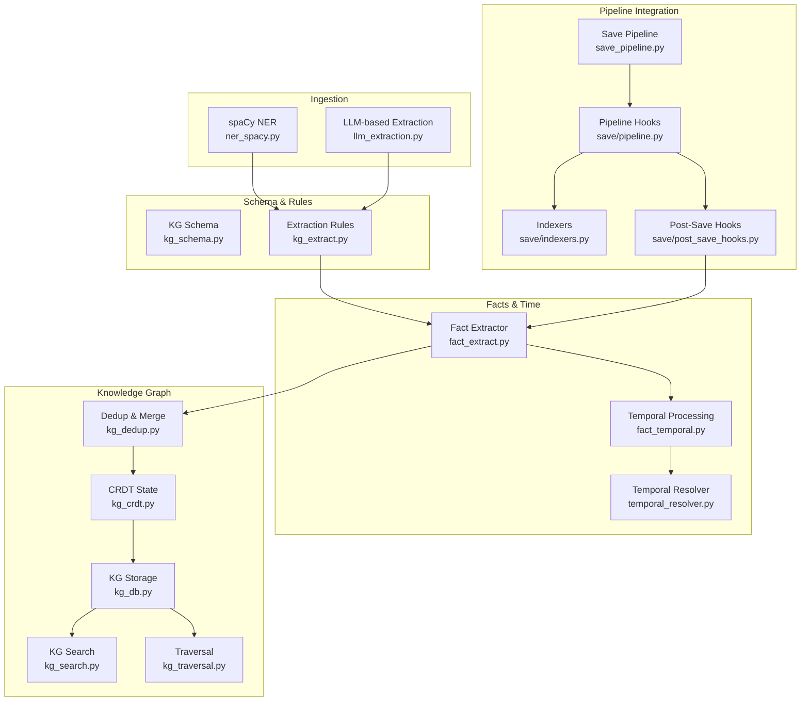
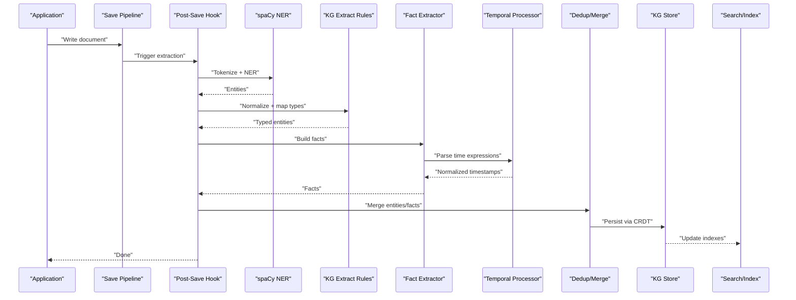
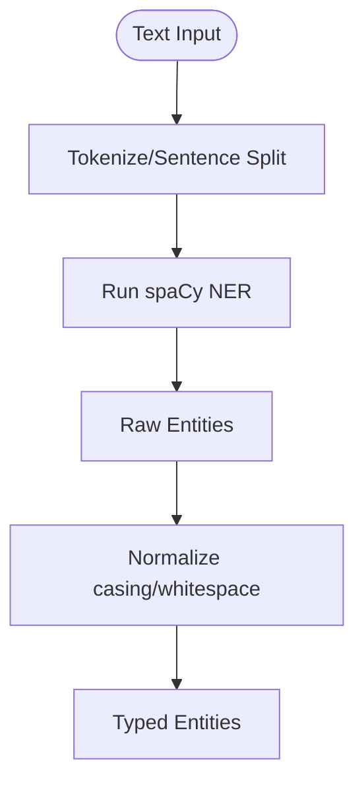
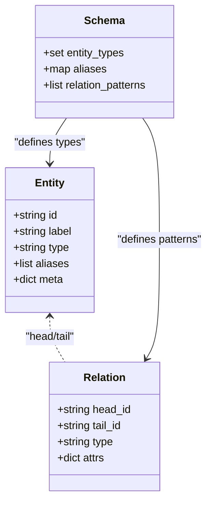
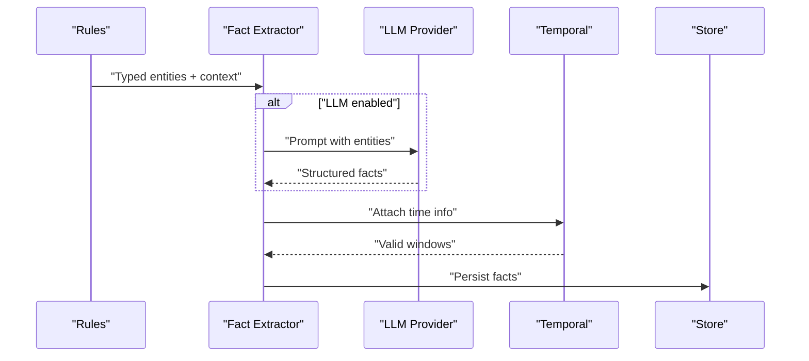
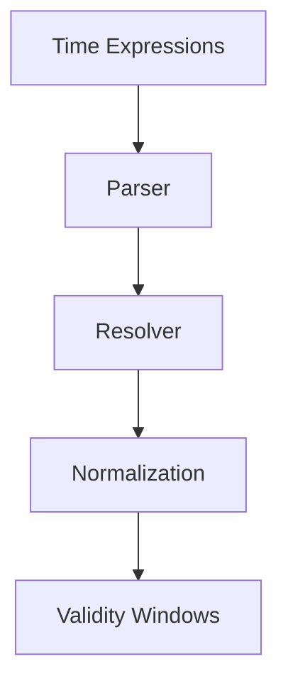
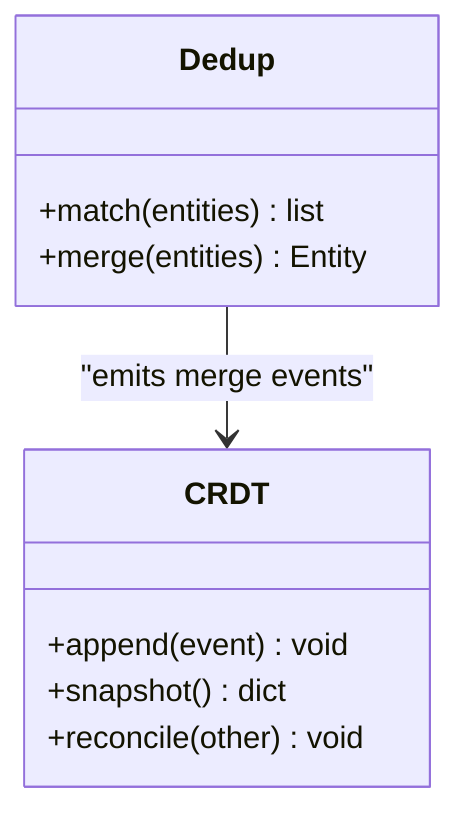
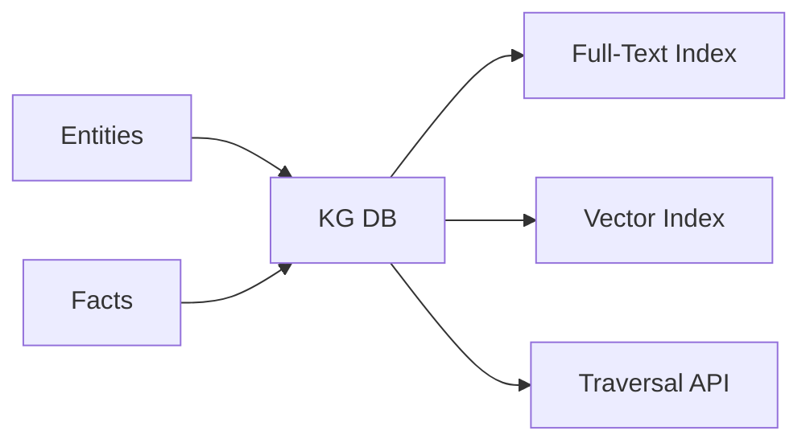
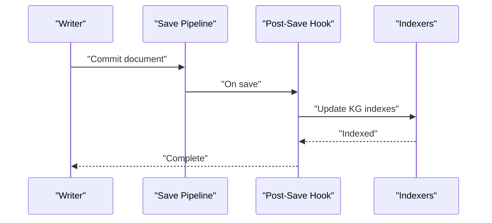
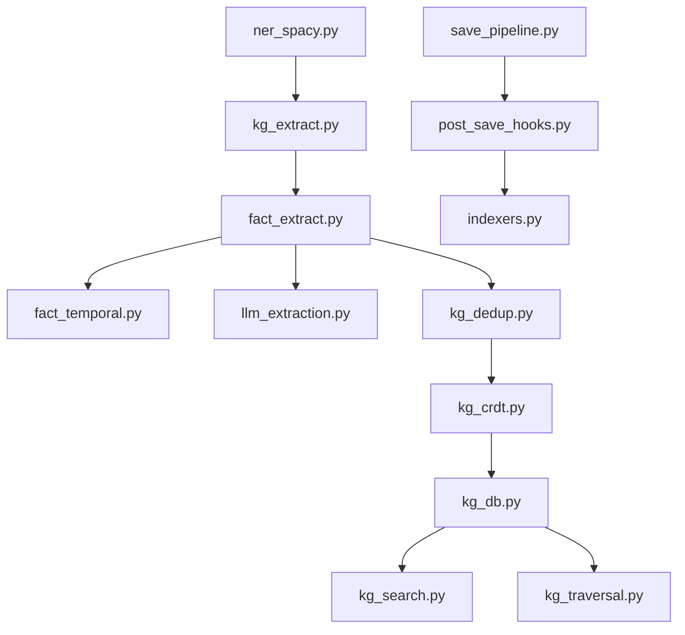

# Entity Extraction

<cite>
**Referenced Files in This Document**
- [ner_spacy.py](file://knowledge_graph/ner_spacy.py)
- [kg_extract.py](file://knowledge_graph/kg_extract.py)
- [kg_schema.py](file://knowledge_graph/kg_schema.py)
- [fact_extract.py](file://fact/fact_extract.py)
- [fact_temporal.py](file://fact/fact_temporal.py)
- [llm_extraction.py](file://fact/llm_extraction.py)
- [temporal_resolver.py](file://kg/temporal_resolver.py)
- [kg_traversal.py](file://kg/kg_traversal.py)
- [kg_dedup.py](file://kg/kg_dedup.py)
- [kg_crdt.py](file://kg/kg_crdt.py)
- [kg_search.py](file://knowledge_graph/kg_search.py)
- [kg_db.py](file://knowledge_graph/kg_db.py)
- [save_pipeline.py](file://save_pipeline.py)
- [pipeline.py](file://save/pipeline.py)
- [indexers.py](file://save/indexers.py)
- [post_save_hooks.py](file://save/post_save_hooks.py)
- [cron_kg_backfill.py](file://cron/cron_kg_backfill.py)
- [test_fact_extraction.py](file://eval/test_fact_extraction.py)
- [test_event_time_extraction.py](file://eval/test_event_time_extraction.py)
- [test_temporal_facts.py](file://eval/test_temporal_facts.py)
- [test_kg_entity_filter.py](file://eval/test_kg_entity_filter.py)
- [test_kg_validation.py](file://eval/test_kg_validation.py)
- [custom-entity-types.md](file://docs/how-to/custom-entity-types.md)
</cite>

## Table of Contents
1. [Introduction](#introduction)
2. [Project Structure](#project-structure)
3. [Core Components](#core-components)
4. [Architecture Overview](#architecture-overview)
5. [Detailed Component Analysis](#detailed-component-analysis)
6. [Dependency Analysis](#dependency-analysis)
7. [Performance Considerations](#performance-considerations)
8. [Troubleshooting Guide](#troubleshooting-guide)
9. [Conclusion](#conclusion)
10. [Appendices](#appendices)

## Introduction
This document explains how the system identifies and extracts entities from text, integrates spaCy for named entity recognition (NER), defines custom entity types, and builds a knowledge graph with facts, temporal information, and inferred relationships. It also covers configuration options, performance tuning, batch processing strategies, and accuracy improvements for custom domains.

## Project Structure
Entity extraction spans several modules:
- NER and schema definitions under knowledge_graph
- Fact extraction and temporal processing under fact
- KG storage, deduplication, traversal, and search under kg and knowledge_graph
- Save pipeline integration and post-save hooks
- Cron jobs for backfills and maintenance
- Tests validating behavior and edge cases

**Diagram sources**
- [ner_spacy.py:1-200](file://knowledge_graph/ner_spacy.py#L1-L200)
- [kg_extract.py:1-200](file://knowledge_graph/kg_extract.py#L1-L200)
- [kg_schema.py:1-200](file://knowledge_graph/kg_schema.py#L1-L200)
- [fact_extract.py:1-200](file://fact/fact_extract.py#L1-L200)
- [fact_temporal.py:1-200](file://fact/fact_temporal.py#L1-L200)
- [temporal_resolver.py:1-200](file://kg/temporal_resolver.py#L1-L200)
- [kg_dedup.py:1-200](file://kg/kg_dedup.py#L1-L200)
- [kg_crdt.py:1-200](file://kg/kg_crdt.py#L1-L200)
- [kg_db.py:1-200](file://knowledge_graph/kg_db.py#L1-L200)
- [kg_search.py:1-200](file://knowledge_graph/kg_search.py#L1-L200)
- [kg_traversal.py:1-200](file://kg/kg_traversal.py#L1-L200)
- [save_pipeline.py:1-200](file://save_pipeline.py#L1-L200)
- [pipeline.py:1-200](file://save/pipeline.py#L1-L200)
- [indexers.py:1-200](file://save/indexers.py#L1-L200)
- [post_save_hooks.py:1-200](file://save/post_save_hooks.py#L1-L200)

**Section sources**
- [ner_spacy.py:1-200](file://knowledge_graph/ner_spacy.py#L1-L200)
- [kg_extract.py:1-200](file://knowledge_graph/kg_extract.py#L1-L200)
- [kg_schema.py:1-200](file://knowledge_graph/kg_schema.py#L1-L200)
- [fact_extract.py:1-200](file://fact/fact_extract.py#L1-L200)
- [fact_temporal.py:1-200](file://fact/fact_temporal.py#L1-L200)
- [temporal_resolver.py:1-200](file://kg/temporal_resolver.py#L1-L200)
- [kg_dedup.py:1-200](file://kg/kg_dedup.py#L1-L200)
- [kg_crdt.py:1-200](file://kg/kg_crdt.py#L1-L200)
- [kg_db.py:1-200](file://knowledge_graph/kg_db.py#L1-L200)
- [kg_search.py:1-200](file://knowledge_graph/kg_search.py#L1-L200)
- [kg_traversal.py:1-200](file://kg/kg_traversal.py#L1-L200)
- [save_pipeline.py:1-200](file://save_pipeline.py#L1-L200)
- [pipeline.py:1-200](file://save/pipeline.py#L1-L200)
- [indexers.py:1-200](file://save/indexers.py#L1-L200)
- [post_save_hooks.py:1-200](file://save/post_save_hooks.py#L1-L200)

## Core Components
- spaCy NER integration: tokenization, sentence segmentation, and entity detection using spaCy pipelines; supports custom entity labels and rule-based extensions.
- KG schema and rules: canonical entity types, normalization, aliasing, and relationship patterns that transform raw entities into structured facts.
- Fact extraction: converts entities and context into atomic facts with optional temporal annotations.
- Temporal processing: parses relative and absolute time expressions, resolves to normalized timestamps, and manages validity windows.
- Deduplication and merging: merges equivalent entities and consolidates facts across documents and sessions.
- Storage and retrieval: persists entities and facts, supports full-text and semantic search, and provides traversal utilities.
- Pipeline integration: plugs into save pipeline and post-save hooks to trigger extraction on new content.

**Section sources**
- [ner_spacy.py:1-200](file://knowledge_graph/ner_spacy.py#L1-L200)
- [kg_schema.py:1-200](file://knowledge_graph/kg_schema.py#L1-L200)
- [kg_extract.py:1-200](file://knowledge_graph/kg_extract.py#L1-L200)
- [fact_extract.py:1-200](file://fact/fact_extract.py#L1-L200)
- [fact_temporal.py:1-200](file://fact/fact_temporal.py#L1-L200)
- [kg_dedup.py:1-200](file://kg/kg_dedup.py#L1-L200)
- [kg_db.py:1-200](file://knowledge_graph/kg_db.py#L1-L200)
- [kg_search.py:1-200](file://knowledge_graph/kg_search.py#L1-L200)
- [kg_traversal.py:1-200](file://kg/kg_traversal.py#L1-L200)
- [save_pipeline.py:1-200](file://save_pipeline.py#L1-L200)
- [pipeline.py:1-200](file://save/pipeline.py#L1-L200)
- [post_save_hooks.py:1-200](file://save/post_save_hooks.py#L1-L200)

## Architecture Overview
The extraction architecture combines statistical NER (spaCy) with rule-based normalization and optional LLM-assisted extraction. Facts are temporally annotated, deduplicated, and persisted as a conflict-free knowledge graph. Downstream consumers use search and traversal APIs.

**Diagram sources**
- [save_pipeline.py:1-200](file://save_pipeline.py#L1-L200)
- [post_save_hooks.py:1-200](file://save/post_save_hooks.py#L1-L200)
- [ner_spacy.py:1-200](file://knowledge_graph/ner_spacy.py#L1-L200)
- [kg_extract.py:1-200](file://knowledge_graph/kg_extract.py#L1-L200)
- [fact_extract.py:1-200](file://fact/fact_extract.py#L1-L200)
- [fact_temporal.py:1-200](file://fact/fact_temporal.py#L1-L200)
- [kg_dedup.py:1-200](file://kg/kg_dedup.py#L1-L200)
- [kg_crdt.py:1-200](file://kg/kg_crdt.py#L1-L200)
- [kg_db.py:1-200](file://knowledge_graph/kg_db.py#L1-L200)
- [kg_search.py:1-200](file://knowledge_graph/kg_search.py#L1-L200)

## Detailed Component Analysis

### spaCy NER Integration
- Tokenization and sentence splitting are performed by spaCy before entity detection.
- Custom entity labels can be added to the spaCy model or via rule-based matchers to capture domain-specific terms.
- The integration exposes functions to extract entities with offsets and metadata suitable for downstream normalization.

**Diagram sources**
- [ner_spacy.py:1-200](file://knowledge_graph/ner_spacy.py#L1-L200)

**Section sources**
- [ner_spacy.py:1-200](file://knowledge_graph/ner_spacy.py#L1-L200)

### KG Schema and Extraction Rules
- Canonical entity types include persons, organizations, locations, and concepts.
- Normalization includes alias resolution, case folding, and synonym mapping.
- Relationship patterns define how pairs of entities form typed relations (e.g., works_for, located_in).

**Diagram sources**
- [kg_schema.py:1-200](file://knowledge_graph/kg_schema.py#L1-L200)
- [kg_extract.py:1-200](file://knowledge_graph/kg_extract.py#L1-L200)

**Section sources**
- [kg_schema.py:1-200](file://knowledge_graph/kg_schema.py#L1-L200)
- [kg_extract.py:1-200](file://knowledge_graph/kg_extract.py#L1-L200)

### Fact Extraction Pipeline
- Converts typed entities and surrounding context into atomic facts.
- Supports optional LLM-based extraction for complex semantics when configured.
- Emits facts with provenance and confidence scores.

**Diagram sources**
- [fact_extract.py:1-200](file://fact/fact_extract.py#L1-L200)
- [llm_extraction.py:1-200](file://fact/llm_extraction.py#L1-L200)
- [fact_temporal.py:1-200](file://fact/fact_temporal.py#L1-L200)
- [kg_db.py:1-200](file://knowledge_graph/kg_db.py#L1-L200)

**Section sources**
- [fact_extract.py:1-200](file://fact/fact_extract.py#L1-L200)
- [llm_extraction.py:1-200](file://fact/llm_extraction.py#L1-L200)
- [fact_temporal.py:1-200](file://fact/fact_temporal.py#L1-L200)

### Temporal Information Extraction
- Parses absolute dates, relative expressions, and durations.
- Resolves ambiguous times using context and defaults.
- Produces normalized timestamps and validity intervals for facts.

**Diagram sources**
- [fact_temporal.py:1-200](file://fact/fact_temporal.py#L1-L200)
- [temporal_resolver.py:1-200](file://kg/temporal_resolver.py#L1-L200)

**Section sources**
- [fact_temporal.py:1-200](file://fact/fact_temporal.py#L1-L200)
- [temporal_resolver.py:1-200](file://kg/temporal_resolver.py#L1-L200)

### Deduplication, Merging, and CRDT State
- Detects equivalent entities via string similarity, aliases, and cross-references.
- Merges facts and maintains versioned state using CRDTs for conflict-free updates.
- Ensures idempotent writes and consistent reads across workers.

**Diagram sources**
- [kg_dedup.py:1-200](file://kg/kg_dedup.py#L1-L200)
- [kg_crdt.py:1-200](file://kg/kg_crdt.py#L1-L200)

**Section sources**
- [kg_dedup.py:1-200](file://kg/kg_dedup.py#L1-L200)
- [kg_crdt.py:1-200](file://kg/kg_crdt.py#L1-L200)

### Storage, Search, and Traversal
- Persists entities and facts with indexes for fast lookup.
- Provides full-text and vector search over facts and entities.
- Offers traversal utilities to explore relationships and communities.

**Diagram sources**
- [kg_db.py:1-200](file://knowledge_graph/kg_db.py#L1-L200)
- [kg_search.py:1-200](file://knowledge_graph/kg_search.py#L1-L200)
- [kg_traversal.py:1-200](file://kg/kg_traversal.py#L1-L200)

**Section sources**
- [kg_db.py:1-200](file://knowledge_graph/kg_db.py#L1-L200)
- [kg_search.py:1-200](file://knowledge_graph/kg_search.py#L1-L200)
- [kg_traversal.py:1-200](file://kg/kg_traversal.py#L1-L200)

### Pipeline Integration and Post-Save Hooks
- The save pipeline triggers extraction after successful persistence.
- Post-save hooks orchestrate NER, rule application, fact building, and indexing.
- Indexers update search structures incrementally.

**Diagram sources**
- [save_pipeline.py:1-200](file://save_pipeline.py#L1-L200)
- [pipeline.py:1-200](file://save/pipeline.py#L1-L200)
- [indexers.py:1-200](file://save/indexers.py#L1-L200)
- [post_save_hooks.py:1-200](file://save/post_save_hooks.py#L1-L200)

**Section sources**
- [save_pipeline.py:1-200](file://save_pipeline.py#L1-L200)
- [pipeline.py:1-200](file://save/pipeline.py#L1-L200)
- [indexers.py:1-200](file://save/indexers.py#L1-L200)
- [post_save_hooks.py:1-200](file://save/post_save_hooks.py#L1-L200)

### Backfills and Maintenance
- Dedicated cron job rebuilds KG indices and re-extracts from existing content.
- Useful for schema changes, model upgrades, or correcting past extractions.

**Section sources**
- [cron_kg_backfill.py:1-200](file://cron/cron_kg_backfill.py#L1-L200)

## Dependency Analysis
Key dependencies and coupling:
- NER depends on spaCy and custom label sets.
- Extraction rules depend on schema definitions and alias maps.
- Fact extraction optionally depends on LLM providers.
- Temporal processing depends on date/time parsing libraries.
- Dedup and CRDT ensure consistency across concurrent writers.
- Storage and search provide read paths for applications.

**Diagram sources**
- [ner_spacy.py:1-200](file://knowledge_graph/ner_spacy.py#L1-L200)
- [kg_extract.py:1-200](file://knowledge_graph/kg_extract.py#L1-L200)
- [fact_extract.py:1-200](file://fact/fact_extract.py#L1-L200)
- [fact_temporal.py:1-200](file://fact/fact_temporal.py#L1-L200)
- [llm_extraction.py:1-200](file://fact/llm_extraction.py#L1-L200)
- [kg_dedup.py:1-200](file://kg/kg_dedup.py#L1-L200)
- [kg_crdt.py:1-200](file://kg/kg_crdt.py#L1-L200)
- [kg_db.py:1-200](file://knowledge_graph/kg_db.py#L1-L200)
- [kg_search.py:1-200](file://knowledge_graph/kg_search.py#L1-L200)
- [kg_traversal.py:1-200](file://kg/kg_traversal.py#L1-L200)
- [save_pipeline.py:1-200](file://save_pipeline.py#L1-L200)
- [post_save_hooks.py:1-200](file://save/post_save_hooks.py#L1-L200)
- [indexers.py:1-200](file://save/indexers.py#L1-L200)

**Section sources**
- [ner_spacy.py:1-200](file://knowledge_graph/ner_spacy.py#L1-L200)
- [kg_extract.py:1-200](file://knowledge_graph/kg_extract.py#L1-L200)
- [fact_extract.py:1-200](file://fact/fact_extract.py#L1-L200)
- [fact_temporal.py:1-200](file://fact/fact_temporal.py#L1-L200)
- [llm_extraction.py:1-200](file://fact/llm_extraction.py#L1-L200)
- [kg_dedup.py:1-200](file://kg/kg_dedup.py#L1-L200)
- [kg_crdt.py:1-200](file://kg/kg_crdt.py#L1-L200)
- [kg_db.py:1-200](file://knowledge_graph/kg_db.py#L1-L200)
- [kg_search.py:1-200](file://knowledge_graph/kg_search.py#L1-L200)
- [kg_traversal.py:1-200](file://kg/kg_traversal.py#L1-L200)
- [save_pipeline.py:1-200](file://save_pipeline.py#L1-L200)
- [post_save_hooks.py:1-200](file://save/post_save_hooks.py#L1-L200)
- [indexers.py:1-200](file://save/indexers.py#L1-L200)

## Performance Considerations
- Batch processing: group documents to amortize model loading and I/O overhead.
- Incremental indexing: update only affected indexes after saves.
- Caching: cache spaCy models and LLM responses where safe.
- Concurrency control: leverage CRDTs and distributed locks to avoid contention.
- Tuning thresholds: adjust dedup similarity and confidence cutoffs per domain.
- Resource limits: cap LLM tokens and timeouts to prevent stalls.

[No sources needed since this section provides general guidance]

## Troubleshooting Guide
Common issues and diagnostics:
- Missing entities: verify spaCy model language and custom labels are loaded.
- Incorrect types: review alias maps and normalization rules.
- Temporal errors: check parser inputs and default timezone settings.
- Duplicate entities: tune dedup thresholds and expand alias lists.
- Slow ingestion: enable batching and reduce LLM usage.

Validation and tests:
- Fact extraction correctness and edge cases.
- Event time parsing and normalization.
- Temporal facts validity and resolution.
- Entity filtering and validation constraints.

**Section sources**
- [test_fact_extraction.py:1-200](file://eval/test_fact_extraction.py#L1-L200)
- [test_event_time_extraction.py:1-200](file://eval/test_event_time_extraction.py#L1-L200)
- [test_temporal_facts.py:1-200](file://eval/test_temporal_facts.py#L1-L200)
- [test_kg_entity_filter.py:1-200](file://eval/test_kg_entity_filter.py#L1-L200)
- [test_kg_validation.py:1-200](file://eval/test_kg_validation.py#L1-L200)

## Conclusion
The system combines spaCy NER, rule-based normalization, and optional LLM assistance to extract entities and build a robust knowledge graph. Temporal parsing enriches facts with valid time windows, while deduplication and CRDTs ensure consistency. With careful configuration and tuning, the pipeline scales to large corpora and adapts to custom domains.

## Appendices

### Custom Entity Types
- Define new entity types and aliases through schema configuration.
- Extend spaCy with custom labels and matcher rules.
- Update extraction rules to recognize and normalize new types.

**Section sources**
- [custom-entity-types.md:1-200](file://docs/how-to/custom-entity-types.md#L1-L200)
- [kg_schema.py:1-200](file://knowledge_graph/kg_schema.py#L1-L200)
- [ner_spacy.py:1-200](file://knowledge_graph/ner_spacy.py#L1-L200)

### Configuration Options
- Enable/disable LLM-based extraction.
- Set dedup similarity thresholds and confidence cutoffs.
- Configure temporal defaults (timezones, relative time anchors).
- Tune indexing and search parameters.

[No sources needed since this section provides general guidance]