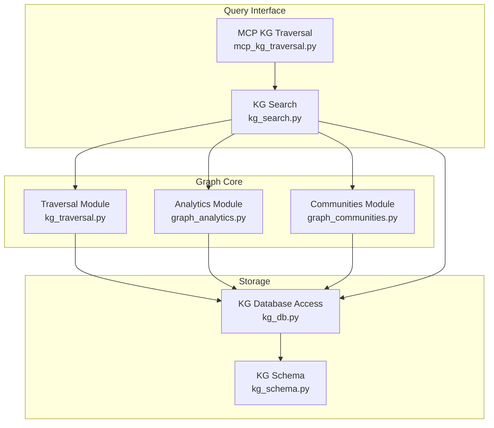
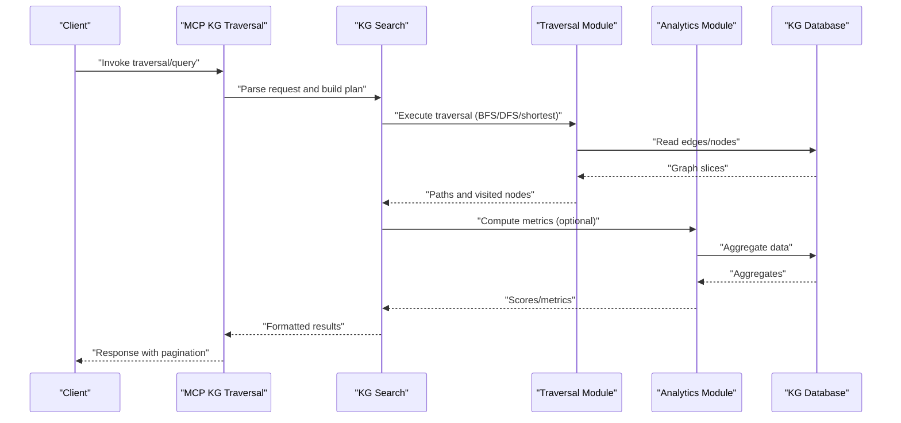
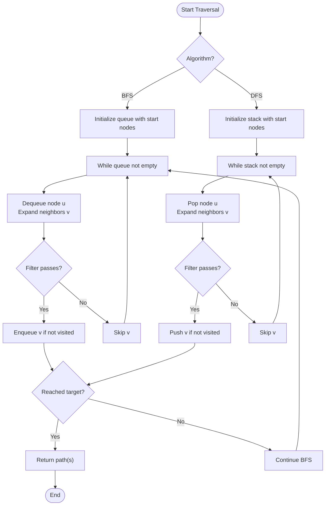
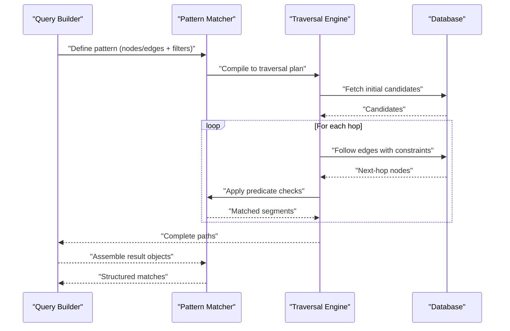
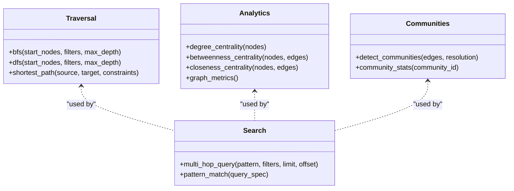
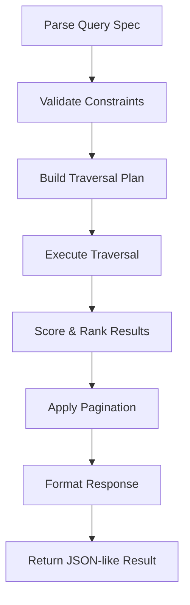
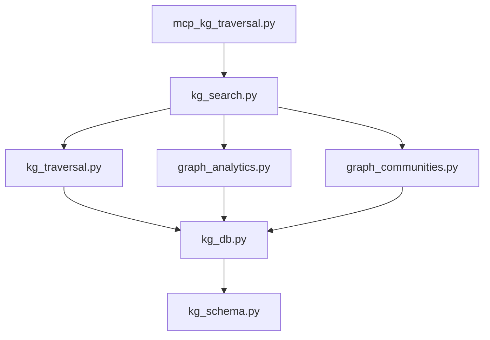

# Graph Traversal and Queries

<cite>
**Referenced Files in This Document**
- [kg_traversal.py](file://kg/kg_traversal.py)
- [graph_analytics.py](file://kg/graph_analytics.py)
- [graph_communities.py](file://kg/graph_communities.py)
- [kg_search.py](file://knowledge_graph/kg_search.py)
- [mcp_kg_traversal.py](file://mcp_kg_traversal.py)
- [test_kg_traversal.py](file://tests/test_kg_traversal.py)
- [test_multi_hop_traversal.py](file://tests/test_multi_hop_traversal.py)
- [kg_db.py](file://knowledge_graph/kg_db.py)
- [kg_schema.py](file://knowledge_graph/kg_schema.py)
</cite>

## Table of Contents
1. [Introduction](#introduction)
2. [Project Structure](#project-structure)
3. [Core Components](#core-components)
4. [Architecture Overview](#architecture-overview)
5. [Detailed Component Analysis](#detailed-component-analysis)
6. [Dependency Analysis](#dependency-analysis)
7. [Performance Considerations](#performance-considerations)
8. [Troubleshooting Guide](#troubleshooting-guide)
9. [Conclusion](#conclusion)
10. [Appendices](#appendices)

## Introduction
This document explains the graph traversal algorithms and query capabilities available for knowledge graphs, including path finding (BFS, DFS, shortest path), multi-hop queries, pattern matching, and analytical functions such as centrality measures, community detection, and general graph metrics. It also provides practical examples of complex graph queries, performance optimization techniques, indexing strategies for large graphs, and guidance on query language syntax, result formatting, and pagination for large result sets.

## Project Structure
The graph-related functionality is implemented across several modules:
- Traversal and pathfinding logic resides in a dedicated traversal module.
- Analytical functions (centrality, communities, metrics) are provided by analytics and community modules.
- Knowledge graph search and query interfaces are exposed via a search module and MCP tools.
- Database access and schema definitions support efficient storage and retrieval.

**Diagram sources**
- [kg_traversal.py](file://kg/kg_traversal.py)
- [graph_analytics.py](file://kg/graph_analytics.py)
- [graph_communities.py](file://kg/graph_communities.py)
- [kg_search.py](file://knowledge_graph/kg_search.py)
- [mcp_kg_traversal.py](file://mcp_kg_traversal.py)
- [kg_db.py](file://knowledge_graph/kg_db.py)
- [kg_schema.py](file://knowledge_graph/kg_schema.py)

**Section sources**
- [kg_traversal.py](file://kg/kg_traversal.py)
- [graph_analytics.py](file://kg/graph_analytics.py)
- [graph_communities.py](file://kg/graph_communities.py)
- [kg_search.py](file://knowledge_graph/kg_search.py)
- [mcp_kg_traversal.py](file://mcp_kg_traversal.py)
- [kg_db.py](file://knowledge_graph/kg_db.py)
- [kg_schema.py](file://knowledge_graph/kg_schema.py)

## Core Components
- Traversal and Pathfinding
  - Breadth-first search (BFS) for level-order exploration and shortest unweighted paths.
  - Depth-first search (DFS) for deep exploration and backtracking-based discovery.
  - Shortest path utilities that leverage BFS or weighted variants when applicable.
- Multi-Hop Queries
  - Composable traversal primitives enabling N-hop expansions with filters and constraints.
  - Pattern matching over sequences of edges and nodes to express structured queries.
- Analytical Functions
  - Centrality measures (e.g., degree, betweenness, closeness) for node importance analysis.
  - Community detection routines to identify cohesive subgraphs.
  - General graph metrics (connectivity, density, diameter approximations).
- Query Interface
  - High-level search API that composes traversal, filtering, ranking, and pagination.
  - MCP tooling for programmatic invocation from external systems.

**Section sources**
- [kg_traversal.py](file://kg/kg_traversal.py)
- [graph_analytics.py](file://kg/graph_analytics.py)
- [graph_communities.py](file://kg/graph_communities.py)
- [kg_search.py](file://knowledge_graph/kg_search.py)
- [mcp_kg_traversal.py](file://mcp_kg_traversal.py)

## Architecture Overview
The system separates concerns into traversal, analytics, and query layers, all backed by a consistent database interface. The search layer orchestrates traversal and analytics to answer user queries, while MCP exposes these capabilities to clients.

**Diagram sources**
- [mcp_kg_traversal.py](file://mcp_kg_traversal.py)
- [kg_search.py](file://knowledge_graph/kg_search.py)
- [kg_traversal.py](file://kg/kg_traversal.py)
- [graph_analytics.py](file://kg/graph_analytics.py)
- [kg_db.py](file://knowledge_graph/kg_db.py)

## Detailed Component Analysis

### Traversal and Pathfinding
- Breadth-First Search (BFS)
  - Explores neighbors level-by-level; suitable for shortest unweighted paths and bounded-depth queries.
  - Supports pruning via filters and early termination upon reaching target nodes.
- Depth-First Search (DFS)
  - Follows one branch deeply before backtracking; useful for exhaustive exploration and cycle detection.
  - Can be constrained by depth limits and edge/node predicates.
- Shortest Path
  - Uses BFS for unweighted graphs; can integrate with weighted variants if edge weights are present.
  - Returns ordered paths with hop counts and optional intermediate metadata.

**Diagram sources**
- [kg_traversal.py](file://kg/kg_traversal.py)

**Section sources**
- [kg_traversal.py](file://kg/kg_traversal.py)

### Multi-Hop Queries and Pattern Matching
- Multi-Hop Expansion
  - Compose multiple traversal steps with filters at each hop to constrain the search space.
  - Supports variable-length hops within configured bounds to avoid combinatorial explosion.
- Pattern Matching
  - Express patterns as sequences of node and edge constraints.
  - Matchers evaluate structural properties (labels, types, attributes) and temporal constraints where applicable.

**Diagram sources**
- [kg_search.py](file://knowledge_graph/kg_search.py)
- [kg_traversal.py](file://kg/kg_traversal.py)

**Section sources**
- [kg_search.py](file://knowledge_graph/kg_search.py)
- [kg_traversal.py](file://kg/kg_traversal.py)

### Analytical Functions
- Centrality Measures
  - Degree centrality: local connectivity strength.
  - Betweenness centrality: importance based on shortest-path usage.
  - Closeness centrality: proximity to all other nodes.
- Community Detection
  - Algorithms to partition the graph into cohesive clusters.
  - Useful for summarization and targeted analytics.
- Graph Metrics
  - Global statistics like density, average degree, connected components, and diameter approximations.

**Diagram sources**
- [kg_traversal.py](file://kg/kg_traversal.py)
- [graph_analytics.py](file://kg/graph_analytics.py)
- [graph_communities.py](file://kg/graph_communities.py)
- [kg_search.py](file://knowledge_graph/kg_search.py)

**Section sources**
- [graph_analytics.py](file://kg/graph_analytics.py)
- [graph_communities.py](file://kg/graph_communities.py)
- [kg_search.py](file://knowledge_graph/kg_search.py)

### Query Language Syntax and Result Formatting
- Syntax Elements
  - Node and edge selectors with labels/types and attribute filters.
  - Hop specifications with min/max depth and directionality.
  - Aggregation and scoring options for ranking results.
- Result Format
  - Structured responses containing matched paths, scores, and metadata.
  - Consistent field naming for downstream processing.
- Pagination
  - Offset and limit parameters to paginate large result sets.
  - Cursor-based pagination for stable ordering across pages.

**Diagram sources**
- [kg_search.py](file://knowledge_graph/kg_search.py)

**Section sources**
- [kg_search.py](file://knowledge_graph/kg_search.py)

### Practical Examples
- Find all entities related to a concept within two hops, filtered by type and recency.
- Compute betweenness centrality for top-k nodes to identify influential connectors.
- Detect communities around a seed node set and summarize cluster characteristics.
- Pattern match a sequence of relationships to extract workflows or processes.

[No sources needed since this section provides conceptual examples]

## Dependency Analysis
The traversal and analytics modules depend on the database layer for reading graph structures. The search layer composes these modules to implement high-level queries. MCP wraps the search layer for external integration.

**Diagram sources**
- [kg_traversal.py](file://kg/kg_traversal.py)
- [graph_analytics.py](file://kg/graph_analytics.py)
- [graph_communities.py](file://kg/graph_communities.py)
- [kg_search.py](file://knowledge_graph/kg_search.py)
- [mcp_kg_traversal.py](file://mcp_kg_traversal.py)
- [kg_db.py](file://knowledge_graph/kg_db.py)
- [kg_schema.py](file://knowledge_graph/kg_schema.py)

**Section sources**
- [kg_traversal.py](file://kg/kg_traversal.py)
- [graph_analytics.py](file://kg/graph_analytics.py)
- [graph_communities.py](file://kg/graph_communities.py)
- [kg_search.py](file://knowledge_graph/kg_search.py)
- [mcp_kg_traversal.py](file://mcp_kg_traversal.py)
- [kg_db.py](file://knowledge_graph/kg_db.py)
- [kg_schema.py](file://knowledge_graph/kg_schema.py)

## Performance Considerations
- Indexing Strategies
  - Ensure indexes on frequently filtered attributes (node labels, edge types, timestamps).
  - Use composite indexes for common filter combinations to reduce scan costs.
- Traversal Optimization
  - Apply early filters to prune branches aggressively.
  - Limit max depth and use bidirectional search for shortest paths when feasible.
- Analytics Efficiency
  - Cache centrality and community results incrementally; recompute only affected regions after updates.
  - Approximate metrics for very large graphs to balance accuracy and latency.
- Query Design
  - Prefer specific patterns and constraints to minimize candidate sets.
  - Use pagination and cursors to avoid loading entire result sets.

[No sources needed since this section provides general guidance]

## Troubleshooting Guide
- Common Issues
  - Excessive memory usage during deep traversals: reduce depth limits and add stronger filters.
  - Slow queries due to missing indexes: review filter predicates and add appropriate indexes.
  - Inconsistent results after writes: ensure transactions and snapshots are used consistently.
- Debugging Tools
  - Enable detailed logs for traversal plans and execution times.
  - Inspect intermediate results to validate pattern matching correctness.

**Section sources**
- [test_kg_traversal.py](file://tests/test_kg_traversal.py)
- [test_multi_hop_traversal.py](file://tests/test_multi_hop_traversal.py)

## Conclusion
The graph traversal and query subsystem provides robust primitives for path finding, multi-hop queries, and pattern matching, complemented by analytical functions for centrality, community detection, and global metrics. By combining careful query design, effective indexing, and incremental analytics, the system scales to large graphs while maintaining responsiveness. MCP exposure enables seamless integration with external applications.

## Appendices

### Appendix A: Query Language Reference
- Selectors
  - Nodes: label/type filters, attribute conditions, temporal windows.
  - Edges: relationship types, directionality, weight thresholds.
- Hops
  - Min/max depth, repeat constraints, branching factors.
- Filters and Scoring
  - Boolean expressions over attributes and computed features.
  - Ranking strategies (recency, relevance, centrality boost).
- Pagination
  - Offset/limit and cursor-based modes.

[No sources needed since this section provides conceptual reference]

### Appendix B: Example Workflows
- Workflow 1: Influence Analysis
  - Compute degree and betweenness centrality for top-k nodes.
  - Visualize communities around high-betweenness nodes.
- Workflow 2: Process Discovery
  - Define a pattern representing a workflow.
  - Match occurrences and aggregate frequencies.

[No sources needed since this section provides conceptual examples]