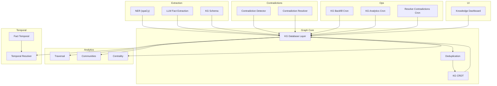
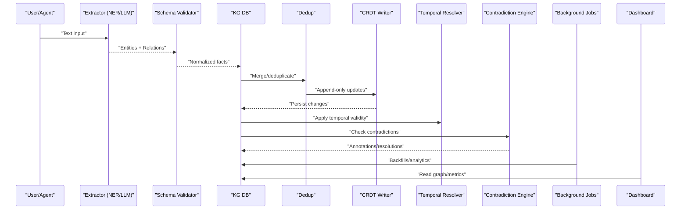
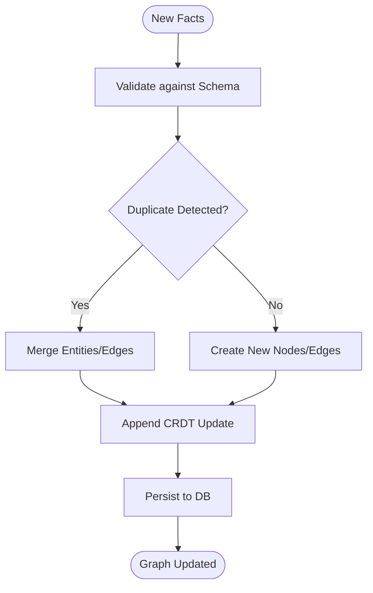
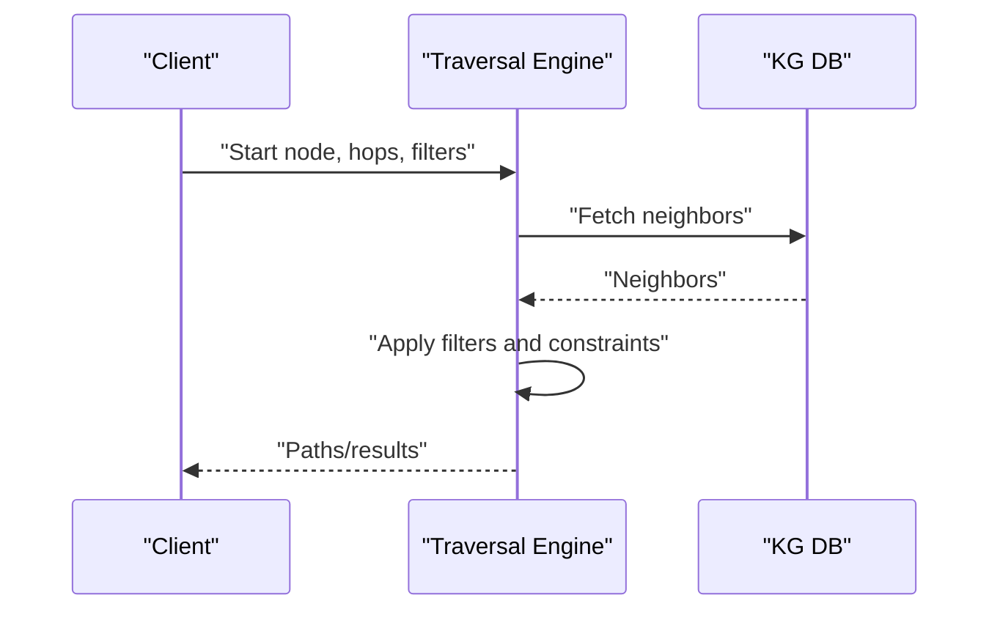
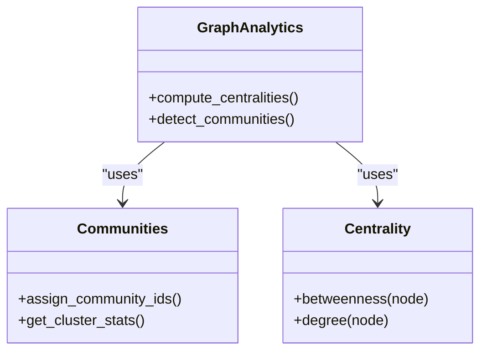
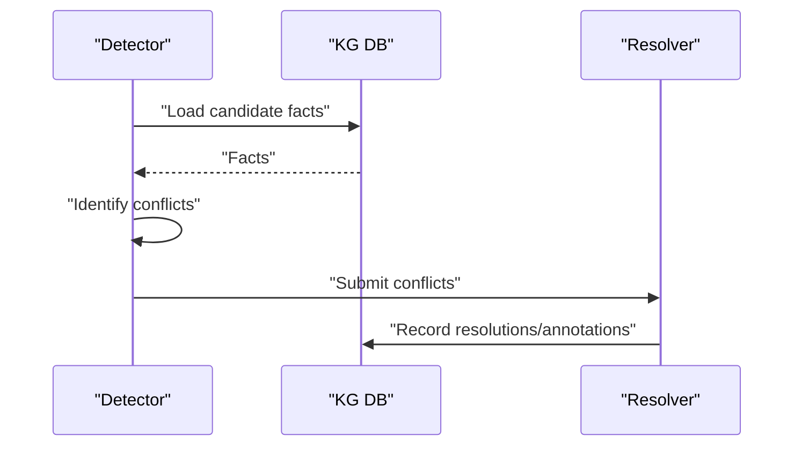
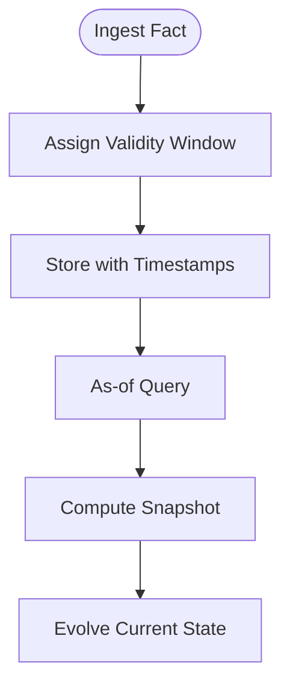
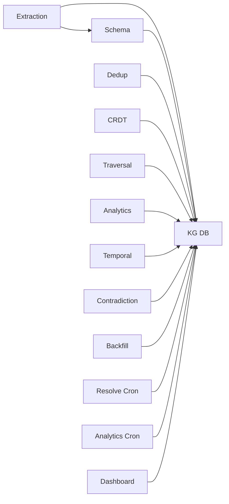

# Knowledge Graph

<cite>
**Referenced Files in This Document**
- [kg.py](file://agentic_memory/kg.py)
- [kg_extract.py](file://knowledge_graph/kg_extract.py)
- [kg_schema.py](file://knowledge_graph/kg_schema.py)
- [kg_db.py](file://knowledge_graph/kg_db.py)
- [kg_search.py](file://knowledge_graph/kg_search.py)
- [ner_spacy.py](file://knowledge_graph/ner_spacy.py)
- [kg_traversal.py](file://kg/kg_traversal.py)
- [graph_analytics.py](file://kg/graph_analytics.py)
- [graph_communities.py](file://kg/graph_communities.py)
- [contradiction_detector.py](file://kg/contradiction_detector.py)
- [contradiction_resolver.py](file://kg/contradiction_resolver.py)
- [temporal_resolver.py](file://kg/temporal_resolver.py)
- [kg_crdt.py](file://kg/kg_crdt.py)
- [kg_dedup.py](file://kg/kg_dedup.py)
- [fact_extract.py](file://fact/fact_extract.py)
- [fact_temporal.py](file://fact/fact_temporal.py)
- [llm_extraction.py](file://fact/llm_extraction.py)
- [cron_kg_backfill.py](file://cron/cron_kg_backfill.py)
- [cron_resolve_contradictions.py](file://cron/cron_resolve_contradictions.py)
- [cron_kg_analytics.py](file://cron/cron_kg_analytics.py)
- [kg_dashboard.py](file://dashboard/tab_knowledge.py)
- [000_base_schema.sql](file://migrations/000_base_schema.sql)
- [018_fact_temporal.sql](file://migrations/018_fact_temporal.sql)
- [029_graph_snapshots.sql](file://migrations/029_graph_snapshots.sql)
- [030_community_id_and_betweenness.sql](file://migrations/030_community_id_and_betweenness.sql)
- [test_kg_traversal.py](file://eval/test_kg_traversal.py)
- [test_knowledge_graph.py](file://eval/test_knowledge_graph.py)
- [test_multi_hop_traversal.py](file://eval/test_multi_hop_traversal.py)
- [test_contradiction_engine.py](file://eval/test_contradiction_engine.py)
- [test_temporal_facts.py](file://eval/test_temporal_facts.py)
</cite>

## Table of Contents
1. Introduction
2. Project Structure
3. Core Components
4. Architecture Overview
5. Detailed Component Analysis
6. Dependency Analysis
7. Performance Considerations
8. Troubleshooting Guide
9. Conclusion
10. Appendices

## Introduction
This document provides comprehensive documentation for the knowledge graph system, covering entity extraction from text, relationship mapping, and graph construction. It explains graph traversal algorithms, query capabilities, analytical features such as community detection and centrality measures, and mechanisms for contradiction detection and resolution. It also documents temporal validity tracking and how the graph evolves over time, along with practical guidance for building custom entity types, implementing relationship rules, and performing complex queries. Finally, it addresses performance optimization, indexing strategies, and scalability considerations for large-scale knowledge graphs.

## Project Structure
The knowledge graph spans multiple modules:
- Extraction and schema: NER, LLM-based fact extraction, and schema definitions
- Storage and persistence: database schema and access layer
- Traversal and analytics: pathfinding, community detection, centrality
- Contradiction handling: detection and resolution
- Temporal modeling: validity windows and evolution
- Background jobs: backfills, analytics, and maintenance
- Dashboard: visualization and inspection

**Diagram sources**
- [kg_extract.py](file://knowledge_graph/kg_extract.py)
- [ner_spacy.py](file://knowledge_graph/ner_spacy.py)
- [llm_extraction.py](file://fact/llm_extraction.py)
- [kg_schema.py](file://knowledge_graph/kg_schema.py)
- [kg_db.py](file://knowledge_graph/kg_db.py)
- [kg_dedup.py](file://kg/kg_dedup.py)
- [kg_crdt.py](file://kg/kg_crdt.py)
- [kg_traversal.py](file://kg/kg_traversal.py)
- [graph_communities.py](file://kg/graph_communities.py)
- [graph_analytics.py](file://kg/graph_analytics.py)
- [temporal_resolver.py](file://kg/temporal_resolver.py)
- [fact_temporal.py](file://fact/fact_temporal.py)
- [contradiction_detector.py](file://kg/contradiction_detector.py)
- [contradiction_resolver.py](file://kg/contradiction_resolver.py)
- [cron_kg_backfill.py](file://cron/cron_kg_backfill.py)
- [cron_kg_analytics.py](file://cron/cron_kg_analytics.py)
- [cron_resolve_contradictions.py](file://cron/cron_resolve_contradictions.py)
- [kg_dashboard.py](file://dashboard/tab_knowledge.py)

**Section sources**
- [kg_extract.py](file://knowledge_graph/kg_extract.py)
- [kg_schema.py](file://knowledge_graph/kg_schema.py)
- [kg_db.py](file://knowledge_graph/kg_db.py)
- [kg_traversal.py](file://kg/kg_traversal.py)
- [graph_analytics.py](file://kg/graph_analytics.py)
- [graph_communities.py](file://kg/graph_communities.py)
- [contradiction_detector.py](file://kg/contradiction_detector.py)
- [contradiction_resolver.py](file://kg/contradiction_resolver.py)
- [temporal_resolver.py](file://kg/temporal_resolver.py)
- [fact_temporal.py](file://fact/fact_temporal.py)
- [kg_crdt.py](file://kg/kg_crdt.py)
- [kg_dedup.py](file://kg/kg_dedup.py)
- [cron_kg_backfill.py](file://cron/cron_kg_backfill.py)
- [cron_kg_analytics.py](file://cron/cron_kg_analytics.py)
- [cron_resolve_contradictions.py](file://cron/cron_resolve_contradictions.py)
- [kg_dashboard.py](file://dashboard/tab_knowledge.py)

## Core Components
- Entity extraction pipeline: spaCy-based NER and LLM-driven fact extraction produce entities and relationships that are normalized via a shared schema.
- Graph storage and integrity: a relational store underpins nodes, edges, and metadata; deduplication and CRDT-backed append-only writes ensure consistency and convergence across writers.
- Traversal and analytics: breadth-first and depth-first traversals, multi-hop queries, community detection, and centrality metrics support exploration and analysis.
- Temporal modeling: facts carry validity windows enabling “as-of” queries and historical reasoning.
- Contradiction management: detectors identify conflicting assertions; resolvers apply policies to reconcile or annotate conflicts.
- Operational tooling: background jobs perform backfills, analytics, and scheduled contradiction resolution; a dashboard exposes KG state and insights.

**Section sources**
- [kg_extract.py](file://knowledge_graph/kg_extract.py)
- [ner_spacy.py](file://knowledge_graph/ner_spacy.py)
- [llm_extraction.py](file://fact/llm_extraction.py)
- [kg_schema.py](file://knowledge_graph/kg_schema.py)
- [kg_db.py](file://knowledge_graph/kg_db.py)
- [kg_dedup.py](file://kg/kg_dedup.py)
- [kg_crdt.py](file://kg/kg_crdt.py)
- [kg_traversal.py](file://kg/kg_traversal.py)
- [graph_analytics.py](file://kg/graph_analytics.py)
- [graph_communities.py](file://kg/graph_communities.py)
- [temporal_resolver.py](file://kg/temporal_resolver.py)
- [fact_temporal.py](file://fact/fact_temporal.py)
- [contradiction_detector.py](file://kg/contradiction_detector.py)
- [contradiction_resolver.py](file://kg/contradiction_resolver.py)
- [cron_kg_backfill.py](file://cron/cron_kg_backfill.py)
- [cron_kg_analytics.py](file://cron/cron_kg_analytics.py)
- [cron_resolve_contradictions.py](file://cron/cron_resolve_contradictions.py)
- [kg_dashboard.py](file://dashboard/tab_knowledge.py)

## Architecture Overview
The system follows a layered architecture:
- Ingestion layer: NER and LLM extractors transform raw text into structured facts and relations.
- Normalization and storage: schema validation, deduplication, and CRDT-backed writes persist canonical entities and edges.
- Query and analytics layer: traversal utilities, community detection, and centrality computations operate on the persisted graph.
- Temporal and contradiction layers: temporal resolver manages validity windows; contradiction detector/resolver maintain logical consistency.
- Operations and UI: cron jobs orchestrate maintenance tasks; the dashboard visualizes graph state and analytics.

**Diagram sources**
- [kg_extract.py](file://knowledge_graph/kg_extract.py)
- [ner_spacy.py](file://knowledge_graph/ner_spacy.py)
- [llm_extraction.py](file://fact/llm_extraction.py)
- [kg_schema.py](file://knowledge_graph/kg_schema.py)
- [kg_db.py](file://knowledge_graph/kg_db.py)
- [kg_dedup.py](file://kg/kg_dedup.py)
- [kg_crdt.py](file://kg/kg_crdt.py)
- [temporal_resolver.py](file://kg/temporal_resolver.py)
- [contradiction_detector.py](file://kg/contradiction_detector.py)
- [cron_kg_backfill.py](file://cron/cron_kg_backfill.py)
- [cron_kg_analytics.py](file://cron/cron_kg_analytics.py)
- [kg_dashboard.py](file://dashboard/tab_knowledge.py)

## Detailed Component Analysis

### Entity Extraction and Relationship Mapping
- spaCy NER identifies named entities and maps them to typed nodes.
- LLM-based extraction produces structured facts and relationships, including attributes and qualifiers.
- A shared schema normalizes entity types, relation types, and property keys, ensuring consistent downstream processing.

Practical example: define a custom entity type by extending the schema and registering extractor mappings so both NER and LLM pipelines recognize and normalize the new type.

**Section sources**
- [ner_spacy.py](file://knowledge_graph/ner_spacy.py)
- [llm_extraction.py](file://fact/llm_extraction.py)
- [kg_schema.py](file://knowledge_graph/kg_schema.py)
- [kg_extract.py](file://knowledge_graph/kg_extract.py)

### Graph Construction and Persistence
- The database layer persists nodes, edges, and metadata according to the base schema.
- Deduplication merges equivalent entities and consolidates edges based on semantic similarity and identity heuristics.
- CRDT-backed writes provide conflict-free, append-only updates, enabling safe concurrent ingestion and eventual convergence.

**Diagram sources**
- [kg_schema.py](file://knowledge_graph/kg_schema.py)
- [kg_db.py](file://knowledge_graph/kg_db.py)
- [kg_dedup.py](file://kg/kg_dedup.py)
- [kg_crdt.py](file://kg/kg_crdt.py)

**Section sources**
- [kg_db.py](file://knowledge_graph/kg_db.py)
- [kg_dedup.py](file://kg/kg_dedup.py)
- [kg_crdt.py](file://kg/kg_crdt.py)
- [000_base_schema.sql](file://migrations/000_base_schema.sql)

### Graph Traversal and Query Capabilities
- Breadth-first and depth-first traversals enable neighbor discovery and path enumeration.
- Multi-hop traversal supports complex queries across multiple relation types and constraints.
- Tests demonstrate traversal patterns and expected behaviors for typical use cases.

**Diagram sources**
- [kg_traversal.py](file://kg/kg_traversal.py)
- [kg_db.py](file://knowledge_graph/kg_db.py)

**Section sources**
- [kg_traversal.py](file://kg/kg_traversal.py)
- [test_kg_traversal.py](file://eval/test_kg_traversal.py)
- [test_multi_hop_traversal.py](file://eval/test_multi_hop_traversal.py)

### Analytical Capabilities: Community Detection and Centrality
- Community detection partitions the graph into cohesive clusters, aiding topic and concept discovery.
- Centrality measures (e.g., betweenness) highlight influential nodes bridging communities.
- Migrations add fields for community IDs and centrality scores, enabling persistent analytics.

**Diagram sources**
- [graph_analytics.py](file://kg/graph_analytics.py)
- [graph_communities.py](file://kg/graph_communities.py)
- [030_community_id_and_betweenness.sql](file://migrations/030_community_id_and_betweenness.sql)

**Section sources**
- [graph_analytics.py](file://kg/graph_analytics.py)
- [graph_communities.py](file://kg/graph_communities.py)
- [cron_kg_analytics.py](file://cron/cron_kg_analytics.py)
- [030_community_id_and_betweenness.sql](file://migrations/030_community_id_and_betweenness.sql)

### Contradiction Detection and Resolution
- The detector scans for conflicting assertions across entities and relations using semantic and syntactic checks.
- The resolver applies policies to annotate, suppress, or merge conflicting facts, preserving provenance and context.
- Scheduled jobs periodically re-evaluate contradictions as the graph evolves.

**Diagram sources**
- [contradiction_detector.py](file://kg/contradiction_detector.py)
- [contradiction_resolver.py](file://kg/contradiction_resolver.py)
- [cron_resolve_contradictions.py](file://cron/cron_resolve_contradictions.py)

**Section sources**
- [contradiction_detector.py](file://kg/contradiction_detector.py)
- [contradiction_resolver.py](file://kg/contradiction_resolver.py)
- [cron_resolve_contradictions.py](file://cron/cron_resolve_contradictions.py)
- [test_contradiction_engine.py](file://eval/test_contradiction_engine.py)

### Temporal Validity Tracking and Graph Evolution
- Facts carry validity windows allowing “as-of” queries and historical snapshots.
- The temporal resolver computes current truth values and maintains versioned states.
- Snapshots and temporal migrations support efficient time-travel queries and evolution analysis.

**Diagram sources**
- [fact_temporal.py](file://fact/fact_temporal.py)
- [temporal_resolver.py](file://kg/temporal_resolver.py)
- [018_fact_temporal.sql](file://migrations/018_fact_temporal.sql)
- [029_graph_snapshots.sql](file://migrations/029_graph_snapshots.sql)

**Section sources**
- [fact_temporal.py](file://fact/fact_temporal.py)
- [temporal_resolver.py](file://kg/temporal_resolver.py)
- [018_fact_temporal.sql](file://migrations/018_fact_temporal.sql)
- [029_graph_snapshots.sql](file://migrations/029_graph_snapshots.sql)
- [test_temporal_facts.py](file://eval/test_temporal_facts.py)

### Practical Examples and How-To Guidance
- Building custom entity types: extend the schema with new types and properties, then register extractor mappings so NER and LLM pipelines recognize them.
- Implementing relationship rules: define normalization and constraint logic in the schema and validation layer to enforce domain-specific semantics.
- Performing complex graph queries: compose multi-hop traversals with filters and aggregations to answer advanced questions about the graph structure.

For concrete usage patterns and examples, refer to the test suites and dashboard integrations.

**Section sources**
- [kg_schema.py](file://knowledge_graph/kg_schema.py)
- [kg_extract.py](file://knowledge_graph/kg_extract.py)
- [kg_traversal.py](file://kg/kg_traversal.py)
- [kg_dashboard.py](file://dashboard/tab_knowledge.py)
- [test_knowledge_graph.py](file://eval/test_knowledge_graph.py)

## Dependency Analysis
The knowledge graph components exhibit clear separation of concerns:
- Extraction depends on schema and storage but not on analytics or temporal layers.
- Storage is foundational, used by deduplication, CRDT, traversal, analytics, and temporal modules.
- Analytics and temporal layers depend on storage and each other minimally.
- Contradiction modules depend on storage and may trigger background jobs.
- Background jobs orchestrate maintenance without tight coupling to runtime paths.

**Diagram sources**
- [kg_extract.py](file://knowledge_graph/kg_extract.py)
- [kg_schema.py](file://knowledge_graph/kg_schema.py)
- [kg_db.py](file://knowledge_graph/kg_db.py)
- [kg_dedup.py](file://kg/kg_dedup.py)
- [kg_crdt.py](file://kg/kg_crdt.py)
- [kg_traversal.py](file://kg/kg_traversal.py)
- [graph_analytics.py](file://kg/graph_analytics.py)
- [temporal_resolver.py](file://kg/temporal_resolver.py)
- [contradiction_detector.py](file://kg/contradiction_detector.py)
- [cron_kg_backfill.py](file://cron/cron_kg_backfill.py)
- [cron_resolve_contradictions.py](file://cron/cron_resolve_contradictions.py)
- [cron_kg_analytics.py](file://cron/cron_kg_analytics.py)
- [kg_dashboard.py](file://dashboard/tab_knowledge.py)

**Section sources**
- [kg_extract.py](file://knowledge_graph/kg_extract.py)
- [kg_schema.py](file://knowledge_graph/kg_schema.py)
- [kg_db.py](file://knowledge_graph/kg_db.py)
- [kg_dedup.py](file://kg/kg_dedup.py)
- [kg_crdt.py](file://kg/kg_crdt.py)
- [kg_traversal.py](file://kg/kg_traversal.py)
- [graph_analytics.py](file://kg/graph_analytics.py)
- [temporal_resolver.py](file://kg/temporal_resolver.py)
- [contradiction_detector.py](file://kg/contradiction_detector.py)
- [cron_kg_backfill.py](file://cron/cron_kg_backfill.py)
- [cron_resolve_contradictions.py](file://cron/cron_resolve_contradictions.py)
- [cron_kg_analytics.py](file://cron/cron_kg_analytics.py)
- [kg_dashboard.py](file://dashboard/tab_knowledge.py)

## Performance Considerations
- Indexing strategies: ensure indexes on frequently queried columns (entity identifiers, relation types, timestamps) to accelerate traversal and temporal queries.
- Batch operations: prefer batched writes and reads to reduce round trips during backfills and analytics.
- Concurrency control: leverage CRDT append-only semantics to avoid write contention while maintaining consistency.
- Memory management: constrain traversal depth and fan-out; paginate results for large neighborhoods.
- Caching: cache frequent analytics outputs (community assignments, centralities) and invalidate on relevant mutations.
- Monitoring: track job durations and throughput for backfills and analytics to detect regressions.

[No sources needed since this section provides general guidance]

## Troubleshooting Guide
- Extraction failures: verify schema compatibility and extractor configurations; check logs for malformed inputs or missing entity types.
- Deduplication anomalies: review merging heuristics and thresholds; inspect duplicate candidates and merged outcomes.
- Contradiction storms: adjust detection sensitivity and resolver policies; schedule periodic re-resolution after major updates.
- Temporal inconsistencies: validate validity windows and as-of query parameters; confirm snapshot generation and retention.
- Performance bottlenecks: profile traversal queries, analyze index usage, and consider partitioning or sharding for very large graphs.

**Section sources**
- [kg_extract.py](file://knowledge_graph/kg_extract.py)
- [kg_dedup.py](file://kg/kg_dedup.py)
- [contradiction_detector.py](file://kg/contradiction_detector.py)
- [contradiction_resolver.py](file://kg/contradiction_resolver.py)
- [temporal_resolver.py](file://kg/temporal_resolver.py)
- [cron_kg_backfill.py](file://cron/cron_kg_backfill.py)
- [cron_kg_analytics.py](file://cron/cron_kg_analytics.py)
- [cron_resolve_contradictions.py](file://cron/cron_resolve_contradictions.py)

## Conclusion
The knowledge graph system integrates robust extraction, normalization, and persistence with powerful traversal, analytics, temporal modeling, and contradiction management. Its CRDT-backed design ensures safe concurrency and convergence, while background jobs and dashboards support operational visibility and maintenance. By following the schema-driven approach and leveraging the provided tools, users can build custom entity types, implement relationship rules, and perform complex queries at scale.

[No sources needed since this section summarizes without analyzing specific files]

## Appendices

### API and Entry Points
- Public KG entry points expose high-level functions for saving, querying, and analyzing the graph.
- MCP and SDK bindings integrate KG capabilities into agents and external systems.

**Section sources**
- [kg.py](file://agentic_memory/kg.py)

### Data Model and Migrations
- Base schema defines core tables for entities, relations, and metadata.
- Temporal and analytics migrations add validity windows, snapshots, community IDs, and centrality fields.

**Section sources**
- [000_base_schema.sql](file://migrations/000_base_schema.sql)
- [018_fact_temporal.sql](file://migrations/018_fact_temporal.sql)
- [029_graph_snapshots.sql](file://migrations/029_graph_snapshots.sql)
- [030_community_id_and_betweenness.sql](file://migrations/030_community_id_and_betweenness.sql)