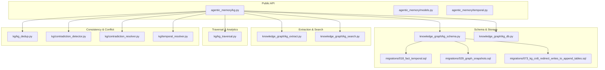
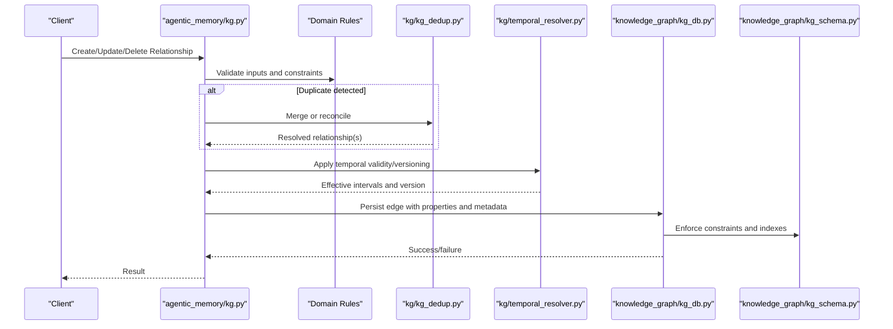
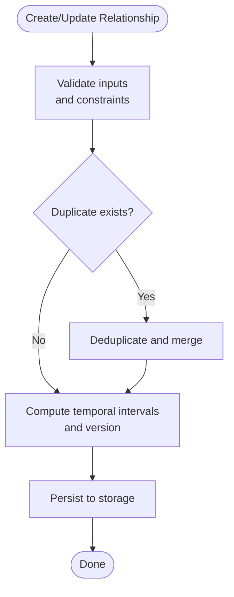
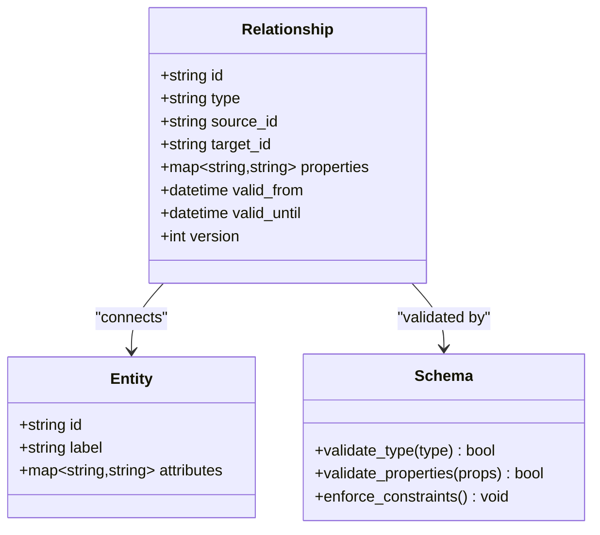
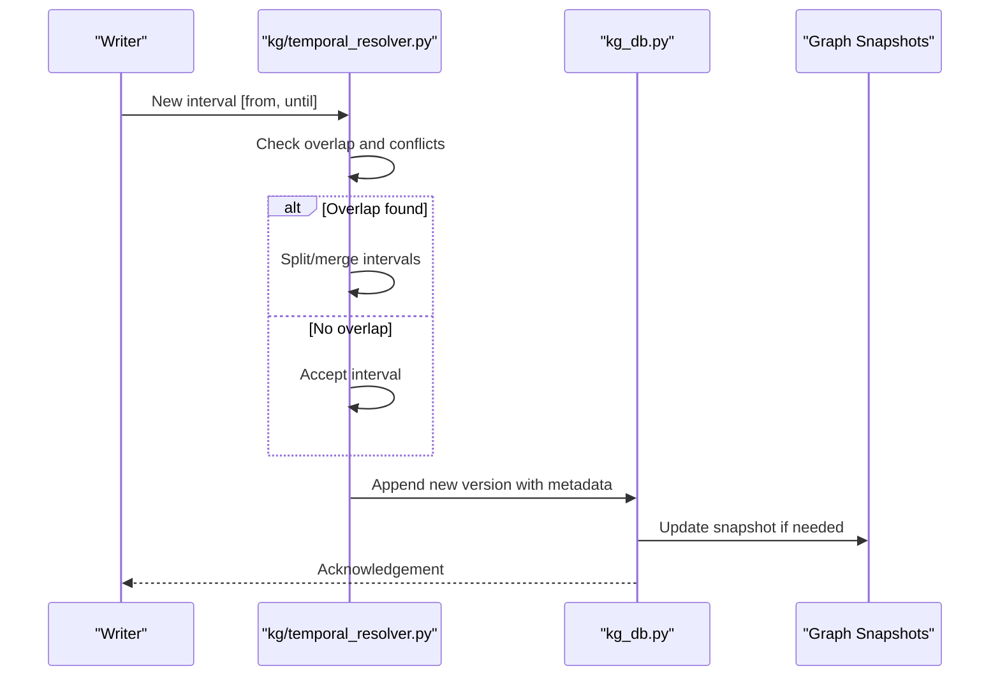
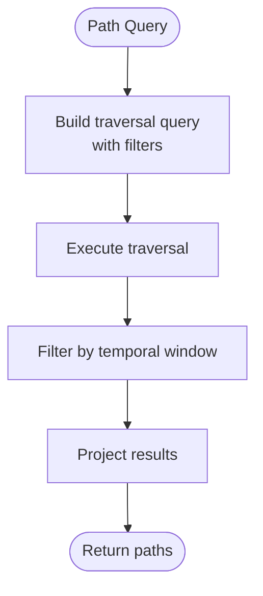
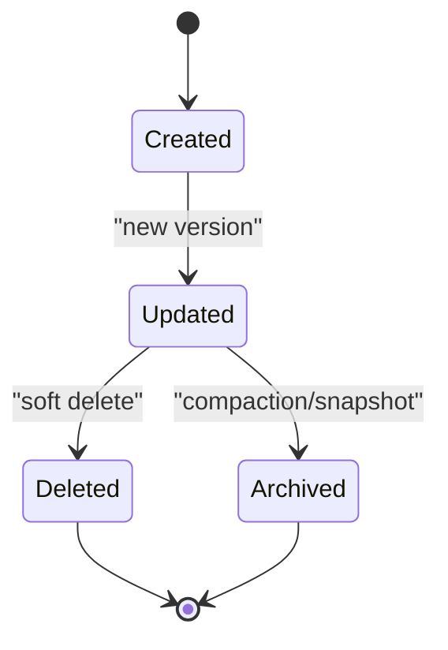
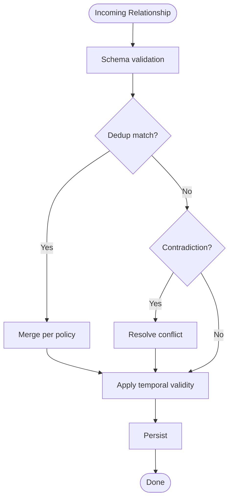
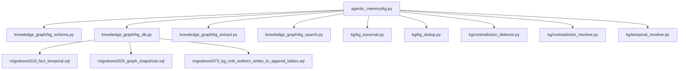

# Relationship Management

<cite>
**Referenced Files in This Document**
- [kg.py](file://agentic_memory/kg.py)
- [models.py](file://agentic_memory/models.py)
- [temporal.py](file://agentic_memory/temporal.py)
- [kg_schema.py](file://knowledge_graph/kg_schema.py)
- [kg_db.py](file://knowledge_graph/kg_db.py)
- [kg_extract.py](file://knowledge_graph/kg_extract.py)
- [kg_search.py](file://knowledge_graph/kg_search.py)
- [kg_traversal.py](file://kg/kg_traversal.py)
- [kg_dedup.py](file://kg/kg_dedup.py)
- [contradiction_detector.py](file://kg/contradiction_detector.py)
- [contradiction_resolver.py](file://kg/contradiction_resolver.py)
- [temporal_resolver.py](file://kg/temporal_resolver.py)
- [018_fact_temporal.sql](file://migrations/018_fact_temporal.sql)
- [029_graph_snapshots.sql](file://migrations/029_graph_snapshots.sql)
- [073_kg_crdt_redirect_writes_to_append_tables.sql](file://migrations/073_kg_crdt_redirect_writes_to_append_tables.sql)
- [test_kg_traversal.py](file://eval/test_kg_traversal.py)
- [test_kg_dedup.py](file://eval/test_kg_dedup.py)
- [test_kg_validation.py](file://eval/test_kg_validation.py)
- [test_multi_hop_traversal.py](file://eval/test_multi_hop_traversal.py)
</cite>

## Table of Contents
1. [Introduction](#introduction)
2. [Project Structure](#project-structure)
3. [Core Components](#core-components)
4. [Architecture Overview](#architecture-overview)
5. [Detailed Component Analysis](#detailed-component-analysis)
6. [Dependency Analysis](#dependency-analysis)
7. [Performance Considerations](#performance-considerations)
8. [Troubleshooting Guide](#troubleshooting-guide)
9. [Conclusion](#conclusion)
10. [Appendices](#appendices)

## Introduction
This document explains how relationships are created, stored, and queried within the knowledge graph. It covers relationship types and properties, constraints, temporal validity tracking (start/end dates and versioning), lifecycle management, validation, deduplication strategies, and conflict resolution when multiple sources define the same relationship. The goal is to provide both a conceptual overview and code-level guidance for building complex relationships, querying paths, and maintaining consistency over time.

## Project Structure
Relationships are modeled as typed edges between entities with optional properties and temporal validity. The implementation spans several modules:
- Public API and models for creating and managing relationships
- Schema and storage layer for persistence
- Extraction and search utilities
- Traversal and analytics
- Deduplication, contradiction detection, and resolution
- Temporal modeling and projection

**Diagram sources**
- [kg.py](file://agentic_memory/kg.py)
- [models.py](file://agentic_memory/models.py)
- [temporal.py](file://agentic_memory/temporal.py)
- [kg_schema.py](file://knowledge_graph/kg_schema.py)
- [kg_db.py](file://knowledge_graph/kg_db.py)
- [kg_extract.py](file://knowledge_graph/kg_extract.py)
- [kg_search.py](file://knowledge_graph/kg_search.py)
- [kg_traversal.py](file://kg/kg_traversal.py)
- [kg_dedup.py](file://kg/kg_dedup.py)
- [contradiction_detector.py](file://kg/contradiction_detector.py)
- [contradiction_resolver.py](file://kg/contradiction_resolver.py)
- [temporal_resolver.py](file://kg/temporal_resolver.py)
- [018_fact_temporal.sql](file://migrations/018_fact_temporal.sql)
- [029_graph_snapshots.sql](file://migrations/029_graph_snapshots.sql)
- [073_kg_crdt_redirect_writes_to_append_tables.sql](file://migrations/073_kg_crdt_redirect_writes_to_append_tables.sql)

**Section sources**
- [kg.py](file://agentic_memory/kg.py)
- [kg_schema.py](file://knowledge_graph/kg_schema.py)
- [kg_db.py](file://knowledge_graph/kg_db.py)
- [kg_traversal.py](file://kg/kg_traversal.py)
- [kg_dedup.py](file://kg/kg_dedup.py)
- [contradiction_detector.py](file://kg/contradiction_detector.py)
- [contradiction_resolver.py](file://kg/contradiction_resolver.py)
- [temporal_resolver.py](file://kg/temporal_resolver.py)
- [018_fact_temporal.sql](file://migrations/018_fact_temporal.sql)
- [029_graph_snapshots.sql](file://migrations/029_graph_snapshots.sql)
- [073_kg_crdt_redirect_writes_to_append_tables.sql](file://migrations/073_kg_crdt_redirect_writes_to_append_tables.sql)

## Core Components
- Relationship creation and mutation via public APIs that validate inputs, normalize identifiers, and persist edges with optional properties and temporal bounds.
- Schema definitions for entity and relationship tables, including indexes and constraints for integrity and performance.
- Temporal modeling supporting start/end timestamps and versioning to track changes over time.
- Deduplication and conflict resolution to handle multiple sources defining the same relationship.
- Traversal and path queries to explore multi-hop relationships efficiently.
- Contradiction detection and resolution workflows to maintain logical consistency.

Key responsibilities by module:
- agentic_memory/kg.py: High-level operations for adding/updating/deleting relationships and querying them.
- knowledge_graph/kg_schema.py: Data model and constraints for relationships and entities.
- knowledge_graph/kg_db.py: Persistence layer and SQL operations for relationships.
- kg/kg_traversal.py: Graph traversal utilities for path finding and neighborhood exploration.
- kg/kg_dedup.py: Deduplication logic to merge or reconcile duplicate relationships.
- kg/contradiction_detector.py and kg/contradiction_resolver.py: Detect and resolve conflicting facts/relationships.
- kg/temporal_resolver.py: Resolve temporal overlaps and projections across versions.
- migrations: Database schema evolution including temporal fields and append-only CRDT-backed writes.

**Section sources**
- [kg.py](file://agentic_memory/kg.py)
- [kg_schema.py](file://knowledge_graph/kg_schema.py)
- [kg_db.py](file://knowledge_graph/kg_db.py)
- [kg_traversal.py](file://kg/kg_traversal.py)
- [kg_dedup.py](file://kg/kg_dedup.py)
- [contradiction_detector.py](file://kg/contradiction_detector.py)
- [contradiction_resolver.py](file://kg/contradiction_resolver.py)
- [temporal_resolver.py](file://kg/temporal_resolver.py)

## Architecture Overview
The relationship management architecture follows a layered design:
- API Layer: Validates requests, normalizes data, and orchestrates operations.
- Domain Layer: Encapsulates business rules such as deduplication, temporal validity, and conflict resolution.
- Storage Layer: Persists relationships with constraints and indexes; supports append-only updates and snapshots.
- Query Layer: Provides efficient traversal and path queries.

**Diagram sources**
- [kg.py](file://agentic_memory/kg.py)
- [kg_dedup.py](file://kg/kg_dedup.py)
- [temporal_resolver.py](file://kg/temporal_resolver.py)
- [kg_db.py](file://knowledge_graph/kg_db.py)
- [kg_schema.py](file://knowledge_graph/kg_schema.py)

## Detailed Component Analysis

### Relationship Creation and Mutation
- Inputs include source/target entity identifiers, relationship type, optional properties, and temporal bounds.
- Validation ensures referential integrity, type constraints, and property schemas.
- Deduplication merges overlapping or identical relationships based on normalized keys and semantic similarity.
- Temporal processing computes effective intervals and assigns versions for auditability.
- Persistence uses append-only patterns where applicable, with snapshots for efficient reads.

**Diagram sources**
- [kg.py](file://agentic_memory/kg.py)
- [kg_dedup.py](file://kg/kg_dedup.py)
- [temporal_resolver.py](file://kg/temporal_resolver.py)
- [kg_db.py](file://knowledge_graph/kg_db.py)

**Section sources**
- [kg.py](file://agentic_memory/kg.py)
- [kg_dedup.py](file://kg/kg_dedup.py)
- [temporal_resolver.py](file://kg/temporal_resolver.py)
- [kg_db.py](file://knowledge_graph/kg_db.py)

### Relationship Types, Properties, and Constraints
- Relationship types are enumerated and validated against the schema.
- Properties are key-value pairs subject to schema validation and indexing where appropriate.
- Constraints enforce uniqueness, referential integrity, and type compatibility.
- Indexes optimize lookups by type, endpoints, and temporal ranges.

**Diagram sources**
- [kg_schema.py](file://knowledge_graph/kg_schema.py)
- [kg_db.py](file://knowledge_graph/kg_db.py)

**Section sources**
- [kg_schema.py](file://knowledge_graph/kg_schema.py)
- [kg_db.py](file://knowledge_graph/kg_db.py)

### Temporal Validity Tracking and Versioning
- Relationships carry start and end timestamps to represent validity windows.
- Overlapping intervals are resolved to avoid contradictions and ensure consistent projections.
- Versioning tracks edits and supports auditing and rollback.
- Snapshots capture graph state at points in time for efficient historical queries.

**Diagram sources**
- [temporal_resolver.py](file://kg/temporal_resolver.py)
- [kg_db.py](file://knowledge_graph/kg_db.py)
- [029_graph_snapshots.sql](file://migrations/029_graph_snapshots.sql)
- [018_fact_temporal.sql](file://migrations/018_fact_temporal.sql)

**Section sources**
- [temporal_resolver.py](file://kg/temporal_resolver.py)
- [kg_db.py](file://knowledge_graph/kg_db.py)
- [018_fact_temporal.sql](file://migrations/018_fact_temporal.sql)
- [029_graph_snapshots.sql](file://migrations/029_graph_snapshots.sql)

### Querying Relationship Paths
- Path queries traverse edges by type and direction, optionally constrained by temporal windows.
- Multi-hop traversal supports depth limits and filters on properties.
- Results can be projected to specific fields and ordered by relevance or recency.

**Diagram sources**
- [kg_traversal.py](file://kg/kg_traversal.py)
- [kg_search.py](file://knowledge_graph/kg_search.py)

**Section sources**
- [kg_traversal.py](file://kg/kg_traversal.py)
- [kg_search.py](file://knowledge_graph/kg_search.py)

### Lifecycle Management
- Creation: Validate, deduplicate, temporalize, and persist.
- Update: Append new versions with updated intervals; old versions remain for history.
- Deletion: Soft delete via temporal closure or explicit tombstone entries.
- Archival: Periodic compaction and snapshotting to manage growth.

**Diagram sources**
- [kg_db.py](file://knowledge_graph/kg_db.py)
- [073_kg_crdt_redirect_writes_to_append_tables.sql](file://migrations/073_kg_crdt_redirect_writes_to_append_tables.sql)

**Section sources**
- [kg_db.py](file://knowledge_graph/kg_db.py)
- [073_kg_crdt_redirect_writes_to_append_tables.sql](file://migrations/073_kg_crdt_redirect_writes_to_append_tables.sql)

### Validation, Deduplication, and Conflict Resolution
- Validation enforces schema constraints and property formats.
- Deduplication identifies near-duplicate relationships using normalized keys and semantic similarity.
- Contradiction detection flags mutually exclusive relationships; resolution applies policies (e.g., most recent, highest confidence).
- Temporal resolution handles overlapping intervals and ensures non-conflicting projections.

**Diagram sources**
- [kg_dedup.py](file://kg/kg_dedup.py)
- [contradiction_detector.py](file://kg/contradiction_detector.py)
- [contradiction_resolver.py](file://kg/contradiction_resolver.py)
- [temporal_resolver.py](file://kg/temporal_resolver.py)

**Section sources**
- [kg_dedup.py](file://kg/kg_dedup.py)
- [contradiction_detector.py](file://kg/contradiction_detector.py)
- [contradiction_resolver.py](file://kg/contradiction_resolver.py)
- [temporal_resolver.py](file://kg/temporal_resolver.py)

### Examples and Use Cases
- Creating complex relationships: Define multi-property edges with temporal bounds and link multiple entities through intermediate nodes.
- Querying relationship paths: Find all paths between two entities within a time window, filtering by relationship types and properties.
- Managing lifecycle: Update a relationship’s validity window, archive older versions, and soft-delete obsolete links.

For concrete examples, see:
- [test_kg_traversal.py](file://eval/test_kg_traversal.py)
- [test_multi_hop_traversal.py](file://eval/test_multi_hop_traversal.py)
- [test_kg_dedup.py](file://eval/test_kg_dedup.py)
- [test_kg_validation.py](file://eval/test_kg_validation.py)

**Section sources**
- [test_kg_traversal.py](file://eval/test_kg_traversal.py)
- [test_multi_hop_traversal.py](file://eval/test_multi_hop_traversal.py)
- [test_kg_dedup.py](file://eval/test_kg_dedup.py)
- [test_kg_validation.py](file://eval/test_kg_validation.py)

## Dependency Analysis
Relationship management depends on schema definitions, storage operations, traversal utilities, and consistency modules. The following diagram shows key dependencies:

**Diagram sources**
- [kg.py](file://agentic_memory/kg.py)
- [kg_schema.py](file://knowledge_graph/kg_schema.py)
- [kg_db.py](file://knowledge_graph/kg_db.py)
- [kg_extract.py](file://knowledge_graph/kg_extract.py)
- [kg_search.py](file://knowledge_graph/kg_search.py)
- [kg_traversal.py](file://kg/kg_traversal.py)
- [kg_dedup.py](file://kg/kg_dedup.py)
- [contradiction_detector.py](file://kg/contradiction_detector.py)
- [contradiction_resolver.py](file://kg/contradiction_resolver.py)
- [temporal_resolver.py](file://kg/temporal_resolver.py)
- [018_fact_temporal.sql](file://migrations/018_fact_temporal.sql)
- [029_graph_snapshots.sql](file://migrations/029_graph_snapshots.sql)
- [073_kg_crdt_redirect_writes_to_append_tables.sql](file://migrations/073_kg_crdt_redirect_writes_to_append_tables.sql)

**Section sources**
- [kg.py](file://agentic_memory/kg.py)
- [kg_schema.py](file://knowledge_graph/kg_schema.py)
- [kg_db.py](file://knowledge_graph/kg_db.py)
- [kg_traversal.py](file://kg/kg_traversal.py)
- [kg_dedup.py](file://kg/kg_dedup.py)
- [contradiction_detector.py](file://kg/contradiction_detector.py)
- [contradiction_resolver.py](file://kg/contradiction_resolver.py)
- [temporal_resolver.py](file://kg/temporal_resolver.py)
- [018_fact_temporal.sql](file://migrations/018_fact_temporal.sql)
- [029_graph_snapshots.sql](file://migrations/029_graph_snapshots.sql)
- [073_kg_crdt_redirect_writes_to_append_tables.sql](file://migrations/073_kg_crdt_redirect_writes_to_append_tables.sql)

## Performance Considerations
- Indexing: Ensure indexes on relationship type, endpoints, and temporal ranges to speed up queries.
- Traversal Limits: Cap depth and breadth in path queries to prevent expensive computations.
- Temporal Projections: Cache frequent temporal projections and use snapshots for historical reads.
- Append-Only Writes: Leverage append-only patterns to reduce contention and improve durability.
- Compaction: Periodically compact old versions and prune expired intervals to control storage growth.

[No sources needed since this section provides general guidance]

## Troubleshooting Guide
Common issues and resolutions:
- Constraint violations: Check schema definitions and input normalization; verify referential integrity and type compatibility.
- Deduplication failures: Inspect normalization keys and similarity thresholds; review merge policies.
- Temporal overlaps: Validate interval boundaries and resolution logic; confirm snapshot consistency.
- Contradictions: Review detection rules and resolution policies; consider confidence scores and recency.
- Performance regressions: Analyze query plans, adjust indexes, and limit traversal scope.

Relevant tests and modules:
- [test_kg_validation.py](file://eval/test_kg_validation.py)
- [test_kg_dedup.py](file://eval/test_kg_dedup.py)
- [test_kg_traversal.py](file://eval/test_kg_traversal.py)
- [test_multi_hop_traversal.py](file://eval/test_multi_hop_traversal.py)

**Section sources**
- [test_kg_validation.py](file://eval/test_kg_validation.py)
- [test_kg_dedup.py](file://eval/test_kg_dedup.py)
- [test_kg_traversal.py](file://eval/test_kg_traversal.py)
- [test_multi_hop_traversal.py](file://eval/test_multi_hop_traversal.py)

## Conclusion
Relationship management in the knowledge graph combines robust validation, deduplication, temporal modeling, and efficient traversal. By adhering to schema constraints, leveraging append-only persistence, and applying conflict resolution policies, the system maintains consistency and performance while supporting complex, time-aware graphs.

[No sources needed since this section summarizes without analyzing specific files]

## Appendices

### Key Migration References
- Temporal fields and fact timelines: [018_fact_temporal.sql](file://migrations/018_fact_temporal.sql)
- Graph snapshots for historical queries: [029_graph_snapshots.sql](file://migrations/029_graph_snapshots.sql)
- Append-only CRDT-backed writes: [073_kg_crdt_redirect_writes_to_append_tables.sql](file://migrations/073_kg_crdt_redirect_writes_to_append_tables.sql)

**Section sources**
- [018_fact_temporal.sql](file://migrations/018_fact_temporal.sql)
- [029_graph_snapshots.sql](file://migrations/029_graph_snapshots.sql)
- [073_kg_crdt_redirect_writes_to_append_tables.sql](file://migrations/073_kg_crdt_redirect_writes_to_append_tables.sql)