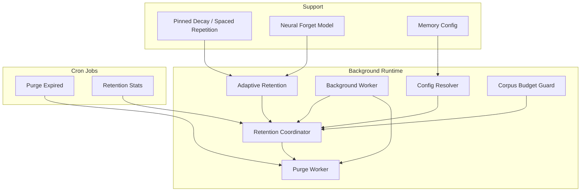
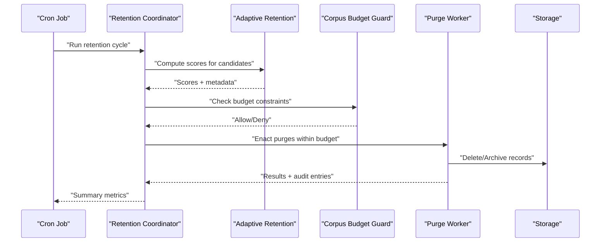
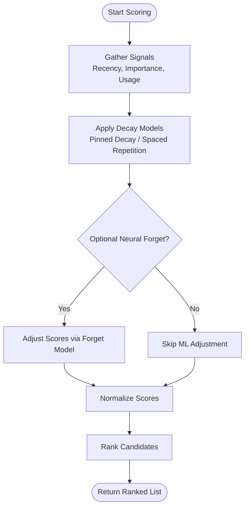
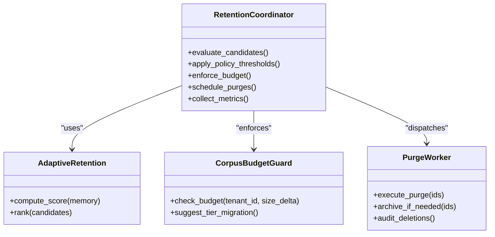
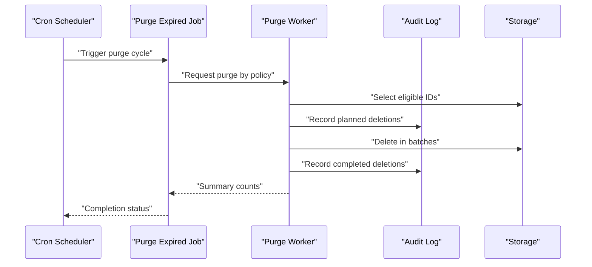
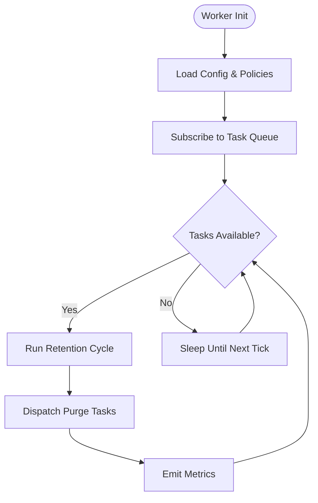
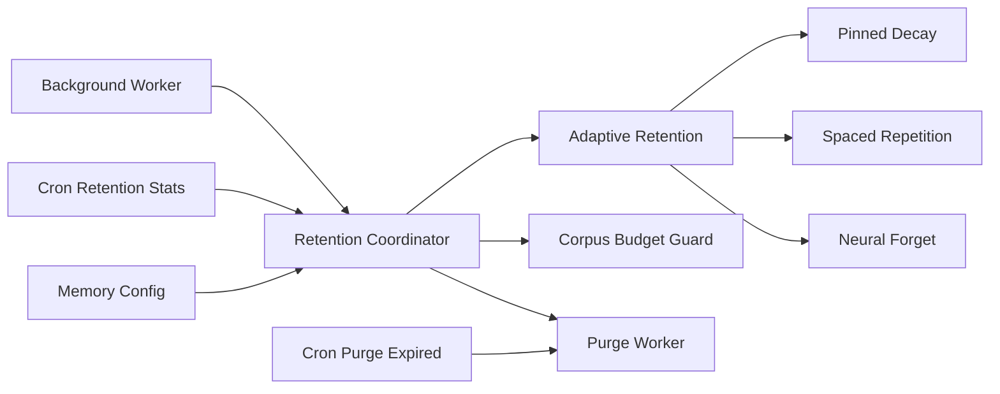

# Adaptive Retention and Cleanup

<cite>
**Referenced Files in This Document**
- [adaptive_retention.py](file://background/adaptive_retention.py)
- [retention_coordinator.py](file://background/retention_coordinator.py)
- [purge.py](file://background/purge.py)
- [cron_purge_expired.py](file://cron/cron_purge_expired.py)
- [cron_retention_stats.py](file://cron/cron_retention_stats.py)
- [background_worker.py](file://background/background_worker.py)
- [config.py](file://background/config.py)
- [corpus_budget_guard.py](file://background/corpus_budget_guard.py)
- [test_adaptive_retention.py](file://eval/test_adaptive_retention.py)
- [test_retention_coordinator.py](file://eval/test_retention_coordinator.py)
- [memory_config.py](file://infra/memory_config.py)
- [pinned_decay.py](file://infra/pinned_decay.py)
- [spaced_repetition.py](file://spaced_repetition.py)
- [neural_forget.py](file://neural_forget.py)
</cite>

## Table of Contents
1. [Introduction](#introduction)
2. [Project Structure](#project-structure)
3. [Core Components](#core-components)
4. [Architecture Overview](#architecture-overview)
5. [Detailed Component Analysis](#detailed-component-analysis)
6. [Dependency Analysis](#dependency-analysis)
7. [Performance Considerations](#performance-considerations)
8. [Troubleshooting Guide](#troubleshooting-guide)
9. [Conclusion](#conclusion)
9. [Appendices](#appendices)

## Introduction

This document explains how memories are prioritized for retention and automatically cleaned up over time. It covers configurable retention rules, automatic purging schedules, space optimization strategies, and the interaction between retention policies and background workers. It also includes examples of custom retention algorithms, threshold configurations, monitoring effectiveness, data archival procedures, and compliance considerations.

## Project Structure

The retention and cleanup system is implemented across several modules:

- Background runtime components implement adaptive scoring, coordination, and purging.
- Cron jobs schedule periodic maintenance tasks such as purging expired items and collecting retention statistics.
- Supporting utilities provide decay models, budget guards, and configuration resolution.
- Tests validate behavior and integration points.

[No sources needed since this diagram shows conceptual workflow, not actual code structure]

## Core Components

- Adaptive Retention: Computes a dynamic score for each memory based on recency, importance, usage patterns, and optional learned forgetting curves. The score determines whether to keep, demote, or purge a memory.
- Retention Coordinator: Orchestrates policy evaluation, budget enforcement, and scheduling of purges. It integrates with background workers and cron jobs.
- Purge Worker: Executes safe deletion and archival operations according to policy decisions.
- Cron Jobs: Periodically trigger purging and collect metrics to monitor retention effectiveness.
- Support Utilities: Provide decay functions (e.g., pinned decay, spaced repetition), neural forget modeling, and corpus budget guarding to constrain storage growth.

Key responsibilities:
- Prioritize memories by combining multiple signals into a single retention score.
- Enforce global and per-tenant budgets to prevent unbounded growth.
- Schedule and execute purges safely with idempotency and auditability.
- Expose configuration hooks for custom retention algorithms and thresholds.

**Section sources**
- [adaptive_retention.py](file://background/adaptive_retention.py)
- [retention_coordinator.py](file://background/retention_coordinator.py)
- [purge.py](file://background/purge.py)
- [background_worker.py](file://background/background_worker.py)
- [config.py](file://background/config.py)
- [corpus_budget_guard.py](file://background/corpus_budget_guard.py)
- [pinned_decay.py](file://infra/pinned_decay.py)
- [spaced_repetition.py](file://spaced_repetition.py)
- [neural_forget.py](file://neural_forget.py)
- [memory_config.py](file://infra/memory_config.py)

## Architecture Overview

The system combines rule-based scoring with optional machine learning to decide what to retain. A coordinator enforces policies and budgets, while background workers and cron jobs perform scheduled work.

**Diagram sources**
- [retention_coordinator.py](file://background/retention_coordinator.py)
- [adaptive_retention.py](file://background/adaptive_retention.py)
- [corpus_budget_guard.py](file://background/corpus_budget_guard.py)
- [purge.py](file://background/purge.py)
- [cron_purge_expired.py](file://cron/cron_purge_expired.py)
- [cron_retention_stats.py](file://cron/cron_retention_stats.py)

## Detailed Component Analysis

### Adaptive Retention Scoring

The scoring engine aggregates multiple signals:
- Recency: How recently a memory was observed or updated.
- Importance: Explicit flags, tags, or derived importance heuristics.
- Usage Patterns: Access frequency, query relevance, and downstream utility.
- Optional Forgetting Curves: Pinned decay, spaced repetition, or neural forget model outputs.

The result is a normalized retention score used to rank candidates for retention vs. purging.

**Diagram sources**
- [adaptive_retention.py](file://background/adaptive_retention.py)
- [pinned_decay.py](file://infra/pinned_decay.py)
- [spaced_repetition.py](file://spaced_repetition.py)
- [neural_forget.py](file://neural_forget.py)

**Section sources**
- [adaptive_retention.py](file://background/adaptive_retention.py)
- [pinned_decay.py](file://infra/pinned_decay.py)
- [spaced_repetition.py](file://spaced_repetition.py)
- [neural_forget.py](file://neural_forget.py)

### Retention Coordinator

The coordinator:
- Selects candidate memories for evaluation.
- Invokes scoring and applies policy thresholds.
- Enforces corpus budgets and tier migration rules.
- Schedules purges and collects metrics.

**Diagram sources**
- [retention_coordinator.py](file://background/retention_coordinator.py)
- [adaptive_retention.py](file://background/adaptive_retention.py)
- [corpus_budget_guard.py](file://background/corpus_budget_guard.py)
- [purge.py](file://background/purge.py)

**Section sources**
- [retention_coordinator.py](file://background/retention_coordinator.py)
- [corpus_budget_guard.py](file://background/corpus_budget_guard.py)
- [purge.py](file://background/purge.py)

### Purge Worker and Cron Integration

Purges are executed safely:
- Idempotent deletions with audit logging.
- Optional archival before deletion for compliance.
- Batched operations to minimize lock contention.

Cron jobs periodically trigger:
- Purge Expired: Removes items beyond configured lifetimes.
- Retention Stats: Aggregates metrics for dashboards and alerts.

**Diagram sources**
- [cron_purge_expired.py](file://cron/cron_purge_expired.py)
- [purge.py](file://background/purge.py)
- [cron_retention_stats.py](file://cron/cron_retention_stats.py)

**Section sources**
- [cron_purge_expired.py](file://cron/cron_purge_expired.py)
- [cron_retention_stats.py](file://cron/cron_retention_stats.py)
- [purge.py](file://background/purge.py)

### Background Workers and Scheduling

Background workers run long-lived processes that:
- Consume tasks from queues.
- Execute retention cycles and purges.
- Respect locks and distributed coordination to avoid conflicts.

Configuration controls concurrency, timeouts, and retry behavior.

**Diagram sources**
- [background_worker.py](file://background/background_worker.py)
- [config.py](file://background/config.py)

**Section sources**
- [background_worker.py](file://background/background_worker.py)
- [config.py](file://background/config.py)

### Configuration and Thresholds

Retention behavior is controlled by configuration:
- Global and per-tenant budgets (size limits).
- Policy thresholds for keeping/demoting/purging.
- Decay parameters for pinned decay and spaced repetition.
- Optional neural forget model settings.

Resolution order typically merges defaults, environment overrides, and per-project settings.

**Section sources**
- [memory_config.py](file://infra/memory_config.py)
- [config.py](file://background/config.py)
- [pinned_decay.py](file://infra/pinned_decay.py)
- [spaced_repetition.py](file://spaced_repetition.py)
- [neural_forget.py](file://neural_forget.py)

### Custom Retention Algorithms

To customize retention logic:
- Implement a scoring function that accepts memory features and returns a score.
- Register it with the retention pipeline or coordinator.
- Validate with unit tests and integration tests.

Example approach:
- Add a new decay curve or usage-weighting strategy.
- Introduce a threshold override for specific tenants or tiers.
- Ensure idempotency and auditability of any side effects.

**Section sources**
- [adaptive_retention.py](file://background/adaptive_retention.py)
- [retention_coordinator.py](file://background/retention_coordinator.py)
- [test_adaptive_retention.py](file://eval/test_adaptive_retention.py)
- [test_retention_coordinator.py](file://eval/test_retention_coordinator.py)

## Dependency Analysis

**Diagram sources**
- [adaptive_retention.py](file://background/adaptive_retention.py)
- [retention_coordinator.py](file://background/retention_coordinator.py)
- [purge.py](file://background/purge.py)
- [background_worker.py](file://background/background_worker.py)
- [corpus_budget_guard.py](file://background/corpus_budget_guard.py)
- [pinned_decay.py](file://infra/pinned_decay.py)
- [spaced_repetition.py](file://spaced_repetition.py)
- [neural_forget.py](file://neural_forget.py)
- [memory_config.py](file://infra/memory_config.py)
- [cron_purge_expired.py](file://cron/cron_purge_expired.py)
- [cron_retention_stats.py](file://cron/cron_retention_stats.py)

**Section sources**
- [adaptive_retention.py](file://background/adaptive_retention.py)
- [retention_coordinator.py](file://background/retention_coordinator.py)
- [purge.py](file://background/purge.py)
- [background_worker.py](file://background/background_worker.py)
- [corpus_budget_guard.py](file://background/corpus_budget_guard.py)
- [pinned_decay.py](file://infra/pinned_decay.py)
- [spaced_repetition.py](file://spaced_repetition.py)
- [neural_forget.py](file://neural_forget.py)
- [memory_config.py](file://infra/memory_config.py)
- [cron_purge_expired.py](file://cron/cron_purge_expired.py)
- [cron_retention_stats.py](file://cron/cron_retention_stats.py)

## Performance Considerations

- Batch purges to reduce lock contention and transaction overhead.
- Use indexes on recency and usage fields to speed up candidate selection.
- Limit scoring scope to recent or frequently accessed subsets when possible.
- Monitor queue backlogs and worker throughput; adjust concurrency and timeouts accordingly.
- Prefer incremental updates to scores rather than full recomputation.

[No sources needed since this section provides general guidance]

## Troubleshooting Guide

Common issues and resolutions:
- Stuck purges: Check distributed locks and task timeouts; verify worker health.
- Budget violations: Review corpus budget guard thresholds and tenant-specific overrides.
- Low retention quality: Inspect scoring weights and decay parameters; validate usage signal accuracy.
- Missing metrics: Confirm cron job execution and metric emission paths.

Operational checks:
- Verify cron schedules for purge and stats collection.
- Inspect audit logs for planned vs. completed deletions.
- Correlate retention stats with storage growth trends.

**Section sources**
- [cron_purge_expired.py](file://cron/cron_purge_expired.py)
- [cron_retention_stats.py](file://cron/cron_retention_stats.py)
- [corpus_budget_guard.py](file://background/corpus_budget_guard.py)
- [background_worker.py](file://background/background_worker.py)

## Conclusion

The adaptive retention system balances relevance and storage efficiency by scoring memories on recency, importance, and usage, optionally enhanced by forgetting curves. A coordinator enforces policies and budgets, while background workers and cron jobs ensure reliable, auditable cleanup. With configurable thresholds and extensible scoring, operators can tune retention to meet performance, cost, and compliance goals.

[No sources needed since this section summarizes without analyzing specific files]

## Appendices

### Example: Custom Retention Algorithm

Steps to add a custom algorithm:
- Define a scoring function that takes memory features and returns a score.
- Integrate it into the retention pipeline or coordinator’s scoring stage.
- Add unit tests covering edge cases and expected rankings.
- Validate with integration tests against real datasets.

**Section sources**
- [adaptive_retention.py](file://background/adaptive_retention.py)
- [test_adaptive_retention.py](file://eval/test_adaptive_retention.py)

### Example: Threshold Configuration

Typical configuration keys:
- Global and per-tenant retention thresholds.
- Decay half-lives and pinning durations.
- Neural forget model activation flags and hyperparameters.
- Budget caps and tier migration triggers.

**Section sources**
- [memory_config.py](file://infra/memory_config.py)
- [config.py](file://background/config.py)
- [pinned_decay.py](file://infra/pinned_decay.py)
- [spaced_repetition.py](file://spaced_repetition.py)
- [neural_forget.py](file://neural_forget.py)

### Monitoring Retention Effectiveness

Recommended metrics:
- Number of purged items per interval.
- Storage size trends by tier.
- Average retention score distribution.
- Recall impact after purges (sampled queries).

**Section sources**
- [cron_retention_stats.py](file://cron/cron_retention_stats.py)

### Data Archival Procedures and Compliance

- Archive before delete for regulated data.
- Maintain immutable audit trails for deletions.
- Honor tenant isolation and GDPR erasure requests.
- Ensure cross-tenant safety and least-privilege access during purges.

**Section sources**
- [purge.py](file://background/purge.py)
- [cron_purge_expired.py](file://cron/cron_purge_expired.py)