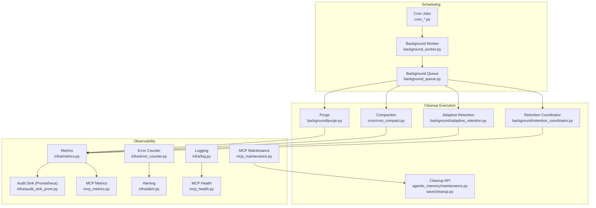
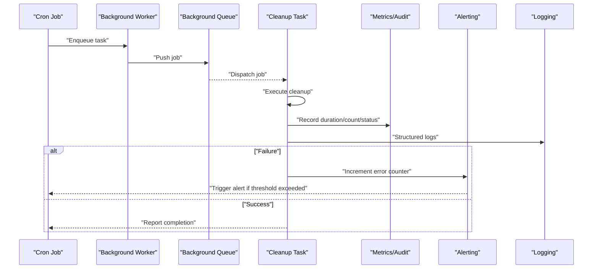
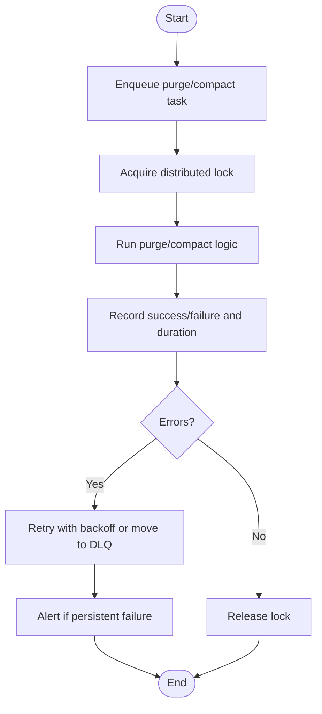
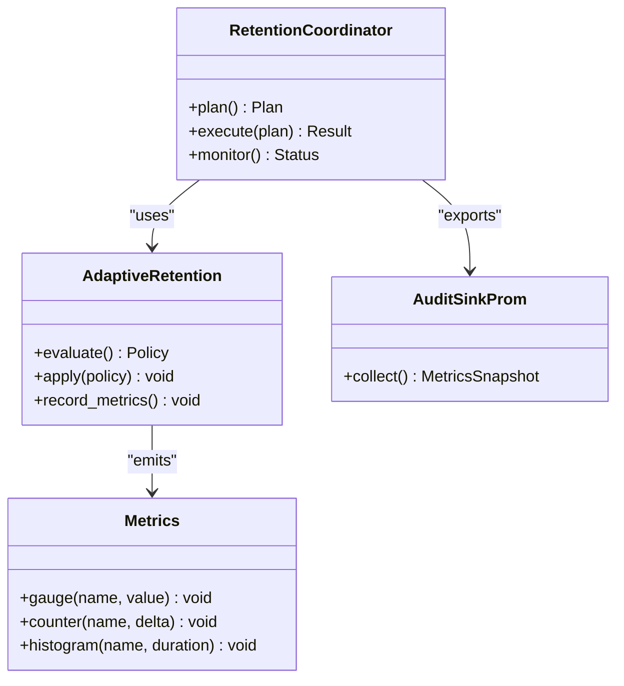
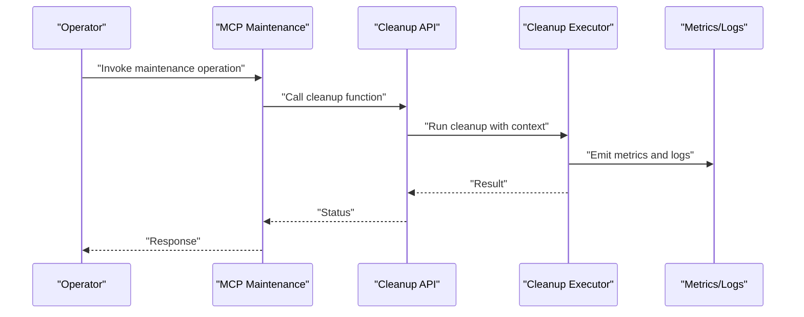
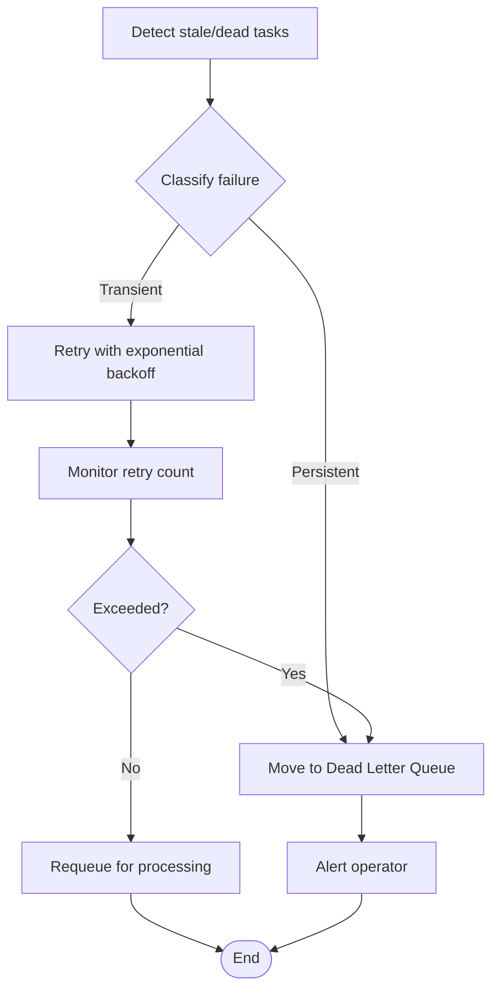
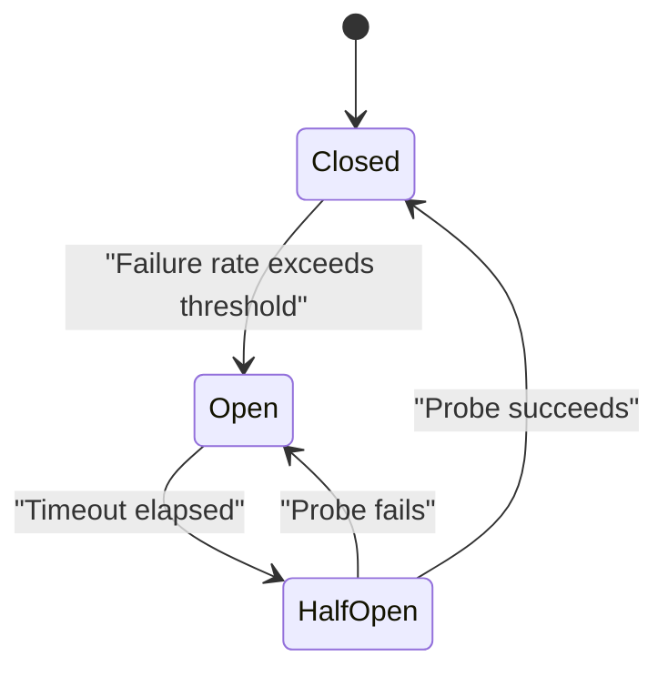
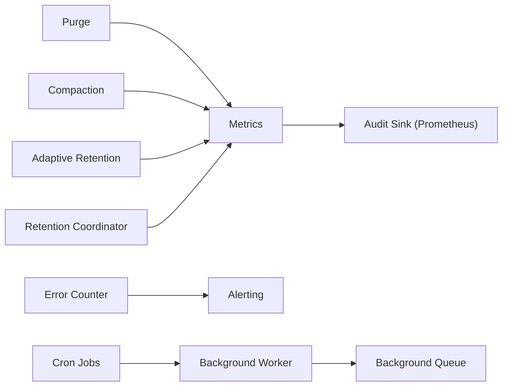

# Cleanup Monitoring and Error Handling

<cite>
**Referenced Files in This Document**
- [maintenance.py](file://agentic_memory/maintenance.py)
- [cleanup.py](file://save/cleanup.py)
- [purge.py](file://background/purge.py)
- [adaptive_retention.py](file://background/adaptive_retention.py)
- [retention_coordinator.py](file://background/retention_coordinator.py)
- [cron_purge_expired.py](file://cron/cron_purge_expired.py)
- [cron_cleanup_auto_logs.py](file://cron/cron_cleanup_auto_logs.py)
- [cron_purge_auto_saves.py](file://cron/cron_purge_auto_saves.py)
- [cron_compact.py](file://cron/cron_compact.py)
- [cron_reap_stale_tasks.py](file://cron/cron_reap_stale_tasks.py)
- [cron_retry_dead_tasks.py](file://cron/cron_retry_dead_tasks.py)
- [cron_log_retention.py](file://cron/cron_log_retention.py)
- [background_worker.py](file://background/background_worker.py)
- [background_queue.py](file://background/background_queue.py)
- [circuit_breaker.py](file://background/circuit_breaker.py)
- [metrics.py](file://infra/metrics.py)
- [error_counter.py](file://infra/error_counter.py)
- [audit_sink_prom.py](file://infra/audit_sink_prom.py)
- [alert.py](file://infra/alert.py)
- [log.py](file://infra/log.py)
- [mcp_metrics.py](file://mcp_metrics.py)
- [mcp_maintenance.py](file://mcp_maintenance.py)
- [mcp_health.py](file://mcp_health.py)
</cite>

## Table of Contents
1. [Introduction](#introduction)
2. [Project Structure](#project-structure)
3. [Core Components](#core-components)
4. [Architecture Overview](#architecture-overview)
5. [Detailed Component Analysis](#detailed-component-analysis)
6. [Dependency Analysis](#dependency-analysis)
7. [Performance Considerations](#performance-considerations)
8. [Troubleshooting Guide](#troubleshooting-guide)
9. [Conclusion](#conclusion)
10. [Appendices](#appendices)

## Introduction
This document explains how cleanup operations are monitored, measured, and made resilient through robust error handling. It covers metrics collection for cleanup effectiveness, performance tracking, resource utilization, retry mechanisms, dead letter queues, alerting, logging best practices, debugging tools, and dashboards/reports to maintain a healthy cleanup system and identify optimization opportunities.

## Project Structure
Cleanup-related functionality spans several layers:
- Scheduling and orchestration: cron jobs and background workers
- Cleanup execution: purging, compaction, adaptive retention, and coordination
- Observability: metrics, audit sinks, error counters, alerts, and MCP endpoints
- Logging and diagnostics: structured logs and health checks

**Diagram sources**
- [cron_purge_expired.py](file://cron/cron_purge_expired.py)
- [cron_cleanup_auto_logs.py](file://cron/cron_cleanup_auto_logs.py)
- [cron_purge_auto_saves.py](file://cron/cron_purge_auto_saves.py)
- [cron_compact.py](file://cron/cron_compact.py)
- [cron_reap_stale_tasks.py](file://cron/cron_reap_stale_tasks.py)
- [cron_retry_dead_tasks.py](file://cron/cron_retry_dead_tasks.py)
- [cron_log_retention.py](file://cron/cron_log_retention.py)
- [background_worker.py](file://background/background_worker.py)
- [background_queue.py](file://background/background_queue.py)
- [purge.py](file://background/purge.py)
- [adaptive_retention.py](file://background/adaptive_retention.py)
- [retention_coordinator.py](file://background/retention_coordinator.py)
- [maintenance.py](file://agentic_memory/maintenance.py)
- [cleanup.py](file://save/cleanup.py)
- [metrics.py](file://infra/metrics.py)
- [error_counter.py](file://infra/error_counter.py)
- [audit_sink_prom.py](file://infra/audit_sink_prom.py)
- [alert.py](file://infra/alert.py)
- [log.py](file://infra/log.py)
- [mcp_metrics.py](file://mcp_metrics.py)
- [mcp_health.py](file://mcp_health.py)
- [mcp_maintenance.py](file://mcp_maintenance.py)

**Section sources**
- [cron_purge_expired.py](file://cron/cron_purge_expired.py)
- [cron_cleanup_auto_logs.py](file://cron/cron_cleanup_auto_logs.py)
- [cron_purge_auto_saves.py](file://cron/cron_purge_auto_saves.py)
- [cron_compact.py](file://cron/cron_compact.py)
- [cron_reap_stale_tasks.py](file://cron/cron_reap_stale_tasks.py)
- [cron_retry_dead_tasks.py](file://cron/cron_retry_dead_tasks.py)
- [cron_log_retention.py](file://cron/cron_log_retention.py)
- [background_worker.py](file://background/background_worker.py)
- [background_queue.py](file://background/background_queue.py)
- [purge.py](file://background/purge.py)
- [adaptive_retention.py](file://background/adaptive_retention.py)
- [retention_coordinator.py](file://background/retention_coordinator.py)
- [maintenance.py](file://agentic_memory/maintenance.py)
- [cleanup.py](file://save/cleanup.py)
- [metrics.py](file://infra/metrics.py)
- [error_counter.py](file://infra/error_counter.py)
- [audit_sink_prom.py](file://infra/audit_sink_prom.py)
- [alert.py](file://infra/alert.py)
- [log.py](file://infra/log.py)
- [mcp_metrics.py](file://mcp_metrics.py)
- [mcp_health.py](file://mcp_health.py)
- [mcp_maintenance.py](file://mcp_maintenance.py)

## Core Components
- Cron-driven cleanup jobs: schedule and dispatch tasks such as purging expired items, compacting storage, reaping stale tasks, and managing log retention.
- Background worker and queue: execute cleanup tasks with concurrency control and backpressure.
- Cleanup APIs: programmatic interfaces for maintenance operations exposed via MCP.
- Metrics and audit sinks: record durations, counts, and outcomes; expose Prometheus-compatible metrics.
- Error counter and alerting: aggregate failures and trigger alerts on thresholds.
- Logging: structured, contextual logs for traceability and debugging.

Key responsibilities:
- Orchestrate cleanup workflows safely and idempotently.
- Emit actionable metrics and logs.
- Fail fast with retries and safe fallbacks.
- Provide observability endpoints for operators.

**Section sources**
- [cron_purge_expired.py](file://cron/cron_purge_expired.py)
- [cron_cleanup_auto_logs.py](file://cron/cron_cleanup_auto_logs.py)
- [cron_purge_auto_saves.py](file://cron/cron_purge_auto_saves.py)
- [cron_compact.py](file://cron/cron_compact.py)
- [cron_reap_stale_tasks.py](file://cron/cron_reap_stale_tasks.py)
- [cron_retry_dead_tasks.py](file://cron/cron_retry_dead_tasks.py)
- [cron_log_retention.py](file://cron/cron_log_retention.py)
- [background_worker.py](file://background/background_worker.py)
- [background_queue.py](file://background/background_queue.py)
- [maintenance.py](file://agentic_memory/maintenance.py)
- [cleanup.py](file://save/cleanup.py)
- [metrics.py](file://infra/metrics.py)
- [error_counter.py](file://infra/error_counter.py)
- [audit_sink_prom.py](file://infra/audit_sink_prom.py)
- [alert.py](file://infra/alert.py)
- [log.py](file://infra/log.py)
- [mcp_metrics.py](file://mcp_metrics.py)
- [mcp_health.py](file://mcp_health.py)
- [mcp_maintenance.py](file://mcp_maintenance.py)

## Architecture Overview
The cleanup pipeline is event-driven by scheduled jobs and background workers. Each job performs bounded work, emits metrics, and handles errors consistently. Observability is centralized via metrics, audit sinks, and MCP endpoints.

**Diagram sources**
- [cron_purge_expired.py](file://cron/cron_purge_expired.py)
- [background_worker.py](file://background/background_worker.py)
- [background_queue.py](file://background/background_queue.py)
- [purge.py](file://background/purge.py)
- [metrics.py](file://infra/metrics.py)
- [error_counter.py](file://infra/error_counter.py)
- [alert.py](file://infra/alert.py)
- [log.py](file://infra/log.py)

## Detailed Component Analysis

### Purge and Compaction Workflows
Purge removes expired or obsolete data; compaction reclaims space and improves read performance. Both are scheduled via cron and executed by the background worker.

**Diagram sources**
- [cron_purge_expired.py](file://cron/cron_purge_expired.py)
- [cron_compact.py](file://cron/cron_compact.py)
- [background_worker.py](file://background/background_worker.py)
- [background_queue.py](file://background/background_queue.py)
- [purge.py](file://background/purge.py)
- [metrics.py](file://infra/metrics.py)
- [error_counter.py](file://infra/error_counter.py)
- [alert.py](file://infra/alert.py)

**Section sources**
- [cron_purge_expired.py](file://cron/cron_purge_expired.py)
- [cron_compact.py](file://cron/cron_compact.py)
- [background_worker.py](file://background/background_worker.py)
- [background_queue.py](file://background/background_queue.py)
- [purge.py](file://background/purge.py)
- [metrics.py](file://infra/metrics.py)
- [error_counter.py](file://infra/error_counter.py)
- [alert.py](file://infra/alert.py)

### Adaptive Retention and Coordination
Adaptive retention adjusts cleanup policies based on usage patterns; the coordinator orchestrates multi-phase cleanup across subsystems.

**Diagram sources**
- [adaptive_retention.py](file://background/adaptive_retention.py)
- [retention_coordinator.py](file://background/retention_coordinator.py)
- [metrics.py](file://infra/metrics.py)
- [audit_sink_prom.py](file://infra/audit_sink_prom.py)

**Section sources**
- [adaptive_retention.py](file://background/adaptive_retention.py)
- [retention_coordinator.py](file://background/retention_coordinator.py)
- [metrics.py](file://infra/metrics.py)
- [audit_sink_prom.py](file://infra/audit_sink_prom.py)

### Cleanup APIs and MCP Integration
Maintenance operations can be invoked programmatically via MCP endpoints, which call into cleanup modules and emit metrics/logs.

**Diagram sources**
- [mcp_maintenance.py](file://mcp_maintenance.py)
- [maintenance.py](file://agentic_memory/maintenance.py)
- [cleanup.py](file://save/cleanup.py)
- [metrics.py](file://infra/metrics.py)
- [log.py](file://infra/log.py)

**Section sources**
- [mcp_maintenance.py](file://mcp_maintenance.py)
- [maintenance.py](file://agentic_memory/maintenance.py)
- [cleanup.py](file://save/cleanup.py)
- [metrics.py](file://infra/metrics.py)
- [log.py](file://infra/log.py)

### Stale Tasks and Dead Task Recovery
Stale tasks are identified and either retried or moved to a dead letter queue. A dedicated cron job retries dead tasks according to policy.

**Diagram sources**
- [cron_reap_stale_tasks.py](file://cron/cron_reap_stale_tasks.py)
- [cron_retry_dead_tasks.py](file://cron/cron_retry_dead_tasks.py)
- [background_worker.py](file://background/background_worker.py)
- [background_queue.py](file://background/background_queue.py)
- [error_counter.py](file://infra/error_counter.py)
- [alert.py](file://infra/alert.py)

**Section sources**
- [cron_reap_stale_tasks.py](file://cron/cron_reap_stale_tasks.py)
- [cron_retry_dead_tasks.py](file://cron/cron_retry_dead_tasks.py)
- [background_worker.py](file://background/background_worker.py)
- [background_queue.py](file://background/background_queue.py)
- [error_counter.py](file://infra/error_counter.py)
- [alert.py](file://infra/alert.py)

### Circuit Breakers and Resilience
Circuit breakers prevent cascading failures during cleanup by short-circuiting calls when downstream systems are unhealthy.

**Diagram sources**
- [circuit_breaker.py](file://background/circuit_breaker.py)
- [metrics.py](file://infra/metrics.py)
- [alert.py](file://infra/alert.py)

**Section sources**
- [circuit_breaker.py](file://background/circuit_breaker.py)
- [metrics.py](file://infra/metrics.py)
- [alert.py](file://infra/alert.py)

### Logging Best Practices
- Use structured logs with consistent keys (task_id, tenant, scope, phase).
- Include correlation IDs across scheduling, execution, and observability.
- Avoid sensitive data in logs; redact identifiers where necessary.
- Separate operational logs from debug traces; use appropriate log levels.

**Section sources**
- [log.py](file://infra/log.py)
- [mcp_health.py](file://mcp_health.py)

## Dependency Analysis
Cleanup components depend on shared infrastructure for metrics, error counting, alerting, and logging. The following diagram shows key dependencies.

**Diagram sources**
- [purge.py](file://background/purge.py)
- [cron_compact.py](file://cron/cron_compact.py)
- [adaptive_retention.py](file://background/adaptive_retention.py)
- [retention_coordinator.py](file://background/retention_coordinator.py)
- [metrics.py](file://infra/metrics.py)
- [audit_sink_prom.py](file://infra/audit_sink_prom.py)
- [error_counter.py](file://infra/error_counter.py)
- [alert.py](file://infra/alert.py)
- [background_worker.py](file://background/background_worker.py)
- [background_queue.py](file://background/background_queue.py)
- [cron_purge_expired.py](file://cron/cron_purge_expired.py)

**Section sources**
- [purge.py](file://background/purge.py)
- [cron_compact.py](file://cron/cron_compact.py)
- [adaptive_retention.py](file://background/adaptive_retention.py)
- [retention_coordinator.py](file://background/retention_coordinator.py)
- [metrics.py](file://infra/metrics.py)
- [audit_sink_prom.py](file://infra/audit_sink_prom.py)
- [error_counter.py](file://infra/error_counter.py)
- [alert.py](file://infra/alert.py)
- [background_worker.py](file://background/background_worker.py)
- [background_queue.py](file://background/background_queue.py)
- [cron_purge_expired.py](file://cron/cron_purge_expired.py)

## Performance Considerations
- Batch operations: process items in bounded batches to limit memory and I/O spikes.
- Idempotency: ensure repeated runs do not cause double deletions or inconsistent state.
- Backpressure: throttle throughput using queue depth and worker limits.
- Indexing impact: avoid heavy index rebuilds during peak hours; schedule off-peak.
- Resource guards: enforce CPU/memory budgets and circuit breaker thresholds.

[No sources needed since this section provides general guidance]

## Troubleshooting Guide
Common issues and resolutions:
- High failure rates: check error counters and alerts; inspect recent logs for stack traces and context.
- Stuck tasks: verify locks and queue depths; re-run reap and retry jobs.
- Slow purges: analyze histogram metrics for duration outliers; consider batching and indexing strategies.
- Alert fatigue: tune thresholds and deduplicate alerts; group by tenant/scope.
- Dead letter accumulation: investigate root causes and implement targeted fixes; periodically review DLQ contents.

Operational tips:
- Use MCP health and metrics endpoints to validate service status.
- Correlate logs with metric timestamps and task IDs.
- Validate configuration drift and policy changes before running large-scale cleanup.

**Section sources**
- [mcp_health.py](file://mcp_health.py)
- [mcp_metrics.py](file://mcp_metrics.py)
- [error_counter.py](file://infra/error_counter.py)
- [alert.py](file://infra/alert.py)
- [cron_reap_stale_tasks.py](file://cron/cron_reap_stale_tasks.py)
- [cron_retry_dead_tasks.py](file://cron/cron_retry_dead_tasks.py)
- [cron_purge_expired.py](file://cron/cron_purge_expired.py)
- [cron_compact.py](file://cron/cron_compact.py)

## Conclusion
A resilient cleanup system combines scheduled orchestration, bounded execution, comprehensive observability, and robust error handling. By measuring effectiveness, tracking performance, and proactively alerting on anomalies, operators can maintain healthy storage and retrieval behavior while minimizing risk and downtime.

[No sources needed since this section summarizes without analyzing specific files]

## Appendices

### Dashboards and Reports
Recommended panels and reports:
- Cleanup throughput and latency histograms per job type
- Success/failure ratios and error categories
- Queue depth and worker utilization
- Dead letter queue size and growth rate
- Resource utilization (CPU, memory, I/O) correlated with cleanup windows
- Policy adherence and drift indicators

Data sources:
- Prometheus metrics exported via audit sink
- MCP metrics endpoint for on-demand queries
- Structured logs aggregated by task and tenant

**Section sources**
- [audit_sink_prom.py](file://infra/audit_sink_prom.py)
- [mcp_metrics.py](file://mcp_metrics.py)
- [log.py](file://infra/log.py)