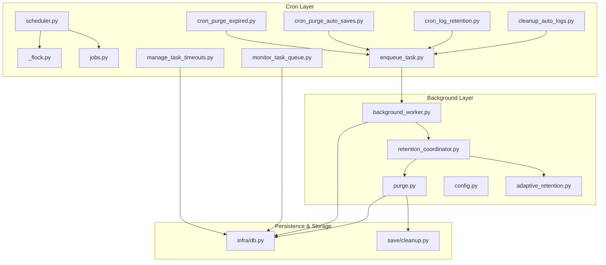
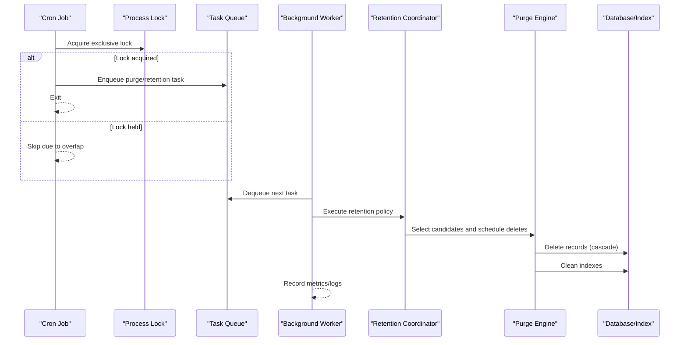
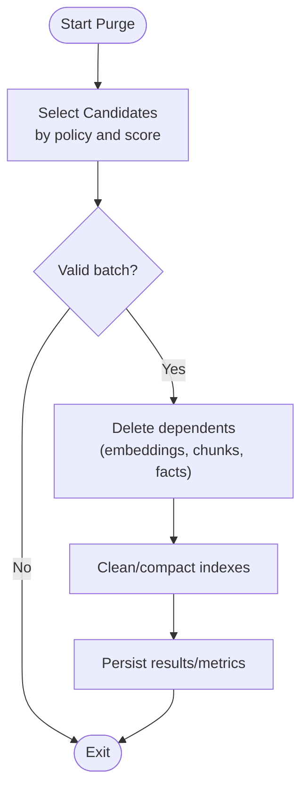
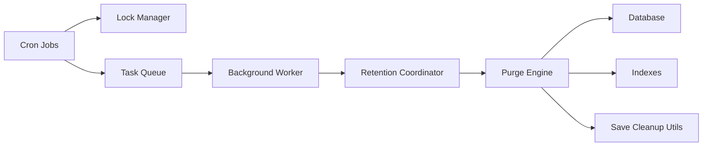

# Cleanup Schedules and Background Tasks

<cite>
**Referenced Files in This Document**
- [cron/scheduler.py](file://cron/scheduler.py)
- [cron/jobs.py](file://cron/jobs.py)
- [cron/cron_purge_expired.py](file://cron/cron_purge_expired.py)
- [cron/cron_purge_auto_saves.py](file://cron/cron_purge_auto_saves.py)
- [cron/cron_log_retention.py](file://cron/cron_log_retention.py)
- [cron/cleanup_auto_logs.py](file://cron/cleanup_auto_logs.py)
- [background/purge.py](file://background/purge.py)
- [background/retention_coordinator.py](file://background/retention_coordinator.py)
- [background/adaptive_retention.py](file://background/adaptive_retention.py)
- [background/background_worker.py](file://background/background_worker.py)
- [background/config.py](file://background/config.py)
- [cron/enqueue_task.py](file://cron/enqueue_task.py)
- [cron/manage_task_timeouts.py](file://cron/manage_task_timeouts.py)
- [cron/monitor_task_queue.py](file://cron/monitor_task_queue.py)
- [cron/_flock.py](file://cron/_flock.py)
- [infra/db.py](file://infra/db.py)
- [save/cleanup.py](file://save/cleanup.py)
- [mcp_maintenance_ops.py](file://mcp_maintenance_ops.py)
</cite>

## Table of Contents
1. [Introduction](#introduction)
2. [Project Structure](#project-structure)
3. [Core Components](#core-components)
4. [Architecture Overview](#architecture-overview)
5. [Detailed Component Analysis](#detailed-component-analysis)
6. [Dependency Analysis](#dependency-analysis)
7. [Performance Considerations](#performance-considerations)
8. [Troubleshooting Guide](#troubleshooting-guide)
9. [Conclusion](#conclusion)
10. [Appendices](#appendices)

## Introduction
This document explains how automated cleanup schedules and background tasks are implemented, focusing on retention policies, cron-driven scheduling, purge workflows, index cleanup, monitoring, error handling, retries, configuration strategies, and performance considerations for large datasets. It is intended for operators and developers who need to understand, tune, and troubleshoot the system’s maintenance lifecycle.

## Project Structure
Cleanup and background task execution spans several layers:
- Cron entry points that define job schedules and orchestrate work
- A scheduler and lock manager to prevent overlapping runs
- Background workers and queues for long-running or decoupled tasks
- Purge and retention logic that selects candidates, performs cascading deletes, and cleans indexes
- Monitoring and observability hooks for effectiveness and reliability

**Diagram sources**
- [cron/scheduler.py](file://cron/scheduler.py)
- [cron/jobs.py](file://cron/jobs.py)
- [cron/cron_purge_expired.py](file://cron/cron_purge_expired.py)
- [cron/cron_purge_auto_saves.py](file://cron/cron_purge_auto_saves.py)
- [cron/cron_log_retention.py](file://cron/cron_log_retention.py)
- [cron/cleanup_auto_logs.py](file://cron/cleanup_auto_logs.py)
- [cron/enqueue_task.py](file://cron/enqueue_task.py)
- [cron/manage_task_timeouts.py](file://cron/manage_task_timeouts.py)
- [cron/monitor_task_queue.py](file://cron/monitor_task_queue.py)
- [cron/_flock.py](file://cron/_flock.py)
- [background/background_worker.py](file://background/background_worker.py)
- [background/retention_coordinator.py](file://background/retention_coordinator.py)
- [background/adaptive_retention.py](file://background/adaptive_retention.py)
- [background/purge.py](file://background/purge.py)
- [background/config.py](file://background/config.py)
- [infra/db.py](file://infra/db.py)
- [save/cleanup.py](file://save/cleanup.py)

**Section sources**
- [cron/scheduler.py](file://cron/scheduler.py)
- [cron/jobs.py](file://cron/jobs.py)
- [cron/cron_purge_expired.py](file://cron/cron_purge_expired.py)
- [cron/cron_purge_auto_saves.py](file://cron/cron_purge_auto_saves.py)
- [cron/cron_log_retention.py](file://cron/cron_log_retention.py)
- [cron/cleanup_auto_logs.py](file://cron/cleanup_auto_logs.py)
- [cron/enqueue_task.py](file://cron/enqueue_task.py)
- [cron/manage_task_timeouts.py](file://cron/manage_task_timeouts.py)
- [cron/monitor_task_queue.py](file://cron/monitor_task_queue.py)
- [cron/_flock.py](file://cron/_flock.py)
- [background/background_worker.py](file://background/background_worker.py)
- [background/retention_coordinator.py](file://background/retention_coordinator.py)
- [background/adaptive_retention.py](file://background/adaptive_retention.py)
- [background/purge.py](file://background/purge.py)
- [background/config.py](file://background/config.py)
- [infra/db.py](file://infra/db.py)
- [save/cleanup.py](file://save/cleanup.py)

## Core Components
- Cron jobs: Define what runs, when it runs, and how it enqueues work. Examples include purging expired items, auto-saves, log retention, and auto-log cleanup.
- Scheduler and locking: Centralized scheduling with process-level locks to avoid overlapping executions.
- Task queue and worker: Jobs are enqueued and executed by a background worker with timeout management and queue monitoring.
- Retention coordinator: Orchestrates adaptive retention decisions and delegates to purge operations.
- Purge engine: Implements selection criteria, cascade deletion, and index cleanup.
- Configuration: Centralized settings for intervals, thresholds, and strategy parameters.

Key responsibilities:
- Schedule and guard: Ensure periodicity and mutual exclusion across processes.
- Enqueue and execute: Decouple scheduling from execution via a queue and worker.
- Select and delete: Apply retention rules, enforce cascades, and clean indexes.
- Monitor and recover: Track timeouts, failures, and retry behavior; provide operational visibility.

**Section sources**
- [cron/scheduler.py](file://cron/scheduler.py)
- [cron/jobs.py](file://cron/jobs.py)
- [cron/enqueue_task.py](file://cron/enqueue_task.py)
- [background/background_worker.py](file://background/background_worker.py)
- [background/retention_coordinator.py](file://background/retention_coordinator.py)
- [background/purge.py](file://background/purge.py)
- [background/config.py](file://background/config.py)

## Architecture Overview
The system uses a cron-to-worker pipeline:
- Cron scripts run at configured intervals, apply locks, and enqueue tasks.
- The background worker picks up tasks, applies timeouts, and executes them.
- The retention coordinator decides which items qualify for removal using adaptive retention.
- The purge engine performs deletions with cascades and index cleanup.
- Observability and recovery mechanisms track progress and handle errors.

**Diagram sources**
- [cron/cron_purge_expired.py](file://cron/cron_purge_expired.py)
- [cron/cron_purge_auto_saves.py](file://cron/cron_purge_auto_saves.py)
- [cron/cron_log_retention.py](file://cron/cron_log_retention.py)
- [cron/cleanup_auto_logs.py](file://cron/cleanup_auto_logs.py)
- [cron/enqueue_task.py](file://cron/enqueue_task.py)
- [background/background_worker.py](file://background/background_worker.py)
- [background/retention_coordinator.py](file://background/retention_coordinator.py)
- [background/purge.py](file://background/purge.py)
- [infra/db.py](file://infra/db.py)

## Detailed Component Analysis

### Cron Scheduling and Guarding
- Purpose: Define periodic cleanup jobs and ensure they do not overlap.
- Key behaviors:
  - Register jobs and their schedules.
  - Use file/process locks to prevent concurrent runs.
  - Enqueue tasks for asynchronous execution.
- Typical jobs:
  - Purge expired memories and related artifacts.
  - Purge stale auto-saves.
  - Apply log retention policies.
  - Clean up auto-generated logs.

Operational notes:
- If a previous run is still active, new invocations skip safely.
- Enqueueing allows decoupling from worker availability.

**Section sources**
- [cron/scheduler.py](file://cron/scheduler.py)
- [cron/jobs.py](file://cron/jobs.py)
- [cron/_flock.py](file://cron/_flock.py)
- [cron/cron_purge_expired.py](file://cron/cron_purge_expired.py)
- [cron/cron_purge_auto_saves.py](file://cron/cron_purge_auto_saves.py)
- [cron/cron_log_retention.py](file://cron/cron_log_retention.py)
- [cron/cleanup_auto_logs.py](file://cron/cleanup_auto_logs.py)
- [cron/enqueue_task.py](file://cron/enqueue_task.py)

### Background Worker and Task Management
- Purpose: Execute queued tasks with robustness and observability.
- Key behaviors:
  - Pull tasks from the queue and execute them.
  - Enforce per-task timeouts and mark failed tasks appropriately.
  - Provide monitoring endpoints for queue depth and health.
- Related utilities:
  - Manage task timeouts and update status.
  - Monitor queue state and alert on anomalies.

**Section sources**
- [background/background_worker.py](file://background/background_worker.py)
- [cron/manage_task_timeouts.py](file://cron/manage_task_timeouts.py)
- [cron/monitor_task_queue.py](file://cron/monitor_task_queue.py)

### Retention Coordinator and Adaptive Retention
- Purpose: Decide what to retain versus remove based on policies and usage signals.
- Key behaviors:
  - Evaluate eligibility for retention or purge.
  - Coordinate between different retention strategies (e.g., time-based, activity-based).
  - Delegate actual deletion to the purge engine.
- Adaptive retention:
  - Adjusts thresholds dynamically based on observed patterns.
  - Integrates with scoring and decay models where applicable.

**Section sources**
- [background/retention_coordinator.py](file://background/retention_coordinator.py)
- [background/adaptive_retention.py](file://background/adaptive_retention.py)

### Purge Engine Workflow
- Purpose: Perform safe, efficient, and consistent deletions with cascades and index cleanup.
- Selection criteria:
  - Time-based expiration windows.
  - Policy-driven filters (e.g., auto-save staleness, log age).
  - Adaptive scores indicating low value or high decay.
- Cascade deletion:
  - Remove dependent records (e.g., embeddings, chunks, facts) to maintain referential integrity.
- Index cleanup:
  - Rebuild or compact affected indexes to reclaim space and optimize queries.
- Safety:
  - Transactional boundaries where possible.
  - Idempotent operations to support retries.

**Diagram sources**
- [background/purge.py](file://background/purge.py)
- [save/cleanup.py](file://save/cleanup.py)
- [infra/db.py](file://infra/db.py)

**Section sources**
- [background/purge.py](file://background/purge.py)
- [save/cleanup.py](file://save/cleanup.py)
- [infra/db.py](file://infra/db.py)

### Configuration and Strategies
- Strategy knobs:
  - Intervals and schedules for each cron job.
  - Batch sizes and concurrency limits for purge operations.
  - Thresholds for adaptive retention (decay rates, recency weights).
  - Timeout policies for background tasks.
- Where configured:
  - Background subsystem configuration module.
  - Cron job definitions and scheduler registration.
  - Optional runtime overrides via environment variables or config files.

Examples of strategies:
- Conservative: Longer retention windows, smaller batches, frequent but short runs.
- Aggressive: Shorter retention windows, larger batches, less frequent but longer runs.
- Adaptive: Dynamic thresholds based on usage trends and storage pressure.

**Section sources**
- [background/config.py](file://background/config.py)
- [cron/scheduler.py](file://cron/scheduler.py)
- [cron/jobs.py](file://cron/jobs.py)

### Operational Controls and MCP Tools
- Maintenance operations can be triggered or inspected via MCP tools for:
  - Running purge cycles on demand.
  - Inspecting retention stats and recent outcomes.
  - Validating index consistency after cleanup.

**Section sources**
- [mcp_maintenance_ops.py](file://mcp_maintenance_ops.py)

## Dependency Analysis
- Cron layer depends on:
  - Scheduler and locking primitives to coordinate runs.
  - Task queue to dispatch work.
- Background layer depends on:
  - Database access for persistence and metadata.
  - Save-time cleanup utilities for index and artifact hygiene.
- Purge engine depends on:
  - Retention coordinator for candidate selection.
  - Database and index subsystems for deletion and compaction.

**Diagram sources**
- [cron/scheduler.py](file://cron/scheduler.py)
- [cron/_flock.py](file://cron/_flock.py)
- [cron/enqueue_task.py](file://cron/enqueue_task.py)
- [background/background_worker.py](file://background/background_worker.py)
- [background/retention_coordinator.py](file://background/retention_coordinator.py)
- [background/purge.py](file://background/purge.py)
- [save/cleanup.py](file://save/cleanup.py)
- [infra/db.py](file://infra/db.py)

**Section sources**
- [cron/scheduler.py](file://cron/scheduler.py)
- [cron/_flock.py](file://cron/_flock.py)
- [cron/enqueue_task.py](file://cron/enqueue_task.py)
- [background/background_worker.py](file://background/background_worker.py)
- [background/retention_coordinator.py](file://background/retention_coordinator.py)
- [background/purge.py](file://background/purge.py)
- [save/cleanup.py](file://save/cleanup.py)
- [infra/db.py](file://infra/db.py)

## Performance Considerations
- Batch sizing:
  - Tune batch sizes to balance throughput and memory footprint.
  - Prefer streaming or chunked processing for large datasets.
- Concurrency:
  - Limit parallel purge workers to avoid contention on database and indexes.
- Index maintenance:
  - Schedule index compactions during off-peak hours.
  - Avoid rebuilding entire indexes unless necessary; prefer targeted updates.
- Storage pressure:
  - Enable adaptive retention to respond to growth trends.
  - Monitor disk usage and adjust thresholds proactively.
- I/O and WAL:
  - Ensure database WAL mode and checkpointing are tuned for write-heavy cleanup.
- Backpressure:
  - Use queue monitoring to detect bottlenecks and scale workers accordingly.

[No sources needed since this section provides general guidance]

## Troubleshooting Guide
Common issues and remedies:
- Overlapping runs:
  - Verify lock acquisition and ensure only one instance runs at a time.
- Stuck or timed-out tasks:
  - Check task timeout policies and worker logs; re-enqueue if idempotent.
- Queue backlog:
  - Monitor queue depth; increase worker count or reduce batch size.
- Incomplete cascades:
  - Confirm foreign key constraints and transaction boundaries; rerun purge for affected scopes.
- Index inconsistencies:
  - Run targeted index rebuilds or compactions; validate with maintenance tools.
- Error handling and retries:
  - Review failure logs and retry counts; adjust backoff and thresholds.

**Section sources**
- [cron/_flock.py](file://cron/_flock.py)
- [cron/manage_task_timeouts.py](file://cron/manage_task_timeouts.py)
- [cron/monitor_task_queue.py](file://cron/monitor_task_queue.py)
- [background/background_worker.py](file://background/background_worker.py)
- [background/purge.py](file://background/purge.py)

## Conclusion
The cleanup and background task system combines cron-driven scheduling, robust locking, a task queue, and a dedicated worker to implement reliable retention and purge operations. The retention coordinator applies adaptive policies, while the purge engine ensures safe cascading deletions and index cleanup. With proper configuration and monitoring, the system scales effectively even under large dataset conditions.

[No sources needed since this section summarizes without analyzing specific files]

## Appendices

### Example Configuration Patterns
- Conservative retention:
  - Longer expiration windows, small purge batches, frequent short runs.
- Aggressive retention:
  - Shorter windows, larger batches, fewer but longer runs.
- Adaptive retention:
  - Dynamic thresholds driven by usage signals and storage pressure.

Where to set:
- Cron schedules and job parameters.
- Background subsystem configuration.
- Runtime overrides via environment variables or config files.

**Section sources**
- [background/config.py](file://background/config.py)
- [cron/scheduler.py](file://cron/scheduler.py)
- [cron/jobs.py](file://cron/jobs.py)