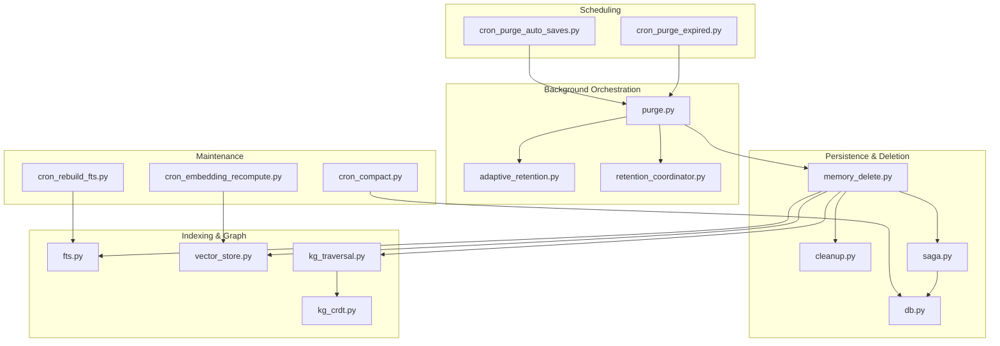
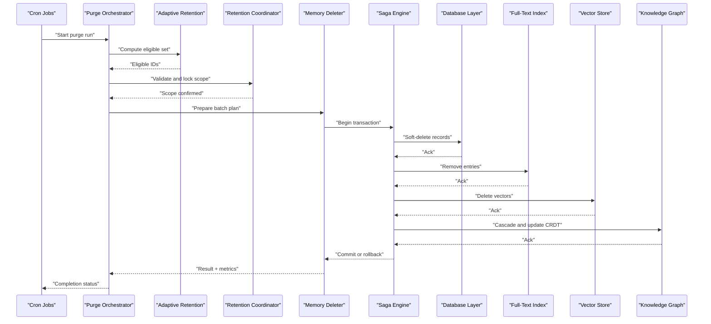
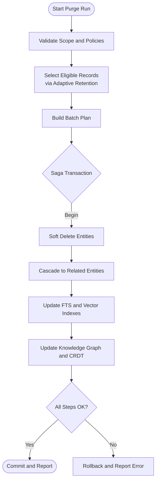
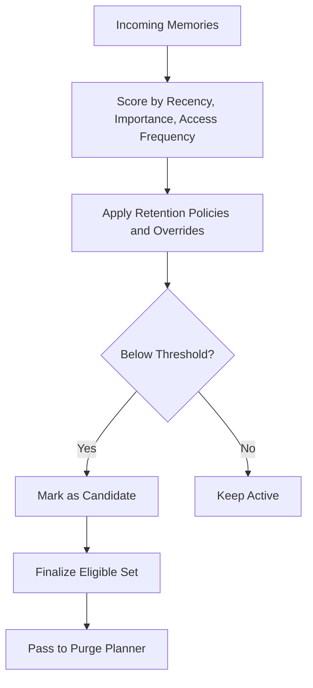
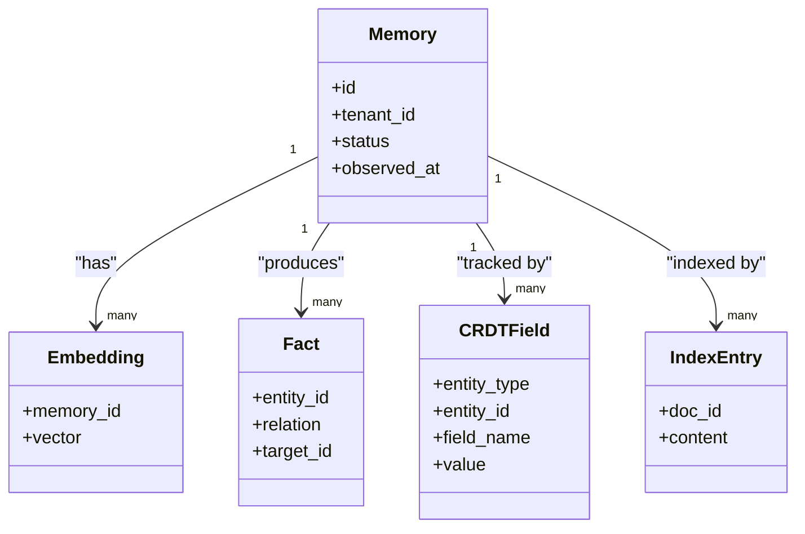
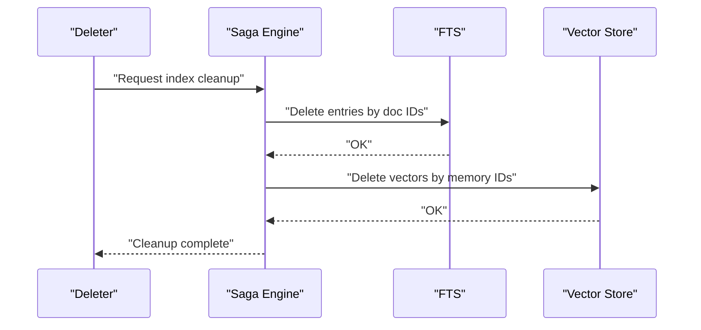
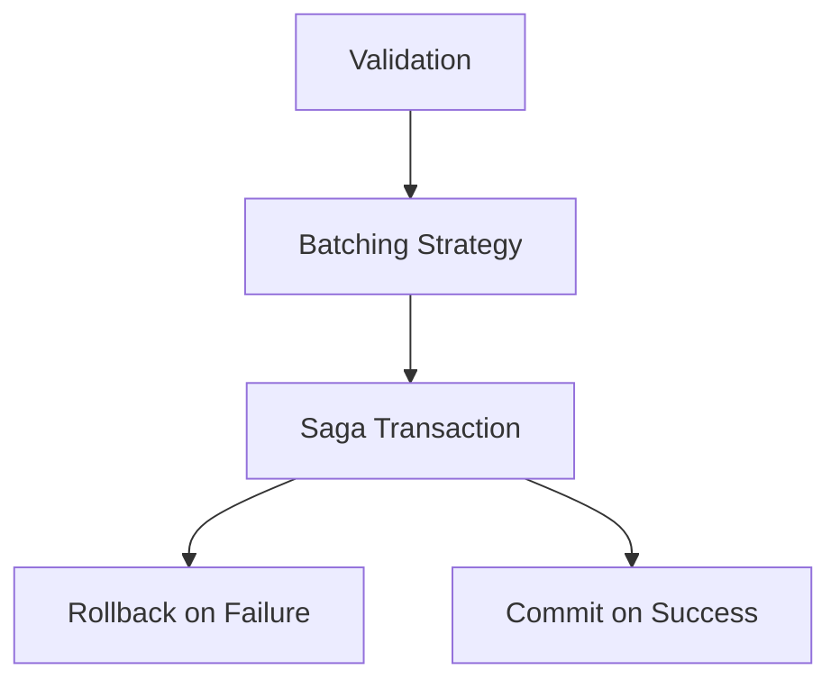
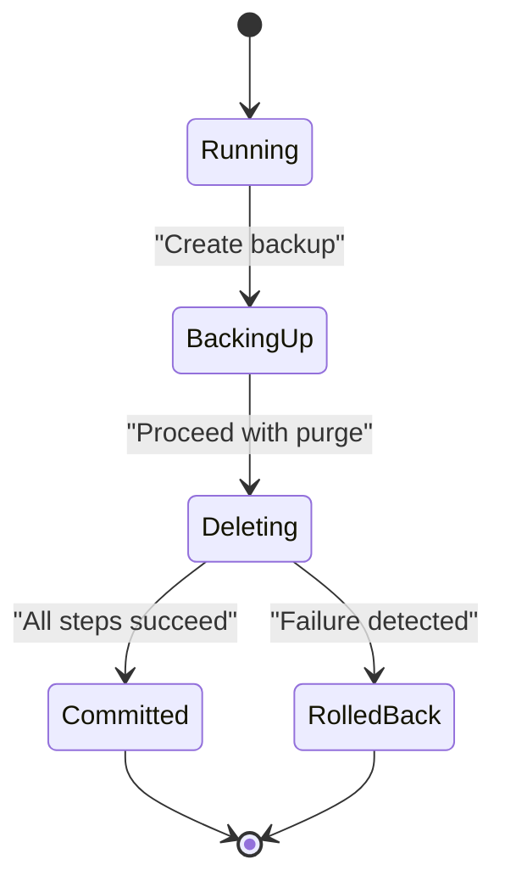
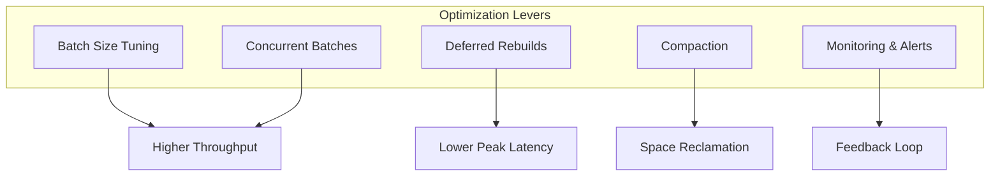
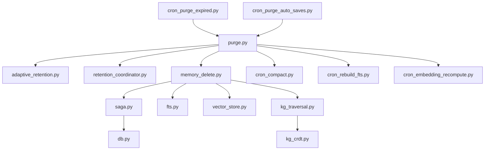

# Purge Process and Data Cleanup

<cite>
**Referenced Files in This Document**
- [purge.py](file://background/purge.py)
- [cron_purge_expired.py](file://cron/cron_purge_expired.py)
- [cron_purge_auto_saves.py](file://cron/cron_purge_auto_saves.py)
- [adaptive_retention.py](file://background/adaptive_retention.py)
- [retention_coordinator.py](file://background/retention_coordinator.py)
- [cleanup.py](file://save/cleanup.py)
- [memory_delete.py](file://memory_delete.py)
- [saga.py](file://infra/saga.py)
- [db.py](file://infra/db.py)
- [fts.py](file://infra/fts.py)
- [vector_store.py](file://infra/vector_store.py)
- [kg_traversal.py](file://kg/kg_traversal.py)
- [kg_crdt.py](file://kg/kg_crdt.py)
- [cron_compact.py](file://cron/cron_compact.py)
- [cron_rebuild_fts.py](file://cron/cron_rebuild_fts.py)
- [cron_embedding_recompute.py](file://cron/cron_embedding_recompute.py)
</cite>

## Table of Contents
1. [Introduction](#introduction)
2. [Project Structure](#project-structure)
3. [Core Components](#core-components)
4. [Architecture Overview](#architecture-overview)
5. [Detailed Component Analysis](#detailed-component-analysis)
6. [Dependency Analysis](#dependency-analysis)
7. [Performance Considerations](#performance-considerations)
8. [Troubleshooting Guide](#troubleshooting-guide)
9. [Conclusion](#conclusion)
10. [Appendices](#appendices)

## Introduction
This document explains the purge process and data cleanup workflow across the system. It covers how memory selection criteria are determined, cascade operations across related entities (including knowledge graph structures), index cleanup procedures, and the purge pipeline stages from validation through batch processing and transaction management. Safety mechanisms such as soft deletes, backup creation, and rollback capabilities are documented alongside performance optimization strategies for large-scale purges and monitoring approaches to measure cleanup effectiveness.

## Project Structure
The purge and cleanup functionality spans background workers, cron jobs, persistence layers, indexing subsystems, and knowledge graph components:
- Background purge orchestration and adaptive retention coordination
- Cron-triggered purges for expired items and auto-saved artifacts
- Save-time cleanup utilities and deletion entry points
- Transactional saga-based execution for safety
- Index and vector store maintenance tasks
- Knowledge graph traversal and CRDT-aware updates

**Diagram sources**
- [cron_purge_expired.py](file://cron/cron_purge_expired.py)
- [cron_purge_auto_saves.py](file://cron/cron_purge_auto_saves.py)
- [purge.py](file://background/purge.py)
- [adaptive_retention.py](file://background/adaptive_retention.py)
- [retention_coordinator.py](file://background/retention_coordinator.py)
- [memory_delete.py](file://memory_delete.py)
- [cleanup.py](file://save/cleanup.py)
- [saga.py](file://infra/saga.py)
- [db.py](file://infra/db.py)
- [fts.py](file://infra/fts.py)
- [vector_store.py](file://infra/vector_store.py)
- [kg_traversal.py](file://kg/kg_traversal.py)
- [kg_crdt.py](file://kg/kg_crdt.py)
- [cron_compact.py](file://cron/cron_compact.py)
- [cron_rebuild_fts.py](file://cron/cron_rebuild_fts.py)
- [cron_embedding_recompute.py](file://cron/cron_embedding_recompute.py)

**Section sources**
- [purge.py](file://background/purge.py)
- [cron_purge_expired.py](file://cron/cron_purge_expired.py)
- [cron_purge_auto_saves.py](file://cron/cron_purge_auto_saves.py)
- [adaptive_retention.py](file://background/adaptive_retention.py)
- [retention_coordinator.py](file://background/retention_coordinator.py)
- [memory_delete.py](file://memory_delete.py)
- [cleanup.py](file://save/cleanup.py)
- [saga.py](file://infra/saga.py)
- [db.py](file://infra/db.py)
- [fts.py](file://infra/fts.py)
- [vector_store.py](file://infra/vector_store.py)
- [kg_traversal.py](file://kg/kg_traversal.py)
- [kg_crdt.py](file://kg/kg_crdt.py)
- [cron_compact.py](file://cron/cron_compact.py)
- [cron_rebuild_fts.py](file://cron/cron_rebuild_fts.py)
- [cron_embedding_recompute.py](file://cron/cron_embedding_recompute.py)

## Core Components
- Purge orchestrator: Coordinates selection, batching, and execution of deletions with safety checks and metrics.
- Adaptive retention: Computes which memories qualify for removal based on recency, importance, and policy.
- Retention coordinator: Synchronizes retention decisions across subsystems and enforces global constraints.
- Memory deletion entry point: Applies soft delete semantics, cascades to related entities, and triggers downstream cleanup.
- Save-time cleanup: Prunes transient or obsolete artifacts during save operations.
- Saga engine: Wraps multi-step purge operations in transactions with rollback support.
- Database layer: Provides transaction boundaries and safe bulk operations.
- Indexers: Full-text search and vector stores that must be updated after deletions.
- Knowledge graph: Traversal and CRDT-aware updates to maintain consistency when entities are removed.
- Maintenance crons: Compaction, full-text rebuild, and embedding recomputation to keep indexes healthy post-purge.

**Section sources**
- [purge.py](file://background/purge.py)
- [adaptive_retention.py](file://background/adaptive_retention.py)
- [retention_coordinator.py](file://background/retention_coordinator.py)
- [memory_delete.py](file://memory_delete.py)
- [cleanup.py](file://save/cleanup.py)
- [saga.py](file://infra/saga.py)
- [db.py](file://infra/db.py)
- [fts.py](file://infra/fts.py)
- [vector_store.py](file://infra/vector_store.py)
- [kg_traversal.py](file://kg/kg_traversal.py)
- [kg_crdt.py](file://kg/kg_crdt.py)

## Architecture Overview
The purge pipeline is orchestrated by scheduled jobs and background workers. It validates inputs, selects eligible records using retention policies, batches deletions, executes them within a saga-managed transaction, and performs index and graph cleanup. Safety mechanisms include soft deletes, backups, and rollbacks.

**Diagram sources**
- [cron_purge_expired.py](file://cron/cron_purge_expired.py)
- [cron_purge_auto_saves.py](file://cron/cron_purge_auto_saves.py)
- [purge.py](file://background/purge.py)
- [adaptive_retention.py](file://background/adaptive_retention.py)
- [retention_coordinator.py](file://background/retention_coordinator.py)
- [memory_delete.py](file://memory_delete.py)
- [saga.py](file://infra/saga.py)
- [db.py](file://infra/db.py)
- [fts.py](file://infra/fts.py)
- [vector_store.py](file://infra/vector_store.py)
- [kg_traversal.py](file://kg/kg_traversal.py)
- [kg_crdt.py](file://kg/kg_crdt.py)

## Detailed Component Analysis

### Purge Pipeline Stages
- Validation: Ensures tenant scoping, locks, and policy constraints before proceeding.
- Selection: Uses adaptive retention to compute eligible IDs based on recency, decay, and policy overrides.
- Planning: Builds batch plans respecting size limits and dependencies.
- Execution: Runs within a saga-managed transaction; applies soft deletes and cascades.
- Post-processing: Updates indexes and knowledge graph structures; schedules compaction and reindexing if needed.
- Telemetry: Emits metrics for throughput, latency, and error rates.

**Diagram sources**
- [purge.py](file://background/purge.py)
- [adaptive_retention.py](file://background/adaptive_retention.py)
- [memory_delete.py](file://memory_delete.py)
- [saga.py](file://infra/saga.py)
- [db.py](file://infra/db.py)
- [fts.py](file://infra/fts.py)
- [vector_store.py](file://infra/vector_store.py)
- [kg_traversal.py](file://kg/kg_traversal.py)
- [kg_crdt.py](file://kg/kg_crdt.py)

**Section sources**
- [purge.py](file://background/purge.py)
- [adaptive_retention.py](file://background/adaptive_retention.py)
- [memory_delete.py](file://memory_delete.py)
- [saga.py](file://infra/saga.py)
- [db.py](file://infra/db.py)
- [fts.py](file://infra/fts.py)
- [vector_store.py](file://infra/vector_store.py)
- [kg_traversal.py](file://kg/kg_traversal.py)
- [kg_crdt.py](file://kg/kg_crdt.py)

### Memory Selection Criteria for Deletion
- Recency and decay: Older or less frequently accessed items become candidates.
- Importance and pinning: Pinned or high-importance items are protected.
- Policy overrides: Tenant-level or global policies can adjust thresholds.
- Cohort and budget: Adaptive retention considers corpus budgets and cohort health.
- Expiration flags: Explicitly expired items are prioritized.

**Diagram sources**
- [adaptive_retention.py](file://background/adaptive_retention.py)
- [retention_coordinator.py](file://background/retention_coordinator.py)

**Section sources**
- [adaptive_retention.py](file://background/adaptive_retention.py)
- [retention_coordinator.py](file://background/retention_coordinator.py)

### Cascade Operations Across Related Entities
- Entity relationships: Deleting a memory may require removing associated facts, embeddings, and references.
- Knowledge graph: Nodes and edges are pruned; redirects or tombstones may be created to preserve referential integrity.
- CRDT awareness: Append-only CRDT tables ensure consistent state transitions without destructive writes.
- Cross-tenant isolation: Cascades respect tenant boundaries to prevent cross-tenant side effects.

**Diagram sources**
- [memory_delete.py](file://memory_delete.py)
- [kg_traversal.py](file://kg/kg_traversal.py)
- [kg_crdt.py](file://kg/kg_crdt.py)
- [fts.py](file://infra/fts.py)
- [vector_store.py](file://infra/vector_store.py)

**Section sources**
- [memory_delete.py](file://memory_delete.py)
- [kg_traversal.py](file://kg/kg_traversal.py)
- [kg_crdt.py](file://kg/kg_crdt.py)
- [fts.py](file://infra/fts.py)
- [vector_store.py](file://infra/vector_store.py)

### Index Cleanup Procedures
- Full-text search: Remove or mark deleted documents; schedule incremental rebuilds if necessary.
- Vector store: Delete vectors corresponding to removed memories; compact storage periodically.
- Consistency: Ensure index deletions occur within the same transaction boundary as soft deletes to avoid inconsistent reads.

**Diagram sources**
- [memory_delete.py](file://memory_delete.py)
- [saga.py](file://infra/saga.py)
- [fts.py](file://infra/fts.py)
- [vector_store.py](file://infra/vector_store.py)

**Section sources**
- [memory_delete.py](file://memory_delete.py)
- [saga.py](file://infra/saga.py)
- [fts.py](file://infra/fts.py)
- [vector_store.py](file://infra/vector_store.py)

### Purge Pipeline Stages: Validation, Batch Processing, and Transaction Management
- Validation: Enforce tenant scoping, policy constraints, and preconditions.
- Batch processing: Chunk eligible IDs into manageable batches to limit resource usage and improve throughput.
- Transaction management: Use saga to wrap multi-step operations, enabling rollback on failure and idempotent retries.

**Diagram sources**
- [purge.py](file://background/purge.py)
- [saga.py](file://infra/saga.py)
- [db.py](file://infra/db.py)

**Section sources**
- [purge.py](file://background/purge.py)
- [saga.py](file://infra/saga.py)
- [db.py](file://infra/db.py)

### Safety Mechanisms
- Soft deletes: Mark records as deleted rather than hard-deleting to preserve auditability and enable recovery.
- Backup creation: Create snapshots or backups prior to large-scale purges to allow restoration.
- Rollback capabilities: Saga ensures all-or-nothing semantics across database, index, and graph updates.

**Diagram sources**
- [saga.py](file://infra/saga.py)
- [db.py](file://infra/db.py)

**Section sources**
- [saga.py](file://infra/saga.py)
- [db.py](file://infra/db.py)

### Performance Optimization Strategies for Large-Scale Purges
- Batch sizing: Tune batch sizes to balance throughput and resource consumption.
- Parallelism: Execute independent batches concurrently while respecting locks and quotas.
- Index deferral: Defer heavy index rebuilds to off-peak hours via maintenance crons.
- Compaction: Schedule compaction to reclaim space after bulk deletions.
- Monitoring: Track purge duration, throughput, and error rates to guide tuning.

[No sources needed since this section provides general guidance]

### Monitoring Cleanup Effectiveness
- Metrics: Emit counts of purged records, time per batch, and error rates.
- Health checks: Verify index consistency and absence of orphaned entries.
- Dashboards: Visualize purge throughput and retention policy impact over time.

[No sources needed since this section provides general guidance]

## Dependency Analysis
The purge system depends on scheduling, orchestration, persistence, indexing, and knowledge graph components. The following diagram shows key dependencies and interactions.

**Diagram sources**
- [cron_purge_expired.py](file://cron/cron_purge_expired.py)
- [cron_purge_auto_saves.py](file://cron/cron_purge_auto_saves.py)
- [purge.py](file://background/purge.py)
- [adaptive_retention.py](file://background/adaptive_retention.py)
- [retention_coordinator.py](file://background/retention_coordinator.py)
- [memory_delete.py](file://memory_delete.py)
- [saga.py](file://infra/saga.py)
- [db.py](file://infra/db.py)
- [fts.py](file://infra/fts.py)
- [vector_store.py](file://infra/vector_store.py)
- [kg_traversal.py](file://kg/kg_traversal.py)
- [kg_crdt.py](file://kg/kg_crdt.py)
- [cron_compact.py](file://cron/cron_compact.py)
- [cron_rebuild_fts.py](file://cron/cron_rebuild_fts.py)
- [cron_embedding_recompute.py](file://cron/cron_embedding_recompute.py)

**Section sources**
- [cron_purge_expired.py](file://cron/cron_purge_expired.py)
- [cron_purge_auto_saves.py](file://cron/cron_purge_auto_saves.py)
- [purge.py](file://background/purge.py)
- [adaptive_retention.py](file://background/adaptive_retention.py)
- [retention_coordinator.py](file://background/retention_coordinator.py)
- [memory_delete.py](file://memory_delete.py)
- [saga.py](file://infra/saga.py)
- [db.py](file://infra/db.py)
- [fts.py](file://infra/fts.py)
- [vector_store.py](file://infra/vector_store.py)
- [kg_traversal.py](file://kg/kg_traversal.py)
- [kg_crdt.py](file://kg/kg_crdt.py)
- [cron_compact.py](file://cron/cron_compact.py)
- [cron_rebuild_fts.py](file://cron/cron_rebuild_fts.py)
- [cron_embedding_recompute.py](file://cron/cron_embedding_recompute.py)

## Performance Considerations
- Choose appropriate batch sizes to avoid long-running transactions and excessive memory pressure.
- Use concurrent execution where possible, but enforce locking and quotas to prevent contention.
- Defer expensive index rebuilds to maintenance windows; rely on incremental updates during purge runs.
- Monitor database WAL growth and vacuum/compaction schedules to maintain performance.
- Observe index fragmentation and trigger targeted rebuilds after large purges.

[No sources needed since this section provides general guidance]

## Troubleshooting Guide
- Symptom: Purge stalls or times out
  - Check saga logs for failed steps and identify whether failures occur in database, index, or graph operations.
  - Reduce batch size and retry with smaller chunks.
- Symptom: Orphaned index entries remain
  - Trigger a targeted rebuild for affected indices and verify consistency.
- Symptom: Knowledge graph inconsistencies
  - Inspect CRDT append tables and ensure cascade updates completed; consider running graph repair routines.
- Symptom: High disk usage post-purge
  - Schedule compaction and verify space reclamation; check for pending WAL checkpoints.

**Section sources**
- [saga.py](file://infra/saga.py)
- [fts.py](file://infra/fts.py)
- [vector_store.py](file://infra/vector_store.py)
- [kg_traversal.py](file://kg/kg_traversal.py)
- [kg_crdt.py](file://kg/kg_crdt.py)
- [cron_compact.py](file://cron/cron_compact.py)
- [cron_rebuild_fts.py](file://cron/cron_rebuild_fts.py)
- [cron_embedding_recompute.py](file://cron/cron_embedding_recompute.py)

## Conclusion
The purge process integrates adaptive retention, robust transaction management, and comprehensive cleanup across databases, indexes, and knowledge graphs. By employing soft deletes, backups, and rollback capabilities, it ensures safety and recoverability. Performance tuning through batching, concurrency, and deferred maintenance enables effective large-scale purges, while monitoring and troubleshooting practices help maintain system health and consistency.

## Appendices

### Cron Integration Points
- Expired purge job: Schedules periodic purges based on expiration policies.
- Auto-save purge job: Removes stale auto-saved artifacts according to retention rules.

**Section sources**
- [cron_purge_expired.py](file://cron/cron_purge_expired.py)
- [cron_purge_auto_saves.py](file://cron/cron_purge_auto_saves.py)

### Save-Time Cleanup Utilities
- Lightweight pruning of transient artifacts during save operations to reduce backlog for purge runs.

**Section sources**
- [cleanup.py](file://save/cleanup.py)