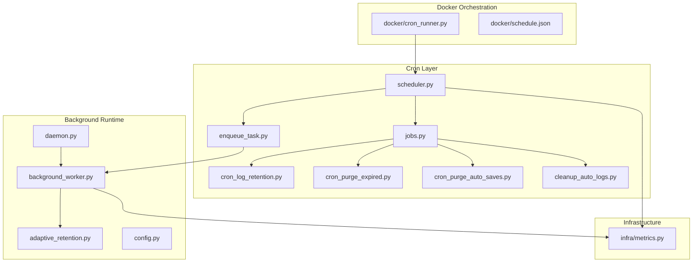
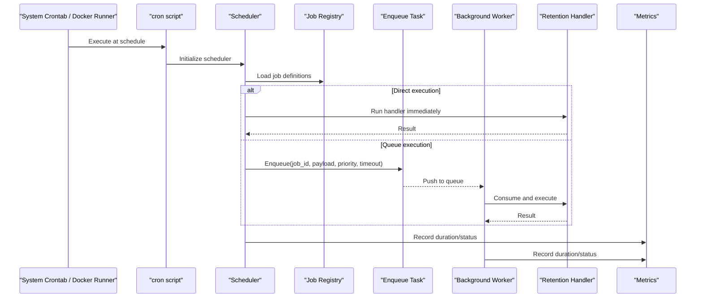
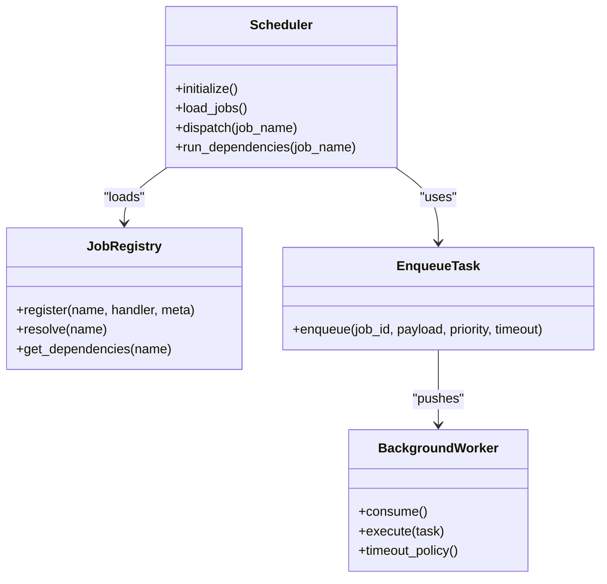
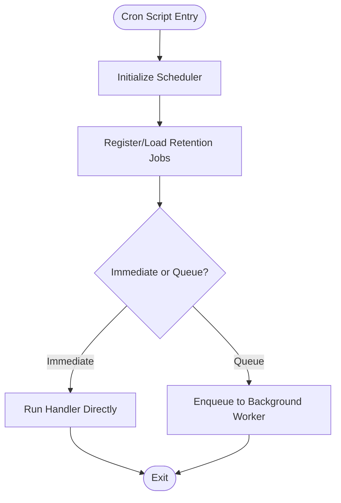
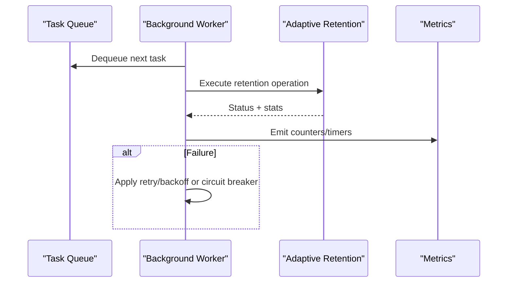
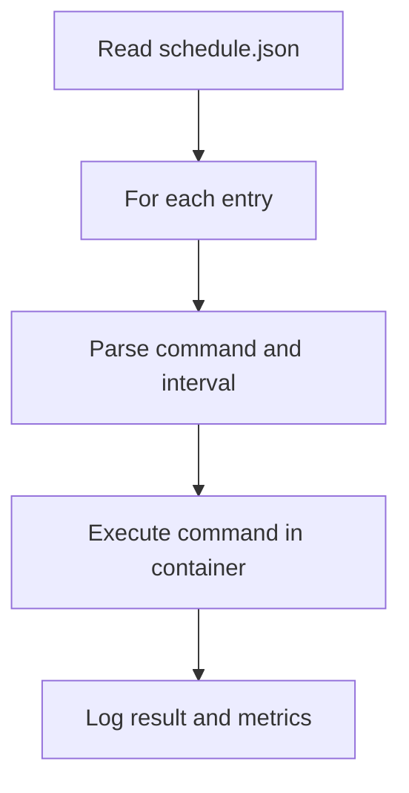
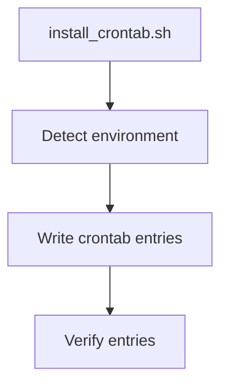
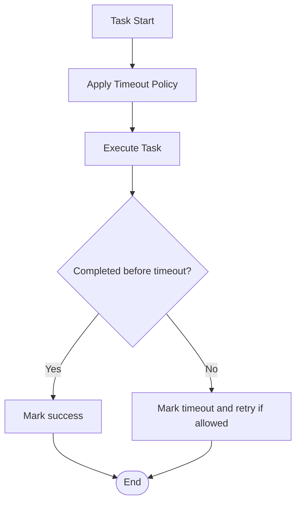
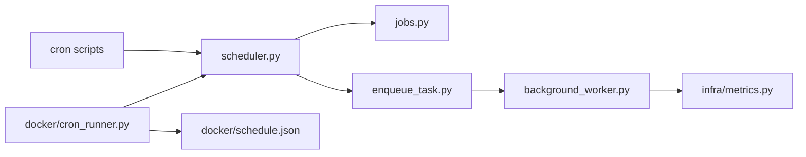

# Retention Scheduling and Cron Jobs

<cite>
**Referenced Files in This Document**
- [cron/scheduler.py](file://cron/scheduler.py)
- [cron/jobs.py](file://cron/jobs.py)
- [cron/cleanup_auto_logs.py](file://cron/cleanup_auto_logs.py)
- [cron/cron_log_retention.py](file://cron/cron_log_retention.py)
- [cron/cron_purge_expired.py](file://cron/cron_purge_expired.py)
- [cron/cron_purge_auto_saves.py](file://cron/cron_purge_auto_saves.py)
- [cron/enqueue_task.py](file://cron/enqueue_task.py)
- [background/adaptive_retention.py](file://background/adaptive_retention.py)
- [background/background_worker.py](file://background/background_worker.py)
- [background/config.py](file://background/config.py)
- [background/daemon.py](file://background/daemon.py)
- [docker/cron_runner.py](file://docker/cron_runner.py)
- [docker/schedule.json](file://docker/schedule.json)
- [cron/install_crontab.sh](file://cron/install_crontab.sh)
- [cron/manage_task_timeouts.py](file://cron/manage_task_timeouts.py)
- [cron/monitor_task_queue.py](file://cron/monitor_task_queue.py)
- [infra/metrics.py](file://infra/metrics.py)
</cite>

## Table of Contents
1. [Introduction](#introduction)
2. [Project Structure](#project-structure)
3. [Core Components](#core-components)
4. [Architecture Overview](#architecture-overview)
5. [Detailed Component Analysis](#detailed-component-analysis)
6. [Dependency Analysis](#dependency-analysis)
7. [Performance Considerations](#performance-considerations)
8. [Troubleshooting Guide](#troubleshooting-guide)
9. [Conclusion](#conclusion)
10. [Appendices](#appendices)

## Introduction
This document explains how retention scheduling and cron job execution are implemented, focusing on cleanup tasks, job definitions, execution intervals, dependency management, scheduler architecture, task queue integration, failure handling, configuration options for retention policies, job prioritization, resource allocation, examples of custom retention jobs, and monitoring scheduled task execution.

## Project Structure
The scheduling subsystem is primarily organized under the cron package with supporting background workers and Docker orchestration:
- cron/: Scheduler core, job registry, individual cron scripts, enqueue helpers, and installers
- background/: Background worker runtime, adaptive retention logic, daemon lifecycle, and config
- docker/: Containerized cron runner and schedule manifest
- infra/: Metrics instrumentation used by schedulers and workers

**Diagram sources**
- [cron/scheduler.py](file://cron/scheduler.py)
- [cron/jobs.py](file://cron/jobs.py)
- [cron/enqueue_task.py](file://cron/enqueue_task.py)
- [cron/cron_log_retention.py](file://cron/cron_log_retention.py)
- [cron/cron_purge_expired.py](file://cron/cron_purge_expired.py)
- [cron/cron_purge_auto_saves.py](file://cron/cron_purge_auto_saves.py)
- [cron/cleanup_auto_logs.py](file://cron/cleanup_auto_logs.py)
- [background/background_worker.py](file://background/background_worker.py)
- [background/adaptive_retention.py](file://background/adaptive_retention.py)
- [background/daemon.py](file://background/daemon.py)
- [background/config.py](file://background/config.py)
- [docker/cron_runner.py](file://docker/cron_runner.py)
- [docker/schedule.json](file://docker/schedule.json)
- [infra/metrics.py](file://infra/metrics.py)

**Section sources**
- [cron/scheduler.py](file://cron/scheduler.py)
- [cron/jobs.py](file://cron/jobs.py)
- [cron/enqueue_task.py](file://cron/enqueue_task.py)
- [background/background_worker.py](file://background/background_worker.py)
- [background/adaptive_retention.py](file://background/adaptive_retention.py)
- [background/daemon.py](file://background/daemon.py)
- [background/config.py](file://background/config.py)
- [docker/cron_runner.py](file://docker/cron_runner.py)
- [docker/schedule.json](file://docker/schedule.json)
- [infra/metrics.py](file://infra/metrics.py)

## Core Components
- Scheduler: Central coordinator that loads job definitions, parses schedules, and dispatches work to either direct handlers or a background task queue.
- Job Registry: Declarative mapping of job names to handler functions and metadata (schedule, dependencies, tags).
- Enqueue Helper: Utility to push long-running or heavy tasks into the background worker queue with optional priority and timeout policy.
- Background Worker: Persistent process that consumes queued tasks, enforces timeouts, retries, and circuit breakers where applicable.
- Cron Scripts: Lightweight entry points invoked by the system crontab or container runner; they typically register jobs or enqueue tasks.
- Docker Runner: Containerized executor that reads a schedule manifest and runs corresponding commands at specified times.
- Monitoring: Metrics collection around job start/end, durations, failures, and queue depth.

Key responsibilities:
- Define and load retention-related jobs (log retention, purge expired items, auto-save purging, auto-log cleanup).
- Schedule via system crontab or Docker schedule manifest.
- Offload heavy work to the background worker queue.
- Track metrics and handle failures with retries/timeouts.

**Section sources**
- [cron/scheduler.py](file://cron/scheduler.py)
- [cron/jobs.py](file://cron/jobs.py)
- [cron/enqueue_task.py](file://cron/enqueue_task.py)
- [background/background_worker.py](file://background/background_worker.py)
- [docker/cron_runner.py](file://docker/cron_runner.py)
- [docker/schedule.json](file://docker/schedule.json)
- [infra/metrics.py](file://infra/metrics.py)

## Architecture Overview
The retention scheduling architecture combines declarative job definitions with a robust background worker pipeline.

**Diagram sources**
- [cron/scheduler.py](file://cron/scheduler.py)
- [cron/jobs.py](file://cron/jobs.py)
- [cron/enqueue_task.py](file://cron/enqueue_task.py)
- [background/background_worker.py](file://background/background_worker.py)
- [infra/metrics.py](file://infra/metrics.py)

## Detailed Component Analysis

### Scheduler and Job Registry
- The scheduler initializes once per invocation, loads job definitions from the registry, and executes them according to their schedule or immediate trigger.
- The job registry maps human-readable job names to handler callables and metadata such as schedule expressions, dependencies, and tags.
- Dependency management ensures dependent jobs run after prerequisites complete successfully within the same run window.

**Diagram sources**
- [cron/scheduler.py](file://cron/scheduler.py)
- [cron/jobs.py](file://cron/jobs.py)
- [cron/enqueue_task.py](file://cron/enqueue_task.py)
- [background/background_worker.py](file://background/background_worker.py)

**Section sources**
- [cron/scheduler.py](file://cron/scheduler.py)
- [cron/jobs.py](file://cron/jobs.py)
- [cron/enqueue_task.py](file://cron/enqueue_task.py)

### Cron Scripts for Retention Cleanup
These scripts act as thin entry points invoked by the system crontab or Docker runner. They typically initialize the scheduler and register or enqueue specific retention tasks.

- Log retention: Triggers log archival and cleanup based on configured retention windows.
- Purge expired: Removes expired memories or artifacts beyond retention thresholds.
- Purge auto-saves: Cleans up temporary auto-save artifacts.
- Auto-log cleanup: Removes stale auto-generated logs.

**Diagram sources**
- [cron/cron_log_retention.py](file://cron/cron_log_retention.py)
- [cron/cron_purge_expired.py](file://cron/cron_purge_expired.py)
- [cron/cron_purge_auto_saves.py](file://cron/cron_purge_auto_saves.py)
- [cron/cleanup_auto_logs.py](file://cron/cleanup_auto_logs.py)
- [cron/scheduler.py](file://cron/scheduler.py)
- [cron/enqueue_task.py](file://cron/enqueue_task.py)

**Section sources**
- [cron/cron_log_retention.py](file://cron/cron_log_retention.py)
- [cron/cron_purge_expired.py](file://cron/cron_purge_expired.py)
- [cron/cron_purge_auto_saves.py](file://cron/cron_purge_auto_saves.py)
- [cron/cleanup_auto_logs.py](file://cron/cleanup_auto_logs.py)

### Background Worker and Adaptive Retention
- The background worker consumes tasks from the queue, applies timeout policies, and handles retries and circuit breaking where applicable.
- Adaptive retention logic can adjust retention behavior dynamically based on workload, storage pressure, or policy changes.

**Diagram sources**
- [background/background_worker.py](file://background/background_worker.py)
- [background/adaptive_retention.py](file://background/adaptive_retention.py)
- [infra/metrics.py](file://infra/metrics.py)

**Section sources**
- [background/background_worker.py](file://background/background_worker.py)
- [background/adaptive_retention.py](file://background/adaptive_retention.py)

### Docker Cron Runner and Schedule Manifest
- The Docker runner reads a JSON schedule manifest and executes corresponding commands at specified times inside containers.
- This enables consistent scheduling across environments without relying on host crontab.

**Diagram sources**
- [docker/cron_runner.py](file://docker/cron_runner.py)
- [docker/schedule.json](file://docker/schedule.json)

**Section sources**
- [docker/cron_runner.py](file://docker/cron_runner.py)
- [docker/schedule.json](file://docker/schedule.json)

### Installation and System Integration
- The installer script sets up system crontab entries for production hosts.
- Launch agent installation is supported for macOS environments.

**Diagram sources**
- [cron/install_crontab.sh](file://cron/install_crontab.sh)

**Section sources**
- [cron/install_crontab.sh](file://cron/install_crontab.sh)

### Task Timeouts and Queue Monitoring
- Manage task timeouts centrally to prevent runaway jobs.
- Monitor queue health and backpressure to avoid starvation or overload.

**Diagram sources**
- [cron/manage_task_timeouts.py](file://cron/manage_task_timeouts.py)
- [cron/monitor_task_queue.py](file://cron/monitor_task_queue.py)

**Section sources**
- [cron/manage_task_timeouts.py](file://cron/manage_task_timeouts.py)
- [cron/monitor_task_queue.py](file://cron/monitor_task_queue.py)

## Dependency Analysis
- Scheduler depends on the job registry for definitions and on the enqueue helper for offloading work.
- Cron scripts depend on the scheduler and may depend on background worker availability when queuing.
- Background worker depends on queue infrastructure and metrics instrumentation.
- Docker runner depends on the schedule manifest and environment variables.

**Diagram sources**
- [cron/scheduler.py](file://cron/scheduler.py)
- [cron/jobs.py](file://cron/jobs.py)
- [cron/enqueue_task.py](file://cron/enqueue_task.py)
- [background/background_worker.py](file://background/background_worker.py)
- [docker/cron_runner.py](file://docker/cron_runner.py)
- [docker/schedule.json](file://docker/schedule.json)
- [infra/metrics.py](file://infra/metrics.py)

**Section sources**
- [cron/scheduler.py](file://cron/scheduler.py)
- [cron/jobs.py](file://cron/jobs.py)
- [cron/enqueue_task.py](file://cron/enqueue_task.py)
- [background/background_worker.py](file://background/background_worker.py)
- [docker/cron_runner.py](file://docker/cron_runner.py)
- [docker/schedule.json](file://docker/schedule.json)
- [infra/metrics.py](file://infra/metrics.py)

## Performance Considerations
- Prefer queuing heavy retention operations to the background worker to keep cron invocations fast and idempotent.
- Use appropriate timeout policies to bound resource usage and prevent cascading failures.
- Monitor queue depth and latency to detect backpressure early.
- Batch operations where possible to reduce I/O overhead during purges and compactions.
- Avoid overlapping executions of the same job unless explicitly designed for parallelism.

[No sources needed since this section provides general guidance]

## Troubleshooting Guide
Common issues and resolutions:
- Job not executing:
  - Verify crontab entries or Docker schedule manifest correctness.
  - Confirm scheduler initialization succeeds and job registry contains the target job.
- Long-running jobs timing out:
  - Adjust timeout policy and ensure retries are configured appropriately.
  - Check background worker capacity and queue depth.
- High memory/CPU usage:
  - Reduce batch sizes, increase sleep/backoff between batches, and limit concurrency.
- Missing metrics:
  - Ensure metrics instrumentation is enabled and accessible.

Operational checks:
- Validate installed crontab entries and Docker schedule manifest.
- Inspect queue monitoring outputs for stalled tasks.
- Review metrics for error rates and durations.

**Section sources**
- [cron/install_crontab.sh](file://cron/install_crontab.sh)
- [docker/cron_runner.py](file://docker/cron_runner.py)
- [docker/schedule.json](file://docker/schedule.json)
- [cron/manage_task_timeouts.py](file://cron/manage_task_timeouts.py)
- [cron/monitor_task_queue.py](file://cron/monitor_task_queue.py)
- [infra/metrics.py](file://infra/metrics.py)

## Conclusion
The retention scheduling system combines declarative job definitions, a flexible scheduler, and a resilient background worker to reliably perform cleanup and retention tasks. By leveraging queues, timeouts, and metrics, it achieves predictable performance and observability. Operators can extend functionality by adding new retention jobs through the registry and configuring schedules via crontab or Docker manifests.

[No sources needed since this section summarizes without analyzing specific files]

## Appendices

### Configuration Options for Retention Policies
- Retention windows: Configure time-based rules for logs, auto-saves, and expired items.
- Priority levels: Assign priorities to retention tasks to control execution order under load.
- Resource limits: Set maximum concurrent workers, batch sizes, and per-job timeouts.
- Retry/backoff: Define retry counts and exponential backoff parameters for transient failures.
- Environment toggles: Enable/disable specific retention jobs per deployment profile.

[No sources needed since this section provides general guidance]

### Examples of Custom Retention Jobs
To add a custom retention job:
- Implement a handler function that performs the desired cleanup logic.
- Register the handler in the job registry with a name, schedule expression, and optional dependencies.
- Create a cron script entry point that initializes the scheduler and triggers the job (directly or via queue).
- If the job is heavy, use the enqueue helper to submit it to the background worker with an appropriate timeout policy.
- Add metrics instrumentation to track success/failure and duration.

[No sources needed since this section provides general guidance]

### Monitoring Scheduled Task Execution
- Collect metrics for job start/end timestamps, durations, and status codes.
- Expose queue depth, average wait time, and processing rate.
- Alert on repeated failures, timeouts, and queue saturation.
- Integrate with centralized logging and tracing systems for end-to-end visibility.

**Section sources**
- [infra/metrics.py](file://infra/metrics.py)
- [cron/monitor_task_queue.py](file://cron/monitor_task_queue.py)