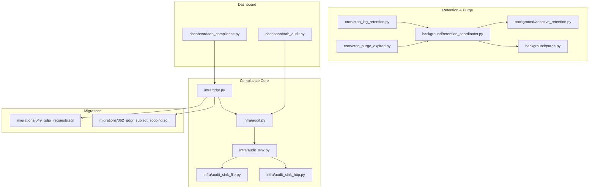
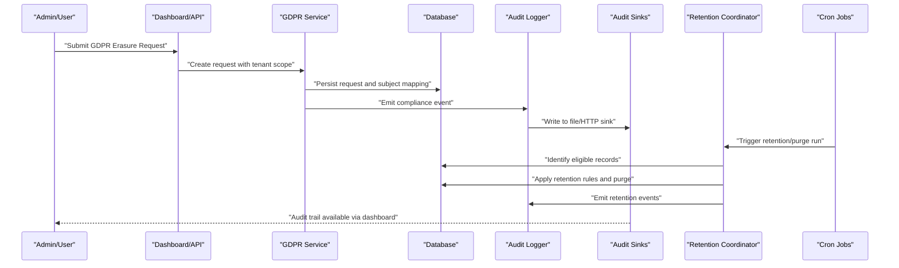
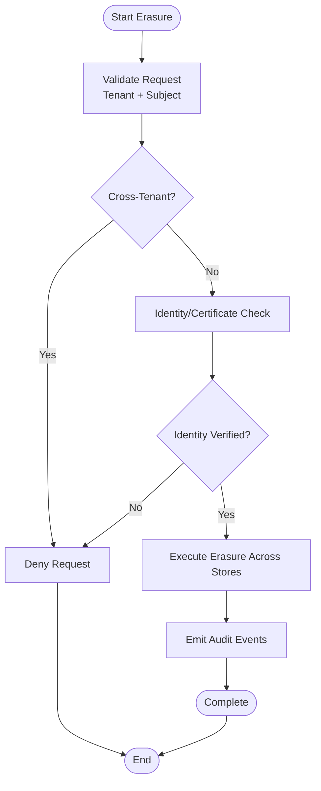
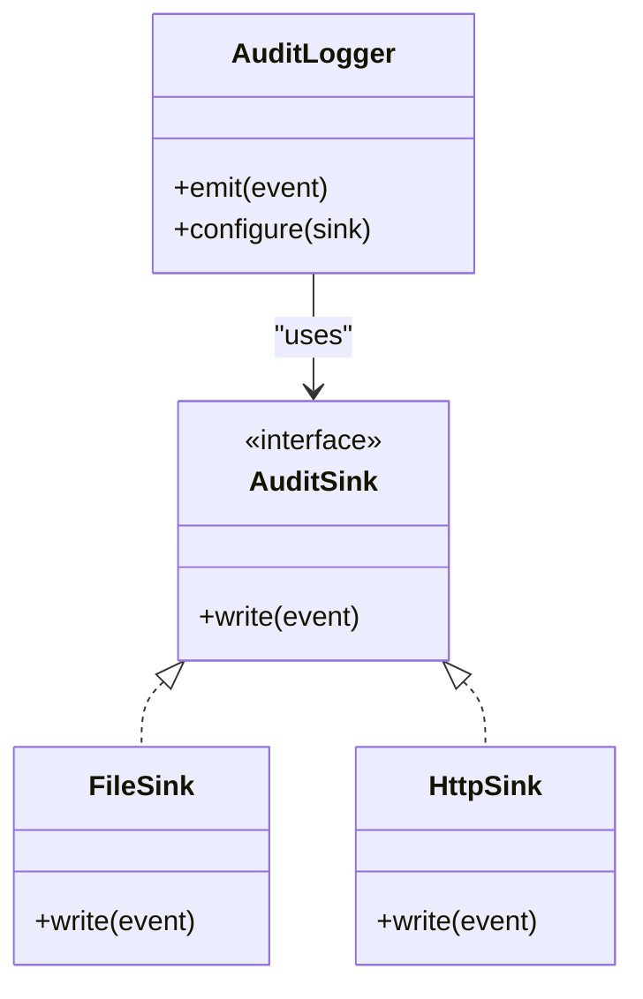
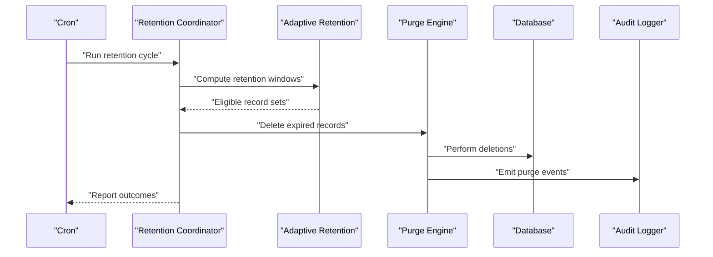
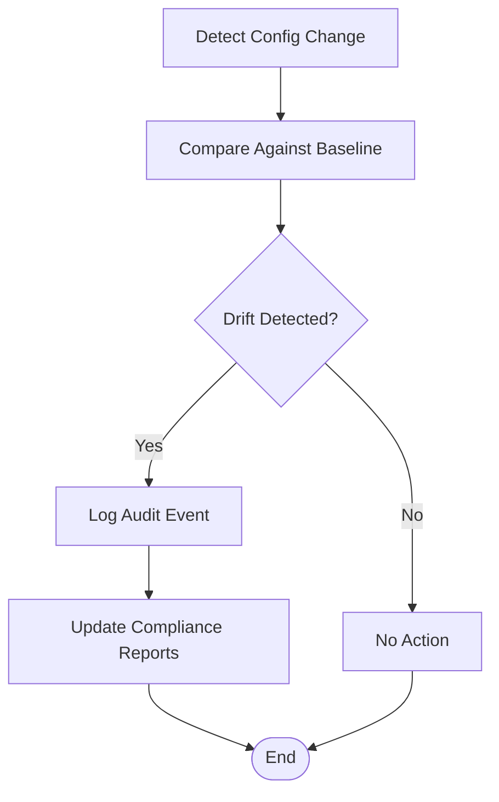
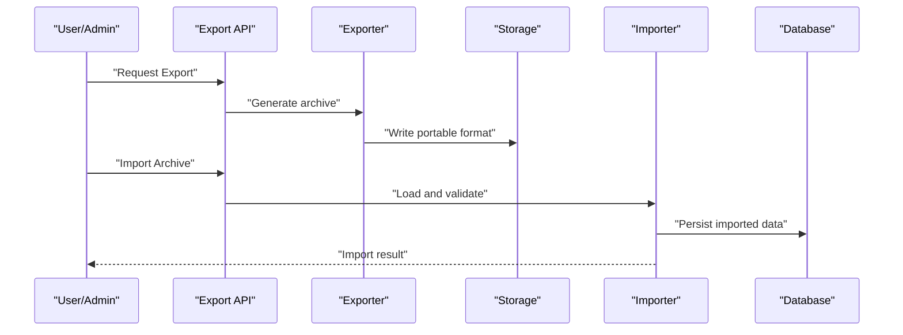
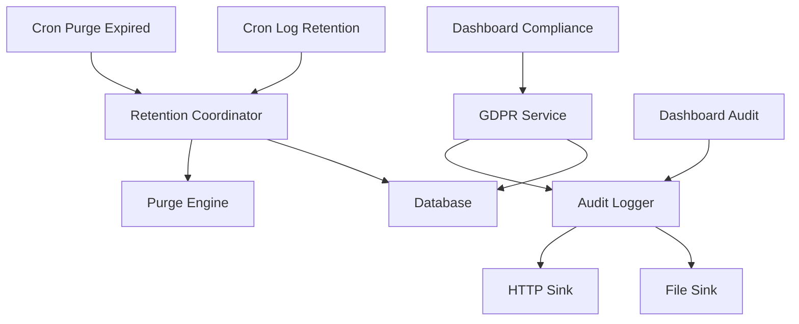

# Compliance and Data Archival

<cite>
**Referenced Files in This Document**
- [gdpr.py](file://infra/gdpr.py)
- [audit.py](file://infra/audit.py)
- [audit_sink.py](file://infra/audit_sink.py)
- [audit_sink_file.py](file://infra/audit_sink_file.py)
- [audit_sink_http.py](file://infra/audit_sink_http.py)
- [cron_log_retention.py](file://cron/cron_log_retention.py)
- [cron_purge_expired.py](file://cron/cron_purge_expired.py)
- [purge.py](file://background/purge.py)
- [adaptive_retention.py](file://background/adaptive_retention.py)
- [retention_coordinator.py](file://background/retention_coordinator.py)
- [tab_compliance.py](file://dashboard/tab_compliance.py)
- [tab_audit.py](file://dashboard/tab_audit.py)
- [049_gdpr_requests.down.sql](file://migrations/049_gdpr_requests.down.sql)
- [049_gdpr_requests.sql](file://migrations/049_gdpr_requests.sql)
- [062_gdpr_subject_scoping.down.sql](file://migrations/062_gdpr_subject_scoping.down.sql)
- [062_gdpr_subject_scoping.sql](file://migrations/062_gdpr_subject_scoping.sql)
- [test_gdpr_erase_certificate.py](file://tests/test_gdpr_erase_certificate.py)
- [test_gdpr_erase_full_cascade.py](file://tests/test_gdpr_erase_full_cascade.py)
- [test_gdpr_erase_refuses_cross_tenant.py](file://tests/test_gdpr_erase_refuses_cross_tenant.py)
- [test_gdpr_subject_fallback.py](file://tests/test_gdpr_subject_fallback.py)
- [test_audit_logging.py](file://tests/test_audit_logging.py)
- [test_audit_sink_dead_letter.py](file://tests/test_audit_sink_dead_letter.py)
- [test_audit_sink_drops_on_5xx.py](file://tests/test_audit_sink_drops_on_5xx.py)
- [test_audit_sink_http.py](file://tests/test_audit_sink_http.py)
- [test_audit_sink_principal_redact.py](file://tests/test_audit_sink_principal_redact.py)
- [test_retention_coordinator.py](file://tests/test_retention_coordinator.py)
- [test_config_drift_audit.py](file://tests/test_config_drift_audit.py)
- [test_rbac_audit_trail.py](file://tests/test_rbac_audit_trail.py)
- [AUDIT_REPORT_2026.md](file://AUDIT_REPORT_2026.md)
- [AUDIT_VERIFICATION_2026-07-16.md](file://AUDIT_VERIFICATION_2026-07-16.md)
- [EVIDENCE_COLLECTION_GUIDE.md](file://docs/compliance/EVIDENCE_COLLECTION_GUIDE.md)
- [INCIDENT_RESPONSE_PLAN.md](file://docs/compliance/INCIDENT_RESPONSE_PLAN.md)
- [DATA_RETENTION_POLICY.md](file://docs/compliance/DATA_RETENTION_POLICY.md)
</cite>

## Table of Contents
1. [Introduction](#introduction)
2. [Project Structure](#project-structure)
3. [Core Components](#core-components)
4. [Architecture Overview](#architecture-overview)
5. [Detailed Component Analysis](#detailed-component-analysis)
6. [Dependency Analysis](#dependency-analysis)
7. [Performance Considerations](#performance-considerations)
8. [Troubleshooting Guide](#troubleshooting-guide)
9. [Conclusion](#conclusion)
10. [Appendices](#appendices)

## Introduction
This document describes the compliance requirements and data archival procedures implemented in the system, with a focus on GDPR features (right to erasure, data portability, audit logging), retention policy enforcement, legal hold mechanisms, regulatory compliance checks, data lifecycle management, archival formats, and long-term storage strategies. It also provides examples for compliance reporting, audit trail generation, and data breach response procedures.

## Project Structure
Compliance-related functionality is implemented across several modules:
- GDPR request handling and subject scoping
- Audit logging and sinks
- Retention and purge orchestration
- Dashboard tabs for compliance and audit visibility
- Database migrations for GDPR requests and subject scoping
- Tests validating behavior and edge cases
- Policy and operational documentation

**Diagram sources**
- [gdpr.py](file://infra/gdpr.py)
- [audit.py](file://infra/audit.py)
- [audit_sink.py](file://infra/audit_sink.py)
- [audit_sink_file.py](file://infra/audit_sink_file.py)
- [audit_sink_http.py](file://infra/audit_sink_http.py)
- [retention_coordinator.py](file://background/retention_coordinator.py)
- [adaptive_retention.py](file://background/adaptive_retention.py)
- [purge.py](file://background/purge.py)
- [cron_log_retention.py](file://cron/cron_log_retention.py)
- [cron_purge_expired.py](file://cron/cron_purge_expired.py)
- [tab_compliance.py](file://dashboard/tab_compliance.py)
- [tab_audit.py](file://dashboard/tab_audit.py)
- [049_gdpr_requests.sql](file://migrations/049_gdpr_requests.sql)
- [062_gdpr_subject_scoping.sql](file://migrations/062_gdpr_subject_scoping.sql)

**Section sources**
- [gdpr.py](file://infra/gdpr.py)
- [audit.py](file://infra/audit.py)
- [audit_sink.py](file://infra/audit_sink.py)
- [audit_sink_file.py](file://infra/audit_sink_file.py)
- [audit_sink_http.py](file://infra/audit_sink_http.py)
- [retention_coordinator.py](file://background/retention_coordinator.py)
- [adaptive_retention.py](file://background/adaptive_retention.py)
- [purge.py](file://background/purge.py)
- [cron_log_retention.py](file://cron/cron_log_retention.py)
- [cron_purge_expired.py](file://cron/cron_purge_expired.py)
- [tab_compliance.py](file://dashboard/tab_compliance.py)
- [tab_audit.py](file://dashboard/tab_audit.py)
- [049_gdpr_requests.sql](file://migrations/049_gdpr_requests.sql)
- [062_gdpr_subject_scoping.sql](file://migrations/062_gdpr_subject_scoping.sql)

## Core Components
- GDPR Request Management: Tracks and enforces erasure requests with tenant isolation and subject fallback logic.
- Audit Logging: Centralized audit event emission with pluggable sinks (file and HTTP) including redaction and resilience behaviors.
- Retention Orchestration: Coordinator that schedules adaptive retention and purging tasks; cron jobs trigger periodic runs.
- Dashboard Compliance/Audit UI: Provides visibility into compliance status and audit trails.
- Database Schema: Migrations introduce tables for GDPR requests and subject scoping.

Key responsibilities:
- Enforce right to erasure across tenants and subjects
- Maintain immutable audit trails with sensitive data redaction
- Apply retention policies adaptively and purge expired records
- Provide dashboards for compliance and audit review

**Section sources**
- [gdpr.py](file://infra/gdpr.py)
- [audit.py](file://infra/audit.py)
- [audit_sink.py](file://infra/audit_sink.py)
- [audit_sink_file.py](file://infra/audit_sink_file.py)
- [audit_sink_http.py](file://infra/audit_sink_http.py)
- [retention_coordinator.py](file://background/retention_coordinator.py)
- [adaptive_retention.py](file://background/adaptive_retention.py)
- [purge.py](file://background/purge.py)
- [cron_log_retention.py](file://cron/cron_log_retention.py)
- [cron_purge_expired.py](file://cron/cron_purge_expired.py)
- [tab_compliance.py](file://dashboard/tab_compliance.py)
- [tab_audit.py](file://dashboard/tab_audit.py)
- [049_gdpr_requests.sql](file://migrations/049_gdpr_requests.sql)
- [062_gdpr_subject_scoping.sql](file://migrations/062_gdpr_subject_scoping.sql)

## Architecture Overview
The compliance architecture integrates request processing, audit emission, retention scheduling, and dashboarding.

**Diagram sources**
- [gdpr.py](file://infra/gdpr.py)
- [audit.py](file://infra/audit.py)
- [audit_sink.py](file://infra/audit_sink.py)
- [audit_sink_file.py](file://infra/audit_sink_file.py)
- [audit_sink_http.py](file://infra/audit_sink_http.py)
- [retention_coordinator.py](file://background/retention_coordinator.py)
- [cron_log_retention.py](file://cron/cron_log_retention.py)
- [cron_purge_expired.py](file://cron/cron_purge_expired.py)
- [tab_compliance.py](file://dashboard/tab_compliance.py)
- [tab_audit.py](file://dashboard/tab_audit.py)

## Detailed Component Analysis

### GDPR Right to Erasure and Subject Scoping
- Request lifecycle: creation, validation, scoping by tenant and subject, execution, and completion.
- Tenant isolation enforced to prevent cross-tenant erasure.
- Subject fallback mechanism ensures robustness when primary identifiers are missing.
- Certificate or proof-of-identity checks can be required before proceeding.

**Diagram sources**
- [gdpr.py](file://infra/gdpr.py)
- [049_gdpr_requests.sql](file://migrations/049_gdpr_requests.sql)
- [062_gdpr_subject_scoping.sql](file://migrations/062_gdpr_subject_scoping.sql)

**Section sources**
- [gdpr.py](file://infra/gdpr.py)
- [049_gdpr_requests.sql](file://migrations/049_gdpr_requests.sql)
- [062_gdpr_subject_scoping.sql](file://migrations/062_gdpr_subject_scoping.sql)
- [test_gdpr_erase_certificate.py](file://tests/test_gdpr_erase_certificate.py)
- [test_gdpr_erase_full_cascade.py](file://tests/test_gdpr_erase_full_cascade.py)
- [test_gdpr_erase_refuses_cross_tenant.py](file://tests/test_gdpr_erase_refuses_cross_tenant.py)
- [test_gdpr_subject_fallback.py](file://tests/test_gdpr_subject_fallback.py)

### Audit Logging and Sinks
- Centralized audit logger emits structured events for compliance-relevant actions.
- Pluggable sinks include file-based and HTTP-based destinations.
- Redaction of principal-sensitive fields is supported.
- Resilience behaviors include dropping on server errors and dead-letter handling.

**Diagram sources**
- [audit.py](file://infra/audit.py)
- [audit_sink.py](file://infra/audit_sink.py)
- [audit_sink_file.py](file://infra/audit_sink_file.py)
- [audit_sink_http.py](file://infra/audit_sink_http.py)

**Section sources**
- [audit.py](file://infra/audit.py)
- [audit_sink.py](file://infra/audit_sink.py)
- [audit_sink_file.py](file://infra/audit_sink_file.py)
- [audit_sink_http.py](file://infra/audit_sink_http.py)
- [test_audit_logging.py](file://tests/test_audit_logging.py)
- [test_audit_sink_dead_letter.py](file://tests/test_audit_sink_dead_letter.py)
- [test_audit_sink_drops_on_5xx.py](file://tests/test_audit_sink_drops_on_5xx.py)
- [test_audit_sink_http.py](file://tests/test_audit_sink_http.py)
- [test_audit_sink_principal_redact.py](file://tests/test_audit_sink_principal_redact.py)

### Retention Policy Enforcement and Legal Hold
- Retention coordinator orchestrates adaptive retention and purge operations.
- Cron jobs schedule periodic runs for log retention and expiration purges.
- Adaptive retention adjusts policies based on usage patterns and thresholds.
- Legal hold mechanisms prevent deletion of scoped records during holds.

**Diagram sources**
- [retention_coordinator.py](file://background/retention_coordinator.py)
- [adaptive_retention.py](file://background/adaptive_retention.py)
- [purge.py](file://background/purge.py)
- [cron_log_retention.py](file://cron/cron_log_retention.py)
- [cron_purge_expired.py](file://cron/cron_purge_expired.py)

**Section sources**
- [retention_coordinator.py](file://background/retention_coordinator.py)
- [adaptive_retention.py](file://background/adaptive_retention.py)
- [purge.py](file://background/purge.py)
- [cron_log_retention.py](file://cron/cron_log_retention.py)
- [cron_purge_expired.py](file://cron/cron_purge_expired.py)
- [test_retention_coordinator.py](file://tests/test_retention_coordinator.py)

### Regulatory Compliance Checks and Config Drift Auditing
- Configuration drift auditing captures changes to compliance-critical settings.
- RBAC audit trail ensures access control decisions are logged.
- Evidence collection guides support compliance audits and incident investigations.

**Diagram sources**
- [test_config_drift_audit.py](file://tests/test_config_drift_audit.py)
- [test_rbac_audit_trail.py](file://tests/test_rbac_audit_trail.py)
- [EVIDENCE_COLLECTION_GUIDE.md](file://docs/compliance/EVIDENCE_COLLECTION_GUIDE.md)

**Section sources**
- [test_config_drift_audit.py](file://tests/test_config_drift_audit.py)
- [test_rbac_audit_trail.py](file://tests/test_rbac_audit_trail.py)
- [EVIDENCE_COLLECTION_GUIDE.md](file://docs/compliance/EVIDENCE_COLLECTION_GUIDE.md)

### Data Portability and Archival Formats
- Export/import utilities provide data portability through standardized formats.
- OKF conformance and round-trip tests validate export/import integrity.
- Archival formats ensure long-term readability and interoperability.

**Diagram sources**
- [okf_export.py](file://okf_export.py)
- [okf_import.py](file://okf_import.py)
- [okf_conformance.py](file://okf_conformance.py)

**Section sources**
- [okf_export.py](file://okf_export.py)
- [okf_import.py](file://okf_import.py)
- [okf_conformance.py](file://okf_conformance.py)

### Long-Term Storage Strategies
- Tiered storage and compaction reduce costs while preserving accessibility.
- Scheduled backfills and reindexing maintain query performance over time.
- Snapshotting and durability measures protect against data loss.

[No sources needed since this section provides general guidance]

## Dependency Analysis
Compliance components depend on database schema, audit infrastructure, and background workers. The following diagram shows key relationships.

**Diagram sources**
- [gdpr.py](file://infra/gdpr.py)
- [audit.py](file://infra/audit.py)
- [audit_sink_file.py](file://infra/audit_sink_file.py)
- [audit_sink_http.py](file://infra/audit_sink_http.py)
- [retention_coordinator.py](file://background/retention_coordinator.py)
- [purge.py](file://background/purge.py)
- [cron_log_retention.py](file://cron/cron_log_retention.py)
- [cron_purge_expired.py](file://cron/cron_purge_expired.py)
- [tab_compliance.py](file://dashboard/tab_compliance.py)
- [tab_audit.py](file://dashboard/tab_audit.py)

**Section sources**
- [gdpr.py](file://infra/gdpr.py)
- [audit.py](file://infra/audit.py)
- [audit_sink_file.py](file://infra/audit_sink_file.py)
- [audit_sink_http.py](file://infra/audit_sink_http.py)
- [retention_coordinator.py](file://background/retention_coordinator.py)
- [purge.py](file://background/purge.py)
- [cron_log_retention.py](file://cron/cron_log_retention.py)
- [cron_purge_expired.py](file://cron/cron_purge_expired.py)
- [tab_compliance.py](file://dashboard/tab_compliance.py)
- [tab_audit.py](file://dashboard/tab_audit.py)

## Performance Considerations
- Batch operations for erasure and purging minimize database load.
- Asynchronous audit sink writes avoid blocking critical paths.
- Indexing and compaction improve query performance for large datasets.
- Adaptive retention reduces unnecessary churn by focusing on high-value data.

[No sources needed since this section provides general guidance]

## Troubleshooting Guide
Common issues and resolutions:
- GDPR erase failures due to identity verification: Ensure certificate or proof-of-identity checks pass before executing erasure.
- Cross-tenant erasure attempts: Verify tenant scoping and reject cross-tenant requests.
- Audit sink delivery failures: Inspect HTTP sink responses and dead-letter queues; confirm redaction filters are applied.
- Retention not applying: Confirm cron jobs are scheduled and retention coordinator is running; check adaptive thresholds.

**Section sources**
- [test_gdpr_erase_certificate.py](file://tests/test_gdpr_erase_certificate.py)
- [test_gdpr_erase_refuses_cross_tenant.py](file://tests/test_gdpr_erase_refuses_cross_tenant.py)
- [test_audit_sink_dead_letter.py](file://tests/test_audit_sink_dead_letter.py)
- [test_audit_sink_drops_on_5xx.py](file://tests/test_audit_sink_drops_on_5xx.py)
- [test_retention_coordinator.py](file://tests/test_retention_coordinator.py)

## Conclusion
The system implements comprehensive compliance capabilities including GDPR erasure with tenant isolation and subject scoping, robust audit logging with resilient sinks, adaptive retention and purge orchestration, and dashboard visibility for compliance and audit. These components collectively support regulatory compliance, data lifecycle management, and long-term archival strategies.

[No sources needed since this section summarizes without analyzing specific files]

## Appendices

### Examples of Compliance Reporting and Audit Trail Generation
- Generate compliance reports using dashboard tabs for compliance and audit views.
- Review audit trails emitted by GDPR operations, retention cycles, and configuration drift detection.
- Use evidence collection guides to assemble audit artifacts for external reviews.

**Section sources**
- [tab_compliance.py](file://dashboard/tab_compliance.py)
- [tab_audit.py](file://dashboard/tab_audit.py)
- [EVIDENCE_COLLECTION_GUIDE.md](file://docs/compliance/EVIDENCE_COLLECTION_GUIDE.md)
- [AUDIT_REPORT_2026.md](file://AUDIT_REPORT_2026.md)
- [AUDIT_VERIFICATION_2026-07-16.md](file://AUDIT_VERIFICATION_2026-07-16.md)

### Data Breach Response Procedures
- Follow the incident response plan to contain, assess, notify, and remediate breaches.
- Leverage audit logs and evidence collection guides to reconstruct timelines and impact.
- Coordinate with legal and security teams to fulfill notification obligations.

**Section sources**
- [INCIDENT_RESPONSE_PLAN.md](file://docs/compliance/INCIDENT_RESPONSE_PLAN.md)
- [EVIDENCE_COLLECTION_GUIDE.md](file://docs/compliance/EVIDENCE_COLLECTION_GUIDE.md)

### Retention Policy Documentation
- Refer to the data retention policy for definitions, scopes, and enforcement rules.
- Align cron schedules and adaptive thresholds with policy requirements.

**Section sources**
- [DATA_RETENTION_POLICY.md](file://docs/compliance/DATA_RETENTION_POLICY.md)