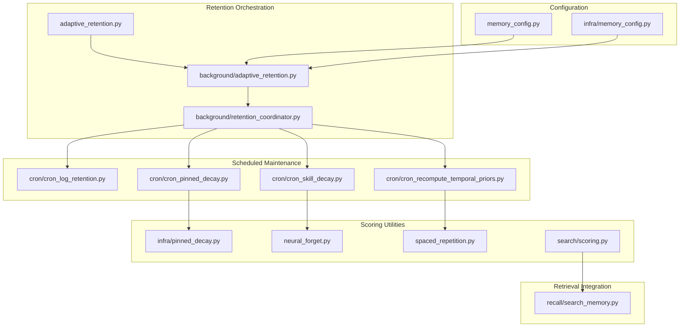
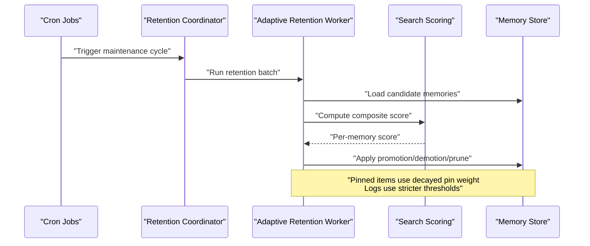
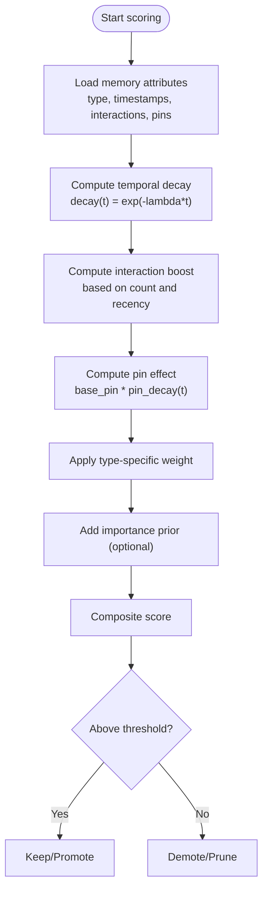
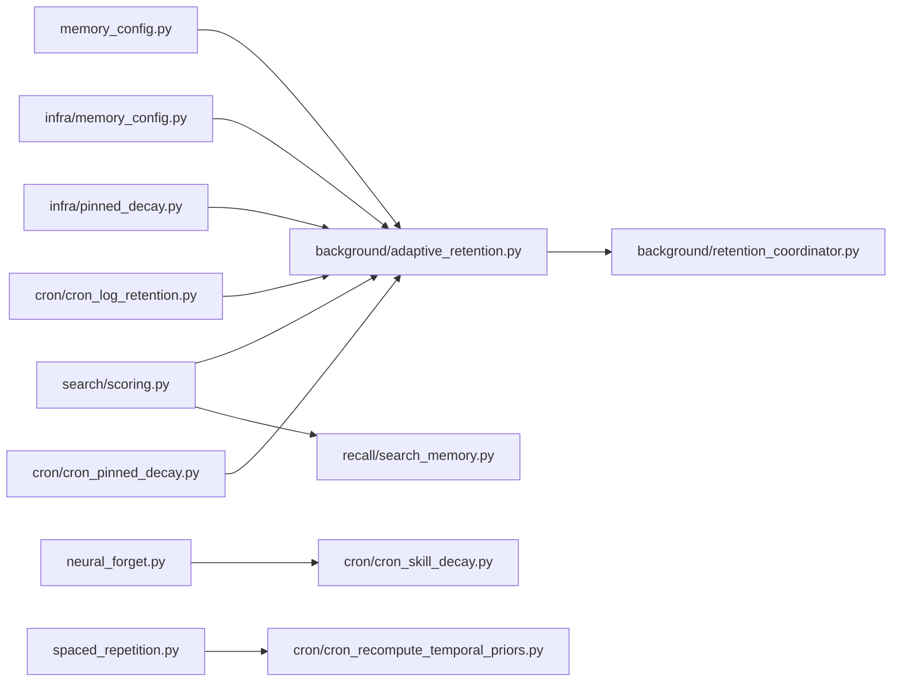

# Retention Algorithms and Scoring

<cite>
**Referenced Files in This Document**
- [adaptive_retention.py](file://adaptive_retention.py)
- [background/adaptive_retention.py](file://background/adaptive_retention.py)
- [background/retention_coordinator.py](file://background/retention_coordinator.py)
- [cron/cron_log_retention.py](file://cron/cron_log_retention.py)
- [cron/cron_pinned_decay.py](file://cron/cron_pinned_decay.py)
- [cron/cron_skill_decay.py](file://cron/cron_skill_decay.py)
- [cron/cron_recompute_temporal_priors.py](file://cron/cron_recompute_temporal_priors.py)
- [infra/pinned_decay.py](file://infra/pinned_decay.py)
- [neural_forget.py](file://neural_forget.py)
- [spaced_repetition.py](file://spaced_repetition.py)
- [search/scoring.py](file://search/scoring.py)
- [recall/search_memory.py](file://recall/search_memory.py)
- [memory_config.py](file://memory_config.py)
- [infra/memory_config.py](file://infra/memory_config.py)
</cite>

## Table of Contents
1. [Introduction](#introduction)
2. [Project Structure](#project-structure)
3. [Core Components](#core-components)
4. [Architecture Overview](#architecture-overview)
5. [Detailed Component Analysis](#detailed-component-analysis)
6. [Dependency Analysis](#dependency-analysis)
7. [Performance Considerations](#performance-considerations)
8. [Troubleshooting Guide](#troubleshooting-guide)
9. [Conclusion](#conclusion)
10. [Appendices](#appendices)

## Introduction
This document explains the retention algorithms and memory scoring mechanisms used to decide which memories to keep, promote, or discard over time. It focuses on how recency, importance, usage frequency, and user-defined pins influence retention priority. It also documents scoring formula components such as temporal decay functions, interaction-based boosting, and manual pinning effects, along with examples of custom scoring algorithms, threshold configurations, and performance tuning parameters. Finally, it clarifies how different memory types (facts, logs, embeddings) receive different retention weights.

## Project Structure
Retention and scoring span several subsystems:
- Adaptive retention orchestrator and background worker
- Cron jobs for scheduled maintenance (log retention, pinned decay, skill decay, temporal priors recomputation)
- Pinned decay utilities
- Neural forgetting model integration
- Spaced repetition scheduling
- Search-time scoring and retrieval hooks
- Configuration for retention policies and thresholds

**Diagram sources**
- [adaptive_retention.py](file://adaptive_retention.py)
- [background/adaptive_retention.py](file://background/adaptive_retention.py)
- [background/retention_coordinator.py](file://background/retention_coordinator.py)
- [cron/cron_log_retention.py](file://cron/cron_log_retention.py)
- [cron/cron_pinned_decay.py](file://cron/cron_pinned_decay.py)
- [cron/cron_skill_decay.py](file://cron/cron_skill_decay.py)
- [cron/cron_recompute_temporal_priors.py](file://cron/cron_recompute_temporal_priors.py)
- [infra/pinned_decay.py](file://infra/pinned_decay.py)
- [neural_forget.py](file://neural_forget.py)
- [spaced_repetition.py](file://spaced_repetition.py)
- [search/scoring.py](file://search/scoring.py)
- [recall/search_memory.py](file://recall/search_memory.py)
- [memory_config.py](file://memory_config.py)
- [infra/memory_config.py](file://infra/memory_config.py)

**Section sources**
- [adaptive_retention.py](file://adaptive_retention.py)
- [background/adaptive_retention.py](file://background/adaptive_retention.py)
- [background/retention_coordinator.py](file://background/retention_coordinator.py)
- [cron/cron_log_retention.py](file://cron/cron_log_retention.py)
- [cron/cron_pinned_decay.py](file://cron/cron_pinned_decay.py)
- [cron/cron_skill_decay.py](file://cron/cron_skill_decay.py)
- [cron/cron_recompute_temporal_priors.py](file://cron/cron_recompute_temporal_priors.py)
- [infra/pinned_decay.py](file://infra/pinned_decay.py)
- [neural_forget.py](file://neural_forget.py)
- [spaced_repetition.py](file://spaced_repetition.py)
- [search/scoring.py](file://search/scoring.py)
- [recall/search_memory.py](file://recall/search_memory.py)
- [memory_config.py](file://memory_config.py)
- [infra/memory_config.py](file://infra/memory_config.py)

## Core Components
- Adaptive retention engine: Computes per-memory scores and decides promotions/demotions/deletions based on configured policies.
- Retention coordinator: Schedules and coordinates background tasks that apply retention actions across memory types.
- Cron-driven maintenance:
  - Log retention: Prunes low-value logs according to thresholds.
  - Pinned decay: Gradually reduces pin strength over time unless refreshed.
  - Skill decay: Adjusts skill-related memories using a neural forget model.
  - Temporal priors recomputation: Updates time-aware priors for facts and other entities.
- Pinned decay utility: Implements exponential decay for pinned items.
- Neural forget model: Learns forgetting curves from interaction data to inform retention.
- Spaced repetition: Schedules review intervals to reinforce important memories.
- Search-time scoring: Applies temporal decay, interaction boosts, and type-specific weights at query time.
- Configuration: Centralized policy definitions for thresholds, half-lives, and type-specific weights.

**Section sources**
- [adaptive_retention.py](file://adaptive_retention.py)
- [background/adaptive_retention.py](file://background/adaptive_retention.py)
- [background/retention_coordinator.py](file://background/retention_coordinator.py)
- [cron/cron_log_retention.py](file://cron/cron_log_retention.py)
- [cron/cron_pinned_decay.py](file://cron/cron_pinned_decay.py)
- [cron/cron_skill_decay.py](file://cron/cron_skill_decay.py)
- [cron/cron_recompute_temporal_priors.py](file://cron/cron_recompute_temporal_priors.py)
- [infra/pinned_decay.py](file://infra/pinned_decay.py)
- [neural_forget.py](file://neural_forget.py)
- [spaced_repetition.py](file://spaced_repetition.py)
- [search/scoring.py](file://search/scoring.py)
- [recall/search_memory.py](file://recall/search_memory.py)
- [memory_config.py](file://memory_config.py)
- [infra/memory_config.py](file://infra/memory_config.py)

## Architecture Overview
The retention system combines offline scoring (batched via cron and background workers) with online adjustments (at search time). Memories are scored using a composite function that includes:
- Recency: Time since last access/update
- Importance: Derived from content quality, entity salience, and domain signals
- Usage frequency: Interaction counts and recency-weighted clicks
- Pins: User-defined anchors that resist decay until explicitly removed or aged out

**Diagram sources**
- [background/retention_coordinator.py](file://background/retention_coordinator.py)
- [background/adaptive_retention.py](file://background/adaptive_retention.py)
- [search/scoring.py](file://search/scoring.py)

## Detailed Component Analysis

### Composite Retention Score Formula
The retention score is a weighted combination of multiple factors:
- Temporal decay: Exponential decay based on time since last interaction or update
- Interaction boost: Increases score for frequently accessed or recently clicked memories
- Pin effect: Adds a persistent anchor; may decay slowly if configured
- Type-specific weight: Different base weights for facts, logs, and embeddings
- Quality/importance prior: Optional learned prior from content features or extraction confidence

Conceptual formula:
- score = w_type * (w_recency * decay(t) + w_interact * boost(interactions) + w_pin * pin_effect) + prior_importance

Where:
- decay(t) = exp(-lambda * t) with lambda derived from half-life
- boost(interactions) = f(count, recency_of_last_use)
- pin_effect = base_pin_weight * pin_decay(t_since_pin)
- w_type depends on memory type (facts > embeddings > logs typically)

[No sources needed since this diagram shows conceptual workflow, not actual code structure]

**Section sources**
- [search/scoring.py](file://search/scoring.py)
- [infra/pinned_decay.py](file://infra/pinned_decay.py)
- [memory_config.py](file://memory_config.py)
- [infra/memory_config.py](file://infra/memory_config.py)

### Temporal Decay Functions
- Half-life parameterization: Each memory type can define a half-life controlling how quickly recency fades.
- Lambda derivation: lambda = ln(2) / half_life
- Application: Applied uniformly to recency component; can be overridden by pinned decay for pinned items.

Typical configuration keys:
- retention.half_life_days.facts
- retention.half_life_days.embeddings
- retention.half_life_days.logs

**Section sources**
- [memory_config.py](file://memory_config.py)
- [infra/memory_config.py](file://infra/memory_config.py)
- [search/scoring.py](file://search/scoring.py)

### Interaction-Based Boosting
- Inputs: click counts, view durations, tool-use associations, cross-session references
- Function: Non-linear mapping from raw counts to normalized boost, capped to prevent dominance
- Recency weighting: Recent interactions contribute more than older ones

Example configuration keys:
- retention.interaction.max_boost
- retention.interaction.recent_window_days
- retention.interaction.count_scale

**Section sources**
- [search/scoring.py](file://search/scoring.py)
- [recall/search_memory.py](file://recall/search_memory.py)

### Manual Pinning Effects
- Pin creation: User marks a memory as pinned; adds a pin timestamp and base pin weight
- Pin decay: Optional slow decay to avoid permanent anchoring
- Override behavior: Pinned items bypass aggressive pruning but still participate in ranking

Configuration keys:
- retention.pin.base_weight
- retention.pin.decay_half_life_days
- retention.pin.min_score_override

**Section sources**
- [infra/pinned_decay.py](file://infra/pinned_decay.py)
- [cron/cron_pinned_decay.py](file://cron/cron_pinned_decay.py)

### Memory Type Weights
- Facts: Higher base weight due to long-term knowledge value
- Embeddings: Moderate weight; useful for semantic recall but less critical than facts
- Logs: Lower base weight; ephemeral operational data pruned aggressively

Configuration keys:
- retention.type_weights.facts
- retention.type_weights.embeddings
- retention.type_weights.logs

**Section sources**
- [memory_config.py](file://memory_config.py)
- [infra/memory_config.py](file://infra/memory_config.py)

### Neural Forgetting Model
- Purpose: Learn forgetting curves from historical interaction patterns
- Inputs: Past access sequences, time deltas, outcome signals
- Outputs: Per-entity or per-type forgetting parameters that refine lambda or boost functions

Integration points:
- Scheduled training job updates model parameters
- Scoring pipeline consumes updated parameters to adjust decay/boost

**Section sources**
- [neural_forget.py](file://neural_forget.py)
- [cron/cron_skill_decay.py](file://cron/cron_skill_decay.py)

### Spaced Repetition Scheduling
- Purpose: Schedule periodic reviews for high-importance memories to reinforce retention
- Interval calculation: Based on ease factor and past success rates
- Integration: Influences future interaction counts and recency when reviewed

**Section sources**
- [spaced_repetition.py](file://spaced_repetition.py)
- [cron/cron_recompute_temporal_priors.py](file://cron/cron_recompute_temporal_priors.py)

### Cron-Driven Maintenance
- Log retention: Prunes logs below quality/frequency thresholds
- Pinned decay: Applies pin aging to reduce strong anchors over time
- Skill decay: Uses neural forget model to demote outdated skills
- Temporal priors: Recomputes time-aware priors for facts and related entities

**Section sources**
- [cron/cron_log_retention.py](file://cron/cron_log_retention.py)
- [cron/cron_pinned_decay.py](file://cron/cron_pinned_decay.py)
- [cron/cron_skill_decay.py](file://cron/cron_skill_decay.py)
- [cron/cron_recompute_temporal_priors.py](file://cron/cron_recompute_temporal_priors.py)

### Adaptive Retention Orchestrator
- Coordinates batches of retention decisions
- Applies promotions, demotions, and deletions based on computed scores
- Ensures idempotency and rollback safety for large-scale operations

**Section sources**
- [adaptive_retention.py](file://adaptive_retention.py)
- [background/adaptive_retention.py](file://background/adaptive_retention.py)
- [background/retention_coordinator.py](file://background/retention_coordinator.py)

## Dependency Analysis
Retention components depend on configuration and scoring utilities. Cron jobs orchestrate maintenance tasks, while the adaptive retention worker applies decisions. Search-time scoring integrates with retrieval to reflect current priorities.

**Diagram sources**
- [memory_config.py](file://memory_config.py)
- [infra/memory_config.py](file://infra/memory_config.py)
- [background/adaptive_retention.py](file://background/adaptive_retention.py)
- [search/scoring.py](file://search/scoring.py)
- [infra/pinned_decay.py](file://infra/pinned_decay.py)
- [neural_forget.py](file://neural_forget.py)
- [cron/cron_skill_decay.py](file://cron/cron_skill_decay.py)
- [spaced_repetition.py](file://spaced_repetition.py)
- [cron/cron_recompute_temporal_priors.py](file://cron/cron_recompute_temporal_priors.py)
- [cron/cron_log_retention.py](file://cron/cron_log_retention.py)
- [cron/cron_pinned_decay.py](file://cron/cron_pinned_decay.py)
- [background/retention_coordinator.py](file://background/retention_coordinator.py)
- [recall/search_memory.py](file://recall/search_memory.py)

**Section sources**
- [background/adaptive_retention.py](file://background/adaptive_retention.py)
- [background/retention_coordinator.py](file://background/retention_coordinator.py)
- [search/scoring.py](file://search/scoring.py)
- [memory_config.py](file://memory_config.py)
- [infra/memory_config.py](file://infra/memory_config.py)

## Performance Considerations
- Batch sizes: Tune batch size for retention worker to balance throughput and memory pressure
- Indexing overhead: Avoid excessive re-indexing during promotions/demotions; prefer incremental updates
- Caching: Cache decay parameters and type weights to reduce repeated computation
- Query-time cost: Cap interaction boost calculations and limit recent window scans
- Concurrency: Use distributed locks around retention coordination to prevent conflicts

[No sources needed since this section provides general guidance]

## Troubleshooting Guide
Common issues and diagnostics:
- Scores not changing: Verify configuration keys for half-life and type weights; ensure cron jobs are running
- Pins not decaying: Check pin decay half-life and whether pins are being refreshed
- Over-pruning logs: Increase log retention thresholds or adjust log-specific weights
- Neural model drift: Re-run training job and validate updated parameters
- Spaced repetition gaps: Confirm interval recomputation and review triggers

Operational checks:
- Inspect cron run logs for errors
- Validate retention coordinator task queue status
- Monitor metrics for retention actions and score distributions

**Section sources**
- [background/retention_coordinator.py](file://background/retention_coordinator.py)
- [cron/cron_log_retention.py](file://cron/cron_log_retention.py)
- [cron/cron_pinned_decay.py](file://cron/cron_pinned_decay.py)
- [cron/cron_skill_decay.py](file://cron/cron_skill_decay.py)
- [cron/cron_recompute_temporal_priors.py](file://cron/cron_recompute_temporal_priors.py)

## Conclusion
Retention prioritizes memories through a composite score combining recency, interaction history, pinning, and type-specific weights. Scheduled maintenance and neural models refine these scores over time, while search-time scoring ensures retrieval reflects current relevance. Proper configuration and monitoring enable balanced retention across facts, embeddings, and logs.

[No sources needed since this section summarizes without analyzing specific files]

## Appendices

### Example Custom Scoring Algorithm
- Add a new feature (e.g., topic stability) to the score
- Integrate into the composite formula with an adjustable weight
- Validate impact via A/B testing on retention metrics

Implementation pointers:
- Extend scoring module with new feature computation
- Update configuration schema to include new weights
- Ensure cron jobs propagate changes to stored scores

**Section sources**
- [search/scoring.py](file://search/scoring.py)
- [memory_config.py](file://memory_config.py)
- [infra/memory_config.py](file://infra/memory_config.py)

### Threshold Configurations
Key configuration areas:
- Half-lives per type
- Interaction boost caps and windows
- Pin base weight and decay
- Type-specific weights
- Pruning thresholds for logs

**Section sources**
- [memory_config.py](file://memory_config.py)
- [infra/memory_config.py](file://infra/memory_config.py)

### Performance Tuning Parameters
- Batch size for retention worker
- Max concurrent tasks in coordinator
- Cache TTL for decay parameters
- Query-time limits for interaction boost computation

**Section sources**
- [background/adaptive_retention.py](file://background/adaptive_retention.py)
- [background/retention_coordinator.py](file://background/retention_coordinator.py)
- [search/scoring.py](file://search/scoring.py)