# Storage Optimization and Compression

<cite>
**Referenced Files in This Document**
- [vector_store.py](file://vector_store.py)
- [infra/vector_store.py](file://infra/vector_store.py)
- [search/chunk_index.py](file://search/chunk_index.py)
- [cron/cron_compact.py](file://cron/cron_compact.py)
- [cron/cron_tier_migration.py](file://cron/cron_tier_migration.py)
- [tier_migration.py](file://tier_migration.py)
- [save/pipeline.py](file://save/pipeline.py)
- [save/indexers.py](file://save/indexers.py)
- [embedding_recompute.py](file://embedding_recompute.py)
- [infra/embedding_search.py](file://infra/embedding_search.py)
- [search/colbert_index.py](file://search/colbert_index.py)
- [search/splade_index.py](file://search/splade_index.py)
- [migrations/024_chunk_embeddings.sql](file://migrations/024_chunk_embeddings.sql)
- [migrations/058_colbert_tokens.sql](file://migrations/058_colbert_tokens.sql)
- [migrations/059_splade_index.sql](file://migrations/059_splade_index.sql)
- [eval/benchmarks/bench_save.py](file://eval/benchmarks/bench_save.py)
- [eval/benchmarks/bench_search.py](file://eval/benchmarks/bench_search.py)
- [eval/retrieval_benchmark.py](file://eval/retrieval_benchmark.py)
- [eval/perf_envelope.py](file://eval/perf_envelope.py)
- [eval/perf_envelope_v3.py](file://eval/perf_envelope_v3.py)
- [docs/guides/performance-benchmarks.md](file://docs/guides/performance-benchmarks.md)
- [docs/concepts/tier-system.md](file://docs/concepts/tier-system.md)
</cite>

## Table of Contents
1. [Introduction](#introduction)
2. [Project Structure](#project-structure)
3. [Core Components](#core-components)
4. [Architecture Overview](#architecture-overview)
5. [Detailed Component Analysis](#detailed-component-analysis)
6. [Dependency Analysis](#dependency-analysis)
7. [Performance Considerations](#performance-considerations)
8. [Troubleshooting Guide](#troubleshooting-guide)
9. [Conclusion](#conclusion)
10. [Appendices](#appendices)

## Introduction
This document explains storage optimization techniques and compression strategies implemented across the system, focusing on how memory data is compressed, deduplicated, and optimized for storage efficiency. It covers vector embedding compression methods, text chunking strategies, metadata optimization, space reclamation procedures, defragmentation processes, and storage tier migration. The document also includes performance benchmarks, storage cost analysis, and capacity planning guidelines to help operators size and tune their deployments effectively.

## Project Structure
The storage optimization features are distributed across several modules:
- Vector store abstraction and implementations
- Chunk indexing and embedding pipelines
- Maintenance and compaction jobs
- Tiered storage migration
- Benchmarks and performance envelopes

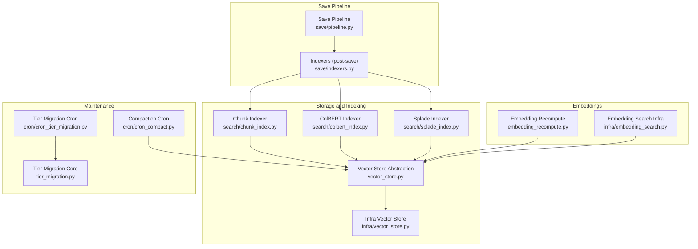

**Diagram sources**
- [vector_store.py:1-200](file://vector_store.py#L1-L200)
- [infra/vector_store.py:1-200](file://infra/vector_store.py#L1-L200)
- [search/chunk_index.py:1-200](file://search/chunk_index.py#L1-L200)
- [search/colbert_index.py:1-200](file://search/colbert_index.py#L1-L200)
- [search/splade_index.py:1-200](file://search/splade_index.py#L1-L200)
- [save/pipeline.py:1-200](file://save/pipeline.py#L1-L200)
- [save/indexers.py:1-200](file://save/indexers.py#L1-L200)
- [cron/cron_compact.py:1-200](file://cron/cron_compact.py#L1-L200)
- [cron/cron_tier_migration.py:1-200](file://cron/cron_tier_migration.py#L1-L200)
- [tier_migration.py:1-200](file://tier_migration.py#L1-L200)
- [embedding_recompute.py:1-200](file://embedding_recompute.py#L1-L200)
- [infra/embedding_search.py:1-200](file://infra/embedding_search.py#L1-L200)

**Section sources**
- [vector_store.py:1-200](file://vector_store.py#L1-L200)
- [infra/vector_store.py:1-200](file://infra/vector_store.py#L1-L200)
- [search/chunk_index.py:1-200](file://search/chunk_index.py#L1-L200)
- [search/colbert_index.py:1-200](file://search/colbert_index.py#L1-L200)
- [search/splade_index.py:1-200](file://search/splade_index.py#L1-L200)
- [save/pipeline.py:1-200](file://save/pipeline.py#L1-L200)
- [save/indexers.py:1-200](file://save/indexers.py#L1-L200)
- [cron/cron_compact.py:1-200](file://cron/cron_compact.py#L1-L200)
- [cron/cron_tier_migration.py:1-200](file://cron/cron_tier_migration.py#L1-L200)
- [tier_migration.py:1-200](file://tier_migration.py#L1-L200)
- [embedding_recompute.py:1-200](file://embedding_recompute.py#L1-L200)
- [infra/embedding_search.py:1-200](file://infra/embedding_search.py#L1-L200)

## Core Components
- Vector store abstraction: Provides a unified interface for storing and retrieving dense vectors, with pluggable backends and optional compression or quantization hooks.
- Chunk indexers: Transform raw text into chunks and compute embeddings; support multiple encoders (dense, ColBERT tokens, Splade sparse).
- Save pipeline and post-save indexers: Orchestrate persistence, deduplication, and index updates after writes.
- Compaction and maintenance: Periodic tasks that reclaim space, compact indexes, and optimize storage layout.
- Tier migration: Moves cold or low-value data to cheaper storage tiers based on policies.
- Embedding recomputation: Re-encodes embeddings when models change or compression parameters evolve.

Key responsibilities:
- Compress and deduplicate embeddings and related metadata
- Optimize chunking and indexing for retrieval quality vs. storage cost
- Provide safe, idempotent maintenance operations
- Expose metrics and diagnostics for capacity planning

**Section sources**
- [vector_store.py:1-200](file://vector_store.py#L1-L200)
- [infra/vector_store.py:1-200](file://infra/vector_store.py#L1-L200)
- [search/chunk_index.py:1-200](file://search/chunk_index.py#L1-L200)
- [search/colbert_index.py:1-200](file://search/colbert_index.py#L1-L200)
- [search/splade_index.py:1-200](file://search/splade_index.py#L1-L200)
- [save/pipeline.py:1-200](file://save/pipeline.py#L1-L200)
- [save/indexers.py:1-200](file://save/indexers.py#L1-L200)
- [cron/cron_compact.py:1-200](file://cron/cron_compact.py#L1-L200)
- [cron/cron_tier_migration.py:1-200](file://cron/cron_tier_migration.py#L1-L200)
- [tier_migration.py:1-200](file://tier_migration.py#L1-L200)
- [embedding_recompute.py:1-200](file://embedding_recompute.py#L1-L200)
- [infra/embedding_search.py:1-200](file://infra/embedding_search.py#L1-L200)

## Architecture Overview
The storage optimization architecture centers on a vector store abstraction layered over concrete backends. The save pipeline computes and persists embeddings and auxiliary indexes (chunk-level, ColBERT tokens, Splade sparse), while maintenance jobs periodically compact and migrate data to reduce storage costs.

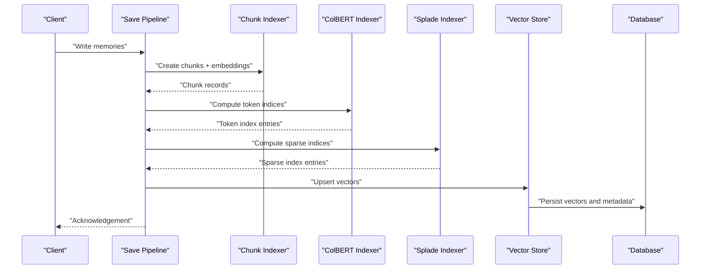

**Diagram sources**
- [save/pipeline.py:1-200](file://save/pipeline.py#L1-L200)
- [search/chunk_index.py:1-200](file://search/chunk_index.py#L1-L200)
- [search/colbert_index.py:1-200](file://search/colbert_index.py#L1-L200)
- [search/splade_index.py:1-200](file://search/splade_index.py#L1-L200)
- [vector_store.py:1-200](file://vector_store.py#L1-L200)
- [infra/vector_store.py:1-200](file://infra/vector_store.py#L1-L200)

## Detailed Component Analysis

### Vector Store Abstraction and Backends
The vector store provides a consistent API for upserting, querying, and managing vector data. Implementations may apply compression, quantization, or other optimizations transparently.

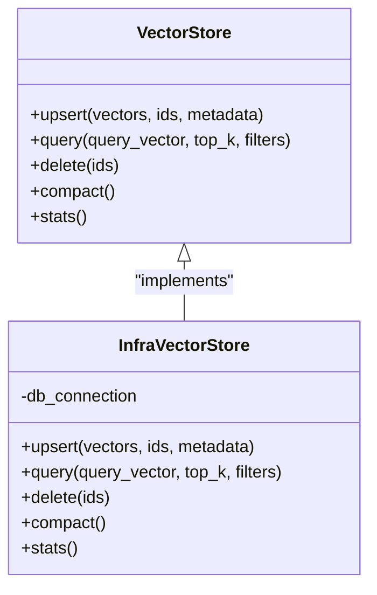

**Diagram sources**
- [vector_store.py:1-200](file://vector_store.py#L1-L200)
- [infra/vector_store.py:1-200](file://infra/vector_store.py#L1-L200)

Optimization highlights:
- Batched upserts and deletes to minimize round-trips
- Optional compression/quantization hooks within the backend
- Metadata minimization and selective persistence

**Section sources**
- [vector_store.py:1-200](file://vector_store.py#L1-L200)
- [infra/vector_store.py:1-200](file://infra/vector_store.py#L1-L200)

### Text Chunking and Embedding Strategies
Chunking transforms long documents into manageable segments for indexing and retrieval. The chunk indexer computes embeddings per chunk and stores them alongside lightweight metadata.

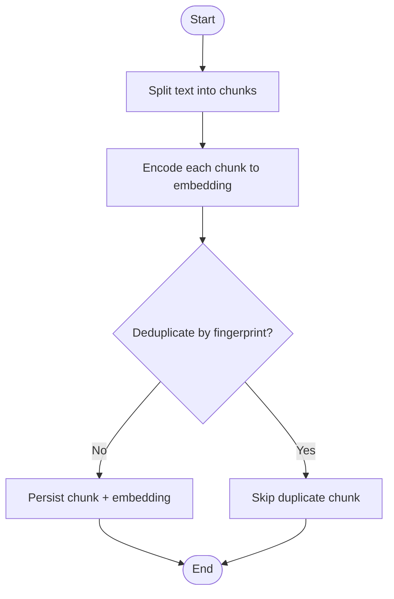

**Diagram sources**
- [search/chunk_index.py:1-200](file://search/chunk_index.py#L1-L200)
- [migrations/024_chunk_embeddings.sql:1-200](file://migrations/024_chunk_embeddings.sql#L1-L200)

Compression and deduplication:
- Fingerprint-based deduplication avoids redundant embeddings
- Selective metadata fields reduce row sizes
- Chunk boundaries tuned to balance recall and storage footprint

**Section sources**
- [search/chunk_index.py:1-200](file://search/chunk_index.py#L1-L200)
- [migrations/024_chunk_embeddings.sql:1-200](file://migrations/024_chunk_embeddings.sql#L1-L200)

### ColBERT Token Indexing
ColBERT token indexing captures fine-grained token relevance signals. The indexer produces token-level indices stored alongside embeddings.

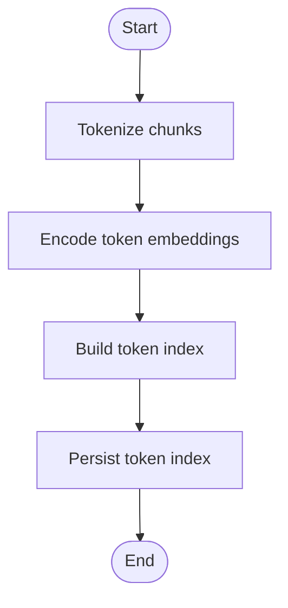

**Diagram sources**
- [search/colbert_index.py:1-200](file://search/colbert_index.py#L1-L200)
- [migrations/058_colbert_tokens.sql:1-200](file://migrations/058_colbert_tokens.sql#L1-L200)

Space considerations:
- Token indices can be large; consider pruning rare tokens and limiting context windows
- Use batched writes and periodic compaction to maintain efficiency

**Section sources**
- [search/colbert_index.py:1-200](file://search/colbert_index.py#L1-L200)
- [migrations/058_colbert_tokens.sql:1-200](file://migrations/058_colbert_tokens.sql#L1-L200)

### Splade Sparse Indexing
Splade generates sparse representations for efficient lexical matching. The indexer builds and persists sparse vectors aligned with vocabulary terms.

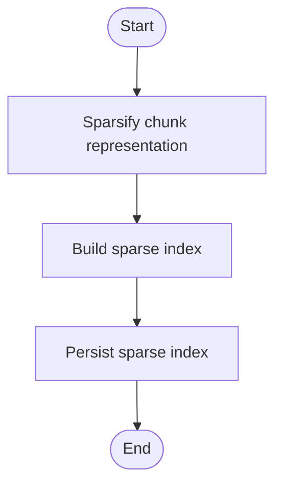

**Diagram sources**
- [search/splade_index.py:1-200](file://search/splade_index.py#L1-L200)
- [migrations/059_splade_index.sql:1-200](file://migrations/059_splade_index.sql#L1-L200)

Optimization notes:
- Prune low-weight terms to reduce index size
- Combine with dense embeddings for hybrid search with controlled overhead

**Section sources**
- [search/splade_index.py:1-200](file://search/splade_index.py#L1-L200)
- [migrations/059_splade_index.sql:1-200](file://migrations/059_splade_index.sql#L1-L200)

### Save Pipeline and Post-Save Indexers
The save pipeline orchestrates writing memories, computing indexes, and updating vector stores. Post-save indexers ensure consistency between primary data and derived indexes.

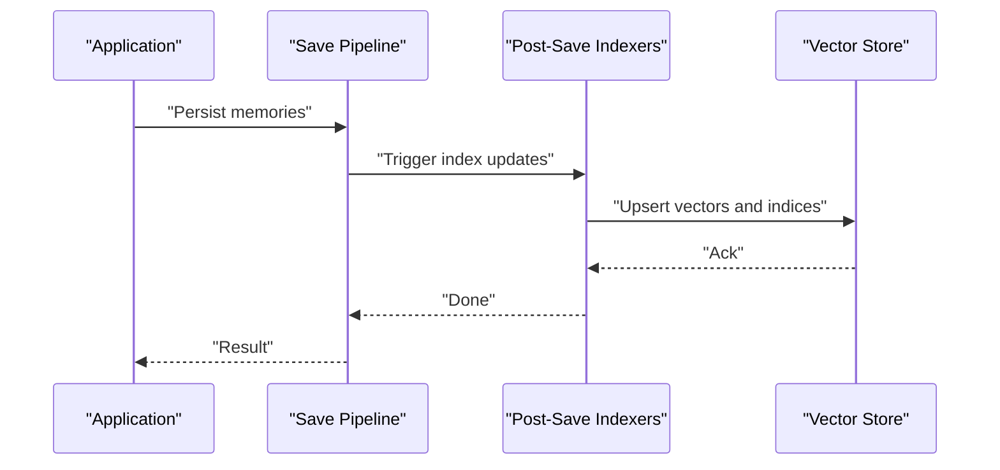

**Diagram sources**
- [save/pipeline.py:1-200](file://save/pipeline.py#L1-L200)
- [save/indexers.py:1-200](file://save/indexers.py#L1-L200)
- [vector_store.py:1-200](file://vector_store.py#L1-L200)

**Section sources**
- [save/pipeline.py:1-200](file://save/pipeline.py#L1-L200)
- [save/indexers.py:1-200](file://save/indexers.py#L1-L200)
- [vector_store.py:1-200](file://vector_store.py#L1-L200)

### Space Reclamation and Defragmentation
Compaction jobs reclaim space by removing obsolete records, merging fragmented pages, and optimizing storage layouts. These operations are designed to be safe and idempotent.

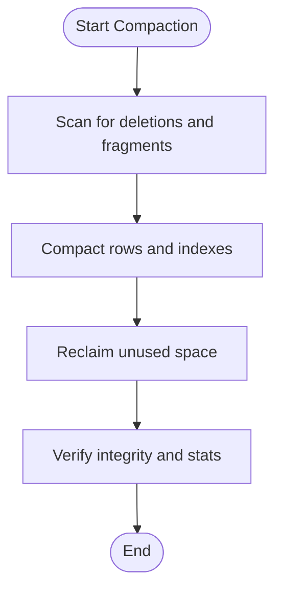

**Diagram sources**
- [cron/cron_compact.py:1-200](file://cron/cron_compact.py#L1-L200)
- [vector_store.py:1-200](file://vector_store.py#L1-L200)

Operational guidance:
- Schedule compaction during off-peak hours
- Monitor throughput and latency impact; adjust concurrency and batch sizes

**Section sources**
- [cron/cron_compact.py:1-200](file://cron/cron_compact.py#L1-L200)
- [vector_store.py:1-200](file://vector_store.py#L1-L200)

### Storage Tier Migration
Tier migration moves cold or low-priority data to cheaper storage tiers based on configurable policies. This reduces ongoing storage costs while preserving access semantics.

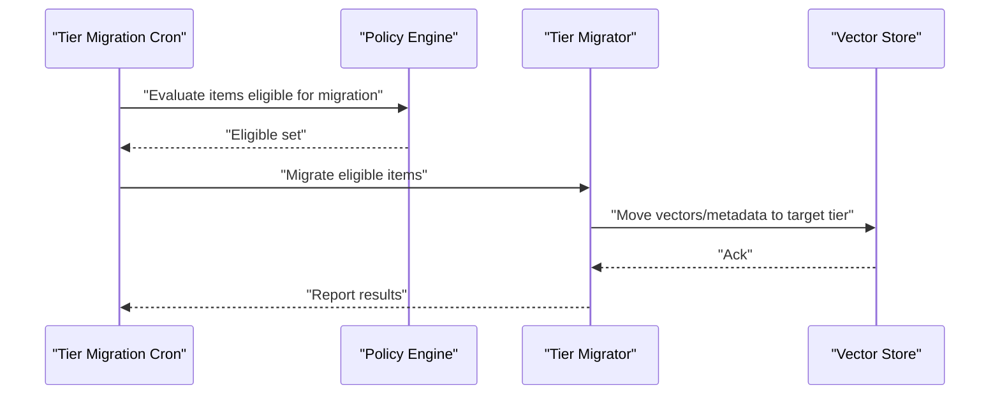

**Diagram sources**
- [cron/cron_tier_migration.py:1-200](file://cron/cron_tier_migration.py#L1-L200)
- [tier_migration.py:1-200](file://tier_migration.py#L1-L200)
- [vector_store.py:1-200](file://vector_store.py#L1-L200)

Policy considerations:
- Age thresholds, access frequency, and retention rules
- Cost-per-tier and performance SLAs

**Section sources**
- [cron/cron_tier_migration.py:1-200](file://cron/cron_tier_migration.py#L1-L200)
- [tier_migration.py:1-200](file://tier_migration.py#L1-L200)
- [docs/concepts/tier-system.md:1-200](file://docs/concepts/tier-system.md#L1-L200)

### Embedding Recomputation and Model Drift Handling
When embedding models or compression parameters change, the system can recompute embeddings to maintain accuracy and storage efficiency.

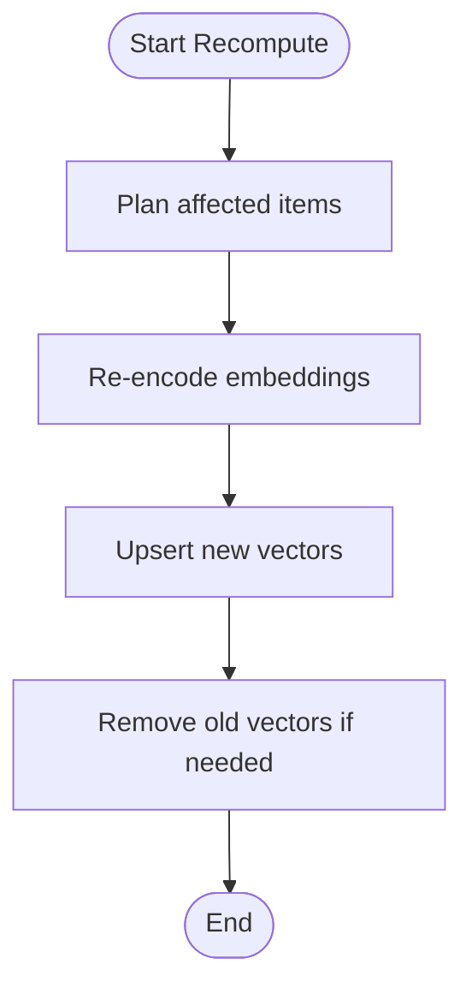

**Diagram sources**
- [embedding_recompute.py:1-200](file://embedding_recompute.py#L1-L200)
- [infra/embedding_search.py:1-200](file://infra/embedding_search.py#L1-L200)

Best practices:
- Run recompute in batches with backpressure controls
- Validate quality before promoting new embeddings

**Section sources**
- [embedding_recompute.py:1-200](file://embedding_recompute.py#L1-L200)
- [infra/embedding_search.py:1-200](file://infra/embedding_search.py#L1-L200)

## Dependency Analysis
The following diagram shows key dependencies among storage and optimization components.

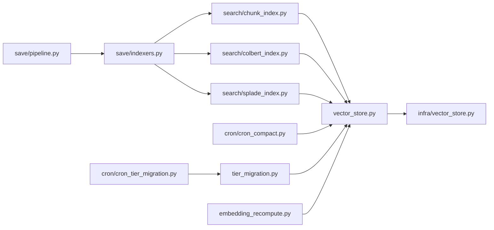

**Diagram sources**
- [save/pipeline.py:1-200](file://save/pipeline.py#L1-L200)
- [save/indexers.py:1-200](file://save/indexers.py#L1-L200)
- [search/chunk_index.py:1-200](file://search/chunk_index.py#L1-L200)
- [search/colbert_index.py:1-200](file://search/colbert_index.py#L1-L200)
- [search/splade_index.py:1-200](file://search/splade_index.py#L1-L200)
- [vector_store.py:1-200](file://vector_store.py#L1-L200)
- [infra/vector_store.py:1-200](file://infra/vector_store.py#L1-L200)
- [cron/cron_compact.py:1-200](file://cron/cron_compact.py#L1-L200)
- [cron/cron_tier_migration.py:1-200](file://cron/cron_tier_migration.py#L1-L200)
- [tier_migration.py:1-200](file://tier_migration.py#L1-L200)
- [embedding_recompute.py:1-200](file://embedding_recompute.py#L1-L200)

**Section sources**
- [save/pipeline.py:1-200](file://save/pipeline.py#L1-L200)
- [save/indexers.py:1-200](file://save/indexers.py#L1-L200)
- [search/chunk_index.py:1-200](file://search/chunk_index.py#L1-L200)
- [search/colbert_index.py:1-200](file://search/colbert_index.py#L1-L200)
- [search/splade_index.py:1-200](file://search/splade_index.py#L1-L200)
- [vector_store.py:1-200](file://vector_store.py#L1-L200)
- [infra/vector_store.py:1-200](file://infra/vector_store.py#L1-L200)
- [cron/cron_compact.py:1-200](file://cron/cron_compact.py#L1-L200)
- [cron/cron_tier_migration.py:1-200](file://cron/cron_tier_migration.py#L1-L200)
- [tier_migration.py:1-200](file://tier_migration.py#L1-L200)
- [embedding_recompute.py:1-200](file://embedding_recompute.py#L1-L200)

## Performance Considerations
- Throughput and latency:
  - Batch upserts and deletes to reduce overhead
  - Tune concurrency limits for indexers and vector store writes
  - Schedule heavy maintenance (compaction, recompute) during off-peak periods
- Storage efficiency:
  - Enable deduplication at chunk level to avoid redundant embeddings
  - Prune low-signal tokens in ColBERT and Splade indices
  - Minimize metadata fields and use selective persistence
- Retrieval quality vs. cost:
  - Hybrid search (dense + sparse + token) improves recall but increases storage
  - Adjust chunk sizes and overlap to balance precision and footprint
- Monitoring:
  - Track vector counts, index sizes, and compaction gains
  - Observe tier migration savings and access patterns

[No sources needed since this section provides general guidance]

## Troubleshooting Guide
Common issues and resolutions:
- High write latency:
  - Reduce batch sizes or increase concurrency cautiously
  - Check for lock contention in vector store writes
- Storage growth without benefit:
  - Review chunking strategy and deduplication settings
  - Inspect token and sparse index cardinality; prune aggressively
- Compaction not reclaiming space:
  - Ensure compaction job runs successfully and verify stats
  - Confirm no active transactions hold references to deleted rows
- Tier migration stalls:
  - Validate policy eligibility and target tier availability
  - Monitor error rates and retry/backoff behavior

**Section sources**
- [cron/cron_compact.py:1-200](file://cron/cron_compact.py#L1-L200)
- [cron/cron_tier_migration.py:1-200](file://cron/cron_tier_migration.py#L1-L200)
- [vector_store.py:1-200](file://vector_store.py#L1-L200)

## Conclusion
The system implements a comprehensive suite of storage optimization techniques: chunk-level deduplication, multi-index strategies (dense, ColBERT tokens, Splade sparse), compaction for space reclamation, and tier migration for cost control. By tuning chunking, pruning indices, and scheduling maintenance appropriately, operators can achieve significant storage savings while maintaining retrieval quality. Continuous monitoring and benchmarking are essential to validate trade-offs and plan capacity.

[No sources needed since this section summarizes without analyzing specific files]

## Appendices

### Performance Benchmarks and Capacity Planning
- Benchmarks:
  - Write throughput and latency under various batch sizes
  - Search latency and recall across different index combinations
  - Compaction and tier migration impact on storage and performance
- Capacity planning:
  - Estimate storage per memory item (embeddings + indices + metadata)
  - Factor in deduplication ratios and index pruning effectiveness
  - Model tier mix based on access patterns and cost targets

**Section sources**
- [eval/benchmarks/bench_save.py:1-200](file://eval/benchmarks/bench_save.py#L1-L200)
- [eval/benchmarks/bench_search.py:1-200](file://eval/benchmarks/bench_search.py#L1-L200)
- [eval/retrieval_benchmark.py:1-200](file://eval/retrieval_benchmark.py#L1-L200)
- [eval/perf_envelope.py:1-200](file://eval/perf_envelope.py#L1-L200)
- [eval/perf_envelope_v3.py:1-200](file://eval/perf_envelope_v3.py#L1-L200)
- [docs/guides/performance-benchmarks.md:1-200](file://docs/guides/performance-benchmarks.md#L1-L200)