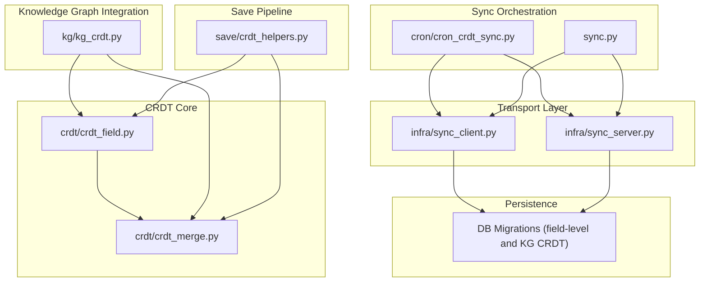
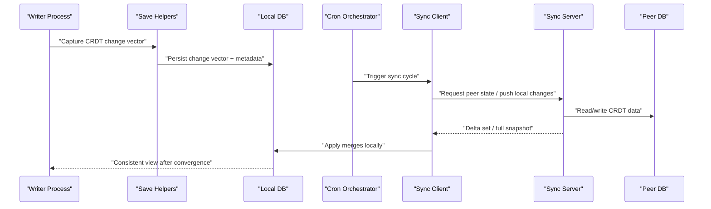
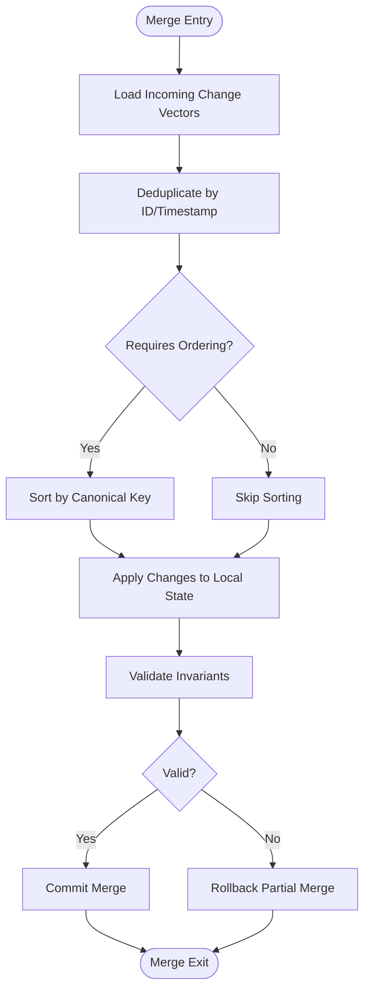
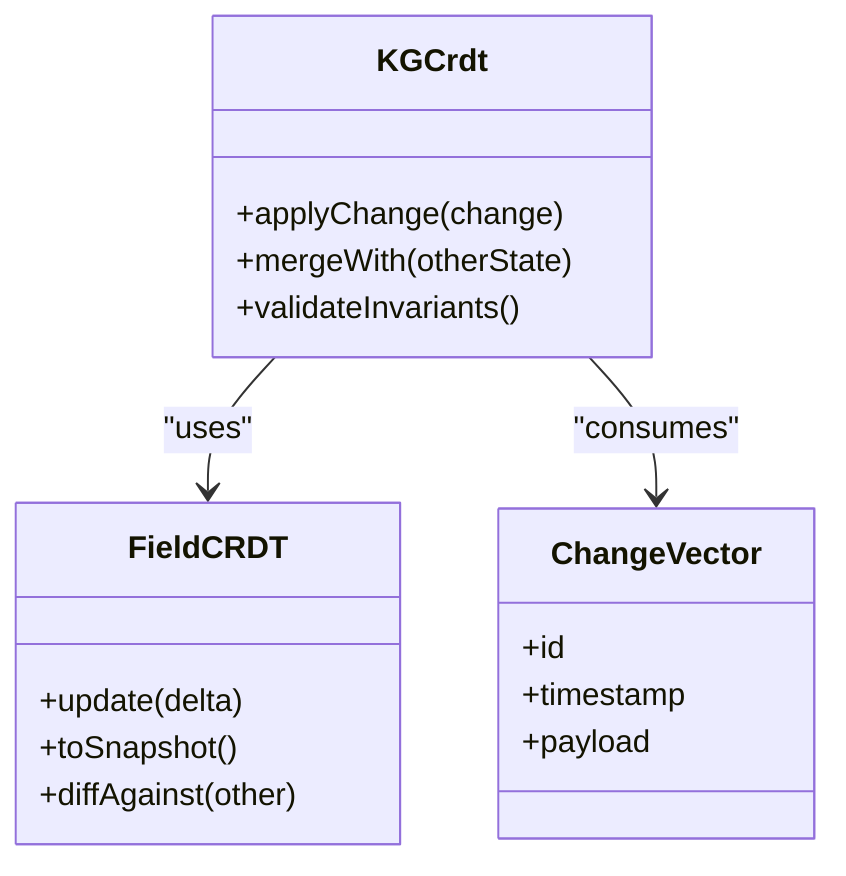
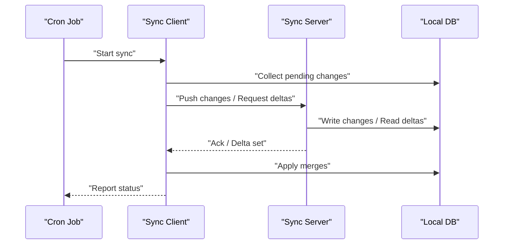
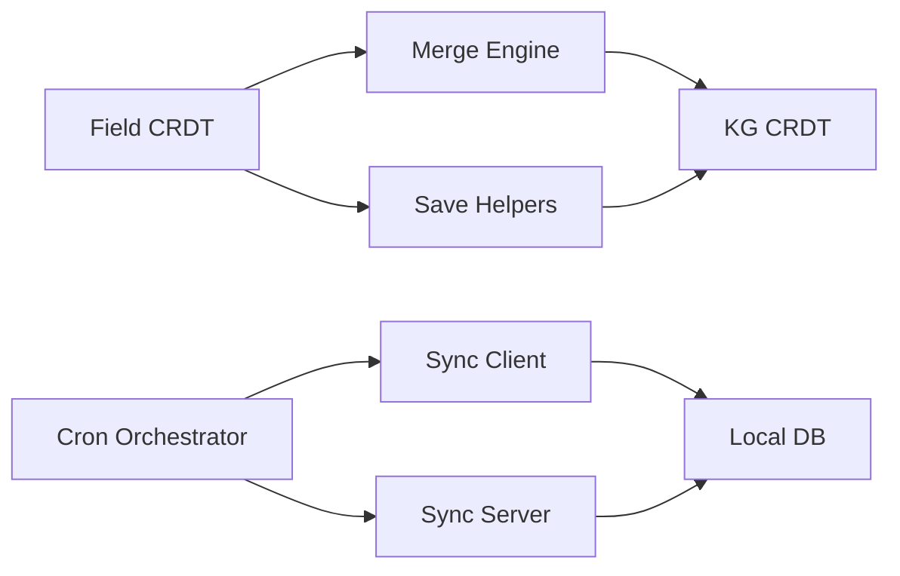

# CRDT-Based Synchronization

<cite>
**Referenced Files in This Document**
- [crdt/crdt_field.py](file://crdt/crdt_field.py)
- [crdt/crdt_merge.py](file://crdt/crdt_merge.py)
- [kg/kg_crdt.py](file://kg/kg_crdt.py)
- [save/crdt_helpers.py](file://save/crdt_helpers.py)
- [cron/cron_crdt_sync.py](file://cron/cron_crdt_sync.py)
- [infra/sync_client.py](file://infra/sync_client.py)
- [infra/sync_server.py](file://infra/sync_server.py)
- [sync.py](file://sync.py)
- [migrations/013_field_level_crdt.sql](file://migrations/013_field_level_crdt.sql)
- [migrations/021_kg_crdt.sql](file://migrations/021_kg_crdt.sql)
- [migrations/051_field_crdt_tenant_id.sql](file://migrations/051_field_crdt_tenant_id.sql)
- [migrations/055_kg_crdt_tenant_id.sql](file://migrations/055_kg_crdt_tenant_id.sql)
- [migrations/065_kg_crdt_append_only.sql](file://migrations/065_kg_crdt_append_only.sql)
- [migrations/073_kg_crdt_redirect_writes_to_append_tables.sql](file://migrations/073_kg_crdt_redirect_writes_to_append_tables.sql)
- [test/test_crdt_field.py](file://test/test_crdt_field.py)
- [test/test_crdt_merge.py](file://test/test_crdt_merge.py)
- [test/test_crdt_integration.py](file://test/test_crdt_integration.py)
- [test/test_crdt_sync.py](file://test/test_crdt_sync.py)
</cite>

## Table of Contents
1. [Introduction](#introduction)
2. [Project Structure](#project-structure)
3. [Core Components](#core-components)
4. [Architecture Overview](#architecture-overview)
5. [Detailed Component Analysis](#detailed-component-analysis)
6. [Dependency Analysis](#dependency-analysis)
7. [Performance Considerations](#performance-considerations)
8. [Troubleshooting Guide](#troubleshooting-guide)
9. [Conclusion](#conclusion)
10. [Appendices](#appendices)

## Introduction
This document explains the Conflict-Free Replicated Data Types (CRDT) synchronization system used by the memory subsystem. It covers theoretical foundations, implementation details, merge algorithms, conflict resolution strategies, consistency guarantees, sync protocol and message formats, network communication patterns, examples for custom CRDT fields, debugging techniques, and performance optimization guidance. The system provides eventual consistency with partition tolerance and robust recovery from network failures.

## Project Structure
The CRDT feature spans several modules:
- Field-level CRDT primitives and merge logic
- Knowledge graph CRDT integration
- Save-time helpers to capture field deltas
- Cron job to orchestrate periodic synchronization
- Sync client/server for transport and persistence
- Database migrations for CRDT storage schemas

**Diagram sources**
- [crdt/crdt_field.py](file://crdt/crdt_field.py)
- [crdt/crdt_merge.py](file://crdt/crdt_merge.py)
- [kg/kg_crdt.py](file://kg/kg_crdt.py)
- [save/crdt_helpers.py](file://save/crdt_helpers.py)
- [cron/cron_crdt_sync.py](file://cron/cron_crdt_sync.py)
- [sync.py](file://sync.py)
- [infra/sync_client.py](file://infra/sync_client.py)
- [infra/sync_server.py](file://infra/sync_server.py)
- [migrations/013_field_level_crdt.sql](file://migrations/013_field_level_crdt.sql)
- [migrations/021_kg_crdt.sql](file://migrations/021_kg_crdt.sql)
- [migrations/051_field_crdt_tenant_id.sql](file://migrations/051_field_crdt_tenant_id.sql)
- [migrations/055_kg_crdt_tenant_id.sql](file://migrations/055_kg_crdt_tenant_id.sql)
- [migrations/065_kg_crdt_append_only.sql](file://migrations/065_kg_crdt_append_only.sql)
- [migrations/073_kg_crdt_redirect_writes_to_append_tables.sql](file://migrations/073_kg_crdt_redirect_writes_to_append_tables.sql)

**Section sources**
- [crdt/crdt_field.py](file://crdt/crdt_field.py)
- [crdt/crdt_merge.py](file://crdt/crdt_merge.py)
- [kg/kg_crdt.py](file://kg/kg_crdt.py)
- [save/crdt_helpers.py](file://save/crdt_helpers.py)
- [cron/cron_crdt_sync.py](file://cron/cron_crdt_sync.py)
- [sync.py](file://sync.py)
- [infra/sync_client.py](file://infra/sync_client.py)
- [infra/sync_server.py](file://infra/sync_server.py)
- [migrations/013_field_level_crdt.sql](file://migrations/013_field_level_crdt.sql)
- [migrations/021_kg_crdt.sql](file://migrations/021_kg_crdt.sql)
- [migrations/051_field_crdt_tenant_id.sql](file://migrations/051_field_crdt_tenant_id.sql)
- [migrations/055_kg_crdt_tenant_id.sql](file://migrations/055_kg_crdt_tenant_id.sql)
- [migrations/065_kg_crdt_append_only.sql](file://migrations/065_kg_crdt_append_only.sql)
- [migrations/073_kg_crdt_redirect_writes_to_append_tables.sql](file://migrations/073_kg_crdt_redirect_writes_to_append_tables.sql)

## Core Components
- Field-level CRDT primitives: Provide commutative, associative, idempotent operations for safe concurrent updates. Examples include counters, sets, maps, and text diffs.
- Merge engine: Applies incoming CRDT changes deterministically to local state, ensuring convergence regardless of order or duplication.
- Knowledge graph CRDT integration: Extends CRDT semantics to graph entities and relationships, preserving structural invariants during merges.
- Save-time helpers: Capture minimal change vectors at write time and attach metadata required for CRDT merging.
- Sync orchestration: Periodic jobs that collect pending changes, exchange them with peers, and apply merges.
- Transport layer: Client and server components implementing the sync protocol, including message framing, retries, and backoff.

Key responsibilities:
- Deterministic merge semantics
- Idempotency across retransmissions
- Partition-tolerant operation
- Tenant-scoped isolation where applicable

**Section sources**
- [crdt/crdt_field.py](file://crdt/crdt_field.py)
- [crdt/crdt_merge.py](file://crdt/crdt_merge.py)
- [kg/kg_crdt.py](file://kg/kg_crdt.py)
- [save/crdt_helpers.py](file://save/crdt_helpers.py)
- [cron/cron_crdt_sync.py](file://cron/cron_crdt_sync.py)
- [infra/sync_client.py](file://infra/sync_client.py)
- [infra/sync_server.py](file://infra/sync_server.py)

## Architecture Overview
The CRDT synchronization architecture separates concerns into primitives, merge logic, integration points, and transport.

**Diagram sources**
- [save/crdt_helpers.py](file://save/crdt_helpers.py)
- [cron/cron_crdt_sync.py](file://cron/cron_crdt_sync.py)
- [infra/sync_client.py](file://infra/sync_client.py)
- [infra/sync_server.py](file://infra/sync_server.py)
- [migrations/013_field_level_crdt.sql](file://migrations/013_field_level_crdt.sql)
- [migrations/021_kg_crdt.sql](file://migrations/021_kg_crdt.sql)

## Detailed Component Analysis

### Field-Level CRDT Primitives
Field-level CRDTs define the building blocks for conflict-free updates. They implement:
- Commutativity: Order of application does not affect final state
- Associativity: Grouping of applications does not affect final state
- Idempotency: Reapplying the same update has no additional effect

Typical primitives include:
- Counters with increment/decrement
- Sets with add/remove
- Maps with key-value updates
- Textual diff structures supporting concurrent edits

These primitives are designed to be serialized and transmitted efficiently over the network.

**Section sources**
- [crdt/crdt_field.py](file://crdt/crdt_field.py)

### Merge Engine
The merge engine applies a batch of change vectors to local state. Its core properties:
- Deterministic: Same inputs produce the same output
- Convergent: All replicas converge to the same state given the same set of changes
- Safe: Preserves invariants defined by each CRDT type

The merge process typically:
- Deduplicates incoming changes using identifiers or timestamps
- Applies changes in a canonical order when necessary
- Validates invariants post-merge and rolls back partial merges if needed

**Diagram sources**
- [crdt/crdt_merge.py](file://crdt/crdt_merge.py)

**Section sources**
- [crdt/crdt_merge.py](file://crdt/crdt_merge.py)

### Knowledge Graph CRDT Integration
The knowledge graph extends CRDT semantics to nodes and edges:
- Entities and relationships are represented as CRDT-backed records
- Structural constraints are enforced during merge
- Append-only logs ensure durability and auditability

Migrations introduce dedicated tables for CRDT data and tenant scoping.

**Diagram sources**
- [kg/kg_crdt.py](file://kg/kg_crdt.py)
- [crdt/crdt_field.py](file://crdt/crdt_field.py)
- [migrations/021_kg_crdt.sql](file://migrations/021_kg_crdt.sql)
- [migrations/055_kg_crdt_tenant_id.sql](file://migrations/055_kg_crdt_tenant_id.sql)
- [migrations/065_kg_crdt_append_only.sql](file://migrations/065_kg_crdt_append_only.sql)
- [migrations/073_kg_crdt_redirect_writes_to_append_tables.sql](file://migrations/073_kg_crdt_redirect_writes_to_append_tables.sql)

**Section sources**
- [kg/kg_crdt.py](file://kg/kg_crdt.py)
- [migrations/021_kg_crdt.sql](file://migrations/021_kg_crdt.sql)
- [migrations/055_kg_crdt_tenant_id.sql](file://migrations/055_kg_crdt_tenant_id.sql)
- [migrations/065_kg_crdt_append_only.sql](file://migrations/065_kg_crdt_append_only.sql)
- [migrations/073_kg_crdt_redirect_writes_to_append_tables.sql](file://migrations/073_kg_crdt_redirect_writes_to_append_tables.sql)

### Save-Time Helpers
At write time, the save pipeline captures minimal change vectors and attaches metadata such as IDs and timestamps. This enables efficient delta transmission and deterministic merging on peers.

Responsibilities:
- Compute deltas between old and new field states
- Generate stable change identifiers
- Persist change vectors alongside primary records

**Section sources**
- [save/crdt_helpers.py](file://save/crdt_helpers.py)

### Sync Orchestration and Protocol
The cron orchestrator triggers sync cycles, while the client and server implement the transport protocol.

Message format considerations:
- Change vector envelope with ID, timestamp, payload
- Batch envelopes for efficiency
- Acknowledgement messages with applied ranges
- Error codes for malformed or conflicting payloads

Network patterns:
- Retry with exponential backoff
- Idempotent operations keyed by change IDs
- Partition-tolerant operation with local writes allowed

**Diagram sources**
- [cron/cron_crdt_sync.py](file://cron/cron_crdt_sync.py)
- [infra/sync_client.py](file://infra/sync_client.py)
- [infra/sync_server.py](file://infra/sync_server.py)
- [sync.py](file://sync.py)

**Section sources**
- [cron/cron_crdt_sync.py](file://cron/cron_crdt_sync.py)
- [infra/sync_client.py](file://infra/sync_client.py)
- [infra/sync_server.py](file://infra/sync_server.py)
- [sync.py](file://sync.py)

### Custom CRDT Field Implementations
To implement a custom CRDT field:
- Define update and merge operations that satisfy commutativity, associativity, and idempotency
- Provide serialization/deserialization methods
- Ensure stable change identifiers and monotonic timestamps
- Add validation hooks to enforce invariants

Examples of common patterns:
- Last-writer-wins map with versioned keys
- Observed-remove set with causal history
- Multi-valued counter with per-key increments

**Section sources**
- [crdt/crdt_field.py](file://crdt/crdt_field.py)
- [crdt/crdt_merge.py](file://crdt/crdt_merge.py)

## Dependency Analysis
The CRDT system exhibits clear separation of concerns:
- Field primitives depend only on core types and utilities
- Merge engine depends on field primitives and validation logic
- Knowledge graph integration depends on both field primitives and merge engine
- Save helpers depend on field primitives to compute deltas
- Sync client/server depend on persistence layers and orchestration

**Diagram sources**
- [crdt/crdt_field.py](file://crdt/crdt_field.py)
- [crdt/crdt_merge.py](file://crdt/crdt_merge.py)
- [kg/kg_crdt.py](file://kg/kg_crdt.py)
- [save/crdt_helpers.py](file://save/crdt_helpers.py)
- [cron/cron_crdt_sync.py](file://cron/cron_crdt_sync.py)
- [infra/sync_client.py](file://infra/sync_client.py)
- [infra/sync_server.py](file://infra/sync_server.py)

**Section sources**
- [crdt/crdt_field.py](file://crdt/crdt_field.py)
- [crdt/crdt_merge.py](file://crdt/crdt_merge.py)
- [kg/kg_crdt.py](file://kg/kg_crdt.py)
- [save/crdt_helpers.py](file://save/crdt_helpers.py)
- [cron/cron_crdt_sync.py](file://cron/cron_crdt_sync.py)
- [infra/sync_client.py](file://infra/sync_client.py)
- [infra/sync_server.py](file://infra/sync_server.py)

## Performance Considerations
- Minimize change vector size by computing precise deltas
- Batch multiple changes into single transmissions to reduce overhead
- Use idempotency keys to avoid redundant processing
- Prefer append-only logs for durability and faster replay
- Tune cron frequency based on workload characteristics
- Monitor merge latency and adjust batching thresholds accordingly

[No sources needed since this section provides general guidance]

## Troubleshooting Guide
Common issues and diagnostics:
- Duplicate changes causing unexpected state: Verify deduplication logic and change IDs
- Non-convergence between replicas: Inspect merge ordering requirements and invariant checks
- Network partitions leading to stale state: Confirm retry/backoff behavior and local write allowance
- Tenant isolation violations: Check tenant-scoped tables and filters

Use tests to validate behavior:
- Unit tests for field primitives and merge correctness
- Integration tests for end-to-end sync flows
- Convergence verification scripts

**Section sources**
- [test/test_crdt_field.py](file://test/test_crdt_field.py)
- [test/test_crdt_merge.py](file://test/test_crdt_merge.py)
- [test/test_crdt_integration.py](file://test/test_crdt_integration.py)
- [test/test_crdt_sync.py](file://test/test_crdt_sync.py)

## Conclusion
The CRDT-based synchronization system provides robust, partition-tolerant, eventually consistent replication for field-level and knowledge graph data. By leveraging commutative, associative, and idempotent operations, it ensures convergence without centralized coordination. The modular design separates primitives, merge logic, integration, and transport, enabling extensibility and maintainability. With careful tuning and monitoring, the system delivers reliable synchronization under diverse network conditions.

[No sources needed since this section summarizes without analyzing specific files]

## Appendices

### Consistency Guarantees
- Eventual consistency: All replicas converge to the same state once all changes have been applied
- Partition tolerance: System continues operating despite network partitions
- Recovery: Persistent change logs enable replay and reconciliation after failures

### Database Schema Highlights
- Field-level CRDT tables store change vectors and snapshots
- Knowledge graph CRDT tables support entity and relationship evolution
- Tenant-scoped columns isolate multi-tenant data
- Append-only logs ensure durability and auditability

**Section sources**
- [migrations/013_field_level_crdt.sql](file://migrations/013_field_level_crdt.sql)
- [migrations/021_kg_crdt.sql](file://migrations/021_kg_crdt.sql)
- [migrations/051_field_crdt_tenant_id.sql](file://migrations/051_field_crdt_tenant_id.sql)
- [migrations/055_kg_crdt_tenant_id.sql](file://migrations/055_kg_crdt_tenant_id.sql)
- [migrations/065_kg_crdt_append_only.sql](file://migrations/065_kg_crdt_append_only.sql)
- [migrations/073_kg_crdt_redirect_writes_to_append_tables.sql](file://migrations/073_kg_crdt_redirect_writes_to_append_tables.sql)