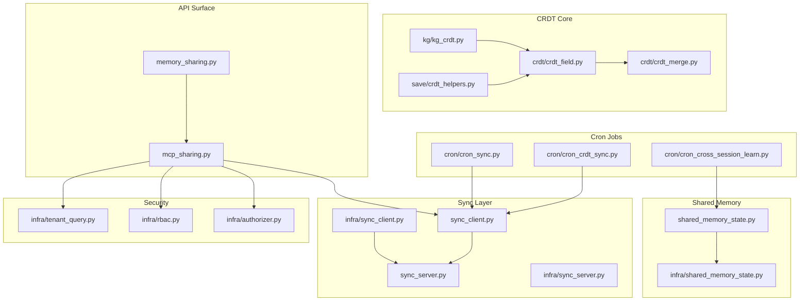
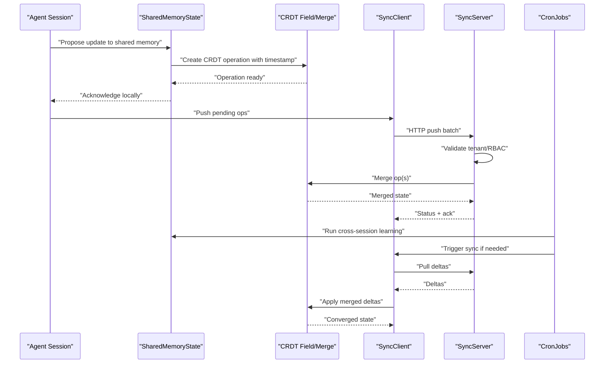
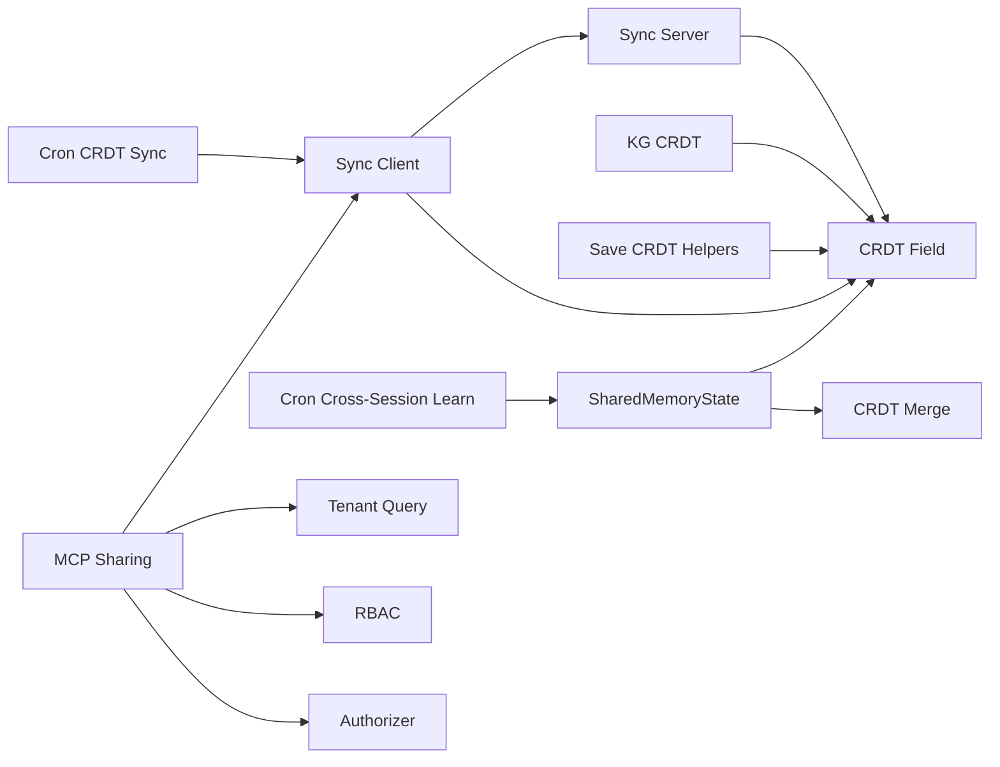

# Cross-Session Learning and Sharing

<cite>
**Referenced Files in This Document**
- [cross_session_learn.py](file://cross_session_learn.py)
- [cron/cron_cross_session_learn.py](file://cron/cron_cross_session_learn.py)
- [shared_memory_state.py](file://shared_memory_state.py)
- [infra/shared_memory_state.py](file://infra/shared_memory_state.py)
- [crdt/crdt_field.py](file://crdt/crdt_field.py)
- [crdt/crdt_merge.py](file://crdt/crdt_merge.py)
- [kg/kg_crdt.py](file://kg/kg_crdt.py)
- [save/crdt_helpers.py](file://save/crdt_helpers.py)
- [sync_client.py](file://sync_client.py)
- [infra/sync_client.py](file://infra/sync_client.py)
- [sync_server.py](file://sync_server.py)
- [infra/sync_server.py](file://infra/sync_server.py)
- [cron/cron_crdt_sync.py](file://cron/cron_crdt_sync.py)
- [cron/cron_sync.py](file://cron/cron_sync.py)
- [memory_sharing.py](file://memory_sharing.py)
- [mcp_sharing.py](file://mcp_sharing.py)
- [tenant_query.py](file://infra/tenant_query.py)
- [rbac.py](file://infra/rbac.py)
- [authorizer.py](file://infra/authorizer.py)
- [test_shared_memory_state.py](file://test_shared_memory_state.py)
- [test_crdt_sync.py](file://test_crdt_sync.py)
- [test_cron_crdt_sync.py](file://test_cron_crdt_sync.py)
- [test_cron_cross_session_learn.py](file://test_cron_cross_session_learn.py)
- [test_cross_session_learn.py](file://test_cross_session_learn.py)
</cite>

## Table of Contents
1. [Introduction](#introduction)
2. [Project Structure](#project-structure)
3. [Core Components](#core-components)
4. [Architecture Overview](#architecture-overview)
5. [Detailed Component Analysis](#detailed-component-analysis)
6. [Dependency Analysis](#dependency-analysis)
7. [Performance Considerations](#performance-considerations)
8. [Troubleshooting Guide](#troubleshooting-guide)
9. [Conclusion](#conclusion)
10. [Appendices](#appendices)

## Introduction
This document explains how agents learn across sessions and share knowledge through shared memory spaces, with a focus on:
- Cross-session learning mechanisms that transfer insights between agent sessions and instances
- CRDT-based synchronization to maintain consistency across distributed agents
- Tenant isolation, permission controls, and conflict resolution strategies
- Practical setup for shared memory spaces, sync policies, and monitoring
- Performance implications and scalability considerations for large-scale deployments

The goal is to provide both conceptual clarity and actionable guidance for operators and developers building multi-agent systems with consistent, secure, and scalable knowledge sharing.

## Project Structure
Cross-session learning and sharing span several subsystems:
- Shared memory state management and lifecycle
- CRDT field-level operations and merge logic
- Knowledge graph CRDT integration
- Sync client/server for distributed synchronization
- Cron-driven jobs for cross-session learning and CRDT sync
- Security layer for tenant isolation and RBAC
- MCP surface for programmatic access to sharing features

**Diagram sources**
- [shared_memory_state.py](file://shared_memory_state.py)
- [infra/shared_memory_state.py](file://infra/shared_memory_state.py)
- [crdt/crdt_field.py](file://crdt/crdt_field.py)
- [crdt/crdt_merge.py](file://crdt/crdt_merge.py)
- [kg/kg_crdt.py](file://kg/kg_crdt.py)
- [save/crdt_helpers.py](file://save/crdt_helpers.py)
- [sync_client.py](file://sync_client.py)
- [infra/sync_client.py](file://infra/sync_client.py)
- [sync_server.py](file://sync_server.py)
- [infra/sync_server.py](file://infra/sync_server.py)
- [cron/cron_cross_session_learn.py](file://cron/cron_cross_session_learn.py)
- [cron/cron_crdt_sync.py](file://cron/cron_crdt_sync.py)
- [cron/cron_sync.py](file://cron/cron_sync.py)
- [infra/tenant_query.py](file://infra/tenant_query.py)
- [infra/rbac.py](file://infra/rbac.py)
- [infra/authorizer.py](file://infra/authorizer.py)
- [memory_sharing.py](file://memory_sharing.py)
- [mcp_sharing.py](file://mcp_sharing.py)

**Section sources**
- [shared_memory_state.py](file://shared_memory_state.py)
- [infra/shared_memory_state.py](file://infra/shared_memory_state.py)
- [crdt/crdt_field.py](file://crdt/crdt_field.py)
- [crdt/crdt_merge.py](file://crdt/crdt_merge.py)
- [kg/kg_crdt.py](file://kg/kg_crdt.py)
- [save/crdt_helpers.py](file://save/crdt_helpers.py)
- [sync_client.py](file://sync_client.py)
- [infra/sync_client.py](file://infra/sync_client.py)
- [sync_server.py](file://sync_server.py)
- [infra/sync_server.py](file://infra/sync_server.py)
- [cron/cron_cross_session_learn.py](file://cron/cron_cross_session_learn.py)
- [cron/cron_crdt_sync.py](file://cron/cron_crdt_sync.py)
- [cron/cron_sync.py](file://cron/cron_sync.py)
- [infra/tenant_query.py](file://infra/tenant_query.py)
- [infra/rbac.py](file://infra/rbac.py)
- [infra/authorizer.py](file://infra/authorizer.py)
- [memory_sharing.py](file://memory_sharing.py)
- [mcp_sharing.py](file://mcp_sharing.py)

## Core Components
- Shared memory state: Provides the runtime view and mutation primitives for shared memories accessible across sessions and agents. It encapsulates scoping (tenant, session, agent), versioning, and change propagation hooks.
- CRDT core: Implements conflict-free replicated data types at the field level, including vector clocks or similar logical timestamps, merge semantics, and idempotent application of changes.
- Knowledge graph CRDT: Extends CRDTs to graph entities and relationships, ensuring consistent merges across nodes and edges while preserving referential integrity.
- Sync client/server: Manages replication between nodes, batching, backoff, and reconciliation. The server exposes endpoints for push/pull and status queries; the client coordinates local vs remote state.
- Cron jobs: Periodic tasks orchestrate cross-session learning and CRDT synchronization, applying policies and handling retries and failures.
- Security: Enforces tenant isolation and role-based access control over shared memory operations.

Key responsibilities:
- Cross-session learning: Identify high-signal insights from completed sessions and propose them into shared memory according to policy.
- Conflict resolution: Use CRDT merge rules to converge on a single consistent state without central coordination.
- Isolation and permissions: Ensure tenants and principals can only access permitted shared memories.

**Section sources**
- [shared_memory_state.py](file://shared_memory_state.py)
- [infra/shared_memory_state.py](file://infra/shared_memory_state.py)
- [crdt/crdt_field.py](file://crdt/crdt_field.py)
- [crdt/crdt_merge.py](file://crdt/crdt_merge.py)
- [kg/kg_crdt.py](file://kg/kg_crdt.py)
- [sync_client.py](file://sync_client.py)
- [infra/sync_client.py](file://infra/sync_client.py)
- [sync_server.py](file://sync_server.py)
- [infra/sync_server.py](file://infra/sync_server.py)
- [cron/cron_cross_session_learn.py](file://cron/cron_cross_session_learn.py)
- [cron/cron_crdt_sync.py](file://cron/cron_crdt_sync.py)
- [cron/cron_sync.py](file://cron/cron_sync.py)
- [infra/tenant_query.py](file://infra/tenant_query.py)
- [infra/rbac.py](file://infra/rbac.py)
- [infra/authorizer.py](file://infra/authorizer.py)

## Architecture Overview
The system combines shared memory state, CRDTs, and a sync layer to enable safe, concurrent updates across distributed agents. Cron jobs drive periodic learning and synchronization. Security components enforce tenant isolation and RBAC.

**Diagram sources**
- [shared_memory_state.py](file://shared_memory_state.py)
- [crdt/crdt_field.py](file://crdt/crdt_field.py)
- [crdt/crdt_merge.py](file://crdt/crdt_merge.py)
- [sync_client.py](file://sync_client.py)
- [infra/sync_client.py](file://infra/sync_client.py)
- [sync_server.py](file://sync_server.py)
- [infra/sync_server.py](file://infra/sync_server.py)
- [cron/cron_cross_session_learn.py](file://cron/cron_cross_session_learn.py)
- [cron/cron_crdt_sync.py](file://cron/cron_crdt_sync.py)

## Detailed Component Analysis

### Shared Memory State
Responsibilities:
- Maintain per-tenant, per-session, and per-agent scoped views of shared memories
- Provide APIs to read, propose, and apply changes
- Integrate with CRDT layer for conflict-free updates
- Expose metrics and audit hooks for observability

Operational notes:
- Scoping ensures tenant isolation by default
- Change proposals are wrapped in CRDT operations before persistence
- Hooks allow downstream indexing and notifications

Practical usage patterns:
- Initialize a shared memory space for a tenant and scope it to a project or team
- Agents propose edits via the shared memory API
- Cron jobs periodically review and promote high-signal content

**Section sources**
- [shared_memory_state.py](file://shared_memory_state.py)
- [infra/shared_memory_state.py](file://infra/shared_memory_state.py)
- [test_shared_memory_state.py](file://test_shared_memory_state.py)

### CRDT Field and Merge Semantics
Responsibilities:
- Implement field-level CRDTs with monotonic counters or vector clocks
- Define deterministic merge functions for concurrent writes
- Guarantee convergence across replicas without locks

Design highlights:
- Each write produces an append-only operation tagged with a unique identifier and timestamp
- Merge is commutative, associative, and idempotent
- Helpers simplify constructing and applying CRDT operations during save pipelines

Conflict resolution strategy:
- Last-writer-wins within a causal context when applicable
- Semantic merges for structured fields where possible
- Graph-level constraints enforced post-merge to preserve integrity

**Section sources**
- [crdt/crdt_field.py](file://crdt/crdt_field.py)
- [crdt/crdt_merge.py](file://crdt/crdt_merge.py)
- [save/crdt_helpers.py](file://save/crdt_helpers.py)

### Knowledge Graph CRDT Integration
Responsibilities:
- Extend CRDTs to nodes and edges in the knowledge graph
- Ensure referential integrity after merges
- Support append-only facts with temporal metadata

Integration points:
- Save pipeline uses CRDT helpers to emit graph mutations
- Sync layer replicates graph CRDT operations across nodes
- Cron jobs may trigger graph maintenance tasks

**Section sources**
- [kg/kg_crdt.py](file://kg/kg_crdt.py)
- [save/crdt_helpers.py](file://save/crdt_helpers.py)

### Sync Client and Server
Responsibilities:
- Client: Batch and queue pending CRDT operations, handle retries, and pull deltas
- Server: Authenticate requests, validate tenant and permissions, merge operations, and serve deltas

Flow overview:
- Local agent proposes changes → CRDT op created → queued for push
- Server validates tenant/RBAC → merges ops → responds with status
- Pull phase fetches missing deltas and applies merges locally

Monitoring:
- Status endpoints expose lag, last sync time, and error counts
- Metrics capture throughput and latency

**Section sources**
- [sync_client.py](file://sync_client.py)
- [infra/sync_client.py](file://infra/sync_client.py)
- [sync_server.py](file://sync_server.py)
- [infra/sync_server.py](file://infra/sync_server.py)
- [test_crdt_sync.py](file://test_crdt_sync.py)
- [test_cron_crdt_sync.py](file://test_cron_crdt_sync.py)

### Cron Jobs: Cross-Session Learning and CRDT Sync
Responsibilities:
- Cross-session learning job: Analyze recent sessions, extract insights, and propose shared memory entries based on policy
- CRDT sync job: Orchestrate push/pull cycles, reconcile conflicts, and report health

Policy-driven behavior:
- Eligibility criteria for promotion (e.g., confidence thresholds, relevance scores)
- Rate limits and deduplication to avoid noise
- Audit logging for traceability

**Section sources**
- [cron/cron_cross_session_learn.py](file://cron/cron_cross_session_learn.py)
- [cron/cron_crdt_sync.py](file://cron/cron_crdt_sync.py)
- [cron/cron_sync.py](file://cron/cron_sync.py)
- [test_cron_cross_session_learn.py](file://test_cron_cross_session_learn.py)
- [test_cron_crdt_sync.py](file://test_cron_crdt_sync.py)

### Security: Tenant Isolation and Permissions
Responsibilities:
- Enforce tenant-scoped access to shared memories and sync endpoints
- Apply RBAC checks for read/write/admin actions
- Authorize MCP calls and API routes consistently

Implementation details:
- Tenant query utilities ensure all reads/writes include tenant context
- RBAC module defines roles and permissions
- Authorizer middleware enforces policies at request boundaries

**Section sources**
- [infra/tenant_query.py](file://infra/tenant_query.py)
- [infra/rbac.py](file://infra/rbac.py)
- [infra/authorizer.py](file://infra/authorizer.py)

### MCP Surface for Sharing
Responsibilities:
- Expose programmatic tools for creating, reading, updating, and syncing shared memories
- Integrate with MCP clients for agent tool use
- Route calls through security and sync layers

Use cases:
- Agents call MCP tools to propose edits to shared memories
- Operators invoke MCP commands to inspect sync status and force resync

**Section sources**
- [memory_sharing.py](file://memory_sharing.py)
- [mcp_sharing.py](file://mcp_sharing.py)

## Dependency Analysis
High-level dependencies:
- Shared memory depends on CRDT core for conflict-free updates
- Sync client/server depend on CRDT merge semantics and security modules
- Cron jobs depend on shared memory and sync client to orchestrate learning and replication
- MCP surface depends on shared memory, sync client, and security

**Diagram sources**
- [shared_memory_state.py](file://shared_memory_state.py)
- [crdt/crdt_field.py](file://crdt/crdt_field.py)
- [crdt/crdt_merge.py](file://crdt/crdt_merge.py)
- [kg/kg_crdt.py](file://kg/kg_crdt.py)
- [save/crdt_helpers.py](file://save/crdt_helpers.py)
- [sync_client.py](file://sync_client.py)
- [sync_server.py](file://sync_server.py)
- [cron/cron_cross_session_learn.py](file://cron/cron_cross_session_learn.py)
- [cron/cron_crdt_sync.py](file://cron/cron_crdt_sync.py)
- [mcp_sharing.py](file://mcp_sharing.py)
- [infra/tenant_query.py](file://infra/tenant_query.py)
- [infra/rbac.py](file://infra/rbac.py)
- [infra/authorizer.py](file://infra/authorizer.py)

**Section sources**
- [shared_memory_state.py](file://shared_memory_state.py)
- [crdt/crdt_field.py](file://crdt/crdt_field.py)
- [crdt/crdt_merge.py](file://crdt/crdt_merge.py)
- [kg/kg_crdt.py](file://kg/kg_crdt.py)
- [save/crdt_helpers.py](file://save/crdt_helpers.py)
- [sync_client.py](file://sync_client.py)
- [sync_server.py](file://sync_server.py)
- [cron/cron_cross_session_learn.py](file://cron/cron_cross_session_learn.py)
- [cron/cron_crdt_sync.py](file://cron/cron_crdt_sync.py)
- [mcp_sharing.py](file://mcp_sharing.py)
- [infra/tenant_query.py](file://infra/tenant_query.py)
- [infra/rbac.py](file://infra/rbac.py)
- [infra/authorizer.py](file://infra/authorizer.py)

## Performance Considerations
- Batching and backoff: Group CRDT operations into batches to reduce network overhead; implement exponential backoff with jitter for retries.
- Delta compression: Minimize payload size by sending only changed fields and using compact encodings.
- Concurrency control: Prefer lock-free CRDT merges; limit contention by partitioning shared memories by tenant/project.
- Indexing and search: Keep indexes updated asynchronously to avoid blocking write paths.
- Monitoring: Track sync lag, merge latency, and error rates; set alerts for anomalies.
- Scaling horizontally: Distribute tenants across nodes; ensure consistent hashing or sharding for shared memory keys.

[No sources needed since this section provides general guidance]

## Troubleshooting Guide
Common issues and diagnostics:
- Sync stalls: Check cron job health, network connectivity, and server status endpoints; verify tenant and RBAC configuration.
- Merge conflicts: Inspect CRDT logs for conflicting operations; confirm deterministic merge rules and timestamps.
- Permission errors: Validate tenant context and RBAC roles for the principal making the request.
- High latency: Review batch sizes, network conditions, and index update load; consider tuning sync intervals.

Verification tests:
- Shared memory state behavior under concurrent updates
- CRDT sync convergence and idempotency
- Cron job execution and retry behavior

**Section sources**
- [test_shared_memory_state.py](file://test_shared_memory_state.py)
- [test_crdt_sync.py](file://test_crdt_sync.py)
- [test_cron_crdt_sync.py](file://test_cron_crdt_sync.py)
- [test_cross_session_learn.py](file://test_cross_session_learn.py)

## Conclusion
Cross-session learning and shared memory spaces enable agents to accumulate and reuse knowledge safely across sessions and instances. The CRDT-based synchronization guarantees eventual consistency without centralized coordination, while tenant isolation and RBAC protect sensitive data. With careful tuning of sync policies, batching, and monitoring, the system scales to large deployments and supports robust multi-agent collaboration.

[No sources needed since this section summarizes without analyzing specific files]

## Appendices

### Practical Setup Examples

- Create a shared memory space:
  - Initialize a new shared memory scoped to a tenant and project
  - Assign roles to principals who can read/write
  - Verify visibility via MCP tools or dashboard

- Configure sync policies:
  - Set sync intervals and batch sizes
  - Enable backoff and retry policies
  - Monitor sync status and lag metrics

- Monitor synchronization:
  - Use status endpoints to check last sync times and error counts
  - Review cron job logs for cross-session learning and CRDT sync runs
  - Alert on prolonged sync delays or merge failures

- Example flows:
  - Cross-session learning: A cron job analyzes recent sessions, extracts insights, and proposes shared memory entries based on policy thresholds
  - CRDT sync: Nodes push pending operations and pull deltas, merging them deterministically to converge on a consistent state

[No sources needed since this section provides general guidance]