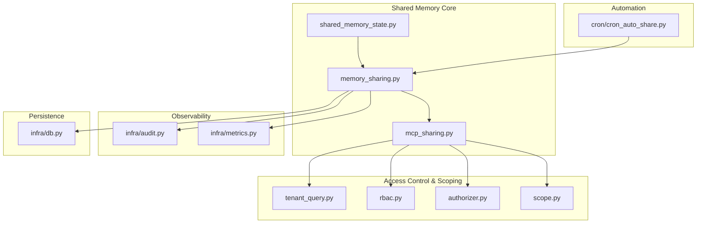
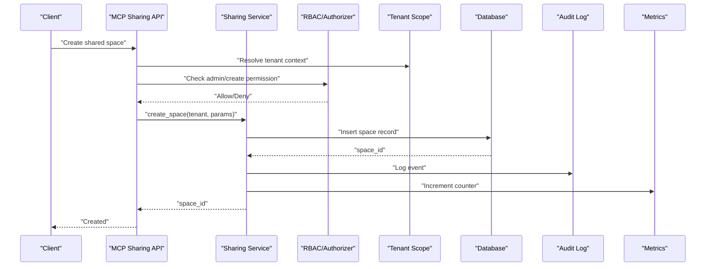
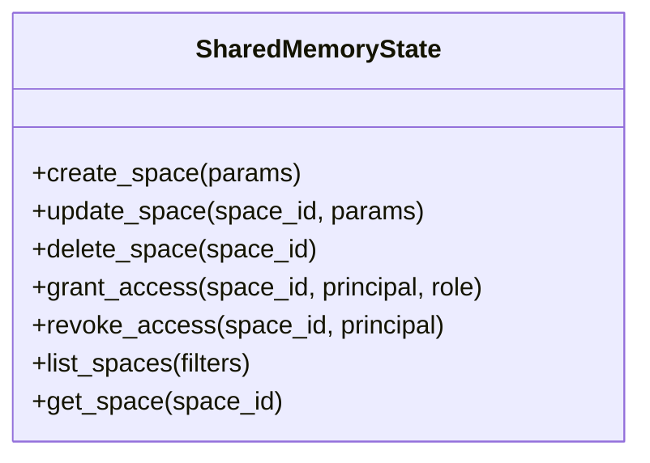
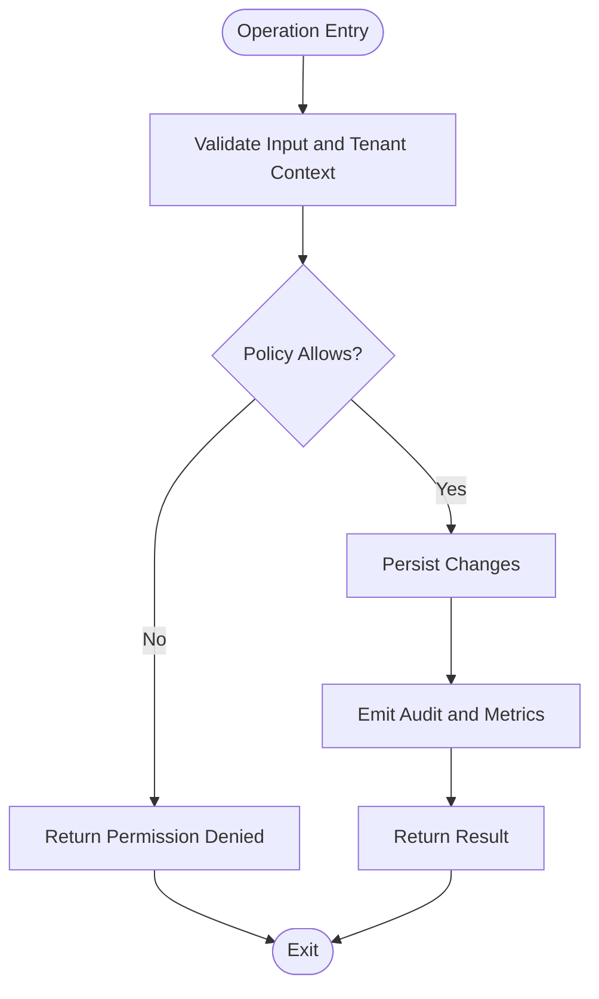
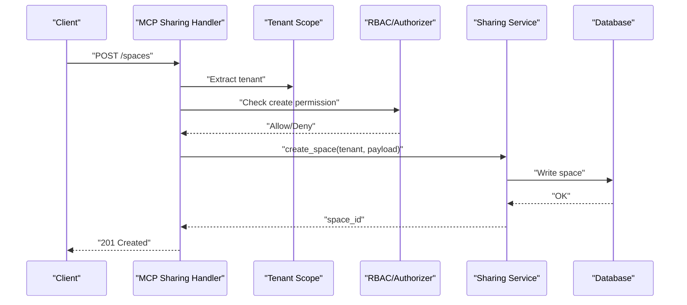
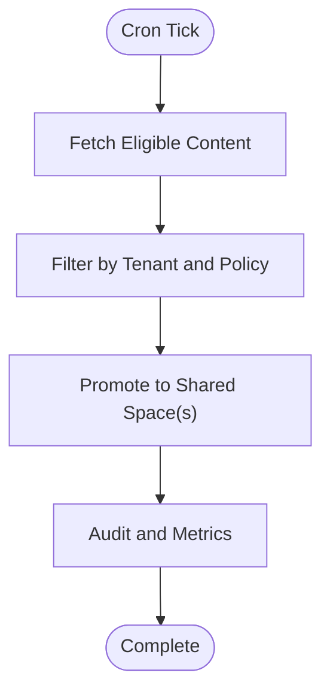
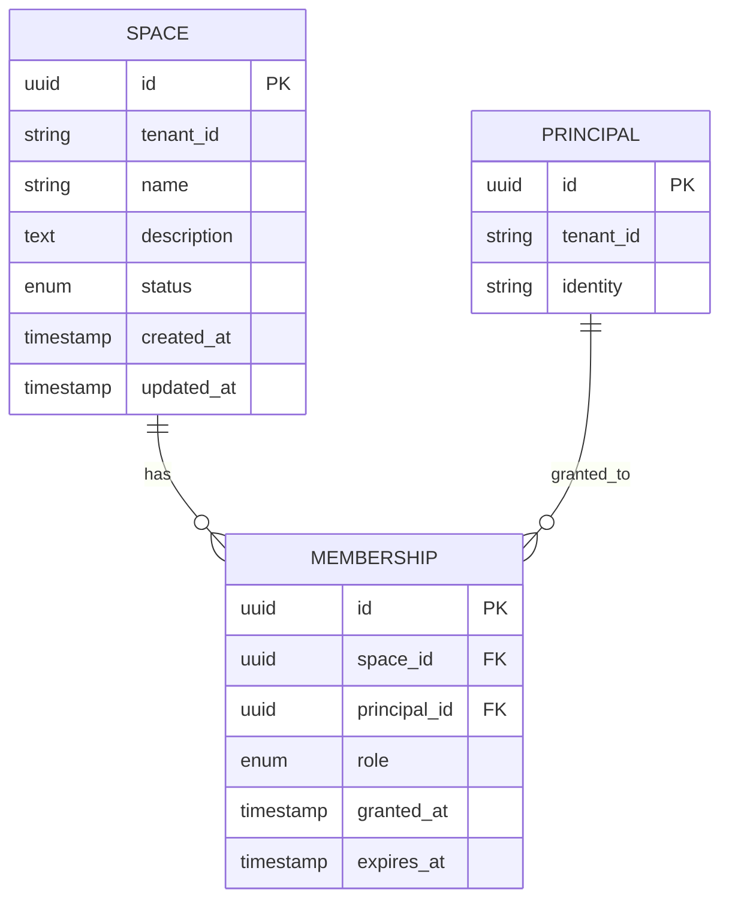
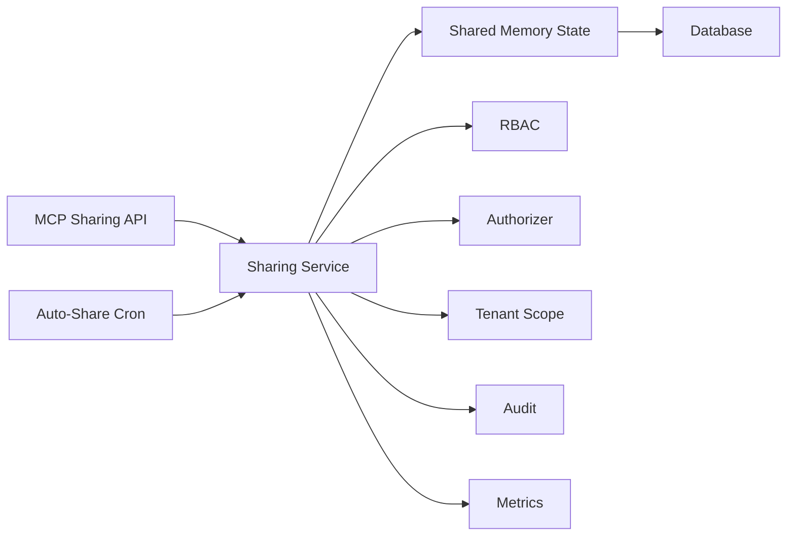

# Shared Memory Spaces

<cite>
**Referenced Files in This Document**
- [shared_memory_state.py](file://shared_memory_state.py)
- [memory_sharing.py](file://memory_sharing.py)
- [mcp_sharing.py](file://mcp_sharing.py)
- [test_shared_memory_state.py](file://test/test_shared_memory_state.py)
- [test_b7_shared_memory_injection.py](file://test/test_b7_shared_memory_injection.py)
- [cron_auto_share.py](file://cron/cron_auto_share.py)
- [tenant_query.py](file://infra/tenant_query.py)
- [rbac.py](file://infra/rbac.py)
- [authorizer.py](file://infra/authorizer.py)
- [scope.py](file://infra/scope.py)
- [audit.py](file://infra/audit.py)
- [metrics.py](file://infra/metrics.py)
- [config.py](file://infra/config.py)
- [db.py](file://infra/db.py)
</cite>

## Table of Contents
1. [Introduction](#introduction)
2. [Project Structure](#project-structure)
3. [Core Components](#core-components)
4. [Architecture Overview](#architecture-overview)
5. [Detailed Component Analysis](#detailed-component-analysis)
6. [Dependency Analysis](#dependency-analysis)
7. [Performance Considerations](#performance-considerations)
8. [Troubleshooting Guide](#troubleshooting-guide)
9. [Conclusion](#conclusion)
10. [Appendices](#appendices)

## Introduction
This document explains the shared memory spaces that enable knowledge sharing between different agent sessions and instances. It covers the architecture of shared memory containers, access control mechanisms, data isolation strategies, and operational guidance for creating, configuring, and managing shared spaces with proper tenant boundaries. Practical examples include team collaboration setups, read/write permission configuration, and monitoring usage patterns. Security considerations, performance implications, and scalability limits are addressed for large-scale deployments.

## Project Structure
Shared memory functionality spans several modules:
- State management and lifecycle for shared spaces
- MCP-based APIs to create, configure, and manage shared spaces
- Tenant scoping and RBAC enforcement
- Background automation for auto-sharing
- Observability via audit logs and metrics

**Diagram sources**
- [shared_memory_state.py](file://shared_memory_state.py)
- [memory_sharing.py](file://memory_sharing.py)
- [mcp_sharing.py](file://mcp_sharing.py)
- [tenant_query.py](file://infra/tenant_query.py)
- [rbac.py](file://infra/rbac.py)
- [authorizer.py](file://infra/authorizer.py)
- [scope.py](file://infra/scope.py)
- [cron/cron_auto_share.py](file://cron/cron_auto_share.py)
- [infra/audit.py](file://infra/audit.py)
- [infra/metrics.py](file://infra/metrics.py)
- [infra/db.py](file://infra/db.py)

**Section sources**
- [shared_memory_state.py](file://shared_memory_state.py)
- [memory_sharing.py](file://memory_sharing.py)
- [mcp_sharing.py](file://mcp_sharing.py)
- [cron/cron_auto_share.py](file://cron/cron_auto_share.py)
- [infra/tenant_query.py](file://infra/tenant_query.py)
- [infra/rbac.py](file://infra/rbac.py)
- [infra/authorizer.py](file://infra/authorizer.py)
- [infra/scope.py](file://infra/scope.py)
- [infra/audit.py](file://infra/audit.py)
- [infra/metrics.py](file://infra/metrics.py)
- [infra/db.py](file://infra/db.py)

## Core Components
- Shared memory state manager: maintains container metadata, membership, permissions, and lifecycle events.
- Sharing service: orchestrates creation, updates, and deletion of shared spaces; enforces policies and tenant boundaries.
- MCP sharing API: exposes operations for clients to interact with shared spaces (create, grant/revoke, list, query).
- Auto-share cron: periodically promotes eligible content into shared spaces based on policy.
- Access control: integrates with tenant scoping, RBAC, and authorization layers to enforce least privilege.
- Persistence: uses the database layer for durable storage of shared space definitions and membership.
- Observability: emits audit events and metrics for usage tracking and compliance.

Key responsibilities:
- Define shared space schemas and constraints
- Validate inputs and enforce tenant isolation
- Manage membership and role-based permissions
- Provide consistent APIs across processes and agents
- Ensure durability and consistency under concurrent access

**Section sources**
- [shared_memory_state.py](file://shared_memory_state.py)
- [memory_sharing.py](file://memory_sharing.py)
- [mcp_sharing.py](file://mcp_sharing.py)
- [cron/cron_auto_share.py](file://cron/cron_auto_share.py)
- [infra/tenant_query.py](file://infra/tenant_query.py)
- [infra/rbac.py](file://infra/rbac.py)
- [infra/authorizer.py](file://infra/authorizer.py)
- [infra/scope.py](file://infra/scope.py)
- [infra/db.py](file://infra/db.py)
- [infra/audit.py](file://infra/audit.py)
- [infra/metrics.py](file://infra/metrics.py)

## Architecture Overview
The shared memory system is a multi-layered architecture:
- Client layer: SDKs or MCP clients call sharing endpoints.
- API layer: MCP sharing handlers validate requests, apply scoping, and delegate to the sharing service.
- Service layer: Business logic for shared space operations, including validation, policy checks, and persistence.
- Data layer: Database-backed storage for shared spaces, memberships, and related metadata.
- Cross-cutting concerns: RBAC, tenant scoping, audit logging, and metrics.

**Diagram sources**
- [mcp_sharing.py](file://mcp_sharing.py)
- [memory_sharing.py](file://memory_sharing.py)
- [infra/rbac.py](file://infra/rbac.py)
- [infra/authorizer.py](file://infra/authorizer.py)
- [infra/scope.py](file://infra/scope.py)
- [infra/db.py](file://infra/db.py)
- [infra/audit.py](file://infra/audit.py)
- [infra/metrics.py](file://infra/metrics.py)

## Detailed Component Analysis

### Shared Memory State Manager
Responsibilities:
- Maintain shared space definitions and membership
- Enforce schema constraints and invariants
- Coordinate lifecycle transitions (draft, active, archived)
- Provide queries for listing and filtering by tenant and roles

Operational notes:
- All mutations must be validated against tenant boundaries
- Membership changes should be idempotent and auditable
- State transitions should respect policy rules and ownership

**Diagram sources**
- [shared_memory_state.py](file://shared_memory_state.py)

**Section sources**
- [shared_memory_state.py](file://shared_memory_state.py)

### Sharing Service
Responsibilities:
- Orchestrate high-level operations for shared spaces
- Apply business rules and policy checks
- Interact with persistence and observability layers
- Handle errors and retries where appropriate

Integration points:
- Uses tenant scoping to ensure cross-tenant isolation
- Delegates authorization to RBAC/Authorizer
- Emits audit events and metrics for all mutations

**Diagram sources**
- [memory_sharing.py](file://memory_sharing.py)
- [infra/tenant_query.py](file://infra/tenant_query.py)
- [infra/rbac.py](file://infra/rbac.py)
- [infra/authorizer.py](file://infra/authorizer.py)
- [infra/audit.py](file://infra/audit.py)
- [infra/metrics.py](file://infra/metrics.py)

**Section sources**
- [memory_sharing.py](file://memory_sharing.py)
- [infra/tenant_query.py](file://infra/tenant_query.py)
- [infra/rbac.py](file://infra/rbac.py)
- [infra/authorizer.py](file://infra/authorizer.py)
- [infra/audit.py](file://infra/audit.py)
- [infra/metrics.py](file://infra/metrics.py)

### MCP Sharing API
Responsibilities:
- Expose REST/MCP endpoints for shared space operations
- Parse and validate request payloads
- Resolve tenant context from headers or tokens
- Delegate to the sharing service and return standardized responses

Security posture:
- Fail closed on missing or invalid credentials
- Enforce least privilege via RBAC
- Record detailed audit entries for all operations

**Diagram sources**
- [mcp_sharing.py](file://mcp_sharing.py)
- [infra/scope.py](file://infra/scope.py)
- [infra/rbac.py](file://infra/rbac.py)
- [infra/authorizer.py](file://infra/authorizer.py)
- [memory_sharing.py](file://memory_sharing.py)
- [infra/db.py](file://infra/db.py)

**Section sources**
- [mcp_sharing.py](file://mcp_sharing.py)
- [infra/scope.py](file://infra/scope.py)
- [infra/rbac.py](file://infra/rbac.py)
- [infra/authorizer.py](file://infra/authorizer.py)
- [memory_sharing.py](file://memory_sharing.py)
- [infra/db.py](file://infra/db.py)

### Auto-Share Cron
Responsibilities:
- Periodically evaluate content eligibility for promotion into shared spaces
- Respect tenant boundaries and policy constraints
- Batch operations to reduce contention and improve throughput

Operational characteristics:
- Idempotent runs with deduplication
- Backoff and retry on transient failures
- Comprehensive audit logging for compliance

**Diagram sources**
- [cron/cron_auto_share.py](file://cron/cron_auto_share.py)
- [memory_sharing.py](file://memory_sharing.py)
- [infra/tenant_query.py](file://infra/tenant_query.py)
- [infra/audit.py](file://infra/audit.py)
- [infra/metrics.py](file://infra/metrics.py)

**Section sources**
- [cron/cron_auto_share.py](file://cron/cron_auto_share.py)
- [memory_sharing.py](file://memory_sharing.py)
- [infra/tenant_query.py](file://infra/tenant_query.py)
- [infra/audit.py](file://infra/audit.py)
- [infra/metrics.py](file://infra/metrics.py)

### Access Control and Tenant Isolation
- Tenant scoping ensures all operations are scoped to a single tenant unless explicitly allowed.
- RBAC defines roles and permissions for shared space operations (e.g., owner, editor, viewer).
- Authorizer enforces fail-closed semantics and validates principal identity.
- Audit logs capture who did what, when, and why for compliance and forensics.

Best practices:
- Always resolve tenant context before any operation
- Use least privilege roles for routine tasks
- Review audit logs regularly for anomalies

**Section sources**
- [infra/tenant_query.py](file://infra/tenant_query.py)
- [infra/rbac.py](file://infra/rbac.py)
- [infra/authorizer.py](file://infra/authorizer.py)
- [infra/scope.py](file://infra/scope.py)
- [infra/audit.py](file://infra/audit.py)

### Data Models and Relationships
Conceptual model for shared spaces:
- Space: unique identifier, tenant boundary, name, description, status
- Membership: principal, role, effective dates
- Policies: visibility, inheritance, retention

[No sources needed since this diagram shows conceptual model, not direct code mapping]

## Dependency Analysis
Shared memory components depend on core infrastructure services:
- Persistence via database layer
- Authorization via RBAC and authorizer
- Scoping via tenant context resolution
- Observability via audit and metrics

**Diagram sources**
- [shared_memory_state.py](file://shared_memory_state.py)
- [memory_sharing.py](file://memory_sharing.py)
- [mcp_sharing.py](file://mcp_sharing.py)
- [cron/cron_auto_share.py](file://cron/cron_auto_share.py)
- [infra/db.py](file://infra/db.py)
- [infra/rbac.py](file://infra/rbac.py)
- [infra/authorizer.py](file://infra/authorizer.py)
- [infra/scope.py](file://infra/scope.py)
- [infra/audit.py](file://infra/audit.py)
- [infra/metrics.py](file://infra/metrics.py)

**Section sources**
- [shared_memory_state.py](file://shared_memory_state.py)
- [memory_sharing.py](file://memory_sharing.py)
- [mcp_sharing.py](file://mcp_sharing.py)
- [cron/cron_auto_share.py](file://cron/cron_auto_share.py)
- [infra/db.py](file://infra/db.py)
- [infra/rbac.py](file://infra/rbac.py)
- [infra/authorizer.py](file://infra/authorizer.py)
- [infra/scope.py](file://infra/scope.py)
- [infra/audit.py](file://infra/audit.py)
- [infra/metrics.py](file://infra/metrics.py)

## Performance Considerations
- Batch operations: Prefer bulk grants and promotions to reduce round trips and contention.
- Indexing: Ensure indexes exist on frequently queried fields such as tenant_id, space_id, and principal_id.
- Caching: Cache membership and role lookups with short TTLs to reduce RBAC overhead.
- Concurrency: Use distributed locks for critical sections during membership updates.
- Backpressure: Implement rate limiting on MCP endpoints to protect backend resources.
- Monitoring: Track latency percentiles and error rates for shared space operations.

[No sources needed since this section provides general guidance]

## Troubleshooting Guide
Common issues and resolutions:
- Permission denied: Verify RBAC roles and tenant scoping; check audit logs for deny reasons.
- Cross-tenant access attempts: Confirm tenant context extraction and scope enforcement.
- Stale membership: Inspect expiration dates and re-grant if necessary.
- High latency: Profile database queries and consider adding indexes or caching.
- Cron failures: Check backoff behavior and retry counts; review cron logs for errors.

Useful diagnostics:
- Audit log filters by tenant, principal, and operation type
- Metrics dashboards for shared space operations
- Health checks for MCP endpoints and background workers

**Section sources**
- [infra/audit.py](file://infra/audit.py)
- [infra/metrics.py](file://infra/metrics.py)
- [mcp_sharing.py](file://mcp_sharing.py)
- [cron/cron_auto_share.py](file://cron/cron_auto_share.py)

## Conclusion
Shared memory spaces provide a secure, scalable foundation for cross-session and cross-instance knowledge sharing. By combining robust tenant isolation, RBAC-driven access control, and comprehensive observability, teams can collaborate effectively while maintaining strict security and performance standards. Proper configuration, monitoring, and adherence to best practices ensure reliable operation at scale.

[No sources needed since this section summarizes without analyzing specific files]

## Appendices

### Practical Examples

#### Team Collaboration Setup
- Create a shared space per team with descriptive names and clear descriptions.
- Assign owners and editors for each space; viewers for broader access.
- Enable auto-share policies to promote relevant content automatically.

References:
- [mcp_sharing.py](file://mcp_sharing.py)
- [memory_sharing.py](file://memory_sharing.py)
- [cron/cron_auto_share.py](file://cron/cron_auto_share.py)

#### Configuring Read/Write Permissions
- Use RBAC roles to define fine-grained permissions.
- Grant temporary access with expiration dates for contractors or guests.
- Regularly review membership and revoke unused access.

References:
- [infra/rbac.py](file://infra/rbac.py)
- [infra/authorizer.py](file://infra/authorizer.py)
- [shared_memory_state.py](file://shared_memory_state.py)

#### Monitoring Usage Patterns
- Track creation, updates, and deletions via audit logs.
- Monitor metrics for latency, throughput, and error rates.
- Set alerts for anomalous activity or policy violations.

References:
- [infra/audit.py](file://infra/audit.py)
- [infra/metrics.py](file://infra/metrics.py)

### Security Considerations
- Enforce tenant isolation at every layer.
- Apply least privilege principles consistently.
- Validate and sanitize all inputs.
- Rotate credentials and secrets regularly.
- Conduct periodic audits and penetration tests.

References:
- [infra/tenant_query.py](file://infra/tenant_query.py)
- [infra/rbac.py](file://infra/rbac.py)
- [infra/authorizer.py](file://infra/authorizer.py)
- [infra/scope.py](file://infra/scope.py)

### Scalability Limits
- Plan capacity for concurrent MCP requests and background jobs.
- Size databases and caches based on expected growth.
- Use horizontal scaling for MCP servers and workers.
- Implement graceful degradation under load.

[No sources needed since this section provides general guidance]

### Testing and Validation
- Unit tests for shared memory state transitions and invariants.
- Integration tests for MCP endpoints and RBAC enforcement.
- End-to-end tests for auto-share workflows and tenant isolation.

References:
- [test/test_shared_memory_state.py](file://test/test_shared_memory_state.py)
- [test/test_b7_shared_memory_injection.py](file://test/test_b7_shared_memory_injection.py)