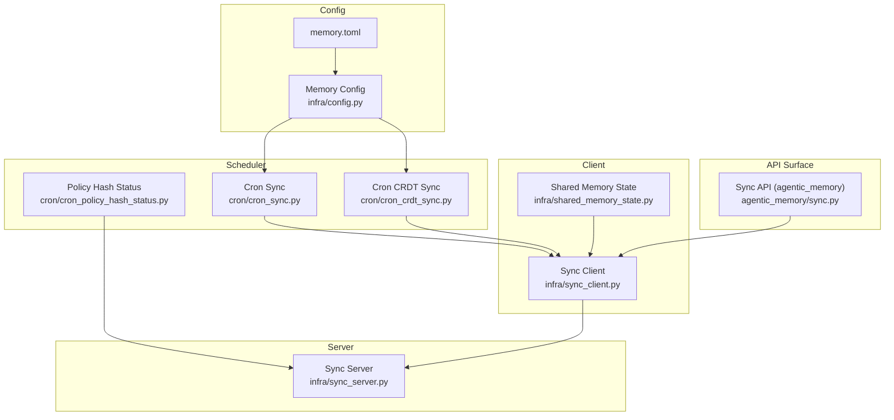
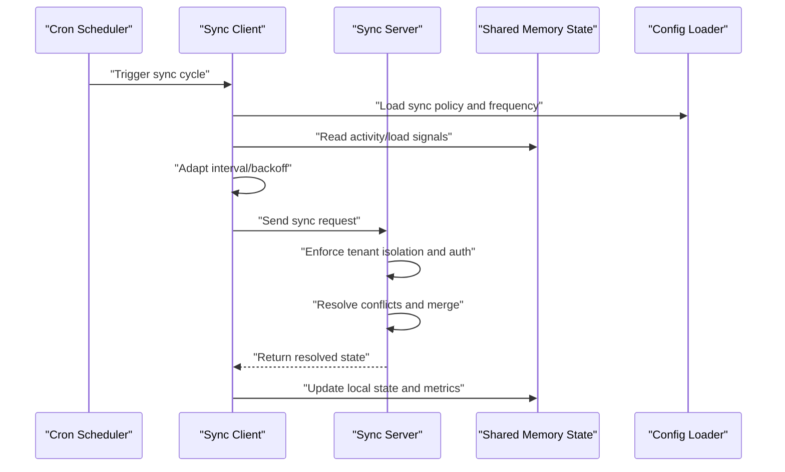
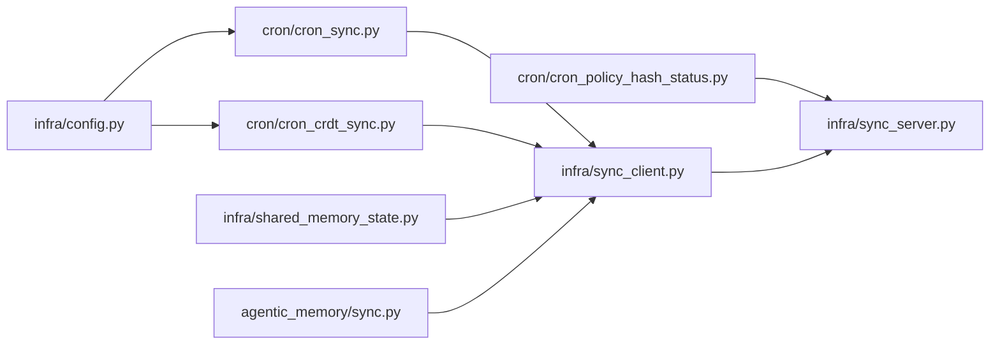

# Synchronization Policies and Configuration

<cite>
**Referenced Files in This Document**
- [sync.py](file://agentic_memory/sync.py)
- [sync_client.py](file://infra/sync_client.py)
- [sync_server.py](file://infra/sync_server.py)
- [cron_sync.py](file://cron/cron_sync.py)
- [cron_crdt_sync.py](file://cron/cron_crdt_sync.py)
- [memory.toml](file://memory.toml)
- [config.py](file://infra/config.py)
- [shared_memory_state.py](file://infra/shared_memory_state.py)
- [policy_hash_status.py](file://cron/cron_policy_hash_status.py)
- [test_sync_check.py](file://eval/test_sync_check.py)
- [test_sync_layer.py](file://eval/test_sync_layer.py)
- [test_security_sync_auth.py](file://eval/test_security_sync_auth.py)
- [test_sync_tenant_isolation.py](file://eval/test_sync_tenant_isolation.py)
</cite>

## Table of Contents
1. [Introduction](#introduction)
2. [Project Structure](#project-structure)
3. [Core Components](#core-components)
4. [Architecture Overview](#architecture-overview)
5. [Detailed Component Analysis](#detailed-component-analysis)
6. [Dependency Analysis](#dependency-analysis)
7. [Performance Considerations](#performance-considerations)
8. [Troubleshooting Guide](#troubleshooting-guide)
9. [Conclusion](#conclusion)
10. [Appendices](#appendices)

## Introduction
This document explains the configuration and policy management system for cross-session synchronization behavior. It covers sync frequency controls, conflict resolution policies, data retention rules across sessions, and adaptive synchronization based on activity levels, bandwidth constraints, and system load. It also provides practical examples for configuring sync policies across deployment scenarios, monitoring sync health, troubleshooting synchronization problems, and tuning performance for high-volume environments.

## Project Structure
The synchronization subsystem is implemented across client/server components, cron-driven schedulers, configuration and state modules, and tests that validate behavior and security. Key areas include:
- Client and server implementations for sync transport and protocol handling
- Cron jobs that orchestrate periodic sync runs and CRDT-based reconciliation
- Configuration loading and shared memory state used to drive adaptive behavior
- Policy hash status tracking to ensure consistent policy application across nodes
- Tests covering sync checks, layering, authentication, and tenant isolation

**Diagram sources**
- [sync_client.py](file://infra/sync_client.py)
- [sync_server.py](file://infra/sync_server.py)
- [cron_sync.py](file://cron/cron_sync.py)
- [cron_crdt_sync.py](file://cron/cron_crdt_sync.py)
- [policy_hash_status.py](file://cron/cron_policy_hash_status.py)
- [config.py](file://infra/config.py)
- [memory.toml](file://memory.toml)
- [sync.py](file://agentic_memory/sync.py)
- [shared_memory_state.py](file://infra/shared_memory_state.py)

**Section sources**
- [sync_client.py](file://infra/sync_client.py)
- [sync_server.py](file://infra/sync_server.py)
- [cron_sync.py](file://cron/cron_sync.py)
- [cron_crdt_sync.py](file://cron/cron_crdt_sync.py)
- [policy_hash_status.py](file://cron/cron_policy_hash_status.py)
- [config.py](file://infra/config.py)
- [memory.toml](file://memory.toml)
- [sync.py](file://agentic_memory/sync.py)
- [shared_memory_state.py](file://infra/shared_memory_state.py)

## Core Components
- Sync Client: Initiates outbound synchronization with the server, applies backoff and retry policies, and integrates with shared memory state for adaptive throttling.
- Sync Server: Accepts inbound sync requests, enforces tenant isolation and auth, and coordinates merges and conflict resolution.
- Cron Orchestrators: Periodic jobs that trigger sync cycles, including general sync and CRDT-specific reconciliation.
- Configuration and Policy: Centralized config loader and policy hash status job ensure consistent policy application and detect drift.
- Shared Memory State: Provides runtime metrics (activity levels, recent changes) used by adaptive logic.

Practical implications:
- Frequency controls are driven by configuration and can be adapted at runtime using shared memory signals.
- Conflict resolution is handled server-side during merge operations; clients receive resolved states.
- Data retention rules influence what is eligible for sync and how long it remains available for reconciliation.

**Section sources**
- [sync_client.py](file://infra/sync_client.py)
- [sync_server.py](file://infra/sync_server.py)
- [cron_sync.py](file://cron/cron_sync.py)
- [cron_crdt_sync.py](file://cron/cron_crdt_sync.py)
- [config.py](file://infra/config.py)
- [shared_memory_state.py](file://infra/shared_memory_state.py)

## Architecture Overview
The synchronization architecture separates concerns between client and server, with cron jobs orchestrating periodic workloads and configuration/policy ensuring consistent behavior.

**Diagram sources**
- [cron_sync.py](file://cron/cron_sync.py)
- [sync_client.py](file://infra/sync_client.py)
- [sync_server.py](file://infra/sync_server.py)
- [config.py](file://infra/config.py)
- [shared_memory_state.py](file://infra/shared_memory_state.py)

## Detailed Component Analysis

### Sync Client
Responsibilities:
- Build and send sync requests to the server
- Apply retry/backoff and rate limiting
- Integrate with shared memory state to adapt to activity and load
- Respect policy parameters loaded from configuration

Key behaviors:
- Adaptive frequency: adjusts sync cadence based on recent change rates and system load
- Bandwidth constraints: respects configured limits and may throttle payloads or intervals
- Error handling: implements retries with exponential backoff and circuit-breaking patterns where applicable

Configuration integration:
- Reads sync-related settings from the central config loader
- Uses policy hash status to ensure consistent policy application

**Section sources**
- [sync_client.py](file://infra/sync_client.py)
- [config.py](file://infra/config.py)
- [shared_memory_state.py](file://infra/shared_memory_state.py)

### Sync Server
Responsibilities:
- Authenticate and authorize sync requests
- Enforce tenant isolation boundaries
- Perform conflict detection and resolution during merges
- Persist resolved state and update indexes

Key behaviors:
- Conflict resolution: applies deterministic merge strategies and CRDT semantics where relevant
- Retention-awareness: honors retention policies when deciding which items are eligible for sync
- Observability: exposes health and metrics endpoints for monitoring

Security:
- Validates credentials and scopes per tenant
- Ensures cross-tenant data cannot leak during sync

**Section sources**
- [sync_server.py](file://infra/sync_server.py)
- [test_security_sync_auth.py](file://eval/test_security_sync_auth.py)
- [test_sync_tenant_isolation.py](file://eval/test_sync_tenant_isolation.py)

### Cron Orchestration
Cron jobs coordinate periodic synchronization tasks:
- General sync job triggers client-side sync cycles and monitors outcomes
- CRDT sync job focuses on reconciling field-level CRDTs and graph structures
- Policy hash status job ensures policy consistency across nodes and detects drift

Operational notes:
- Jobs should be scheduled according to workload characteristics and resource availability
- Use lock mechanisms to avoid concurrent execution on the same node or scope

**Section sources**
- [cron_sync.py](file://cron/cron_sync.py)
- [cron_crdt_sync.py](file://cron/cron_crdt_sync.py)
- [policy_hash_status.py](file://cron/cron_policy_hash_status.py)

### Configuration and Policy Management
Central configuration drives sync behavior:
- Frequency controls: base intervals, jitter, and adaptive multipliers
- Bandwidth and payload limits: maximum sizes and throughput caps
- Retention rules: time windows and thresholds that affect eligibility for sync
- Policy hashing: a mechanism to compute and compare policy hashes across nodes to detect drift

Runtime adaptation:
- Shared memory state provides signals such as recent write rates, active sessions, and system load
- The client uses these signals to adjust sync frequency and payload size dynamically

**Section sources**
- [config.py](file://infra/config.py)
- [memory.toml](file://memory.toml)
- [shared_memory_state.py](file://infra/shared_memory_state.py)
- [policy_hash_status.py](file://cron/cron_policy_hash_status.py)

### API Surface
The public API surface exposes sync-related operations for higher-level components:
- Methods to initiate sync, query sync status, and retrieve policy information
- Integration points for dashboard and admin tools to monitor and control sync behavior

**Section sources**
- [sync.py](file://agentic_memory/sync.py)

## Dependency Analysis
The following diagram shows key dependencies among synchronization components and their interactions with configuration and state.

**Diagram sources**
- [cron_sync.py](file://cron/cron_sync.py)
- [cron_crdt_sync.py](file://cron/cron_crdt_sync.py)
- [policy_hash_status.py](file://cron/cron_policy_hash_status.py)
- [sync_client.py](file://infra/sync_client.py)
- [sync_server.py](file://infra/sync_server.py)
- [config.py](file://infra/config.py)
- [shared_memory_state.py](file://infra/shared_memory_state.py)
- [sync.py](file://agentic_memory/sync.py)

**Section sources**
- [cron_sync.py](file://cron/cron_sync.py)
- [cron_crdt_sync.py](file://cron/cron_crdt_sync.py)
- [policy_hash_status.py](file://cron/cron_policy_hash_status.py)
- [sync_client.py](file://infra/sync_client.py)
- [sync_server.py](file://infra/sync_server.py)
- [config.py](file://infra/config.py)
- [shared_memory_state.py](file://infra/shared_memory_state.py)
- [sync.py](file://agentic_memory/sync.py)

## Performance Considerations
- Adaptive frequency: tune base intervals and adaptive multipliers to match activity levels; reduce frequency during low activity and increase during bursts.
- Bandwidth constraints: set payload size limits and throughput caps to prevent saturation; consider batching and compression if supported.
- System load: use shared memory signals to throttle sync when CPU/memory pressure is high; prioritize critical tenants under contention.
- Concurrency: ensure cron jobs are properly locked to avoid duplicate work; scale horizontally by partitioning tenants or shards.
- Backoff and retries: configure exponential backoff with jitter to handle transient failures without amplifying load.
- Indexing and persistence: schedule heavy index updates off the critical path; leverage incremental updates where possible.

[No sources needed since this section provides general guidance]

## Troubleshooting Guide
Common issues and diagnostics:
- Sync failures: check client logs for retry/backoff behavior and server responses; verify network connectivity and TLS configuration.
- Policy drift: use policy hash status to detect inconsistencies across nodes; reconcile configuration and restart affected workers.
- Tenant isolation violations: review server-side authorization and tenant scoping; consult tenant isolation tests for expected behavior.
- Health checks: monitor sync health endpoints and cron run statuses; investigate stalled or failed jobs.
- Retention mismatches: confirm retention windows align with sync eligibility; audit logs for expired items being requested.

Useful references:
- Sync check validation and layering tests provide insight into expected behaviors and failure modes.
- Security and tenant isolation tests demonstrate correct enforcement patterns.

**Section sources**
- [test_sync_check.py](file://eval/test_sync_check.py)
- [test_sync_layer.py](file://eval/test_sync_layer.py)
- [test_security_sync_auth.py](file://eval/test_security_sync_auth.py)
- [test_sync_tenant_isolation.py](file://eval/test_sync_tenant_isolation.py)

## Conclusion
The synchronization subsystem combines configurable policies, adaptive runtime behavior, and robust server-side conflict resolution to maintain consistent cross-session state. Properly tuned frequency controls, bandwidth limits, and retention rules enable reliable operation across diverse deployments. Monitoring and troubleshooting utilities help operators maintain healthy sync pipelines and quickly resolve issues.

[No sources needed since this section summarizes without analyzing specific files]

## Appendices

### Practical Configuration Examples
- Development environment:
  - Increase sync frequency for rapid iteration
  - Lower bandwidth caps to simulate constrained networks
  - Shorten retention windows for faster cleanup
- Staging environment:
  - Moderate frequency and bandwidth limits
  - Enable full policy hash checks and drift alerts
- Production environment:
  - Conservative frequency with adaptive multipliers
  - Strict bandwidth caps and aggressive backoff
  - Long retention windows aligned with compliance requirements

[No sources needed since this section provides general guidance]

### Monitoring and Health
- Track cron job success/failure rates and durations
- Observe client-server latency and error rates
- Monitor policy hash consistency across nodes
- Review tenant-scoped metrics to identify hotspots

[No sources needed since this section provides general guidance]