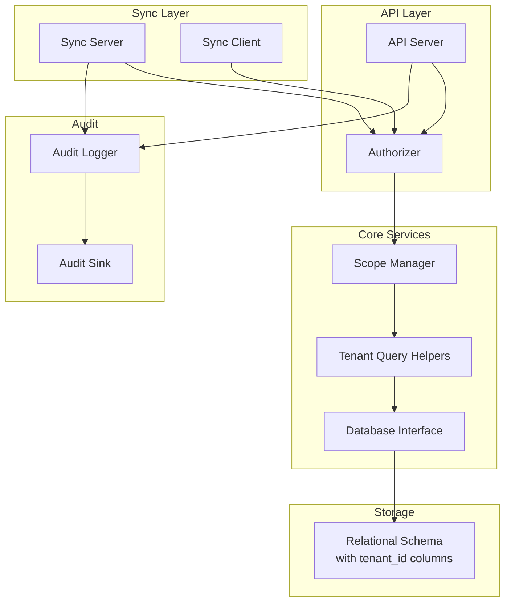
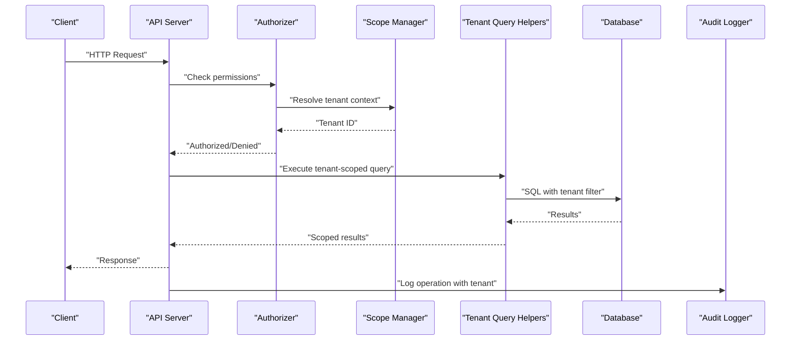
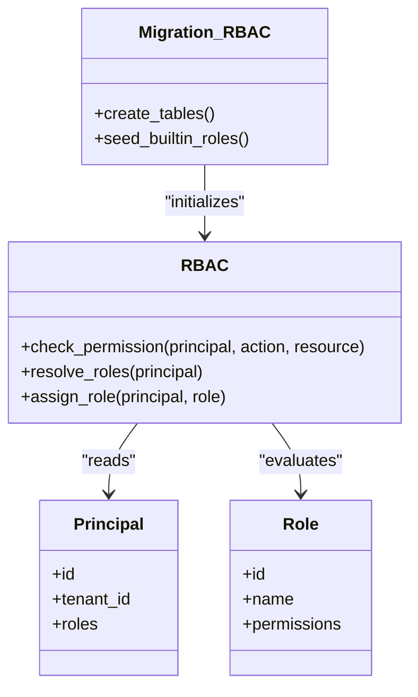
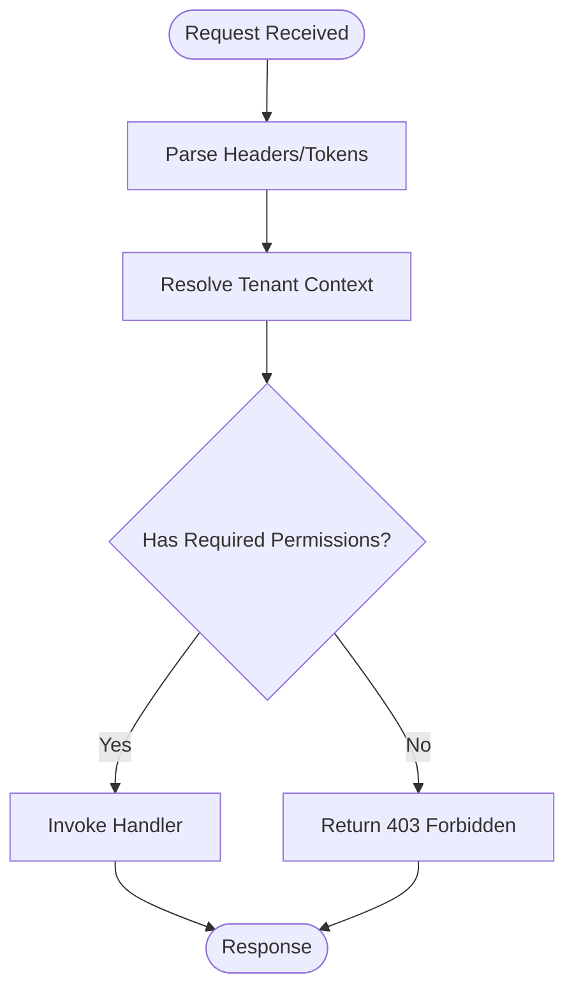
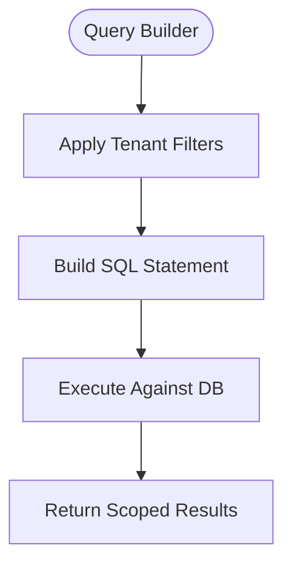
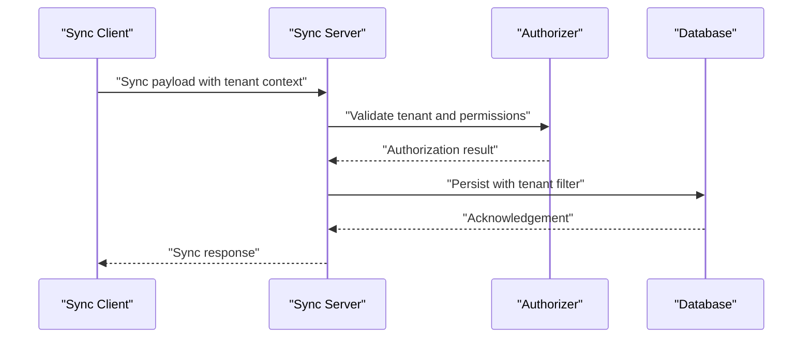
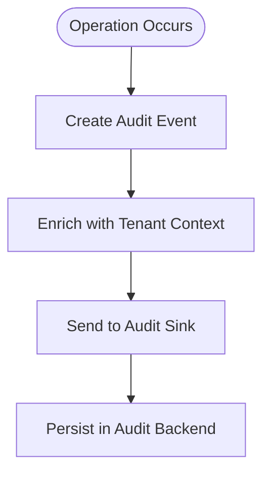
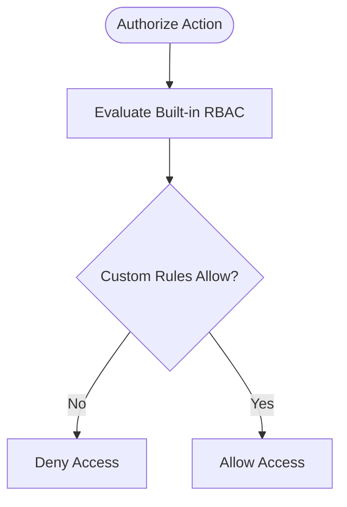
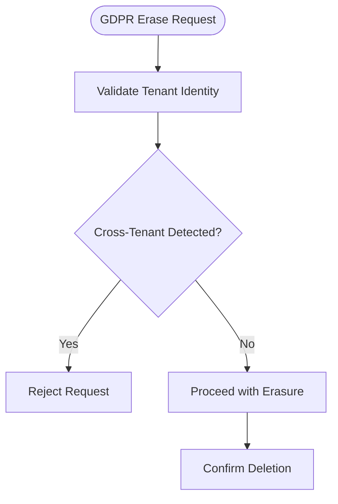
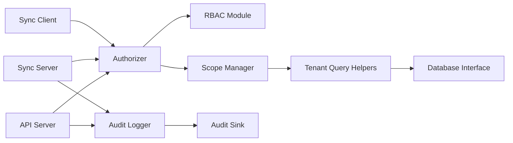

# Tenant Isolation and Security

<cite>
**Referenced Files in This Document**
- [security/tenant_isolation.md](file://docs/security/tenant_isolation.md)
- [rbac.py](file://infra/rbac.py)
- [authorizer.py](file://infra/authorizer.py)
- [scope.py](file://infra/scope.py)
- [audit.py](file://infra/audit.py)
- [audit_sink.py](file://infra/audit_sink.py)
- [sync_server.py](file://infra/sync_server.py)
- [sync_client.py](file://infra/sync_client.py)
- [api_server.py](file://infra/api_server.py)
- [db.py](file://infra/db.py)
- [tenant_query.py](file://infra/tenant_query.py)
- [045_rbac_schema.sql](file://migrations/045_rbac_schema.sql)
- [046_seed_builtin_roles.sql](file://migrations/046_seed_builtin_roles.sql)
- [048_principal_identities_multi_tenant.sql](file://migrations/048_principal_identities_multi_tenant.sql)
- [044_add_tenant_id_to_audit.sql](file://migrations/044_add_tenant_id_to_audit.sql)
- [test_rbac_multi_tenant.py](file://tests/test_rbac_multi_tenant.py)
- [test_rest_tenant_isolation_e2e.py](file://tests/test_rest_tenant_isolation_e2e.py)
- [test_sync_tenant_isolation.py](file://tests/test_sync_tenant_isolation.py)
- [test_tenant_isolation_exhaustive.py](file://tests/test_tenant_isolation_exhaustive.py)
- [test_gdpr_erase_refuses_cross_tenant.py](file://tests/test_gdpr_erase_refuses_cross_tenant.py)
</cite>

## Table of Contents
1. [Introduction](#introduction)
2. [Project Structure](#project-structure)
3. [Core Components](#core-components)
4. [Architecture Overview](#architecture-overview)
5. [Detailed Component Analysis](#detailed-component-analysis)
6. [Dependency Analysis](#dependency-analysis)
7. [Performance Considerations](#performance-considerations)
8. [Troubleshooting Guide](#troubleshooting-guide)
9. [Conclusion](#conclusion)
10. [Appendices](#appendices)

## Introduction
This document explains how tenant isolation is implemented to ensure data security and privacy in multi-tenant deployments. It covers enforcement at the database, API, and synchronization layers; the role-based access control (RBAC) system including permission inheritance; and audit logging for tenant operations. It also provides guidance on configuring tenant policies, implementing custom authorization rules, monitoring tenant activity, and addressing compliance and data residency requirements.

## Project Structure
Tenant isolation spans multiple subsystems:
- Policy and RBAC definitions are implemented in dedicated modules and migrations.
- Authorization checks are enforced at API boundaries and within core services.
- Database access is scoped by tenant using query helpers and schema constraints.
- Synchronization enforces tenant scoping across client-server interactions.
- Audit logs capture tenant context for all sensitive operations.

**Diagram sources**
- [api_server.py](file://infra/api_server.py)
- [authorizer.py](file://infra/authorizer.py)
- [scope.py](file://infra/scope.py)
- [tenant_query.py](file://infra/tenant_query.py)
- [db.py](file://infra/db.py)
- [sync_server.py](file://infra/sync_server.py)
- [sync_client.py](file://infra/sync_client.py)
- [audit.py](file://infra/audit.py)
- [audit_sink.py](file://infra/audit_sink.py)

**Section sources**
- [security/tenant_isolation.md](file://docs/security/tenant_isolation.md)

## Core Components
- RBAC and permissions: Role definitions, principal-to-role assignments, and permission checks.
- Scope manager: Enforces tenant boundaries for requests and background tasks.
- Authorizer: Centralized policy evaluation with support for custom rules.
- Tenant query helpers: Ensure all queries include tenant scoping.
- Sync layer: Validates tenant identity and scopes sync operations.
- Audit logging: Records tenant-scoped events with consistent fields.

Key implementation references:
- RBAC module and migrations define roles, permissions, and principal identities.
- Authorizer integrates with scope and tenant query helpers to enforce boundaries.
- Sync server/client validate tenant context before processing payloads.
- Audit logger captures tenant context and sinks events to configured backends.

**Section sources**
- [rbac.py](file://infra/rbac.py)
- [authorizer.py](file://infra/authorizer.py)
- [scope.py](file://infra/scope.py)
- [tenant_query.py](file://infra/tenant_query.py)
- [sync_server.py](file://infra/sync_server.py)
- [sync_client.py](file://infra/sync_client.py)
- [audit.py](file://infra/audit.py)
- [audit_sink.py](file://infra/audit_sink.py)
- [045_rbac_schema.sql](file://migrations/045_rbac_schema.sql)
- [046_seed_builtin_roles.sql](file://migrations/046_seed_builtin_roles.sql)
- [048_principal_identities_multi_tenant.sql](file://migrations/048_principal_identities_multi_tenant.sql)
- [044_add_tenant_id_to_audit.sql](file://migrations/044_add_tenant_id_to_audit.sql)

## Architecture Overview
The system applies a layered approach to tenant isolation:
- API layer validates authentication and authorizes actions against RBAC policies.
- Scope manager injects tenant context into request handlers and background jobs.
- Database layer uses tenant-scoped queries and schema constraints to prevent cross-tenant leakage.
- Sync layer ensures that replication and state propagation respect tenant boundaries.
- Audit subsystem records tenant-aware events for compliance and forensics.

**Diagram sources**
- [api_server.py](file://infra/api_server.py)
- [authorizer.py](file://infra/authorizer.py)
- [scope.py](file://infra/scope.py)
- [tenant_query.py](file://infra/tenant_query.py)
- [db.py](file://infra/db.py)
- [audit.py](file://infra/audit.py)

## Detailed Component Analysis

### RBAC System and Permission Inheritance
- Roles and permissions are defined via schema migrations and seeded with built-in roles.
- Principal identities are multi-tenant aware, enabling per-tenant role assignments.
- The RBAC module provides APIs to check permissions and resolve inherited roles.
- Tests cover multi-tenant scenarios and deny-by-default behavior.

**Diagram sources**
- [rbac.py](file://infra/rbac.py)
- [045_rbac_schema.sql](file://migrations/045_rbac_schema.sql)
- [046_seed_builtin_roles.sql](file://migrations/046_seed_builtin_roles.sql)
- [048_principal_identities_multi_tenant.sql](file://migrations/048_principal_identities_multi_tenant.sql)

**Section sources**
- [rbac.py](file://infra/rbac.py)
- [045_rbac_schema.sql](file://migrations/045_rbac_schema.sql)
- [046_seed_builtin_roles.sql](file://migrations/046_seed_builtin_roles.sql)
- [048_principal_identities_multi_tenant.sql](file://migrations/048_principal_identities_multi_tenant.sql)
- [test_rbac_multi_tenant.py](file://tests/test_rbac_multi_tenant.py)

### API Layer Enforcement
- The API server integrates with the authorizer to enforce RBAC before handling requests.
- Requests carry tenant context resolved from authentication tokens or headers.
- Unauthorized or mis-scoped requests are rejected early.

**Diagram sources**
- [api_server.py](file://infra/api_server.py)
- [authorizer.py](file://infra/authorizer.py)

**Section sources**
- [api_server.py](file://infra/api_server.py)
- [authorizer.py](file://infra/authorizer.py)
- [test_rest_tenant_isolation_e2e.py](file://tests/test_rest_tenant_isolation_e2e.py)

### Database Layer Scoping
- All critical tables include tenant identifiers to enforce row-level isolation.
- Tenant query helpers automatically append tenant filters to queries.
- Migrations add tenant columns and indexes to support efficient scoping.

**Diagram sources**
- [tenant_query.py](file://infra/tenant_query.py)
- [db.py](file://infra/db.py)

**Section sources**
- [tenant_query.py](file://infra/tenant_query.py)
- [db.py](file://infra/db.py)
- [test_tenant_isolation_exhaustive.py](file://tests/test_tenant_isolation_exhaustive.py)

### Synchronization Layer Isolation
- Sync server validates tenant identity and scopes sync operations to the correct tenant.
- Sync client includes tenant context in messages and rejects cross-tenant payloads.
- Tests verify that sync cannot leak data across tenants.

**Diagram sources**
- [sync_server.py](file://infra/sync_server.py)
- [sync_client.py](file://infra/sync_client.py)
- [authorizer.py](file://infra/authorizer.py)

**Section sources**
- [sync_server.py](file://infra/sync_server.py)
- [sync_client.py](file://infra/sync_client.py)
- [test_sync_tenant_isolation.py](file://tests/test_sync_tenant_isolation.py)

### Audit Logging for Tenant Operations
- Audit logger records tenant-scoped events with consistent fields.
- Audit sink supports pluggable backends for centralized collection.
- Migrations ensure audit tables include tenant identifiers.

**Diagram sources**
- [audit.py](file://infra/audit.py)
- [audit_sink.py](file://infra/audit_sink.py)
- [044_add_tenant_id_to_audit.sql](file://migrations/044_add_tenant_id_to_audit.sql)

**Section sources**
- [audit.py](file://infra/audit.py)
- [audit_sink.py](file://infra/audit_sink.py)
- [044_add_tenant_id_to_audit.sql](file://migrations/044_add_tenant_id_to_audit.sql)

### Custom Authorization Rules
- The authorizer supports integrating custom rules to extend default RBAC decisions.
- Custom rules can evaluate additional attributes such as resource ownership or time windows.
- Tests demonstrate fail-closed behavior when custom rules reject an action.

**Diagram sources**
- [authorizer.py](file://infra/authorizer.py)

**Section sources**
- [authorizer.py](file://infra/authorizer.py)
- [test_authz_fail_closed.py](file://tests/test_authz_fail_closed.py)

### Compliance and Data Residency
- GDPR erase operations refuse cross-tenant requests to maintain strict isolation.
- Tenant scoping is validated throughout deletion pipelines.
- Documentation outlines compliance considerations and evidence collection practices.

**Diagram sources**
- [test_gdpr_erase_refuses_cross_tenant.py](file://tests/test_gdpr_erase_refuses_cross_tenant.py)

**Section sources**
- [test_gdpr_erase_refuses_cross_tenant.py](file://tests/test_gdpr_erase_refuses_cross_tenant.py)

## Dependency Analysis
The following diagram shows key dependencies among tenant isolation components:

**Diagram sources**
- [api_server.py](file://infra/api_server.py)
- [authorizer.py](file://infra/authorizer.py)
- [rbac.py](file://infra/rbac.py)
- [scope.py](file://infra/scope.py)
- [tenant_query.py](file://infra/tenant_query.py)
- [db.py](file://infra/db.py)
- [sync_server.py](file://infra/sync_server.py)
- [sync_client.py](file://infra/sync_client.py)
- [audit.py](file://infra/audit.py)
- [audit_sink.py](file://infra/audit_sink.py)

**Section sources**
- [api_server.py](file://infra/api_server.py)
- [authorizer.py](file://infra/authorizer.py)
- [rbac.py](file://infra/rbac.py)
- [scope.py](file://infra/scope.py)
- [tenant_query.py](file://infra/tenant_query.py)
- [db.py](file://infra/db.py)
- [sync_server.py](file://infra/sync_server.py)
- [sync_client.py](file://infra/sync_client.py)
- [audit.py](file://infra/audit.py)
- [audit_sink.py](file://infra/audit_sink.py)

## Performance Considerations
- Prefer indexed tenant columns to minimize query overhead.
- Use tenant-scoped connection pools where feasible to reduce contention.
- Batch audit events to sinks to avoid blocking hot paths.
- Cache RBAC resolution for principals with stable role sets.

[No sources needed since this section provides general guidance]

## Troubleshooting Guide
Common issues and diagnostics:
- Cross-tenant access attempts should be denied; verify tenant context propagation in API and sync layers.
- If queries return unexpected rows, confirm tenant filters are applied by tenant query helpers.
- Audit gaps may indicate sink failures; check sink health and retry/backoff settings.
- RBAC misconfigurations often stem from missing role assignments; review principal-to-role mappings.

Relevant tests and modules:
- Multi-tenant RBAC behavior and denial scenarios.
- REST tenant isolation end-to-end flows.
- Sync tenant isolation validation.
- Exhaustive tenant isolation edge cases.
- GDPR erase refusal for cross-tenant requests.

**Section sources**
- [test_rbac_multi_tenant.py](file://tests/test_rbac_multi_tenant.py)
- [test_rest_tenant_isolation_e2e.py](file://tests/test_rest_tenant_isolation_e2e.py)
- [test_sync_tenant_isolation.py](file://tests/test_sync_tenant_isolation.py)
- [test_tenant_isolation_exhaustive.py](file://tests/test_tenant_isolation_exhaustive.py)
- [test_gdpr_erase_refuses_cross_tenant.py](file://tests/test_gdpr_erase_refuses_cross_tenant.py)

## Conclusion
Tenant isolation is enforced consistently across API, database, and synchronization layers using RBAC, scoped queries, and robust audit logging. By adhering to the documented patterns—resolving tenant context early, applying tenant filters universally, validating sync payloads, and recording tenant-aware audit events—you can maintain strong data security and privacy in multi-tenant deployments while meeting compliance and data residency requirements.

[No sources needed since this section summarizes without analyzing specific files]

## Appendices

### Configuring Tenant Policies
- Define roles and permissions via RBAC schema and seed built-in roles.
- Assign principals to roles per tenant using principal identity tables.
- Extend authorization with custom rules through the authorizer interface.

**Section sources**
- [045_rbac_schema.sql](file://migrations/045_rbac_schema.sql)
- [046_seed_builtin_roles.sql](file://migrations/046_seed_builtin_roles.sql)
- [048_principal_identities_multi_tenant.sql](file://migrations/048_principal_identities_multi_tenant.sql)
- [authorizer.py](file://infra/authorizer.py)

### Monitoring Tenant Activity
- Enable audit logging for all tenant-scoped operations.
- Configure audit sinks to centralize logs for analysis and alerting.
- Correlate API and sync events with tenant IDs for comprehensive visibility.

**Section sources**
- [audit.py](file://infra/audit.py)
- [audit_sink.py](file://infra/audit_sink.py)
- [044_add_tenant_id_to_audit.sql](file://migrations/044_add_tenant_id_to_audit.sql)