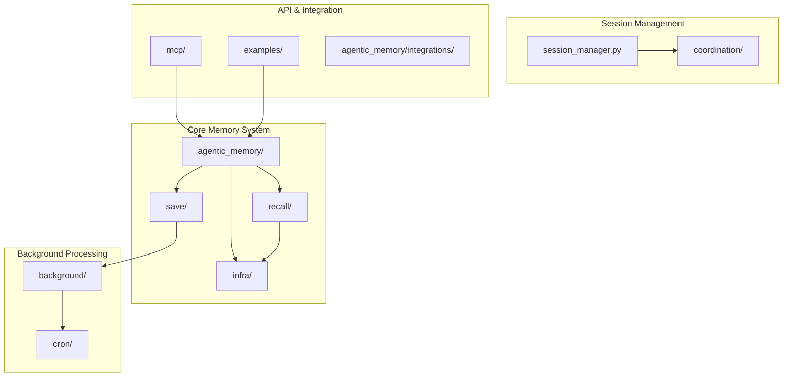
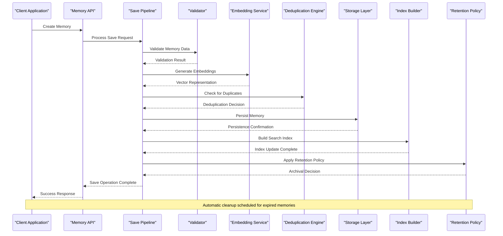
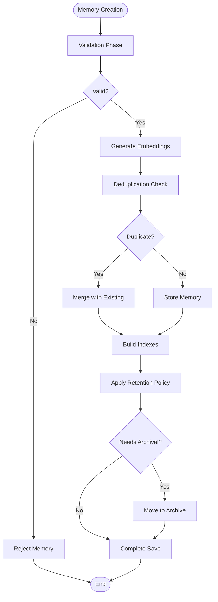
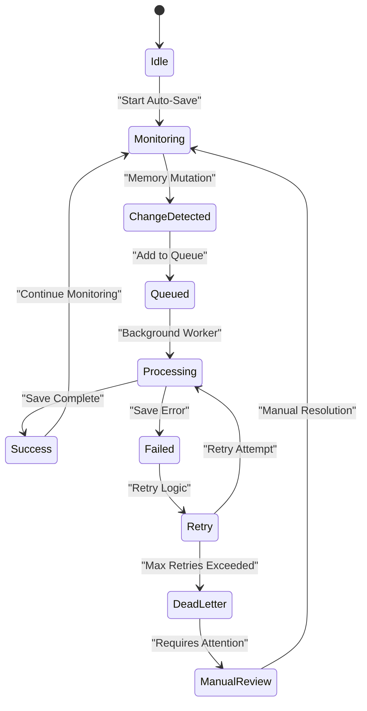
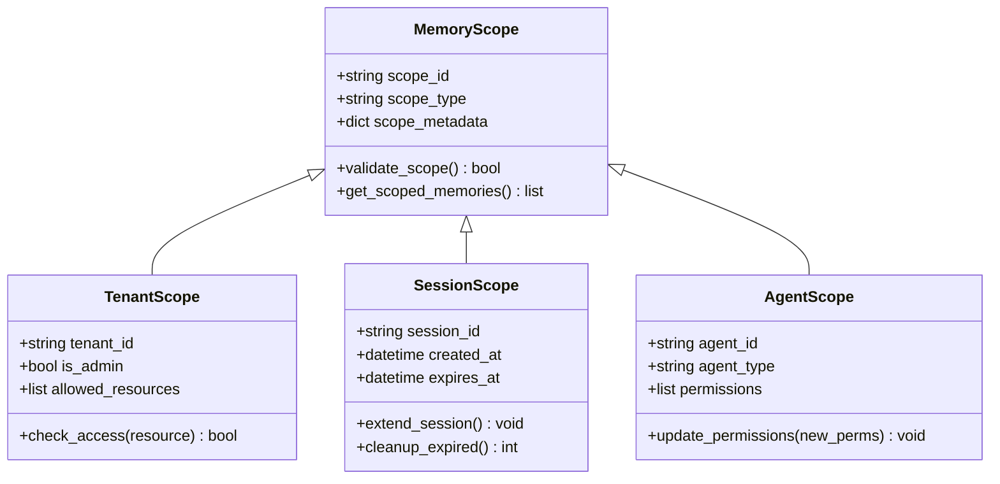
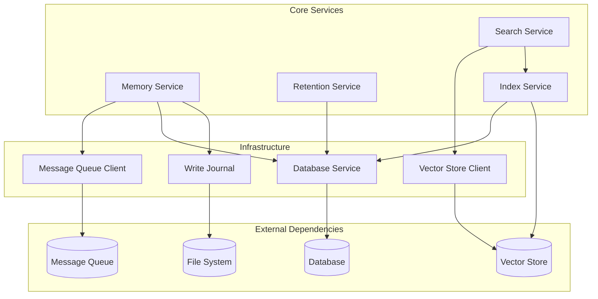

# Memory Lifecycle Management

<cite>
**Referenced Files in This Document**
- [save/pipeline.py](file://save/pipeline.py)
- [auto_save.py](file://auto_save.py)
- [background/auto_save.py](file://background/auto_save.py)
- [memory_common.py](file://memory_common.py)
- [recall/search_memory.py](file://recall/search_memory.py)
- [background/adaptive_retention.py](file://background/adaptive_retention.py)
- [cron/cron_purge_expired.py](file://cron/cron_purge_expired.py)
- [mcp/mcp_memory.py](file://mcp/mcp_memory.py)
- [examples/basic_save_search.py](file://examples/basic_save_search.py)
- [infra/vector_store.py](file://infra/vector_store.py)
- [infra/write_journal.py](file://infra/write_journal.py)
- [session_manager.py](file://session_manager.py)
- [agentic_memory/client.py](file://agentic_memory/client.py)
</cite>

## Table of Contents
1. [Introduction](#introduction)
2. [Project Structure](#project-structure)
3. [Core Components](#core-components)
4. [Architecture Overview](#architecture-overview)
5. [Detailed Component Analysis](#detailed-component-analysis)
6. [Dependency Analysis](#dependency-analysis)
7. [Performance Considerations](#performance-considerations)
8. [Troubleshooting Guide](#troubleshooting-guide)
9. [Conclusion](#conclusion)
10. [Appendices](#appendices)

## Introduction

Agentic Memory provides a comprehensive memory lifecycle management system that handles the complete journey of memories from creation through saving, indexing, retrieval, and eventual archival or deletion. The system implements sophisticated save pipelines with validation, embedding generation, deduplication, and storage operations, along with automatic save mechanisms, session-based organization, and robust cleanup procedures.

The architecture supports advanced features including memory versioning, revision tracking, rollback capabilities, and intelligent retention policies. This documentation explains how memories flow through the system, the various phases they undergo, and the mechanisms that ensure data integrity and performance at scale.

## Project Structure

The Agentic Memory system is organized into several key directories that handle different aspects of memory lifecycle management:



**Diagram sources**
- [save/pipeline.py:1-50](file://save/pipeline.py#L1-L50)
- [background/auto_save.py:1-30](file://background/auto_save.py#L1-L30)
- [session_manager.py:1-40](file://session_manager.py#L1-L40)

**Section sources**
- [README.md:1-100](file://README.md#L1-L100)
- [pyproject.toml:1-50](file://pyproject.toml#L1-L50)

## Core Components

The memory lifecycle management system consists of several core components that work together to provide seamless memory operations:

### Save Pipeline
The save pipeline orchestrates the entire memory persistence process, handling validation, transformation, indexing, and storage operations. It ensures data consistency and provides rollback capabilities when operations fail.

### Auto-Save Mechanisms
Automatic save mechanisms monitor memory changes and trigger background processing without explicit user intervention. These mechanisms support both immediate and batched saving strategies.

### Session-Based Organization
Memory scoping strategies organize memories within sessions, providing isolation and context-aware retrieval. Sessions enable temporal grouping and efficient cleanup of temporary memories.

### Retrieval Engine
The retrieval engine handles search operations across multiple indexing backends, supporting semantic search, full-text search, and hybrid approaches with ranking and reranking capabilities.

**Section sources**
- [save/pipeline.py:1-200](file://save/pipeline.py#L1-L200)
- [auto_save.py:1-150](file://auto_save.py#L1-L150)
- [session_manager.py:1-100](file://session_manager.py#L1-L100)

## Architecture Overview

The memory lifecycle follows a well-defined sequence of phases, each responsible for specific transformations and validations:



**Diagram sources**
- [save/pipeline.py:50-150](file://save/pipeline.py#L50-L150)
- [infra/vector_store.py:1-100](file://infra/vector_store.py#L1-L100)
- [background/adaptive_retention.py:1-80](file://background/adaptive_retention.py#L1-L80)

## Detailed Component Analysis

### Save Pipeline Phases

The save pipeline implements a multi-phase processing approach that ensures data quality and system consistency:

#### Phase 1: Validation
Memory objects undergo comprehensive validation including schema verification, content sanitization, and business rule enforcement. Invalid memories are rejected early in the pipeline to prevent downstream processing overhead.

#### Phase 2: Embedding Generation
Semantic representations are generated using configurable embedding models. The system supports multiple embedding strategies and maintains model versioning for consistent retrieval quality.

#### Phase 3: Deduplication
Advanced deduplication algorithms identify semantically similar memories using vector similarity and content hashing. Duplicate detection prevents storage bloat and improves retrieval accuracy.

#### Phase 4: Storage Operations
Memories are persisted using transactional writes with write-ahead logging for durability. The storage layer supports both primary storage and tiered archival storage based on access patterns.

#### Phase 5: Index Building
Search indexes are updated incrementally to maintain query performance. The system supports multiple index types including vector, text, and graph indexes with cross-index correlation.



**Diagram sources**
- [save/pipeline.py:100-300](file://save/pipeline.py#L100-L300)
- [infra/vector_store.py:50-150](file://infra/vector_store.py#L50-L150)

**Section sources**
- [save/pipeline.py:1-400](file://save/pipeline.py#L1-L400)
- [save/indexers.py:1-200](file://save/indexers.py#L1-L200)

### Automatic Save Mechanisms

The automatic save system provides transparent persistence without requiring explicit save calls from applications:

#### Change Detection
The system monitors memory mutations and tracks change events. Changes are batched and processed asynchronously to minimize performance impact on application threads.

#### Background Processing
Background workers handle save operations independently from the main application thread. This design ensures that save operations don't block user interactions while maintaining data consistency.

#### Retry and Recovery
Failed save operations are automatically retried with exponential backoff. The system maintains retry queues and dead letter queues for failed operations, ensuring no data loss during transient failures.



**Diagram sources**
- [background/auto_save.py:1-120](file://background/auto_save.py#L1-L120)
- [background/background_worker.py:1-100](file://background/background_worker.py#L1-L100)

**Section sources**
- [auto_save.py:1-200](file://auto_save.py#L1-L200)
- [background/auto_save.py:1-150](file://background/auto_save.py#L1-L150)

### Memory Scoping Strategies

Memory scoping provides isolation and organization mechanisms for managing large collections of memories:

#### Tenant Isolation
Multi-tenant architectures ensure complete data isolation between different tenants or organizations. Each tenant has separate storage namespaces and access controls.

#### Session-Based Organization
Sessions provide temporal grouping of related memories. Memories created within a session share common metadata and can be efficiently queried as a unit.

#### Agent Context
Agent-specific scoping enables personalized memory spaces for different agents or users. This supports multi-agent scenarios where each agent maintains its own knowledge base.



**Diagram sources**
- [session_manager.py:1-150](file://session_manager.py#L1-L150)
- [infra/scope.py:1-100](file://infra/scope.py#L1-L100)

**Section sources**
- [session_manager.py:1-200](file://session_manager.py#L1-L200)
- [infra/scope.py:1-150](file://infra/scope.py#L1-L150)

### Retrieval and Search

The retrieval system supports multiple search strategies and provides efficient access to stored memories:

#### Semantic Search
Vector-based semantic search enables natural language queries that find conceptually similar memories regardless of exact keyword matches.

#### Full-Text Search
Traditional full-text search provides precise keyword matching with boolean operators and phrase searches for exact content retrieval.

#### Hybrid Search
Hybrid approaches combine semantic and keyword search results using weighted fusion algorithms to optimize recall and precision.

#### Reranking and Filtering
Post-retrieval processing applies reranking algorithms and filters to improve result relevance and enforce access controls.

**Section sources**
- [recall/search_memory.py:1-200](file://recall/search_memory.py#L1-L200)
- [search/orchestrator.py:1-150](file://search/orchestrator.py#L1-L150)

### Versioning and Revision Tracking

The system maintains comprehensive version history for all memory modifications:

#### Immutable History
Every memory modification creates a new immutable version rather than modifying existing records. This approach ensures complete audit trails and enables rollback operations.

#### Conflict Resolution
Multi-writer scenarios use conflict-free replicated data types (CRDTs) to automatically resolve concurrent modifications without manual intervention.

#### Rollback Capabilities
Applications can roll back memories to any previous version, with cascading updates to dependent memories and indexes.

**Section sources**
- [crdt/crdt_field.py:1-150](file://crdt/crdt_field.py#L1-L150)
- [crdt/crdt_merge.py:1-200](file://crdt/crdt_merge.py#L1-L200)

### Cleanup and Retention

Intelligent retention policies manage memory lifecycle beyond initial creation:

#### Adaptive Retention
Machine learning models predict memory relevance and automatically archive or delete low-value memories based on usage patterns and recency.

#### Scheduled Cleanup
Cron jobs perform periodic cleanup operations including purging expired sessions, compacting storage, and optimizing indexes.

#### GDPR Compliance
Built-in compliance tools support data subject requests and automated data erasure according to privacy regulations.

**Section sources**
- [background/adaptive_retention.py:1-200](file://background/adaptive_retention.py#L1-L200)
- [cron/cron_purge_expired.py:1-100](file://cron/cron_purge_expired.py#L1-L100)

## Dependency Analysis

The memory lifecycle system has well-defined dependencies between components:



**Diagram sources**
- [infra/write_journal.py:1-100](file://infra/write_journal.py#L1-L100)
- [infra/vector_store.py:1-100](file://infra/vector_store.py#L1-L100)
- [background/background_queue.py:1-80](file://background/background_queue.py#L1-L80)

**Section sources**
- [infra/infrastructure.py:1-150](file://infra/infrastructure.py#L1-L150)
- [agentic_memory/client.py:1-100](file://agentic_memory/client.py#L1-L100)

## Performance Considerations

The memory lifecycle system is designed for high performance and scalability:

### Batch Operations
Bulk memory operations reduce overhead by processing multiple memories in single transactions, improving throughput for large-scale data ingestion.

### Asynchronous Processing
Non-blocking operations ensure that time-consuming tasks like embedding generation and index building don't block user-facing operations.

### Caching Strategies
Multi-level caching reduces database load and improves response times for frequently accessed memories and search results.

### Connection Pooling
Efficient database and vector store connection pooling minimizes resource contention and improves overall system throughput.

## Troubleshooting Guide

Common issues and their resolution strategies:

### Save Pipeline Failures
- **Validation Errors**: Check memory schema and business rules
- **Embedding Generation Failures**: Verify embedding service availability and model compatibility
- **Storage Conflicts**: Review duplicate detection logic and merge strategies

### Performance Issues
- **Slow Searches**: Monitor index health and consider rebuilding problematic indexes
- **High Memory Usage**: Review retention policies and cleanup schedules
- **Connection Exhaustion**: Check connection pool settings and leak detection

### Data Consistency Problems
- **Version Conflicts**: Review CRDT merge behavior and conflict resolution strategies
- **Missing Memories**: Check write journal for uncommitted transactions
- **Stale Indexes**: Trigger manual index rebuild operations

**Section sources**
- [save/pipeline.py:300-500](file://save/pipeline.py#L300-L500)
- [infra/write_journal.py:100-200](file://infra/write_journal.py#L100-L200)

## Conclusion

Agentic Memory provides a comprehensive and robust memory lifecycle management system that handles the complete journey of memories from creation to archival. The modular architecture supports flexible deployment patterns while maintaining strong consistency guarantees and excellent performance characteristics.

Key strengths include sophisticated save pipelines with multiple validation and transformation phases, intelligent retention policies, comprehensive versioning and rollback capabilities, and scalable retrieval mechanisms supporting both semantic and keyword search.

The system's design emphasizes reliability through transactional operations, background processing, and comprehensive error handling, making it suitable for production deployments requiring high availability and data integrity.

## Appendices

### Practical Examples

#### Basic Memory Creation and Retrieval
```python
# Example usage patterns for common memory operations
from agentic_memory import MemoryClient

client = MemoryClient()

# Create a simple memory
memory = client.create_memory(
    content="Meeting notes about project timeline",
    tags=["meeting", "timeline"],
    session_id="project-alpha"
)

# Search for related memories
results = client.search_memories(
    query="project planning meeting",
    limit=10,
    filters={"tags": ["meeting"]}
)
```

#### Bulk Operations
```python
# Efficient bulk memory operations
memories_to_create = [
    {"content": f"Memory {i}", "tags": ["batch", str(i % 10)]}
    for i in range(1000)
]

result = client.bulk_create_memories(memories_to_create)
print(f"Created {result['success_count']} memories")
```

#### Cleanup Procedures
```python
# Automated cleanup of old memories
cleanup_result = client.cleanup_memories(
    older_than_days=30,
    min_score=0.1,
    dry_run=False
)
print(f"Cleaned up {cleanup_result['deleted_count']} memories")
```

**Section sources**
- [examples/basic_save_search.py:1-100](file://examples/basic_save_search.py#L1-L100)
- [mcp/mcp_memory.py:1-150](file://mcp/mcp_memory.py#L1-L150)