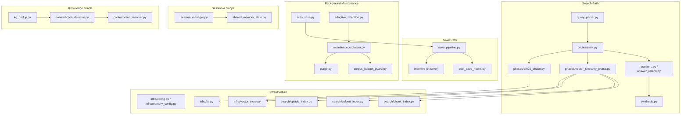
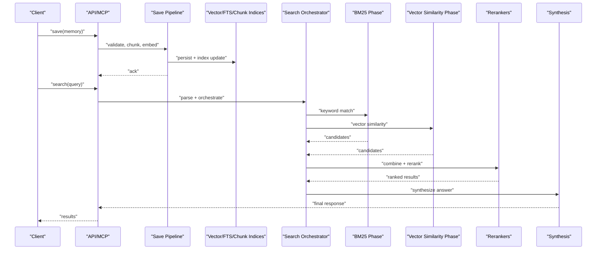
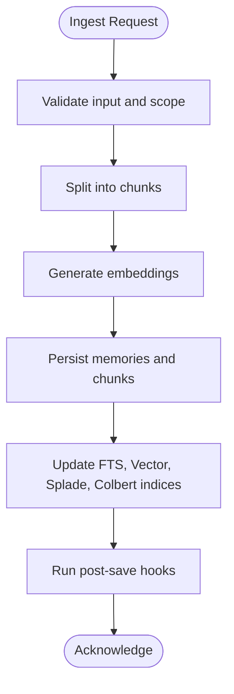
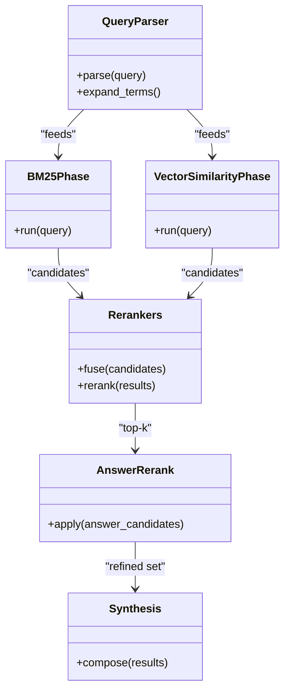
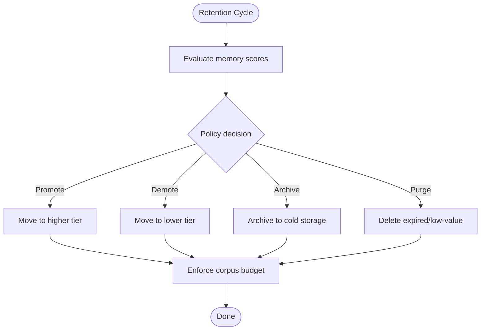
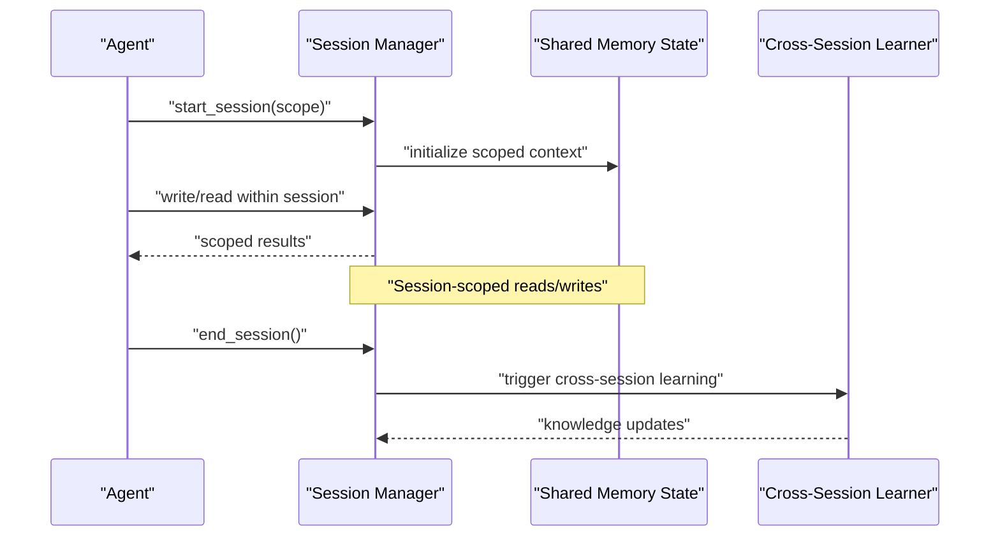
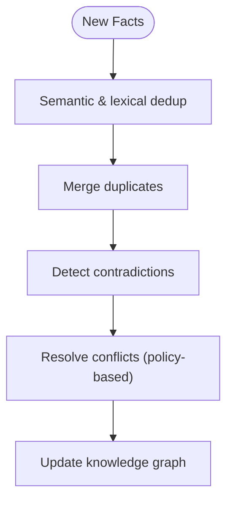
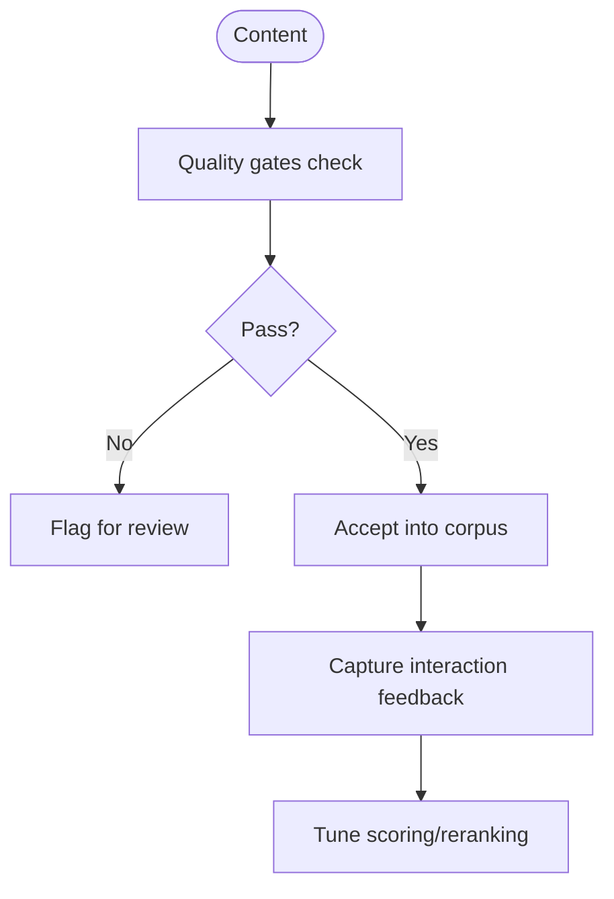
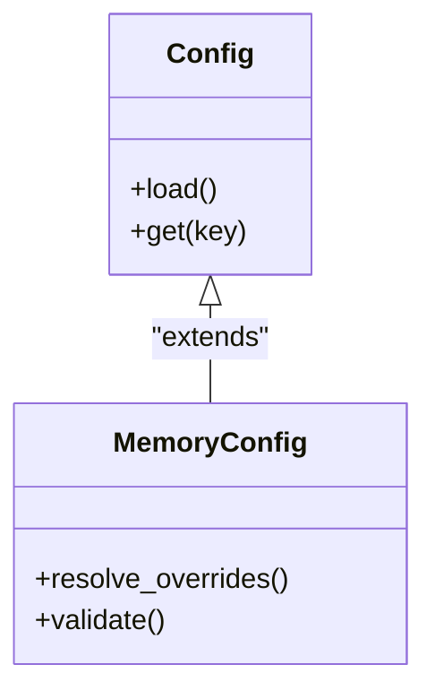

# Memory Management

<cite>
**Referenced Files in This Document**
- [memory_common.py](file://memory_common.py)
- [save_pipeline.py](file://save_pipeline.py)
- [search_pipeline.py](file://search_pipeline.py)
- [orchestrator.py](file://search/orchestrator.py)
- [phases/__init__.py](file://search/phases/__init__.py)
- [bm25_phase.py](file://search/phases/bm25_phase.py)
- [vector_similarity_phase.py](file://search/phases/vector_similarity_phase.py)
- [rerankers.py](file://search/rerankers.py)
- [answer_rerank.py](file://search/answer_rerank.py)
- [adaptive_retention.py](file://background/adaptive_retention.py)
- [auto_save.py](file://background/auto_save.py)
- [purge.py](file://background/purge.py)
- [retention_coordinator.py](file://background/retention_coordinator.py)
- [corpus_budget_guard.py](file://background/corpus_budget_guard.py)
- [session_manager.py](file://session_manager.py)
- [shared_memory_state.py](file://shared_memory_state.py)
- [cross_session_learn.py](file://cross_session_learn.py)
- [cron_cross_session_learn.py](file://cron/cron_cross_session_learn.py)
- [quality_gates.py](file://infra/quality_gates.py)
- [kg_dedup.py](file://kg/kg_dedup.py)
- [contradiction_detector.py](file://kg/contradiction_detector.py)
- [contradiction_resolver.py](file://kg/contradiction_resolver.py)
- [config.py](file://infra/config.py)
- [memory_config.py](file://infra/memory_config.py)
- [vector_store.py](file://infra/vector_store.py)
- [fts.py](file://infra/fts.py)
- [splade_index.py](file://search/splade_index.py)
- [colbert_index.py](file://search/colbert_index.py)
- [chunk_index.py](file://search/chunk_index.py)
- [enrichment.py](file://search/enrichment.py)
- [feedback.py](file://search/feedback.py)
- [scoring.py](file://search/scoring.py)
- [state.py](file://search/state.py)
- [synthesis.py](file://search/synthesis.py)
- [skill_lookup.py](file://search/skill_lookup.py)
- [query_parser.py](file://search/query_parser.py)
- [drift.py](file://search/drift.py)
- [budget_aware.py](file://search/budget_aware.py)
</cite>

## Table of Contents
1. [Introduction](#introduction)
2. [Project Structure](#project-structure)
3. [Core Components](#core-components)
4. [Architecture Overview](#architecture-overview)
5. [Detailed Component Analysis](#detailed-component-analysis)
6. [Dependency Analysis](#dependency-analysis)
7. [Performance Considerations](#performance-considerations)
8. [Troubleshooting Guide](#troubleshooting-guide)
9. [Conclusion](#conclusion)
10. [Appendices](#appendices)

## Introduction
This document explains memory management operations in Agentic Memory, focusing on the complete lifecycle from creation to archival. It covers saving strategies, indexing mechanisms, retrieval optimization, and a multi-phase search pipeline that combines BM25 keyword matching with vector similarity search. It also documents adaptive retention policies, automatic cleanup processes, performance tuning options, scoping and session management, cross-session learning, quality assessment, deduplication, and conflict resolution in distributed scenarios.

## Project Structure
The repository organizes memory-related functionality across several modules:
- Save path: ingestion, persistence, and post-save processing
- Search path: query parsing, multi-phase retrieval, reranking, synthesis
- Background maintenance: auto-save, retention, purging, budget guard
- Session and scope: scoping, shared state, session lifecycle
- Knowledge graph: deduplication, contradiction detection/resolution
- Infrastructure: configuration, vector store, full-text search, splade/colbert indices
- Cron jobs: scheduled tasks for cross-session learning and other maintenance

**Diagram sources**
- [save_pipeline.py](file://save_pipeline.py)
- [orchestrator.py](file://search/orchestrator.py)
- [bm25_phase.py](file://search/phases/bm25_phase.py)
- [vector_similarity_phase.py](file://search/phases/vector_similarity_phase.py)
- [rerankers.py](file://search/rerankers.py)
- [answer_rerank.py](file://search/answer_rerank.py)
- [auto_save.py](file://background/auto_save.py)
- [adaptive_retention.py](file://background/adaptive_retention.py)
- [purge.py](file://background/purge.py)
- [retention_coordinator.py](file://background/retention_coordinator.py)
- [corpus_budget_guard.py](file://background/corpus_budget_guard.py)
- [session_manager.py](file://session_manager.py)
- [shared_memory_state.py](file://shared_memory_state.py)
- [kg_dedup.py](file://kg/kg_dedup.py)
- [contradiction_detector.py](file://kg/contradiction_detector.py)
- [contradiction_resolver.py](file://kg/contradiction_resolver.py)
- [config.py](file://infra/config.py)
- [memory_config.py](file://infra/memory_config.py)
- [vector_store.py](file://infra/vector_store.py)
- [fts.py](file://infra/fts.py)
- [splade_index.py](file://search/splade_index.py)
- [colbert_index.py](file://search/colbert_index.py)
- [chunk_index.py](file://search/chunk_index.py)

**Section sources**
- [save_pipeline.py](file://save_pipeline.py)
- [search_pipeline.py](file://search_pipeline.py)
- [orchestrator.py](file://search/orchestrator.py)
- [bm25_phase.py](file://search/phases/bm25_phase.py)
- [vector_similarity_phase.py](file://search/phases/vector_similarity_phase.py)
- [auto_save.py](file://background/auto_save.py)
- [adaptive_retention.py](file://background/adaptive_retention.py)
- [purge.py](file://background/purge.py)
- [retention_coordinator.py](file://background/retention_coordinator.py)
- [corpus_budget_guard.py](file://background/corpus_budget_guard.py)
- [session_manager.py](file://session_manager.py)
- [shared_memory_state.py](file://shared_memory_state.py)
- [kg_dedup.py](file://kg/kg_dedup.py)
- [contradiction_detector.py](file://kg/contradiction_detector.py)
- [contradiction_resolver.py](file://kg/contradiction_resolver.py)
- [config.py](file://infra/config.py)
- [memory_config.py](file://infra/memory_config.py)
- [vector_store.py](file://infra/vector_store.py)
- [fts.py](file://infra/fts.py)
- [splade_index.py](file://search/splade_index.py)
- [colbert_index.py](file://search/colbert_index.py)
- [chunk_index.py](file://search/chunk_index.py)

## Core Components
- Save pipeline orchestrates ingestion, chunking, embedding/index updates, and post-save hooks.
- Search pipeline parses queries, executes multi-phase retrieval (BM25 + vector), reranks, and synthesizes answers.
- Background workers handle auto-save, adaptive retention, purging, and corpus budget enforcement.
- Session manager and shared state provide scoping and cross-process coordination.
- Knowledge graph components perform deduplication and resolve contradictions.
- Infrastructure provides configuration, vector storage, full-text search, and specialized indices (Splade, Colbert).

Key responsibilities:
- Ingestion and persistence: structured writes, idempotency, auditability
- Indexing: text, vectors, chunks, Splade, Colbert
- Retrieval: hybrid search, reranking, synthesis
- Lifecycle: retention, decay, purge, budget guard
- Quality: gates, feedback, drift monitoring
- Cross-session learning: periodic knowledge sharing

**Section sources**
- [memory_common.py](file://memory_common.py)
- [save_pipeline.py](file://save_pipeline.py)
- [search_pipeline.py](file://search_pipeline.py)
- [orchestrator.py](file://search/orchestrator.py)
- [adaptive_retention.py](file://background/adaptive_retention.py)
- [auto_save.py](file://background/auto_save.py)
- [purge.py](file://background/purge.py)
- [retention_coordinator.py](file://background/retention_coordinator.py)
- [corpus_budget_guard.py](file://background/corpus_budget_guard.py)
- [session_manager.py](file://session_manager.py)
- [shared_memory_state.py](file://shared_memory_state.py)
- [kg_dedup.py](file://kg/kg_dedup.py)
- [contradiction_detector.py](file://kg/contradiction_detector.py)
- [contradiction_resolver.py](file://kg/contradiction_resolver.py)
- [config.py](file://infra/config.py)
- [memory_config.py](file://infra/memory_config.py)
- [vector_store.py](file://infra/vector_store.py)
- [fts.py](file://infra/fts.py)
- [splade_index.py](file://search/splade_index.py)
- [colbert_index.py](file://search/colbert_index.py)
- [chunk_index.py](file://search/chunk_index.py)
- [quality_gates.py](file://infra/quality_gates.py)

## Architecture Overview
The system implements a clear separation between write and read paths, with background maintenance ensuring long-term health and relevance.

**Diagram sources**
- [save_pipeline.py](file://save_pipeline.py)
- [orchestrator.py](file://search/orchestrator.py)
- [bm25_phase.py](file://search/phases/bm25_phase.py)
- [vector_similarity_phase.py](file://search/phases/vector_similarity_phase.py)
- [rerankers.py](file://search/rerankers.py)
- [answer_rerank.py](file://search/answer_rerank.py)
- [synthesis.py](file://search/synthesis.py)

## Detailed Component Analysis

### Save Pipeline and Indexing
The save pipeline handles validation, chunking, embedding generation, and index updates. Post-save hooks can enrich metadata or trigger downstream tasks.

**Diagram sources**
- [save_pipeline.py](file://save_pipeline.py)
- [splade_index.py](file://search/splade_index.py)
- [colbert_index.py](file://search/colbert_index.py)
- [chunk_index.py](file://search/chunk_index.py)
- [fts.py](file://infra/fts.py)
- [vector_store.py](file://infra/vector_store.py)

**Section sources**
- [save_pipeline.py](file://save_pipeline.py)
- [splade_index.py](file://search/splade_index.py)
- [colbert_index.py](file://search/colbert_index.py)
- [chunk_index.py](file://search/chunk_index.py)
- [fts.py](file://infra/fts.py)
- [vector_store.py](file://infra/vector_store.py)

### Multi-Phase Search Pipeline
The search pipeline composes multiple phases to balance recall and precision:
- Query parsing normalizes and expands queries
- BM25 phase retrieves keyword-matched candidates
- Vector similarity phase retrieves semantically similar candidates
- Reranking fuses and reorders results
- Synthesis produces final answers

**Diagram sources**
- [query_parser.py](file://search/query_parser.py)
- [bm25_phase.py](file://search/phases/bm25_phase.py)
- [vector_similarity_phase.py](file://search/phases/vector_similarity_phase.py)
- [rerankers.py](file://search/rerankers.py)
- [answer_rerank.py](file://search/answer_rerank.py)
- [synthesis.py](file://search/synthesis.py)

**Section sources**
- [search_pipeline.py](file://search_pipeline.py)
- [orchestrator.py](file://search/orchestrator.py)
- [bm25_phase.py](file://search/phases/bm25_phase.py)
- [vector_similarity_phase.py](file://search/phases/vector_similarity_phase.py)
- [rerankers.py](file://search/rerankers.py)
- [answer_rerank.py](file://search/answer_rerank.py)
- [synthesis.py](file://search/synthesis.py)
- [query_parser.py](file://search/query_parser.py)

### Adaptive Retention and Automatic Cleanup
Adaptive retention evaluates memory importance over time and adjusts scores based on usage, recency, and domain signals. The coordinator schedules retention actions and enforces corpus budgets. Purge removes expired or low-value items. Auto-save ensures durability by persisting incremental changes.

**Diagram sources**
- [adaptive_retention.py](file://background/adaptive_retention.py)
- [retention_coordinator.py](file://background/retention_coordinator.py)
- [purge.py](file://background/purge.py)
- [corpus_budget_guard.py](file://background/corpus_budget_guard.py)
- [auto_save.py](file://background/auto_save.py)

**Section sources**
- [adaptive_retention.py](file://background/adaptive_retention.py)
- [retention_coordinator.py](file://background/retention_coordinator.py)
- [purge.py](file://background/purge.py)
- [corpus_budget_guard.py](file://background/corpus_budget_guard.py)
- [auto_save.py](file://background/auto_save.py)

### Scoping and Session Management
Scoping isolates memories per agent, tenant, or project. Sessions encapsulate short-lived context and enable cross-session learning through periodic consolidation.

**Diagram sources**
- [session_manager.py](file://session_manager.py)
- [shared_memory_state.py](file://shared_memory_state.py)
- [cross_session_learn.py](file://cross_session_learn.py)
- [cron_cross_session_learn.py](file://cron/cron_cross_session_learn.py)

**Section sources**
- [session_manager.py](file://session_manager.py)
- [shared_memory_state.py](file://shared_memory_state.py)
- [cross_session_learn.py](file://cross_session_learn.py)
- [cron_cross_session_learn.py](file://cron/cron_cross_session_learn.py)

### Knowledge Graph Deduplication and Conflict Resolution
Deduplication identifies near-duplicate facts and merges them. Contradiction detection flags conflicting assertions; the resolver applies policies to reconcile differences.

**Diagram sources**
- [kg_dedup.py](file://kg/kg_dedup.py)
- [contradiction_detector.py](file://kg/contradiction_detector.py)
- [contradiction_resolver.py](file://kg/contradiction_resolver.py)

**Section sources**
- [kg_dedup.py](file://kg/kg_dedup.py)
- [contradiction_detector.py](file://kg/contradiction_detector.py)
- [contradiction_resolver.py](file://kg/contradiction_resolver.py)

### Memory Quality Assessment and Feedback
Quality gates evaluate content integrity, relevance, and consistency. Feedback loops capture user interactions to improve ranking and retrieval.

**Diagram sources**
- [quality_gates.py](file://infra/quality_gates.py)
- [feedback.py](file://search/feedback.py)
- [scoring.py](file://search/scoring.py)

**Section sources**
- [quality_gates.py](file://infra/quality_gates.py)
- [feedback.py](file://search/feedback.py)
- [scoring.py](file://search/scoring.py)

### Configuration and Tuning
Configuration controls model selection, index parameters, retention thresholds, and search behavior.

**Diagram sources**
- [config.py](file://infra/config.py)
- [memory_config.py](file://infra/memory_config.py)

**Section sources**
- [config.py](file://infra/config.py)
- [memory_config.py](file://infra/memory_config.py)

## Dependency Analysis
The following diagram shows key dependencies among core modules.

```mermaid
graph TB
Save["save_pipeline.py"] --> FTS["infra/fts.py"]
Save --> VS["infra/vector_store.py"]
Save --> Splade["search/splade_index.py"]
Save --> Colbert["search/colbert_index.py"]
Save --> ChunkIdx["search/chunk_index.py"]
Search["search/orchestrator.py"] --> BM25["search/phases/bm25_phase.py"]
Search --> VecPh["search/phases/vector_similarity_phase.py"]
Search --> Rerank["search/rerankers.py"]
Search --> AnsRR["search/answer_rerank.py"]
Search --> Synth["search/synthesis.py"]
BM25 --> FTS
VecPh --> VS
VecPh --> Splade
VecPh --> Colbert
VecPh --> ChunkIdx
Ret["background/adaptive_retention.py"] --> Coord["background/retention_coordinator.py"]
Coord --> Purge["background/purge.py"]
Coord --> Budget["background/corpus_budget_guard.py"]
Session["session_manager.py"] --> Shared["shared_memory_state.py"]
Cross["cross_session_learn.py"] --> CronCSL["cron/cron_cross_session_learn.py"]
KG["kg/kg_dedup.py"] --> Det["kg/contradiction_detector.py"]
Det --> Res["kg/contradiction_resolver.py"]
```

**Diagram sources**
- [save_pipeline.py](file://save_pipeline.py)
- [fts.py](file://infra/fts.py)
- [vector_store.py](file://infra/vector_store.py)
- [splade_index.py](file://search/splade_index.py)
- [colbert_index.py](file://search/colbert_index.py)
- [chunk_index.py](file://search/chunk_index.py)
- [orchestrator.py](file://search/orchestrator.py)
- [bm25_phase.py](file://search/phases/bm25_phase.py)
- [vector_similarity_phase.py](file://search/phases/vector_similarity_phase.py)
- [rerankers.py](file://search/rerankers.py)
- [answer_rerank.py](file://search/answer_rerank.py)
- [synthesis.py](file://search/synthesis.py)
- [adaptive_retention.py](file://background/adaptive_retention.py)
- [retention_coordinator.py](file://background/retention_coordinator.py)
- [purge.py](file://background/purge.py)
- [corpus_budget_guard.py](file://background/corpus_budget_guard.py)
- [session_manager.py](file://session_manager.py)
- [shared_memory_state.py](file://shared_memory_state.py)
- [cross_session_learn.py](file://cross_session_learn.py)
- [cron_cross_session_learn.py](file://cron/cron_cross_session_learn.py)
- [kg_dedup.py](file://kg/kg_dedup.py)
- [contradiction_detector.py](file://kg/contradiction_detector.py)
- [contradiction_resolver.py](file://kg/contradiction_resolver.py)

**Section sources**
- [save_pipeline.py](file://save_pipeline.py)
- [orchestrator.py](file://search/orchestrator.py)
- [bm25_phase.py](file://search/phases/bm25_phase.py)
- [vector_similarity_phase.py](file://search/phases/vector_similarity_phase.py)
- [adaptive_retention.py](file://background/adaptive_retention.py)
- [retention_coordinator.py](file://background/retention_coordinator.py)
- [purge.py](file://background/purge.py)
- [corpus_budget_guard.py](file://background/corpus_budget_guard.py)
- [session_manager.py](file://session_manager.py)
- [shared_memory_state.py](file://shared_memory_state.py)
- [cross_session_learn.py](file://cross_session_learn.py)
- [cron_cross_session_learn.py](file://cron/cron_cross_session_learn.py)
- [kg_dedup.py](file://kg/kg_dedup.py)
- [contradiction_detector.py](file://kg/contradiction_detector.py)
- [contradiction_resolver.py](file://kg/contradiction_resolver.py)

## Performance Considerations
- Indexing strategy:
  - Use chunking to balance granularity and overhead
  - Maintain separate indices for BM25, Splade, Colbert, and dense vectors to optimize different query types
- Retrieval optimization:
  - Combine BM25 and vector similarity early to maximize recall
  - Apply reranking only to top-k candidates to reduce cost
  - Leverage enrichment and skill lookup to boost relevant hits
- Budget-aware retrieval:
  - Enforce corpus budget limits to prevent oversized result sets
- Drift handling:
  - Monitor embedding drift and schedule recomputation when necessary
- Caching and state:
  - Cache frequent query expansions and reranker outputs where appropriate
- Concurrency:
  - Ensure idempotent saves and atomic index updates to avoid contention

[No sources needed since this section provides general guidance]

## Troubleshooting Guide
Common issues and diagnostics:
- Stale or missing indices:
  - Verify index backfills and rebuilds for FTS, Splade, Colbert, and vector stores
- High latency in search:
  - Check reranker configuration and candidate set sizes
  - Review budget-aware settings and pruning thresholds
- Retention anomalies:
  - Inspect retention policy thresholds and coordinator scheduling
  - Confirm purge runs completed successfully
- Cross-session learning failures:
  - Validate cron job execution and learner inputs
- Quality degradation:
  - Review quality gate thresholds and feedback-driven tuning

**Section sources**
- [splade_index.py](file://search/splade_index.py)
- [colbert_index.py](file://search/colbert_index.py)
- [chunk_index.py](file://search/chunk_index.py)
- [fts.py](file://infra/fts.py)
- [vector_store.py](file://infra/vector_store.py)
- [rerankers.py](file://search/rerankers.py)
- [budget_aware.py](file://search/budget_aware.py)
- [adaptive_retention.py](file://background/adaptive_retention.py)
- [retention_coordinator.py](file://background/retention_coordinator.py)
- [purge.py](file://background/purge.py)
- [cross_session_learn.py](file://cross_session_learn.py)
- [cron_cross_session_learn.py](file://cron/cron_cross_session_learn.py)
- [quality_gates.py](file://infra/quality_gates.py)

## Conclusion
Agentic Memory’s architecture separates ingestion, indexing, retrieval, and maintenance into cohesive modules. The multi-phase search pipeline balances keyword and semantic recall, while adaptive retention and automated cleanup keep the corpus healthy. Scoping and sessions isolate context, and cross-session learning enables knowledge sharing. Quality gates, deduplication, and contradiction resolution ensure reliability and trustworthiness. With careful configuration and performance tuning, the system scales to large corpora while maintaining responsiveness and accuracy.

[No sources needed since this section summarizes without analyzing specific files]

## Appendices

### Practical Examples

- Memory scoping:
  - Initialize a session with a defined scope and perform scoped reads/writes
  - Reference: [session_manager.py](file://session_manager.py), [shared_memory_state.py](file://shared_memory_state.py)

- Session management:
  - Start/end sessions and persist intermediate state
  - Reference: [session_manager.py](file://session_manager.py)

- Cross-session learning:
  - Trigger periodic learning to propagate insights across sessions
  - Reference: [cross_session_learn.py](file://cross_session_learn.py), [cron/cron_cross_session_learn.py](file://cron/cron_cross_session_learn.py)

- Saving and indexing:
  - Save memories and ensure indices are updated
  - Reference: [save_pipeline.py](file://save_pipeline.py), [splade_index.py](file://search/splade_index.py), [colbert_index.py](file://search/colbert_index.py), [chunk_index.py](file://search/chunk_index.py), [fts.py](file://infra/fts.py), [vector_store.py](file://infra/vector_store.py)

- Hybrid search:
  - Execute BM25 and vector similarity phases, then rerank and synthesize
  - Reference: [orchestrator.py](file://search/orchestrator.py), [bm25_phase.py](file://search/phases/bm25_phase.py), [vector_similarity_phase.py](file://search/phases/vector_similarity_phase.py), [rerankers.py](file://search/rerankers.py), [answer_rerank.py](file://search/answer_rerank.py), [synthesis.py](file://search/synthesis.py)

- Retention and cleanup:
  - Configure adaptive retention and run purges
  - Reference: [adaptive_retention.py](file://background/adaptive_retention.py), [retention_coordinator.py](file://background/retention_coordinator.py), [purge.py](file://background/purge.py), [corpus_budget_guard.py](file://background/corpus_budget_guard.py)

- Quality and conflict handling:
  - Apply quality gates and resolve contradictions
  - Reference: [quality_gates.py](file://infra/quality_gates.py), [kg_dedup.py](file://kg/kg_dedup.py), [contradiction_detector.py](file://kg/contradiction_detector.py), [contradiction_resolver.py](file://kg/contradiction_resolver.py)

**Section sources**
- [session_manager.py](file://session_manager.py)
- [shared_memory_state.py](file://shared_memory_state.py)
- [cross_session_learn.py](file://cross_session_learn.py)
- [cron_cross_session_learn.py](file://cron/cron_cross_session_learn.py)
- [save_pipeline.py](file://save_pipeline.py)
- [splade_index.py](file://search/splade_index.py)
- [colbert_index.py](file://search/colbert_index.py)
- [chunk_index.py](file://search/chunk_index.py)
- [fts.py](file://infra/fts.py)
- [vector_store.py](file://infra/vector_store.py)
- [orchestrator.py](file://search/orchestrator.py)
- [bm25_phase.py](file://search/phases/bm25_phase.py)
- [vector_similarity_phase.py](file://search/phases/vector_similarity_phase.py)
- [rerankers.py](file://search/rerankers.py)
- [answer_rerank.py](file://search/answer_rerank.py)
- [synthesis.py](file://search/synthesis.py)
- [adaptive_retention.py](file://background/adaptive_retention.py)
- [retention_coordinator.py](file://background/retention_coordinator.py)
- [purge.py](file://background/purge.py)
- [corpus_budget_guard.py](file://background/corpus_budget_guard.py)
- [quality_gates.py](file://infra/quality_gates.py)
- [kg_dedup.py](file://kg/kg_dedup.py)
- [contradiction_detector.py](file://kg/contradiction_detector.py)
- [contradiction_resolver.py](file://kg/contradiction_resolver.py)